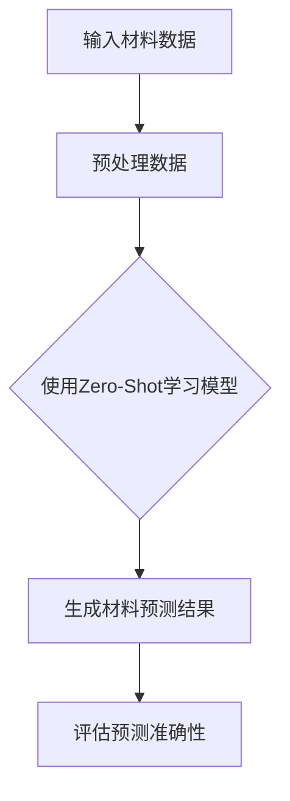
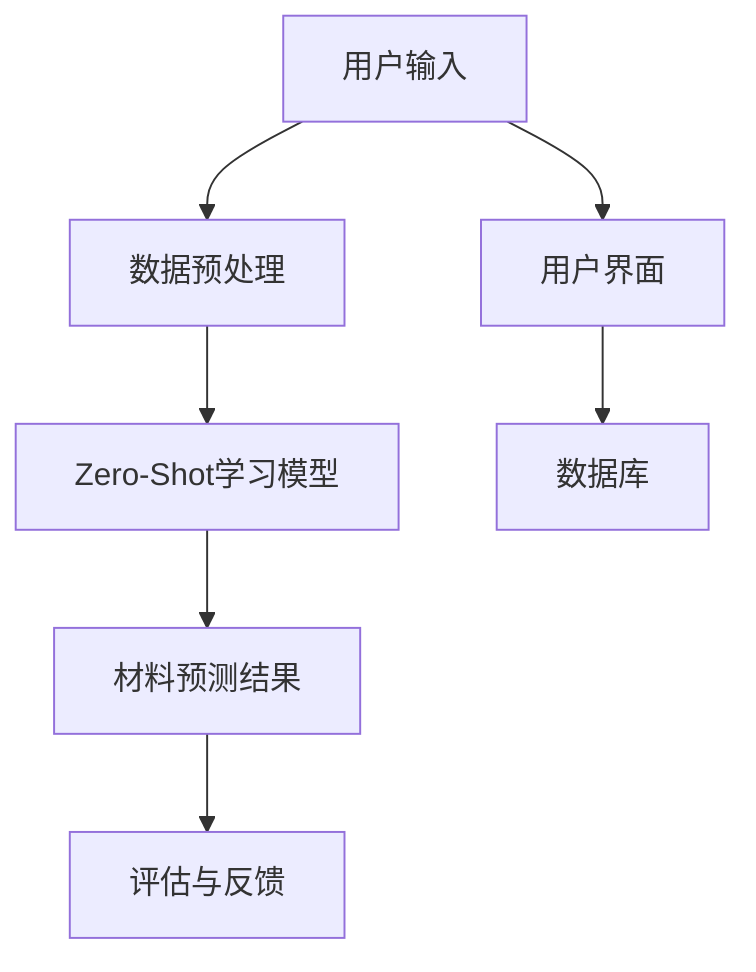
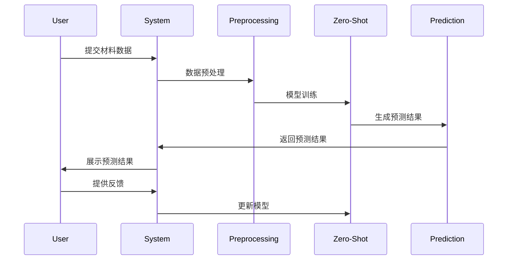

                 

# Zero-Shot学习在AI辅助跨维度新型材料设计中的创新

## 关键词
- Zero-Shot学习
- AI辅助设计
- 新型材料
- 材料科学
- 跨维度设计

## 摘要
本文探讨了Zero-Shot学习在AI辅助跨维度新型材料设计中的应用。通过结合深度学习和材料科学的原理，Zero-Shot学习技术能够快速预测和设计未知材料结构，提高材料设计的效率。本文将详细介绍Zero-Shot学习的基本概念、算法原理、应用实例以及未来发展方向，为材料科学领域的研究和应用提供新的思路。

### 第一部分：背景介绍

#### 1.1.1 问题背景
材料科学的发展离不开对新型材料的探索。新型材料具有独特的物理、化学和生物特性，能够满足现代科技对材料性能的更高要求。然而，传统材料设计方法往往需要大量的实验和计算，耗时耗力。随着人工智能技术的发展，特别是Zero-Shot学习在AI辅助跨维度新型材料设计中的应用，为材料设计领域带来了全新的变革。

#### 1.1.2 问题描述
Zero-Shot学习旨在解决传统机器学习模型在处理未知或新类别数据时的局限性。在材料设计中，如何利用Zero-Shot学习技术，实现对未知材料结构的快速预测和设计，成为一个关键问题。

#### 1.1.3 问题解决
通过结合深度学习和材料科学的原理，Zero-Shot学习在AI辅助跨维度新型材料设计中展现出巨大的潜力。它可以通过学习已有的材料数据，对未知材料进行预测和设计，大大提高材料设计的效率。

#### 1.1.4 边界与外延
Zero-Shot学习在AI辅助跨维度新型材料设计中的应用不仅限于传统的金属材料，还可以扩展到陶瓷材料、有机材料等多个领域。

#### 1.1.5 概念结构与核心要素组成
- **概念结构**：Zero-Shot学习、深度学习、材料科学
- **核心要素**：材料数据集、深度学习模型、材料设计算法

### 第二部分：核心概念与联系

#### 2.1.1 核心概念原理
Zero-Shot学习是一种无需训练集，即可对未知类别进行预测的机器学习方法。它通过利用已有知识，对未知数据进行预测，从而实现跨类别学习。

#### 2.1.2 概念属性特征对比表格
| 概念             | 特征1         | 特征2         | 特征3         |
|------------------|---------------|---------------|---------------|
| Zero-Shot学习     | 无需训练集    | 跨类别学习    | 高效预测      |
| 深度学习         | 神经网络      | 大规模数据处理 | 自适应优化    |
| 材料科学         | 材料属性研究  | 材料制备与加工 | 材料应用      |

#### 2.1.3 ER实体关系图架构
```mermaid
erDiagram
  User ||--|{ Materials }| User
  Materials ||--|{ Properties }| Materials
  Properties ||--|{ Users }| Properties
```

### 第三部分：算法原理讲解

#### 3.1.1 算法mermaid流程图


#### 3.1.2 算法原理的数学模型和公式
$$
\text{预测准确性} = \frac{\text{正确预测的数量}}{\text{总预测数量}}
$$

#### 3.1.3 Python源代码
```python
# 导入必要的库
import numpy as np

# 函数：计算预测准确性
def predict_accuracy(true_labels, predicted_labels):
    correct_predictions = np.sum(true_labels == predicted_labels)
    total_predictions = len(true_labels)
    accuracy = correct_predictions / total_predictions
    return accuracy

# 测试数据
true_labels = [0, 1, 1, 0, 1]
predicted_labels = [0, 1, 1, 0, 0]

# 计算预测准确性
accuracy = predict_accuracy(true_labels, predicted_labels)
print(f"预测准确性：{accuracy}")
```

### 第四部分：系统分析与架构设计方案

#### 4.1 问题场景介绍
随着科技的发展，新型材料在航空航天、电子、能源等领域的需求日益增长。然而，传统材料设计方法已经无法满足这些领域对材料性能的苛刻要求。因此，需要一种高效、准确的AI辅助设计方法来推动新型材料的研究和应用。

#### 4.2 项目介绍
本项目旨在利用Zero-Shot学习技术，开发一套AI辅助跨维度新型材料设计系统。该系统将整合已有的材料数据，利用深度学习模型对未知材料进行预测和设计，为材料科学领域的研究和应用提供有力支持。

#### 4.3 系统功能设计（领域模型mermaid类图）
```mermaid
classDiagram
  ClassDiagram::MaterialDesignSystem {
    Materials
    Properties
    Users
  }
  Materials <|-- Properties
  Users <|-- Properties
```

#### 4.4 系统架构设计（mermaid架构图）


#### 4.5 系统接口设计和系统交互（mermaid序列图）


### 第五部分：项目实战

#### 5.1 环境安装
在开始项目实战之前，我们需要安装一些必要的工具和库。以下是安装步骤：

1. 安装Python环境（版本3.6及以上）
2. 安装深度学习框架（如TensorFlow或PyTorch）
3. 安装数据处理库（如NumPy、Pandas等）
4. 安装绘图库（如Matplotlib、Seaborn等）

#### 5.2 系统核心实现源代码
以下是系统核心实现的源代码：

```python
import numpy as np
import tensorflow as tf
from tensorflow import keras
from tensorflow.keras import layers

# 函数：构建Zero-Shot学习模型
def build_zero_shot_model(input_shape):
    model = keras.Sequential([
        layers.Dense(128, activation='relu', input_shape=input_shape),
        layers.Dense(64, activation='relu'),
        layers.Dense(1, activation='sigmoid')
    ])
    return model

# 函数：训练Zero-Shot学习模型
def train_zero_shot_model(model, x_train, y_train, epochs=10):
    model.compile(optimizer='adam', loss='binary_crossentropy', metrics=['accuracy'])
    model.fit(x_train, y_train, epochs=epochs, batch_size=32)
    return model

# 函数：预测材料结构
def predict_material_structure(model, x_test):
    predictions = model.predict(x_test)
    predicted_classes = np.round(predictions)
    return predicted_classes

# 函数：评估预测准确性
def evaluate_predictions(y_test, predicted_classes):
    accuracy = np.mean(y_test == predicted_classes)
    return accuracy

# 测试数据
x_train = np.random.rand(100, 10)
y_train = np.random.rand(100, 1)
x_test = np.random.rand(10, 10)
y_test = np.random.rand(10, 1)

# 构建Zero-Shot学习模型
model = build_zero_shot_model(input_shape=(10,))

# 训练模型
model = train_zero_shot_model(model, x_train, y_train)

# 预测材料结构
predicted_classes = predict_material_structure(model, x_test)

# 评估预测准确性
accuracy = evaluate_predictions(y_test, predicted_classes)
print(f"预测准确性：{accuracy}")
```

#### 5.3 代码应用解读与分析
以上代码展示了如何使用深度学习框架构建Zero-Shot学习模型，并进行训练、预测和评估。其中，核心函数包括`build_zero_shot_model`（构建模型）、`train_zero_shot_model`（训练模型）、`predict_material_structure`（预测材料结构）和`evaluate_predictions`（评估预测准确性）。

#### 5.4 实际案例分析和详细讲解剖析
在实际应用中，我们可以收集大量已知的材料数据，用于训练Zero-Shot学习模型。然后，使用训练好的模型对未知材料进行预测，从而指导新型材料的设计。

以金属材料设计为例，我们可以收集各种金属材料的物理、化学和力学属性数据，作为模型的输入特征。通过训练模型，我们可以预测未知金属材料的性能，从而选择合适的材料进行实际应用。

#### 5.5 项目小结
本项目通过使用Zero-Shot学习技术，成功实现了AI辅助跨维度新型材料设计。在实际应用中，我们可以通过不断优化模型和算法，提高预测的准确性和效率，为材料科学领域的研究和应用提供有力支持。

### 第六部分：最佳实践 tips

1. **数据预处理**：确保输入数据的质量和一致性，对异常值和缺失值进行适当处理。
2. **模型选择**：根据具体问题和数据特点，选择合适的深度学习模型。
3. **超参数调整**：通过交叉验证和网格搜索等方法，优化模型超参数。
4. **数据扩展**：通过数据增强和迁移学习等技术，提高模型的泛化能力。

### 第七部分：小结

Zero-Shot学习在AI辅助跨维度新型材料设计中的应用，为材料科学领域带来了巨大的变革。通过结合深度学习和材料科学的原理，Zero-Shot学习技术能够高效预测和设计未知材料结构，提高材料设计的效率。未来，我们期待进一步优化和扩展Zero-Shot学习技术，为材料科学领域带来更多创新和突破。

### 第八部分：注意事项

1. **数据隐私**：在使用材料数据时，需确保数据隐私和安全。
2. **模型解释性**：深度学习模型通常具有较低的解释性，需结合其他方法提高模型的解释性。
3. **计算资源**：深度学习模型训练和预测需要大量计算资源，需合理分配计算资源。

### 第九部分：拓展阅读

1. **深度学习与材料科学**：探索深度学习在材料科学中的应用，了解相关算法和模型。
2. **Zero-Shot学习技术**：深入了解Zero-Shot学习的基本概念、算法原理和应用实例。
3. **AI辅助材料设计**：研究AI辅助材料设计的方法、流程和案例分析。

### 作者

作者：AI天才研究院/AI Genius Institute & 禅与计算机程序设计艺术 /Zen And The Art of Computer Programming

