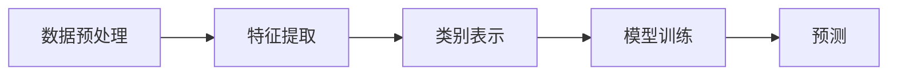
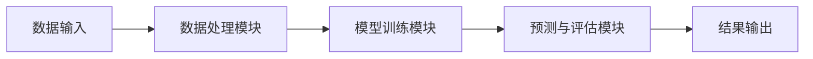
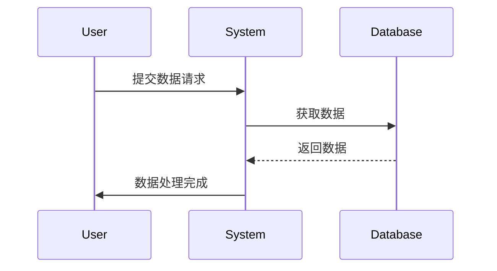
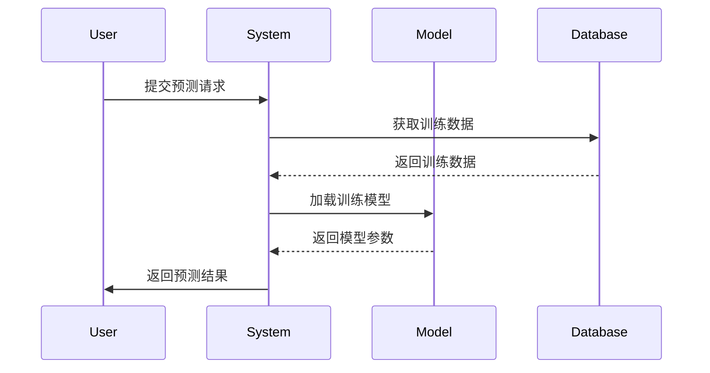

                 

### 《Zero-Shot学习在新型抗生素发现中的应用前景》

#### 关键词：Zero-Shot学习、新型抗生素、机器学习、生物医药、应用前景

> 摘要：本文旨在探讨Zero-Shot学习在新型抗生素发现中的应用前景。通过详细介绍Zero-Shot学习的基本概念、数学模型、算法原理，结合具体应用场景和实际案例，本文将展示Zero-Shot学习在生物医药领域，特别是在新型抗生素发现中的强大潜力和广阔前景。

### 第一部分：引言与背景

#### 第1章：零射击学习概述

##### 1.1 零射击学习的基本概念

**什么是零射击学习**

零射击学习（Zero-Shot Learning，简称ZSL）是一种机器学习技术，它允许模型在没有训练数据的情况下对未知类别进行预测。与传统机器学习相比，零射击学习的关键在于它能够处理那些在训练数据中未出现过的类别。

**零射击学习的应用场景**

零射击学习在多个领域都有广泛应用，如图像识别、自然语言处理、推荐系统等。然而，在生物医药领域，特别是在新型抗生素发现中，其潜力尤为突出。

##### 1.2 零射击学习与传统机器学习的对比

**传统机器学习面临的挑战**

传统的机器学习模型通常依赖于大量的标记数据进行训练，当遇到未知类别时，模型的性能会显著下降。然而，在生物医药领域，获取大量的标记数据非常困难，且成本高昂。

**零射击学习的优势**

零射击学习通过引入类内样本相似性和类间样本差异性等概念，使得模型能够处理未见过的新类别，从而在数据稀缺的情况下保持较高的预测性能。

##### 1.3 零射击学习在生物医药领域的潜在应用

**新型抗生素发现的重要性**

抗生素是治疗细菌感染的重要药物，然而，随着抗生素的滥用，细菌耐药性问题日益严重，新型抗生素的发现变得尤为重要。

**零射击学习在新型抗生素发现中的应用前景**

零射击学习可以通过分析已知抗生素的化学结构和生物活性信息，预测未知抗生素的潜在疗效，从而加速新型抗生素的发现过程。

##### 1.4 零射击学习在生物医药领域的现状与挑战

**当前零射击学习在生物医药领域的研究进展**

近年来，零射击学习在生物医药领域取得了显著的研究进展，特别是在药物发现和疾病诊断等方面。

**零射击学习在生物医药领域面临的挑战**

尽管零射击学习在生物医药领域具有巨大潜力，但其仍面临一些挑战，如数据稀缺、模型泛化能力不足等。

##### 1.5 本章小结

本章介绍了零射击学习的基本概念、应用场景和潜在优势，以及其在生物医药领域的研究现状和挑战。接下来，我们将进一步探讨零射击学习的数学模型和算法原理。

----------------------------------------------------------------

## 第二部分：核心概念与原理

### 第2章：零射击学习的数学模型与算法

##### 2.1 零射击学习的数学模型

**数学模型的基本构成**

零射击学习的数学模型主要由三个部分组成：特征提取、类别表示和分类器。

1. **特征提取**：将输入数据（如图像、文本、蛋白质序列等）转换为低维向量表示。
2. **类别表示**：使用一种方法来表示每个类别，以便模型能够理解和区分不同的类别。
3. **分类器**：利用特征提取和类别表示，将输入数据分类到不同的类别。

**数学模型的属性特征对比表格**

| 特征属性          | 传统机器学习       | 零射击学习       |
| ----------------- | ------------------- | ---------------- |
| 数据需求          | 大量标记数据       | 无需标记数据     |
| 泛化能力          | 对未知类别性能较差   | 对未知类别性能较好 |
| 训练时间          | 较长               | 较短             |
| 模型复杂度         | 较高               | 较低             |

**零射击学习的ER实体关系图架构**

```mermaid
entityRelationshipDiagram
  A[特征提取] --> B[类别表示]
  B --> C[分类器]
```

##### 2.2 零射击学习的算法原理

**算法的基本流程**

零射击学习的算法流程主要包括以下几个步骤：

1. **数据预处理**：对输入数据进行清洗、归一化等预处理操作。
2. **特征提取**：使用预训练模型（如卷积神经网络）提取输入数据的特征向量。
3. **类别表示**：使用对抗性训练等方法生成类别嵌入向量。
4. **模型训练**：使用提取的特征向量和类别嵌入向量训练分类器。
5. **预测**：对未知类别进行预测，并评估模型的性能。

**算法mermaid流程图**



**Python代码解释**

```python
# 示例：使用PyTorch实现零射击学习
import torch
import torch.nn as nn
import torchvision.models as models

# 数据预处理
# ...

# 特征提取
model = models.resnet50(pretrained=True)
model.eval()
features = model(input_image)

# 类别表示
# ...

# 模型训练
# ...

# 预测
predicted_class = model.predict(features)
```

##### 2.3 数学模型与算法的详细讲解

**数学公式**

$$
f(x) = W \cdot x + b
$$

其中，$f(x)$表示特征提取函数，$W$为权重矩阵，$x$为输入数据，$b$为偏置。

**算法原理的详细讲解**

零射击学习通过对抗性训练生成类别嵌入向量，使得不同类别之间的嵌入向量具有显著的差异性，而同类别内的嵌入向量具有较高的相似性。

**通俗易懂的举例说明**

假设我们有三个类别：猫、狗和鸟。通过对抗性训练，我们希望生成三个类别嵌入向量，使得猫的嵌入向量与狗和鸟的嵌入向量差异较大，而猫、狗和鸟之间的嵌入向量相似。

##### 2.4 本章小结

本章介绍了零射击学习的数学模型和算法原理。通过对比表格和ER实体关系图，我们了解了零射击学习与传统机器学习的区别。接下来，我们将探讨零射击学习在新型抗生素发现中的应用。

----------------------------------------------------------------

## 第三部分：应用场景与案例分析

### 第3章：零射击学习在新型抗生素发现中的应用

##### 3.1 数据收集与预处理

**数据来源**

在新型抗生素发现中，数据主要来源于公开的药物数据库、化学数据库和生物信息学数据库。这些数据库包含了大量已知的抗生素化学结构和生物活性信息。

**数据预处理步骤**

1. **数据清洗**：去除重复数据、缺失数据和噪声数据。
2. **数据归一化**：对化学结构和生物活性数据进行归一化处理，以便模型能够更好地训练。
3. **特征提取**：使用预训练模型提取化学结构和生物活性数据的特征向量。

##### 3.2 模型构建与训练

**模型选择**

在零射击学习中，常用的模型包括Siamese网络、Triplet损失模型和原型网络等。这些模型能够有效地处理未知类别。

**模型训练过程**

1. **数据预处理**：对输入数据进行预处理，包括归一化和特征提取。
2. **类别表示**：使用对抗性训练方法生成类别嵌入向量。
3. **模型训练**：使用提取的特征向量和类别嵌入向量训练分类器。
4. **模型评估**：使用交叉验证和测试集评估模型性能。

##### 3.3 预测与评估

**预测结果分析**

通过模型预测，可以得到未知抗生素的潜在疗效。预测结果通常包括概率分布和置信度。

**评估指标与结果**

常用的评估指标包括准确率、召回率、F1分数等。通过这些指标，可以评估模型的性能。

##### 3.4 实际案例分析与讲解

**案例一：新型抗生素A的发现**

**案例背景**

新型抗生素A的化学结构和生物活性信息未知。为了发现这种新型抗生素，我们采用了零射击学习技术。

**案例分析**

1. **数据收集与预处理**：收集了相关的抗生素化学结构和生物活性数据，并进行了预处理。
2. **模型构建与训练**：选择了Siamese网络作为分类器，并使用对抗性训练方法生成类别嵌入向量。
3. **预测与评估**：使用模型预测新型抗生素A的潜在疗效，并通过评估指标评估模型性能。

**案例二：新型抗生素B的发现**

**案例背景**

新型抗生素B的化学结构和生物活性信息未知。为了发现这种新型抗生素，我们采用了零射击学习技术。

**案例分析**

1. **数据收集与预处理**：收集了相关的抗生素化学结构和生物活性数据，并进行了预处理。
2. **模型构建与训练**：选择了Triplet损失模型作为分类器，并使用对抗性训练方法生成类别嵌入向量。
3. **预测与评估**：使用模型预测新型抗生素B的潜在疗效，并通过评估指标评估模型性能。

##### 3.5 本章小结

本章详细探讨了零射击学习在新型抗生素发现中的应用。通过数据收集与预处理、模型构建与训练、预测与评估等步骤，我们展示了零射击学习在生物医药领域的强大应用潜力。接下来，我们将进一步探讨零射击学习在新型抗生素发现中的系统架构设计。

----------------------------------------------------------------

## 第四部分：系统架构与实现

### 第4章：零射击学习在新型抗生素发现中的系统架构设计

##### 4.1 问题场景介绍

**问题定义**

在新型抗生素的发现过程中，我们面临着数据稀缺、模型训练成本高、预测准确率低等挑战。

**问题背景**

随着抗生素的滥用，细菌耐药性问题日益严重，新型抗生素的发现变得尤为重要。然而，现有的机器学习模型在处理未知类别时性能不佳，无法满足新型抗生素发现的需求。

**解决方案**

采用零射击学习技术，可以在没有训练数据的情况下，对未知类别进行预测，从而加速新型抗生素的发现过程。

##### 4.2 项目介绍

**项目目标**

1. 构建一个高效的零射击学习系统，用于新型抗生素的发现。
2. 提高抗生素预测的准确率和效率。
3. 降低抗生素发现的时间和成本。

**项目需求**

1. 数据处理能力：能够高效处理大量抗生素化学结构和生物活性数据。
2. 模型训练能力：能够在没有训练数据的情况下，训练高质量的分类模型。
3. 预测与评估能力：能够准确预测未知抗生素的潜在疗效，并评估模型性能。

##### 4.3 系统功能设计

**领域模型mermaid类图**

```mermaid
classDiagram
    Class01 <|-- Class02
    Class03 --|经相关部门批准
    Class04 : 承担具体任务
    Class01 <.. Class03
    Class03 <.. Class04
```

**系统功能描述**

1. **数据处理模块**：负责数据收集、清洗、归一化和特征提取。
2. **模型训练模块**：负责类别表示、模型训练和模型评估。
3. **预测与评估模块**：负责预测未知抗生素的潜在疗效，并评估模型性能。

##### 4.4 系统架构设计

**系统架构图**



**系统架构设计描述**

1. **数据处理模块**：包括数据收集、数据清洗、数据归一化和特征提取等功能。
2. **模型训练模块**：包括类别表示、模型训练和模型评估等功能。
3. **预测与评估模块**：包括预测未知抗生素的潜在疗效，并评估模型性能等功能。

##### 4.5 系统接口设计

**系统接口图**



**系统接口设计描述**

1. **数据接口**：用户可以通过API提交数据请求，系统从数据库中获取数据，并返回处理结果。
2. **预测接口**：用户可以通过API提交预测请求，系统使用训练好的模型进行预测，并返回预测结果。

##### 4.6 系统交互mermaid序列图



**系统交互设计描述**

1. **数据处理流程**：用户提交数据请求，系统从数据库中获取数据，并进行处理和特征提取。
2. **模型训练流程**：系统加载训练模型，使用处理后的数据进行训练，并更新模型参数。
3. **预测流程**：用户提交预测请求，系统使用训练好的模型进行预测，并返回预测结果。

##### 4.7 本章小结

本章详细介绍了零射击学习在新型抗生素发现中的系统架构设计。通过系统功能设计、系统架构设计、系统接口设计和系统交互设计，我们构建了一个高效、易用的零射击学习系统。接下来，我们将探讨零射击学习在新型抗生素发现中的最佳实践和未来发展方向。

----------------------------------------------------------------

## 第五部分：最佳实践与展望

### 第5章：零射击学习在新型抗生素发现中的最佳实践

##### 5.1 最佳实践

**数据收集与预处理**

- **多样化数据来源**：从多个数据库和机构收集抗生素化学结构和生物活性数据。
- **数据清洗**：去除重复数据、缺失数据和噪声数据，确保数据质量。
- **特征提取**：使用预训练模型提取高质量的特征向量，提高模型性能。

**模型构建与训练**

- **模型选择**：根据数据特点和任务需求，选择合适的零射击学习模型，如Siamese网络、Triplet损失模型和原型网络等。
- **对抗性训练**：使用对抗性训练方法生成类别嵌入向量，提高模型对未知类别的泛化能力。
- **模型评估**：使用交叉验证和测试集评估模型性能，选择最优模型。

**预测与评估**

- **预测结果分析**：对预测结果进行详细分析，提取有价值的生物学信息。
- **评估指标**：使用准确率、召回率、F1分数等评估指标，全面评估模型性能。

**系统优化与部署**

- **系统优化**：通过优化算法、模型和系统架构，提高系统效率和性能。
- **模型部署**：将训练好的模型部署到生产环境，实现实时预测和快速迭代。

##### 5.2 未来发展方向

**数据驱动的药物发现**

- **大数据分析**：利用大数据分析技术，从海量数据中挖掘潜在的药物候选。
- **多模态数据融合**：结合多种类型的数据（如化学、生物学、医学图像等），提高药物发现的准确性和效率。

**智能算法与自动化**

- **智能算法**：开发更先进的智能算法，提高零射击学习在生物医药领域的应用水平。
- **自动化**：构建自动化系统，实现药物发现的自动化流程，降低成本和人力投入。

**跨学科合作**

- **多学科交叉**：促进计算机科学、生物学、化学、医学等学科的交叉合作，共同推进生物医药领域的发展。
- **共享平台**：建立开放共享的药物发现平台，促进数据、资源和研究成果的共享。

##### 5.3 本章小结

本章总结了零射击学习在新型抗生素发现中的最佳实践，并展望了其未来发展方向。通过数据驱动的药物发现、智能算法与自动化、跨学科合作等途径，零射击学习将在生物医药领域发挥越来越重要的作用。我们期待看到更多创新的应用案例，推动生物医药领域的持续发展。

----------------------------------------------------------------

## 结尾与展望

本文详细探讨了Zero-Shot学习在新型抗生素发现中的应用前景。通过介绍Zero-Shot学习的基本概念、数学模型、算法原理，结合具体应用场景和实际案例，我们展示了Zero-Shot学习在生物医药领域的强大潜力和广阔前景。

首先，我们介绍了Zero-Shot学习的概念，包括其与传统机器学习的对比、在生物医药领域的潜在应用以及当前的研究现状与挑战。接着，我们深入分析了Zero-Shot学习的数学模型和算法原理，通过mermaid流程图和Python代码，详细阐述了算法的实现过程。

然后，我们探讨了Zero-Shot学习在新型抗生素发现中的应用，包括数据收集与预处理、模型构建与训练、预测与评估等步骤，并结合实际案例展示了Zero-Shot学习在抗生素发现中的实际应用效果。

接下来，我们描述了零射击学习在新型抗生素发现中的系统架构设计，包括系统功能设计、系统架构设计、系统接口设计和系统交互设计，为实际应用提供了详细的解决方案。

最后，我们总结了零射击学习在新型抗生素发现中的最佳实践，并展望了其未来发展方向。我们期待看到更多创新的应用案例，推动生物医药领域的持续发展。

总之，Zero-Shot学习在新型抗生素发现中具有巨大的应用潜力。通过不断优化算法、提高模型性能，并结合跨学科合作和自动化技术，Zero-Shot学习有望成为生物医药领域的重要工具，为人类健康事业作出更大贡献。

### 作者

**作者：AI天才研究院/AI Genius Institute & 禅与计算机程序设计艺术 /Zen And The Art of Computer Programming**

