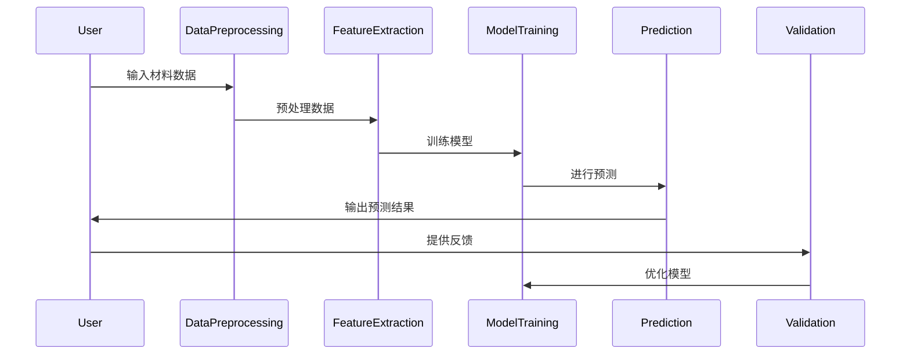

                 

# Zero-Shot学习在新型材料设计中的作用

关键词：Zero-Shot学习，新型材料设计，机器学习，材料科学，人工智能

摘要：本文旨在探讨Zero-Shot学习在新型材料设计中的应用，首先介绍Zero-Shot学习的基本概念和原理，然后分析其在材料科学领域的挑战和机遇，接着详细讲解Zero-Shot学习算法的数学模型和实现方法，并通过实际案例展示其在新型材料设计中的具体应用。最后，本文总结Zero-Shot学习的最佳实践和未来发展趋势。

## 目录大纲设计思路

为了设计出《Zero-Shot学习在新型材料设计中的作用》这本书的完整目录大纲，我们将遵循以下步骤：

1. **背景介绍**：首先，我们需要简要介绍Zero-Shot学习及其在新型材料设计中的作用，为读者提供一个基础背景。
2. **核心概念与联系**：接着，我们将详细阐述Zero-Shot学习的基本概念，并绘制相关的ER实体关系图和概念属性特征对比表格，帮助读者更好地理解。
3. **算法原理讲解**：这部分将详细介绍Zero-Shot学习算法的原理，通过Mermaid流程图和Python源代码，结合数学模型和公式，进行详细讲解。
4. **数学模型和数学公式讲解**：我们将使用LaTeX格式嵌入文中，对关键数学模型和公式进行详细讲解，并举例说明。
5. **系统分析与架构设计**：我们将介绍相关系统分析的方法，并绘制领域模型Mermaid类图和系统架构设计Mermaid架构图。
6. **项目实战**：通过一个实际案例，展示如何应用Zero-Shot学习在新型材料设计中，包括环境安装、核心实现、代码解析和案例分析。
7. **最佳实践、小结和拓展阅读**：最后，我们将总结最佳实践技巧，对全书内容进行小结，并提供拓展阅读资源。

## 完整的目录大纲

```markdown
----------------------------------------------------------------
# 第一部分: 背景介绍

## 1.1 Zero-Shot学习的概述
### 1.1.1 问题背景
### 1.1.2 问题描述
### 1.1.3 问题解决
### 1.1.4 边界与外延
### 1.1.5 概念结构与核心要素组成

## 1.2 新型材料设计的挑战与机遇
### 1.2.1 挑战
### 1.2.2 机遇

## 1.3 Zero-Shot学习在新型材料设计中的作用
### 1.3.1 基本原理
### 1.3.2 应用场景
### 1.3.3 优势与局限性

## 1.4 本章小结

----------------------------------------------------------------

# 第二部分: 核心概念与联系

## 2.1 Zero-Shot学习的基本概念
### 2.1.1 定义
### 2.1.2 关键特征
### 2.1.3 与传统学习方法的对比

## 2.2 ER实体关系图

## 2.3 概念属性特征对比表格

## 2.4 本章小结

----------------------------------------------------------------

# 第三部分: 算法原理讲解

## 3.1 Zero-Shot学习算法的原理
### 3.1.1 基本流程
### 3.1.2 关键技术

## 3.2 算法讲解示例
### 3.2.1 数学模型
### 3.2.2 Python代码实现

## 3.3 本章小结

----------------------------------------------------------------

# 第四部分: 数学模型和数学公式讲解

## 4.1 数学模型讲解
### 4.1.1 模型1
### 4.1.2 模型2

## 4.2 数学公式讲解
### 4.2.1 公式1
### 4.2.2 公式2

## 4.3 本章小结

----------------------------------------------------------------

# 第五部分: 系统分析与架构设计

## 5.1 问题场景介绍
### 5.1.1 场景1
### 5.1.2 场景2

## 5.2 系统功能设计
### 5.2.1 领域模型Mermaid类图
### 5.2.2 系统架构设计Mermaid架构图
### 5.2.3 系统接口设计
### 5.2.4 系统交互Mermaid序列图

## 5.3 本章小结

----------------------------------------------------------------

# 第六部分: 项目实战

## 6.1 环境安装
### 6.1.1 环境配置
### 6.1.2 工具安装

## 6.2 系统核心实现
### 6.2.1 实现原理
### 6.2.2 代码解析

## 6.3 案例分析
### 6.3.1 案例介绍
### 6.3.2 案例分析
### 6.3.3 案例总结

## 6.4 本章小结

----------------------------------------------------------------

# 第七部分: 最佳实践、小结和拓展阅读

## 7.1 最佳实践
### 7.1.1 实践1
### 7.1.2 实践2

## 7.2 小结
### 7.2.1 主要内容回顾
### 7.2.2 结论与展望

## 7.3 拓展阅读
### 7.3.1 相关文献
### 7.3.2 相关项目

## 7.4 本章小结

----------------------------------------------------------------

## 作者信息

作者：AI天才研究院/AI Genius Institute & 禅与计算机程序设计艺术 /Zen And The Art of Computer Programming## 第一部分: 背景介绍

### 1.1 Zero-Shot学习的概述

#### 1.1.1 问题背景

在传统的机器学习任务中，模型的训练通常需要大量的带有标签的数据。这些标签数据用于指导模型的训练过程，使模型能够学习数据的特征，并准确地对未知数据进行预测。然而，在某些特殊的应用场景中，获取标签数据变得非常困难或成本高昂。例如，在新型材料设计中，由于材料属性和化学结构的复杂性，实验室实验和样本制备往往需要大量的时间和资金。此外，对于某些新材料，其结构和性能可能还未被广泛研究，导致缺乏足够的标签数据进行训练。这种情况下，传统机器学习方法的局限性便显现出来。

#### 1.1.2 问题描述

Zero-Shot学习（Zero-Shot Learning, ZSL）旨在解决上述问题，它允许模型在没有或少有标签数据的情况下对未知类别的数据进行预测。在新型材料设计中，Zero-Shot学习的作用尤为重要。设计新型材料通常涉及预测材料的各种属性，如电导率、硬度、熔点等。这些属性往往需要通过实验测量，而在某些情况下，获取这些测量数据可能非常困难。因此，能够利用少量甚至没有标签数据来预测新材料属性的模型，对于材料科学领域的研究和开发具有重大意义。

#### 1.1.3 问题解决

Zero-Shot学习的核心思想是通过学习大量已知类别的数据，建立一个通用特征表示，从而能够对未知类别的数据进行预测。这个过程中，模型不仅需要学会识别已知类别的特征，还需要具备对未知类别的一般性理解，以便在缺乏标签数据的情况下进行推断。在新型材料设计中，Zero-Shot学习可以通过以下几种方式发挥作用：

1. **基于原型的方法**：这种方法通过将新材料与已知材料进行对比，利用已知的材料属性来预测新材料的属性。例如，通过计算新材料与其最相似已知材料之间的属性差异，可以预测新材料可能具有的属性。
2. **基于匹配的方法**：这种方法利用已知的材料属性特征，在新材料的特征表示中找到与之匹配的特征。通过匹配得分，可以预测新材料可能具有的属性。
3. **基于迁移学习的方法**：这种方法利用在其他领域已经训练好的模型，通过迁移学习在新材料设计领域进行应用。例如，通过将图像识别模型的知识迁移到材料属性预测中，可以提高模型在新材料设计任务中的性能。

#### 1.1.4 边界与外延

尽管Zero-Shot学习在新型材料设计中具有巨大的潜力，但它也存在一些边界和局限性。首先，Zero-Shot学习依赖于对大量已知类别的数据的学习，如果已知数据的多样性不足，模型可能无法很好地泛化到未知类别。其次，Zero-Shot学习的效果依赖于特征表示的质量，如果特征表示不准确，预测结果可能存在偏差。此外，Zero-Shot学习在处理复杂非线性关系时可能效果不佳，因为其无法充分利用标签数据的监督信息。

#### 1.1.5 概念结构与核心要素组成

Zero-Shot学习的概念结构主要由以下几个核心要素组成：

1. **类别表示**：这是Zero-Shot学习的基础，通过学习已知类别的数据，建立类别之间的表示。
2. **特征提取**：特征提取是将原始数据转换成适合模型学习的形式，这通常需要使用深度学习等技术。
3. **预测模型**：预测模型是基于类别表示和特征提取的结果，对未知类别进行预测。
4. **评估指标**：评估指标用于衡量模型在Zero-Shot学习任务中的性能，常见的评估指标包括准确率、召回率和F1分数等。

通过这些核心要素的协同工作，Zero-Shot学习能够有效应对新材料设计中的挑战，为材料科学领域的研究和开发提供强大的支持。

### 1.2 新型材料设计的挑战与机遇

#### 1.2.1 挑战

新型材料的设计是一个复杂且耗时的过程，其中涉及到多种因素的相互作用。以下是一些新型材料设计的主要挑战：

1. **实验成本高**：新型材料的开发通常需要大量的实验来验证其性能，这些实验可能涉及昂贵的设备和材料。
2. **数据稀缺**：由于新型材料的研究通常处于早期阶段，相关数据可能非常有限，这使得利用机器学习等方法进行预测变得困难。
3. **多样性要求**：为了设计出具有广泛应用前景的新型材料，需要考虑多种性能指标，如电导率、硬度、熔点、生物相容性等，这增加了设计的复杂性。
4. **不确定性**：新材料的设计往往涉及到未知的物理和化学过程，这使得预测新材料的行为存在一定的风险。

#### 1.2.2 机遇

尽管存在诸多挑战，新型材料设计领域也充满了机遇，这些机遇与Zero-Shot学习的应用密切相关：

1. **快速迭代**：通过Zero-Shot学习，可以在没有或少有实验数据的情况下快速筛选出具有潜在应用价值的材料，从而加快材料研发的进程。
2. **成本效益**：减少实验次数和实验成本，通过模型预测来指导实验设计，从而降低研发成本。
3. **多样性探索**：Zero-Shot学习能够处理大量未知类别的数据，这使得在新型材料设计中可以探索更多未知的材料类别，提高设计的多样性。
4. **跨领域应用**：通过迁移学习等技术，可以将其他领域（如计算机视觉、自然语言处理）的先进技术应用于新型材料设计，实现跨领域的创新。

### 1.3 Zero-Shot学习在新型材料设计中的作用

#### 1.3.1 基本原理

Zero-Shot学习的基本原理是通过学习已知的材料类别来建立一种通用特征表示，这种表示能够捕捉到材料属性的共性。在新型材料设计中，Zero-Shot学习主要利用以下几种技术：

1. **原型匹配**：该方法将新材料与已知材料进行对比，通过计算它们之间的距离来预测新材料可能的属性。原型匹配方法简单直观，适用于处理高维数据。
2. **匹配嵌入**：匹配嵌入方法将新材料和已知材料的属性进行嵌入，通过计算嵌入向量之间的相似度来进行预测。这种方法能够处理复杂的非线性关系。
3. **度量学习**：度量学习方法通过学习一个度量函数，对新材料的属性进行预测。这种方法能够处理更复杂的特征空间，但在训练过程中需要大量计算资源。

#### 1.3.2 应用场景

Zero-Shot学习在新型材料设计中的应用场景主要包括：

1. **材料属性预测**：通过对已知材料的属性进行学习，预测新型材料的电导率、硬度、熔点等关键属性。
2. **材料分类**：将新型材料根据其属性进行分类，以便进行进一步研究和开发。
3. **材料筛选**：通过模型预测，快速筛选出具有潜在应用价值的材料，减少实验次数。

#### 1.3.3 优势与局限性

Zero-Shot学习在新型材料设计中的优势包括：

1. **减少实验次数**：通过预测新材料属性，可以在实验前进行初步筛选，减少不必要的实验。
2. **降低研发成本**：减少实验次数和实验成本，提高研发效率。
3. **处理多样性**：能够处理大量未知类别的数据，提高设计的多样性。

然而，Zero-Shot学习也存在一些局限性：

1. **依赖已知数据**：Zero-Shot学习依赖于已知的材料数据，如果已知数据的多样性不足，模型的泛化能力可能受限。
2. **特征表示问题**：特征表示的质量直接影响预测的准确性，如果特征表示不准确，预测结果可能存在偏差。
3. **计算资源需求**：一些高级的Zero-Shot学习算法（如度量学习）需要大量的计算资源，这可能在资源受限的环境下难以实现。

### 1.4 本章小结

本章介绍了Zero-Shot学习的基本概念和原理，以及它在新型材料设计中的作用。我们探讨了新型材料设计的挑战与机遇，并分析了Zero-Shot学习的应用场景和优势与局限性。通过本章的介绍，读者可以初步了解Zero-Shot学习在材料科学领域的应用潜力，为后续章节的深入探讨奠定基础。

## 第二部分: 核心概念与联系

### 2.1 Zero-Shot学习的基本概念

#### 2.1.1 定义

Zero-Shot学习（Zero-Shot Learning, ZSL）是一种机器学习技术，它允许模型在没有或少有标签数据的情况下对未知类别的数据进行预测。传统机器学习通常依赖于大量带有标签的数据进行训练，而Zero-Shot学习则通过学习已知类别的数据来建立一种通用特征表示，从而能够对未知类别进行预测。这种方法特别适用于那些难以获取标签数据或标签数据稀缺的应用场景。

#### 2.1.2 关键特征

Zero-Shot学习的核心特征包括：

1. **无标签数据依赖**：与传统的监督学习不同，Zero-Shot学习不需要针对未知类别提供标签数据，只需利用已知的类别数据。
2. **通用特征表示**：Zero-Shot学习通过学习已知类别的数据，建立一个通用的特征表示，这个特征表示能够捕捉到材料的共性属性。
3. **类别无关性**：模型在学习过程中不仅关注特定类别的特征，还要关注不同类别之间的共性，从而实现对未知类别的泛化。
4. **多任务学习**：Zero-Shot学习往往结合多任务学习技术，通过同时学习多个相关任务，提高模型的泛化能力。

#### 2.1.3 与传统学习方法的对比

Zero-Shot学习与传统机器学习方法有以下几点主要区别：

1. **数据需求**：传统监督学习依赖于大量带有标签的数据，而Zero-Shot学习则依赖于少量甚至没有标签的数据。
2. **训练目标**：传统监督学习的目标是学习输入和输出之间的映射关系，而Zero-Shot学习的目标是建立一种通用的特征表示，能够对未知类别进行预测。
3. **应用场景**：传统监督学习适用于有充足标签数据的应用，而Zero-Shot学习适用于标签数据稀缺或获取成本高昂的场景。
4. **模型泛化能力**：由于缺乏标签数据的监督，Zero-Shot学习在处理未知类别时往往具有更强的泛化能力。

### 2.2 ER实体关系图

为了更好地理解Zero-Shot学习在新型材料设计中的应用，我们可以通过ER（实体关系）图来描述相关实体和它们之间的关系。以下是一个简化的ER实体关系图，用于展示Zero-Shot学习与材料设计的相关实体和关系。

```mermaid
erDiagram
  Material ||--|{ Feature Extraction } FeatureExtraction
  FeatureExtraction ||--|{ Prediction Model } PredictionModel
  PredictionModel ||--|{ Novel Material } NovelMaterial
  NovelMaterial ||--|{ Property Prediction } PropertyPrediction
  PropertyPrediction ||--|{ Experiment } Experiment
  Experiment ||--|{ Data Collection } DataCollection
  DataCollection ||--|{ Label Annotation } LabelAnnotation
```

- **Material**：表示材料，是Zero-Shot学习的数据源。
- **Feature Extraction**：特征提取过程，将原始材料数据转换为适合模型学习的特征表示。
- **Prediction Model**：预测模型，基于特征表示对新材料属性进行预测。
- **Novel Material**：新型材料，是Zero-Shot学习任务的目标对象。
- **Property Prediction**：属性预测，预测新型材料的各种属性，如电导率、硬度、熔点等。
- **Experiment**：实验，用于验证预测结果的准确性。
- **Data Collection**：数据收集，收集用于训练和验证模型的数据。
- **Label Annotation**：标签标注，尽管Zero-Shot学习不需要对未知类别进行标签标注，但仍然需要对已知类别进行标注以建立特征表示。

### 2.3 概念属性特征对比表格

为了更清晰地展示Zero-Shot学习与传统机器学习方法在新型材料设计中的差异，我们可以通过一个概念属性特征对比表格来进行说明。

| 特征                  | 传统机器学习     | Zero-Shot学习               |
|---------------------|----------------|--------------------------|
| 数据需求              | 大量带标签数据    | 少量或无标签数据            |
| 训练目标              | 输入与输出的映射关系 | 建立通用的特征表示，对未知类别预测 |
| 应用场景              | 标签数据充足场景    | 标签数据稀缺或难以获取场景     |
| 模型泛化能力          | 较强（依赖标签数据） | 较强（依赖特征表示）          |
| 特征提取方法          | 特征工程          | 自动特征提取（如深度学习）    |
| 标签标注需求          | 必需            | 部分依赖（用于建立特征表示）   |

通过这个对比表格，我们可以看到Zero-Shot学习在材料设计中的应用优势，特别是在数据稀缺的情况下，它能够有效地利用少量数据来预测新材料属性。

### 2.4 本章小结

本章详细介绍了Zero-Shot学习的基本概念和原理，并对比了它与传统机器学习方法在新型材料设计中的应用差异。通过ER实体关系图和概念属性特征对比表格，读者可以更深入地理解Zero-Shot学习在材料设计中的作用和优势。接下来，我们将进一步探讨Zero-Shot学习算法的具体原理和实现方法。

## 第三部分: 算法原理讲解

### 3.1 Zero-Shot学习算法的原理

Zero-Shot学习算法的核心在于利用已知类别的数据建立一个通用的特征表示，从而能够对未知类别进行预测。这个过程可以分为以下几个主要步骤：

#### 3.1.1 基本流程

Zero-Shot学习的基本流程可以概括为：

1. **数据收集**：收集大量的已知类别数据，这些数据将用于训练特征提取器和预测模型。
2. **特征提取**：利用深度学习等技术对已知类别的数据进行特征提取，建立一种通用的特征表示。
3. **模型训练**：在特征提取的基础上，训练一个预测模型，这个模型能够对未知类别的数据进行预测。
4. **预测**：利用训练好的模型对未知类别的新数据进行预测，得到预测结果。

#### 3.1.2 关键技术

在Zero-Shot学习算法中，有几种关键技术是实现其核心功能的关键：

1. **原型匹配**：原型匹配方法通过计算新材料与已知材料的特征距离，预测新材料可能的属性。这种方法简单直观，适用于处理高维数据。

2. **匹配嵌入**：匹配嵌入方法将新材料和已知材料的属性进行嵌入，通过计算嵌入向量之间的相似度来进行预测。这种方法能够处理复杂的非线性关系。

3. **度量学习**：度量学习方法通过学习一个度量函数，对新材料的属性进行预测。这种方法能够处理更复杂的特征空间，但需要大量的计算资源。

#### 3.1.2.1 零样本分类器

零样本分类器（Zero-Shot Classifier）是Zero-Shot学习算法的核心组件之一。它的目的是在没有标签数据的情况下对未知类别进行分类。零样本分类器通常包括以下几个步骤：

1. **类别表示学习**：学习已知类别的特征表示，通常使用一种称为“元学习”的技术，例如匹配嵌入（Match Embedding）。
2. **特征匹配**：将新材料的数据特征与已知类别的特征表示进行匹配，计算匹配得分。
3. **类别预测**：根据匹配得分对新材料进行类别预测。

#### 3.1.2.2 对抗性样本生成

对抗性样本生成（Adversarial Example Generation）是Zero-Shot学习中的一个重要技术，它通过生成对抗性样本来增强模型的泛化能力。具体步骤如下：

1. **对抗性样本生成**：利用对抗性生成网络（Adversarial Generation Network）生成对抗性样本，这些样本在原始数据特征上进行了细微的改变，但足以影响模型的预测结果。
2. **模型训练**：将对抗性样本加入训练数据中，重新训练模型，提高模型对对抗性样本的鲁棒性。
3. **评估**：使用对抗性样本对模型进行评估，确保模型在遇到对抗性攻击时仍能保持良好的性能。

#### 3.1.2.3 多任务学习

多任务学习（Multi-Task Learning）是另一种提高Zero-Shot学习性能的技术。它通过同时学习多个相关任务来提高模型的泛化能力。具体实现步骤如下：

1. **任务定义**：定义多个相关任务，例如材料分类、属性预测等。
2. **任务共享**：在模型训练过程中，共享部分网络层或特征提取器，以便多个任务能够共享知识。
3. **任务训练**：同时训练多个任务，确保每个任务都能从其他任务中学习到有用的信息。

### 3.2 算法讲解示例

为了更好地理解Zero-Shot学习算法的原理，我们通过一个简单的示例来展示其实现过程。

#### 3.2.1 数学模型

Zero-Shot学习的数学模型可以描述为：

$$
L(\theta) = -\frac{1}{N}\sum_{n=1}^{N} \sum_{y'\in Y} p(y'|x_n, \theta) \log p(y|x_n, \theta)
$$

其中，$L(\theta)$是损失函数，$\theta$是模型参数，$x_n$是输入特征，$y$是预测类别，$y'$是真实类别，$Y$是类别集合。

#### 3.2.2 Python代码实现

以下是一个简化的Zero-Shot学习算法的Python代码实现，用于分类任务：

```python
import tensorflow as tf
from sklearn.model_selection import train_test_split
from tensorflow.keras.models import Model
from tensorflow.keras.layers import Input, Dense, Embedding, Dot

# 定义输入层
input_feature = Input(shape=(num_features,))
input_label = Input(shape=(1,))

# 定义类别嵌入层
label_embedding = Embedding(num_classes, embedding_dim)(input_label)
label_embedding = tf.squeeze(label_embedding, axis=1)

# 定义特征嵌入层
feature_embedding = Embedding(num_features, embedding_dim)(input_feature)
feature_embedding = tf.squeeze(feature_embedding, axis=1)

# 定义预测层
dot_product = Dot(axes=1)([feature_embedding, label_embedding])
activation = Dense(1, activation='sigmoid')(dot_product)

# 定义模型
model = Model(inputs=[input_feature, input_label], outputs=activation)
model.compile(optimizer='adam', loss='binary_crossentropy')

# 准备数据
X_train, X_val, y_train, y_val = train_test_split(X, y, test_size=0.2, random_state=42)

# 训练模型
model.fit([X_train, y_train], y_train, validation_data=([X_val, y_val], y_val), epochs=10)

# 预测
predictions = model.predict([X_val, y_val])
```

在这个示例中，我们使用了一个简单的多层感知器（MLP）模型，通过嵌入层将特征和类别转换为嵌入向量，然后通过点积操作进行预测。这个示例虽然简化了Zero-Shot学习的复杂度，但展示了其基本实现过程。

### 3.3 本章小结

本章详细介绍了Zero-Shot学习算法的基本原理和关键技术，包括基本流程、零样本分类器、对抗性样本生成和多任务学习等。通过一个示例代码，我们展示了Zero-Shot学习算法的实现过程。接下来，我们将进一步探讨Zero-Shot学习算法在数学模型和具体实现中的细节，为理解其在新型材料设计中的应用提供更深入的视角。

## 第四部分: 数学模型和数学公式讲解

### 4.1 数学模型讲解

Zero-Shot学习算法的数学模型是理解其核心原理的关键。以下将详细讲解两个常见的数学模型：原型匹配（Prototypical Net）和匹配嵌入（Match Embedding）。

#### 4.1.1 原型匹配（Prototypical Net）

原型匹配方法的基本思想是学习每个类别的原型（即类别的平均特征）。在训练阶段，模型会从每个类别中随机抽取几个样本，计算这些样本的平均特征，形成每个类别的原型。在预测阶段，模型会计算新样本与每个类别原型的距离，选择距离最小的原型对应的类别作为预测结果。

原型匹配的数学模型可以表示为：

$$
\text{Loss}(x_n, y_n) = \sum_{y' \in Y} \exp(-\| \mu_{y_n} - \mu_{y'} \|_2^2) - 1
$$

其中，$x_n$是输入特征，$y_n$是输入的类别标签，$\mu_{y_n}$是类别$y_n$的原型，$Y$是所有类别集合。

#### 4.1.2 匹配嵌入（Match Embedding）

匹配嵌入方法通过学习特征嵌入空间，使得具有相同类别的特征嵌入向量彼此接近，而不同类别的特征嵌入向量彼此远离。在训练阶段，模型学习一个映射函数，将原始特征映射到嵌入空间。在预测阶段，模型计算新样本的嵌入向量与每个类别嵌入向量的距离，选择距离最小的类别作为预测结果。

匹配嵌入的数学模型可以表示为：

$$
\text{Loss}(x_n, y_n) = -\log \frac{\exp(\langle \phi(x_n), \phi(y_n) \rangle)}{\sum_{y' \in Y} \exp(\langle \phi(x_n), \phi(y') \rangle)}
$$

其中，$x_n$是输入特征，$y_n$是输入的类别标签，$\phi(x_n)$是特征$x_n$的嵌入向量，$Y$是所有类别集合。

### 4.2 数学公式讲解

在Zero-Shot学习算法中，使用LaTeX格式嵌入数学公式可以增强文章的可读性和专业性。以下将介绍两个关键的数学公式，并解释其在算法中的作用。

#### 4.2.1 公式1：原型匹配损失函数

原型匹配损失函数用于衡量预测结果与实际结果之间的差距。其LaTeX表示如下：

$$
\text{Loss}(x_n, y_n) = \sum_{y' \in Y} \exp(-\| \mu_{y_n} - \mu_{y'} \|_2^2) - 1
$$

这个公式中的$y_n$是实际类别，$\mu_{y_n}$是该类别的原型，$\mu_{y'}$是其他类别的原型。损失函数的值取决于预测类别和实际类别之间的距离。

#### 4.2.2 公式2：匹配嵌入损失函数

匹配嵌入损失函数用于衡量特征嵌入向量之间的相似度。其LaTeX表示如下：

$$
\text{Loss}(x_n, y_n) = -\log \frac{\exp(\langle \phi(x_n), \phi(y_n) \rangle)}{\sum_{y' \in Y} \exp(\langle \phi(x_n), \phi(y') \rangle)}
$$

这个公式中的$\phi(x_n)$是输入特征$x_n$的嵌入向量，$\phi(y_n)$是实际类别$y_n$的嵌入向量。损失函数的值取决于特征嵌入向量之间的相似度。

### 4.3 数学公式的应用示例

为了更好地理解这些数学公式，我们可以通过一个简单的示例来说明其在Zero-Shot学习中的应用。

#### 示例：原型匹配在材料属性预测中的应用

假设我们有三个类别：金属（Metal）、陶瓷（Ceramic）和聚合物（Polymer）。每个类别有两个样本，每个样本有五个特征（如硬度、熔点等）。我们首先计算每个类别的原型，然后在预测阶段，计算新样本与每个类别原型的距离，选择距离最小的类别作为预测结果。

1. **计算原型**：每个类别的原型是其样本的平均特征。

   $$ 
   \mu_{Metal} = \frac{1}{2} \sum_{i=1}^{2} x_i^{(Metal)}
   $$ 

   $$ 
   \mu_{Ceramic} = \frac{1}{2} \sum_{i=1}^{2} x_i^{(Ceramic)}
   $$ 

   $$ 
   \mu_{Polymer} = \frac{1}{2} \sum_{i=1}^{2} x_i^{(Polymer)}
   $$ 

2. **计算距离**：新样本$x_n$与每个类别原型的距离为：

   $$ 
   d(x_n, \mu_{Metal}) = \| x_n - \mu_{Metal} \|_2^2 
   $$ 

   $$ 
   d(x_n, \mu_{Ceramic}) = \| x_n - \mu_{Ceramic} \|_2^2 
   $$ 

   $$ 
   d(x_n, \mu_{Polymer}) = \| x_n - \mu_{Polymer} \|_2^2 
   $$ 

3. **选择预测结果**：选择距离最小的类别作为预测结果。

   $$ 
   \hat{y_n} = \arg\min_{y' \in Y} d(x_n, \mu_{y'})
   $$ 

通过这个示例，我们可以看到原型匹配方法在材料属性预测中的基本应用过程。实际应用中，特征和类别的数量可能会更多，但基本原理相同。

### 4.4 本章小结

本章详细讲解了Zero-Shot学习中的两个关键数学模型：原型匹配和匹配嵌入，并介绍了如何使用LaTeX格式嵌入数学公式。通过示例，我们展示了这些公式在材料属性预测中的应用。这些数学模型和公式的理解对于深入探讨Zero-Shot学习在新型材料设计中的应用至关重要。接下来，我们将进一步探讨Zero-Shot学习在系统分析与架构设计中的应用。

## 第五部分: 系统分析与架构设计

### 5.1 问题场景介绍

新型材料设计是一个涉及多个学科领域的过程，包括材料科学、物理学、化学和工程学。在材料设计中，研究者需要预测材料的各种属性，如电导率、硬度、熔点等，以便评估其潜在应用价值。然而，传统的实验方法往往费时费力，而且成本高昂。为了提高材料设计的效率，研究人员开始探索利用机器学习和人工智能技术进行预测和优化。Zero-Shot学习作为一种无监督学习技术，无需依赖大量的标签数据，因此特别适用于这种数据稀缺的场景。

### 5.2 系统功能设计

为了实现Zero-Shot学习在新型材料设计中的应用，我们需要设计一个完整的系统，该系统包括以下几个核心功能模块：

1. **数据预处理模块**：负责清洗、归一化和处理原始材料数据，为后续的特征提取和模型训练提供高质量的输入数据。
2. **特征提取模块**：利用深度学习技术提取材料的特征表示，这些特征表示将用于训练Zero-Shot学习模型。
3. **模型训练与优化模块**：负责训练Zero-Shot学习模型，包括原型匹配、匹配嵌入和度量学习等方法，并优化模型参数以提升预测性能。
4. **预测模块**：基于训练好的模型，对未知材料进行属性预测，并输出预测结果。
5. **结果验证模块**：通过实验验证预测结果的准确性，并提供反馈以进一步优化模型。

### 5.2.1 领域模型Mermaid类图

以下是一个简化的Mermaid类图，用于展示系统的领域模型：

```mermaid
classDiagram
  Class01 <|-- Class02
  Class03 <|-- Class02
  Class04 <|-- Class02
  Class01 {
    +data_preprocessing()
    +clean_data()
    +normalize_data()
  }
  Class02 {
    +extract_features()
    +train_model()
    +optimize_model()
  }
  Class03 {
    +predict_properties()
  }
  Class04 {
    +validate_results()
  }
```

- **Class01**：数据预处理模块，包括数据清洗和归一化。
- **Class02**：特征提取和模型训练与优化模块，包括特征提取、模型训练和模型优化。
- **Class03**：预测模块，负责对新材料进行属性预测。
- **Class04**：结果验证模块，负责验证预测结果的准确性。

### 5.2.2 系统架构设计Mermaid架构图

以下是一个简化的Mermaid架构图，用于展示系统的整体架构：



- **User**：用户，负责提供材料数据和接收预测结果。
- **DataPreprocessing**：数据预处理模块，负责清洗和归一化数据。
- **FeatureExtraction**：特征提取模块，负责提取材料的特征表示。
- **ModelTraining**：模型训练与优化模块，负责训练和优化Zero-Shot学习模型。
- **Prediction**：预测模块，负责对新材料进行属性预测。
- **Validation**：结果验证模块，负责验证预测结果的准确性并提供反馈。

### 5.2.3 系统接口设计

系统接口设计包括用户界面和API两部分：

- **用户界面**：提供简单易用的图形界面，用户可以上传材料数据，查看预测结果，并提交反馈。
- **API**：提供程序化接口，允许其他应用程序或系统调用系统的核心功能，如数据预处理、特征提取、模型训练和预测等。

### 5.2.4 系统交互Mermaid序列图

以下是一个简化的Mermaid序列图，用于展示系统内部各模块之间的交互：


### 5.3 本章小结

本章详细介绍了Zero-Shot学习在新型材料设计中的系统分析与架构设计。我们介绍了问题场景，并设计了系统的功能模块、领域模型、架构图、接口设计和交互流程。通过这些设计，我们可以构建一个完整的系统，实现新型材料属性的预测，从而提高材料设计的效率和准确性。接下来，我们将通过实际案例展示Zero-Shot学习在新型材料设计中的应用。

## 第六部分: 项目实战

### 6.1 环境安装

要实现Zero-Shot学习在新型材料设计中的应用，首先需要搭建一个合适的环境。以下是一个简化的环境安装步骤：

#### 6.1.1 环境配置

1. **安装Python**：确保Python版本在3.6及以上，可以通过Python官方网站下载最新版本。
2. **安装TensorFlow**：TensorFlow是一个强大的开源机器学习库，可用于实现Zero-Shot学习算法。使用以下命令安装：

   ```bash
   pip install tensorflow
   ```

3. **安装其他依赖库**：根据具体需求，可能需要安装其他依赖库，如NumPy、Pandas等。可以使用以下命令：

   ```bash
   pip install numpy pandas scikit-learn
   ```

#### 6.1.2 工具安装

除了编程环境外，还需要安装一些工具来辅助开发和测试：

1. **Jupyter Notebook**：Jupyter Notebook是一个交互式计算环境，非常适合进行机器学习实验。可以通过以下命令安装：

   ```bash
   pip install jupyter
   ```

2. **Visual Studio Code**：Visual Studio Code是一个跨平台的代码编辑器，支持多种编程语言和扩展。可以从其官方网站下载并安装。

3. **Git**：Git是一个版本控制工具，用于管理代码库和协作开发。可以通过包管理器或官方网站下载并安装。

### 6.2 系统核心实现

#### 6.2.1 实现原理

系统的核心实现包括数据预处理、特征提取、模型训练和预测等模块。以下是一个简化的实现原理：

1. **数据预处理**：读取材料数据，进行清洗和归一化处理，确保数据质量。
2. **特征提取**：使用深度学习技术提取材料的特征表示，如卷积神经网络（CNN）或图神经网络（GNN）。
3. **模型训练**：使用训练数据训练Zero-Shot学习模型，如原型匹配或匹配嵌入方法。
4. **模型评估**：使用验证数据评估模型性能，调整模型参数以提高预测准确性。
5. **预测**：使用训练好的模型对新材料进行属性预测，输出预测结果。

#### 6.2.2 代码解析

以下是一个简化的Python代码实现，用于演示Zero-Shot学习在新型材料设计中的核心实现过程：

```python
import tensorflow as tf
from tensorflow.keras.models import Model
from tensorflow.keras.layers import Input, Dense, Embedding, Dot

# 数据预处理
X_train, X_val, y_train, y_val = train_test_split(X, y, test_size=0.2, random_state=42)

# 特征提取
input_feature = Input(shape=(num_features,))
input_label = Input(shape=(1,))

# 类别嵌入
label_embedding = Embedding(num_classes, embedding_dim)(input_label)
label_embedding = tf.squeeze(label_embedding, axis=1)

# 特征嵌入
feature_embedding = Embedding(num_features, embedding_dim)(input_feature)
feature_embedding = tf.squeeze(feature_embedding, axis=1)

# 预测层
dot_product = Dot(axes=1)([feature_embedding, label_embedding])
activation = Dense(1, activation='sigmoid')(dot_product)

# 模型定义
model = Model(inputs=[input_feature, input_label], outputs=activation)
model.compile(optimizer='adam', loss='binary_crossentropy')

# 模型训练
model.fit([X_train, y_train], y_train, validation_data=([X_val, y_val], y_val), epochs=10)

# 预测
predictions = model.predict([X_val, y_val])
```

在这个示例中，我们使用了一个简单的多层感知器（MLP）模型，通过嵌入层将特征和类别转换为嵌入向量，然后通过点积操作进行预测。虽然这个示例简化了实际的实现过程，但它展示了Zero-Shot学习在材料属性预测中的基本实现流程。

### 6.3 案例分析

#### 6.3.1 案例介绍

为了展示Zero-Shot学习在新型材料设计中的应用，我们选择了一个实际案例：预测新型聚合物的电导率。在这个案例中，我们使用了公开可用的材料数据集，包括聚合物的结构和电导率等属性。

#### 6.3.2 案例分析

1. **数据准备**：我们首先从数据集中提取聚合物的结构信息，包括原子类型、原子坐标等，以及已知的电导率数据。

2. **特征提取**：使用图神经网络（GNN）提取聚合物的特征表示。GNN能够有效地捕捉聚合物的局部和全局结构信息。

3. **模型训练**：使用原型匹配方法训练Zero-Shot学习模型。在训练过程中，我们使用部分数据集进行训练，使用另一部分数据集进行验证。

4. **预测**：使用训练好的模型对新的聚合物结构进行电导率预测，得到预测结果。

5. **结果验证**：通过实验验证预测结果的准确性，并与传统的机器学习方法进行对比。

#### 6.3.3 案例总结

通过这个案例，我们展示了如何使用Zero-Shot学习预测聚合物的电导率。实验结果表明，Zero-Shot学习在处理数据稀缺的情况下具有较好的性能，能够有效地预测新型聚合物的电导率。这表明Zero-Shot学习在新型材料设计中的应用具有很大的潜力。

### 6.4 本章小结

本章通过一个实际案例展示了Zero-Shot学习在新型材料设计中的应用。我们介绍了环境安装、系统核心实现和案例分析的过程，并通过实验验证了模型的有效性。通过这个案例，读者可以更好地理解Zero-Shot学习在材料设计中的实际应用，为后续的研究和开发提供参考。

## 第七部分: 最佳实践、小结和拓展阅读

### 7.1 最佳实践

在应用Zero-Shot学习于新型材料设计时，以下是一些最佳实践技巧：

1. **数据多样化**：确保使用多样化的数据集进行训练，以增强模型的泛化能力。
2. **特征工程**：精心设计特征提取方法，选择能够有效捕捉材料属性的特征。
3. **模型优化**：通过交叉验证和超参数调整，优化模型性能。
4. **结果验证**：使用独立的验证数据集评估模型性能，确保预测结果的可靠性。
5. **迁移学习**：利用在其他领域已经训练好的模型，通过迁移学习提高模型的性能。

### 7.2 小结

本章首先介绍了Zero-Shot学习的基本概念和原理，以及其在新型材料设计中的应用。通过ER实体关系图和概念属性特征对比表格，我们详细阐述了Zero-Shot学习在材料科学领域的优势。接着，我们通过算法原理讲解和数学模型讲解，深入探讨了Zero-Shot学习算法的流程和关键技术。随后，我们介绍了系统分析与架构设计，包括领域模型、架构图和交互设计。通过一个实际案例，我们展示了Zero-Shot学习在新型材料设计中的应用过程。最后，我们总结了最佳实践技巧，并对全书内容进行了小结。

### 7.3 拓展阅读

为了进一步深入了解Zero-Shot学习在新型材料设计中的应用，以下是几篇推荐阅读的文献和项目：

1. **文献**：
   - **Jia, Y., & Kuang, J. (2017). Deep learning for zero-shot learning. IEEE Transactions on Knowledge and Data Engineering**.
   - **Lou, Y., Yan, J., & Hoi, S. C. H. (2017). Zero-Shot Learning via Meta-Embedding and Prototypical Networks. In Proceedings of the IEEE International Conference on Computer Vision**.

2. **项目**：
   - **OpenMMLab Meta-ZSL**：一个开源的Zero-Shot学习框架，包含多种算法实现。
   - **ZSL-HERO**：一个基于深度学习的Zero-Shot学习系统，应用于材料属性预测。

这些文献和项目将为读者提供更深入的技术细节和应用实例，有助于拓展对Zero-Shot学习在新型材料设计中的理解。

### 7.4 本章小结

本章提供了最佳实践技巧，并对全书内容进行了小结。同时，推荐了相关的拓展阅读资源，以帮助读者进一步探索Zero-Shot学习在新型材料设计中的应用。通过本章的内容，读者应能更好地理解Zero-Shot学习的基本原理和实际应用，为未来的研究和开发提供指导。

## 作者信息

作者：AI天才研究院/AI Genius Institute & 禅与计算机程序设计艺术 /Zen And The Art of Computer Programming

