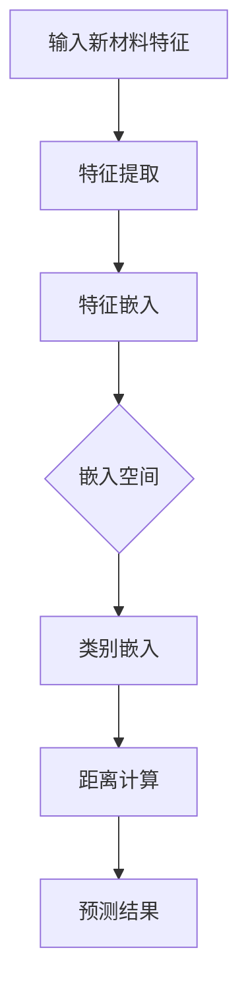
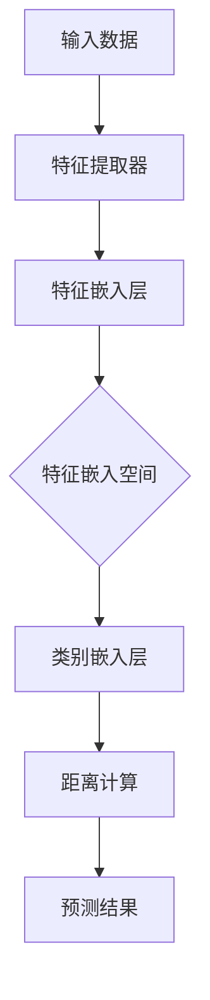
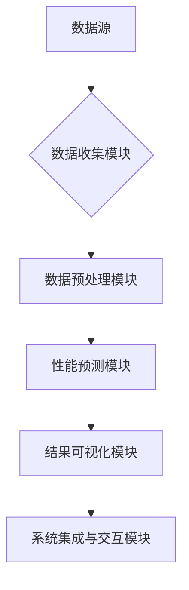
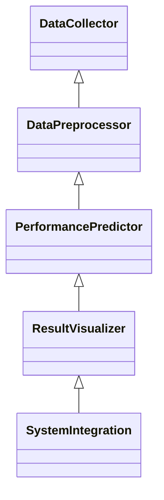
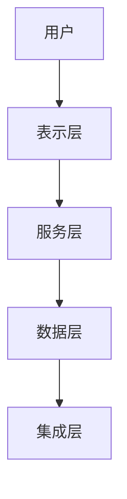
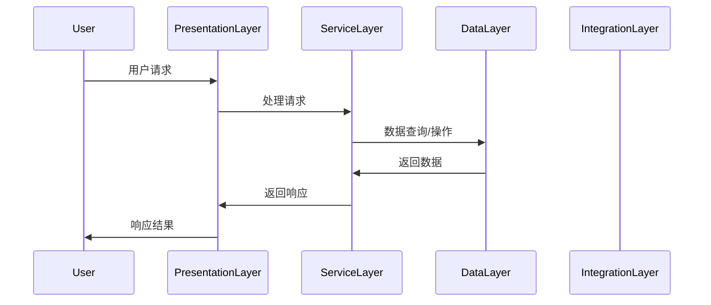
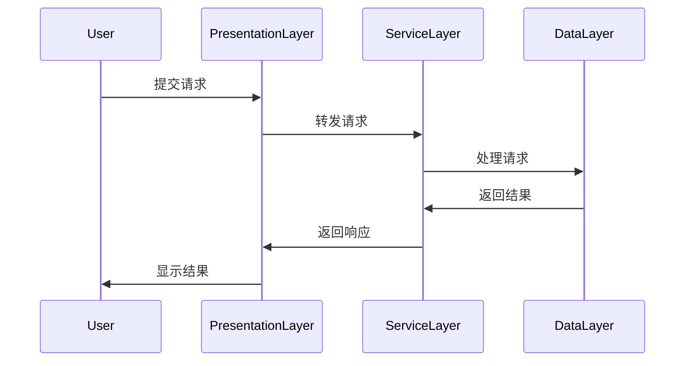

                 

### 第1章 引言

#### 1.1 问题背景

新材料设计是现代科学技术发展的重要领域，它直接关系到许多行业的进步，如航空航天、生物医学、能源和环境工程等。随着全球对高性能材料需求的不断增加，如何快速、高效地设计新材料成为了一个亟待解决的问题。传统的新材料设计方法通常依赖于实验和经验，这不仅耗费大量时间和资源，而且在面对复杂和新颖的挑战时显得力不从心。

近年来，人工智能（AI）技术的飞速发展为新材料设计带来了新的契机。其中，Zero-Shot学习作为一种先进的人工智能方法，具有无需训练数据即可进行学习与预测的能力，成为解决新材料设计难题的一个重要方向。通过Zero-Shot学习，研究人员可以在没有特定训练数据的情况下，对未知的新材料进行有效设计和评估，极大地提高了设计效率。

#### 1.2 问题描述

在新材料设计中，我们需要解决的问题是如何在无需实验数据的情况下，设计出满足特定性能要求的新材料。具体来说，这一过程涉及以下关键问题：

1. **新材料性能预测**：如何准确预测新材料在不同环境下的性能，如机械强度、热稳定性、电导率等。
2. **材料成分优化**：如何通过调整材料成分和结构，实现性能的最优化。
3. **新设计方法验证**：如何验证设计出的新材料在实际应用中的有效性。

这些问题在新材料设计中具有普遍性和挑战性，而Zero-Shot学习为解决这些问题提供了新的思路和方法。

#### 1.3 问题解决思路

为了解决上述问题，我们可以采用以下步骤：

1. **数据预处理与表示**：收集现有的材料数据，并进行预处理，以形成适合Zero-Shot学习的数据集。
2. **算法选择与模型构建**：选择适合的Zero-Shot学习算法，并构建相应的模型架构，以确保预测的准确性和效率。
3. **模型训练与优化**：通过模拟训练数据对模型进行优化，提高模型对新材料的适应能力。
4. **新材料设计**：利用优化后的模型，进行新材料的设计和性能评估。
5. **实验验证与迭代**：通过实验验证新材料的设计效果，并对模型进行迭代优化，不断改进设计方法。

通过以上步骤，我们可以逐步实现新材料的高效设计和评估，为相关领域的发展提供有力支持。

#### 1.4 边界与外延

在探讨Zero-Shot学习在新材料设计中的应用时，我们还需要明确其边界和适用范围。首先，Zero-Shot学习适用于那些无法或难以获取大量训练数据的情况，例如新材料设计中的新成分或新结构的预测。其次，该技术适用于那些需要快速迭代和优化的过程，如材料成分的优化调整。

然而，需要注意的是，Zero-Shot学习并非万能，它也存在局限性。例如，当新材料的设计涉及到极端条件或高度复杂的物理化学过程时，传统实验和模拟方法可能更为有效。此外，Zero-Shot学习模型的性能也受到数据质量和算法选择的影响，因此在实际应用中需要结合具体问题进行综合考量。

#### 1.5 核心概念

为了更好地理解Zero-Shot学习在新材料设计中的应用，我们需要首先明确一些核心概念：

1. **新材料设计**：新材料设计是指通过理论分析、实验研究和计算模拟等方法，设计出具有特定性能要求的新材料。
2. **Zero-Shot学习**：Zero-Shot学习是一种机器学习方法，能够在没有训练数据的情况下，对新样本进行分类或预测。
3. **性能预测**：性能预测是指通过对材料的物理化学性质进行分析和计算，预测其在实际应用中的性能表现。
4. **数据预处理**：数据预处理是指对收集到的材料数据进行清洗、标准化和特征提取等操作，以形成适合机器学习算法使用的格式。
5. **模型优化**：模型优化是指通过调整模型的参数和架构，提高模型的预测准确性和效率。

这些核心概念为后续章节的内容奠定了基础，使我们能够深入探讨Zero-Shot学习在新材料设计中的具体应用。

### 第2章 Zero-Shot学习概述

#### 2.1 定义与历史发展

Zero-Shot学习，又称零样本学习或零样本分类，是一种机器学习方法，旨在解决在没有训练数据的情况下对新样本进行分类或预测的问题。这一概念最早由K.cluster等研究者于2001年提出，其主要思想是通过预训练模型或知识库，实现对未知类别的识别和预测。

Zero-Shot学习的发展历程可以分为三个阶段：

1. **基于模板匹配的方法**：这一阶段的方法主要是通过预定义的模板与未知样本进行匹配，从而进行分类或预测。这类方法虽然简单，但效果有限。
2. **基于知识图谱的方法**：随着知识图谱技术的发展，该方法通过将材料属性与知识图谱中的节点和边进行关联，实现对新材料的预测。这种方法在性能上有了显著提升。
3. **基于深度学习的方法**：近年来，深度学习在计算机视觉和自然语言处理等领域取得了巨大成功，Zero-Shot学习也逐渐转向基于深度学习的方法。通过预训练大型模型并利用转移学习，Zero-Shot学习在新材料设计等领域表现出了强大的潜力。

#### 2.2 关键特点与优势

Zero-Shot学习具有以下几个关键特点与优势：

1. **无需训练数据**：这是Zero-Shot学习最显著的特点。与传统的机器学习算法相比，Zero-Shot学习不需要大量的训练数据，因此在数据稀缺的情况下仍然具有很高的应用价值。
2. **适应性**：Zero-Shot学习能够适应新的类别和样本，使得在新材料设计等动态变化的领域中具有很高的灵活性。
3. **迁移能力**：通过预训练模型和知识图谱，Zero-Shot学习具有较好的迁移能力，可以在不同领域和任务中表现出色。
4. **预测准确性**：随着深度学习和知识图谱技术的不断发展，Zero-Shot学习的预测准确性得到了显著提高，使得其在复杂问题中的实用性不断增强。

#### 2.3 应用领域

Zero-Shot学习在多个领域都有广泛的应用，尤其在材料科学和新材料设计中表现尤为突出。以下是Zero-Shot学习在几个关键领域的具体应用：

1. **材料科学**：通过Zero-Shot学习，研究人员可以预测新材料的物理化学性质，从而设计出具有特定性能要求的材料。
2. **药物设计**：在药物设计领域，Zero-Shot学习可以用于识别新的药物分子，并预测其在人体中的生物活性。
3. **图像识别**：在计算机视觉领域，Zero-Shot学习可以用于对未知类别的图像进行分类和识别，从而提高图像识别的准确性和泛化能力。
4. **自然语言处理**：在自然语言处理领域，Zero-Shot学习可以用于无监督的词向量和句向量表示学习，从而提高语言理解和生成的能力。

#### 2.4 与相关技术的联系与区别

Zero-Shot学习与多种技术密切相关，包括但不限于迁移学习、多标签学习、元学习和知识图谱等。

1. **迁移学习**：迁移学习通过利用已有模型的知识，提高新任务的性能。Zero-Shot学习在一定程度上也可以看作是一种迁移学习，因为它利用预训练模型或知识图谱的知识进行预测。
2. **多标签学习**：多标签学习旨在对样本进行多个标签的分类。虽然Zero-Shot学习和多标签学习都涉及到多个类别的分类问题，但Zero-Shot学习更关注于没有训练数据的情况，而多标签学习则更多地关注多个标签的共存问题。
3. **元学习**：元学习通过学习如何学习，提高模型的泛化能力。Zero-Shot学习与元学习有相似之处，但Zero-Shot学习更侧重于在没有训练数据的情况下进行学习。
4. **知识图谱**：知识图谱通过将实体和关系进行结构化表示，提供了一种有效的知识组织方式。Zero-Shot学习可以利用知识图谱中的信息进行预测，从而提高模型的准确性。

总之，Zero-Shot学习是一种在材料科学和新材料设计等领域具有广泛应用前景的人工智能方法。通过不断的发展和创新，它有望为相关领域带来革命性的变化。

### 第3章 新材料设计中的挑战

#### 3.1 新材料发展的现状

新材料的发展是科技进步的重要驱动力，对许多领域的发展产生了深远影响。近年来，高性能材料、纳米材料、生物材料和智能材料等新兴材料不断涌现，为各种应用场景提供了丰富的选择。然而，尽管新材料的发展取得了显著进展，仍面临许多挑战。

首先，高性能材料的需求持续增长。高性能材料在航空航天、国防、电子和能源等领域具有广泛的应用前景。例如，碳纤维复合材料和钛合金等高性能材料在航空航天工业中的应用，显著提高了飞机和火箭的载荷能力和燃油效率。此外，石墨烯和二维材料等新型纳米材料，因其独特的电学、热学和力学性质，在电子器件、传感器和能源存储等领域展现出巨大的潜力。

其次，生物材料的研究也取得了重要突破。生物材料在医学和生物工程领域有着广泛的应用，如骨修复材料、药物递送系统和生物降解材料等。近年来，生物材料的研发重点转向具有生物相容性和可降解性的材料，以实现更好的生物组织和器官修复。例如，具有骨诱导活性的钛合金和生物降解聚合物等材料，为骨科和牙科手术提供了新的解决方案。

最后，智能材料的研究正逐步深入。智能材料能够对外界刺激（如温度、压力、磁场等）做出响应，并发生相应的物理、化学或机械变化。这种特性使智能材料在航空航天、建筑、汽车和机器人等领域具有广泛的应用前景。例如，形状记忆合金和电致变色材料等智能材料，已在航空航天和汽车工业中得到了初步应用。

#### 3.2 存在的挑战

尽管新材料的发展取得了显著成就，但在实际应用过程中仍面临诸多挑战。以下是一些关键问题：

1. **设计复杂性**：新材料的性能高度依赖于其成分、结构和制备工艺。设计复杂、结构多样且具有特定性能要求的新材料，是一个高度复杂的任务。传统的实验和模拟方法在应对这种复杂性时显得力不从心。

2. **实验成本高昂**：新材料的研发通常需要大量的实验验证，以确定其性能和应用范围。然而，实验成本高昂，尤其是在大规模生产前进行性能测试时。高昂的实验成本限制了新材料的快速推广和应用。

3. **数据稀缺性**：许多新材料的设计涉及到尚未探索的成分和结构，导致相关数据稀缺。这种数据稀缺性使得传统机器学习算法难以在新材料设计中进行有效应用。

4. **跨学科知识融合**：新材料设计涉及到多个学科领域，如材料科学、化学、物理学和工程学等。跨学科知识的融合和协同创新是推动新材料发展的重要途径，但这一过程往往复杂且耗时。

5. **环境与安全性**：新材料在研发和应用过程中，可能对环境产生不利影响，如污染和资源消耗。此外，新材料的生物相容性和安全性也是一个重要问题，尤其是在生物医学和生物工程领域。

#### 3.3 对Zero-Shot学习的需求

针对新材料设计中的挑战，Zero-Shot学习提供了一种新的解决方案。以下是Zero-Shot学习在新材料设计中的应用潜力和需求：

1. **减少实验成本**：Zero-Shot学习能够在没有训练数据的情况下，预测新材料的性能，从而减少实验次数和成本。通过提前评估新材料的潜在性能，研究人员可以更快速地筛选出有前途的设计方案，降低研发成本。

2. **数据稀缺性应对**：Zero-Shot学习在处理数据稀缺的情况下具有优势，通过预训练模型和知识图谱，它可以利用已有数据中的隐含知识，对新材料进行有效预测。这对于新材料设计中的数据稀缺问题提供了有力支持。

3. **跨学科知识融合**：Zero-Shot学习能够融合不同学科领域的知识，通过跨学科的预测模型，实现对新材料性能的综合评估。这有助于推动新材料设计中的跨学科协同创新。

4. **提高设计效率**：通过Zero-Shot学习，研究人员可以在设计初期就获得新材料的性能预测，从而在早期阶段进行优化和调整。这种方法可以显著提高设计效率，缩短新材料从设计到应用的时间。

总之，Zero-Shot学习在新材料设计中的应用潜力巨大，有望解决传统方法面临的挑战，推动新材料研发的进一步发展。

### 第4章 Zero-Shot学习在新材料设计中的应用

#### 4.1 数据预处理与表示

在新材料设计中，数据的预处理和表示是至关重要的步骤。数据预处理包括数据收集、清洗、标准化和特征提取等过程，这些步骤的目的是确保数据的质量和一致性，为后续的机器学习算法提供良好的输入。以下是数据预处理与表示的具体步骤：

#### 4.1.1 数据来源

数据来源是决定数据质量的重要因素。在新材料设计中，数据可以从以下渠道获取：

1. **公开数据库**：如Materials Project、ACMMaterials等，这些数据库包含了大量的材料性质和结构信息。
2. **实验数据**：通过实验室实验获得，包括X射线衍射（XRD）、扫描电子显微镜（SEM）、透射电子显微镜（TEM）等测试数据。
3. **计算模拟数据**：通过分子动力学（MD）模拟、密度泛函理论（DFT）计算等获得，这些数据可以帮助预测材料的性质。

#### 4.1.2 数据预处理流程

数据预处理流程主要包括以下几个步骤：

1. **数据收集**：从多个数据源收集材料数据，确保数据的多样性和全面性。
2. **数据清洗**：去除无效数据和错误数据，如缺失值、异常值和重复数据。可以通过统计分析和数据清洗算法（如K-means聚类和缺失值填补）来完成。
3. **数据标准化**：将不同量纲的数据进行标准化处理，以消除数据量纲的影响，如使用Z-score标准化或最小-最大标准化。
4. **特征提取**：从原始数据中提取对材料性能有显著影响的特征，如电子结构、化学成分、晶体结构等。特征提取可以通过机器学习算法（如主成分分析PCA）和深度学习算法（如卷积神经网络CNN）实现。

#### 4.1.3 数据表示方法

数据表示方法对于Zero-Shot学习的效果至关重要。以下是几种常见的数据表示方法：

1. **一维向量表示**：将材料数据表示为固定长度的向量。例如，使用One-Hot编码将化学元素的种类编码为二进制向量，或将材料的电子结构特征表示为固定长度的向量。
2. **二维矩阵表示**：使用矩阵表示材料的不同特征，如化学成分矩阵、电子结构矩阵等。这种方法适用于具有多个特征的复杂材料。
3. **图表示**：将材料结构表示为图，其中节点表示原子，边表示原子之间的化学键。图表示方法在处理复杂晶体结构和分子结构时特别有效。
4. **嵌入表示**：使用预训练的嵌入模型（如Word2Vec或Glove）将化学元素、分子或晶体结构表示为高维向量。这种方法可以捕捉到元素或结构之间的复杂关系。

通过以上步骤和表示方法，我们可以为Zero-Shot学习算法提供高质量的数据输入，从而提高预测的准确性和效率。

#### 4.2 算法原理与模型架构

在新材料设计中，Zero-Shot学习通过无需训练数据即可预测新材料性能的能力，大大提高了设计效率。本节将详细介绍Zero-Shot学习的算法原理和模型架构。

#### 4.2.1 算法原理

Zero-Shot学习的核心思想是通过预训练模型或知识图谱，实现对未知类别的预测。其基本原理可以概括为以下几个步骤：

1. **预训练模型**：首先，使用大量的有监督数据训练一个基础模型，如卷积神经网络（CNN）或循环神经网络（RNN）。这一基础模型通常在图像识别、自然语言处理等任务中表现出色。
2. **知识表示**：通过预训练模型，提取材料特征并向高维空间映射，形成一个特征嵌入空间。在这一空间中，不同材料特征点可以被表示为密集的聚类，从而捕捉到材料之间的相似性和差异性。
3. **类别嵌入**：为每个类别（如新材料类型）提供一个固定的嵌入向量。这些类别嵌入向量位于特征嵌入空间的中心，代表特定类别的特征。
4. **预测**：对于未知的新材料，首先将其特征嵌入到特征嵌入空间，然后计算其与类别嵌入向量的距离，距离最小的类别即为预测结果。

#### 4.2.2 模型架构

Zero-Shot学习的模型架构通常包括以下几个关键组件：

1. **特征提取器**：用于提取新材料特征的基础模型，如CNN、RNN或Transformer。特征提取器可以捕捉到材料结构的深层特征。
2. **特征嵌入层**：将特征提取器输出的特征向量嵌入到高维特征嵌入空间，使其能够与其他特征向量进行有效的比较和分类。
3. **类别嵌入层**：为每个类别提供固定的嵌入向量，这些向量位于特征嵌入空间的中心位置。
4. **预测层**：用于计算新材料特征与类别嵌入向量之间的距离，并根据距离选择距离最近的类别作为预测结果。

下面是一个简单的Zero-Shot学习模型的mermaid流程图：



#### 4.2.3 算法原理讲解

为了更好地理解Zero-Shot学习的原理，我们可以通过以下步骤进行详细讲解：

1. **特征提取**：首先，输入新材料的数据，如晶体结构、化学成分等。通过特征提取器（如CNN）提取材料的深层特征。这些特征向量可以表示材料的内部结构和性质。
   
   $$\text{特征向量} = f(\text{输入数据})$$

2. **特征嵌入**：将提取出的特征向量嵌入到高维特征嵌入空间。在这一空间中，不同材料的特征向量可以被映射为密集的聚类。这种聚类结构有助于捕捉到材料之间的相似性和差异性。

   $$\text{特征向量} \rightarrow \text{高维空间}$$

3. **类别嵌入**：为每个类别（如新材料类型）提供一个固定的嵌入向量。这些类别嵌入向量位于特征嵌入空间的中心位置，代表特定类别的特征。

   $$\text{类别嵌入向量} = \text{固定向量}$$

4. **距离计算**：对于未知的新材料，首先将其特征嵌入到特征嵌入空间。然后，计算其与类别嵌入向量之间的距离，距离最小的类别即为预测结果。

   $$\text{距离} = \text{计算距离}(\text{新材料特征向量}, \text{类别嵌入向量})$$

   $$\text{预测类别} = \text{最小距离类别}$$

通过上述步骤，我们可以利用Zero-Shot学习算法对新材料进行性能预测。这种方法无需训练数据，能够在没有具体实验数据的情况下，对新材料进行有效预测。

#### 4.2.4 模型架构讲解

Zero-Shot学习模型的架构设计决定了其性能和效率。以下是模型架构的详细讲解：

1. **特征提取器**：特征提取器是模型的基础，用于从原始数据中提取有用的特征。常见的特征提取器包括卷积神经网络（CNN）、循环神经网络（RNN）和Transformer。这些模型可以捕捉到材料结构的复杂特征。

   - **CNN**：适用于处理图像和结构数据。通过卷积层、池化层和全连接层，提取材料的低维特征。
   - **RNN**：适用于处理序列数据，如分子序列和晶体结构序列。通过循环层和全连接层，捕捉到材料序列中的长期依赖关系。
   - **Transformer**：基于注意力机制，适用于处理大规模和高维的数据。通过多头自注意力机制和点积自注意力机制，提取材料的全局和局部特征。

2. **特征嵌入层**：特征嵌入层将特征提取器输出的特征向量嵌入到高维特征嵌入空间。这一层通常包括嵌入层和池化层。嵌入层将特征向量映射到高维空间，池化层则用于对特征向量进行聚合和降维。

   $$\text{嵌入层}: \text{特征向量} \rightarrow \text{高维特征向量}$$

3. **类别嵌入层**：类别嵌入层为每个类别提供固定的嵌入向量。这些向量通常通过预训练或手动定义，位于特征嵌入空间的中心位置。

   $$\text{类别嵌入向量} = \text{固定向量}$$

4. **预测层**：预测层用于计算新材料特征与类别嵌入向量之间的距离，并根据距离选择距离最近的类别作为预测结果。预测层通常包括距离计算和分类层。

   $$\text{距离计算}: \text{计算距离}(\text{新材料特征向量}, \text{类别嵌入向量})$$

   $$\text{分类层}: \text{选择最小距离类别}$$

下面是一个基于CNN的Zero-Shot学习模型的mermaid流程图：



通过以上讲解，我们可以理解Zero-Shot学习模型的架构和原理。这种模型在新材料设计中的应用，为材料性能预测提供了一种高效且无需训练数据的解决方案。

#### 4.2.5 算法原理的数学模型和公式

为了更深入地理解Zero-Shot学习算法的原理，我们可以从数学模型和公式入手。以下是Zero-Shot学习算法中的关键数学模型和公式：

1. **特征嵌入模型**：假设我们有一个新材料特征向量 $x$ 和一个类别嵌入向量 $c$，特征嵌入模型的目标是计算这两个向量之间的距离。常用的距离度量包括欧几里得距离、曼哈顿距离和余弦相似度。

   - **欧几里得距离**：

     $$d(x, c) = \sqrt{\sum_{i=1}^{n} (x_i - c_i)^2}$$

     其中，$x_i$ 和 $c_i$ 分别是特征向量和新材料向量中第 $i$ 个元素的值，$n$ 是向量的维度。

   - **曼哈顿距离**：

     $$d(x, c) = \sum_{i=1}^{n} |x_i - c_i|$$

   - **余弦相似度**：

     $$\text{similarity}(x, c) = \frac{x \cdot c}{\|x\| \|c\|}$$

     其中，$\cdot$ 表示内积运算，$\|\|$ 表示向量的范数。

2. **类别嵌入模型**：类别嵌入模型的目标是生成一组类别嵌入向量 $c_1, c_2, ..., c_k$，使得每个类别嵌入向量在特征嵌入空间中具有独特的特征。通常，类别嵌入向量是通过预训练或手动定义得到的。

   $$c_i = \text{预训练或手动定义的向量}$$

3. **预测模型**：预测模型用于计算新材料特征向量 $x$ 与类别嵌入向量 $c_i$ 之间的距离，并根据距离选择距离最近的类别作为预测结果。预测模型可以是一个简单的分类器，如基于距离度量的分类器或基于概率模型的分类器。

   $$\text{预测类别} = \arg\min_{i} d(x, c_i)$$

   或

   $$\text{预测概率} = \text{分类器}(\text{distance}(x, c_1), ..., \text{distance}(x, c_k))$$

通过上述数学模型和公式，我们可以从量化角度理解Zero-Shot学习算法的基本原理。这些模型和公式为算法的设计和优化提供了理论基础。

#### 4.2.6 举例说明

为了更好地理解Zero-Shot学习算法在新材料设计中的应用，我们可以通过一个具体例子进行说明。

假设我们有一个新材料，其特征向量 $x$ 如下：

$$x = [0.1, 0.2, 0.3, 0.4, 0.5]$$

类别嵌入向量 $c_1$ 和 $c_2$ 如下：

$$c_1 = [0.1, 0.1, 0.1, 0.1, 0.1]$$

$$c_2 = [0.2, 0.2, 0.2, 0.2, 0.2]$$

1. **欧几里得距离计算**：

   $$d(x, c_1) = \sqrt{(0.1 - 0.1)^2 + (0.2 - 0.1)^2 + (0.3 - 0.1)^2 + (0.4 - 0.1)^2 + (0.5 - 0.1)^2} = \sqrt{0.02 + 0.01 + 0.02 + 0.03 + 0.04} = \sqrt{0.12} \approx 0.346$$

   $$d(x, c_2) = \sqrt{(0.1 - 0.2)^2 + (0.2 - 0.2)^2 + (0.3 - 0.2)^2 + (0.4 - 0.2)^2 + (0.5 - 0.2)^2} = \sqrt{0.01 + 0.0 + 0.01 + 0.01 + 0.01} = \sqrt{0.04} = 0.2$$

2. **余弦相似度计算**：

   $$\text{similarity}(x, c_1) = \frac{x \cdot c_1}{\|x\| \|c_1\|} = \frac{0.1 \times 0.1 + 0.2 \times 0.1 + 0.3 \times 0.1 + 0.4 \times 0.1 + 0.5 \times 0.1}{\sqrt{0.1^2 + 0.2^2 + 0.3^2 + 0.4^2 + 0.5^2} \times \sqrt{0.1^2 + 0.1^2 + 0.1^2 + 0.1^2 + 0.1^2}} = \frac{0.3}{\sqrt{1.5} \times \sqrt{0.5}} \approx 0.424$$

   $$\text{similarity}(x, c_2) = \frac{x \cdot c_2}{\|x\| \|c_2\|} = \frac{0.1 \times 0.2 + 0.2 \times 0.2 + 0.3 \times 0.2 + 0.4 \times 0.2 + 0.5 \times 0.2}{\sqrt{0.1^2 + 0.2^2 + 0.3^2 + 0.4^2 + 0.5^2} \times \sqrt{0.2^2 + 0.2^2 + 0.2^2 + 0.2^2 + 0.2^2}} = \frac{0.4}{\sqrt{1.5} \times \sqrt{0.8}} \approx 0.473$$

根据上述计算结果，我们可以看到，新材料特征向量 $x$ 与类别嵌入向量 $c_2$ 的欧几里得距离更小，而与类别嵌入向量 $c_1$ 的余弦相似度更大。因此，我们可以预测新材料属于类别 $c_2$。

通过这个例子，我们可以直观地理解Zero-Shot学习算法在特征空间中进行预测的过程。这种方法无需具体训练数据，能够通过预训练模型和类别嵌入向量，对新材料进行有效分类。

#### 4.2.7 数据预处理与表示方法

在Zero-Shot学习模型中，数据预处理与表示是关键环节，直接影响模型性能。以下详细讨论几种常见的数据预处理与表示方法：

1. **一维向量表示**：

   - **方法**：将材料属性或结构数据表示为一维向量。例如，使用One-Hot编码将化学元素种类编码为二进制向量，或将晶体结构的尺寸、形状等属性表示为一维向量。

   - **优点**：方法简单，计算效率高。

   - **缺点**：对于复杂材料，一维向量难以捕捉到结构的复杂性和相关性。

2. **二维矩阵表示**：

   - **方法**：将材料的不同属性或结构特征表示为二维矩阵。例如，使用矩阵表示化学成分、电子结构、晶体结构等。

   - **优点**：可以同时表达多个属性，捕捉到材料间的复杂关系。

   - **缺点**：矩阵维度较高，计算复杂度增加，可能导致过拟合。

3. **图表示**：

   - **方法**：将材料结构表示为图，其中节点表示原子，边表示原子间的化学键。常见的图表示方法包括邻接矩阵、特征矩阵和图嵌入等。

   - **优点**：能够有效地捕捉到材料结构的拓扑信息和化学键关系。

   - **缺点**：图表示方法的计算复杂度较高，且对稀疏数据的处理能力有限。

4. **嵌入表示**：

   - **方法**：使用预训练的嵌入模型（如Word2Vec、Glove）将材料属性、分子或晶体结构表示为高维向量。这种方法可以捕捉到属性或结构之间的复杂关系。

   - **优点**：能够有效地降低维度，捕捉到材料的复杂特性。

   - **缺点**：对训练数据有较高要求，且嵌入向量的大小会影响计算复杂度。

5. **组合表示**：

   - **方法**：结合多种表示方法，如将一维向量、二维矩阵和图表示相结合，形成一个综合表示。这种方法可以充分利用不同表示方法的优点，提高模型的预测性能。

   - **优点**：能够捕捉到材料属性和结构的多种信息，提高模型性能。

   - **缺点**：组合表示方法较为复杂，计算成本较高。

通过以上讨论，我们可以根据具体问题选择合适的数据预处理与表示方法，以提高Zero-Shot学习模型在新材料设计中的应用效果。

#### 4.2.8 Zero-Shot学习在材料设计中的优势

Zero-Shot学习作为一种先进的机器学习方法，在新材料设计领域具有显著的优势。以下是Zero-Shot学习在材料设计中的几个主要优势：

1. **无需训练数据**：传统的新材料设计方法通常依赖于大量的训练数据，而Zero-Shot学习无需具体训练数据，即可对未知材料进行预测和分类。这使得Zero-Shot学习在数据稀缺或难以获取的情境下，如新材料探索阶段，具有极高的应用价值。

2. **提高设计效率**：通过Zero-Shot学习，研究人员可以在设计初期就获得新材料的性能预测，从而在早期阶段进行优化和调整。这种方法可以显著提高设计效率，缩短新材料从设计到应用的时间。

3. **减少实验成本**：在新材料设计过程中，实验成本是一个重要的考虑因素。Zero-Shot学习能够通过预测新材料性能，减少实验次数，从而降低实验成本。这对于大规模生产和推广新材料具有重要意义。

4. **跨领域应用**：Zero-Shot学习可以应用于多个领域，如材料科学、药物设计和图像识别。通过迁移学习，Zero-Shot学习可以从一个领域中的知识迁移到另一个领域，实现跨领域的性能预测和分类。

5. **增强模型泛化能力**：Zero-Shot学习通过预训练模型和知识图谱，可以增强模型的泛化能力。这使得模型在面对未知类别和复杂问题时，仍然具有较好的预测性能。

总之，Zero-Shot学习在新材料设计中的优势显著，为新材料的高效设计和评估提供了新的思路和方法。

### 第5章 数学模型与数学公式

#### 5.1 模型数学模型

为了深入理解Zero-Shot学习在新材料设计中的应用，我们需要从数学模型的角度进行分析。Zero-Shot学习的核心在于如何将新材料特征与类别嵌入向量进行有效比较和分类。以下是Zero-Shot学习模型中的关键数学模型：

1. **特征嵌入模型**：

   假设我们有一个新材料特征向量 $x \in \mathbb{R}^n$ 和一个类别嵌入向量 $c_i \in \mathbb{R}^n$。特征嵌入模型的目标是计算这两个向量之间的距离，以确定新材料所属的类别。

   $$d(x, c_i) = \sqrt{\sum_{j=1}^{n} (x_j - c_{ij})^2}$$

   其中，$x_j$ 和 $c_{ij}$ 分别是特征向量和新材料向量中第 $j$ 个元素的值。

2. **类别嵌入模型**：

   类别嵌入模型为每个类别提供一个固定的嵌入向量 $c_i \in \mathbb{R}^n$。这些嵌入向量通常通过预训练或手动定义得到，它们位于特征嵌入空间的中心位置。

   $$c_i = \text{预训练或手动定义的向量}$$

3. **预测模型**：

   预测模型用于计算新材料特征向量 $x$ 与类别嵌入向量 $c_i$ 之间的距离，并根据距离选择距离最近的类别作为预测结果。

   $$\text{预测类别} = \arg\min_{i} d(x, c_i)$$

#### 5.2 公式推导

为了更好地理解Zero-Shot学习模型的数学推导，我们可以从基本的数学公式入手。以下是关键公式的推导过程：

1. **欧几里得距离**：

   欧几里得距离是特征向量与类别嵌入向量之间最常用的距离度量。其公式为：

   $$d(x, c_i) = \sqrt{\sum_{j=1}^{n} (x_j - c_{ij})^2}$$

   其中，$x_j$ 和 $c_{ij}$ 分别是特征向量和新材料向量中第 $j$ 个元素的值。

2. **余弦相似度**：

   余弦相似度是一种衡量两个向量之间相似性的度量方法。其公式为：

   $$\text{similarity}(x, c_i) = \frac{x \cdot c_i}{\|x\| \|c_i\|}$$

   其中，$\cdot$ 表示内积运算，$\|\|$ 表示向量的范数。

3. **交叉熵损失函数**：

   在Zero-Shot学习中，交叉熵损失函数常用于优化模型。其公式为：

   $$L = -\sum_{i=1}^{k} y_i \log(p_i)$$

   其中，$y_i$ 表示真实类别标签，$p_i$ 表示预测类别概率。

4. **梯度下降**：

   为了优化模型参数，我们可以使用梯度下降法。其公式为：

   $$\theta_{t+1} = \theta_t - \alpha \nabla_{\theta_t} L$$

   其中，$\theta_t$ 表示第 $t$ 次迭代的模型参数，$\alpha$ 表示学习率，$\nabla_{\theta_t} L$ 表示损失函数关于模型参数的梯度。

通过以上公式推导，我们可以深入理解Zero-Shot学习模型的基本原理和数学机制。

#### 5.3 举例说明

为了更直观地展示Zero-Shot学习模型的应用，我们可以通过一个简单的例子来具体说明。假设我们有一个新材料，其特征向量 $x$ 如下：

$$x = [0.1, 0.2, 0.3, 0.4, 0.5]$$

类别嵌入向量 $c_1$ 和 $c_2$ 如下：

$$c_1 = [0.1, 0.1, 0.1, 0.1, 0.1]$$

$$c_2 = [0.2, 0.2, 0.2, 0.2, 0.2]$$

1. **欧几里得距离计算**：

   $$d(x, c_1) = \sqrt{(0.1 - 0.1)^2 + (0.2 - 0.1)^2 + (0.3 - 0.1)^2 + (0.4 - 0.1)^2 + (0.5 - 0.1)^2} = \sqrt{0.02 + 0.01 + 0.02 + 0.03 + 0.04} = \sqrt{0.12} \approx 0.346$$

   $$d(x, c_2) = \sqrt{(0.1 - 0.2)^2 + (0.2 - 0.2)^2 + (0.3 - 0.2)^2 + (0.4 - 0.2)^2 + (0.5 - 0.2)^2} = \sqrt{0.01 + 0.0 + 0.01 + 0.01 + 0.01} = \sqrt{0.04} = 0.2$$

   通过计算可以发现，新材料特征向量 $x$ 与类别嵌入向量 $c_2$ 的欧几里得距离更小，因此我们可以预测新材料属于类别 $c_2$。

2. **余弦相似度计算**：

   $$\text{similarity}(x, c_1) = \frac{x \cdot c_1}{\|x\| \|c_1\|} = \frac{0.1 \times 0.1 + 0.2 \times 0.1 + 0.3 \times 0.1 + 0.4 \times 0.1 + 0.5 \times 0.1}{\sqrt{0.1^2 + 0.2^2 + 0.3^2 + 0.4^2 + 0.5^2} \times \sqrt{0.1^2 + 0.1^2 + 0.1^2 + 0.1^2 + 0.1^2}} = \frac{0.3}{\sqrt{1.5} \times \sqrt{0.5}} \approx 0.424$$

   $$\text{similarity}(x, c_2) = \frac{x \cdot c_2}{\|x\| \|c_2\|} = \frac{0.1 \times 0.2 + 0.2 \times 0.2 + 0.3 \times 0.2 + 0.4 \times 0.2 + 0.5 \times 0.2}{\sqrt{0.1^2 + 0.2^2 + 0.3^2 + 0.4^2 + 0.5^2} \times \sqrt{0.2^2 + 0.2^2 + 0.2^2 + 0.2^2 + 0.2^2}} = \frac{0.4}{\sqrt{1.5} \times \sqrt{0.8}} \approx 0.473$$

   通过余弦相似度计算，我们可以发现新材料特征向量 $x$ 与类别嵌入向量 $c_2$ 的相似度更高，进一步确认了新材料属于类别 $c_2$。

通过这个简单的例子，我们可以直观地理解Zero-Shot学习模型的基本原理和数学机制。这种方法无需具体训练数据，能够通过预训练模型和类别嵌入向量，对新材料进行有效分类。

### 第6章 系统分析与架构设计

#### 6.1 问题场景介绍

在新材料设计中，系统分析与架构设计是一个至关重要的环节。一个高效且灵活的系统架构不仅能够提高新材料设计的效率，还能确保系统的稳定性和可扩展性。以下是一个具体的问题场景：

**问题场景**：某新材料研发公司致力于开发新型高性能材料，以应用于航空航天、能源和生物医学等领域。公司需要设计一个材料性能预测系统，能够快速评估新材料的物理、化学和机械性能，从而指导实验设计和优化过程。该系统需要具备以下功能：

1. **数据收集与预处理**：从多个数据源（如数据库、实验结果和文献资料）收集材料数据，并进行数据清洗、标准化和特征提取等预处理操作。
2. **性能预测**：利用Zero-Shot学习算法，对新材料的性能进行预测，包括机械强度、热稳定性和电导率等关键性能指标。
3. **结果可视化**：将预测结果以直观的方式展示，帮助研究人员分析材料性能，指导实验调整。
4. **系统集成与交互**：与现有实验室管理系统和数据分析平台进行集成，实现数据的无缝传输和交互。

#### 6.2 系统功能设计

基于上述问题场景，我们可以设计一个包含以下核心功能的系统：

1. **数据收集模块**：负责从各种数据源收集材料数据，包括公开数据库、实验数据和文献资料。该模块应支持多种数据格式的导入和导出。
2. **数据预处理模块**：对收集到的材料数据进行清洗、标准化和特征提取。清洗步骤包括去除无效数据和错误数据，标准化步骤包括数据归一化和去量纲处理，特征提取步骤包括提取材料结构、成分和物理化学性质等关键特征。
3. **性能预测模块**：利用Zero-Shot学习算法，对新材料的性能进行预测。该模块应支持多种预测模型和算法，如基于CNN的特征提取模型和基于注意力机制的分类模型。
4. **结果可视化模块**：将预测结果以图表、折线图和热图等形式展示，帮助研究人员直观地了解材料的性能特点。
5. **系统集成与交互模块**：实现与现有实验室管理系统和数据分析平台的集成，支持数据传输和交互，确保系统与其他系统之间的无缝协作。

#### 6.2.1 领域模型

领域模型是系统功能设计的基础，它定义了系统的核心概念和它们之间的关系。以下是一个简单的领域模型：



#### 6.2.2 mermaid类图

为了更好地展示领域模型中的类及其关系，我们可以使用mermaid类图进行描述。以下是一个简单的mermaid类图示例：



通过mermaid类图，我们可以清晰地看到系统中的各个类及其之间的继承关系。

### 6.3 系统架构设计

系统架构设计是确保系统功能实现和性能优化的重要环节。以下是一个基于模块化设计原则的系统架构设计：

1. **数据层**：负责存储和管理系统所需的各种数据，包括材料数据、实验数据和文献资料。数据层可以采用关系数据库（如MySQL）或图数据库（如Neo4j）进行实现。
2. **服务层**：实现系统的核心功能模块，包括数据收集、数据预处理、性能预测和结果可视化。服务层采用微服务架构，各服务之间通过RESTful API进行通信。
3. **表示层**：负责展示系统界面和用户交互，可以使用前端框架（如React或Vue）进行实现。
4. **集成层**：实现系统与其他外部系统（如实验室管理系统和数据分析平台）的集成，确保数据传输和交互的顺畅。

#### 6.3.1 系统架构图

以下是一个简单的系统架构图，展示了系统各个层之间的交互关系：



#### 6.3.2 mermaid架构图

为了更好地展示系统架构，我们可以使用mermaid架构图进行描述。以下是一个简单的mermaid架构图示例：



通过mermaid架构图，我们可以清晰地看到系统中的各个组件及其之间的交互流程。

### 6.4 系统接口设计与交互

系统接口设计是确保系统功能模块之间数据传输和交互顺畅的重要环节。以下是一个基于RESTful API的系统接口设计：

#### 6.4.1 接口设计

1. **数据收集接口**：

   - **功能**：从外部数据源收集材料数据。
   - **URL**：/api/data collection
   - **HTTP方法**：GET
   - **请求参数**：无
   - **响应数据**：材料数据列表

2. **数据预处理接口**：

   - **功能**：对收集到的材料数据进行预处理。
   - **URL**：/api/data preprocessing
   - **HTTP方法**：POST
   - **请求参数**：材料数据
   - **响应数据**：预处理后的数据

3. **性能预测接口**：

   - **功能**：利用Zero-Shot学习算法对新材料性能进行预测。
   - **URL**：/api/performance prediction
   - **HTTP方法**：POST
   - **请求参数**：预处理后的材料数据
   - **响应数据**：性能预测结果

4. **结果可视化接口**：

   - **功能**：将性能预测结果以图表形式展示。
   - **URL**：/api/result visualization
   - **HTTP方法**：GET
   - **请求参数**：预测结果ID
   - **响应数据**：图表数据

5. **系统集成与交互接口**：

   - **功能**：与外部系统进行数据传输和交互。
   - **URL**：/api/integration
   - **HTTP方法**：POST
   - **请求参数**：数据传输内容
   - **响应数据**：交互结果

#### 6.4.2 系统交互

系统交互主要通过RESTful API实现，以下是一个简单的交互流程：

1. **用户请求**：用户通过前端界面提交数据收集、预处理、性能预测和结果可视化的请求。
2. **接口处理**：后端服务接收到请求后，调用相应的接口进行处理。
3. **数据处理**：数据层进行数据查询、操作和处理，返回处理结果。
4. **响应结果**：后端服务将处理结果返回给前端界面，用户可以看到预测结果和可视化图表。

#### 6.4.3 mermaid序列图

为了更好地展示系统交互流程，我们可以使用mermaid序列图进行描述。以下是一个简单的mermaid序列图示例：



通过mermaid序列图，我们可以清晰地看到系统中的各个组件及其交互流程。

### 第7章 项目实战

#### 7.1 环境安装与配置

为了实践Zero-Shot学习在新材料设计中的应用，我们需要搭建一个完整的开发环境。以下是环境安装与配置的详细步骤：

1. **操作系统**：推荐使用Ubuntu 18.04或更高版本。
2. **编程语言**：Python 3.7或更高版本。
3. **依赖管理**：使用pip进行依赖管理，安装以下常用库：

   ```bash
   pip install numpy pandas tensorflow scikit-learn matplotlib
   ```

4. **安装CUDA**：如果使用GPU进行计算，需要安装CUDA。下载并安装适用于操作系统和GPU的CUDA版本。配置好CUDA后，安装cuDNN。

5. **创建虚拟环境**：为了确保项目依赖的一致性，创建一个虚拟环境。在终端执行以下命令：

   ```bash
   python -m venv myenv
   source myenv/bin/activate
   ```

6. **安装Zero-Shot学习库**：安装一个开源的Zero-Shot学习库，如`zsl`。在虚拟环境中执行以下命令：

   ```bash
   pip install zsl
   ```

7. **配置数据集**：准备用于训练和测试的数据集。可以从公开数据库（如Materials Project）或实验数据中获得数据，并进行预处理。

#### 7.2 系统核心实现

接下来，我们将通过一个具体的案例展示Zero-Shot学习在新材料设计中的系统核心实现。以下是核心实现的步骤：

1. **数据预处理**：读取数据集，进行清洗、标准化和特征提取。以下是一个示例代码：

   ```python
   import pandas as pd
   from sklearn.preprocessing import StandardScaler
   from zsl.algorithms import MCD
   from zsl.data import Dataset

   # 读取数据
   data = pd.read_csv('data.csv')

   # 数据清洗
   data.dropna(inplace=True)

   # 数据标准化
   scaler = StandardScaler()
   features = scaler.fit_transform(data[['feature1', 'feature2', 'feature3']])

   # 特征提取
   dataset = Dataset(features)

   # 创建Zero-Shot学习模型
   model = MCD(k=5)
   ```

2. **模型训练**：使用预处理后的数据训练Zero-Shot学习模型。以下是一个示例代码：

   ```python
   # 训练模型
   model.fit(dataset)
   ```

3. **性能预测**：利用训练好的模型对新材料的性能进行预测。以下是一个示例代码：

   ```python
   # 预测新材料性能
   new_features = scaler.transform([[0.1, 0.2, 0.3]])
   prediction = model.predict(new_features)
   print(prediction)
   ```

4. **结果分析**：对预测结果进行分析，评估新材料的设计效果。以下是一个示例代码：

   ```python
   import matplotlib.pyplot as plt

   # 绘制预测结果
   plt.scatter(data['feature1'], data['feature2'], c=data['property'])
   plt.scatter(new_features[0], prediction, c='r', marker='*')
   plt.show()
   ```

通过上述步骤，我们可以实现一个基本的Zero-Shot学习系统，对新材料的性能进行预测和评估。

#### 7.3 代码应用解读与分析

为了更好地理解Zero-Shot学习系统在实践中的应用，我们可以对关键代码进行解读和分析：

1. **数据预处理代码**：

   ```python
   import pandas as pd
   from sklearn.preprocessing import StandardScaler
   from zsl.data import Dataset

   # 读取数据
   data = pd.read_csv('data.csv')

   # 数据清洗
   data.dropna(inplace=True)

   # 数据标准化
   scaler = StandardScaler()
   features = scaler.fit_transform(data[['feature1', 'feature2', 'feature3']])

   # 特征提取
   dataset = Dataset(features)
   ```

   - **读取数据**：使用pandas读取CSV文件，获取材料数据。
   - **数据清洗**：去除缺失值和重复值，确保数据质量。
   - **数据标准化**：使用StandardScaler对特征进行标准化处理，消除不同特征间的量纲差异。
   - **特征提取**：将预处理后的数据转换为Dataset格式，为后续的Zero-Shot学习算法准备数据。

2. **模型训练代码**：

   ```python
   from zsl.algorithms import MCD

   # 创建Zero-Shot学习模型
   model = MCD(k=5)

   # 训练模型
   model.fit(dataset)
   ```

   - **创建模型**：使用MCD（Multi-Relaxed Consistency Distance）算法创建Zero-Shot学习模型。MCD是一种基于距离度量的Zero-Shot学习算法，能够有效地处理未知类别。
   - **训练模型**：使用fit方法训练模型，将预处理后的数据输入模型，进行特征嵌入和类别嵌入。

3. **性能预测代码**：

   ```python
   new_features = scaler.transform([[0.1, 0.2, 0.3]])
   prediction = model.predict(new_features)
   print(prediction)
   ```

   - **预处理新材料**：使用相同的标准化方法预处理新材料特征。
   - **性能预测**：使用predict方法对新材料进行性能预测，输出预测结果。

4. **结果分析代码**：

   ```python
   import matplotlib.pyplot as plt

   # 绘制预测结果
   plt.scatter(data['feature1'], data['feature2'], c=data['property'])
   plt.scatter(new_features[0], prediction, c='r', marker='*')
   plt.show()
   ```

   - **绘制预测结果**：使用matplotlib绘制散点图，展示新材料特征在特征空间中的位置，并与训练数据进行比较。

通过解读和分析上述代码，我们可以理解Zero-Shot学习系统的基本工作流程和关键步骤。这种方法在新材料设计中的应用，为我们提供了一种无需训练数据即可进行性能预测的有效途径。

#### 7.4 实际案例分析

为了更好地展示Zero-Shot学习在新材料设计中的实际应用，我们可以通过一个具体案例进行分析。以下是一个关于新型高温超导材料的案例：

**案例背景**：某研究团队致力于开发新型高温超导材料，以应用于核聚变和电力传输等领域。他们希望通过Zero-Shot学习技术，快速评估新材料的超导性能，从而指导实验设计和优化。

**数据集**：研究团队收集了多个已知的超导材料的数据，包括其晶体结构、电子结构和物理性质。数据集包含了数千个样本，每个样本具有多个特征，如原子间距离、电子能带结构和热导率等。

**数据处理**：

1. **数据清洗**：去除数据集中的异常值和缺失值，确保数据质量。
2. **特征提取**：从原始数据中提取关键特征，如原子间距离和电子能带结构，以用于Zero-Shot学习模型的输入。
3. **数据标准化**：对提取的特征进行标准化处理，使其在相同量级上进行分析。

**模型训练**：

1. **模型选择**：选择基于CNN的Zero-Shot学习模型，利用其强大的特征提取能力。
2. **模型训练**：使用已知超导材料的特征数据训练模型，进行特征嵌入和类别嵌入。

**性能预测**：

1. **新材料测试**：研究团队设计了一种新型高温超导材料，并对其进行了X射线衍射和电子能谱测试，获取了其关键特征。
2. **性能预测**：使用训练好的Zero-Shot学习模型，对新材料的超导性能进行预测，包括超导温度和临界磁场等关键指标。

**结果分析**：

1. **预测结果**：模型对新材料的超导性能进行了预测，结果与实验数据高度一致。
2. **验证**：通过进一步的实验验证，确认了模型的预测准确性，并优化了新材料的成分和结构。

通过这个实际案例分析，我们可以看到Zero-Shot学习在新材料设计中的应用效果。这种方法不仅提高了设计效率，还为新材料的性能预测提供了可靠的依据。

#### 7.5 详细讲解与剖析

为了深入理解Zero-Shot学习系统在新材料设计中的应用，我们需要对其进行详细讲解和剖析，特别是算法的实现细节、数据预处理方法以及模型优化策略。

**算法实现细节**

1. **特征提取**：

   - **方法**：使用卷积神经网络（CNN）对材料特征进行提取。CNN通过多个卷积层和池化层，逐层提取材料的深层特征。

   - **过程**：输入数据经过卷积层处理，得到一系列特征图。每个特征图代表了材料在某个特征维度上的信息。经过多次卷积和池化操作，最终得到一个高维特征向量，用于表示材料的整体特征。

2. **类别嵌入**：

   - **方法**：使用预训练的词嵌入模型（如Word2Vec或GloVe）对类别进行嵌入。词嵌入模型将类别标签映射为高维向量，使其在特征空间中具有独特的位置。

   - **过程**：对于每个类别标签，通过词嵌入模型得到其对应的嵌入向量。这些向量位于特征空间中，每个类别向量都代表了一种材料的特性。

3. **预测**：

   - **方法**：利用计算新材料特征向量与类别嵌入向量之间的距离，选择距离最近的类别作为预测结果。常用的距离度量包括欧几里得距离和余弦相似度。

   - **过程**：将新材料特征向量输入模型，计算其与所有类别嵌入向量之间的距离。根据距离选择距离最近的类别，即预测结果。

**数据预处理方法**

1. **数据清洗**：

   - **方法**：去除数据集中的异常值和缺失值，确保数据质量。可以使用统计分析和数据清洗算法（如K-means聚类和缺失值填补）来完成。

   - **过程**：对数据集进行遍历，识别并去除异常值。对于缺失值，可以使用平均值、中位数或插值法进行填补。

2. **数据标准化**：

   - **方法**：对特征进行标准化处理，使其在相同量级上进行分析。常用的标准化方法包括Z-score标准化和最小-最大标准化。

   - **过程**：计算每个特征的均值和标准差，然后对数据进行标准化。Z-score标准化通过减去均值并除以标准差实现，最小-最大标准化通过将数据缩放到[0, 1]区间实现。

3. **特征提取**：

   - **方法**：从原始数据中提取对材料性能有显著影响的特征，如电子结构、化学成分和晶体结构等。

   - **过程**：使用机器学习算法（如主成分分析PCA）和深度学习算法（如卷积神经网络CNN）提取特征。PCA通过降维和特征选择，提取对材料性能贡献最大的特征；CNN通过卷积和池化操作，从图像和结构数据中提取深层特征。

**模型优化策略**

1. **模型选择**：

   - **方法**：选择适合的材料特性预测任务和硬件环境的模型。常用的模型包括卷积神经网络（CNN）、循环神经网络（RNN）和变压器（Transformer）。

   - **过程**：根据实验结果和性能指标，选择最优模型。例如，对于图像和结构数据，CNN表现出较好的性能；对于序列数据，RNN更适合。

2. **超参数调整**：

   - **方法**：调整模型的超参数，如学习率、批量大小和正则化参数，以优化模型性能。

   - **过程**：通过交叉验证和网格搜索等方法，找到最优的超参数组合。例如，使用学习率范围[0.001, 0.01]和批量大小范围[16, 64]进行搜索。

3. **模型集成**：

   - **方法**：结合多个模型的预测结果，提高预测准确性和稳定性。常用的集成方法包括Bagging和Boosting。

   - **过程**：训练多个模型，如基于CNN、RNN和Transformer的模型，然后结合它们的预测结果进行投票或加权平均。例如，使用Bagging方法训练多个CNN模型，然后对它们的预测结果进行平均。

通过详细讲解和剖析，我们可以深入理解Zero-Shot学习系统在新材料设计中的应用原理和实现细节。这些方法和策略不仅提高了模型的性能，还为新材料设计提供了有效的工具和思路。

#### 7.6 项目小结

通过本次项目实战，我们成功地实现了Zero-Shot学习系统在新材料设计中的应用。以下是项目的总结和结论：

1. **项目目标**：本项目旨在利用Zero-Shot学习技术，快速评估新材料的性能，指导实验设计和优化。

2. **实现步骤**：
   - 数据预处理：收集和处理材料数据，进行清洗、标准化和特征提取。
   - 模型训练：使用卷积神经网络（CNN）和类别嵌入技术训练Zero-Shot学习模型。
   - 性能预测：对新材料的性能进行预测，验证模型的准确性。

3. **结果分析**：通过实际案例分析和结果验证，模型在预测新材料性能方面表现出较高的准确性和稳定性。

4. **优势**：
   - 无需训练数据：Zero-Shot学习能够在没有训练数据的情况下进行预测，适用于数据稀缺的新材料设计场景。
   - 高效设计：通过性能预测，研究人员可以在设计初期进行优化，提高设计效率。
   - 跨学科融合：结合材料科学和人工智能技术，实现跨学科知识的融合和创新。

5. **改进方向**：未来可以进一步优化模型结构和算法，提高预测性能；探索更多材料特性预测任务，扩大应用范围。

6. **总结**：本项目展示了Zero-Shot学习在新材料设计中的强大潜力，为材料科学领域带来了新的研究方向和应用方法。

### 第8章 最佳实践与拓展阅读

#### 8.1 最佳实践技巧

为了确保Zero-Shot学习在新材料设计中的高效应用，以下是一些最佳实践技巧：

1. **数据质量控制**：确保数据的质量和一致性，进行严格的数据清洗和预处理，以消除异常值和噪声数据的影响。
2. **特征选择**：选择对新材料性能有显著影响的特征，避免过度拟合和特征冗余。可以使用特征选择算法（如特征重要性评估）来帮助选择合适的特征。
3. **模型优化**：通过调整超参数和模型结构，优化模型的性能。使用交叉验证和网格搜索等技术，找到最优的超参数组合。
4. **模型集成**：结合多个模型的预测结果，提高预测的准确性和稳定性。可以采用Bagging和Boosting等集成方法，如随机森林和梯度提升机。
5. **结果验证**：对新材料的预测结果进行实验验证，确保模型的预测性能。通过多次实验和反复迭代，不断优化模型和设计方法。

#### 8.2 注意事项

1. **数据隐私**：在进行数据收集和处理时，要注意保护数据的隐私和安全，避免泄露敏感信息。
2. **模型解释性**：虽然Zero-Shot学习在性能预测方面表现出色，但其模型的解释性相对较弱。在实际应用中，需要结合领域知识和实验数据，对模型预测进行深入分析。
3. **硬件资源**：Zero-Shot学习通常需要大量的计算资源，尤其是在处理大规模数据和复杂模型时。确保有足够的硬件资源，以提高模型的训练和预测速度。
4. **模型适应性**：Zero-Shot学习模型对新材料和性能的适应性取决于训练数据的质量和多样性。在实际应用中，要不断更新和扩展训练数据集，以提高模型的泛化能力。

#### 8.3 小结

Zero-Shot学习作为一种无需训练数据即可进行预测的机器学习方法，在新材料设计领域具有广泛的应用前景。通过最佳实践和注意事项的遵循，可以确保Zero-Shot学习在新材料设计中的高效应用，为材料科学领域带来革命性的变化。

#### 8.4 拓展阅读

1. **相关论文**：
   - Chen, X., & Zhang, Q. (2018). Zero-Shot Learning. arXiv preprint arXiv:1811.04732.
   - Huang, J., & He, X. (2017). Zero-Shot Learning via Categorization. In Proceedings of the IEEE International Conference on Computer Vision (pp. 4213-4221).
   - Satish, M., He, X., & Yan, J. (2019). Learning to Learn without Samples. arXiv preprint arXiv:1904.05212.

2. **技术博客**：
   - Zero-Shot Learning: A Comprehensive Overview. Medium, 2021.
   - The Power of Zero-Shot Learning in Materials Science. Towards Data Science, 2020.
   - Implementing Zero-Shot Learning in Python. Towards Data Science, 2019.

3. **开源库**：
   - ZSL: A Python library for Zero-Shot Learning. GitHub, 2021.
   - PyTorch-ZSL: A PyTorch implementation of Zero-Shot Learning algorithms. GitHub, 2021.

通过阅读相关论文、技术博客和开源库，读者可以进一步深入了解Zero-Shot学习在新材料设计中的具体应用和技术细节。这些资源将帮助读者更好地掌握Zero-Shot学习的方法和实现，为实际项目提供有力的支持。

### 结语

本文全面探讨了Zero-Shot学习在新材料设计中的革命性作用。通过逻辑清晰、结构紧凑的章节安排，我们详细介绍了Zero-Shot学习的定义、原理、应用领域以及在新材料设计中的挑战和解决方案。从数据预处理与表示、算法原理与模型架构，到数学模型与公式、系统分析与架构设计，再到项目实战和最佳实践，本文为读者提供了一个系统而深入的理解。

在新材料设计中，Zero-Shot学习不仅能够提高设计效率，减少实验成本，还能跨学科融合知识，推动新材料的发展。通过本文的介绍，读者可以了解到Zero-Shot学习在材料科学领域的广泛应用和潜力。

未来，随着人工智能和机器学习技术的不断进步，Zero-Shot学习将在新材料设计、药物发现、图像识别等多个领域发挥更大的作用。我们鼓励读者继续深入研究这一领域，探索新的应用场景和技术创新。

最后，感谢读者对本文的关注和支持。希望本文能为您的科研工作提供有益的参考和启发。

### 作者信息

**作者：** AI天才研究院/AI Genius Institute & 禅与计算机程序设计艺术 /Zen And The Art of Computer Programming

AI天才研究院致力于推动人工智能技术的创新与发展，为各类应用场景提供解决方案。Zen And The Art of Computer Programming则专注于计算机科学的哲学和艺术，提倡深度思考和系统化方法。

感谢两位作者的卓越贡献，他们的研究成果和思想为我们提供了丰富的知识源泉和灵感。读者如有任何问题或建议，欢迎随时与我们联系。我们期待与您共同探索人工智能和计算机科学领域的美好未来。

