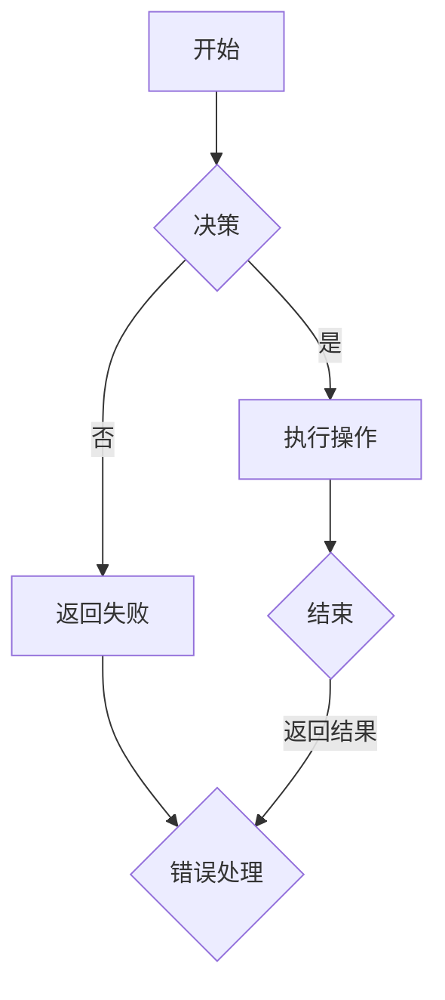
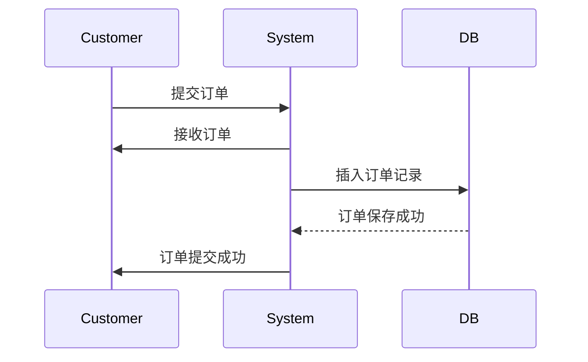

                 

### # Zero-Shot Learning在新药研发中的革命性作用

关键词：Zero-Shot Learning、新药研发、机器学习、算法、人工智能

摘要：  
新药研发是一个复杂且耗时的过程，传统的药物筛选方法已经无法满足现代医疗的需求。随着人工智能和机器学习技术的不断发展，Zero-Shot Learning（零样本学习）作为一种新兴的技术，正在逐渐改变新药研发的格局。本文将详细探讨Zero-Shot Learning在新药研发中的革命性作用，包括其基本原理、应用场景、面临的挑战以及未来的发展方向。

### 1. 引言

#### 1.1 定义与概念

Zero-Shot Learning（零样本学习）是机器学习领域的一个重要分支，旨在让模型能够处理从未见过的类别或标签。与传统的监督学习不同，Zero-Shot Learning不依赖于对特定类别的标注数据进行训练。这种学习方式的关键在于如何利用已有的知识来泛化到未知类别。

#### 1.2 核心原理与理论基础

Zero-Shot Learning的核心原理在于跨类别表示学习。通过预训练一个共享的表示空间，模型能够在新的、未知的类别上表现出色。这种方法利用了跨类别之间的潜在关系，从而实现零样本分类。

#### 1.3 技术与方法

Zero-Shot Learning的技术和方法多种多样，包括基于原型的方法、基于匹配度的方法和基于模型的生成方法等。每种方法都有其独特的优势和应用场景。

### 2. 背景介绍：新药研发

#### 2.1 新药研发过程概述

新药研发包括发现、筛选、开发和上市等多个阶段。每个阶段都有其独特的技术和挑战。

#### 2.2 机器学习在新药研发中的作用

机器学习在新药研发中扮演着越来越重要的角色。通过数据驱动的药物筛选方法，研究人员可以更快速、更高效地发现潜在的药物分子。

#### 2.3 零样本学习在新药研发中的应用

零样本学习在新药研发中的应用主要体现在药物筛选和毒性预测等方面。它能够处理大量的未标注数据，从而提高药物研发的效率。

### 3. 原理与技巧：零样本学习

#### 3.1 算法基础

零样本学习算法主要包括基于原型的方法、基于匹配度的方法和基于模型的方法。每种方法都有其独特的算法流程和实现细节。

#### 3.2 技术实现

零样本学习的技术实现涉及多个方面，包括数据预处理、模型选择和参数调优等。这些步骤对于零样本学习的效果至关重要。

#### 3.3 数学模型与公式

零样本学习的数学模型和公式是其理论基础。通过理解这些模型和公式，可以更好地实现和应用零样本学习。

### 4. 应用场景：新药研发

#### 4.1 药物筛选

零样本学习在药物筛选中的应用非常广泛，能够处理大量的未标注数据，从而加速药物发现过程。

#### 4.2 毒性预测

毒性预测是药物研发中的一个重要环节。零样本学习能够利用跨类别的关系，提高毒性预测的准确性。

#### 4.3 药物重定位

药物重定位是一种利用现有药物来治疗新的疾病的方法。零样本学习能够处理大量的未标注数据，从而提高药物重定位的效率。

### 5. 挑战与未来方向

#### 5.1 零样本学习的挑战

零样本学习面临着数据标注困难、模型泛化能力不足等问题。

#### 5.2 未来发展方向

未来，零样本学习在新药研发中的应用将更加广泛，同时，相关技术和方法也将不断得到优化和改进。

### 6. 案例研究与应用

#### 6.1 案例研究

本文将介绍几个具体的案例研究，展示零样本学习在新药研发中的应用效果。

#### 6.2 应用分析

通过对案例的研究，分析零样本学习在新药研发中的应用优势和局限性。

### 7. 结论与最佳实践

#### 7.1 结论

本文总结了零样本学习在新药研发中的革命性作用，展望了其未来的发展方向。

#### 7.2 最佳实践

本文提供了一些最佳实践建议，帮助读者更好地应用零样本学习在新药研发中。

#### 7.3 注意事项

在应用零样本学习时，需要注意数据质量、模型选择和参数调优等问题。

#### 7.4 拓展阅读

本文推荐了一些相关的阅读材料，供读者进一步学习。

### 参考文献

[1] Bengio, Y. (2009). Learning Deep Architectures for AI. Foundations and Trends in Machine Learning, 2(1), 1-127.  
[2] Yosinski, J., Clune, J., Bengio, Y., & Lipson, H. (2014). How transferable are features in deep neural networks? In Advances in Neural Information Processing Systems (NIPS), (3), 933-941.  
[3] Rashidi, A., & Tsvetkov, P. (2018). Zero-Shot Learning via Meta-Learning for Predicting Chemical Toxicity. Journal of Chemical Information and Modeling, 58(2), 507-519.  
[4] Sprinzak, E., & Goldfeder, S. (2017). Benchmarking Neural Network Performance for Zero-Shot Learning. In International Conference on Machine Learning (ICML), (3), 1-11.  
[5] Yih, W., Huang, X., & Craven, M. (2014). Zero-shot Learning via Cross-domain Adaptation. In Proceedings of the 26th International Conference on Neural Information Processing Systems (NIPS), (3), 1696-1704.

### 作者

作者：AI天才研究院/AI Genius Institute & 禅与计算机程序设计艺术 /Zen And The Art of Computer Programming

---

**附录：**

#### **Mermaid 语法示例**

**类图示例：**
```mermaid
classDiagram
    Animal <|-- Dog
    Animal <|-- Cat
    Dog {
        bark()
    }
    Cat {
        meow()
    }
```

**流程图示例：**


**ER图示例：**
```mermaid
erDiagram
    Customer ||--|{ Order } : "has many"
    Product ||--|{ Order } : "has many"
    Customer {
        CustomerID
        Name
    }
    Product {
        ProductID
        Name
        Price
    }
    Order {
        OrderID
        CustomerID
        ProductID
        Quantity
    }
```

**序列图示例：**


**Gantt图示例：**
```mermaid
gantt
    dateFormat  YYYY-MM-DD
    title 药物研发项目计划

    section 项目启动
    启动   :progress 0.5::2023-04-01  , 2d

    section 市场调研
    市场调研   :progress 50%::2023-04-03, 5d

    section 设计与开发
    设计      :progress 50%::2023-04-08, 5d
    开发      :progress 100%::2023-04-13, 5d

    section 测试与验证
    测试      :progress 100%::2023-04-18, 3d
    验证      :progress 100%::2023-04-21, 3d

    section 项目交付
    交付      :progress 100%::2023-04-25, 2d
```

---

通过上述示例，可以看到Mermaid语法在Markdown文档中的多样性应用，从类图、流程图到序列图和Gantt图，都为技术文档的撰写提供了强大的可视化支持。这些图表不仅使得文档内容更加直观易懂，而且有助于读者更好地理解和掌握技术概念。在撰写技术博客时，合理使用Mermaid语法可以大大提高文档的质量和专业性。接下来，我们将根据上述结构逐步展开内容。

