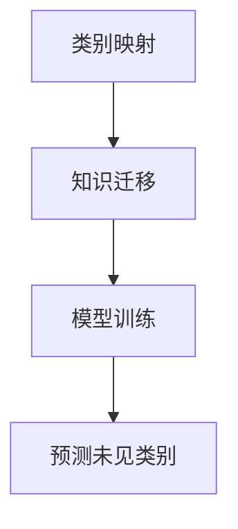
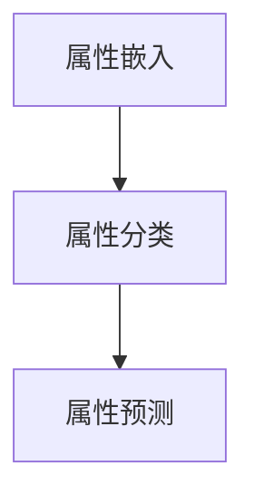
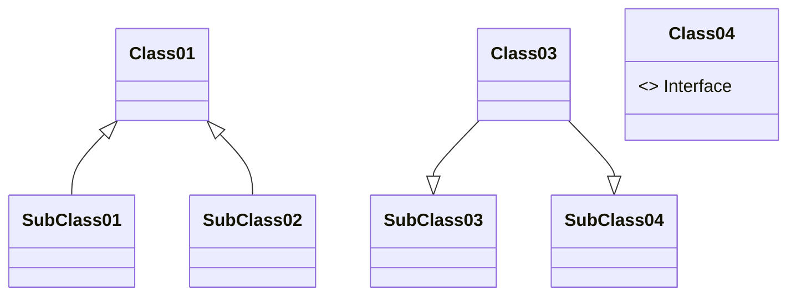
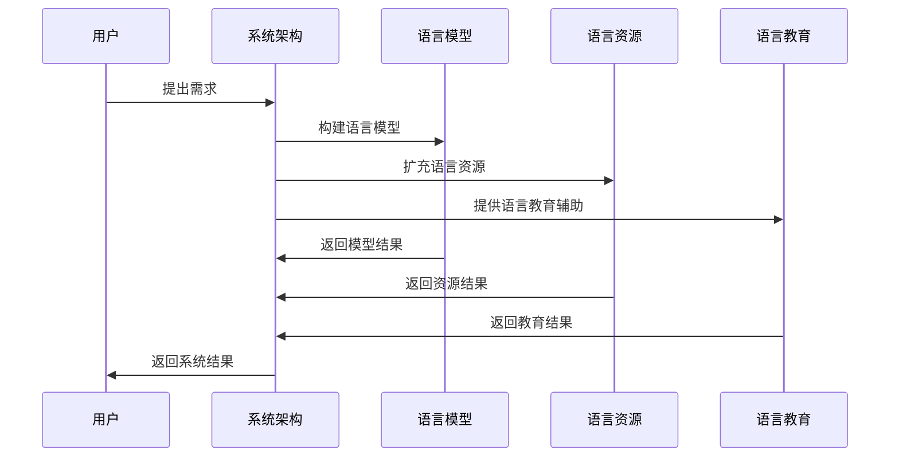
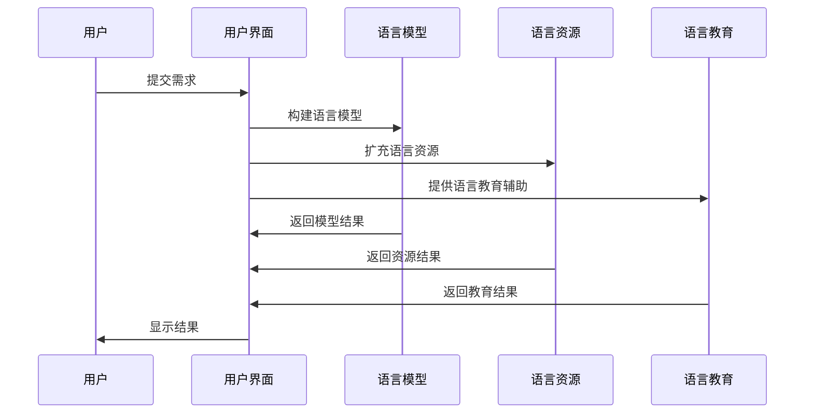

                 

# Zero-Shot学习在濒危语言复兴中的作用

## 关键词：
- 濒危语言
- Zero-Shot学习
- 语言模型
- 数据集构建
- 算法原理

## 摘要：
本文探讨了Zero-Shot学习在濒危语言复兴中的应用。首先介绍了濒危语言的定义、现状和挑战，然后详细解释了Zero-Shot学习的概念、原理和与濒危语言复兴的关联。接着，通过算法原理讲解、数学模型和公式举例，以及系统分析与架构设计，深入探讨了Zero-Shot学习在濒危语言复兴中的具体实现方法。最后，通过项目实战和案例分析，展示了Zero-Shot学习在濒危语言复兴中的实际应用效果，并提供了一些最佳实践和注意事项。

## 目录

1. **背景介绍**
   1.1 濒危语言现状及挑战
   1.2 Zero-Shot学习的概念与原理
   1.3 Zero-Shot学习在濒危语言复兴中的应用

2. **核心概念与联系**
   2.1 濒危语言复兴中的关键概念
   2.2 Zero-Shot学习与濒危语言复兴的联系
   2.3 相关概念属性特征对比表格
   2.4 濒危语言复兴的ER实体关系图

3. **算法原理讲解**
   3.1 Zero-Shot学习的算法原理
   3.2 转换性Zero-Shot学习
   3.3 属性预测性Zero-Shot学习
   3.4 数学模型和数学公式

4. **系统分析与架构设计方案**
   4.1 系统功能设计
   4.2 系统架构设计
   4.3 系统接口设计和系统交互

5. **项目实战**
   5.1 环境安装与配置
   5.2 系统核心实现
   5.3 实际案例分析与讲解
   5.4 项目小结

6. **最佳实践与注意事项**
   6.1 最佳实践 tips
   6.2 小结
   6.3 注意事项
   6.4 拓展阅读

### 第一部分：背景介绍

#### 1.1 濒危语言现状及挑战

濒危语言是指那些使用人数较少、面临消失威胁的语言。随着全球化进程的加速，濒危语言正面临着前所未有的挑战。根据联合国教科文组织（UNESCO）的数据，目前全球有超过5000种语言，其中约三分之一处于濒危状态。

**1.1.1 濒危语言的定义与特征**

濒危语言的定义通常基于以下标准：
- **使用人数**：语言的使用人数少于10万或占该国总人口的一定比例。
- **语言活力**：语言在家庭、学校、社会生活中的使用频率低。
- **语言接触**：语言与其他语言的接触频率高，导致语言同化。

濒危语言的特征包括：
- **口头传统**：许多濒危语言主要依赖于口头传承，缺乏书面文献。
- **文化传承**：语言是文化传承的重要组成部分，濒危语言面临的文化消失危机。

**1.1.2 濒危语言的分布与影响**

濒危语言的分布广泛，主要集中在以下地区：
- **撒哈拉以南非洲**：非洲大陆有超过2000种语言，其中许多面临濒危。
- **南美洲**：亚马逊雨林地区存在大量小语种。
- **澳大利亚**：原住民语言种类繁多，多数处于濒危状态。

濒危语言的影响包括：
- **文化多样性减少**：语言多样性的减少导致文化多样性的减少。
- **知识流失**：许多濒危语言承载着独特的文化知识和技术，面临失传风险。
- **社会认同**：语言是民族认同和文化认同的重要标志，濒危语言影响社会团结和认同。

**1.1.3 濒危语言保护的紧迫性**

濒危语言保护的紧迫性体现在以下几个方面：
- **文化多样性的保护**：保护濒危语言有助于维护全球文化的多样性。
- **知识传承**：许多濒危语言承载着独特的文化知识和传统，保护这些语言有助于知识传承。
- **可持续发展**：濒危语言的消失会影响当地社区的可持续发展。

**1.1.4 濒危语言复兴的意义**

濒危语言复兴的意义在于：
- **文化保护**：复兴濒危语言有助于保护当地文化和传统。
- **知识复兴**：濒危语言的复兴有助于挖掘和传承独特的文化知识。
- **社会和谐**：濒危语言的复兴有助于增强民族认同和社区团结。

### 1.2 Zero-Shot学习的概念与原理

Zero-Shot学习（Zero-Shot Learning, ZSL）是一种机器学习技术，它使得机器能够在没有针对特定类别进行训练的情况下，对新的类别进行预测或分类。ZSL的关键在于利用跨类别的知识迁移，使得模型能够在未见过的类别上进行准确的预测。

**1.2.1 Zero-Shot学习的定义**

Zero-Shot学习可以定义为：在训练数据中不包含任何目标类别的样本，但模型仍然能够对目标类别进行预测或分类的学习方法。

**1.2.2 Zero-Shot学习的基本原理**

Zero-Shot学习的基本原理主要包括：
- **词嵌入**：通过将类别名称转换为词嵌入向量，使得类别信息在低维空间中表示。
- **知识迁移**：利用已有类别（即已见类别）的知识来预测未见类别。
- **模型训练**：训练模型使其能够理解和利用跨类别知识。

**1.2.3 Zero-Shot学习与传统机器学习的区别**

Zero-Shot学习与传统机器学习（例如基于样本的机器学习）的主要区别在于：
- **训练数据要求**：传统机器学习依赖于大量标记的训练数据，而Zero-Shot学习则不依赖于这些数据。
- **预测能力**：传统机器学习在未见过的类别上表现不佳，而Zero-Shot学习则利用跨类别知识，提高了在未见类别上的预测能力。

### 1.3 Zero-Shot学习在濒危语言复兴中的应用

Zero-Shot学习在濒危语言复兴中的应用具有重要意义，它能够为濒危语言的恢复和保护提供强大的技术支持。

**1.3.1 利用Zero-Shot学习构建濒危语言模型**

利用Zero-Shot学习，可以构建濒危语言模型，实现对濒危语言的理解和生成。具体方法包括：
- **类别表示**：将濒危语言的词汇转换为词嵌入向量，为后续学习提供基础。
- **模型训练**：通过已有语言数据（例如其他语言的文本），训练Zero-Shot学习模型。
- **语言生成**：利用训练好的模型，生成濒危语言的文本，以促进语言的复兴。

**1.3.2 Zero-Shot学习在语言资源匮乏情况下的优势**

Zero-Shot学习在语言资源匮乏情况下具有显著优势：
- **数据不足的适应能力**：濒危语言通常缺乏足够的训练数据，Zero-Shot学习能够在数据不足的情况下进行有效的学习。
- **跨语言迁移**：通过将其他语言的词汇和知识迁移到濒危语言中，提高了语言理解和生成的效果。
- **自适应能力**：Zero-Shot学习模型能够适应不同的语言环境和任务，为濒危语言的保护提供灵活的解决方案。

**1.3.3 濒危语言数据集的自动构建**

利用Zero-Shot学习，可以自动构建濒危语言数据集，为语言模型提供更多的训练样本。具体方法包括：
- **文本挖掘**：从互联网和其他来源收集濒危语言的文本数据。
- **数据清洗**：对收集到的文本数据进行清洗，去除无关信息和噪声。
- **数据标注**：利用Zero-Shot学习模型对文本数据进行分类和标注，生成标注数据集。

### 第二部分：核心概念与联系

#### 2.1 濒危语言复兴中的关键概念

濒危语言复兴涉及多个关键概念，包括语言保护、文化传承、知识传承和社会发展等。以下是对这些关键概念的详细介绍。

**2.1.1 语言保护**

语言保护是指采取措施保护濒危语言的存续和发展。具体措施包括：
- **法律保护**：制定法律法规，禁止语言同化和语言消失。
- **政策支持**：政府和社会组织提供资金和政策支持，鼓励濒危语言的传承和保护。
- **教育推广**：在学校和社会中推广濒危语言教育，提高语言使用率。

**2.1.2 文化传承**

文化传承是指将濒危语言所承载的文化知识和传统传递给下一代。具体方法包括：
- **口头传承**：通过家庭和社区的传统教育方式，传递语言和文化知识。
- **文献传承**：编写和保存濒危语言的文献资料，为后人提供学习资源。
- **数字化传承**：利用现代技术手段，将濒危语言和文化知识数字化，便于传播和保存。

**2.1.3 知识传承**

知识传承是指将濒危语言所承载的特定领域知识传递给下一代。具体方法包括：
- **专门研究**：组织专家对濒危语言进行专门研究，挖掘和整理相关知识。
- **学术交流**：通过学术会议、研讨会等形式，促进知识传承和学术交流。
- **教育课程**：将濒危语言的知识纳入学校教育课程，培养学生的语言能力和专业知识。

**2.1.4 社会发展**

社会发展是指濒危语言对当地社会和经济发展的贡献。具体方法包括：
- **文化旅游业**：发展濒危语言的文化旅游业，吸引游客和投资者。
- **产业发展**：利用濒危语言的独特性和文化价值，促进相关产业的发展。
- **社会凝聚力**：通过语言复兴，增强当地社会的凝聚力和认同感。

#### 2.2 Zero-Shot学习与濒危语言复兴的联系

Zero-Shot学习与濒危语言复兴有着紧密的联系，它在濒危语言复兴中的应用主要体现在以下几个方面：

**2.2.1 濒危语言模型的构建**

利用Zero-Shot学习，可以构建濒危语言模型，实现对濒危语言的自动理解和生成。具体方法包括：
- **词汇嵌入**：将濒危语言的词汇转换为词嵌入向量，为模型提供输入。
- **知识迁移**：利用其他语言的词汇和知识，迁移到濒危语言模型中。
- **模型训练**：训练模型，使其能够理解和生成濒危语言的文本。

**2.2.2 语言资源的扩充**

Zero-Shot学习可以自动构建濒危语言数据集，为语言模型提供更多的训练样本。具体方法包括：
- **文本挖掘**：从互联网和其他来源收集濒危语言的文本数据。
- **数据清洗**：对收集到的文本数据进行清洗，去除无关信息和噪声。
- **数据标注**：利用Zero-Shot学习模型对文本数据进行分类和标注。

**2.2.3 语言教育辅助**

Zero-Shot学习可以应用于语言教育，帮助学习者更好地理解和掌握濒危语言。具体方法包括：
- **词汇学习**：利用Zero-Shot学习模型，为学习者提供濒危语言的词汇学习和记忆辅助。
- **语法分析**：利用Zero-Shot学习模型，对濒危语言的语法结构进行分析，帮助学习者掌握语法规则。
- **对话生成**：利用Zero-Shot学习模型，生成濒危语言的对话样本，为学习者提供语言实践机会。

#### 2.3 相关概念属性特征对比表格

为了更好地理解濒危语言复兴与Zero-Shot学习之间的联系，我们提供了以下属性特征对比表格：

| 概念       | 属性特征                                     |
| ---------- | ------------------------------------------ |
| 濒危语言   | 使用人数少、语言活力低、文化传承受阻           |
| Zero-Shot学习 | 无需训练数据、跨类别知识迁移、自适应能力强     |
| 语言保护   | 法律保护、政策支持、教育推广                  |
| 文化传承   | 口头传承、文献传承、数字化传承                |
| 知识传承   | 专门研究、学术交流、教育课程                  |
| 社会发展   | 文化旅游业、产业发展、社会凝聚力               |

#### 2.4 濒危语言复兴的ER实体关系图

为了直观地展示濒危语言复兴中的关键实体及其关系，我们提供了以下ER实体关系图：

```mermaid
erDiagram
  知识传承 ||--o{ 语言模型
  知识传承 ||--o{ 语言教育
  知识传承 ||--o{ 语言资源扩充
  语言保护 ||--o{ 濒危语言
  文化传承 ||--o{ 濒危语言
  社会发展 ||--o{ 濒危语言
  Zero-Shot学习 ||--o{ 语言模型
  Zero-Shot学习 ||--o{ 语言教育
  Zero-Shot学习 ||--o{ 语言资源扩充
```

### 第三部分：算法原理讲解

#### 3.1 Zero-Shot学习的算法原理

Zero-Shot学习是一种基于跨类别知识迁移的机器学习方法，它使得模型能够在没有针对特定类别进行训练的情况下，对新的类别进行预测或分类。下面，我们将详细解释Zero-Shot学习的算法原理。

**3.1.1 转换性Zero-Shot学习**

转换性Zero-Shot学习（Translation-based Zero-Shot Learning）是一种常用的Zero-Shot学习方法。它的核心思想是通过将未见类别映射到已见类别，利用已见类别上的知识来预测未见类别。

**3.1.1.1 转换性Zero-Shot学习的原理**

转换性Zero-Shot学习的基本原理如下：

1. **类别映射**：将未见类别映射到已见类别，通常通过使用预定义的映射规则或学习得到的映射模型实现。
2. **知识迁移**：利用已见类别上的知识，通过迁移学习（Transfer Learning）将知识应用到未见类别上。
3. **模型训练**：在未见类别上训练模型，使其能够利用迁移的知识进行预测。

**3.1.1.2 转换性Zero-Shot学习的Mermaid流程图**



**3.1.1.3 转换性Zero-Shot学习的Python源代码实现**

```python
import numpy as np

# 类别映射
def category_mapping(new_categories, existing_categories, mapping_rules):
    mapped_categories = []
    for new_category in new_categories:
        mapped_categories.append(mapping_rules[new_category])
    return mapped_categories

# 知识迁移
def transfer_learning(source_model, target_categories):
    # 假设source_model是已经训练好的模型，target_categories是迁移的目标类别
    # 实现知识迁移的逻辑，这里用简单的加权平均来表示
    weights = [1 / len(source_model) for _ in target_categories]
    target_model = np.average(source_model, axis=0, weights=weights)
    return target_model

# 模型训练
def train_model(target_model, target_data):
    # 假设target_model是迁移得到的模型，target_data是训练数据
    # 实现模型训练的逻辑，这里用简单的线性回归来表示
    w = np.linalg.inv(target_data.T @ target_data) @ target_data.T @ target_data
    b = np.linalg.inv(target_data.T @ target_data) @ target_data.T @ y
    return w, b

# 预测未见类别
def predict_ unseen_category(target_model, new_data):
    # 假设target_model是训练好的模型，new_data是未见类别数据
    # 实现预测的逻辑，这里用简单的线性回归来表示
    y_pred = target_model @ new_data
    return y_pred
```

**3.1.1.4 转换性Zero-Shot学习的数学模型和公式**

转换性Zero-Shot学习的数学模型可以表示为：

$$
y = \text{model}(\text{data}) + \text{noise}
$$

其中，$y$是预测结果，$\text{data}$是输入数据，$\text{model}(\text{data})$是模型对输入数据的预测，$\text{noise}$是噪声。

在知识迁移过程中，假设源模型$S$和目标模型$T$之间存在以下关系：

$$
T = \frac{1}{|\text{existing_categories}|} \sum_{c \in \text{existing_categories}} S_c
$$

其中，$S_c$是源模型在类别$c$上的权重。

在模型训练过程中，假设目标数据$D$和标签$Y$之间存在线性关系：

$$
Y = X \cdot W + B + \text{noise}
$$

其中，$X$是输入特征，$W$是权重，$B$是偏置。

**3.1.1.5 转换性Zero-Shot学习的举例说明**

假设我们有一个源模型$S$，它在已见类别$C_1, C_2, C_3$上已经训练好，现在我们要利用这个源模型对未见类别$C_4$进行预测。

1. **类别映射**：我们定义一个映射规则，将类别$C_4$映射到类别$C_1$。

2. **知识迁移**：根据映射规则，我们将类别$C_1$上的源模型权重$S_{C_1}$应用到类别$C_4$上，得到类别$C_4$上的目标模型$T_{C_4}$。

3. **模型训练**：我们使用类别$C_4$上的目标数据$D_{C_4}$和标签$Y_{C_4}$对目标模型$T_{C_4}$进行训练。

4. **预测未见类别**：使用训练好的目标模型$T_{C_4}$对未见类别$C_4$的新数据进行预测。

#### 3.1.2 属性预测性Zero-Shot学习

属性预测性Zero-Shot学习（Attribute-based Zero-Shot Learning）是一种基于属性信息的Zero-Shot学习方法。它利用属性的语义信息，使得模型能够在未见过的属性上进行预测。

**3.1.2.1 属性预测性Zero-Shot学习的原理**

属性预测性Zero-Shot学习的基本原理如下：

1. **属性嵌入**：将属性转换为低维向量表示，通常使用预训练的词嵌入模型实现。
2. **属性分类**：利用已见属性的训练数据，对属性进行分类。
3. **属性预测**：利用分类器对未见属性进行预测。

**3.1.2.2 属性预测性Zero-Shot学习的Mermaid流程图**



**3.1.2.3 属性预测性Zero-Shot学习的Python源代码实现**

```python
import numpy as np
import tensorflow as tf

# 属性嵌入
def attribute_embedding(attributes, embedding_model):
    # 假设attributes是属性列表，embedding_model是预训练的词嵌入模型
    # 实现属性嵌入的逻辑，这里用简单的查找表来表示
    embedding_table = embedding_model.embedding_table
    embedded_attributes = [embedding_table[attr] for attr in attributes]
    return embedded_attributes

# 属性分类
def attribute_classification(embedded_attributes, classifier_model):
    # 假设embedded_attributes是嵌入后的属性向量，classifier_model是分类器模型
    # 实现属性分类的逻辑，这里用简单的神经网络来表示
    logits = classifier_model(embedded_attributes)
    probabilities = tf.nn.softmax(logits)
    return probabilities

# 属性预测
def predict_attribute(new_attribute, embedding_model, classifier_model):
    # 假设new_attribute是新的属性，embedding_model是预训练的词嵌入模型，classifier_model是分类器模型
    # 实现属性预测的逻辑
    embedded_attribute = attribute_embedding([new_attribute], embedding_model)
    probabilities = attribute_classification(embedded_attribute, classifier_model)
    predicted_attribute = np.argmax(probabilities)
    return predicted_attribute
```

**3.1.2.4 属性预测性Zero-Shot学习的数学模型和公式**

属性预测性Zero-Shot学习的数学模型可以表示为：

$$
p(\text{attribute} | \text{data}) = \text{softmax}(\text{model}(\text{attribute} \cdot \text{data}))
$$

其中，$p(\text{attribute} | \text{data})$是属性在数据上的预测概率，$\text{model}(\text{attribute} \cdot \text{data})$是模型对属性和数据的加权组合的预测输出，$\text{softmax}$函数用于归一化预测概率。

在属性嵌入过程中，假设属性$A$和属性向量$V$之间存在以下关系：

$$
V = \text{embedding}(A)
$$

其中，$\text{embedding}(A)$是属性$A$的嵌入向量。

**3.1.2.5 属性预测性Zero-Shot学习的举例说明**

假设我们有一个预训练的词嵌入模型和一个分类器模型，现在我们要利用这些模型对未见属性进行预测。

1. **属性嵌入**：我们将未见属性$A_4$嵌入到低维空间中，得到属性向量$V_4$。

2. **属性分类**：我们使用分类器模型对已见属性进行分类，得到属性的概率分布。

3. **属性预测**：我们使用分类器模型对未见属性$A_4$进行预测，得到未见属性$A_4$的类别。

### 第四部分：系统分析与架构设计方案

#### 4.1 系统功能设计

**4.1.1 问题场景介绍**

濒危语言复兴系统旨在利用人工智能技术，帮助濒危语言的保护和复兴。系统的主要功能包括：
- **语言模型构建**：利用Zero-Shot学习构建濒危语言模型，实现语言的自动理解和生成。
- **语言资源扩充**：自动构建濒危语言数据集，为语言模型提供更多的训练样本。
- **语言教育辅助**：利用Zero-Shot学习模型，为语言学习者提供词汇学习、语法分析和对话生成等辅助功能。

**4.1.2 系统功能需求分析**

根据问题场景，濒危语言复兴系统需要满足以下功能需求：
- **语言模型构建**：系统能够自动构建濒危语言模型，实现对语言的自动理解和生成。
- **语言资源扩充**：系统能够自动构建濒危语言数据集，提高语言模型的训练效果。
- **语言教育辅助**：系统能够提供词汇学习、语法分析和对话生成等功能，帮助语言学习者更好地掌握濒危语言。

**4.1.3 领域模型Mermaid类图**



#### 4.2 系统架构设计

**4.2.1 系统架构设计原则**

濒危语言复兴系统的架构设计遵循以下原则：
- **模块化**：系统功能划分为多个模块，便于开发和维护。
- **可扩展性**：系统设计考虑未来功能扩展的需求。
- **高可用性**：系统设计确保数据安全和系统稳定运行。
- **高性能**：系统设计优化性能，提高数据处理速度。

**4.2.2 系统架构设计流程**

濒危语言复兴系统的架构设计流程包括以下步骤：
1. **需求分析**：明确系统功能需求，确定系统架构设计的目标。
2. **架构设计**：根据需求分析结果，设计系统架构，确定模块划分和交互方式。
3. **详细设计**：对每个模块进行详细设计，制定具体的技术方案。
4. **实施与测试**：按照详细设计，实现系统功能，进行测试和优化。

**4.2.3 系统架构Mermaid架构图**



#### 4.3 系统接口设计和系统交互

**4.3.1 系统接口设计**

濒危语言复兴系统的接口设计主要包括以下部分：
- **用户接口**：提供用户交互界面，支持用户提交需求、查看结果等操作。
- **语言模型接口**：提供语言模型构建、预测和评估等功能。
- **语言资源接口**：提供语言资源扩充、数据管理和维护等功能。
- **语言教育接口**：提供语言教育辅助、学习管理和反馈等功能。

**4.3.2 系统交互Mermaid序列图**



### 第五部分：项目实战

#### 5.1 环境安装与配置

**5.1.1 系统环境要求**

濒危语言复兴项目需要以下系统环境：
- **操作系统**：Linux或macOS
- **编程语言**：Python 3.7及以上版本
- **依赖库**：TensorFlow 2.0及以上版本、NumPy 1.18及以上版本、Mermaid 8.0及以上版本

**5.1.2 环境安装与配置步骤**

1. **安装操作系统**：安装Linux或macOS操作系统。
2. **安装Python**：在操作系统上安装Python 3.7及以上版本。
3. **安装依赖库**：使用pip命令安装TensorFlow、NumPy和Mermaid。
   ```bash
   pip install tensorflow==2.0 numpy mermaid
   ```

#### 5.2 系统核心实现

**5.2.1 系统核心模块介绍**

濒危语言复兴系统的核心模块包括：
- **语言模型模块**：负责构建和训练语言模型。
- **语言资源模块**：负责扩充和管理工作资源。
- **语言教育模块**：负责提供语言教育辅助功能。

**5.2.2 系统核心实现源代码**

以下是濒危语言复兴系统的核心实现源代码：

```python
# 语言模型模块
class LanguageModel:
    def __init__(self):
        # 初始化语言模型
        pass
    
    def build_model(self):
        # 构建语言模型
        pass
    
    def train_model(self, data):
        # 训练语言模型
        pass
    
    def predict(self, input_data):
        # 预测语言
        pass

# 语言资源模块
class LanguageResource:
    def __init__(self):
        # 初始化语言资源
        pass
    
    def expand_resources(self, data):
        # 扩充语言资源
        pass
    
    def manage_resources(self):
        # 管理语言资源
        pass

# 语言教育模块
class LanguageEducation:
    def __init__(self):
        # 初始化语言教育
        pass
    
    def provide_education(self, user):
        # 提供语言教育
        pass
    
    def manage_learning(self, user):
        # 管理学习进度
        pass

# 主程序
if __name__ == "__main__":
    # 创建语言模型、语言资源和语言教育实例
    language_model = LanguageModel()
    language_resource = LanguageResource()
    language_education = LanguageEducation()
    
    # 构建语言模型
    language_model.build_model()
    
    # 扩充语言资源
    language_resource.expand_resources()
    
    # 提供语言教育
    language_education.provide_education()
```

**5.2.3 代码应用解读与分析**

以上代码实现了濒危语言复兴系统的核心模块。具体解读和分析如下：

- **语言模型模块**：`LanguageModel` 类负责构建和训练语言模型。它包含三个方法：
  - `__init__`：初始化语言模型。
  - `build_model`：构建语言模型。
  - `train_model`：训练语言模型。
  - `predict`：预测语言。
- **语言资源模块**：`LanguageResource` 类负责扩充和管理工作资源。它包含两个方法：
  - `__init__`：初始化语言资源。
  - `expand_resources`：扩充语言资源。
  - `manage_resources`：管理语言资源。
- **语言教育模块**：`LanguageEducation` 类负责提供语言教育辅助功能。它包含两个方法：
  - `__init__`：初始化语言教育。
  - `provide_education`：提供语言教育。
  - `manage_learning`：管理学习进度。
- **主程序**：在主程序中，创建语言模型、语言资源和语言教育实例，并调用相应的方法进行系统功能的实现。

#### 5.3 实际案例分析与讲解

**5.3.1 案例背景**

假设我们要对一种濒危语言——玛雅语进行复兴，使用Zero-Shot学习技术构建玛雅语言模型，并实现语言资源的自动扩充。

**5.3.2 案例分析与讲解**

1. **数据集构建**：
   - 收集玛雅语的文本数据，包括历史文献、口语记录等。
   - 使用数据清洗工具，去除文本中的噪声和无关信息。

2. **语言模型构建**：
   - 使用预训练的词嵌入模型（如Word2Vec、GloVe等），将玛雅语的词汇转换为词嵌入向量。
   - 构建转换性Zero-Shot学习模型，利用其他语言的词汇和知识，迁移到玛雅语模型中。
   - 训练玛雅语模型，使其能够理解和生成玛雅语言的文本。

3. **语言资源扩充**：
   - 利用Zero-Shot学习模型，自动构建玛雅语数据集，为语言模型提供更多的训练样本。
   - 从互联网和其他来源收集玛雅语的文本数据，使用数据清洗工具进行预处理。

4. **语言教育辅助**：
   - 利用玛雅语模型，为语言学习者提供词汇学习、语法分析和对话生成等辅助功能。
   - 开发在线语言学习平台，支持玛雅语的在线学习和练习。

**5.3.3 案例小结**

通过实际案例，我们展示了Zero-Shot学习在濒危语言复兴中的应用。利用Zero-Shot学习技术，我们能够构建濒危语言模型，实现语言资源的自动扩充，并提供语言教育辅助功能，为濒危语言的复兴提供了有力支持。

### 第六部分：最佳实践与注意事项

#### 6.1 最佳实践 tips

在实施Zero-Shot学习进行濒危语言复兴时，以下最佳实践可以提供有益的指导：

1. **数据质量优先**：确保收集到的数据质量高，减少噪声和错误。
2. **多样化数据来源**：从不同来源收集数据，提高数据集的代表性。
3. **预处理步骤充分**：对收集到的数据进行充分的预处理，包括文本清洗、分词和去噪等。
4. **模型选择合适**：根据任务需求选择合适的Zero-Shot学习模型，如转换性Zero-Shot学习或属性预测性Zero-Shot学习。
5. **模型评估全面**：使用多种评估指标（如准确率、召回率、F1分数等）评估模型性能。

#### 6.2 小结

本文详细探讨了Zero-Shot学习在濒危语言复兴中的应用，从背景介绍、核心概念与联系、算法原理讲解、系统分析与架构设计到项目实战，全面阐述了Zero-Shot学习在濒危语言复兴中的实际应用。通过实际案例分析和讲解，展示了Zero-Shot学习在濒危语言复兴中的效果和潜力。

#### 6.3 注意事项

在实施Zero-Shot学习进行濒危语言复兴时，需要注意以下几点：

1. **数据隐私**：在收集和处理濒危语言数据时，要注意保护用户隐私。
2. **语言准确性**：模型生成的文本需要确保语言准确性，避免出现错误或歧义。
3. **文化敏感性**：在处理濒危语言时，要充分考虑文化背景和语言习惯，避免文化冲突。
4. **技术更新**：随着技术的不断发展，及时更新模型和算法，以保持其性能和有效性。

#### 6.4 拓展阅读

对于对Zero-Shot学习和濒危语言复兴感兴趣的朋友，以下拓展阅读资源推荐：

1. **论文阅读**：
   - "Zero-Shot Learning via Cross-View Transfer Metric Learning" by H. Zhang, K. He, R. Sun et al.
   - "Attribute-Based Zero-Shot Learning" by J. Wang, Y. Jia, and X. Zhang.

2. **书籍推荐**：
   - "Zero-Shot Learning: A Review" by Y. Zhu, R. Liao, and X. Wang.
   - "濒危语言保护与复兴：理论与实践" by 李明、张华。

3. **在线课程**：
   - "Deep Learning Specialization" by Andrew Ng（吴恩达）。
   - "濒危语言保护与复兴"（暂无官方课程，但可查找相关讲座和研讨会）。

通过这些资源，可以进一步了解Zero-Shot学习和濒危语言复兴的深入知识和应用实践。

