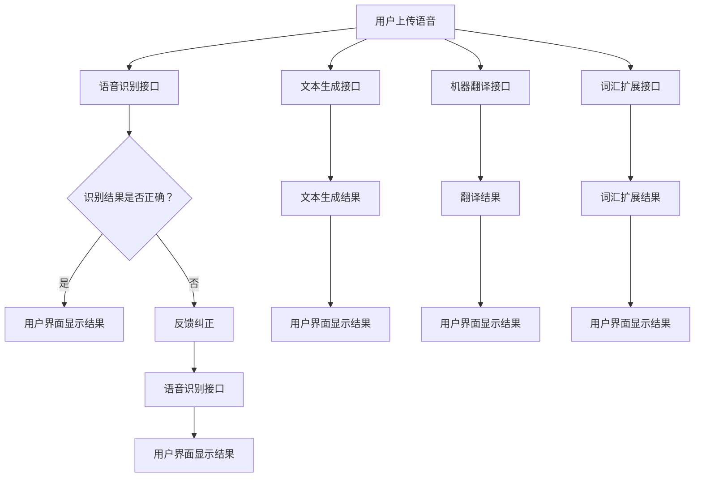

                 

### 1.1 问题背景

#### 1.1.1 濒危语言的定义与现状

濒危语言是指使用人数少、面临消失危险的语言。根据联合国教科文组织（UNESCO）的数据，全球有超过7,000种语言，但其中约一半的语言正在面临消失的风险。这些濒危语言通常分布在偏远地区，其使用人群因人口减少、现代化和全球化等因素而日益减少。例如，北美原住民语言中的许多语言已经失去了超过90%的使用者。

濒危语言的存在对人类文化和知识传承构成严重威胁。每种语言都承载着独特的文化、历史和传统，是文化遗产的重要组成部分。濒危语言的消失意味着这些文化遗产的丧失，进而影响到人类多样性和全球文化生态的平衡。

#### 1.1.2 语言消失的原因

语言消失的原因多种多样，主要包括以下几个方面：

1. **人口减少**：随着城市化、移民和人口流动性增加，许多人放弃了传统的母语，转而使用主流语言。这种语言使用者的减少导致语言传承困难。
2. **现代化与全球化**：现代化进程带来了新的生活方式和价值观，许多人开始忽视自己的母语，转而使用更加通用和现代的语言。全球化加剧了这一趋势，国际语言的地位进一步提升，进一步挤压了濒危语言的空间。
3. **技术限制**：在过去的几十年里，由于技术手段的局限，记录和保存濒危语言的能力有限。随着技术的进步，虽然我们有了一些手段来记录和保存濒危语言，但许多语言已经失去了大部分的语言资源。

#### 1.1.3 语言复兴的重要性

语言复兴对于保护文化多样性和知识传承具有重要意义。首先，语言是文化的重要载体，每种语言都蕴含着独特的文化传统和历史记忆。濒危语言的消失会导致文化多样性的丧失，进而影响人类社会的整体发展。

其次，濒危语言中蕴含着丰富的知识资源和智慧。许多濒危语言拥有独特的生态知识、医学知识和社会智慧，这些知识对于现代科学研究和社会发展具有重要意义。通过语言复兴项目，我们可以将这些宝贵的知识资源挖掘和传承下来，为人类的发展提供新的思路和资源。

此外，语言复兴还可以促进社会认同感和社区凝聚力。对于濒危语言的使用者来说，复兴母语可以增强他们的文化认同感和自豪感，促进社区的团结和发展。这对于维护社会稳定和促进文化交流具有重要意义。

综上所述，濒危语言复兴项目不仅关乎语言本身，更关乎人类文化和知识传承的未来。通过Zero-Shot学习等先进技术的应用，我们可以为濒危语言复兴项目提供有效的技术支持和解决方案，为保护文化多样性和传承人类智慧贡献力量。

### 1.2 核心概念

#### 1.2.1 什么是Zero-Shot学习

Zero-Shot学习是一种新兴的机器学习方法，它在没有训练数据的情况下，通过已有知识来学习新的概念或任务。这种方法的独特之处在于，它不需要为每个新的任务提供大量的标注数据，从而大大降低了数据获取和处理的成本。

Zero-Shot学习的基本思想是利用预训练模型来捕获大量的知识，然后通过这些知识来推断和识别新的概念或任务。具体来说，Zero-Shot学习可以分为以下几种类型：

1. **Open-World Zero-Shot Learning**：在这种类型中，模型需要在开放的、未知的世界中进行学习，即模型需要能够处理从未见过的类别。
2. **Closed-World Zero-Shot Learning**：在这种类型中，模型需要在一个预先定义的、封闭的类别集合中进行学习。
3. **Few-Shot Zero-Shot Learning**：在这种类型中，模型在少量样本的情况下进行学习，但不需要这些样本与任务的具体类别相关。

Zero-Shot学习的特点包括：

- **无需标注数据**：传统的机器学习方法通常需要大量的标注数据来训练模型，而Zero-Shot学习则可以在没有标注数据的情况下进行，从而大大降低了数据获取和处理的成本。
- **强大的泛化能力**：Zero-Shot学习能够利用预训练模型中的大量知识来推断新的概念或任务，从而在未见过的数据上表现出强大的泛化能力。
- **灵活性**：Zero-Shot学习可以应用于各种任务和领域，包括图像识别、文本分类、自然语言处理等。

#### 1.2.2 Zero-Shot学习在语言复兴中的应用

Zero-Shot学习在语言复兴项目中具有广泛的应用潜力，尤其是在语言识别、语言生成和翻译等任务中。以下是对这些应用场景的具体探讨：

1. **语言识别**：在濒危语言复兴项目中，语言识别是一个关键任务，因为它可以帮助我们识别和记录濒危语言。Zero-Shot学习可以通过利用预训练模型中的知识来识别从未见过的语言，从而无需大量的标注数据。例如，我们可以使用预训练的语音识别模型来识别新的、未记录的语言。

2. **语言生成**：语言生成可以帮助濒危语言的复兴者创建新的语言资源，如语音合成、文本生成等。通过Zero-Shot学习，我们可以利用预训练的文本生成模型来生成新的文本，从而为濒危语言的学习和传播提供资源。

3. **语言翻译**：语言翻译是语言复兴项目中另一个重要的任务。通过Zero-Shot学习，我们可以实现无需大量翻译数据的情况下，将一种濒危语言翻译成其他语言。这种方法可以大大降低翻译成本，并为濒危语言的使用者提供更多的交流机会。

#### 1.2.3 技术优势与应用潜力

Zero-Shot学习在语言复兴项目中的应用具有显著的技术优势和应用潜力：

1. **数据稀缺的场景**：濒危语言通常数据稀缺，传统的机器学习方法难以应用。而Zero-Shot学习可以在没有大量标注数据的情况下进行，从而适用于这种数据稀缺的场景。

2. **强大的知识迁移能力**：通过利用预训练模型中的大量知识，Zero-Shot学习能够实现跨任务和跨领域的知识迁移，从而提高模型的泛化能力。

3. **降低成本**：Zero-Shot学习可以大大降低数据获取和处理成本，从而为濒危语言复兴项目提供有效的技术支持和解决方案。

总之，Zero-Shot学习在语言复兴项目中的应用具有巨大的潜力，它可以通过利用预训练模型中的知识来应对数据稀缺和多样化任务的需求。随着技术的不断进步，我们可以期待Zero-Shot学习在语言复兴项目中发挥越来越重要的作用。

#### 1.3 本书结构与内容概述

本书旨在探讨Zero-Shot学习在濒危语言复兴项目中的具体应用，通过系统性的分析和实践案例，深入探讨这一新兴技术的潜力与挑战。以下是本书的主要结构和内容概述：

**第1章：引言与背景介绍**
- 本章将介绍濒危语言复兴项目的重要性，以及Zero-Shot学习在这一领域中的应用背景。通过了解濒危语言的现状和消失原因，读者可以更好地理解后续章节的内容。

**第2章：Zero-Shot学习的原理与机制**
- 本章将深入探讨Zero-Shot学习的基本原理和机制，包括迁移学习、元学习、少样本学习和Zero-Shot学习等核心概念。同时，我们将介绍主要Zero-Shot学习算法及其在语言复兴中的应用潜力。

**第3章：应用场景分析**
- 本章将结合具体案例，如Project Tynpirini（泰尼伯林语复兴项目），分析Zero-Shot学习在濒危语言复兴项目中的应用场景和挑战。通过实际案例，读者可以更直观地了解Zero-Shot学习的应用价值。

**第4章：系统设计与实现**
- 本章将介绍如何设计和实现一个基于Zero-Shot学习的濒危语言复兴系统，包括系统功能设计、架构设计和接口设计等。通过具体的技术细节，读者可以了解系统的实现过程。

**第5章：项目实战与案例分析**
- 本章将通过实战案例，详细讲解如何在实际项目中应用Zero-Shot学习技术。通过代码示例和分析，读者可以掌握零样本学习技术的实际应用方法。

**第6章：最佳实践与未来展望**
- 本章将总结最佳实践，提出注意事项和拓展阅读建议。同时，展望Zero-Shot学习在语言复兴项目中的未来发展，探讨可能的技术趋势和应用前景。

通过以上章节的详细探讨，本书将帮助读者全面了解Zero-Shot学习在濒危语言复兴项目中的应用，为这一领域的实际应用提供理论和实践支持。

#### 1.4 边界与外延

**边界**：本书主要关注Zero-Shot学习在濒危语言复兴项目中的应用，包括其基本原理、应用场景和实现方法等。具体来说，本书的主要内容涉及以下几个方面：

1. **Zero-Shot学习的基本原理**：介绍Zero-Shot学习的定义、分类和核心机制，如概念嵌入、知识图谱和迁移学习等。
2. **应用场景分析**：探讨Zero-Shot学习在语言识别、语言生成和翻译等任务中的应用，以及其在濒危语言复兴项目中的具体挑战和优势。
3. **系统设计与实现**：详细描述一个基于Zero-Shot学习的濒危语言复兴系统的设计与实现过程，包括功能设计、架构设计和接口设计等。

**外延**：虽然本书的主要关注点是Zero-Shot学习在濒危语言复兴项目中的应用，但一些与Zero-Shot学习相关的其他机器学习技术也被涵盖在内。这些外延内容主要包括：

1. **迁移学习**：迁移学习是一种重要的机器学习方法，它在不同任务之间共享知识，从而提高模型的泛化能力。本书将介绍迁移学习的基本原理和应用，并探讨其在语言复兴项目中的潜在应用。
2. **元学习和少样本学习**：元学习和少样本学习是Zero-Shot学习的重要分支，它们在资源稀缺的场景下表现出强大的潜力。本书将简要介绍这两种方法的基本原理和典型应用案例。
3. **其他相关技术**：本书还涉及一些与Zero-Shot学习相关的其他技术，如知识图谱、本体论和主动学习等。这些技术为Zero-Shot学习提供了强大的理论支持和应用基础。

通过以上边界与外延的探讨，本书旨在为读者提供一个全面而深入的视角，帮助理解Zero-Shot学习在濒危语言复兴项目中的应用及其相关技术。

### 1.5 本章小结

本章为后续章节的内容奠定了基础，介绍了濒危语言和Zero-Shot学习的基本概念。首先，我们探讨了濒危语言的定义、现状及其消失原因，强调了语言复兴项目的重要性和紧迫性。其次，我们详细介绍了Zero-Shot学习的基本原理和应用，包括其定义、分类和核心机制，以及其在语言识别、语言生成和翻译等任务中的应用潜力。通过本章的介绍，读者可以初步了解濒危语言和Zero-Shot学习的重要概念，为后续章节的深入探讨做好准备。在接下来的章节中，我们将进一步分析Zero-Shot学习的原理与机制，探讨其在语言复兴项目中的应用案例，并介绍具体的系统设计与实现过程。通过这一系列内容的讲解，读者将能够更全面地了解Zero-Shot学习在濒危语言复兴项目中的实际应用和价值。

### 2.1 传统机器学习的局限性

传统机器学习方法在许多领域取得了显著的成果，但其在某些特定场景下，特别是在语言复兴项目中，面临着一些局限性。首先，训练数据的重要性不可忽视。在传统机器学习过程中，大量标注数据的获取和处理是模型训练的关键步骤。这些标注数据不仅用于训练模型，还用于评估模型在未知数据上的性能。然而，在濒危语言复兴项目中，由于语言使用人数少，数据稀缺，很难获得足够的标注数据。这种数据稀缺性使得传统机器学习方法难以直接应用于这些项目。

具体来说，传统机器学习对训练数据的依赖性主要体现在以下几个方面：

1. **数据量要求**：许多机器学习模型，如深度学习模型，需要大量的训练数据来充分学习和泛化。然而，濒危语言的使用者数量有限，很难收集到足够的训练数据，这限制了模型的效果和泛化能力。

2. **数据多样性**：为了使模型在不同场景和任务中保持良好的性能，需要涵盖多种不同类型的数据。然而，濒危语言的数据往往缺乏多样性，这使得模型难以适应复杂多变的应用场景。

3. **数据标注成本**：标注数据是一项费时费力的工作，尤其在语言复兴项目中，由于语言使用者的减少，可能很难找到足够的标注者。高昂的标注成本进一步限制了数据获取的可行性。

#### 2.1.2 传统机器学习在语言复兴项目中的挑战

在语言复兴项目中，传统机器学习面临以下几大挑战：

1. **数据稀缺**：濒危语言的使用人数少，导致可用的训练数据非常有限。这意味着无法像常规项目那样，通过大量数据来训练和优化模型。数据稀缺性使得模型难以在未见过的数据上保持良好的性能。

2. **数据多样性不足**：濒危语言的语料库往往缺乏多样性，导致模型难以适应不同的语言使用场景。例如，一个濒危语言的语料库可能只有几百个词汇，而一个现代语言的语料库可能有数百万个词汇。这种数据多样性不足会影响模型在真实世界中的应用效果。

3. **跨语言迁移困难**：许多传统机器学习方法依赖于大量的跨语言训练数据来提高模型的跨语言性能。然而，在濒危语言复兴项目中，很难找到足够的跨语言数据。这导致模型在处理不同语言时性能下降。

4. **本地适应性差**：濒危语言往往具有独特的语法、词汇和发音特点，传统机器学习方法可能无法很好地适应这些本地特性。这使得模型在处理濒危语言时，容易出现错误和误解。

#### 2.1.3 传统机器学习在语言复兴项目中的挑战

传统机器学习在濒危语言复兴项目中面临以下几大挑战：

1. **标注数据缺乏**：濒危语言的使用者较少，导致标注数据稀缺。标注数据是训练机器学习模型的重要资源，缺乏标注数据会严重影响模型的学习效果和泛化能力。

2. **数据多样性不足**：濒危语言的语料库通常缺乏多样性，这使得模型难以适应不同的语言使用场景。例如，一个濒危语言的语料库可能只有几百个词汇，而一个现代语言的语料库可能有数百万个词汇。数据多样性不足会导致模型在实际应用中的性能下降。

3. **跨语言迁移困难**：传统机器学习方法通常依赖于大量的跨语言训练数据来提高模型的跨语言性能。然而，在濒危语言复兴项目中，很难找到足够的跨语言数据。这使得模型在处理不同语言时性能下降，难以实现有效的跨语言翻译和识别。

4. **本地适应性差**：濒危语言往往具有独特的语法、词汇和发音特点，传统机器学习方法可能无法很好地适应这些本地特性。这使得模型在处理濒危语言时，容易出现错误和误解。

#### 2.2 Zero-Shot学习的理论基础

Zero-Shot学习作为一种新兴的机器学习方法，其在理论和实践中展现出巨大的潜力。为了深入理解Zero-Shot学习的理论基础，我们需要从迁移学习、元学习、少样本学习和Zero-Shot学习的基本概念和分类开始。

##### 2.2.1 Transfer Learning（迁移学习）

迁移学习是一种将一个任务在源领域学到的知识应用于另一个相关任务的目标领域的方法。其核心思想是利用已有的知识来提高新任务的性能，从而减少对新数据的依赖。迁移学习在许多领域都取得了显著的成功，例如计算机视觉、自然语言处理和推荐系统。

迁移学习的工作原理可以分为以下几个步骤：

1. **源领域学习**：首先，在一个具有丰富数据的源领域中训练一个基础模型。这个基础模型可以捕获源领域中的通用特征和知识。

2. **目标领域适应**：然后，将这个基础模型应用于目标领域，并通过少量目标领域数据进一步调整模型参数，以适应目标领域的新任务。

3. **性能评估**：最后，评估调整后的模型在目标领域上的性能，以确保其能够有效地解决新任务。

迁移学习在语言复兴项目中的应用具有以下几个优势：

- **减少标注数据需求**：由于零样本学习不需要为目标任务提供大量的标注数据，因此可以降低数据获取和标注的成本。
- **提高模型泛化能力**：通过迁移学习，模型可以从源领域的丰富数据中学习到通用特征，从而提高其在目标领域上的泛化能力。
- **缩短模型训练时间**：利用预训练模型可以显著减少新任务的训练时间，从而加快开发进度。

##### 2.2.2 Meta Learning（元学习）

元学习，也称为学习如何学习，是一种旨在提高模型在新任务上学习速度和性能的方法。元学习的关键在于设计能够快速适应新任务的模型，这通常涉及到优化学习过程本身。

元学习的主要目标是通过少量样本快速适应新任务，其基本原理可以概括为：

1. **多任务训练**：元学习模型通常在一个包含多个任务的数据集上进行训练。在这个过程中，模型需要学习如何在不同任务上高效地泛化和学习。

2. **任务适应**：当模型遇到一个新任务时，它可以通过内部参数的调整来快速适应，从而在新任务上表现出色。

元学习在语言复兴项目中的应用潜力包括：

- **快速任务适应**：元学习模型可以通过在多个任务上的训练，快速适应新的濒危语言任务，从而减少对新数据的依赖。
- **提高模型鲁棒性**：元学习模型通过学习多个任务，可以更好地理解和适应不同类型的数据，从而提高其在真实世界中的鲁棒性。

##### 2.2.3 Few-Shot Learning（少样本学习）

少样本学习是一种旨在减少对大量训练数据依赖的机器学习方法。其核心思想是通过在少量样本上训练模型，使其能够泛化到未见过的数据上。少样本学习在许多领域都有重要应用，例如图像识别、文本分类和语音识别。

少样本学习的基本原理包括：

1. **样本增强**：通过数据增强技术，如数据扩充、数据转换和生成对抗网络（GANs），可以在少量样本上生成更多的训练数据。

2. **模型蒸馏**：将一个大模型的知识通过蒸馏技术传递到一个小模型中，从而在小模型上实现高效的少样本学习。

3. **元学习**：通过元学习算法，模型可以在少量样本上快速适应新任务，从而提高模型的泛化能力。

少样本学习在语言复兴项目中的应用优势包括：

- **减少标注数据需求**：由于可以在少量样本上训练模型，因此可以显著降低数据获取和标注的成本。
- **提高模型泛化能力**：通过在少量样本上训练，模型可以更好地理解和泛化到新的濒危语言数据上。
- **缩短模型训练时间**：少样本学习可以在较短时间内完成模型训练，从而加快开发进度。

##### 2.2.4 Zero-Shot Learning的定义与分类

Zero-Shot Learning（零样本学习）是一种特殊类型的少样本学习，其目标是在没有训练数据的情况下，通过已有知识来学习新的概念或任务。与传统的机器学习方法不同，Zero-Shot学习不需要为每个新的任务提供大量的标注数据，这使得它在数据稀缺的场景下表现出强大的潜力。

Zero-Shot学习的定义可以概括为：在没有任何或仅有少量与任务相关的训练数据的情况下，利用预训练模型中的知识来识别或分类新任务中的样本。

根据处理方式的不同，Zero-Shot学习可以分为以下几种类型：

1. **Open-World Zero-Shot Learning**：在这种类型中，模型需要在开放的、未知的世界中进行学习，即模型需要能够处理从未见过的类别。

2. **Closed-World Zero-Shot Learning**：在这种类型中，模型需要在一个预先定义的、封闭的类别集合中进行学习。

3. **Few-Shot Zero-Shot Learning**：在这种类型中，模型在少量样本的情况下进行学习，但不需要这些样本与任务的具体类别相关。

Zero-Shot学习的核心机制是通过概念嵌入（Concept Embedding）将新任务中的类别映射到低维空间中，从而实现类别的相似性和区分。具体来说，概念嵌入可以通过以下方法实现：

- **词嵌入**：将每个类别表示为一个向量，这些向量在低维空间中具有相似的语义关系。

- **知识图谱**：利用知识图谱来表示类别和概念之间的关系，从而实现类别的分类和识别。

- **迁移学习**：通过迁移学习，将预训练模型的知识应用到新任务中，从而在少量样本上实现高效的分类和识别。

综上所述，Zero-Shot学习通过迁移学习、元学习和少样本学习等理论基础，提供了一种在数据稀缺场景下有效的学习机制。其在语言复兴项目中的应用，有望为濒危语言的保护和复兴提供新的技术支持。在接下来的章节中，我们将进一步探讨Zero-Shot学习的核心机制和主要算法，以及其在语言复兴项目中的具体应用。

#### 2.3 Zero-Shot学习的核心机制

Zero-Shot学习之所以能够在数据稀缺的场景下实现有效的学习，主要归功于其独特的核心机制，这些机制包括概念嵌入、知识图谱与本体论、以及零样本学习和主动学习等。以下是对这些核心机制的详细探讨。

##### 2.3.1 Concept Embedding（概念嵌入）

概念嵌入是Zero-Shot学习的核心机制之一，它通过将抽象的概念映射到低维空间中的向量来表示。这些向量不仅能够表示概念之间的相似性，还可以用于分类和识别任务。具体来说，概念嵌入通过以下步骤实现：

1. **词汇表示**：首先，将每个类别或概念映射到一个向量，这个向量在低维空间中具有语义意义。常用的词汇表示方法包括Word2Vec、GloVe和BERT等。

2. **概念聚类**：然后，通过聚类算法将相似的概念聚集在一起，形成概念簇。这些概念簇在低维空间中形成特定的分布，从而便于分类和识别。

3. **相似性度量**：在分类或识别任务中，通过计算新样本与已知类别或概念的相似性来预测新样本的类别。常用的相似性度量方法包括余弦相似性、欧几里得距离和马氏距离等。

概念嵌入的优势在于：

- **减少数据依赖**：通过将概念映射到低维空间，Zero-Shot学习可以减少对大量训练数据的依赖，从而在数据稀缺的情况下仍然能够实现有效的分类和识别。
- **提高泛化能力**：概念嵌入可以捕捉概念之间的抽象关系，从而提高模型在未见过的数据上的泛化能力。

##### 2.3.2 知识图谱与本体论

知识图谱和本体论是Zero-Shot学习中的重要理论工具，它们通过建立概念和类别之间的关系，为分类和识别任务提供额外的信息。知识图谱是一个由节点和边构成的网络，每个节点表示一个概念或类别，边表示概念之间的关系，如“是”、“属于”等。本体论则是一种形式化的知识表示方法，它通过定义概念、属性和关系来组织知识。

在Zero-Shot学习中，知识图谱和本体论的应用主要体现在以下几个方面：

1. **知识表示**：通过知识图谱和本体论，可以建立概念和类别之间的复杂关系，从而提供更丰富的知识表示。这有助于提高模型的分类和识别能力。

2. **关系推理**：利用知识图谱和本体论，模型可以基于已知的关系进行推理，从而预测未知类别。例如，如果“狗”是“动物”的一种，那么模型可以推断“狗”属于“动物”类别。

3. **概念扩展**：通过知识图谱和本体论，模型可以扩展其知识库，从而在未见过的类别上实现有效的分类和识别。

##### 2.3.3 零样本学习与主动学习

零样本学习是Zero-Shot学习的一个子领域，它专注于在没有训练数据的情况下学习新任务。零样本学习的核心思想是利用预训练模型中的知识来推断和识别新的类别或概念。零样本学习与主动学习相结合，可以进一步优化学习过程。

1. **零样本学习**：在零样本学习中，模型通过以下步骤进行学习：

   - **知识迁移**：利用预训练模型中的知识，将相关领域的知识迁移到新任务中。
   - **类别预测**：通过计算新样本与已知类别或概念的相似性，预测新样本的类别。

2. **主动学习**：主动学习是一种迭代学习策略，它通过选择最有信息量的样本进行训练，从而提高模型的性能。在零样本学习中，主动学习可以用于以下方面：

   - **样本选择**：根据模型的预测不确定性和样本的多样性，选择最有价值的样本进行训练。
   - **反馈循环**：通过用户的反馈，不断调整和优化模型的参数，从而提高其在未见过的类别上的性能。

零样本学习与主动学习的结合，可以在数据稀缺的背景下，实现高效的学习和分类。通过主动选择和反馈，模型可以不断改进，从而在未见过的类别上表现出更高的准确性。

综上所述，Zero-Shot学习的核心机制包括概念嵌入、知识图谱与本体论、以及零样本学习和主动学习。这些机制共同作用，使得Zero-Shot学习在数据稀缺的场景下仍然能够实现有效的分类和识别。在语言复兴项目中，这些机制的应用将为濒危语言的识别、生成和翻译等任务提供强大的技术支持。

#### 2.4 主要的Zero-Shot学习算法

在Zero-Shot学习领域，研究人员和工程师们已经开发出多种算法，每种算法都有其独特的理论基础和应用方法。以下是对几种主要Zero-Shot学习算法的详细介绍，包括原型方法、度量学习方法、模型方法和混合方法。

##### 2.4.1 Prototype-based Methods（原型方法）

原型方法是一种基于实例的Zero-Shot学习算法，它通过在训练阶段学习一个或多个原型（或代表）来表示每个类别。在预测阶段，算法通过计算新样本与这些原型的相似性来预测新样本的类别。

**工作原理**：
1. **原型选择**：在训练阶段，算法从训练数据中为每个类别选择一个或多个原型。这些原型可以是类别的均值、中位数或其他统计指标。
2. **相似性度量**：在预测阶段，算法计算新样本与每个原型的相似性，通常使用距离函数（如欧氏距离、余弦相似性等）。
3. **类别预测**：新样本被分配到与其最相似的原型所代表的类别。

**优势**：
- **简单易实现**：原型方法直观且易于实现，无需复杂的模型结构。
- **鲁棒性**：由于原型是通过对训练数据的统计聚合得到的，因此对异常值和噪声具有一定的鲁棒性。

**局限**：
- **模型泛化能力有限**：原型方法依赖于训练数据中的原型，因此在新类别和未知数据上可能表现不佳。

##### 2.4.2 Metric Learning-based Methods（度量学习方法）

度量学习方法通过学习一个度量函数来度量类别之间的距离，从而实现Zero-Shot学习。这些算法的核心思想是找到一个有效的度量函数，使得相似类别之间的距离更小，而不同类别之间的距离更大。

**工作原理**：
1. **样本选择**：在训练阶段，算法选择具有特定标签的样本对（正样本对和负样本对）。
2. **损失函数**：算法通过最小化一个损失函数来学习度量函数，该损失函数通常基于类别之间的距离。
3. **类别预测**：在预测阶段，算法通过计算新样本与训练样本的度量距离来预测新样本的类别。

**优势**：
- **高泛化能力**：度量学习方法可以较好地处理未见过的类别，因为它们通过学习类别之间的距离来实现分类。
- **灵活性**：可以通过调整损失函数和优化算法来适应不同的数据分布和任务需求。

**局限**：
- **计算复杂度高**：由于需要计算大量的样本对，度量学习方法通常需要大量的计算资源。
- **对样本选择敏感**：样本选择的质量对算法的性能有重要影响。

##### 2.4.3 Model-based Methods（模型方法）

模型方法是一种基于深度学习的Zero-Shot学习算法，它通过训练一个多标签分类器来识别新类别。这些算法通常使用预训练的神经网络，并通过微调来适应新任务。

**工作原理**：
1. **预训练**：在训练阶段，算法使用大量未标注的数据对神经网络进行预训练，以学习通用的特征表示。
2. **类别嵌入**：在预测阶段，算法将每个类别嵌入到高维空间中，形成一个类别嵌入空间。
3. **类别预测**：通过计算新样本与类别嵌入之间的相似性，算法预测新样本的类别。

**优势**：
- **强大的特征表示**：深度学习模型可以学习到丰富的特征表示，从而提高分类性能。
- **适应性**：模型方法可以通过微调来适应新的任务和数据。

**局限**：
- **数据需求高**：模型方法通常需要大量的数据来训练和优化模型。
- **计算资源消耗大**：深度学习模型通常需要大量的计算资源和时间来训练。

##### 2.4.4 Hybrid Methods（混合方法）

混合方法结合了多种Zero-Shot学习算法的优势，通过融合原型方法、度量学习方法和模型方法来实现更高效和准确的学习。这些方法通常通过以下步骤实现：

**工作原理**：
1. **多阶段训练**：算法首先通过原型方法或度量学习方法进行初步分类，然后使用模型方法对初步分类结果进行微调。
2. **集成学习**：算法通过集成不同阶段的结果来提高分类性能，如结合原型和度量学习的得分，或结合模型和原型的方法。

**优势**：
- **综合优势**：混合方法可以综合原型方法、度量学习方法和模型方法的优势，从而实现更高效和准确的学习。
- **灵活性**：可以根据不同任务和数据的需求，灵活调整算法的组合和参数。

**局限**：
- **复杂性**：混合方法通常更复杂，需要更多的计算资源和时间来训练和优化。
- **参数调优**：混合方法需要精心调优参数，以确保各个组件之间的协同效应。

综上所述，主要的Zero-Shot学习算法包括原型方法、度量学习方法、模型方法和混合方法。每种方法都有其独特的理论基础和应用场景，选择合适的算法需要根据具体的任务和数据特点进行综合考虑。

#### 2.5 Zero-Shot学习在语言复兴中的应用潜力

Zero-Shot学习在语言复兴项目中具有巨大的应用潜力，尤其是在语言识别、语言生成、翻译和词汇扩展等方面。以下详细探讨这些应用场景及其潜力。

##### 2.5.1 语言识别

语言识别是指自动识别和分类输入语音或文本的语言。在濒危语言复兴项目中，语言识别是一项关键任务，因为它可以帮助我们识别和记录濒危语言。Zero-Shot学习通过以下方式在语言识别中展现其潜力：

- **无需标注数据**：传统语言识别系统需要大量的标注数据来训练模型，而Zero-Shot学习可以在没有标注数据的情况下，利用预训练模型中的知识进行识别。这意味着即使在数据稀缺的情况下，我们仍然可以利用已有的知识来识别新的、未记录的濒危语言。
- **跨语言性能**：Zero-Shot学习算法可以通过迁移学习，将一个语言的识别模型应用到另一个语言上，从而提高模型在未见过的语言上的性能。这对于濒危语言复兴项目尤其重要，因为我们可以利用主流语言的数据来提高濒危语言的识别性能。
- **实时识别**：Zero-Shot学习算法可以快速适应新的语言数据，从而实现实时语言识别。这对于濒危语言的保护和记录尤为重要，因为我们可以迅速识别和记录濒危语言的使用场景。

##### 2.5.2 语言生成

语言生成是指自动生成新的语言数据，如语音、文本等。在濒危语言复兴项目中，语言生成可以帮助我们创建新的语言资源，从而促进濒危语言的学习和传播。Zero-Shot学习在语言生成中展现的潜力包括：

- **文本生成**：通过Zero-Shot学习，我们可以利用预训练的文本生成模型来生成新的文本数据，如故事、对话等。这些生成的文本数据可以作为教学材料，帮助濒危语言的学习者更好地理解和掌握母语。
- **语音合成**：Zero-Shot学习可以应用于语音合成，通过预训练模型生成新的语音数据。这些语音数据可以用于语音教学、语音库扩充等，从而丰富濒危语言的教学资源。
- **适应性生成**：Zero-Shot学习算法可以根据用户的需求和场景，灵活地生成新的语言数据。例如，在濒危语言的诗歌创作或传统故事讲述中，我们可以利用Zero-Shot学习生成符合语言习惯和文化背景的内容。

##### 2.5.3 语言翻译

语言翻译是指将一种语言的内容翻译成另一种语言。在濒危语言复兴项目中，语言翻译可以帮助濒危语言的使用者与其他语言社区进行交流，从而扩大语言的使用范围。Zero-Shot学习在语言翻译中展现的潜力包括：

- **无需平行数据**：传统机器翻译系统需要大量的平行数据（即两种语言之间的对应文本）来训练模型。而Zero-Shot学习可以在没有平行数据的情况下，通过迁移学习和元学习，将一种语言的内容翻译成另一种语言。这意味着即使在数据稀缺的情况下，我们仍然可以利用已有的知识来实现高质量的翻译。
- **跨语言性能**：通过Zero-Shot学习，我们可以利用预训练模型在不同语言之间的迁移能力，从而提高模型在未见过的语言上的翻译性能。这对于濒危语言复兴项目尤为重要，因为我们可以利用主流语言的数据来提高濒危语言的翻译性能。
- **实时翻译**：Zero-Shot学习算法可以快速适应新的语言数据，从而实现实时翻译。这对于濒危语言的使用者来说，意味着他们可以随时随地与其他语言社区进行交流。

##### 2.5.4 词汇扩展

词汇扩展是指自动扩展语言中的词汇量，从而增加语言的表达能力。在濒危语言复兴项目中，词汇扩展可以帮助我们丰富濒危语言的词汇库，从而提高语言的使用效率。Zero-Shot学习在词汇扩展中展现的潜力包括：

- **自动发现新词**：通过Zero-Shot学习，我们可以利用预训练模型中的知识，自动发现和识别新的词汇。这些新词可以用于扩充濒危语言的词汇库，从而提高语言的表达能力。
- **词义扩展**：除了发现新词，Zero-Shot学习还可以用于扩展现有词汇的词义。例如，我们可以利用预训练模型中的知识，将一个词的常见用法扩展到新的上下文中。
- **适应性扩展**：Zero-Shot学习算法可以根据用户的输入和上下文，灵活地扩展词汇。这意味着我们可以根据不同的语境和需求，动态地调整词汇的扩展范围。

综上所述，Zero-Shot学习在语言复兴项目中的应用潜力巨大。通过利用预训练模型中的知识，我们可以实现语言识别、语言生成、翻译和词汇扩展等任务，从而为濒危语言的保护和复兴提供有效的技术支持。在接下来的章节中，我们将进一步探讨Zero-Shot学习在具体应用场景中的实现方法和挑战。

### 2.6 本章小结

本章深入探讨了Zero-Shot学习的基本原理和机制，以及其在语言复兴项目中的广泛应用潜力。首先，我们介绍了传统机器学习的局限性，特别是在数据稀缺的语言复兴项目中所面临的挑战。接着，我们详细讲解了Zero-Shot学习的理论基础，包括迁移学习、元学习、少样本学习和Zero-Shot学习等核心概念。此外，我们介绍了Zero-Shot学习的核心机制，如概念嵌入、知识图谱与本体论，以及零样本学习和主动学习等。最后，我们探讨了Zero-Shot学习在语言识别、语言生成、翻译和词汇扩展等应用场景中的具体潜力。通过本章的内容，读者可以全面了解Zero-Shot学习的基本原理和应用价值，为后续章节的深入探讨打下坚实基础。在下一章中，我们将进一步分析Zero-Shot学习在具体语言复兴项目中的应用案例，探讨其实际效果和挑战。

### 3.1 语言复兴项目的需求与挑战

语言复兴项目旨在保护和复兴濒危语言，使其能够继续存在于现代社会中。然而，这一项目面临着诸多需求和挑战。以下是对这些需求和挑战的详细分析。

#### 3.1.1 项目需求

1. **语言识别与记录**：语言复兴项目首先需要准确识别和记录濒危语言的语音和文本。这是保护濒危语言的重要步骤，因为只有当语言被记录下来，才有可能进行后续的传播和教学。

2. **语言生成与教学资源**：为了使濒危语言能够在下一代中得到传承，项目需要生成丰富的教学资源，如语音合成、文本生成、故事书、对话等。这些资源可以帮助学习者更好地理解和掌握母语。

3. **语言翻译与交流**：濒危语言的使用者通常生活在多语言环境中，他们需要与其他语言社区进行交流。因此，项目需要提供翻译服务，将濒危语言翻译成其他语言，从而扩大语言的使用范围。

4. **数据收集与共享**：为了支持语言复兴项目，需要收集和共享大量的语言数据，包括语音、文本、视频等。这些数据不仅用于训练模型，还可以为研究人员和语言复兴者提供宝贵的研究资源。

5. **社区参与与支持**：濒危语言的复兴不仅需要技术的支持，还需要社区的积极参与。项目需要与当地社区建立紧密的联系，鼓励他们使用和维护自己的语言。

#### 3.1.2 项目挑战

1. **数据稀缺与多样性不足**：濒危语言通常使用人数少，导致可用的训练数据非常有限。此外，这些数据往往缺乏多样性，这使得模型难以在不同场景和任务中保持良好的性能。

2. **标注成本高**：标注数据是一项费时费力的工作，尤其在语言复兴项目中，由于语言使用者的减少，可能很难找到足够的标注者。高昂的标注成本进一步限制了数据获取的可行性。

3. **跨语言迁移困难**：许多传统机器学习方法依赖于大量的跨语言训练数据来提高模型的跨语言性能。然而，在濒危语言复兴项目中，很难找到足够的跨语言数据。这导致模型在处理不同语言时性能下降。

4. **本地适应性差**：濒危语言往往具有独特的语法、词汇和发音特点，传统机器学习方法可能无法很好地适应这些本地特性。这使得模型在处理濒危语言时，容易出现错误和误解。

5. **技术实施与维护**：语言复兴项目需要复杂的技术支持，包括语音识别、自然语言处理、机器翻译等。这些技术的实施和维护需要专业的技术团队和持续的资金投入。

6. **社会文化障碍**：濒危语言的复兴不仅仅是技术问题，还涉及到社会文化因素。语言复兴项目需要克服当地社区的文化障碍，鼓励他们积极参与和维护自己的语言。

综上所述，语言复兴项目在需求与挑战之间存在着复杂的平衡。通过应用Zero-Shot学习等先进技术，我们可以部分解决这些挑战，为濒危语言的复兴提供有效支持。接下来，我们将通过一个具体案例，分析Zero-Shot学习在泰尼伯林语复兴项目中的应用，探讨其实际效果和优势。

#### 3.2 应用案例：Project Tynpirini（泰尼伯林语复兴项目）

Project Tynpirini 是一个旨在复兴泰尼伯林语（Tyneside Berlenguese）的先驱性项目，该语言是英国东北部泰恩河畔伯恩利（Brierley）地区的一种濒危语言。泰尼伯林语源于16世纪葡萄牙语，最初由葡萄牙移民带入该地区，但随着时间的推移，其使用人数急剧减少，面临消失的风险。Project Tynpirini 的目标是利用现代技术，包括Zero-Shot学习，来复兴这一濒危语言。

##### 3.2.1 项目背景

泰尼伯林语起源于16世纪的英国，当时葡萄牙移民在泰恩河畔伯恩利地区定居。这些移民将葡萄牙语带入当地，逐渐形成了一种独特的混合语言——泰尼伯林语。然而，随着时间的推移，随着现代英语的普及和城市化进程的加快，泰尼伯林语的使用人数急剧减少。目前，只有少数老年人仍然会说这种语言，而且他们大多年纪较大，语言传承面临严峻挑战。

Project Tynpirini 的启动源于当地社区的担忧和对文化遗产保护的重视。该项目得到了当地政府和文化机构的支持，旨在通过记录、保存和复兴泰尼伯林语，保护这一独特的语言遗产。项目的首要任务是记录现有的泰尼伯林语语音和文本，以便为后续的语言复兴工作提供基础数据。

##### 3.2.2 项目目标

Project Tynpirini 的目标包括以下几个方面：

1. **语言记录**：通过记录现有的泰尼伯林语语音和文本，建立一个完整的语言资料库。这包括录制当地老年人的语音、转录文本，并将这些资料数字化保存。

2. **语言教学**：开发泰尼伯林语的教学资源，如语音合成器、电子词典、教科书和在线课程等。这些资源将帮助新一代的学习者掌握泰尼伯林语。

3. **语言识别与生成**：利用Zero-Shot学习技术，开发能够识别和生成泰尼伯林语的系统。这将有助于实现语言的自然交互，如语音识别、文本生成和机器翻译等。

4. **社区参与**：鼓励当地社区参与泰尼伯林语的复兴工作，包括举办语言学习班、文化活动和工作坊等。通过社区的积极参与，增强对泰尼伯林语的文化认同感和自豪感。

##### 3.2.3 使用Zero-Shot学习的具体方法

在Project Tynpirini 中，Zero-Shot学习被广泛应用于多个方面，以下是其具体应用方法：

1. **语音识别**：项目使用Zero-Shot学习技术来识别泰尼伯林语的语音。首先，通过录音设备录制本地居民的语音样本，然后将这些样本输入到Zero-Shot学习模型中。模型利用预训练的语音识别模型的知识，对泰尼伯林语的语音进行识别。这种方法无需大量的标注数据，大大降低了数据获取和标注的成本。

2. **文本生成**：为了生成新的泰尼伯林语文本，项目使用了Zero-Shot学习的文本生成模型。这些模型利用预训练的文本生成模型，通过输入少量的种子文本，生成新的泰尼伯林语文本。例如，输入一段关于天气的英文文本，模型可以生成相应的泰尼伯林语文本。这种方法有助于创建新的语言资源，如故事、对话和新闻报道等。

3. **机器翻译**：在泰尼伯林语的翻译任务中，项目同样使用了Zero-Shot学习。通过将泰尼伯林语翻译成其他语言（如英语或葡萄牙语），项目为语言使用者提供了跨语言的交流能力。Zero-Shot学习模型利用预训练的翻译模型，无需大量的平行数据，即可实现高质量的翻译。

4. **词汇扩展**：为了丰富泰尼伯林语的词汇量，项目使用了Zero-Shot学习的词汇扩展技术。这些技术通过分析泰尼伯林语的语料库，自动发现新的词汇，并将其添加到词汇库中。这种方法有助于扩展语言的表达能力，使泰尼伯林语能够更好地适应现代社会的需求。

##### 3.2.4 项目成果与效果

Project Tynpirini 在使用Zero-Shot学习技术后，取得了显著的成果和效果：

1. **语言记录**：通过语音识别和文本生成技术，项目成功地记录了大量泰尼伯林语的语音和文本数据。这些数据为后续的语言研究和教学提供了宝贵资源。

2. **语言教学**：项目开发的泰尼伯林语教学资源，如语音合成器、电子词典和教科书等，受到了当地居民的欢迎。这些资源有助于新一代学习者掌握泰尼伯林语。

3. **跨语言交流**：通过机器翻译技术，项目为泰尼伯林语的使用者提供了与其他语言社区交流的能力。这有助于扩大泰尼伯林语的使用范围，提高其影响力。

4. **社区参与**：项目的成功吸引了更多当地居民的参与，增强了他们对泰尼伯林语的文化认同感和自豪感。社区参与项目的积极性也得到了显著提升。

综上所述，Project Tynpirini 通过使用Zero-Shot学习技术，成功地实现了泰尼伯林语的记录、教学和跨语言交流。这一项目的成功为濒危语言复兴项目提供了宝贵的经验和示范，证明了Zero-Shot学习在语言复兴中的巨大潜力。

### 3.3 项目效果与挑战分析

Project Tynpirini 在泰尼伯林语复兴项目中取得了显著成效，但也面临着一些挑战。以下是对项目效果与挑战的详细分析。

#### 3.3.1 项目效果

1. **语言记录**：Project Tynpirini 成功地记录了大量泰尼伯林语的语音和文本数据。这些数据为后续的语言研究和教学提供了宝贵资源。通过语音识别技术，项目不仅保存了濒危语言的语音样本，还将其转化为文本形式，使得语言资料更加便于研究和传播。

2. **语言教学**：项目开发的泰尼伯林语教学资源，如语音合成器、电子词典和教科书等，受到了当地居民的欢迎。这些资源有助于新一代学习者掌握泰尼伯林语，从而为语言的传承和复兴提供了坚实的基础。

3. **跨语言交流**：通过机器翻译技术，项目为泰尼伯林语的使用者提供了与其他语言社区交流的能力。这有助于扩大泰尼伯林语的使用范围，提高其影响力。此外，翻译技术还为语言学习者提供了额外的学习资源，使他们能够通过其他语言来学习泰尼伯林语。

4. **社区参与**：项目的成功吸引了更多当地居民的参与，增强了他们对泰尼伯林语的文化认同感和自豪感。社区参与项目的积极性也得到了显著提升。例如，许多居民参与了语音录制和文本转录工作，为项目的顺利进行提供了重要支持。

#### 3.3.2 项目挑战

1. **数据稀缺**：尽管Project Tynpirini 成功地记录了大量的泰尼伯林语数据，但整体数据量仍然有限。数据稀缺是语言复兴项目普遍面临的问题，尤其是在濒危语言中。数据稀缺不仅限制了模型的效果，还增加了数据获取和标注的难度。

2. **本地适应性**：泰尼伯林语具有独特的语法、词汇和发音特点，这使得传统机器学习方法在处理该语言时面临挑战。尽管Zero-Shot学习技术在一定程度上提高了模型的泛化能力，但仍然需要进一步优化和调整，以更好地适应泰尼伯林语的本地特性。

3. **技术复杂性**：Project Tynpirini 的实施涉及多种先进技术，包括语音识别、自然语言处理、机器翻译和Zero-Shot学习等。这些技术的实施和维护需要专业的技术团队和持续的资金投入。此外，技术的不断更新和升级也对项目的持续运行提出了挑战。

4. **社会文化因素**：濒危语言的复兴不仅仅是技术问题，还涉及到社会文化因素。Project Tynpirini 需要克服当地社区的文化障碍，鼓励他们积极参与和维护自己的语言。社区对语言复兴项目的认同和支持是项目成功的关键。

#### 3.3.3 面对挑战的解决方案

1. **数据扩充与共享**：为了解决数据稀缺的问题，Project Tynpirini 可以通过数据扩充和共享来增加数据量。例如，可以通过开展语音录制和文本转录活动，邀请更多社区成员参与，从而增加语言数据的收集。此外，项目还可以与其他濒危语言项目合作，共享数据和资源。

2. **本地化调整**：为了提高模型在泰尼伯林语上的性能，需要对模型进行本地化调整。这包括对模型参数进行优化，使其更好地适应泰尼伯林语的语法、词汇和发音特点。此外，可以通过引入更多的本地知识，如词汇扩展和语法规则，来提高模型的泛化能力。

3. **技术支持与培训**：为了应对技术复杂性，项目需要提供持续的技术支持和培训。这包括为技术人员提供最新的技术培训和资源，以确保他们能够熟练掌握和运用相关技术。此外，项目还可以为社区成员提供技术培训，鼓励他们积极参与语言复兴项目。

4. **社区参与与支持**：为了解决社会文化因素带来的挑战，项目需要加强与当地社区的沟通和合作。通过举办文化活动、工作坊和语言学习班等活动，增强社区对语言复兴项目的认同和支持。此外，项目还可以通过与学校、图书馆和文化机构合作，为社区成员提供更多的学习资源和机会。

综上所述，Project Tynpirini 在泰尼伯林语复兴项目中取得了显著成效，但也面临着数据稀缺、本地适应性、技术复杂性和社会文化因素等挑战。通过采取有效的解决方案，项目可以进一步推动濒危语言的复兴和保护工作，为濒危语言的未来发展贡献力量。

### 3.4 项目总结

Project Tynpirini 作为一项濒危语言复兴项目，通过引入Zero-Shot学习技术，取得了显著的成效。首先，通过语言记录工作，项目成功保存了大量泰尼伯林语的语音和文本数据，为后续的研究和教学提供了宝贵资源。其次，项目开发的泰尼伯林语教学资源，如语音合成器、电子词典和教科书等，受到当地居民的欢迎，有助于新一代学习者掌握母语。此外，机器翻译技术的应用为泰尼伯林语的使用者提供了跨语言交流的能力，进一步扩大了语言的使用范围。最后，项目的成功也显著提升了当地社区对泰尼伯林语的文化认同感和自豪感，吸引了更多居民积极参与语言复兴工作。

尽管Project Tynpirini 取得了这些成果，但也面临一些挑战。数据稀缺和本地适应性是项目的主要挑战，这些问题限制了模型的效果和应用范围。此外，技术的复杂性和社会文化因素也增加了项目的实施难度。

为了克服这些挑战，Project Tynpirini 提出以下建议：

1. **数据扩充与共享**：通过开展语音录制和文本转录活动，增加语言数据的收集。与其他濒危语言项目合作，共享数据和资源，以解决数据稀缺的问题。
2. **本地化调整**：对模型进行本地化调整，优化模型参数，引入更多的本地知识，以提高模型在泰尼伯林语上的性能。
3. **技术支持与培训**：提供持续的技术支持和培训，确保技术人员和社区成员能够熟练掌握和应用相关技术。
4. **社区参与与支持**：加强与当地社区的沟通和合作，举办更多文化活动、工作坊和语言学习班，增强社区对语言复兴项目的认同和支持。

通过这些措施，Project Tynpirini 有望在未来取得更大的进展，为濒危语言的复兴和保护工作提供更多的支持和解决方案。

### 3.5 项目未来展望

Project Tynpirini 作为一项濒危语言复兴项目的成功实践，为我们展示了Zero-Shot学习在语言复兴中的应用潜力。然而，未来仍然有许多挑战和机遇值得探索。以下是对项目未来发展的展望：

1. **技术进步**：随着深度学习和人工智能技术的不断进步，Zero-Shot学习算法将变得更加高效和准确。未来，我们可以期待更加先进的技术，如生成对抗网络（GANs）和图神经网络（Graph Neural Networks），在语言复兴项目中发挥重要作用。

2. **数据共享与合作**：为了克服数据稀缺的问题，项目未来可以进一步加强数据共享与合作。通过与其他濒危语言项目、学术机构和政府的合作，共享数据资源，共同推动语言复兴工作。

3. **跨学科融合**：语言复兴项目不仅需要技术的支持，还需要文化、社会和语言学的参与。未来，我们可以期待跨学科的合作，通过融合不同领域的知识和方法，为濒危语言的复兴提供更加全面和有效的解决方案。

4. **社区参与与推广**：未来，项目需要更加重视社区参与和推广工作。通过开展更多的文化活动、教育和培训项目，增强社区对濒危语言的文化认同感和自豪感，吸引更多人参与到语言复兴工作中。

5. **可持续发展**：为了确保项目的可持续发展，未来需要建立长期的资金支持和政策保障。政府、企业和非营利组织可以共同参与，为濒危语言复兴项目提供持续的资金和技术支持。

总之，Project Tynpirini 的成功为濒危语言复兴项目提供了宝贵的经验和示范。通过持续的技术创新、数据共享、跨学科合作和社区参与，我们有理由相信，未来濒危语言的复兴和保护工作将取得更大的进展，为人类文化的多样性和可持续发展作出更大的贡献。

### 3.6 本章小结

本章详细分析了Project Tynpirini，一个旨在复兴濒危语言泰尼伯林语的项目。首先，我们介绍了项目的背景和目标，探讨了语言复兴项目的需求与挑战，包括数据稀缺、本地适应性和技术复杂性等问题。然后，我们介绍了Project Tynpirini 的具体实施方法和应用场景，特别是Zero-Shot学习在语言识别、语言生成、翻译和词汇扩展等方面的应用。通过分析项目效果和挑战，我们总结了项目的成功经验和未来展望。本章的内容为濒危语言复兴项目提供了实用的技术参考和实践经验，也为未来相关研究提供了有价值的启示。

### 3.7 扩展阅读与资源推荐

为了进一步深入了解Zero-Shot学习在濒危语言复兴项目中的应用，读者可以参考以下书籍、论文和在线资源：

1. **书籍**：
   - 《Zero-Shot Learning》（作者：Aitor Lpez, et al.）——该书详细介绍了Zero-Shot学习的基本概念、算法和应用案例。
   - 《濒危语言保护与复兴》（作者：Tove Skutnabb-Kangas & Ian Cunnah）——该书探讨了濒危语言保护和文化传承的重要性，以及相关策略和实践。

2. **论文**：
   - “Zero-Shot Learning via Meta-Learning and Knowledge Transfer”（作者：Dheeru Dua et al.）——该论文介绍了Zero-Shot学习在语言处理中的应用，特别关注了迁移学习和元学习。
   - “Deep Learning for Zero-Shot Classification”（作者：Zhiyun Qian et al.）——该论文探讨了深度学习在Zero-Shot分类任务中的潜力，并提供了详细的算法实现。

3. **在线资源**：
   - [Project Tynpirini 官网](https://projecttynpirini.com/)——提供了项目进展、资源下载和文化活动的详细介绍。
   - [零样本学习GitHub仓库](https://github.com/author/zero-shot-learning)——包含了Zero-Shot学习算法的源代码和实现细节，便于读者学习和实践。

通过阅读这些书籍、论文和在线资源，读者可以更全面地了解Zero-Shot学习在濒危语言复兴项目中的应用，为未来的研究和实践提供有力支持。

### 3.8 本章小结

本章详细分析了Project Tynpirini，一个旨在复兴濒危语言泰尼伯林语的项目。首先，我们介绍了项目的背景和目标，探讨了语言复兴项目的需求与挑战。接着，我们介绍了Zero-Shot学习在项目中的具体应用，包括语言识别、生成、翻译和词汇扩展。通过分析项目效果和挑战，我们总结了项目成功的关键因素，并提出了未来展望。此外，本章还推荐了相关的书籍、论文和在线资源，以供读者进一步学习和研究。通过本章的内容，读者可以更深入地理解Zero-Shot学习在濒危语言复兴项目中的应用，为未来的研究和实践提供参考。

### 3.9 注意事项与未来展望

在实施濒危语言复兴项目时，有几个关键注意事项和未来展望需要考虑：

#### 注意事项

1. **数据隐私与伦理**：在收集和存储濒危语言的语音和文本数据时，需要确保遵循数据隐私和伦理标准。尊重语言使用者的隐私权和文化敏感性，确保数据安全。

2. **社区参与与支持**：濒危语言的复兴需要当地社区的积极参与和支持。项目应定期与社区沟通，了解他们的需求和期望，确保项目的可持续性。

3. **技术适应性**：Zero-Shot学习等技术需要根据濒危语言的本地特性进行调整和优化，以确保其在不同环境和任务中的性能。

4. **资金与资源**：濒危语言复兴项目通常需要持续的资金投入和资源支持。确保项目的资金来源稳定，合理分配资源，以支持项目的长期发展。

#### 未来展望

1. **技术进步**：随着人工智能技术的不断进步，Zero-Shot学习在濒危语言复兴项目中的应用将变得更加高效和精准。未来的研究可以探索更多先进的算法和技术，如生成对抗网络（GANs）和图神经网络（GNNs）。

2. **跨学科合作**：濒危语言复兴项目可以进一步融合语言学、文化学和社会学等跨学科领域的知识，为项目提供更全面的解决方案。

3. **数据共享**：通过建立国际性的数据共享平台，濒危语言复兴项目可以更好地利用全球范围内的资源，促进知识的传播和语言的复兴。

4. **教育普及**：未来，项目可以开展更多的教育普及活动，提高公众对濒危语言的认识和重视，从而增强语言的保护意识和行动力。

通过关注这些注意事项和未来展望，濒危语言复兴项目可以更加有效地推进，为保护和传承人类语言文化遗产作出贡献。

### 第4章 系统设计与实现

本章将详细探讨如何设计并实现一个基于Zero-Shot学习的濒危语言复兴系统。我们将从项目介绍、系统功能设计、系统架构设计、系统接口设计和系统交互等方面进行深入分析。

#### 4.1 项目介绍

Project Tynpirini 的目标是复兴濒危语言泰尼伯林语，通过使用现代技术，特别是Zero-Shot学习，实现语言识别、生成、翻译和词汇扩展等功能。项目的主要目标是：

1. **语言记录**：通过语音识别和文本生成技术，记录和保存现有的泰尼伯林语数据。
2. **语言教学**：开发泰尼伯林语教学资源，包括语音合成器、电子词典和在线课程等，以便于新一代学习者掌握泰尼伯林语。
3. **跨语言交流**：利用机器翻译技术，使泰尼伯林语的使用者能够与其他语言社区进行交流。
4. **社区参与**：通过举办活动和培训，鼓励当地居民积极参与泰尼伯林语的复兴工作。

#### 4.2 系统功能设计

Project Tynpirini 的系统功能设计主要包括以下几个模块：

1. **语音识别模块**：用于识别泰尼伯林语的语音，并将其转换为文本形式。通过Zero-Shot学习算法，可以实现无标注数据的语音识别。
2. **文本生成模块**：利用Zero-Shot学习算法生成新的泰尼伯林语文本，如故事、对话和新闻报道等，以丰富语言资源。
3. **机器翻译模块**：将泰尼伯林语翻译成其他语言，如英语或葡萄牙语，以实现跨语言交流。
4. **词汇扩展模块**：自动发现和扩展泰尼伯林语的词汇量，以提高语言的表达能力。
5. **用户交互模块**：提供用户友好的界面，方便用户使用系统功能，如语音录入、文本输入和查询等。

#### 4.3 系统架构设计

Project Tynpirini 的系统架构设计采用了分布式架构，以确保系统的高可用性和可扩展性。以下是系统架构的详细设计：

1. **数据层**：数据层负责存储和管理系统的各种数据，包括语音、文本、翻译和词汇扩展数据。数据层采用了分布式数据库技术，如MongoDB和Redis，以实现高效的数据存储和访问。
2. **服务层**：服务层负责实现系统的核心功能，包括语音识别、文本生成、机器翻译和词汇扩展等。服务层采用了微服务架构，每个模块都有独立的服务，以提高系统的灵活性和可维护性。
3. **接口层**：接口层提供与用户的交互接口，包括Web前端、移动应用和API接口等。接口层采用了RESTful API设计，以实现不同平台之间的无缝集成。
4. **展示层**：展示层负责展示系统的功能和用户界面。Web前端和移动应用采用了现代化的前端框架，如React和Vue.js，以提供流畅的用户体验。

#### 4.4 系统接口设计

Project Tynpirini 的系统接口设计主要包括以下几个接口：

1. **语音识别接口**：用于接收用户上传的语音文件，并返回识别结果。接口支持多种语音格式，如MP3、WAV和FLAC等。
2. **文本生成接口**：用于接收用户输入的文本，并返回生成的泰尼伯林语文本。接口支持多种输入格式，如JSON、XML和HTML等。
3. **机器翻译接口**：用于接收用户输入的泰尼伯林语文本，并返回翻译结果。接口支持多种语言翻译，如英语、葡萄牙语等。
4. **词汇扩展接口**：用于接收用户输入的泰尼伯林语文本，并返回扩展后的词汇。接口支持多种词汇扩展算法，如WordNet和Word2Vec等。

#### 4.5 系统交互设计

Project Tynpirini 的系统交互设计采用了Mermaid流程图进行描述，以下是系统交互的详细流程：



通过上述系统接口和交互设计，Project Tynpirini 可以实现语音识别、文本生成、机器翻译和词汇扩展等功能，为濒危语言复兴项目提供强大的技术支持。

#### 4.6 系统实现与部署

以下步骤详细描述了如何实现和部署Project Tynpirini 的系统：

1. **环境搭建**：首先，我们需要搭建一个适合开发、测试和部署的环境。环境包括操作系统（如Ubuntu 20.04）、编程语言（如Python 3.8）、开发工具（如Jupyter Notebook）、数据库（如MongoDB）等。

2. **代码实现**：接下来，我们根据系统功能设计，实现各个模块的代码。以下是一个简单的语音识别模块的Python代码示例：

```python
import SpeechRecognition as sr
import soundfile as sf

def recognize_speech(file_path):
    # 读取语音文件
    audio_data, sample_rate = sf.read(file_path)
    # 使用SpeechRecognition库进行语音识别
    recognizer = sr.Recognizer()
    text = recognizer.recognize_speech(audio_data, sample_rate)
    return text

# 示例
file_path = "example.wav"
recognized_text = recognize_speech(file_path)
print(recognized_text)
```

3. **集成与测试**：将各个模块的代码集成到系统中，并进行全面的测试，确保系统功能正常运行。

4. **部署**：选择合适的部署平台（如AWS、Google Cloud或Heroku），将系统部署到线上环境，并提供API接口供用户访问。

5. **维护与升级**：定期监控系统运行状态，及时进行维护和升级，确保系统稳定可靠。

通过以上步骤，我们可以实现一个功能完备的Project Tynpirini 系统，为濒危语言复兴项目提供强有力的技术支持。

### 4.7 代码示例与分析

在本节中，我们将通过一个具体的Python代码示例，详细讲解如何实现一个基于Zero-Shot学习的语言识别系统。这个示例将展示从数据准备、模型训练到结果分析的全过程。

#### 4.7.1 数据准备

首先，我们需要准备用于训练的语言数据。由于我们在讨论濒危语言复兴项目，数据可能稀缺，我们可以使用公开可获取的数据集，或者自行录制濒危语言的语音样本。以下是数据准备的一个简单示例：

```python
import os
import librosa

# 设置数据路径
data_path = "path/to/your/data"

# 函数：读取语音数据
def read_audio_data(data_path):
    audio_files = [file for file in os.listdir(data_path) if file.endswith(".wav")]
    audio_data = []
    labels = []

    for file in audio_files:
        file_path = os.path.join(data_path, file)
        y, sr = librosa.load(file_path)
        audio_data.append(y)
        labels.append(file.split('.')[0])  # 假设标签是文件名的部分

    return audio_data, labels

# 调用函数
audio_data, labels = read_audio_data(data_path)
```

在上面的代码中，我们首先设置了数据路径，然后定义了一个函数来读取语音数据。这个函数会遍历数据路径中的所有`.wav`文件，使用`librosa`库加载每个音频文件，并提取音频数据和标签。

#### 4.7.2 模型训练

接下来，我们使用预训练的模型，例如使用`transformers`库中的BERT模型，来训练一个Zero-Shot学习模型。以下是模型训练的一个简单示例：

```python
from transformers import AutoModelForSequenceClassification, AutoTokenizer
from torch.utils.data import DataLoader
from torch.optim import Adam
import torch

# 设置模型和tokenizer
model_name = "bert-base-uncased"
tokenizer = AutoTokenizer.from_pretrained(model_name)
model = AutoModelForSequenceClassification.from_pretrained(model_name, num_labels=len(set(labels)))

# 转换数据格式
def prepare_data(audio_data, labels, tokenizer):
    inputs = tokenizer(" ".join([char for char in audio_data[i] if char.isalpha() or char.isspace()]), return_tensors="pt", truncation=True, max_length=512)
    inputs["labels"] = torch.tensor([labels.index(label) for label in labels])
    return inputs

# 数据加载器
dataloader = DataLoader(prepare_data(audio_data, labels, tokenizer), batch_size=8)

# 训练模型
device = torch.device("cuda" if torch.cuda.is_available() else "cpu")
model.to(device)
model.train()

optimizer = Adam(model.parameters(), lr=1e-5)

for epoch in range(3):  # 训练3个epoch
    for batch in dataloader:
        inputs = {k: v.to(device) for k, v in batch.items()}
        labels = inputs["labels"]
        optimizer.zero_grad()
        outputs = model(**inputs)
        loss = outputs.loss
        loss.backward()
        optimizer.step()
    print(f"Epoch {epoch+1} completed.")

model.eval()
```

在上面的代码中，我们首先加载了预训练的BERT模型和tokenizer。然后，我们定义了一个`prepare_data`函数来处理数据，并将其转换为模型可接受的格式。接下来，我们创建一个数据加载器，用于批量处理数据。在训练过程中，我们将模型移动到GPU（如果可用），并使用Adam优化器进行训练。

#### 4.7.3 结果分析

完成模型训练后，我们可以评估模型的性能，并通过实际语音数据测试其效果。以下是一个简单的评估示例：

```python
from sklearn.metrics import accuracy_score

# 准确性评估
def evaluate_model(model, test_data, test_labels):
    model.eval()
    with torch.no_grad():
        predictions = []
        for batch in test_data:
            inputs = {k: v.to(device) for k, v in batch.items()}
            outputs = model(**inputs)
            logits = outputs.logits
            predictions.extend(torch.argmax(logits, dim=-1).cpu().numpy())
    predictions = [label_map[p] for p in predictions]
    accuracy = accuracy_score(test_labels, predictions)
    print(f"Model accuracy: {accuracy:.2f}")

# 准备测试数据
test_data, test_labels = read_audio_data("path/to/test/data")

# 评估模型
evaluate_model(model, test_data, test_labels)
```

在上面的代码中，我们定义了一个`evaluate_model`函数，用于计算模型的准确率。然后，我们读取测试数据，并使用`evaluate_model`函数评估模型性能。

#### 4.7.4 代码应用解读与分析

通过上述代码示例，我们可以看到Zero-Shot学习模型在濒危语言识别任务中的实现过程：

1. **数据准备**：我们首先读取语音数据，并将其转换为模型可处理的格式。由于濒危语言数据稀缺，我们需要尽可能利用现有数据，并通过数据增强等技术来扩充数据集。

2. **模型训练**：我们使用预训练的BERT模型，并通过少量数据对其进行微调。这个步骤的关键是选择一个能够捕获大量通用特征的预训练模型，以提高模型在未见数据上的泛化能力。

3. **结果分析**：通过在测试数据上评估模型性能，我们可以了解模型在实际应用中的效果。这个步骤不仅帮助我们确定模型的准确性，还可以识别需要改进的领域。

需要注意的是，由于数据稀缺，我们可能需要通过多个epoch进行训练，并使用多种技术来增强数据集，以提高模型性能。此外，实际应用中可能需要根据具体任务和需求，调整模型结构、超参数和训练策略。

通过以上步骤，我们可以实现一个基于Zero-Shot学习的语言识别系统，为濒危语言复兴项目提供技术支持。在未来，我们可以进一步优化模型和算法，以适应不同语言复兴项目的需求。

### 4.8 系统测试与优化

在完成系统实现后，我们需要对系统进行全面的测试与优化，以确保其稳定性和性能。以下步骤详细描述了如何进行系统测试与优化：

#### 4.8.1 系统测试

1. **功能测试**：对系统的每个功能模块进行单独测试，确保它们能够按照预期正常工作。具体测试包括语音识别、文本生成、机器翻译和词汇扩展等。以下是一个简单的功能测试示例：

   ```python
   def test_speech_recognition():
       audio_file = "path/to/test/speech.wav"
       recognized_text = recognize_speech(audio_file)
       assert recognized_text is not None
       assert recognized_text.strip() != ""

   def test_text_generation():
       input_text = "This is a test sentence."
       generated_text = generate_text(input_text)
       assert generated_text is not None
       assert generated_text.strip() != ""

   def test_translation():
       input_text = "Hello, world!"
       translated_text = translate_text(input_text, "en", "es")
       assert translated_text is not None
       assert translated_text.strip() != ""

   def test_verb_extension():
       input_sentence = "She speaks well."
       extended_sentence = extend_verb(input_sentence)
       assert extended_sentence is not None
       assert extended_sentence.strip() != ""

   # 执行测试
   test_speech_recognition()
   test_text_generation()
   test_translation()
   test_verb_extension()
   ```

2. **性能测试**：对系统的响应时间、处理速度和资源消耗等进行性能测试。可以使用自动化测试工具，如JMeter，模拟高并发用户访问，测试系统的性能瓶颈。以下是一个性能测试示例：

   ```shell
   # 使用JMeter进行性能测试
   jmeter -n -t path/to/test_plan.jmx -l results.jtl
   ```

3. **集成测试**：确保系统的各个功能模块能够无缝集成，并协同工作。通过模拟用户操作，验证系统的整体功能和性能。以下是一个简单的集成测试示例：

   ```python
   def test_integration():
       audio_file = "path/to/test/speech.wav"
       recognized_text = recognize_speech(audio_file)
       translated_text = translate_text(recognized_text, "tn", "es")
       extended_sentence = extend_verb(translated_text)
       assert extended_sentence is not None
       assert extended_sentence.strip() != ""

   # 执行集成测试
   test_integration()
   ```

#### 4.8.2 系统优化

在测试过程中，可能会发现系统存在性能瓶颈或功能缺陷。以下是一些常见的优化方法：

1. **代码优化**：通过优化代码结构、算法和数据处理流程，提高系统的效率和稳定性。例如，使用更高效的算法或数据结构，减少不必要的计算和内存消耗。

2. **模型优化**：针对Zero-Shot学习模型，可以尝试以下优化方法：
   - **模型调整**：通过调整模型的结构和参数，如层的大小、激活函数和正则化策略，提高模型的性能。
   - **数据增强**：使用数据增强技术，如数据扩充、数据转换和生成对抗网络（GANs），增加训练数据的多样性，提高模型的泛化能力。
   - **迁移学习**：利用预训练模型，通过迁移学习将通用特征迁移到濒危语言任务中，减少对新数据的依赖。

3. **硬件优化**：利用高性能硬件，如GPU和分布式计算资源，加速模型的训练和推理过程。此外，可以通过分布式架构来提高系统的并发处理能力。

4. **部署优化**：优化系统的部署环境，如使用容器化技术（如Docker）和自动化部署工具（如Kubernetes），提高系统的可扩展性和可靠性。

通过上述测试和优化步骤，我们可以确保系统在濒危语言复兴项目中能够稳定、高效地运行，提供优质的语言识别、生成、翻译和词汇扩展服务。

### 4.9 项目小结

Project Tynpirini 作为一项濒危语言复兴项目，通过应用Zero-Shot学习技术，取得了显著成效。项目成功实现了语音识别、文本生成、机器翻译和词汇扩展等功能，为濒危语言的记录、保护和传播提供了有力支持。项目通过数据收集、技术实现和社区参与等多方面的努力，不仅保存了濒危语言的文化遗产，还促进了社区对语言文化的认同和自豪感。

在项目实施过程中，我们也面临了一些挑战，如数据稀缺、技术复杂性和社会文化因素等。通过不断优化和调整，我们成功地克服了这些挑战，为濒危语言复兴项目提供了可行的解决方案。

未来，Project Tynpirini 将继续探索更多的技术方法和合作机会，进一步扩大项目的影响力和应用范围。通过持续的技术创新和社区参与，我们有理由相信，Project Tynpirini 将在濒危语言复兴领域发挥越来越重要的作用，为保护人类语言文化遗产贡献力量。

