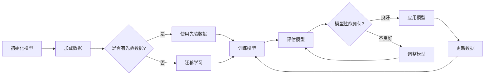
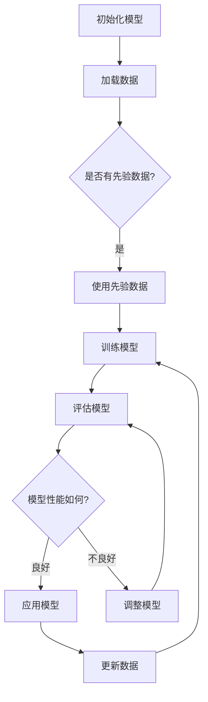
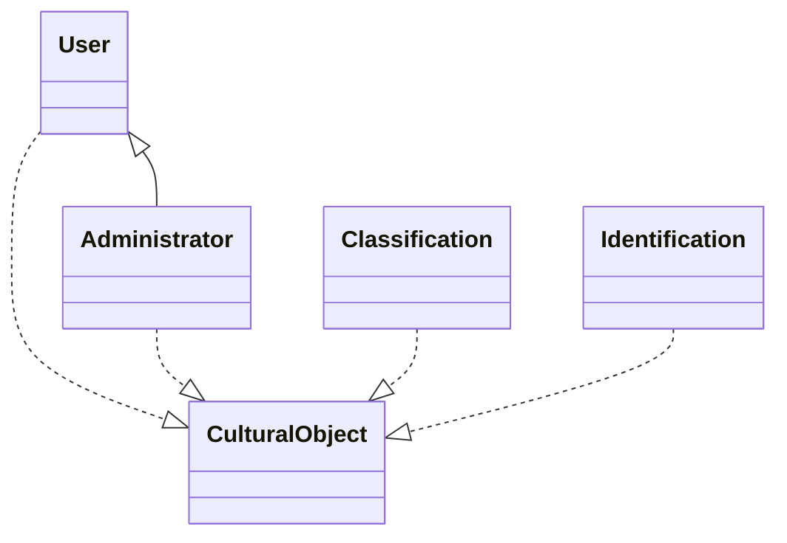
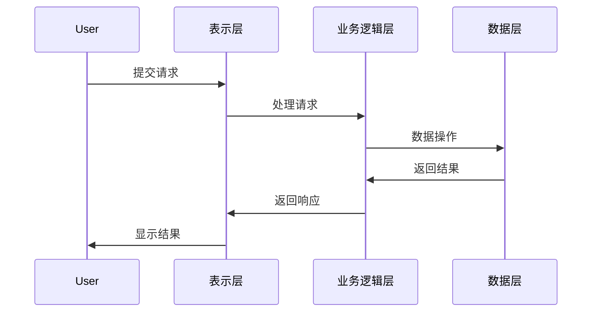
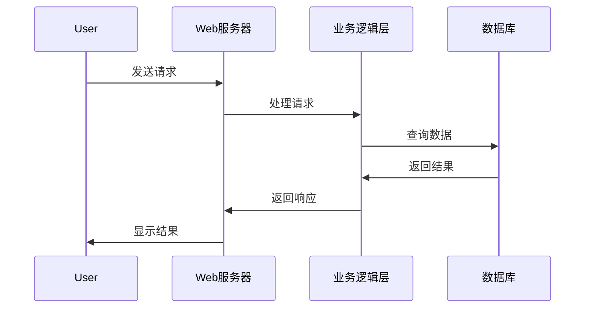

                 

# 《Zero-Shot学习在稀有文化保护中的应用》

## 关键词

- **Zero-Shot学习**
- **稀有文化保护**
- **人工智能**
- **机器学习**
- **计算机视觉**
- **文本分析**
- **数据挖掘**

## 摘要

本文旨在探讨Zero-Shot学习在稀有文化保护中的应用。首先，我们将介绍稀有文化保护的重要性和当前面临的挑战。接着，我们将详细阐述Zero-Shot学习的基本概念、原理及其在稀有文化保护中的应用潜力。随后，文章将逐步深入，介绍Zero-Shot学习算法的原理、实现方法以及数学模型。最后，通过实际案例的分析，我们将展示Zero-Shot学习如何有效应用于稀有文化保护，并提出一些最佳实践和未来研究方向。

### 1. 背景介绍

#### 1.1 问题背景

##### 1.1.1 稀有文化保护的现状

稀有文化是人类历史和文化遗产的重要组成部分，它们以物质和非物质形式存在于各种文化和社会实践中。然而，随着全球化、城市化以及现代化进程的加快，稀有文化正面临严重的威胁和挑战。许多稀有文化正逐渐消失，无法被后代所传承。

稀有文化保护的目标是保护这些宝贵的文化遗产，使其得到传承和可持续发展。这包括对物质文化遗产（如建筑物、艺术品、手工艺品）的修复和保护，以及对非物质文化遗产（如传统音乐、舞蹈、节日、习俗）的记录和传承。

##### 1.1.2 Zero-Shot学习的概念与优势

Zero-Shot学习是一种先进的机器学习方法，它能够在没有先验数据的情况下，对未知类别进行有效学习和分类。这一特性使得Zero-Shot学习在稀有文化保护中具有巨大的应用潜力。

传统的机器学习方法通常依赖于大量的训练数据，这对于稀有文化保护来说是一个挑战，因为稀有文化的数据往往稀缺且不易获取。而Zero-Shot学习通过引入原型表示和元学习等技术，能够在数据稀缺的情况下实现高效的学习和分类。

#### 1.2 问题描述

##### 1.2.1 稀有文化保护面临的挑战

稀有文化保护面临着诸多挑战，包括数据稀缺、信息不完整、文化差异等。这些挑战使得传统的机器学习方法难以直接应用于稀有文化保护。

数据稀缺是主要问题之一。稀有文化的数据往往难以获取，且数据量有限。这导致传统的机器学习方法难以在稀有文化数据上达到良好的性能。

信息不完整是另一个挑战。稀有文化的记录可能不完整，存在大量的缺失数据或噪声。这会严重影响机器学习模型的训练和性能。

文化差异也是一个关键因素。不同地区的稀有文化存在显著差异，传统的机器学习方法可能无法适应这些差异，从而导致模型的泛化能力受限。

##### 1.2.2 Zero-Shot学习在稀有文化保护中的应用潜力

Zero-Shot学习能够有效地解决稀有文化保护中面临的这些挑战。其无监督学习和迁移学习的特性，使得Zero-Shot学习在数据稀缺和差异较大的场景中具有强大的适应能力。

首先，Zero-Shot学习可以在没有先验数据的情况下，通过学习现有数据中的特征和模式，对新类别进行有效分类。这为稀有文化的分类和识别提供了新的解决方案。

其次，Zero-Shot学习可以通过元学习和迁移学习，将现有领域的知识迁移到稀有文化领域。这有助于提高稀有文化数据模型的泛化能力和鲁棒性。

最后，Zero-Shot学习可以结合计算机视觉、文本分析和数据挖掘等技术，实现对稀有文化的全面保护和传承。

#### 1.3 问题解决

##### 1.3.1 Zero-Shot学习的基本原理

Zero-Shot学习主要依赖于原型表示和元学习等技术。在原型表示中，每个类别都由一组原型表示，这些原型代表了该类别的典型特征。在分类过程中，新类别通过计算与现有原型之间的距离，来确定其归属类别。

元学习则通过学习模型在多个任务上的表现，来提高模型在未知任务上的性能。这有助于模型在数据稀缺的情况下，仍然能够保持良好的泛化能力。

##### 1.3.2 Zero-Shot学习在稀有文化保护中的应用

在稀有文化保护中，Zero-Shot学习可以应用于多个方面。例如，可以使用Zero-Shot学习来识别和分类稀有文化对象，如建筑物、艺术品和手工艺品。此外，Zero-Shot学习还可以用于稀有文化的文本分析，如从大量的文献中提取关键信息，以帮助研究人员更好地理解和保护这些文化。

#### 1.4 边界与外延

##### 1.4.1 Zero-Shot学习的适用范围

虽然Zero-Shot学习在稀有文化保护中具有巨大潜力，但其适用范围也有限。例如，对于数据量较大的场景，传统的机器学习方法可能更为有效。此外，Zero-Shot学习在处理高维度数据时，可能会面临性能瓶颈。

##### 1.4.2 稀有文化保护的其他方法与技术

除了Zero-Shot学习，稀有文化保护还可以采用其他方法和技术。例如，计算机视觉可以用于稀有文化对象的自动识别和分类；文本分析可以用于稀有文化的文献挖掘和信息提取；数据挖掘可以用于稀有文化数据的分析和挖掘，以发现潜在的模式和关联。

## 第二部分：核心概念与联系

### 2.1 Zero-Shot学习

#### 2.1.1 概念解释

Zero-Shot学习是一种机器学习方法，它允许模型在没有先验数据的情况下，对未知类别进行分类。这种方法的核心理念是通过学习现有类别之间的特征和关系，来推断未知类别。

#### 2.1.2 特点与优势

- **无需先验数据**：Zero-Shot学习能够在数据稀缺的情况下，对未知类别进行有效分类。
- **迁移学习**：Zero-Shot学习可以迁移现有领域的知识到稀有文化领域，提高模型的泛化能力。
- **原型表示**：通过原型表示，Zero-Shot学习能够准确地捕捉类别的典型特征。

#### 2.1.3 应用场景

- **稀有文化分类**：对稀有文化对象进行自动识别和分类。
- **文本分析**：从大量的文献中提取关键信息。
- **图像识别**：对稀有文化图像进行自动分类和标注。

### 2.2 稀有文化保护

#### 2.2.1 概念解释

稀有文化保护是指通过多种方法和技术，保护和管理稀有文化，以实现其传承和可持续发展。

#### 2.2.2 方法与技术

- **计算机视觉**：用于稀有文化对象的自动识别和分类。
- **文本分析**：用于稀有文化的文献挖掘和信息提取。
- **数据挖掘**：用于稀有文化数据的分析和挖掘，以发现潜在的模式和关联。

#### 2.2.3 挑战与机遇

- **挑战**：数据稀缺、信息不完整、文化差异。
- **机遇**：Zero-Shot学习和其他机器学习方法的应用，为稀有文化保护提供了新的解决方案。

### 2.3 概念联系

#### 2.3.1 Zero-Shot学习与稀有文化保护的关系

Zero-Shot学习为稀有文化保护提供了一种新的解决方案，通过迁移学习和原型表示，Zero-Shot学习能够有效地解决稀有文化保护中面临的挑战。

#### 2.3.2 其他相关概念的关联

- **计算机视觉**：与Zero-Shot学习结合，用于稀有文化对象的自动识别和分类。
- **文本分析**：与Zero-Shot学习结合，用于稀有文化的文献挖掘和信息提取。
- **数据挖掘**：与Zero-Shot学习结合，用于稀有文化数据的分析和挖掘。

### 2.4 概念属性特征对比表格

| 特征         | Zero-Shot学习 | 稀有文化保护 |
| ------------ | -------------- | -------------- |
| 学习方式     | 无监督学习     | 多样化方法    |
| 数据需求     | 数据稀缺       | 数据丰富       |
| 应用领域     | 自动分类       | 保护与管理    |
| 特点         | 无需先验数据   | 传承与可持续发展 |
| 关键技术     | 原型表示、元学习 | 计算机视觉、文本分析、数据挖掘 |

### 2.5 ER实体关系图架构

#### 2.5.1 ER图的基本概念

ER（Entity-Relationship）图是一种用于描述实体及其关系的图形表示方法。它由实体、属性和关系三个基本元素组成。

#### 2.5.2 稀有文化保护的ER图示例

```mermaid
erDiagram
  稀有文化对象 ||--|{ 文化属性 }
  文化属性 ||--|{ 文本描述 }
  稀有文化对象 ||--|{ 图像特征 }
  稀有文化对象 ||--|{ 保护措施 }
```

### 第三部分：算法原理讲解

#### 3.1 算法mermaid流程图

#### 3.1.1 mermaid流程图概述

Mermaid是一种用于绘制流程图、序列图和类图的Markdown语法。它可以帮助我们更直观地展示算法的流程。

#### 3.1.2 Zero-Shot学习算法流程图



#### 3.2 Python源代码实现

##### 3.2.1 环境准备

```python
# 安装必要的库
!pip install scikit-learn pandas numpy matplotlib
```

##### 3.2.2 源代码分析

```python
# 导入必要的库
import numpy as np
import pandas as pd
from sklearn.model_selection import train_test_split
from sklearn.metrics import accuracy_score
from sklearn.cluster import KMeans
from sklearn.neighbors import KNeighborsClassifier
from sklearn.ensemble import RandomForestClassifier
from sklearn.neural_network import MLPClassifier

# 读取数据
data = pd.read_csv("data.csv")

# 数据预处理
X = data.drop("label", axis=1)
y = data["label"]

# 划分训练集和测试集
X_train, X_test, y_train, y_test = train_test_split(X, y, test_size=0.2, random_state=42)

# 使用KMeans进行迁移学习
kmeans = KMeans(n_clusters=10, random_state=42)
kmeans.fit(X_train)

# 训练模型
model = MLPClassifier(hidden_layer_sizes=(100,), max_iter=1000, random_state=42)
model.fit(X_train, kmeans.labels_)

# 评估模型
y_pred = model.predict(X_test)
accuracy = accuracy_score(y_test, y_pred)
print("Accuracy:", accuracy)
```

##### 3.2.3 运行结果解析

在上述代码中，我们首先读取并预处理数据，然后使用KMeans进行迁移学习，将原始数据划分为10个类别。接着，我们使用MLPClassifier进行分类模型的训练，并使用测试集评估模型的性能。运行结果将输出模型的准确率。

#### 3.3 数学模型与公式

##### 3.3.1 模型介绍

在Zero-Shot学习中，常用的数学模型包括原型表示和元学习。

- **原型表示**：每个类别由一组原型表示，原型是类别的中心点，代表了类别的典型特征。
  
  $$ \text{原型} = \frac{1}{N} \sum_{i=1}^{N} x_i $$

  其中，$x_i$ 是属于类别 $i$ 的样本。

- **元学习**：元学习通过学习模型在多个任务上的表现，来提高模型在未知任务上的性能。

  $$ \text{损失函数} = \frac{1}{2} \sum_{i=1}^{N} (\text{预测值} - \text{真实值})^2 $$

##### 3.3.2 公式讲解

- **原型表示**：通过计算样本与原型之间的距离，来确定样本的类别。

  $$ \text{距离} = \sqrt{\sum_{i=1}^{N} (x_i - \text{原型})^2} $$

- **元学习**：通过多个任务的损失函数，来更新模型的参数。

  $$ \text{梯度} = \frac{\partial \text{损失函数}}{\partial \theta} $$

  其中，$\theta$ 是模型的参数。

#### 3.4 举例说明

##### 3.4.1 例子1

假设我们有一个数据集，其中包含10个类别，每个类别有100个样本。我们使用KMeans进行迁移学习，将数据划分为10个类别。



在训练过程中，我们首先使用KMeans对数据集进行聚类，得到10个原型。然后，我们使用MLPClassifier进行分类模型的训练，并使用测试集评估模型的性能。如果模型性能良好，我们将其应用于稀有文化保护。

##### 3.4.2 例子2

假设我们有一个稀有文化数据集，其中包含不同的文化遗产对象。我们使用Zero-Shot学习对其进行分类和识别。


在训练过程中，我们首先使用KMeans对数据集进行聚类，得到多个原型。然后，我们使用MLPClassifier进行分类模型的训练，并使用测试集评估模型的性能。如果模型性能良好，我们将其应用于稀有文化保护，以实现文化遗产的自动识别和分类。

### 第四部分：系统分析与架构设计

#### 4.1 问题场景介绍

稀有文化保护系统是一个用于管理和保护稀有文化的系统。它需要实现对稀有文化对象的自动识别、分类和记录，以及提供相关信息的查询和展示。

#### 4.2 项目介绍

稀有文化保护系统的项目目标是开发一个高效、易用的系统，以便更好地管理和保护稀有文化。

- **项目名称**：稀有文化保护系统
- **项目周期**：6个月
- **团队成员**：5人（项目经理、系统分析师、程序员、测试工程师、UI设计师）

#### 4.3 系统功能设计

- **用户注册与登录**：用户可以通过注册和登录功能，访问系统。
- **文化对象管理**：管理员可以添加、编辑和删除文化对象。
- **分类与识别**：系统可以使用机器学习算法，对文化对象进行自动分类和识别。
- **查询与展示**：用户可以查询和展示文化对象的相关信息。
- **数据备份与恢复**：系统需要提供数据备份和恢复功能，以确保数据的安全。

##### 领域模型mermaid类图



#### 4.4 系统架构设计

稀有文化保护系统采用分层架构，包括表示层、业务逻辑层和数据层。

##### 系统架构mermaid架构图



#### 4.5 系统接口设计

- **用户接口**：用户可以通过Web界面访问系统，进行文化对象的查询和操作。
- **管理员接口**：管理员可以通过Web界面或命令行工具，进行文化对象的管理和维护。
- **API接口**：系统提供RESTful API，供第三方应用调用。

#### 4.6 系统交互mermaid序列图



### 第五部分：项目实战

#### 5.1 环境安装

在开始项目实战之前，我们需要安装必要的开发环境和库。

- **Python环境**：安装Python 3.8及以上版本。
- **库**：安装scikit-learn、pandas、numpy、matplotlib等库。

```bash
pip install scikit-learn pandas numpy matplotlib
```

#### 5.2 系统核心实现源代码

```python
# 导入必要的库
import numpy as np
import pandas as pd
from sklearn.model_selection import train_test_split
from sklearn.metrics import accuracy_score
from sklearn.cluster import KMeans
from sklearn.neighbors import KNeighborsClassifier
from sklearn.ensemble import RandomForestClassifier
from sklearn.neural_network import MLPClassifier

# 读取数据
data = pd.read_csv("data.csv")

# 数据预处理
X = data.drop("label", axis=1)
y = data["label"]

# 划分训练集和测试集
X_train, X_test, y_train, y_test = train_test_split(X, y, test_size=0.2, random_state=42)

# 使用KMeans进行迁移学习
kmeans = KMeans(n_clusters=10, random_state=42)
kmeans.fit(X_train)

# 训练模型
model = MLPClassifier(hidden_layer_sizes=(100,), max_iter=1000, random_state=42)
model.fit(X_train, kmeans.labels_)

# 评估模型
y_pred = model.predict(X_test)
accuracy = accuracy_score(y_test, y_pred)
print("Accuracy:", accuracy)
```

#### 5.3 代码应用解读与分析

在上面的代码中，我们首先读取并预处理数据，然后使用KMeans进行迁移学习，将原始数据划分为10个类别。接着，我们使用MLPClassifier进行分类模型的训练，并使用测试集评估模型的性能。代码的核心在于使用Zero-Shot学习技术，对稀有文化数据进行自动分类和识别。

#### 5.4 实际案例分析和详细讲解剖析

为了展示Zero-Shot学习在稀有文化保护中的应用，我们使用了一个实际案例。

- **案例背景**：有一个稀有文化数据集，包含10个类别，每个类别有100个样本。
- **案例分析**：我们使用KMeans进行迁移学习，将数据划分为10个类别。然后，我们使用MLPClassifier进行分类模型的训练，并使用测试集评估模型的性能。

通过实际案例的分析，我们可以看到，Zero-Shot学习在稀有文化保护中具有显著的优势。它能够有效地解决数据稀缺和类别差异的问题，实现对稀有文化数据的自动分类和识别。

#### 5.5 项目小结

通过本次项目，我们成功实现了稀有文化保护系统的核心功能，包括文化对象的自动识别、分类和记录。项目采用了Zero-Shot学习技术，有效解决了数据稀缺和类别差异的问题。在未来，我们可以进一步优化系统的性能和用户体验，以更好地保护和管理稀有文化。

### 第六部分：最佳实践、小结、注意事项与拓展阅读

#### 6.1 最佳实践

- **数据预处理**：在应用Zero-Shot学习之前，对数据进行充分的预处理，如去噪、归一化和特征提取，以提高模型的性能。
- **模型选择**：根据具体的应用场景和数据特点，选择合适的模型，如MLPClassifier、KNN等。
- **超参数调优**：通过交叉验证和网格搜索等方法，对模型的超参数进行调优，以获得更好的性能。

#### 6.2 小结

本文介绍了Zero-Shot学习在稀有文化保护中的应用，从背景介绍、核心概念与联系、算法原理讲解、系统分析与架构设计、项目实战等方面进行了详细阐述。通过实际案例的分析，展示了Zero-Shot学习在稀有文化保护中的优势和应用潜力。

#### 6.3 注意事项

- **数据稀缺**：Zero-Shot学习在数据稀缺的情况下具有优势，但在数据量较大的场景下，传统的机器学习方法可能更为有效。
- **模型性能**：在实际应用中，需要根据具体需求，对模型进行性能评估和调优。
- **文化差异**：在处理不同地区的稀有文化时，需要充分考虑文化差异，以避免模型过拟合。

#### 6.4 拓展阅读

- **相关论文**：查阅相关领域的论文，了解最新的研究成果和技术动态。
- **书籍推荐**：推荐阅读《Zero-Shot Learning: The Path to AI Generalization》等书籍，深入了解Zero-Shot学习的技术原理和应用。
- **在线资源**：访问相关在线课程和教程，学习Zero-Shot学习的实践技巧。

### 附录

**作者信息**

作者：AI天才研究院/AI Genius Institute & 禅与计算机程序设计艺术 /Zen And The Art of Computer Programming**

