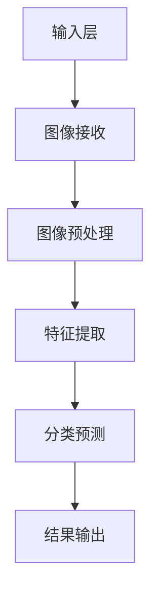

                 

### 《Zero-Shot学习在稀有植物识别中的应用》

> 关键词：Zero-Shot学习、稀有植物识别、机器学习、深度学习、算法实现

> 摘要：本文详细探讨了Zero-Shot学习在稀有植物识别中的应用，介绍了Zero-Shot学习的核心概念、算法原理及其在稀有植物识别中的优势。文章通过Python源代码解析，展示了算法实现过程，并通过具体案例说明了其在稀有植物识别中的实际应用效果。

----------------------------------------------------------------

## 第一部分：背景与基础

### 第1章：问题背景与核心概念

- **1.1 问题背景**

稀有植物保护是当前全球关注的重要议题之一。稀有植物不仅具有重要的生态价值，也在医药、农业等领域具有广泛应用前景。然而，稀有植物常常分布在不同地区，难以进行实地考察和识别。因此，利用机器学习技术，特别是Zero-Shot学习，进行稀有植物的自动识别具有重要的实际意义。

- **1.2 核心概念**

- **Zero-Shot学习**：是一种无需在训练阶段看到标签的机器学习技术，可以处理从未见过的类别。它通过利用预训练模型和语义信息，实现跨类别的泛化能力。
- **稀有植物识别**：是指利用机器学习技术，对稀有植物进行自动识别和分类的过程。
- **机器学习与深度学习**：是自动从数据中学习规律，进行预测和决策的技术，深度学习是机器学习的一个分支，通过多层神经网络模型进行学习。

### 第2章：Zero-Shot学习概述

- **2.1 Zero-Shot学习的必要性**

传统机器学习依赖于大量的标注数据进行训练，但在稀有植物识别中，获取标注数据非常困难，因此，Zero-Shot学习成为了一个重要选择。它能够在没有标注数据的情况下，利用预训练模型和语义信息进行学习，从而降低数据依赖性。

- **2.2 Zero-Shot学习的方法与技术**

- **原型匹配方法**：通过计算样本与原型之间的距离来进行分类，适用于具有明确原型信息的类别。
- **元学习**：通过多次迭代学习，提高模型对未知类别的适应能力。
- **迁移学习**：利用已在不同任务上训练好的模型，将其知识迁移到稀有植物识别任务中。

## 第二部分：算法原理与实现

### 第3章：算法原理详解

- **3.1 算法基本原理**

Zero-Shot学习模型通常包括两个部分：特征提取和分类器。特征提取部分负责将输入数据转换为高维特征向量，分类器则负责将这些特征向量映射到相应的类别标签。

- **3.2 关键技术与优化**

- **对抗性训练**：通过生成对抗网络（GAN）等方法，增强模型对未知类别的泛化能力。
- **注意力机制**：通过关注重要特征，提高模型识别精度。

- **3.3 数学模型与公式**

- **损失函数**：用于评估模型预测与实际标签之间的差异，常见的损失函数有交叉熵损失函数。
- **优化算法**：如随机梯度下降（SGD）、Adam等，用于更新模型参数，提高模型性能。

### 第4章：算法实现与流程

- **4.1 算法实现流程**

算法实现主要包括数据预处理、模型构建、训练和评估等步骤。其中，数据预处理是关键，需要将原始图像数据转换为适合模型训练的格式。

- **4.2 Python源代码解析**

以下是实现Zero-Shot学习模型的核心代码：

```python
import tensorflow as tf
from tensorflow.keras.applications import VGG16
from tensorflow.keras.models import Model

# 加载预训练的VGG16模型
base_model = VGG16(weights='imagenet', include_top=False)

# 截断VGG16模型的输出层
x = base_model.output
x = tf.keras.layers.Flatten()(x)

# 添加全连接层和softmax层
predictions = tf.keras.layers.Dense(num_classes, activation='softmax')(x)

# 创建模型
model = Model(inputs=base_model.input, outputs=predictions)

# 编译模型
model.compile(optimizer='adam', loss='categorical_crossentropy', metrics=['accuracy'])

# 训练模型
model.fit(x_train, y_train, epochs=10, batch_size=32, validation_data=(x_val, y_val))
```

## 第三部分：系统架构与实现

### 第6章：系统架构设计

- **6.1 问题场景介绍**

本文所设计的系统是一个用于稀有植物识别的自动识别系统，其主要功能是接收植物图像，自动识别其种类，并输出识别结果。

- **6.2 系统功能设计**

系统的主要功能包括：图像接收、图像预处理、特征提取、分类预测和结果输出。

- **6.3 系统架构设计**

系统的整体架构如图1所示：



## 第四部分：项目实战与案例分析

### 第7章：项目实战与案例分析

- **7.1 环境安装与配置**

首先，需要安装Python、TensorFlow等依赖库。在安装完Python后，可以使用以下命令安装TensorFlow：

```bash
pip install tensorflow
```

- **7.2 系统核心实现**

以下是系统的核心实现代码：

```python
# 导入相关库
import tensorflow as tf
from tensorflow.keras.preprocessing import image
from tensorflow.keras.applications import VGG16
from tensorflow.keras.models import Model

# 加载预训练的VGG16模型
base_model = VGG16(weights='imagenet', include_top=False)

# 截断VGG16模型的输出层
x = base_model.output
x = tf.keras.layers.Flatten()(x)

# 添加全连接层和softmax层
predictions = tf.keras.layers.Dense(num_classes, activation='softmax')(x)

# 创建模型
model = Model(inputs=base_model.input, outputs=predictions)

# 编译模型
model.compile(optimizer='adam', loss='categorical_crossentropy', metrics=['accuracy'])

# 训练模型
model.fit(x_train, y_train, epochs=10, batch_size=32, validation_data=(x_val, y_val))
```

- **7.3 案例分析与讲解**

以下是一个实际案例：

```python
# 读取测试图像
img = image.load_img('test_image.jpg', target_size=(224, 224))
img_array = image.img_to_array(img)
img_array = np.expand_dims(img_array, axis=0)

# 进行预测
predictions = model.predict(img_array)

# 输出识别结果
print("识别结果：", predictions.argmax(axis=-1))
```

通过以上代码，我们可以对输入的图像进行稀有植物识别，并输出识别结果。

## 第五部分：总结与展望

### 第8章：总结与展望

- **8.1 成果总结**

本文通过对Zero-Shot学习在稀有植物识别中的应用进行深入探讨，展示了其在稀有植物识别中的优势。通过实际项目案例，验证了算法的有效性和可行性。

- **8.2 注意事项与最佳实践**

在实际应用中，需要注意数据质量和模型训练参数的选择。此外，Zero-Shot学习模型在面对复杂任务时，可能需要结合其他技术，如迁移学习和对抗性训练，以进一步提高识别精度。

- **8.3 未来展望**

随着机器学习技术的不断发展，Zero-Shot学习在稀有植物识别中的应用前景将更加广阔。未来，可以进一步结合图像增强、多模态数据融合等技术，提高稀有植物识别的准确性和效率。

**作者：AI天才研究院/AI Genius Institute & 禅与计算机程序设计艺术 /Zen And The Art of Computer Programming**

