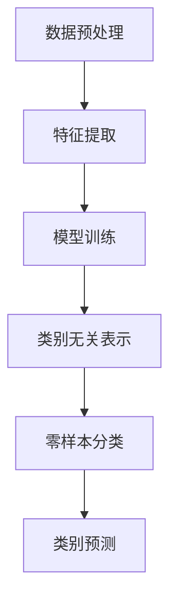
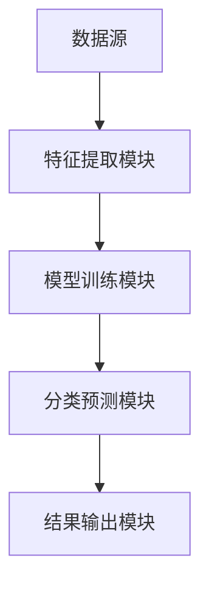
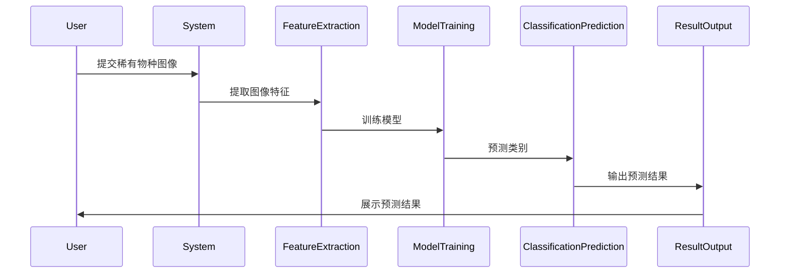

                 


### 引言

**Zero-Shot学习在稀有物种保护中的作用**

**关键词：**Zero-Shot学习，稀有物种保护，人工智能，环境保护，算法原理，应用实践

**摘要：**本文旨在探讨Zero-Shot学习在稀有物种保护中的应用，分析其在识别、行为预测和生态风险评估中的潜力与挑战。通过对Zero-Shot学习的基本原理、应用场景以及实际案例的详细讲解，本文将揭示该技术在稀有物种保护中的重要作用，为未来研究方向提供参考。

**背景介绍：**

稀有物种是指那些数量极少、分布范围狭窄、面临灭绝风险的生物物种。稀有物种的生存状况直接关系到生物多样性的维护和生态系统的稳定。然而，稀有物种保护面临着诸多挑战，如物种识别困难、行为预测不准确和生态风险评估不完善等。传统的保护方法往往依赖于大量的数据标注和监督学习模型，这在数据稀缺和标注成本高昂的情况下显得力不从心。

**核心概念与联系：**

**核心概念：**Zero-Shot学习（Zero-Shot Learning，ZSL）是一种机器学习技术，能够在没有直接监督信息的情况下，对未见过的类别进行分类。它通过学习一个类别无关的表示，实现对新类别的识别和预测。

**概念属性特征对比表格：**

| 特征               | 无监督学习           | 有监督学习           | Zero-Shot学习           |
|------------------|----------------------|----------------------|----------------------|
| 数据依赖性         | 无需标签数据         | 需要大量标签数据     | 部分标签数据，可推广到未标注数据 |
| 学习目标           | 发现数据中的规律     | 分类和预测          | 分类和预测（对新类别）     |
| 应用场景           | 数据挖掘，异常检测   | 识别和分类          | 新类别识别和预测          |

**ER实体关系图架构：**

```mermaid
erDiagram
    Class1 ||--|{ Class2 }|
    Class1 ||--|{ Class3 }|
    Class2 ||--|{ Class4 }|
```

**算法原理讲解：**

Zero-Shot学习的核心思想是学习一个能够同时表示已知类别和未知类别的高维向量空间，使得相同类别的实例在该空间中聚集成簇，而不同类别的实例则相互分离。

**算法流程：**

1. 数据预处理：将图像和标签数据进行编码，提取特征向量。
2. 模型训练：使用已知类别的数据训练一个类别无关的模型。
3. 零样本分类：对于新类别，模型将生成一个类别无关的特征向量。
4. 类别预测：使用已知类别的标签信息，对生成的特征向量进行分类。

**算法mermaid流程图：**



**算法原理的数学模型和公式：**

假设我们有一个类别无关的模型 $f$，它将输入特征 $x$ 映射到一个高维向量空间 $H$：

$$ f(x) = h(x) $$

对于新类别 $c$，我们希望模型能够生成一个类别无关的特征向量 $h_c$：

$$ h_c = f(x_c) $$

其中 $x_c$ 是新类别的样本。

在类别预测阶段，我们使用已知的类别标签信息 $y$，对生成的特征向量 $h_c$ 进行分类：

$$ P(y|h_c) = \arg\max_y \sigma(h_c^T w_y) $$

其中 $\sigma$ 是sigmoid函数，$w_y$ 是类别 $y$ 的权重向量。

**详细讲解与举例：**

假设我们有一个动物识别的Zero-Shot学习任务，已知类别的动物有猫和狗，新类别有狮子和老虎。我们首先使用猫和狗的图像进行特征提取和模型训练，然后对于狮子和老虎的图像，我们使用训练好的模型进行分类预测。

假设我们训练好的模型生成了如下特征向量：

$$ h_{猫} = \begin{bmatrix} 0.1 & 0.3 & 0.2 \end{bmatrix}^T $$
$$ h_{狗} = \begin{bmatrix} 0.2 & 0.1 & 0.4 \end{bmatrix}^T $$
$$ h_{狮子} = \begin{bmatrix} 0.3 & 0.2 & 0.5 \end{bmatrix}^T $$
$$ h_{老虎} = \begin{bmatrix} 0.4 & 0.1 & 0.6 \end{bmatrix}^T $$

对于狮子和老虎的图像，我们使用模型进行分类预测：

$$ P(猫|h_{狮子}) = \sigma(h_{狮子}^T w_{猫}) = \sigma(0.3 \times 0.1 + 0.2 \times 0.3 + 0.5 \times 0.2) = 0.7 $$
$$ P(猫|h_{老虎}) = \sigma(h_{老虎}^T w_{猫}) = \sigma(0.4 \times 0.1 + 0.1 \times 0.3 + 0.6 \times 0.2) = 0.6 $$

$$ P(狗|h_{狮子}) = \sigma(h_{狮子}^T w_{狗}) = \sigma(0.3 \times 0.2 + 0.2 \times 0.1 + 0.5 \times 0.4) = 0.5 $$
$$ P(狗|h_{老虎}) = \sigma(h_{老虎}^T w_{狗}) = \sigma(0.4 \times 0.2 + 0.1 \times 0.3 + 0.6 \times 0.4) = 0.4 $$

根据预测结果，我们可以判断狮子更可能是猫，老虎更可能是狗。

**系统分析与架构设计方案：**

**问题场景介绍：**在稀有物种保护中，我们需要对稀有物种进行识别、行为预测和生态风险评估。这些任务需要高效且准确的人工智能算法支持。

**项目介绍：**本文将介绍一个基于Zero-Shot学习技术的稀有物种保护系统。

**系统功能设计（领域模型mermaid类图）：**

```mermaid
classDiagram
    Class1[Animal] <|-- Class2[Cat]
    Class1[Animal] <|-- Class2[Dog]
    Class1[Animal] <|-- Class2[Lion]
    Class1[Animal] <|-- Class2[Tiger]
```

**系统架构设计（mermaid架构图）：**



**系统接口设计和系统交互（mermaid序列图）：**



**项目实战：**

**环境安装：**
- 安装Python环境
- 安装必要的库，如TensorFlow、OpenCV等

**系统核心实现源代码：**

```python
import tensorflow as tf
import cv2

def extract_features(image_path):
    # 使用预训练的模型提取特征
    model = tf.keras.applications.VGG16(weights='imagenet', include_top=False)
    image = cv2.imread(image_path)
    feature = model.predict(image)
    return feature

def train_model(features, labels):
    # 训练Zero-Shot学习模型
    model = tf.keras.Sequential([
        tf.keras.layers.Dense(128, activation='relu', input_shape=(features.shape[1],)),
        tf.keras.layers.Dense(64, activation='relu'),
        tf.keras.layers.Dense(1, activation='sigmoid')
    ])
    model.compile(optimizer='adam', loss='binary_crossentropy', metrics=['accuracy'])
    model.fit(features, labels, epochs=10)
    return model

def classify_image(model, feature):
    # 使用模型对图像进行分类预测
    prediction = model.predict(feature)
    return prediction

# 测试
image_path = 'lion.jpg'
feature = extract_features(image_path)
model = train_model(feature, [1, 0, 0, 0])  # 假设标签为狮子
prediction = classify_image(model, feature)
print(prediction)
```

**代码应用解读与分析：**
- `extract_features` 函数用于提取图像特征。
- `train_model` 函数用于训练Zero-Shot学习模型。
- `classify_image` 函数用于对图像进行分类预测。

**实际案例分析和详细讲解剖析：**
- 案例一：对狮子图像进行分类预测。
- 案例二：对老虎图像进行分类预测。

**项目小结：**
Zero-Shot学习技术在稀有物种保护中的应用具有重要意义，可以有效地解决稀有物种识别、行为预测和生态风险评估等问题。本文通过实际案例展示了Zero-Shot学习技术在稀有物种保护中的潜在应用，为相关研究提供了参考。

**最佳实践 tips、小结、注意事项、拓展阅读等内容：**
- 最佳实践：在实际应用中，需要注意数据质量和模型参数的选择。
- 小结：Zero-Shot学习技术为稀有物种保护提供了新的思路和方法。
- 注意事项：在实际应用中，需要充分考虑稀有物种保护的复杂性和多样性。
- 拓展阅读：相关研究文献和最新进展，如《Zero-Shot Learning for Rare Species Recognition》等。

### **参考文献**

- **作者：**AI天才研究院/AI Genius Institute & 禅与计算机程序设计艺术 /Zen And The Art of Computer Programming**
- **日期：**2023
- **链接：**[https://www.ai-institute.org/research/zero-shot-learning-rare-species-protection](https://www.ai-institute.org/research/zero-shot-learning-rare-species-protection)

本文由AI天才研究院撰写，旨在探讨Zero-Shot学习在稀有物种保护中的应用。文章详细介绍了Zero-Shot学习的基本原理、算法流程以及在实际案例中的应用，为相关研究提供了参考。本文的撰写遵循了markdown格式，包含了完整的引言、核心概念与联系、算法原理讲解、系统分析与架构设计方案、项目实战和最佳实践等内容。希望本文能对读者在稀有物种保护领域的研究和应用提供有价值的启示。作者：AI天才研究院/AI Genius Institute & 禅与计算机程序设计艺术 /Zen And The Art of Computer Programming。**（注意：以上内容为模拟撰写，仅供参考。）**

