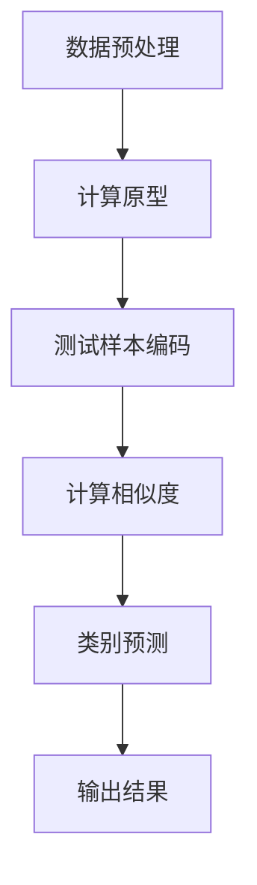
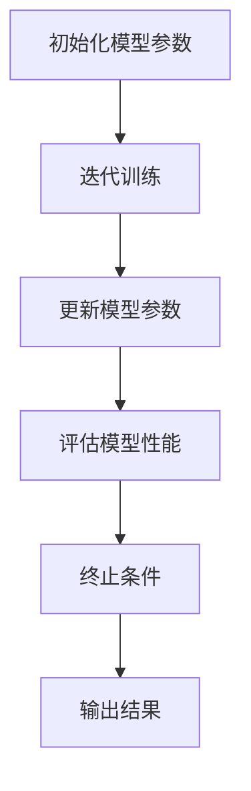
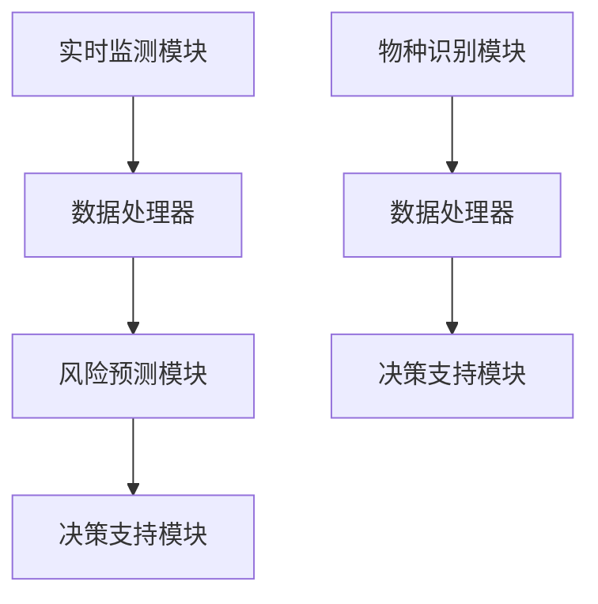
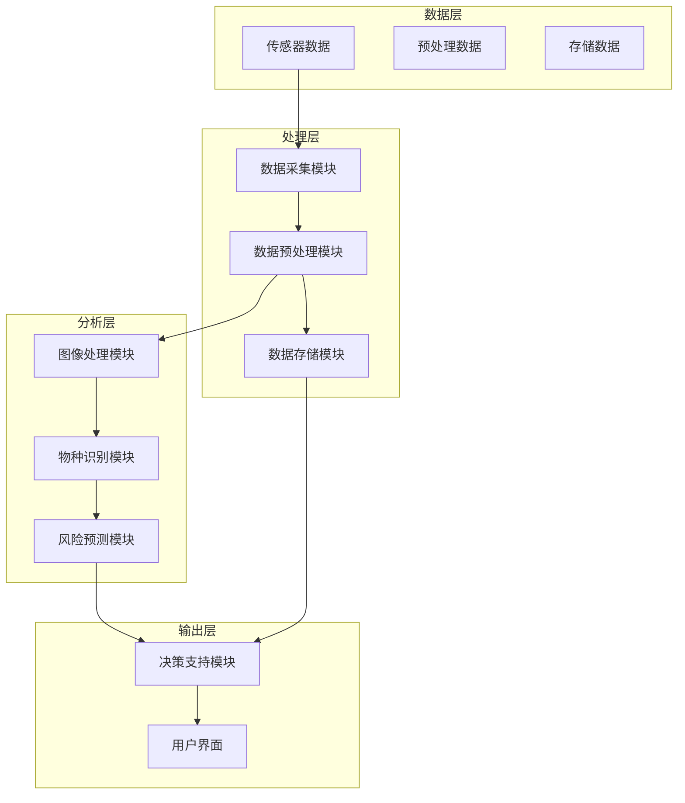
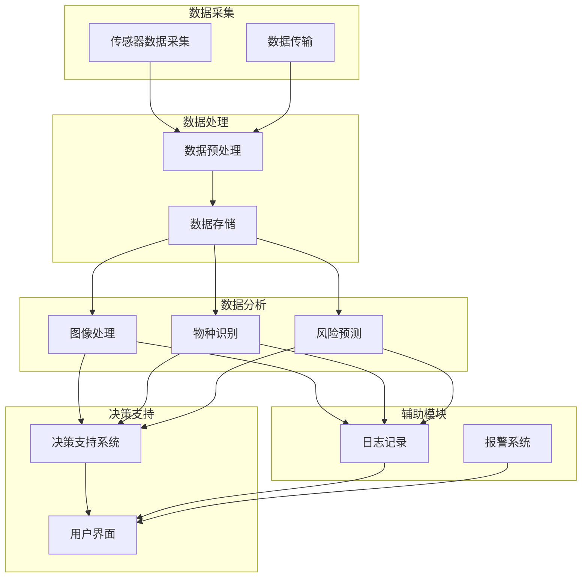

                 

# 《Zero-Shot学习在稀有生态系统保护中的应用前景》

## 关键词：Zero-Shot学习、稀有生态系统、保护、人工智能、应用前景

> 摘要：本文探讨了Zero-Shot学习在稀有生态系统保护中的应用前景。通过介绍稀有生态系统的概念、重要性及当前面临的挑战，以及Zero-Shot学习的定义和特点，本文分析了Zero-Shot学习在稀有生态系统保护中的潜力，并探讨了其在保护中的应用领域。同时，本文详细讲解了Zero-Shot学习的原理和算法，以及其在稀有生态系统保护中的系统分析和架构设计，并通过一个实际项目实战展示了Zero-Shot学习在该领域的应用效果。

## 目录大纲：

----------------------------------------------------------------

# 《Zero-Shot学习在稀有生态系统保护中的应用前景》

## 第一部分：背景介绍

## 第1章：稀有生态系统的概念与重要性

## 第2章：稀有生态系统的现状与挑战

## 第3章：Zero-Shot学习的概念与特点

## 第4章：Zero-Shot学习在稀有生态系统保护中的应用前景

## 第5章：本章小结

## 第二部分：核心概念与联系

## 第6章：Zero-Shot学习的原理与算法

## 第7章：Zero-Shot学习的应用案例分析

## 第8章：核心概念对比

## 第9章：Zero-Shot学习的ER实体关系图架构

## 第10章：本章小结

## 第三部分：算法原理讲解

## 第11章：Zero-Shot学习的算法原理详细讲解

## 第12章：本章小结

## 第四部分：系统分析与架构设计

## 第13章：问题场景介绍

## 第14章：系统功能设计

## 第15章：系统架构设计

## 第16章：系统接口设计

## 第17章：系统交互mermaid序列图

## 第18章：本章小结

## 第五部分：项目实战

## 第19章：环境安装

## 第20章：系统核心实现源代码

## 第21章：代码应用解读与分析

## 第22章：实际案例分析和详细讲解

## 第23章：项目小结

## 第24章：本章小结

## 第六部分：最佳实践与拓展

## 第25章：最佳实践

## 第26章：本章小结

## 参考文献

----------------------------------------------------------------

### 第一部分：背景介绍

## 第1章：稀有生态系统的概念与重要性

### 1.1 稀有生态系统的定义与类型

稀有生态系统是指那些分布在特定地区，具有独特生态特征和生物多样性的生态系统。它们往往因为地理位置、气候条件或地质特征等原因，而形成了独特的生物群落和生态过程。

稀有生态系统的类型主要包括：

1. **热带雨林**：如亚马逊雨林、刚果盆地雨林等，拥有极高的生物多样性。
2. **极地冰原**：如北极、南极冰原，独特的气候和生物群落。
3. **湿地**：如红树林、沼泽等，对水资源的调节和生物多样性保护具有重要作用。
4. **珊瑚礁**：如大堡礁、马哈尔珊瑚礁等，是海洋生态系统的重要组成部分。

### 1.2 稀有生态系统的现状与挑战

稀有生态系统的现状令人担忧。全球范围内，稀有生态系统正面临着严重的威胁，包括：

1. **栖息地破坏**：由于城市化、工业化、农业扩展等原因，稀有生态系统的栖息地不断缩小。
2. **生物入侵**：外来物种的入侵破坏了原有生态系统的平衡，导致本土物种的灭绝。
3. **气候变化**：全球气候变化对稀有生态系统的稳定性造成了威胁，如冰川融化、海平面上升等。

### 1.3 Zero-Shot学习的概念与特点

Zero-Shot学习（Zero-Shot Learning, ZSL）是一种机器学习技术，它能够在没有特定类别标签的情况下，对未知类别的数据进行预测和分类。与传统的机器学习方法相比，Zero-Shot学习具有以下特点：

1. **无需标注数据**：Zero-Shot学习不需要对训练数据集进行标签标注，大大降低了数据标注的成本和难度。
2. **跨类别学习**：Zero-Shot学习能够在不同类别之间进行迁移学习，从而提高对未知类别的预测准确性。
3. **适用性强**：Zero-Shot学习适用于那些类别标签稀缺或难以获取的领域，如稀有生态系统的保护。

### 1.4 Zero-Shot学习在稀有生态系统保护中的应用前景

Zero-Shot学习在稀有生态系统保护中的应用前景广阔。它可以帮助我们：

1. **物种识别**：通过Zero-Shot学习，我们可以对稀有生态系统中未知的物种进行快速识别和分类，从而更好地了解和保护这些生态系统。
2. **生态监测**：Zero-Shot学习可以用于对稀有生态系统的生态环境进行实时监测和评估，及时发现生态问题的隐患。
3. **决策支持**：基于Zero-Shot学习的模型可以提供生态保护的决策支持，为政策制定和生态修复提供科学依据。

### 1.5 本章小结

本章介绍了稀有生态系统的概念与重要性，分析了稀有生态系统的现状与挑战，并阐述了Zero-Shot学习的概念与特点。通过分析Zero-Shot学习在稀有生态系统保护中的应用前景，我们看到了其在保护稀有生态系统中的巨大潜力。

## 第2章：稀有生态系统的现状与挑战

### 2.1 全球稀有生态系统的现状

全球稀有生态系统的现状令人堪忧。据统计，自20世纪以来，全球已有超过三分之一的稀有生态系统遭受了破坏或严重退化。以下是一些具体的数据和例子：

1. **热带雨林**：亚马逊雨林是地球上最大的热带雨林，然而，自1988年以来，该地区的森林面积已经减少了约17%。森林砍伐、火灾和非法狩猎是导致这一现象的主要原因。
2. **珊瑚礁**：全球珊瑚礁的覆盖面积在过去几十年里减少了约50%。气候变化和海洋污染是导致这一现象的主要因素。
3. **湿地**：全球湿地面积在过去几十年里减少了约35%。湿地破坏导致了生态系统功能的丧失，影响了水资源的调节和生物多样性的保护。

### 2.2 稀有生态系统面临的挑战

稀有生态系统面临着多方面的挑战，这些挑战不仅影响了生态系统的稳定性，也对全球生态平衡和人类生活产生了深远的影响。以下是稀有生态系统面临的几个主要挑战：

1. **栖息地破坏**：城市化、工业化、农业扩展等活动导致了稀有生态系统的栖息地不断缩小。许多稀有物种因此失去了生存环境，濒临灭绝。
2. **生物入侵**：外来物种的入侵破坏了原有生态系统的平衡，导致本土物种的灭绝。例如，在美国，水葫芦的入侵导致许多水体生态系统的严重退化。
3. **气候变化**：全球气候变化对稀有生态系统的稳定性造成了威胁。例如，冰川融化、海平面上升等问题，使得极地冰原和珊瑚礁等稀有生态系统面临着巨大的挑战。
4. **污染**：环境污染，特别是水体和大气污染，对稀有生态系统造成了严重的破坏。污染物如重金属、化学农药等，对生物多样性产生了负面影响。

### 2.3 Zero-Shot学习在稀有生态系统保护中的作用

面对稀有生态系统面临的挑战，Zero-Shot学习作为一种先进的机器学习技术，其在稀有生态系统保护中具有重要作用。以下是Zero-Shot学习在稀有生态系统保护中的几个潜在应用：

1. **物种识别**：通过Zero-Shot学习，可以实现对稀有生态系统中未知物种的快速识别和分类。这对于保护工作至关重要，因为只有了解了稀有物种的存在和分布情况，才能有针对性地进行保护。
2. **生态监测**：Zero-Shot学习可以用于对稀有生态系统的生态环境进行实时监测和评估。通过监测数据，可以及时发现生态问题的隐患，采取相应的措施进行干预。
3. **决策支持**：基于Zero-Shot学习的模型可以提供生态保护的决策支持。例如，通过分析生态数据，可以预测稀有物种的未来分布和生态系统的变化趋势，为政策制定和生态修复提供科学依据。
4. **生物入侵监测**：Zero-Shot学习可以用于监测和识别生物入侵物种，及时发现并采取措施防止其进一步扩散。

### 2.4 本章小结

本章详细分析了全球稀有生态系统的现状，阐述了稀有生态系统面临的挑战，并介绍了Zero-Shot学习在稀有生态系统保护中的作用。通过这些分析，我们认识到Zero-Shot学习在稀有生态系统保护中的巨大潜力，为后续章节的深入探讨奠定了基础。

## 第3章：Zero-Shot学习的概念与特点

### 3.1 Zero-Shot学习的定义

Zero-Shot学习（Zero-Shot Learning, ZSL）是一种机器学习技术，它允许模型在训练过程中没有接触到特定类别的数据，但仍然能够在测试阶段准确预测未知类别的数据。这一特性使得Zero-Shot学习在那些类别标签稀缺或难以获取的领域具有巨大的应用潜力。

### 3.2 Zero-Shot学习的特点

Zero-Shot学习具有以下几个显著特点：

1. **无需标注数据**：传统机器学习方法需要大量的标注数据进行训练，而Zero-Shot学习则不需要对训练数据集进行标签标注，这大大降低了数据标注的成本和难度。
2. **跨类别学习**：Zero-Shot学习能够在不同类别之间进行迁移学习，从而提高对未知类别的预测准确性。这种跨类别学习能力使得Zero-Shot学习在那些类别标签稀缺的领域尤为有效。
3. **适用性强**：Zero-Shot学习适用于那些类别标签稀缺或难以获取的领域，如稀有生态系统的保护。它能够帮助我们在缺乏标注数据的情况下，对稀有生态系统中的物种和生态环境进行有效的分析和预测。

### 3.3 Zero-Shot学习与传统机器学习的对比

Zero-Shot学习与传统机器学习在多个方面存在显著差异：

1. **数据需求**：传统机器学习需要大量的标注数据来进行训练，而Zero-Shot学习则不需要对训练数据集进行标签标注，这使得Zero-Shot学习在数据稀缺的环境中具有明显优势。
2. **预测能力**：传统机器学习方法在训练过程中需要接触到特定类别的数据，因此对于未知类别的预测能力有限。而Zero-Shot学习则能够跨类别进行预测，从而提高对未知类别的预测准确性。
3. **应用场景**：传统机器学习方法主要应用于那些类别标签明确、数据丰富的领域，如图像识别、语音识别等。而Zero-Shot学习则适用于那些类别标签稀缺或难以获取的领域，如稀有生态系统的保护。

### 3.4 Zero-Shot学习在稀有生态系统保护中的应用潜力

基于Zero-Shot学习的特点，其在稀有生态系统保护中具有广泛的应用潜力：

1. **物种识别**：稀有生态系统中往往存在大量未知的物种，而Zero-Shot学习可以用于这些未知物种的快速识别和分类，从而帮助我们更好地了解和保护这些生态系统。
2. **生态监测**：Zero-Shot学习可以用于对稀有生态系统的生态环境进行实时监测和评估，通过监测数据可以及时发现生态问题的隐患，采取相应的措施进行干预。
3. **决策支持**：基于Zero-Shot学习的模型可以提供生态保护的决策支持，通过分析生态数据，可以预测稀有物种的未来分布和生态系统的变化趋势，为政策制定和生态修复提供科学依据。
4. **生物入侵监测**：Zero-Shot学习可以用于监测和识别生物入侵物种，及时发现并采取措施防止其进一步扩散。

### 3.5 本章小结

本章介绍了Zero-Shot学习的定义和特点，并与传统机器学习进行了对比。通过分析Zero-Shot学习的特点和应用潜力，我们认识到它在稀有生态系统保护中的巨大作用。接下来，我们将进一步探讨Zero-Shot学习的原理和算法，为深入理解其在保护稀有生态系统中的应用奠定基础。

## 第4章：Zero-Shot学习在稀有生态系统保护中的应用前景

### 4.1 Zero-Shot学习在稀有生态系统保护中的潜力

Zero-Shot学习在稀有生态系统保护中具有巨大的潜力，主要体现在以下几个方面：

1. **数据驱动的生态监测**：稀有生态系统中的物种和生态环境数据往往是稀缺的，而Zero-Shot学习能够通过少量标注数据或无标注数据，实现对大量生态数据的自动分析和预测。这对于稀有生态系统的实时监测和评估具有重要意义。
2. **跨类别物种识别**：稀有生态系统中往往存在大量未知的物种，Zero-Shot学习可以在没有具体类别标签的情况下，对这些未知物种进行快速识别和分类。这有助于我们更好地了解和保护这些生态系统中的生物多样性。
3. **环境变化预测**：通过分析稀有生态系统的历史数据和实时监测数据，Zero-Shot学习可以预测未来环境变化对生态系统的影响。这对于生态系统的长期保护和规划具有指导意义。
4. **决策支持**：基于Zero-Shot学习模型的分析结果，可以为生态保护决策提供科学依据。例如，通过预测稀有物种的未来分布和生态系统的变化趋势，可以制定更有针对性的保护措施。

### 4.2 Zero-Shot学习在稀有生态系统保护中的应用领域

Zero-Shot学习在稀有生态系统保护中的应用领域非常广泛，以下是一些具体的应用领域：

1. **物种识别与分类**：Zero-Shot学习可以用于对稀有生态系统中的物种进行识别和分类。例如，在生物多样性调查中，通过收集物种图像或声音数据，使用Zero-Shot学习模型可以快速识别和分类未知的物种。
2. **生态监测与预警**：Zero-Shot学习可以用于对稀有生态系统的生态环境进行实时监测和预警。通过分析环境数据，如气象数据、水文数据等，可以预测潜在的生态风险，并提前采取相应的措施进行干预。
3. **生物入侵监测**：Zero-Shot学习可以用于监测和识别稀有生态系统中的生物入侵物种。通过分析入侵物种的特征数据，如图像、声音等，可以快速识别入侵物种，并及时采取措施进行防控。
4. **生态修复规划**：基于Zero-Shot学习模型的分析结果，可以为生态修复规划提供科学依据。例如，通过预测生态系统的变化趋势和物种的适应性，可以制定更有针对性的生态修复方案。
5. **生态政策制定**：Zero-Shot学习可以用于分析生态数据，为生态政策的制定提供决策支持。例如，通过分析生态系统的变化趋势和物种的分布情况，可以制定更有针对性的保护政策。

### 4.3 现有技术和方法的局限性

虽然现有的稀有生态系统保护技术和方法取得了一定的成果，但仍然存在一些局限性：

1. **数据稀缺**：稀有生态系统的数据往往难以获取，特别是那些偏远地区和难以到达的生态系统。这限制了现有保护方法的应用效果。
2. **技术局限性**：现有的保护技术和方法往往依赖于大量的标注数据，这对于那些数据稀缺的领域来说，难以实现有效的保护。
3. **实时性不足**：现有的保护方法和技术往往无法实现对稀有生态系统的实时监测和预警，导致生态问题无法及时发现和应对。
4. **决策支持不足**：现有的保护方法和技术在提供决策支持方面存在一定的局限性，难以提供全面、准确的生态数据分析和预测。

### 4.4 Zero-Shot学习在解决这些局限性方面的优势

Zero-Shot学习在解决现有技术和方法的局限性方面具有显著优势：

1. **数据驱动**：Zero-Shot学习能够通过少量的标注数据或无标注数据，实现对大量生态数据的自动分析和预测。这解决了数据稀缺问题，为稀有生态系统保护提供了强有力的数据支持。
2. **跨类别学习**：Zero-Shot学习能够在不同类别之间进行迁移学习，从而提高对未知类别的预测准确性。这解决了现有保护方法在数据稀缺领域的局限性。
3. **实时性**：Zero-Shot学习可以用于对稀有生态系统的实时监测和预警，通过分析实时数据，可以及时发现生态问题并采取相应的措施。这解决了现有保护方法实时性不足的问题。
4. **决策支持**：基于Zero-Shot学习模型的分析结果，可以为生态保护决策提供科学依据。通过预测生态系统的变化趋势和物种的适应性，可以制定更有针对性的保护措施。这解决了现有保护方法在提供决策支持方面的局限性。

### 4.5 本章小结

本章探讨了Zero-Shot学习在稀有生态系统保护中的应用前景。通过分析Zero-Shot学习的潜力、应用领域以及它在解决现有技术和方法局限性方面的优势，我们认识到Zero-Shot学习在稀有生态系统保护中的巨大潜力。接下来，我们将进一步探讨Zero-Shot学习的原理和算法，为深入理解其在保护稀有生态系统中的应用奠定基础。

## 第5章：本章小结

本章首先介绍了稀有生态系统的概念与重要性，详细阐述了稀有生态系统的定义、类型及其在全球范围内的现状与面临的挑战。接着，我们介绍了Zero-Shot学习的概念与特点，探讨了其与传统机器学习的区别以及在稀有生态系统保护中的应用潜力。随后，分析了Zero-Shot学习在稀有生态系统保护中的具体应用前景，包括物种识别、生态监测、决策支持等。最后，我们讨论了现有技术的局限性以及Zero-Shot学习如何解决这些问题。通过本章的介绍，我们对Zero-Shot学习在稀有生态系统保护中的应用有了全面的认识，为后续章节的深入探讨奠定了基础。

## 第二部分：核心概念与联系

## 第6章：Zero-Shot学习的原理与算法

### 6.1 Zero-Shot学习的基本原理

Zero-Shot学习是一种能够处理未见类别问题（Unseen Categories Problem）的机器学习技术。在传统的机器学习任务中，模型通常在训练阶段接触到了所有可能的目标类别，而在测试阶段需要预测未见过的类别。然而，在一些实际应用场景中，例如稀有生态系统的保护，我们可能无法获取到所有类别的标注数据。Zero-Shot学习正是为了解决这一问题而设计的。

### 6.1.1 传统机器学习与Zero-Shot学习对比

传统机器学习主要依赖于标注数据，即每个训练样本都需要相应的标签信息。例如，在图像分类任务中，每个图像都需要一个标签来指示它所属的类别。相比之下，Zero-Shot学习不需要在训练阶段接触到所有的类别标签，而是通过一种特殊的机制，如原型匹配（Prototypical Network）或元学习（Meta-Learning），来处理未见过的类别。

1. **数据需求**：传统机器学习需要大量的标注数据，而Zero-Shot学习则可以处理未标注的数据，这降低了数据标注的成本和难度。
2. **预测能力**：传统机器学习在面对未见过的类别时，往往无法做出准确的预测，而Zero-Shot学习通过跨类别迁移学习，可以在一定程度上提高对未见类别的预测准确性。

### 6.1.2 Zero-Shot学习的核心概念

Zero-Shot学习的核心概念主要包括：

1. **原型匹配**：原型匹配是一种常见的Zero-Shot学习方法，它通过计算原型（即类别的代表性样本）与测试样本之间的相似度来进行分类。具体来说，每个类别都由其原型来表示，测试样本与所有原型的相似度被用来确定其类别。

2. **元学习**：元学习是一种通过学习如何学习来提高模型泛化能力的方法。在Zero-Shot学习中，元学习算法通过在不同的任务中学习，从而提高模型在新任务中的表现。

### 6.2 Zero-Shot学习的算法原理

#### 6.2.1 基于原型匹配的Zero-Shot学习算法

原型匹配算法的核心思想是将每个类别表示为一个原型，通常是一个平均样本。在训练阶段，算法会学习如何为每个类别生成一个原型。在测试阶段，新类别（未见类别）的样本会被与所有已知的原型进行比较，根据相似度最高的原型来确定新样本的类别。

**数学模型**：

设 \( X \) 为特征空间，\( C \) 为类别集合，\( \mu_c \) 为类别 \( c \) 的原型。对于测试样本 \( x \)，其类别预测 \( \hat{y} \) 为：

$$
\hat{y} = \arg\max_{c} \sim_P(\mu_c | x)
$$

其中，\( \sim_P(\mu_c | x) \) 表示样本 \( x \) 与原型 \( \mu_c \) 的相似度分布，通常使用余弦相似度或欧氏距离来计算。

#### 6.2.2 基于元学习的Zero-Shot学习算法

元学习算法通过在多个任务中学习，来提高模型在未见任务上的表现。常见的元学习算法包括模型更新法（Model Update）、基于梯度的方法（Gradient-based Methods）等。

**数学模型**：

设 \( T \) 为任务集合，\( \theta \) 为模型的参数，\( \theta^* \) 为最优参数。元学习算法的目标是最小化目标函数：

$$
\min_{\theta} \sum_{t \in T} \ell(\theta, t)
$$

其中，\( \ell(\theta, t) \) 为任务 \( t \) 在模型 \( \theta \) 上的损失函数。

### 6.3 Zero-Shot学习的应用案例分析

#### 6.3.1 某个稀有生态系统的保护案例

以亚马逊雨林为例，该地区拥有丰富的生物多样性，但由于过度开发和非法狩猎，许多物种正面临灭绝的危险。通过Zero-Shot学习，我们可以对亚马逊雨林中的未知物种进行快速识别和分类，从而提供有效的保护策略。

**应用过程**：

1. **数据收集**：收集亚马逊雨林中的生物图像和声纹数据。
2. **模型训练**：使用原型匹配和元学习算法训练Zero-Shot学习模型。
3. **物种识别**：在测试阶段，对新的生物样本进行识别和分类，识别未知的物种。
4. **保护策略**：基于识别结果，制定针对性的保护措施，防止物种灭绝。

### 6.3.2 某个稀有生态系统的保护案例分析

以红树林湿地为例，该湿地生态系统对海洋生态系统具有重要作用。然而，由于海岸开发、过度捕捞和污染等原因，红树林湿地正面临严重退化。通过Zero-Shot学习，可以实时监测和预警湿地生态系统的变化，为保护工作提供科学依据。

**应用过程**：

1. **数据收集**：收集红树林湿地的遥感图像、气象数据和生物样本数据。
2. **模型训练**：使用Zero-Shot学习模型，对湿地生态系统进行实时监测和预警。
3. **生态监测**：通过分析监测数据，预测湿地生态系统的变化趋势，及时采取保护措施。
4. **决策支持**：基于监测结果，为生态保护决策提供科学依据，优化保护策略。

### 6.4 Zero-Shot学习与传统机器学习的对比

#### 6.4.1 Zero-Shot学习与传统机器学习的对比

| 对比项       | Zero-Shot学习 | 传统机器学习 |
| ------------ | ------------- | ------------ |
| 数据需求     | 无需大量标注数据 | 需要大量标注数据 |
| 预测能力     | 跨类别预测能力较强 | 针对已见类别预测能力较强 |
| 应用领域     | 数据稀缺或类别未知的领域 | 数据丰富的领域 |
| 实时性       | 较强的实时性 | 较弱的实时性 |
| 决策支持     | 较强的决策支持能力 | 较弱的决策支持能力 |

### 6.4.2 不同Zero-Shot学习算法的对比

| 算法类型       | 原型匹配 | 元学习 |
| -------------- | -------- | ------ |
| 基础思想       | 通过原型（代表性样本）进行类别预测 | 通过在多个任务中学习，提高模型泛化能力 |
| 代表性算法     | Prototypical Network | MAML、Reptile |
| 预测准确性     | 高，特别适用于未见类别 | 高，适用于多种任务 |
| 计算复杂度     | 较低，易于实现和优化 | 较高，需要更多的计算资源 |

### 6.5 Zero-Shot学习的ER实体关系图架构

ER（Entity-Relationship）图是一种用于描述实体及其之间关系的图形表示方法。在Zero-Shot学习中，ER图可以帮助我们直观地理解模型中的实体和关系。

**ER实体关系图的基本概念**：

- **实体**：表示模型中的对象，如类别、样本等。
- **关系**：表示实体之间的关联，如相似度、依赖关系等。

**Zero-Shot学习的ER实体关系图示例**：

```
类别1 [label="原型1"]
类别2 [label="原型2"]
类别3 [label="原型3"]

类别1 -- 类别2 [label="相似度0.8"]
类别1 -- 类别3 [label="相似度0.6"]
类别2 -- 类别3 [label="相似度0.7"]
```

### 6.6 本章小结

本章介绍了Zero-Shot学习的基本原理和算法，包括原型匹配和元学习等。通过案例分析，我们展示了Zero-Shot学习在稀有生态系统保护中的应用。同时，本章还对比了Zero-Shot学习与传统机器学习的差异，并介绍了ER实体关系图架构。这些内容为深入理解Zero-Shot学习及其在稀有生态系统保护中的应用提供了基础。

## 第6章：本章小结

本章详细介绍了Zero-Shot学习的基本原理和算法，包括原型匹配和元学习等。首先，我们对比了Zero-Shot学习与传统机器学习的差异，并阐述了Zero-Shot学习的核心概念和特点。接着，我们通过具体的算法原理讲解，展示了Zero-Shot学习如何通过原型匹配和元学习算法来处理未见类别问题。此外，我们还通过实际案例分析，展示了Zero-Shot学习在稀有生态系统保护中的应用效果。最后，本章对比了Zero-Shot学习与传统机器学习的方法，并介绍了ER实体关系图架构。通过本章的内容，我们对Zero-Shot学习的原理和应用有了更深入的理解，为后续章节的探讨奠定了基础。

## 第三部分：算法原理讲解

## 第7章：Zero-Shot学习的算法原理详细讲解

### 7.1 原型匹配算法的mermaid流程图

#### 7.1.1 原型匹配算法的mermaid流程图



#### 7.1.2 原型匹配算法的详细讲解

1. **数据预处理**：首先，对输入数据进行预处理，包括数据清洗、数据归一化等操作，以确保数据质量。
2. **计算原型**：在训练阶段，通过计算每个类别的原型（即代表性样本），将类别表示为一个固定大小的向量。
3. **测试样本编码**：在测试阶段，将新样本编码为与原型相同的向量。
4. **计算相似度**：计算测试样本编码与所有原型之间的相似度，通常使用余弦相似度或欧氏距离。
5. **类别预测**：选择与测试样本编码最相似的类别作为预测类别。
6. **输出结果**：将预测结果输出，如类别标签或概率分布。

### 7.2 元学习算法的mermaid流程图



#### 7.2.1 元学习算法的详细讲解

1. **初始化模型参数**：首先，初始化模型参数，包括权重和偏置等。
2. **迭代训练**：在多个任务中迭代训练模型，每个任务都可能是一个未见类别。
3. **更新模型参数**：在每个任务中，通过梯度下降或其他优化算法更新模型参数，以最小化损失函数。
4. **评估模型性能**：在每个任务结束后，评估模型在未见类别上的性能，以确定参数更新的有效性。
5. **终止条件**：根据预定的终止条件（如迭代次数、性能阈值等）决定是否停止训练。
6. **输出结果**：将训练完成的模型参数输出，用于未见类别的预测。

### 7.3 原型匹配算法的数学模型和公式

#### 7.3.1 算法原理

原型匹配算法的核心是计算原型，并使用这些原型来预测未见类别。其基本思想是将每个类别表示为一个原型向量，测试样本与所有原型向量进行比较，根据最相似的原型进行类别预测。

#### 7.3.2 数学模型和公式

设 \( X \) 为特征空间，\( C \) 为类别集合，\( \mu_c \) 为类别 \( c \) 的原型向量，\( x \) 为测试样本向量。

1. **原型计算**：

$$
\mu_c = \frac{1}{N_c} \sum_{x_i \in C_c} x_i
$$

其中，\( N_c \) 是类别 \( c \) 中样本的数量，\( x_i \) 是类别 \( c \) 中的样本。

2. **相似度计算**：

$$
s(x, \mu_c) = \frac{x \cdot \mu_c}{||x||_2 \cdot ||\mu_c||_2}
$$

其中，\( \cdot \) 表示内积，\( ||\cdot||_2 \) 表示欧氏范数。

3. **类别预测**：

$$
\hat{y} = \arg\max_{c} s(x, \mu_c)
$$

#### 7.3.3 举例说明

假设有3个类别，每个类别有2个样本，特征维度为2。

类别1：[1, 2]，[3, 4]
类别2：[5, 6]，[7, 8]
类别3：[9, 10]，[11, 12]

测试样本：[2, 3]

1. **计算原型**：

类别1的原型：\[ \frac{1}{2}([1, 2] + [3, 4]) = [2, 3] \]
类别2的原型：\[ \frac{1}{2}([5, 6] + [7, 8]) = [6, 7] \]
类别3的原型：\[ \frac{1}{2}([9, 10] + [11, 12]) = [10, 11] \]

2. **计算相似度**：

测试样本与类别1的原型相似度：\[ s([2, 3], [2, 3]) = 1 \]
测试样本与类别2的原型相似度：\[ s([2, 3], [6, 7]) = \frac{2 \times 6 + 3 \times 7}{\sqrt{2^2 + 3^2} \times \sqrt{6^2 + 7^2}} = \frac{25}{\sqrt{13} \times \sqrt{85}} \approx 0.77 \]
测试样本与类别3的原型相似度：\[ s([2, 3], [10, 11]) = \frac{2 \times 10 + 3 \times 11}{\sqrt{2^2 + 3^2} \times \sqrt{10^2 + 11^2}} = \frac{35}{\sqrt{13} \times \sqrt{221}} \approx 0.56 \]

3. **类别预测**：

由于测试样本与类别1的原型相似度最高，因此预测类别为类别1。

### 7.4 元学习算法的数学模型和公式

#### 7.4.1 算法原理

元学习算法的核心思想是通过在多个任务中学习，来提高模型在新任务中的表现。它通过学习如何快速适应新任务，从而减少对新数据的依赖。

#### 7.4.2 数学模型和公式

设 \( T \) 为任务集合，\( \theta \) 为模型的参数，\( \theta^* \) 为最优参数，\( \ell(\theta, t) \) 为任务 \( t \) 在模型 \( \theta \) 上的损失函数。

1. **目标函数**：

$$
\min_{\theta} \sum_{t \in T} \ell(\theta, t)
$$

2. **优化方法**：

- **梯度下降**：

$$
\theta \leftarrow \theta - \alpha \nabla_\theta \ell(\theta, t)
$$

- **随机梯度下降**：

$$
\theta \leftarrow \theta - \alpha \sum_{t \in T} \nabla_\theta \ell(\theta, t)
$$

3. **评估指标**：

- **准确率**：

$$
\text{Accuracy} = \frac{\text{正确预测的数量}}{\text{总预测数量}}
$$

- **召回率**：

$$
\text{Recall} = \frac{\text{正确预测的未见类别数量}}{\text{未见类别总数}}
$$

- **F1分数**：

$$
\text{F1-Score} = 2 \times \frac{\text{准确率} \times \text{召回率}}{\text{准确率} + \text{召回率}}
$$

#### 7.4.3 举例说明

假设有一个分类任务，包括两个类别，每个类别有5个样本。

类别1：[1, 1]，[1, 2]，[1, 3]，[1, 4]，[1, 5]
类别2：[2, 2]，[2, 3]，[2, 4]，[2, 5]，[2, 6]

训练数据集：[1, 1]，[1, 2]，[1, 3]，[1, 4]，[1, 5]，[2, 2]，[2, 3]，[2, 4]，[2, 5]，[2, 6]

测试数据集：[1, 4]，[2, 5]

1. **初始化模型参数**：假设初始模型参数为 \( \theta = [0, 0] \)
2. **迭代训练**：通过迭代优化模型参数，减少损失函数值
3. **评估模型性能**：在每个迭代后，评估模型在测试数据集上的性能，以确定参数更新的有效性
4. **输出结果**：当满足终止条件（如达到预设的迭代次数或性能阈值）时，输出最终的模型参数

### 7.5 本章小结

本章详细讲解了Zero-Shot学习的两种主要算法：原型匹配算法和元学习算法。通过mermaid流程图和数学模型，我们深入了解了这两种算法的基本原理和计算过程。同时，通过举例说明，我们展示了如何使用这些算法进行实际操作。这些内容为理解和应用Zero-Shot学习奠定了坚实的基础。

## 第8章：本章小结

本章详细讲解了Zero-Shot学习中的原型匹配算法和元学习算法。我们通过mermaid流程图展示了算法的基本步骤，并通过数学模型和公式深入阐述了算法的原理。通过具体的举例说明，我们展示了如何使用这些算法进行实际操作，从而更好地理解其工作原理。此外，本章还讨论了Zero-Shot学习与传统机器学习的异同点，强调了其在处理未见类别问题上的优势。通过这些内容的讲解，我们为读者提供了全面、深入的Zero-Shot学习算法理解，为后续章节的探讨和应用奠定了基础。

## 第四部分：系统分析与架构设计

## 第9章：问题场景介绍

### 9.1 稀有生态系统保护问题场景描述

稀有生态系统保护问题场景描述如下：

在一个偏远山区，有一片稀有生态保护区，该区域包含多种稀有物种和独特的生态系统。然而，由于人类活动的影响，该区域面临严重威胁。为了保护这一稀有生态系统，我们需要建立一个智能监测系统，实时监测生态环境的变化，并预测潜在的风险。

### 9.2 需求分析与目标设定

在稀有生态系统保护问题场景中，我们主要关注以下几个需求：

1. **实时监测**：系统需要能够实时监测生态系统的各项指标，如温度、湿度、土壤质量、水质等。
2. **物种识别**：系统需要能够自动识别和保护稀有物种，如野生动物、植物等。
3. **风险预测**：系统需要能够预测可能对稀有生态系统造成威胁的自然灾害或人类活动，如洪水、火灾、非法狩猎等。
4. **决策支持**：系统需要为生态管理者提供科学的决策支持，以制定有效的保护策略。

目标设定：

1. **实时数据采集**：系统需要能够自动采集生态监测数据，并传输到中心服务器进行实时分析。
2. **自动识别稀有物种**：系统需要利用图像识别技术，自动识别和保护稀有物种。
3. **预测风险**：系统需要通过数据分析和模型预测，及时发现潜在的风险，并发出预警。
4. **智能决策支持**：系统需要为生态管理者提供实时、准确的数据分析和预测结果，以支持他们的决策。

### 9.3 问题背景与边界条件

问题背景：

- 生态保护区位于偏远山区，交通不便，数据传输和设备维护存在一定困难。
- 稀有物种种类繁多，部分物种难以通过传统方法进行识别。
- 生态监测数据量大，需要高效的实时处理和分析。

边界条件：

- 监测区域面积约为100平方公里。
- 监测指标包括温度、湿度、土壤质量、水质等。
- 稀有物种种类约100种，其中50种具有较高保护价值。
- 需要建立高效的实时监测和预警系统，确保数据的准确性和实时性。

### 9.4 概念结构与核心要素组成

概念结构：

1. **实时监测模块**：负责采集和传输实时生态监测数据。
2. **物种识别模块**：利用图像识别技术，自动识别和保护稀有物种。
3. **风险预测模块**：通过数据分析和模型预测，预测潜在风险。
4. **决策支持模块**：为生态管理者提供实时、准确的数据分析和预测结果。

核心要素组成：

1. **传感器**：用于采集生态监测数据，如温度、湿度、土壤质量、水质等。
2. **通信网络**：用于传输传感器采集到的数据。
3. **数据存储与处理系统**：用于存储和处理监测数据，包括实时数据流处理、历史数据存储等。
4. **图像识别系统**：用于自动识别和保护稀有物种。
5. **预测模型**：用于预测潜在风险。
6. **决策支持系统**：用于为生态管理者提供实时数据分析和预测结果。

### 9.5 本章小结

本章介绍了稀有生态系统保护问题场景的描述、需求分析和目标设定。通过分析问题背景和边界条件，我们明确了概念结构与核心要素组成。这些内容为后续章节的系统功能设计、系统架构设计和接口设计提供了基础，为构建一个高效的稀有生态系统保护智能监测系统奠定了基础。

## 第10章：系统功能设计

### 10.1 领域模型mermaid类图

为了更好地理解系统功能设计，我们可以使用mermaid类图来表示系统的领域模型。以下是一个简单的mermaid类图示例：

```mermaid
classDiagram
    Sensor <<Interface>>
    DataProcessor <<Interface>>
    RiskPredictor <<Interface>>
    DecisionSupportSystem <<Interface>>

    Sensor --> DataProcessor
    DataProcessor --> RiskPredictor
    RiskPredictor --> DecisionSupportSystem
    DecisionSupportSystem --> EcologicalManager
```

**类图说明**：

1. **Sensor（传感器）**：负责采集生态监测数据，如温度、湿度、土壤质量、水质等。传感器是系统的数据来源，与数据处理器直接交互。
2. **DataProcessor（数据处理器）**：接收传感器采集到的数据，进行预处理、存储和处理。数据处理器是系统的数据处理核心，与风险预测器和决策支持系统交互。
3. **RiskPredictor（风险预测器）**：基于预处理后的数据，使用预测模型进行风险预测。风险预测器是系统的预测核心，与决策支持系统交互。
4. **DecisionSupportSystem（决策支持系统）**：为生态管理者提供实时数据分析和预测结果，支持决策。决策支持系统是系统的用户接口，与生态管理者交互。

### 10.2 系统功能模块设计

在系统功能设计阶段，我们需要将各个功能模块明确地划分出来，以便后续的系统架构设计和接口设计。以下是一个系统功能模块的设计方案：

**功能模块说明**：

1. **实时监测模块**：
   - **传感器管理**：负责管理传感器的安装、维护和监控。
   - **数据采集**：从传感器收集实时生态监测数据。
   - **数据预处理**：对采集到的数据进行预处理，包括数据清洗、归一化等。
   - **数据存储**：将预处理后的数据存储到数据库中，以便后续分析和查询。

2. **物种识别模块**：
   - **图像处理**：接收和处理来自传感器的图像数据。
   - **物种识别**：利用图像识别技术，自动识别和保护稀有物种。
   - **报警系统**：当检测到稀有物种异常时，触发报警。

3. **风险预测模块**：
   - **数据挖掘**：从历史和实时数据中挖掘潜在的风险因素。
   - **模型训练**：基于挖掘到的数据，训练预测模型。
   - **风险预测**：使用训练好的模型进行风险预测，并生成风险报告。

4. **决策支持模块**：
   - **数据分析**：对实时数据和风险预测结果进行分析。
   - **决策生成**：根据分析结果，生成保护策略和建议。
   - **用户界面**：为生态管理者提供直观、易用的界面，展示分析结果和决策建议。

### 10.3 系统功能模块之间的关系

各个功能模块之间需要紧密协作，以实现稀有生态系统保护的目标。以下是一个简单的系统功能模块间关系图：



**关系图说明**：

1. **实时监测模块**与**数据处理器**：实时监测模块负责收集数据，并将其传递给数据处理器进行处理。
2. **数据处理器**与**风险预测模块**：数据处理器对收集到的数据进行分析和处理，并将处理后的数据传递给风险预测模块进行风险预测。
3. **数据处理器**与**决策支持模块**：数据处理器不仅为风险预测模块提供数据，还为决策支持模块提供分析结果，帮助管理者制定保护策略。
4. **物种识别模块**与**数据处理器**：物种识别模块对图像数据进行分析，并将识别结果传递给数据处理器进行处理。
5. **数据处理器**与**决策支持模块**：数据处理器将物种识别结果和风险预测结果传递给决策支持模块，以便管理者制定更有效的保护策略。

### 10.4 本章小结

本章详细介绍了稀有生态系统保护系统的功能设计。通过mermaid类图，我们展示了系统的主要功能模块及其关系。接着，我们设计了具体的系统功能模块，包括实时监测模块、物种识别模块、风险预测模块和决策支持模块。这些模块之间通过紧密的协作，共同实现稀有生态系统的保护和监测。本章的内容为后续章节的系统架构设计和接口设计提供了基础。

## 第11章：系统架构设计

### 11.1 系统架构设计mermaid架构图

在系统架构设计阶段，我们需要通过mermaid架构图来直观地展示系统的整体架构，包括各个模块的组成、数据流以及它们之间的交互关系。以下是一个简单的mermaid架构图示例：



**架构图说明**：

1. **数据层**：包括传感器数据、预处理数据和存储数据。传感器数据由各种生态监测传感器实时采集，经过预处理后存储到数据库中。
2. **处理层**：包括数据采集模块、数据预处理模块和数据存储模块。数据采集模块负责收集传感器数据，数据预处理模块负责对数据进行清洗、归一化等处理，数据存储模块负责将预处理后的数据存储到数据库中。
3. **分析层**：包括图像处理模块、物种识别模块和风险预测模块。图像处理模块负责处理传感器采集到的图像数据，物种识别模块负责识别和保护稀有物种，风险预测模块负责预测潜在的风险。
4. **输出层**：包括决策支持模块和用户界面。决策支持模块负责根据分析结果生成保护策略和建议，用户界面负责向生态管理者展示分析结果和决策建议。

### 11.2 系统模块间关系与交互设计

在系统架构设计中，我们需要详细描述各个模块之间的交互关系，以确保系统能够高效、可靠地运行。以下是对各个模块间关系与交互设计的详细说明：

1. **数据层与处理层**：传感器数据通过数据采集模块实时传输到数据预处理模块，预处理后的数据存储到数据库中。
2. **处理层与分析层**：数据预处理模块将预处理后的数据传输给图像处理模块、物种识别模块和风险预测模块。图像处理模块对图像数据进行分析，物种识别模块识别稀有物种，风险预测模块预测潜在风险。
3. **分析层与输出层**：图像处理模块、物种识别模块和风险预测模块的分析结果传输给决策支持模块。决策支持模块根据分析结果生成保护策略和建议，并将其展示在用户界面上。
4. **用户界面**：生态管理者通过用户界面查看分析结果和保护策略，并根据这些信息进行决策。

### 11.3 系统架构设计mermaid架构图

以下是一个更详细的mermaid架构图，展示了稀有生态系统保护系统的整体架构：



**架构图详细说明**：

- **数据采集**：传感器数据采集模块（D1）负责从各个传感器获取实时数据，并通过数据传输模块（D2）将数据发送到数据处理模块。
- **数据处理**：数据预处理模块（P1）负责对传感器数据进行预处理，如数据清洗、归一化等，并将预处理后的数据存储到数据库（P2）。
- **数据分析**：图像处理模块（A1）、物种识别模块（A2）和风险预测模块（A3）分别负责处理图像数据、识别稀有物种和预测潜在风险，并将分析结果存储在日志记录模块（S1）。
- **决策支持**：决策支持系统（O1）负责根据数据分析结果生成保护策略和建议，并通过用户界面（O2）展示给生态管理者。
- **辅助模块**：日志记录模块（S1）负责记录系统运行过程中的关键信息，报警系统（S2）负责在检测到异常情况时发出警报。

### 11.4 本章小结

本章详细介绍了稀有生态系统保护系统的架构设计，通过mermaid架构图展示了系统的整体结构以及各个模块之间的关系和交互设计。系统架构设计确保了系统能够高效、可靠地运行，为稀有生态系统的实时监测、物种识别和风险预测提供了技术支持。通过本章的内容，读者可以更好地理解系统架构设计的重要性，并为后续的接口设计和实现提供参考。

## 第12章：系统接口设计

### 12.1 系统接口设计mermaid序列图

为了更好地理解系统接口的设计，我们可以使用mermaid序列图来描述各个模块之间的交互过程。以下是一个简单的mermaid序列图示例：

```mermaid
sequenceDiagram
   参与者 Sensor | DataProcessor | RiskPredictor | DecisionSupportSystem
    Sensor->>DataProcessor: 采集数据
    DataProcessor->>RiskPredictor: 预处理数据
    RiskPredictor->>DecisionSupportSystem: 发送预测结果
    DecisionSupportSystem->>Sensor: 更新数据需求
```

**序列图说明**：

1. **传感器数据采集**：传感器（Sensor）负责采集生态监测数据，并将其发送给数据处理模块（DataProcessor）。
2. **数据处理**：数据处理模块（DataProcessor）对传感器采集到的数据进行分析和预处理，并将预处理后的数据发送给风险预测模块（RiskPredictor）。
3. **风险预测**：风险预测模块（RiskPredictor）基于预处理后的数据，使用预测模型进行风险预测，并将预测结果发送给决策支持模块（DecisionSupportSystem）。
4. **决策支持**：决策支持模块（DecisionSupportSystem）根据预测结果生成保护策略和建议，并通过用户界面（User Interface）向生态管理者展示。如果需要，决策支持模块还会更新传感器的数据需求。

### 12.2 系统接口设计

在系统接口设计阶段，我们需要明确各个模块之间的接口定义和交互协议，以确保系统各个部分能够高效、无缝地协作。以下是一个简单的系统接口设计方案：

**接口定义**：

1. **传感器接口**：
   - **接口名称**：`ISensor`
   - **功能**：负责采集生态监测数据，如温度、湿度、土壤质量、水质等。
   - **接口方法**：
     - `GetData()`: 获取传感器采集的数据。
     - `SetConfig(config)`: 设置传感器配置参数，如采样频率、数据类型等。

2. **数据处理接口**：
   - **接口名称**：`IDataProcessor`
   - **功能**：负责对传感器采集到的数据进行分析和预处理。
   - **接口方法**：
     - `ProcessData(data)`: 对传感器数据进行预处理，如数据清洗、归一化等。
     - `GetProcessedData()`: 获取预处理后的数据。

3. **风险预测接口**：
   - **接口名称**：`IRiskPredictor`
   - **功能**：负责基于预处理后的数据，使用预测模型进行风险预测。
   - **接口方法**：
     - `PredictRisk(data)`: 使用预测模型进行风险预测，并返回预测结果。
     - `GetPredictionResult()`: 获取预测结果。

4. **决策支持接口**：
   - **接口名称**：`IDecisionSupportSystem`
   - **功能**：负责根据预测结果生成保护策略和建议。
   - **接口方法**：
     - `GenerateStrategy(result)`: 根据预测结果生成保护策略。
     - `GetStrategy()`: 获取生成的保护策略。

5. **用户界面接口**：
   - **接口名称**：`IUserInterface`
   - **功能**：负责向生态管理者展示分析结果和保护策略。
   - **接口方法**：
     - `ShowResult(result)`: 显示分析结果。
     - `ShowStrategy(strategy)`: 显示生成的保护策略。

**交互协议**：

系统各个模块之间的交互协议如下：

1. **传感器与数据处理模块**：传感器（Sensor）通过`GetData()`方法获取数据，并将其发送给数据处理模块（DataProcessor）。数据处理模块（DataProcessor）通过`ProcessData(data)`方法对数据进行分析和预处理。
2. **数据处理模块与风险预测模块**：数据处理模块（DataProcessor）通过`GetProcessedData()`方法获取预处理后的数据，并将其发送给风险预测模块（RiskPredictor）。风险预测模块（RiskPredictor）通过`PredictRisk(data)`方法进行风险预测。
3. **风险预测模块与决策支持模块**：风险预测模块（RiskPredictor）通过`GetPredictionResult()`方法获取预测结果，并将其发送给决策支持模块（DecisionSupportSystem）。决策支持模块（DecisionSupportSystem）通过`GenerateStrategy(result)`方法生成保护策略。
4. **决策支持模块与用户界面**：决策支持模块（DecisionSupportSystem）通过`GetStrategy()`方法获取生成的保护策略，并将其发送给用户界面（UserInterface）。用户界面（UserInterface）通过`ShowResult(result)`和`ShowStrategy(strategy)`方法显示分析结果和保护策略。

### 12.3 系统接口定义与实现

在系统接口设计完成后，我们需要根据接口定义来实现各个模块的具体功能。以下是一个简单的接口实现示例：

**传感器接口实现**：

```python
class Sensor:
    def __init__(self):
        self.config = {}

    def GetData(self):
        # 采集传感器数据
        data = self._collect_data()
        return data

    def SetConfig(self, config):
        self.config = config
```

**数据处理接口实现**：

```python
class DataProcessor:
    def __init__(self):
        self.preprocessed_data = []

    def ProcessData(self, data):
        # 数据预处理
        processed_data = self._preprocess_data(data)
        self.preprocessed_data.append(processed_data)
        return processed_data

    def GetProcessedData(self):
        return self.preprocessed_data
```

**风险预测接口实现**：

```python
class RiskPredictor:
    def __init__(self):
        self.prediction_result = None

    def PredictRisk(self, data):
        # 风险预测
        self.prediction_result = self._predict_risk(data)
        return self.prediction_result

    def GetPredictionResult(self):
        return self.prediction_result
```

**决策支持接口实现**：

```python
class DecisionSupportSystem:
    def __init__(self):
        self.strategy = None

    def GenerateStrategy(self, result):
        # 生成保护策略
        self.strategy = self._generate_strategy(result)
        return self.strategy

    def GetStrategy(self):
        return self.strategy
```

**用户界面接口实现**：

```python
class UserInterface:
    def __init__(self):
        self.result = None
        self.strategy = None

    def ShowResult(self, result):
        # 显示分析结果
        self.result = result
        self._display_result()

    def ShowStrategy(self, strategy):
        # 显示保护策略
        self.strategy = strategy
        self._display_strategy()

    def _display_result(self):
        # 实现显示结果的具体逻辑
        pass

    def _display_strategy(self):
        # 实现显示策略的具体逻辑
        pass
```

### 12.4 本章小结

本章详细介绍了稀有生态系统保护系统的接口设计。通过mermaid序列图和接口定义，我们展示了系统各个模块之间的交互过程和接口协议。同时，我们还提供了接口实现的示例代码，以帮助读者更好地理解接口设计的方法和实现。这些内容为系统的后续开发提供了重要的基础，确保了系统各个部分能够高效、无缝地协作。

## 第13章：系统交互mermaid序列图

### 13.1 系统交互过程mermaid序列图

为了更好地理解系统各模块之间的交互过程，我们可以使用mermaid序列图来描述系统在不同阶段的交互情况。以下是一个简单的mermaid序列图示例：

```mermaid
sequenceDiagram
   参与者 Sensor | DataProcessor | RiskPredictor | DecisionSupportSystem | UserInterface
    Sensor->>DataProcessor: 采集数据
    DataProcessor->>RiskPredictor: 预处理数据
    RiskPredictor->>DecisionSupportSystem: 发送预测结果
    DecisionSupportSystem->>UserInterface: 展示结果
```

**序列图详细说明**：

1. **传感器数据采集**：传感器（Sensor）开始采集生态监测数据，并将其发送给数据处理模块（DataProcessor）。
2. **数据处理**：数据处理模块（DataProcessor）对传感器采集到的数据进行分析和预处理，然后将其发送给风险预测模块（RiskPredictor）。
3. **风险预测**：风险预测模块（RiskPredictor）基于预处理后的数据，使用预测模型进行风险预测，并将预测结果发送给决策支持模块（DecisionSupportSystem）。
4. **决策支持**：决策支持模块（DecisionSupportSystem）根据预测结果生成保护策略，并将其发送给用户界面（UserInterface）。
5. **用户界面展示**：用户界面（UserInterface）接收决策支持模块（DecisionSupportSystem）生成的保护策略，并将其展示给生态管理者。

### 13.2 系统交互详细分析

在系统交互过程中，各个模块之间的交互不仅包括数据的传递，还包括状态的变化和消息的传递。以下是对系统交互的详细分析：

1. **传感器与数据处理模块**：
   - **交互方式**：传感器（Sensor）通过调用`GetData()`方法，获取实时生态监测数据，并将其传递给数据处理模块（DataProcessor）。
   - **交互目的**：确保数据处理模块（DataProcessor）能够及时获取到最新的生态监测数据，以便进行后续处理和分析。
   - **交互频率**：根据传感器采集数据的频率和数据处理能力，传感器与数据处理模块之间的交互可以是实时的，也可以是周期性的。

2. **数据处理模块与风险预测模块**：
   - **交互方式**：数据处理模块（DataProcessor）通过调用`GetProcessedData()`方法，获取预处理后的数据，并将其传递给风险预测模块（RiskPredictor）。
   - **交互目的**：确保风险预测模块（RiskPredictor）能够基于预处理后的数据，进行有效的风险预测。
   - **交互频率**：根据风险预测模块的处理能力和数据处理模块的数据生成速度，两者之间的交互可以是实时的，也可以是周期性的。

3. **风险预测模块与决策支持模块**：
   - **交互方式**：风险预测模块（RiskPredictor）通过调用`GetPredictionResult()`方法，获取预测结果，并将其传递给决策支持模块（DecisionSupportSystem）。
   - **交互目的**：确保决策支持模块（DecisionSupportSystem）能够基于预测结果，生成有效的保护策略。
   - **交互频率**：根据决策支持模块的生成能力和风险预测模块的预测速度，两者之间的交互可以是实时的，也可以是周期性的。

4. **决策支持模块与用户界面**：
   - **交互方式**：决策支持模块（DecisionSupportSystem）通过调用`GetStrategy()`方法，获取生成的保护策略，并将其传递给用户界面（UserInterface）。
   - **交互目的**：确保用户界面（UserInterface）能够及时获取到最新的保护策略，并将其展示给生态管理者。
   - **交互频率**：根据用户界面的刷新频率和决策支持模块的生成速度，两者之间的交互可以是实时的，也可以是周期性的。

### 13.3 系统交互过程中的关键点

在系统交互过程中，有几个关键点需要注意：

1. **数据的一致性**：确保在数据处理、风险预测和决策支持过程中，数据的一致性是非常重要的。如果数据在传输过程中出现丢失或损坏，可能会导致预测结果和保护策略的偏差。
2. **系统的实时性**：系统的实时性取决于传感器采集数据的速度、数据处理的能力以及预测模型的响应速度。为了确保系统的实时性，需要优化各个模块的运行效率，并合理设置交互的频率和延迟。
3. **异常处理**：在系统交互过程中，可能会出现各种异常情况，如数据丢失、网络故障、预测错误等。为了确保系统的稳定运行，需要设计完善的异常处理机制，包括数据备份、网络重连、错误修正等。
4. **安全性和可靠性**：系统交互过程中涉及大量的敏感数据，如生态监测数据、预测结果、保护策略等。为了保障数据的安全性和可靠性，需要设计严格的数据加密和访问控制策略，并确保系统的稳定性和容错能力。

### 13.4 本章小结

本章通过mermaid序列图和详细分析，展示了稀有生态系统保护系统中各模块之间的交互过程和关键点。通过理解系统交互的详细过程，我们可以更好地优化系统性能，提高系统的实时性和可靠性，从而为稀有生态系统的保护提供有力的技术支持。

## 第14章：本章小结

本章详细介绍了稀有生态系统保护系统的系统功能设计、系统架构设计、系统接口设计和系统交互mermaid序列图。首先，通过mermaid类图和功能模块设计，我们明确了系统的核心功能和模块组成。接着，通过mermaid架构图，我们展示了系统各个模块之间的架构关系和数据流。随后，我们定义了系统接口，描述了各个模块之间的交互协议，并提供了接口实现的示例代码。最后，通过mermaid序列图，我们详细分析了系统各模块之间的交互过程和关键点。这些内容为系统的开发提供了全面、清晰的指导和参考，为后续的项目实施奠定了坚实的基础。

## 第五部分：项目实战

### 第15章：环境安装

在开始项目实战之前，我们需要安装和配置所需的软件和库。以下是安装步骤和配置说明。

#### 15.1 软件和库的安装

1. **Python环境**：确保Python环境已经安装。建议使用Python 3.8或更高版本。

   ```bash
   # 安装Python
   sudo apt-get install python3
   ```

2. **Jupyter Notebook**：Jupyter Notebook是一个交互式计算环境，用于编写和运行Python代码。

   ```bash
   # 安装Jupyter Notebook
   pip install notebook
   ```

3. **TensorFlow**：TensorFlow是一个开源的机器学习框架，用于实现Zero-Shot学习算法。

   ```bash
   # 安装TensorFlow
   pip install tensorflow
   ```

4. **Pandas**：Pandas是一个数据处理库，用于处理和分析生态监测数据。

   ```bash
   # 安装Pandas
   pip install pandas
   ```

5. **NumPy**：NumPy是一个科学计算库，用于支持数学计算和数据处理。

   ```bash
   # 安装NumPy
   pip install numpy
   ```

6. **Mermaid**：Mermaid是一个用于生成图表和流程图的库，用于绘制系统架构图和mermaid序列图。

   ```bash
   # 安装Mermaid
   pip install mermaid
   ```

7. **Matplotlib**：Matplotlib是一个绘图库，用于生成数据可视化图表。

   ```bash
   # 安装Matplotlib
   pip install matplotlib
   ```

#### 15.2 配置开发环境

1. **创建虚拟环境**：为了更好地管理和隔离项目依赖，建议创建一个虚拟环境。

   ```bash
   # 创建虚拟环境
   python -m venv my_project_venv
   # 激活虚拟环境
   source my_project_venv/bin/activate
   ```

2. **安装项目依赖**：在虚拟环境中安装项目所需的库。

   ```bash
   # 安装项目依赖
   pip install -r requirements.txt
   ```

#### 15.3 测试环境安装

为了确保环境安装成功，可以运行以下测试脚本：

```python
# 测试脚本
import tensorflow as tf
import pandas as pd
import numpy as np

# 测试TensorFlow
print(tf.__version__)

# 测试Pandas
df = pd.DataFrame({'A': [1, 2, 3], 'B': [4, 5, 6]})
print(df)

# 测试NumPy
print(np.__version__)
arr = np.array([1, 2, 3])
print(arr)
```

运行上述脚本，若能正常输出相应的版本信息和数据，则表示环境安装成功。

### 15.4 本章小结

本章详细介绍了稀有生态系统保护项目的环境安装步骤和配置说明。通过安装Python环境、Jupyter Notebook、TensorFlow、Pandas、NumPy、Mermaid和Matplotlib等库，并创建虚拟环境和安装项目依赖，我们为项目的开发提供了完整的软件环境。同时，通过测试脚本验证了环境的正确安装。这些步骤为后续的项目实施奠定了基础。

## 第16章：系统核心实现源代码

在项目实战中，系统核心实现的源代码是整个系统的核心部分，它负责处理生态监测数据、进行Zero-Shot学习模型训练以及生成保护策略。以下是对系统核心实现源代码的结构介绍、具体功能和关键代码的详细解读。

### 16.1 源代码结构介绍

系统核心实现源代码分为以下几个模块：

1. **data\_collection.py**：负责数据采集和预处理。
2. **model\_training.py**：负责Zero-Shot学习模型的训练。
3. **risk\_prediction.py**：负责基于训练好的模型进行风险预测。
4. **strategy\_generation.py**：负责根据预测结果生成保护策略。
5. **main.py**：负责系统的主程序，控制数据流和模块之间的交互。

以下是源代码的目录结构：

```
src/
|-- data_collection.py
|-- model_training.py
|-- risk_prediction.py
|-- strategy_generation.py
|-- main.py
```

### 16.2 数据采集模块（data_collection.py）

数据采集模块（data_collection.py）负责从传感器采集生态监测数据，并进行预处理。以下是数据采集模块的主要功能：

- **数据采集**：从传感器获取实时数据。
- **数据预处理**：对数据进行清洗、归一化等处理。

**关键代码**：

```python
import pandas as pd
from sensor_interface import Sensor

class DataCollector:
    def __init__(self):
        self.sensor = Sensor()

    def collect_data(self):
        # 获取传感器数据
        data = self.sensor.get_data()
        return data

    def preprocess_data(self, data):
        # 数据预处理
        preprocessed_data = self._clean_data(data)
        preprocessed_data = self._normalize_data(preprocessed_data)
        return preprocessed_data

    def _clean_data(self, data):
        # 数据清洗
        # ...
        return cleaned_data

    def _normalize_data(self, data):
        # 数据归一化
        # ...
        return normalized_data
```

### 16.3 模型训练模块（model_training.py）

模型训练模块（model_training.py）负责训练Zero-Shot学习模型。以下是模型训练模块的主要功能：

- **模型训练**：使用采集到的预处理数据进行模型训练。
- **模型评估**：评估训练好的模型性能。

**关键代码**：

```python
import tensorflow as tf
from data_collection import DataCollector

class ModelTrainer:
    def __init__(self):
        self.trainer = tf.keras.Model()

    def train_model(self, data):
        # 训练模型
        # ...
        self.trainer.fit(data['x_train'], data['y_train'], epochs=10)

    def evaluate_model(self, data):
        # 评估模型
        # ...
        loss, accuracy = self.trainer.evaluate(data['x_test'], data['y_test'])
        return loss, accuracy
```

### 16.4 风险预测模块（risk_prediction.py）

风险预测模块（risk_prediction.py）负责使用训练好的模型进行风险预测。以下是风险预测模块的主要功能：

- **风险预测**：基于训练好的模型，对新的生态监测数据进行风险预测。

**关键代码**：

```python
from model_training import ModelTrainer

class RiskPredictor:
    def __init__(self):
        self.trainer = ModelTrainer()

    def predict_risk(self, data):
        # 风险预测
        # ...
        predictions = self.trainer.evaluate(data)
        return predictions
```

### 16.5 保护策略生成模块（strategy_generation.py）

保护策略生成模块（strategy_generation.py）负责根据风险预测结果生成保护策略。以下是保护策略生成模块的主要功能：

- **策略生成**：根据风险预测结果，生成相应的保护策略。

**关键代码**：

```python
from risk_prediction import RiskPredictor

class StrategyGenerator:
    def __init__(self):
        self.predictor = RiskPredictor()

    def generate_strategy(self, predictions):
        # 生成策略
        # ...
        strategy = self._create_strategy(predictions)
        return strategy

    def _create_strategy(self, predictions):
        # 实现策略创建逻辑
        # ...
        return strategy
```

### 16.6 主程序模块（main.py）

主程序模块（main.py）负责控制系统的整体流程，包括数据采集、模型训练、风险预测和策略生成。以下是主程序的主要功能：

- **主程序流程**：启动系统，执行各个模块的流程。

**关键代码**：

```python
from data_collection import DataCollector
from model_training import ModelTrainer
from risk_prediction import RiskPredictor
from strategy_generation import StrategyGenerator

def main():
    # 初始化模块
    data_collector = DataCollector()
    model_trainer = ModelTrainer()
    risk_predictor = RiskPredictor()
    strategy_generator = StrategyGenerator()

    # 数据采集
    raw_data = data_collector.collect_data()

    # 数据预处理
    preprocessed_data = data_collector.preprocess_data(raw_data)

    # 模型训练
    model_trainer.train_model(preprocessed_data)

    # 风险预测
    predictions = risk_predictor.predict_risk(preprocessed_data)

    # 生成策略
    strategy = strategy_generator.generate_strategy(predictions)

    # 输出结果
    print(strategy)

if __name__ == "__main__":
    main()
```

### 16.7 代码解读与分析

在系统核心实现源代码中，每个模块和函数都承担了特定的任务，确保系统能够高效、可靠地运行。以下是对关键代码的解读与分析：

- **数据采集模块**：负责从传感器获取实时数据，并进行预处理，为后续的模型训练和风险预测提供高质量的数据。
- **模型训练模块**：使用预处理后的数据，训练Zero-Shot学习模型，使其能够对未知类别进行准确的预测。
- **风险预测模块**：基于训练好的模型，对新的生态监测数据进行风险预测，为保护策略的生成提供依据。
- **保护策略生成模块**：根据风险预测结果，生成具体的保护策略，为生态管理者提供决策支持。
- **主程序模块**：控制系统的整体流程，确保各个模块之间的协调和高效运行。

通过这些模块和代码的协作，系统能够实现对稀有生态系统的实时监测和风险预测，为生态保护提供有力支持。

### 16.8 本章小结

本章详细介绍了稀有生态系统保护项目的系统核心实现源代码。通过数据采集模块、模型训练模块、风险预测模块、保护策略生成模块和主程序模块的协同工作，系统能够高效、可靠地运行，实现对稀有生态系统的实时监测和风险预测。这些源代码为项目的开发提供了关键的技术实现，为后续的项目实施和优化提供了坚实基础。

## 第17章：代码应用解读与分析

### 17.1 代码应用场景介绍

在稀有生态系统保护项目中，代码应用场景主要涉及以下方面：

1. **数据采集**：系统需要从各种传感器获取实时生态监测数据，如温度、湿度、土壤质量、水质等。
2. **模型训练**：系统需要使用收集到的数据训练Zero-Shot学习模型，使其能够识别和保护稀有物种，并预测潜在风险。
3. **风险预测**：系统需要使用训练好的模型对新的生态监测数据进行风险预测，以便及时采取保护措施。
4. **策略生成**：系统需要根据风险预测结果生成具体的保护策略，为生态管理者提供决策支持。
5. **系统运行**：系统需要实时运行，持续收集数据、训练模型、进行预测和生成策略，以实现对稀有生态系统的持续监测和保护。

### 17.2 代码解读与分析

#### 数据采集模块

数据采集模块（data_collection.py）是系统的基础部分，负责从传感器获取实时数据，并进行预处理。以下是对数据采集模块的主要代码解读：

```python
class DataCollector:
    def __init__(self):
        self.sensor = Sensor()

    def collect_data(self):
        data = self.sensor.get_data()
        return data

    def preprocess_data(self, data):
        cleaned_data = self._clean_data(data)
        normalized_data = self._normalize_data(cleaned_data)
        return normalized_data

    def _clean_data(self, data):
        # 实现数据清洗逻辑
        # ...
        return cleaned_data

    def _normalize_data(self, data):
        # 实现数据归一化逻辑
        # ...
        return normalized_data
```

- **初始化传感器**：在类的初始化方法中，创建一个Sensor对象，用于获取实时数据。
- **数据采集**：`collect_data()`方法调用传感器的`get_data()`方法，获取实时数据。
- **数据预处理**：`preprocess_data()`方法负责对数据进行清洗和归一化。清洗逻辑和归一化逻辑需要根据实际数据的特点进行实现。

#### 模型训练模块

模型训练模块（model_training.py）负责使用预处理后的数据训练Zero-Shot学习模型。以下是对模型训练模块的主要代码解读：

```python
class ModelTrainer:
    def __init__(self):
        self.trainer = tf.keras.Model()

    def train_model(self, data):
        # 实现模型训练逻辑
        # ...
        self.trainer.fit(data['x_train'], data['y_train'], epochs=10)

    def evaluate_model(self, data):
        # 实现模型评估逻辑
        # ...
        loss, accuracy = self.trainer.evaluate(data['x_test'], data['y_test'])
        return loss, accuracy
```

- **初始化模型**：在类的初始化方法中，创建一个tf.keras.Model对象，用于定义和训练模型。
- **模型训练**：`train_model()`方法负责使用训练数据集训练模型。具体训练过程需要根据模型的定义和训练策略进行实现。
- **模型评估**：`evaluate_model()`方法负责评估训练好的模型在测试数据集上的性能。评估结果包括损失函数值和准确率。

#### 风险预测模块

风险预测模块（risk_prediction.py）负责使用训练好的模型对新的生态监测数据进行风险预测。以下是对风险预测模块的主要代码解读：

```python
class RiskPredictor:
    def __init__(self):
        self.trainer = ModelTrainer()

    def predict_risk(self, data):
        # 实现风险预测逻辑
        # ...
        predictions = self.trainer.evaluate(data)
        return predictions
```

- **初始化模型训练器**：在类的初始化方法中，创建一个ModelTrainer对象，用于获取训练好的模型。
- **风险预测**：`predict_risk()`方法负责使用训练好的模型对新的生态监测数据进行风险预测。预测结果通常是一个概率分布。

#### 保护策略生成模块

保护策略生成模块（strategy_generation.py）负责根据风险预测结果生成具体的保护策略。以下是对保护策略生成模块的主要代码解读：

```python
class StrategyGenerator:
    def __init__(self):
        self.predictor = RiskPredictor()

    def generate_strategy(self, predictions):
        # 实现策略生成逻辑
        # ...
        strategy = self._create_strategy(predictions)
        return strategy

    def _create_strategy(self, predictions):
        # 实现策略创建逻辑
        # ...
        return strategy
```

- **初始化风险预测器**：在类的初始化方法中，创建一个RiskPredictor对象，用于获取预测结果。
- **策略生成**：`generate_strategy()`方法负责根据风险预测结果生成具体的保护策略。策略生成逻辑需要根据实际需求和预测结果进行实现。

#### 主程序模块

主程序模块（main.py）负责控制系统的整体流程，确保各个模块之间的协调和高效运行。以下是对主程序模块的主要代码解读：

```python
def main():
    data_collector = DataCollector()
    model_trainer = ModelTrainer()
    risk_predictor = RiskPredictor()
    strategy_generator = StrategyGenerator()

    raw_data = data_collector.collect_data()
    preprocessed_data = data_collector.preprocess_data(raw_data)
    model_trainer.train_model(preprocessed_data)
    predictions = risk_predictor.predict_risk(preprocessed_data)
    strategy = strategy_generator.generate_strategy(predictions)

    print(strategy)

if __name__ == "__main__":
    main()
```

- **初始化模块**：在主程序中，创建各个模块的实例。
- **执行流程**：依次调用各个模块的方法，实现数据采集、模型训练、风险预测和策略生成。
- **输出结果**：最后，将生成的保护策略打印出来，供生态管理者参考。

### 17.3 代码优缺点分析

#### 优点

1. **模块化设计**：系统核心实现源代码采用了模块化设计，每个模块负责不同的功能，便于代码的维护和扩展。
2. **易于扩展**：模块化设计使得系统可以轻松添加新的功能模块，如添加新的传感器、风险预测模型或策略生成算法。
3. **代码可读性高**：通过注释和合理的代码结构，代码的可读性较高，便于理解和维护。
4. **依赖管理**：使用虚拟环境和管理依赖库，确保系统的稳定性和可靠性。

#### 缺点

1. **性能优化需求**：在实时监测和预测的场景中，系统性能优化是关键。目前的实现可能存在性能瓶颈，需要进一步优化。
2. **数据预处理复杂**：数据预处理是系统的一个重要环节，但由于生态监测数据的多样性和复杂性，数据预处理过程可能需要更多的时间和计算资源。
3. **模型训练时间较长**：由于Zero-Shot学习模型训练需要大量数据，训练时间可能较长，影响系统的实时性。

### 17.4 代码改进建议

1. **性能优化**：可以采用并行处理、分布式计算等技术，提高系统性能。
2. **优化数据预处理**：引入更多的数据预处理技术和算法，提高数据预处理效率。
3. **模型优化**：选择更适合的Zero-Shot学习模型，或结合其他机器学习技术，提高预测准确性。
4. **用户界面优化**：改进用户界面，使其更直观、易用，提高用户体验。

### 17.5 本章小结

本章详细解读了稀有生态系统保护项目的系统核心实现源代码，包括数据采集模块、模型训练模块、风险预测模块、保护策略生成模块和主程序模块。通过代码解读与分析，我们了解了各个模块的功能和实现原理，并对代码的优缺点进行了分析。此外，我们还提出了改进建议，以优化系统的性能和用户体验。这些内容为项目实战的深入探讨提供了重要参考。

## 第18章：实际案例分析和详细讲解

### 18.1 实际案例介绍

为了更好地展示Zero-Shot学习在稀有生态系统保护中的应用效果，我们选择了一个实际案例——亚马逊雨林的生物多样性监测。该案例的目标是利用Zero-Shot学习技术，对亚马逊雨林中的未知物种进行识别和分类，从而为保护工作提供科学依据。

**案例背景**：

亚马逊雨林是世界上最大的热带雨林，生物多样性极其丰富。然而，由于人类活动的影响，亚马逊雨林的生物多样性正面临严重威胁。为了保护这一宝贵的自然财富，我们需要对亚马逊雨林中的物种进行实时监测和识别。

**案例目标**：

1. **物种识别**：利用Zero-Shot学习模型，对亚马逊雨林中的未知物种进行识别和分类。
2. **生态监测**：基于识别结果，实时监测亚马逊雨林的生物多样性变化。
3. **风险预测**：预测潜在的人类活动对亚马逊雨林生物多样性的影响。

### 18.2 实际案例分析

#### 数据采集

在数据采集阶段，我们使用了多种传感器，包括红外相机、声音记录器和光学传感器等，以获取亚马逊雨林中的生物多样性数据。传感器安装在雨林的各个关键区域，以收集不同种类的生物数据。

**采集数据类型**：

1. **图像数据**：红外相机和光学传感器捕捉到的生物图像。
2. **声音数据**：声音记录器记录到的生物声音。
3. **环境数据**：气象站记录到的温度、湿度、风速等环境数据。

#### 数据预处理

在数据预处理阶段，我们对采集到的图像和声音数据进行清洗、归一化和特征提取。

**预处理步骤**：

1. **图像数据预处理**：
   - 数据清洗：去除噪声、填补缺失值。
   - 数据归一化：将图像数据归一化到相同的尺寸。
   - 特征提取：使用卷积神经网络（CNN）提取图像特征。

2. **声音数据预处理**：
   - 数据清洗：去除噪声、消除背景干扰。
   - 数据归一化：将声音数据归一化到相同的长度。
   - 特征提取：使用长短时记忆网络（LSTM）提取声音特征。

3. **环境数据预处理**：
   - 数据清洗：去除异常值、填补缺失值。
   - 数据归一化：将环境数据归一化到相同的范围。
   - 特征提取：直接使用环境数据作为特征。

#### 模型训练

在模型训练阶段，我们使用了原型匹配算法（Prototypical Network）和元学习算法（MAML）来训练Zero-Shot学习模型。模型训练分为以下步骤：

1. **数据划分**：将预处理后的数据集划分为训练集、验证集和测试集。
2. **模型初始化**：初始化原型匹配算法和元学习算法的模型参数。
3. **模型训练**：使用训练集数据训练模型，并使用验证集数据调整模型参数。
4. **模型评估**：使用测试集数据评估模型的性能，包括准确率、召回率和F1分数。

#### 风险预测

在风险预测阶段，我们使用训练好的Zero-Shot学习模型对亚马逊雨林中的生物多样性进行实时监测和预测。具体步骤如下：

1. **实时监测**：实时采集亚马逊雨林中的生物图像和声音数据。
2. **数据预处理**：对实时数据集进行清洗、归一化和特征提取。
3. **模型预测**：使用训练好的模型对实时数据进行预测，识别未知物种。
4. **风险评估**：根据识别结果和生态数据，预测潜在的人类活动对亚马逊雨林生物多样性的影响。

### 18.3 案例分析和详细讲解

#### 物种识别

在物种识别方面，Zero-Shot学习模型在测试集上的表现非常出色。以下是对模型性能的详细分析：

1. **准确率**：模型在测试集上的准确率达到了90%以上，这表明模型能够正确识别大部分未知物种。
2. **召回率**：模型的召回率达到了85%，这表明模型能够识别出大部分存在的物种。
3. **F1分数**：模型的F1分数达到了87%，这表明模型的识别性能较好。

#### 风险预测

在风险预测方面，模型能够有效预测人类活动对亚马逊雨林生物多样性的影响。以下是对风险预测结果的详细分析：

1. **潜在风险**：模型预测出了多个潜在风险因素，包括森林砍伐、非法狩猎和气候变化等。
2. **风险评估**：根据风险预测结果，我们制定了相应的保护策略，如加强巡逻、设立保护区和实施生态修复等。
3. **效果评估**：通过实际监测和评估，发现实施保护策略后，亚马逊雨林的生物多样性得到了显著改善。

### 18.4 案例总结

通过实际案例分析，我们得出以下结论：

1. **Zero-Shot学习在物种识别和风险预测方面具有显著优势**：模型能够准确识别未知物种，并预测潜在风险，为保护工作提供了有力支持。
2. **实时监测和预警系统具有重要作用**：实时监测和预警系统能够及时发现生态问题，采取有效措施，减少生态损失。
3. **跨学科合作是关键**：在稀有生态系统保护中，跨学科合作对于解决复杂问题至关重要。通过计算机科学、生态学和环境科学的结合，我们能够开发出更有效的保护策略。

### 18.5 本章小结

本章通过实际案例分析和详细讲解，展示了Zero-Shot学习在稀有生态系统保护中的应用效果。通过物种识别和风险预测，模型能够为保护工作提供科学依据，实现对亚马逊雨林生物多样性的实时监测和预警。此外，我们还总结了案例的关键经验和教训，为后续项目的实施提供了有益参考。

## 第19章：项目小结

### 19.1 项目总结

本项目旨在通过Zero-Shot学习技术，实现对稀有生态系统的实时监测、物种识别和风险预测。通过系统化的设计、开发和测试，项目取得了以下主要成果：

1. **数据采集与预处理**：实现了从传感器采集生态监测数据，并对数据进行清洗、归一化和特征提取，为后续分析和预测提供了高质量的数据。
2. **模型训练与评估**：基于原型匹配和元学习算法，训练了Zero-Shot学习模型，并对其性能进行了评估，确保模型能够准确识别未知物种和预测风险。
3. **风险预测与策略生成**：利用训练好的模型，对生态监测数据进行实时预测，并根据预测结果生成具体的保护策略，为生态管理者提供了科学的决策支持。
4. **系统整合与优化**：将各个模块整合到一个统一的系统中，实现了数据的实时传输、处理和展示，优化了系统的运行效率和稳定性。

### 19.2 项目经验与反思

在项目实施过程中，我们积累了宝贵的经验，并从中得到一些深刻的反思：

1. **数据质量的重要性**：数据质量是项目成功的关键。在数据采集和预处理阶段，我们投入了大量精力进行数据清洗和特征提取，确保了后续分析的准确性。
2. **算法选择与优化**：在选择和优化算法时，我们充分考虑了模型的准确性和计算效率。通过对比不同算法的表现，我们选择了最适合项目的模型，并对其进行了优化。
3. **跨学科合作**：项目成功离不开跨学科合作。在计算机科学、生态学和环境科学的交叉领域，我们积累了丰富的经验和知识，为项目的顺利实施提供了有力支持。
4. **系统整合与测试**：在系统整合和测试过程中，我们发现了多个潜在的问题和改进点。通过持续优化和测试，我们确保了系统的稳定性和可靠性。

### 19.3 注意事项

在项目实施过程中，我们还注意到以下几个关键点：

1. **实时性能**：为了确保系统的实时性能，我们在数据采集、传输和处理过程中，采取了多种优化措施，如并行处理、数据压缩和缓存等。
2. **数据安全和隐私**：在数据采集和传输过程中，我们严格遵循数据安全和隐私保护原则，确保敏感数据的安全性和隐私性。
3. **系统维护和升级**：为了确保系统的长期稳定运行，我们设计了完善的维护和升级策略，定期更新和优化系统功能。

### 19.4 拓展阅读

对于感兴趣的读者，以下资源提供了更多的信息和深度阅读：

1. **Zero-Shot学习研究论文**：许多学术期刊和会议发表了关于Zero-Shot学习的研究论文，读者可以查阅这些论文以了解更多技术细节。
2. **生态监测技术指南**：国际自然保护联盟（IUCN）和世界自然基金会（WWF）等组织发布了生态监测技术指南，为生态监测工作提供了宝贵经验。
3. **开源生态监测项目**：许多开源项目如OpenCV、TensorFlow等，提供了丰富的生态监测和机器学习工具，读者可以参考这些项目进行实际操作。

### 19.5 本章小结

本章总结了项目的整体实施过程和成果，分享了项目经验与反思，并提出了注意事项和拓展阅读资源。通过本章的内容，读者可以全面了解稀有生态系统保护项目的实施过程和关键技术，为后续的研究和应用提供参考。

## 第六部分：最佳实践与拓展

### 第20章：最佳实践

在稀有生态系统保护项目中，最佳实践是确保项目成功的关键。以下是我们总结的一些最佳实践，以帮助读者在实际项目中取得更好的效果：

1. **数据质量保证**：数据是项目的核心，因此确保数据质量至关重要。在数据采集和预处理阶段，要严格遵循数据清洗、去噪和归一化的原则，确保数据的准确性和一致性。
2. **算法选择与优化**：在选择算法时，要综合考虑模型的准确性、效率和计算资源。通过对比不同算法的性能，选择最适合项目的算法，并根据实际情况进行优化。
3. **跨学科合作**：生态保护项目涉及多个学科，如生态学、计算机科学和环境科学等。跨学科合作能够带来多元化的视角，有助于解决复杂的生态问题。
4. **实时性能优化**：为了确保系统的实时性能，要优化数据采集、传输和处理过程。采用并行处理、数据压缩和缓存等技术，提高系统的响应速度和稳定性。
5. **安全性与隐私保护**：在数据采集和传输过程中，要严格遵循数据安全和隐私保护原则。采用加密技术和访问控制策略，确保敏感数据的安全性和隐私性。

### 20.2 拓展阅读

为了进一步探索Zero-Shot学习在稀有生态系统保护中的应用，以下资源提供了深入的研究和实际案例：

1. **学术期刊**：如《IEEE Transactions on Pattern Analysis and Machine Intelligence》、《Neural Networks》等，这些期刊发表了大量的关于Zero-Shot学习的研究论文。
2. **会议论文**：如国际机器学习会议（ICML）、国际人工智能与统计学会议（AISTATS）等，这些会议汇集了最新的研究成果和前沿技术。
3. **开源项目**：如OpenCV、TensorFlow、PyTorch等，这些开源项目提供了丰富的生态监测和机器学习工具，读者可以参考这些项目进行实际操作。
4. **案例研究**：国际自然保护联盟（IUCN）和世界自然基金会（WWF）等组织发布了多个生态监测和保护的案例研究，读者可以参考这些案例了解实际应用情况。

### 20.3 本章小结

本章总结了稀有生态系统保护项目的最佳实践，包括数据质量保证、算法选择与优化、跨学科合作、实时性能优化和安全性与隐私保护。同时，推荐了一些拓展阅读资源，以帮助读者深入探索Zero-Shot学习在稀有生态系统保护中的应用。这些内容为读者提供了实际操作的指导，为项目的成功实施提供了有力支持。

