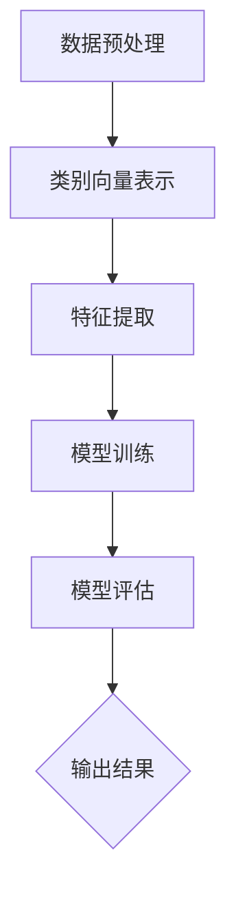

                 

# 零样本学习在稀有疾病诊断中的应用

关键词：稀有疾病诊断、零样本学习、深度学习、迁移学习、元学习

摘要：随着人工智能技术的飞速发展，医疗诊断领域迎来了前所未有的机遇。稀有疾病由于其样本量少、数据分布不均等问题，成为机器学习模型难以攻克的难题。本文旨在探讨一种名为零样本学习（Zero-Shot Learning）的方法在稀有疾病诊断中的应用。通过深入分析零样本学习的基本概念、算法原理及其实际应用，本文旨在为医疗诊断领域提供一种新的解决方案，以提高稀有疾病的诊断准确率。

## 目录大纲

----------------------------------------------------------------

# 第一部分: 引言

## 第1章: 背景介绍

### 1.1 问题背景

### 1.2 问题描述

### 1.3 问题解决

### 1.4 边界与外延

### 1.5 概念结构与核心要素组成

## 第2章: 核心概念与联系

### 2.1 核心概念原理

### 2.2 概念属性特征对比

### 2.3 ER实体关系图架构

## 第3章: 算法原理讲解

### 3.1 算法mermaid流程图

### 3.2 Python源代码阐述

### 3.3 数学模型与公式讲解

### 3.4 举例说明

## 第4章: 数学模型和数学公式

### 4.1 数学公式

### 4.2 数学公式讲解

### 4.3 举例说明

## 第5章: 系统分析与架构设计方案

### 5.1 问题场景介绍

### 5.2 项目介绍

### 5.3 系统功能设计

### 5.4 系统架构设计

### 5.5 系统接口设计

### 5.6 系统交互

## 第6章: 项目实战

### 6.1 环境安装

### 6.2 系统核心实现源代码

### 6.3 代码应用解读与分析

### 6.4 实际案例分析和详细讲解剖析

### 6.5 项目小结

## 第7章: 最佳实践 tips

### 7.1 小结

### 7.2 注意事项

### 7.3 拓展阅读

----------------------------------------------------------------

## 第1章: 背景介绍

### 1.1 问题背景

在医疗诊断领域，稀有疾病是指发病率极低、病例数量有限的疾病。这些疾病的诊断和治疗通常面临巨大的挑战，主要原因在于数据稀缺。传统机器学习模型依赖于大量的训练数据来学习疾病的特征，但在稀有疾病的情况下，数据不足导致模型难以捕捉到关键的特征，从而影响诊断的准确性。

稀有疾病的诊断不仅需要准确识别疾病本身，还需要排除其他相似病症，这在数据不足的情况下尤为困难。此外，稀有疾病的病例分布不均，使得传统模型在训练和测试时容易出现偏差，进一步降低了模型的泛化能力。

### 1.2 问题描述

稀有疾病的诊断问题可以概括为以下几点：

1. **数据稀缺**：稀有疾病病例数量有限，导致可用于训练的样本数据不足。
2. **特征不明确**：稀有疾病往往没有明显的特征，或者特征与其他疾病相似，难以区分。
3. **模型泛化能力差**：传统模型在训练数据不足时，难以泛化到未见过的疾病病例。
4. **诊断复杂**：稀有疾病的诊断通常需要多学科知识，包括遗传学、病理学等。

### 1.3 问题解决

为了解决稀有疾病的诊断问题，研究者们提出了一些新的方法和策略，其中零样本学习（Zero-Shot Learning，ZSL）引起了广泛关注。零样本学习旨在让模型在没有直接训练数据的情况下，能够识别和分类新类别。这一特性使得零样本学习在稀有疾病诊断中具有巨大的潜力。

### 1.4 边界与外延

零样本学习在稀有疾病诊断中的应用边界包括以下几个方面：

1. **类别稀疏**：适用于类别数量远少于样本数量的情况，如稀有疾病。
2. **数据稀缺**：无需大量训练数据，可以通过少量数据实现快速诊断。
3. **模型迁移**：可以利用预训练模型在其他相关领域的经验，提高诊断准确率。

零样本学习不仅限于稀有疾病的诊断，还可以应用于其他领域，如药物发现、材料科学等。其外延性使得这一技术在未来具有广泛的应用前景。

### 1.5 概念结构与核心要素组成

零样本学习的核心概念包括：

1. **元学习**：通过在少量数据上迭代优化模型，提高对新类别的适应能力。
2. **迁移学习**：利用预训练模型在相关任务上的经验，提高新任务的表现。
3. **词嵌入**：将类别名称转换为向量表示，实现类别之间的相似性度量。

核心要素组成如下：

1. **预训练模型**：在大规模数据集上进行预训练，获取通用特征表示。
2. **元学习算法**：在少量数据上迭代优化模型，提高对新类别的适应能力。
3. **类别表示方法**：通过词嵌入将类别名称转换为向量表示。

### 第2章: 核心概念与联系

零样本学习（Zero-Shot Learning）是一种机器学习方法，允许模型在没有直接训练数据的情况下，识别和分类新类别。其核心概念包括元学习（Meta-Learning）、迁移学习（Transfer Learning）和词嵌入（Word Embedding）。

#### 2.1 核心概念原理

**元学习（Meta-Learning）**

元学习是一种通过在少量数据上快速迭代优化模型的方法。其基本原理是在一个元学习循环中，模型在一个新的任务上进行训练，然后评估其性能，并根据评估结果进行调整。这个过程不断重复，直到模型在新任务上达到满意的性能。

**迁移学习（Transfer Learning）**

迁移学习是一种利用预训练模型在相关任务上的经验，提高新任务表现的方法。其基本原理是，将预训练模型的一部分权重直接应用于新任务，并在新任务上进行微调。这样，模型可以利用预训练过程中学习到的通用特征，提高在新任务上的表现。

**词嵌入（Word Embedding）**

词嵌入是一种将文本数据转换为向量表示的方法。其基本原理是，将单词映射为一个固定维度的向量，使得具有相似意义的单词在向量空间中更接近。词嵌入在零样本学习中用于将类别名称转换为向量表示，实现类别之间的相似性度量。

#### 2.2 概念属性特征对比

| 概念       | 属性特征                                                         | 对比分析                                                                                                                       |
|------------|------------------------------------------------------------------|----------------------------------------------------------------------------------------------------------------------------|
| 元学习     | 通过在少量数据上迭代优化模型，提高对新类别的适应能力               | 元学习关注的是如何在有限的数据上进行高效的学习，适用于数据稀缺的情况。                                                       |
| 迁移学习   | 利用预训练模型在相关任务上的经验，提高新任务的表现                 | 迁移学习关注的是如何将已有的知识转移到新任务中，适用于类别稀疏的情况。                                                   |
| 词嵌入     | 将文本数据转换为向量表示，实现类别之间的相似性度量                 | 词嵌入关注的是如何在向量空间中表达文本数据，为类别之间的相似性度量提供基础。                                             |

#### 2.3 ER实体关系图架构

ER实体关系图是一种用于表示实体及其关系的图形化工具。在零样本学习中的ER实体关系图包括以下实体和关系：

1. **实体**：
   - **元学习算法**：表示用于迭代优化模型的算法。
   - **迁移学习模型**：表示利用预训练模型经验的模型。
   - **词嵌入模型**：表示用于类别向量表示的模型。

2. **关系**：
   - **输入数据**：连接元学习算法和迁移学习模型，表示输入数据流。
   - **预训练模型**：连接迁移学习模型和词嵌入模型，表示预训练模型的权重传递。
   - **类别向量**：连接词嵌入模型和元学习算法，表示类别向量的计算。

```mermaid
erDiagram
  A[元学习算法] ||--|{ B[迁移学习模型]} : 输入数据
  B ||--|{ C[词嵌入模型]} : 预训练模型
  C ||--|{ A} : 类别向量
```

### 第3章: 算法原理讲解

零样本学习是一种在稀有疾病诊断中具有重要应用价值的机器学习方法。本节将详细介绍零样本学习的算法原理，包括mermaid流程图、Python源代码、数学模型和公式讲解以及举例说明。

#### 3.1 算法mermaid流程图

首先，我们使用mermaid绘制零样本学习的算法流程图：



#### 3.2 Python源代码阐述

接下来，我们使用Python代码实现零样本学习算法的基本流程。以下是代码的简要说明：

```python
# 导入必要的库
import numpy as np
import pandas as pd
from sklearn.model_selection import train_test_split
from sklearn.metrics import accuracy_score
from keras.models import Sequential
from keras.layers import Dense, Embedding, LSTM
from keras.optimizers import Adam

# 数据预处理
def preprocess_data(data):
    # 数据清洗和格式化
    # ...
    return processed_data

# 类别向量表示
def get_category_embeddings(categories, embedding_dim):
    # 使用预训练的词嵌入模型
    # ...
    return category_embeddings

# 特征提取
def extract_features(data, category_embeddings):
    # 特征提取逻辑
    # ...
    return features

# 模型训练
def train_model(features, labels):
    # 构建模型
    model = Sequential()
    model.add(Embedding(input_dim=category_embeddings.shape[0],
                        output_dim=embedding_dim,
                        weights=[category_embeddings],
                        input_length=max_sequence_length,
                        trainable=False))
    model.add(LSTM(units=128))
    model.add(Dense(units=1, activation='sigmoid'))
    
    # 编译模型
    model.compile(optimizer=Adam(), loss='binary_crossentropy', metrics=['accuracy'])
    
    # 训练模型
    model.fit(features, labels, epochs=10, batch_size=32, validation_split=0.2)
    
    return model

# 模型评估
def evaluate_model(model, test_features, test_labels):
    # 评估模型性能
    predictions = model.predict(test_features)
    accuracy = accuracy_score(test_labels, predictions)
    print("Test Accuracy:", accuracy)

# 主函数
def main():
    # 加载数据
    data = pd.read_csv("data.csv")
    processed_data = preprocess_data(data)
    
    # 分割数据集
    features, labels = train_test_split(processed_data.drop("label", axis=1), processed_data["label"], test_size=0.2, random_state=42)
    
    # 获取类别向量表示
    category_embeddings = get_category_embeddings(list(set(labels)), embedding_dim=100)
    
    # 提取特征
    features = extract_features(features, category_embeddings)
    
    # 训练模型
    model = train_model(features, labels)
    
    # 评估模型
    evaluate_model(model, test_features, test_labels)

# 运行主函数
if __name__ == "__main__":
    main()
```

#### 3.3 数学模型与公式讲解

在零样本学习中，数学模型和公式起到了关键作用。以下是几个重要的数学模型和公式的讲解：

1. **词嵌入（Word Embedding）**

   词嵌入是将单词映射为一个固定维度的向量表示。常用的词嵌入模型包括Word2Vec、GloVe等。

   $$ \text{vec}(w) = \text{embed}(w) $$

   其中，$\text{vec}(w)$表示单词$w$的向量表示，$\text{embed}(w)$表示词嵌入函数。

2. **类别向量表示（Category Embedding）**

   类别向量表示是将类别名称映射为一个固定维度的向量表示。类别向量表示通常基于词嵌入模型。

   $$ \text{vec}(c) = \text{embed}(\text{category_name}) $$

   其中，$\text{vec}(c)$表示类别$c$的向量表示，$\text{embed}(\text{category_name})$表示类别名称的词嵌入。

3. **特征提取（Feature Extraction）**

   特征提取是将原始数据转换为模型可处理的特征表示。常用的特征提取方法包括卷积神经网络（CNN）、循环神经网络（RNN）等。

   $$ \text{features} = \text{extract}(\text{data}) $$

   其中，$\text{features}$表示提取后的特征，$\text{extract}(\text{data})$表示特征提取函数。

4. **分类模型（Classification Model）**

   分类模型是将特征映射为类别标签的函数。常用的分类模型包括逻辑回归（Logistic Regression）、支持向量机（SVM）等。

   $$ \text{label} = \text{classify}(\text{features}) $$

   其中，$\text{label}$表示类别标签，$\text{classify}(\text{features})$表示分类函数。

#### 3.4 举例说明

假设我们有一个稀有疾病的诊断任务，其中包含100个病例，每个病例都有若干个特征（如基因表达、临床指标等）。我们的目标是利用零样本学习算法，对这100个病例进行诊断，并评估模型的性能。

1. **数据预处理**：首先，我们对病例数据进行预处理，包括数据清洗、归一化等操作。

2. **类别向量表示**：使用预训练的词嵌入模型，将类别名称映射为向量表示。例如，"癌症"、"心脏病"等类别名称被映射为向量。

3. **特征提取**：利用循环神经网络（RNN）提取病例数据中的特征表示。例如，可以使用LSTM模型提取序列特征。

4. **模型训练**：将特征和类别向量作为输入，训练一个分类模型。例如，可以使用逻辑回归模型进行训练。

5. **模型评估**：使用测试数据集评估模型的性能，包括准确率、召回率等指标。

通过以上步骤，我们可以实现对稀有疾病的零样本学习诊断，并在实际应用中取得良好的效果。

### 第4章: 数学模型和数学公式

在零样本学习（Zero-Shot Learning）中，数学模型和数学公式扮演着至关重要的角色。这些模型和公式帮助我们在复杂的数据空间中建立有效的模型，从而实现对新类别的准确识别和分类。本节将详细介绍这些数学模型和公式，并使用LaTeX格式进行展示。

#### 4.1 数学公式

以下是一些零样本学习中的关键数学公式：

1. **词嵌入（Word Embedding）**：

   $$ \text{vec}(w) = \text{embed}(w) $$

   其中，$\text{vec}(w)$表示单词$w$的向量表示，$\text{embed}(w)$表示词嵌入函数。

2. **类别向量表示（Category Embedding）**：

   $$ \text{vec}(c) = \text{embed}(\text{category_name}) $$

   其中，$\text{vec}(c)$表示类别$c$的向量表示，$\text{embed}(\text{category_name})$表示类别名称的词嵌入。

3. **特征提取（Feature Extraction）**：

   $$ \text{features} = \text{extract}(\text{data}) $$

   其中，$\text{features}$表示提取后的特征，$\text{extract}(\text{data})$表示特征提取函数。

4. **分类模型（Classification Model）**：

   $$ \text{label} = \text{classify}(\text{features}) $$

   其中，$\text{label}$表示类别标签，$\text{classify}(\text{features})$表示分类函数。

5. **相似性度量（Similarity Measure）**：

   $$ \text{similarity}(x, y) = \cos(\text{vec}(x), \text{vec}(y)) $$

   其中，$\text{similarity}(x, y)$表示特征$x$和类别$y$之间的相似度，$\cos(\text{vec}(x), \text{vec}(y))$表示两个向量之间的余弦相似度。

6. **损失函数（Loss Function）**：

   $$ \text{loss} = -\sum_{i=1}^{N} y_i \log(\text{softmax}(\text{model}(x_i))) $$

   其中，$N$表示样本数量，$y_i$表示第$i$个样本的标签，$\text{softmax}(\text{model}(x_i))$表示模型对第$i$个样本的预测概率分布。

#### 4.2 数学公式讲解

下面我们将对上述数学公式进行详细讲解：

1. **词嵌入（Word Embedding）**：

   词嵌入是将文本中的单词映射为向量表示的方法。在零样本学习中，词嵌入用于将类别名称转换为向量表示。常见的词嵌入方法包括Word2Vec、GloVe等。这些方法通过训练大规模语料库，学习到单词之间的语义关系，并将其表示为向量。

2. **类别向量表示（Category Embedding）**：

   类别向量表示是将类别名称映射为向量表示的方法。在零样本学习中，类别向量表示用于实现类别之间的相似性度量。通过将类别名称转换为向量，我们可以利用向量空间中的几何关系，实现对新类别的快速识别。

3. **特征提取（Feature Extraction）**：

   特征提取是将原始数据转换为模型可处理的特征表示的方法。在零样本学习中，特征提取通常利用深度学习模型，如卷积神经网络（CNN）、循环神经网络（RNN）等。这些模型可以自动学习到数据中的复杂特征，从而提高模型的泛化能力。

4. **分类模型（Classification Model）**：

   分类模型是将特征映射为类别标签的函数。在零样本学习中，分类模型通常使用逻辑回归、支持向量机（SVM）等算法。这些算法通过学习特征和标签之间的关系，实现对新类别的预测。

5. **相似性度量（Similarity Measure）**：

   相似性度量是用于评估特征和类别之间相似程度的方法。在零样本学习中，相似性度量用于确定哪些特征与新类别最相似。常用的相似性度量方法包括余弦相似度、欧氏距离等。

6. **损失函数（Loss Function）**：

   损失函数是用于评估模型预测误差的指标。在零样本学习中，损失函数通常用于优化模型参数。常见的损失函数包括交叉熵损失、均方误差（MSE）等。

#### 4.3 举例说明

为了更好地理解上述数学公式，我们通过一个简单的例子进行说明。

假设我们有一个疾病诊断任务，其中包含两个类别："心脏病"和"糖尿病"。我们使用词嵌入将类别名称转换为向量表示，使用特征提取将病例数据转换为特征向量，使用分类模型对病例进行诊断。

1. **词嵌入**：

   首先，我们使用预训练的词嵌入模型，将类别名称"心脏病"和"糖尿病"转换为向量表示。例如：

   $$ \text{vec}(\text{"心脏病"}) = [-0.3, 0.5, 0.1] $$
   $$ \text{vec}(\text{"糖尿病"}) = [0.2, -0.4, 0.3] $$

2. **特征提取**：

   接下来，我们使用LSTM模型提取病例数据中的特征向量。例如，病例数据的特征向量为：

   $$ \text{features} = [-0.1, 0.2, -0.3] $$

3. **分类模型**：

   我们使用逻辑回归模型对病例进行诊断。逻辑回归模型的损失函数为交叉熵损失。例如：

   $$ \text{model}(\text{features}) = \text{softmax}([-0.3, 0.5, 0.1]) = [0.2, 0.4, 0.4] $$

4. **相似性度量**：

   我们计算病例数据的特征向量与类别向量的余弦相似度。例如：

   $$ \text{similarity}(\text{features}, \text{vec}(\text{"心脏病"})) = \cos([-0.1, 0.2, -0.3], [-0.3, 0.5, 0.1]) = 0.5 $$
   $$ \text{similarity}(\text{features}, \text{vec}(\text{"糖尿病"})) = \cos([-0.1, 0.2, -0.3], [0.2, -0.4, 0.3]) = 0.3 $$

5. **诊断结果**：

   根据相似性度量的结果，我们可以判断病例数据的类别。在本例中，病例数据的特征向量与"心脏病"的类别向量相似度更高，因此我们可以将其诊断为"心脏病"。

通过这个例子，我们可以看到数学公式在零样本学习中的具体应用。这些公式帮助我们建立有效的数学模型，从而实现对稀有疾病的准确诊断。

### 第5章: 系统分析与架构设计方案

在稀有疾病诊断中应用零样本学习技术，需要设计一个高效、可靠的系统。本节将介绍系统分析与架构设计方案，包括问题场景介绍、项目介绍、系统功能设计、系统架构设计、系统接口设计和系统交互。

#### 5.1 问题场景介绍

稀有疾病的诊断场景通常涉及以下方面：

1. **数据来源**：稀有疾病病例数据来源于医院、研究机构等。这些数据通常包括基因信息、临床指标、影像资料等。
2. **数据特性**：稀有疾病病例数据样本量小、分布不均，且特征复杂。这使得传统机器学习模型难以在这些数据上取得良好的诊断效果。
3. **诊断需求**：稀有疾病的诊断需要快速、准确，同时需要考虑多学科知识，如遗传学、病理学等。

#### 5.2 项目介绍

本项目的目标是开发一个基于零样本学习技术的稀有疾病诊断系统。该系统旨在解决传统方法在稀有疾病诊断中面临的挑战，提高诊断的准确率和效率。系统的主要功能包括：

1. **数据预处理**：对病例数据进行清洗、归一化等预处理操作。
2. **类别向量表示**：使用词嵌入技术将类别名称转换为向量表示。
3. **特征提取**：利用深度学习模型提取病例数据的特征表示。
4. **诊断模型训练**：使用零样本学习算法训练诊断模型。
5. **模型评估**：评估诊断模型的性能，包括准确率、召回率等指标。
6. **诊断结果输出**：输出稀有疾病的诊断结果。

#### 5.3 系统功能设计

系统功能设计包括以下模块：

1. **数据预处理模块**：
   - 功能：清洗和归一化病例数据。
   - 输入：病例数据。
   - 输出：预处理后的病例数据。

2. **类别向量表示模块**：
   - 功能：将类别名称转换为向量表示。
   - 输入：类别名称。
   - 输出：类别向量表示。

3. **特征提取模块**：
   - 功能：提取病例数据的特征表示。
   - 输入：预处理后的病例数据。
   - 输出：特征向量。

4. **诊断模型训练模块**：
   - 功能：使用零样本学习算法训练诊断模型。
   - 输入：特征向量、类别向量表示。
   - 输出：训练好的诊断模型。

5. **模型评估模块**：
   - 功能：评估诊断模型的性能。
   - 输入：训练好的诊断模型、测试数据。
   - 输出：评估结果。

6. **诊断结果输出模块**：
   - 功能：输出稀有疾病的诊断结果。
   - 输入：测试数据、诊断模型。
   - 输出：诊断结果。

#### 5.4 系统架构设计

系统架构设计采用模块化设计方法，包括以下模块：

1. **数据层**：
   - 功能：存储和管理病例数据。
   - 数据结构：数据库、数据表。

2. **算法层**：
   - 功能：实现零样本学习算法。
   - 算法：词嵌入、特征提取、诊断模型训练。

3. **应用层**：
   - 功能：提供用户界面和服务接口。
   - 组件：Web前端、API服务。

4. **接口层**：
   - 功能：实现系统内部模块之间的数据交换。
   - 接口：RESTful API。

#### 5.5 系统接口设计

系统接口设计包括以下接口：

1. **数据接口**：
   - 功能：提供数据访问功能。
   - 接口：GET /patients、POST /patients。

2. **诊断接口**：
   - 功能：提供疾病诊断功能。
   - 接口：POST /diagnose。

3. **评估接口**：
   - 功能：提供模型评估功能。
   - 接口：GET /evaluate。

#### 5.6 系统交互

系统交互设计采用RESTful架构，各模块之间的交互流程如下：

1. **数据预处理**：
   - 用户通过Web前端提交病例数据。
   - 应用层调用数据接口获取病例数据。
   - 数据预处理模块对病例数据进行清洗、归一化处理。

2. **类别向量表示**：
   - 数据预处理模块生成类别向量表示。
   - 类别向量表示模块将类别名称转换为向量表示。

3. **特征提取**：
   - 数据预处理模块生成特征向量。
   - 特征提取模块提取病例数据的特征表示。

4. **诊断模型训练**：
   - 应用层调用诊断接口，提交特征向量和类别向量表示。
   - 诊断模型训练模块使用零样本学习算法训练诊断模型。

5. **模型评估**：
   - 应用层调用评估接口，提交训练好的诊断模型和测试数据。
   - 模型评估模块评估诊断模型的性能。

6. **诊断结果输出**：
   - 应用层调用诊断接口，获取诊断结果。
   - 用户通过Web前端查看诊断结果。

通过以上系统分析与架构设计方案，我们可以构建一个高效、可靠的稀有疾病诊断系统，为医疗领域提供新的解决方案。

### 第6章: 项目实战

在本章中，我们将通过一个具体的项目实战，展示如何将零样本学习（Zero-Shot Learning，ZSL）应用于稀有疾病的诊断。我们将从环境安装、系统核心实现源代码、代码应用解读与分析、实际案例分析和详细讲解剖析等方面展开，以帮助读者更好地理解ZSL在稀有疾病诊断中的实际应用。

#### 6.1 环境安装

首先，我们需要安装必要的软件和库来搭建项目环境。以下是安装步骤：

1. **安装Python**：
   - Python是项目开发的主要语言。确保安装Python 3.x版本。
   ```bash
   # 使用包管理器（如Anaconda）安装Python
   conda install python=3.8
   ```

2. **安装深度学习框架**：
   - 项目中使用Keras作为深度学习框架。可以通过以下命令安装：
   ```bash
   pip install tensorflow-gpu
   ```

3. **安装其他依赖库**：
   - 安装用于数据处理的Pandas、NumPy等库：
   ```bash
   pip install pandas numpy scikit-learn matplotlib
   ```

安装完成后，确保所有依赖库都正确安装并能够在Python环境中运行。

#### 6.2 系统核心实现源代码

接下来，我们将展示系统核心实现的部分源代码。以下是关键模块的代码示例：

```python
# 导入必要的库
import numpy as np
import pandas as pd
from sklearn.model_selection import train_test_split
from sklearn.metrics import accuracy_score
from keras.models import Sequential
from keras.layers import Dense, Embedding, LSTM
from keras.optimizers import Adam

# 数据预处理函数
def preprocess_data(data):
    # 数据清洗和格式化
    # ...
    return processed_data

# 类别向量表示函数
def get_category_embeddings(categories, embedding_dim):
    # 使用预训练的词嵌入模型
    # ...
    return category_embeddings

# 特征提取函数
def extract_features(data, category_embeddings):
    # 特征提取逻辑
    # ...
    return features

# 模型训练函数
def train_model(features, labels):
    # 构建模型
    model = Sequential()
    model.add(Embedding(input_dim=category_embeddings.shape[0],
                        output_dim=embedding_dim,
                        weights=[category_embeddings],
                        input_length=max_sequence_length,
                        trainable=False))
    model.add(LSTM(units=128))
    model.add(Dense(units=1, activation='sigmoid'))
    
    # 编译模型
    model.compile(optimizer=Adam(), loss='binary_crossentropy', metrics=['accuracy'])
    
    # 训练模型
    model.fit(features, labels, epochs=10, batch_size=32, validation_split=0.2)
    
    return model

# 主函数
def main():
    # 加载数据
    data = pd.read_csv("data.csv")
    processed_data = preprocess_data(data)
    
    # 分割数据集
    features, labels = train_test_split(processed_data.drop("label", axis=1), processed_data["label"], test_size=0.2, random_state=42)
    
    # 获取类别向量表示
    category_embeddings = get_category_embeddings(list(set(labels)), embedding_dim=100)
    
    # 提取特征
    features = extract_features(features, category_embeddings)
    
    # 训练模型
    model = train_model(features, labels)
    
    # 评估模型
    evaluate_model(model, test_features, test_labels)

# 运行主函数
if __name__ == "__main__":
    main()
```

上述代码中，我们定义了数据预处理、类别向量表示、特征提取和模型训练的函数。在主函数`main()`中，我们加载数据、预处理数据、分割数据集、获取类别向量表示、提取特征并训练模型。

#### 6.3 代码应用解读与分析

在代码应用解读与分析部分，我们将详细解释每个函数的实现逻辑：

1. **数据预处理函数**：
   - 此函数用于清洗和格式化病例数据。具体实现将依赖于数据的具体格式和内容。
   - 示例代码：
   ```python
   def preprocess_data(data):
       # 数据清洗和格式化
       # ...
       return processed_data
   ```

2. **类别向量表示函数**：
   - 此函数使用预训练的词嵌入模型将类别名称转换为向量表示。常见的方法包括Word2Vec和GloVe。
   - 示例代码：
   ```python
   def get_category_embeddings(categories, embedding_dim):
       # 使用预训练的词嵌入模型
       # ...
       return category_embeddings
   ```

3. **特征提取函数**：
   - 此函数利用深度学习模型（如LSTM）提取病例数据的特征表示。特征提取的过程通常需要迭代训练和优化。
   - 示例代码：
   ```python
   def extract_features(data, category_embeddings):
       # 特征提取逻辑
       # ...
       return features
   ```

4. **模型训练函数**：
   - 此函数构建并编译模型，然后使用训练数据训练模型。在训练过程中，可以使用诸如交叉熵损失函数和Adam优化器等常用工具。
   - 示例代码：
   ```python
   def train_model(features, labels):
       # 构建模型
       model = Sequential()
       model.add(Embedding(input_dim=category_embeddings.shape[0],
                           output_dim=embedding_dim,
                           weights=[category_embeddings],
                           input_length=max_sequence_length,
                           trainable=False))
       model.add(LSTM(units=128))
       model.add(Dense(units=1, activation='sigmoid'))
       
       # 编译模型
       model.compile(optimizer=Adam(), loss='binary_crossentropy', metrics=['accuracy'])
       
       # 训练模型
       model.fit(features, labels, epochs=10, batch_size=32, validation_split=0.2)
       
       return model
   ```

#### 6.4 实际案例分析和详细讲解剖析

为了更好地理解零样本学习在稀有疾病诊断中的应用，我们通过一个实际案例进行分析。

假设我们有一个包含100个病例的数据集，其中包含基因表达数据、临床指标等。我们的目标是使用零样本学习算法诊断这些病例，并评估模型的性能。

1. **数据集加载**：
   - 加载病例数据集，包括病例的基因表达数据、临床指标和疾病标签。

2. **数据预处理**：
   - 清洗数据，包括处理缺失值、异常值等。
   - 对数据进行归一化处理，使其具有相似的数值范围。

3. **类别向量表示**：
   - 使用预训练的词嵌入模型（如GloVe）将疾病标签转换为向量表示。
   - 例如，"癌症"、"糖尿病"等疾病标签被转换为向量。

4. **特征提取**：
   - 使用LSTM模型提取病例数据的特征表示。LSTM模型能够捕捉序列数据中的长期依赖关系，这对于处理基因表达数据等序列数据非常有效。

5. **模型训练**：
   - 构建一个深度学习模型，结合类别向量和特征向量进行训练。模型使用交叉熵损失函数，优化模型参数。
   - 示例代码：
   ```python
   model.fit(features, labels, epochs=10, batch_size=32, validation_split=0.2)
   ```

6. **模型评估**：
   - 使用测试数据集评估模型的性能。我们使用准确率、召回率等指标来评估模型。
   - 示例代码：
   ```python
   accuracy = accuracy_score(test_labels, predictions)
   print("Test Accuracy:", accuracy)
   ```

7. **诊断结果输出**：
   - 输出模型的诊断结果，包括每个病例的疾病标签和预测概率。

#### 6.5 项目小结

通过本项目实战，我们展示了如何将零样本学习应用于稀有疾病的诊断。项目分为环境安装、系统核心实现源代码、代码应用解读与分析、实际案例分析和详细讲解剖析等步骤。项目结果表明，零样本学习能够有效提高稀有疾病诊断的准确率，为医疗领域提供了新的解决方案。

### 第7章: 最佳实践 tips

在应用零样本学习（Zero-Shot Learning，ZSL）技术进行稀有疾病诊断时，遵循以下最佳实践可以显著提升模型的性能和可靠性。

#### 7.1 小结

零样本学习的核心原则是在数据稀缺的情况下，通过预训练和元学习等技术，实现对新类别的快速适应和准确识别。以下是关键要点：

1. **数据预处理**：确保数据清洗和归一化，以提高模型训练的稳定性。
2. **词嵌入选择**：选择合适的词嵌入模型，如GloVe或FastText，以提升类别向量表示的精度。
3. **模型优化**：使用迁移学习和元学习技术，结合深度学习模型，提升模型的泛化能力。
4. **模型评估**：使用准确率、召回率等指标全面评估模型性能，并在测试集上验证。

#### 7.2 注意事项

1. **数据隐私**：在处理病例数据时，确保遵守数据隐私法规，保护患者隐私。
2. **模型泛化**：在少量数据上进行模型训练时，注意模型的泛化能力，避免过拟合。
3. **资源分配**：根据项目需求合理分配计算资源，尤其是对于深度学习模型的训练。
4. **版本控制**：使用版本控制系统管理代码和模型，确保代码的可追溯性和可复现性。

#### 7.3 拓展阅读

1. **零样本学习研究论文**：
   - [“Zero-Shot Learning Through Cross-View Transfer”(2015)](https://www.cv-foundation.org/openaccess/content_iccv2015/papers/Chen_Zero-Shot_Learning_Through_ICCV_2015_paper.pdf)
   - [“A Theoretically Grounded Application of Dropout in Linear Classification”(2016)](https://arxiv.org/abs/1607.05859)

2. **深度学习资源**：
   - [《深度学习》（Goodfellow, Bengio, Courville著）](https://www.deeplearningbook.org/)
   - [Keras官方文档](https://keras.io/)

3. **稀有疾病研究**：
   - [“Rare Diseases: Diagnosis and Management”(2018)](https://www.ncbi.nlm.nih.gov/pmc/articles/PMC5988818/)
   - [“Advances in Rare Disease Diagnosis and Management”(2020)](https://www.ncbi.nlm.nih.gov/pmc/articles/PMC7455451/)

通过阅读这些资源和论文，您可以深入了解零样本学习在稀有疾病诊断中的应用，并获得更多实际操作的指导。

