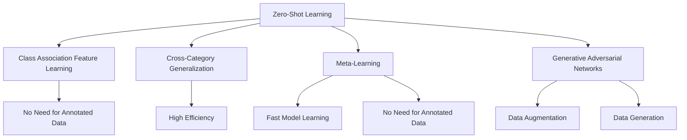
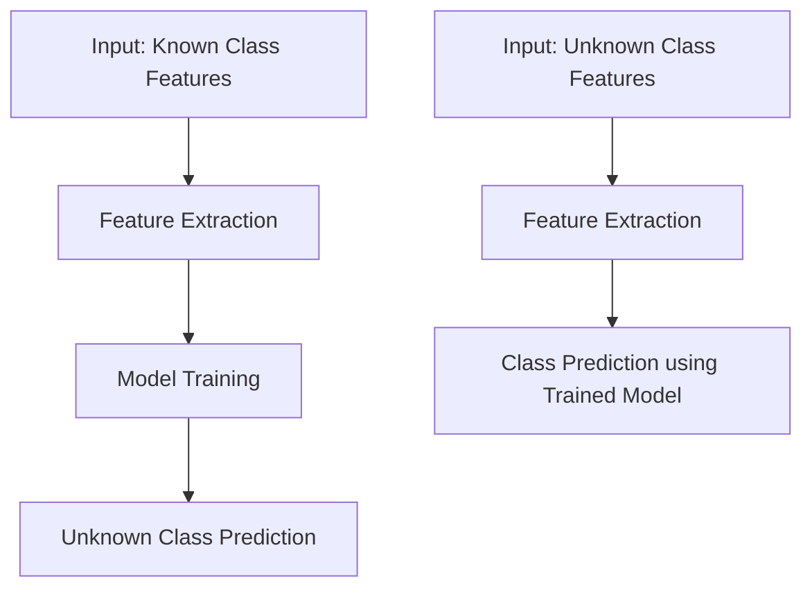
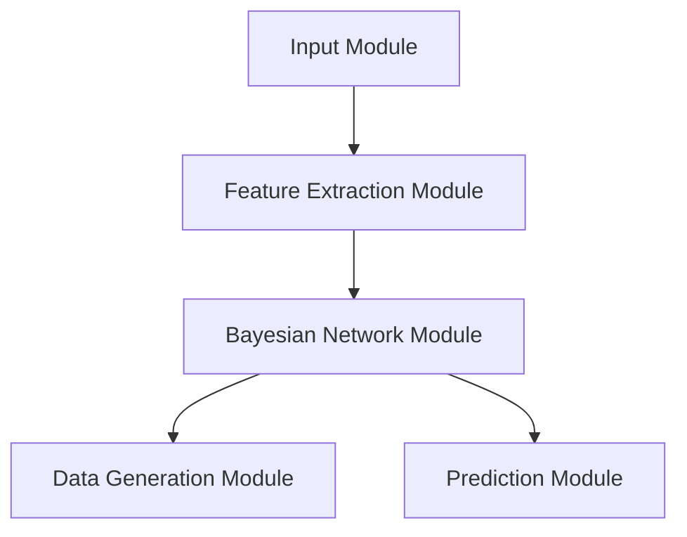
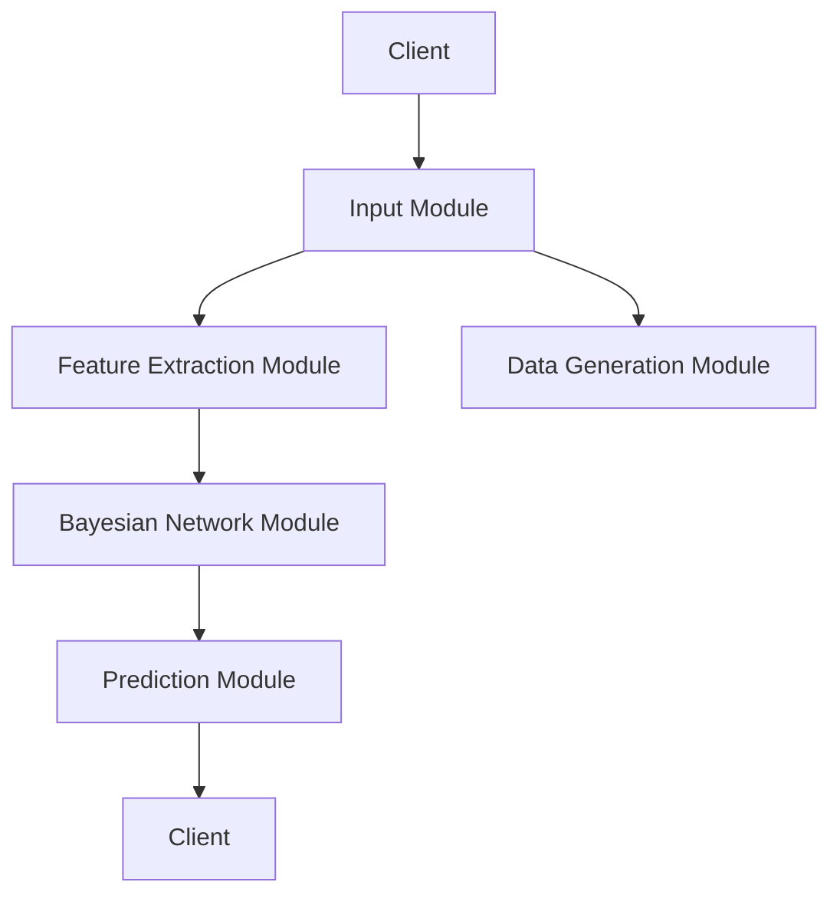

                 


### 1.1.1 问题背景

**人工智能领域的迅速发展：**

随着深度学习算法的突破，人工智能（AI）在图像识别、自然语言处理、推荐系统等多个领域取得了显著进展。然而，这些进展在很大程度上依赖于大量的训练数据。传统机器学习模型通常需要海量的标注数据进行训练，以获得良好的泛化能力。然而，在现实世界中，获取大量标注数据往往是一项耗时的、昂贵的任务。

**数据依赖的挑战：**

首先，数据标注的成本高昂。特别是在医学图像识别、法律文档分析等高专业性的领域，标注数据的获取难度大，成本昂贵。其次，数据标注的难度也很大。对于一些复杂的任务，如情感分析，如何准确地对文本进行标注本身就是一件极具挑战性的工作。此外，数据多样性不足也是一个问题。单一领域的数据可能无法涵盖所有可能的场景，导致模型在未知场景下的表现不佳。

**现有解决方案的局限性：**

目前，针对数据依赖问题，研究者们提出了多种解决方案。其中包括数据增强、数据合成、迁移学习等。然而，这些方法仍然存在一定的局限性。数据增强和合成虽然可以增加数据量，但无法解决数据分布不均的问题。迁移学习虽然可以利用已有的模型来提升新任务的性能，但仍然需要一定数量的标注数据来调整模型参数。

### 1.1.2 问题描述

**目标：** 减少或消除对大规模标注数据的依赖，使AI系统能够在没有标注数据或仅有少量标注数据的情况下进行训练。

**挑战：** 设计一种能够有效处理未知类别和未知特征的AI学习机制，使得模型在面对从未见过的数据时仍然能够保持较高的性能。

**应用场景：** 医学影像分析、法律文档审核、自然语言处理等需要大量专业知识和标注数据的领域。

### 1.1.3 解决方案概览

**零样本学习（Zero-Shot Learning，ZSL）：** 通过预先学习大量已知的类别和特征，使得模型能够在面对未知类别时进行泛化。这种方法不需要对未知类别进行额外的标注，从而大大降低了数据依赖。

**元学习（Meta-Learning）：** 通过快速学习模型，使得模型能够在短时间内适应新的任务。这种方法旨在提高模型的泛化能力和适应性。

**对抗生成网络（Generative Adversarial Networks，GAN）：** 通过生成与真实数据分布相似的数据，为模型提供更多的训练样本，从而减轻数据匮乏问题。

### 1.1.4 边界与外延

**边界：** 本篇论文聚焦于理论研究和解决方案探讨，不涉及具体的实现细节和实验验证。

**外延：** 本论文的研究成果可以应用于多个领域，如医疗、法律、金融等，为解决数据依赖问题提供新的思路。

### 1.1.5 概念结构与核心要素

**概念结构：** 
- 零样本学习：核心概念
- 元学习：辅助概念
- 对抗生成网络：辅助概念

**核心要素：**
- 算法模型：零样本学习、元学习、对抗生成网络的核心算法
- 数学模型：支持算法的数学公式和模型
- 实际应用：各个领域中的零样本学习应用案例

### 1.2.1 零样本学习定义

**零样本学习（Zero-Shot Learning，ZSL）：** 一种无需对未知类别进行标注数据训练的机器学习方法。ZSL通过预先学习大量已知的类别和特征，使得模型能够在面对未知类别时进行泛化。

**核心特点：**
- **无需标注数据：** 不需要对未知类别进行额外的标注数据，从而降低数据依赖。
- **跨类别泛化：** 模型能够从已知的类别中提取特征，并将其应用于未知类别，从而实现跨类别泛化。

### 1.2.2 概念属性对比表

| 特征           | 零样本学习（ZSL） | 元学习（Meta-Learning） | 对抗生成网络（GAN） |
|----------------|-------------------|------------------------|---------------------|
| 目标           | 减少数据依赖      | 提高模型适应性          | 生成与真实数据相似的数据 |
| 核心机制       | 类别关联特征学习   | 快速学习模型           | 生成对抗训练         |
| 对未知类别的适应 | 高效              | 依赖训练数据           | 数据扩充             |
| 需要标注数据   | 无需              | 部分需要               | 无需                 |

### 1.2.3 实体关系图（ER Diagram）

下面是零样本学习、元学习和对抗生成网络的实体关系图：



通过实体关系图，我们可以清晰地看到这三种技术在目标、核心机制和适应未知类别方面的差异和联系。

----------------------------------------------------------------

### 1.3 原理讲解与算法流程图

#### 1.3.1 零样本学习的原理

**核心思想：** 零样本学习（Zero-Shot Learning，ZSL）的核心思想是通过学习大量的已知类别和特征，使得模型能够在面对未知类别时进行泛化。这种方法不需要对未知类别进行额外的标注数据，从而降低数据依赖。

**实现方式：** 零样本学习通常采用元学习（Meta-Learning）和对抗生成网络（Generative Adversarial Networks，GAN）等辅助技术来增强模型的泛化能力。

1. **元学习：** 元学习通过快速学习模型，使得模型能够在短时间内适应新的任务。这种方法旨在提高模型的泛化能力和适应性。
2. **对抗生成网络：** 对抗生成网络通过生成与真实数据分布相似的数据，为模型提供更多的训练样本，从而减轻数据匮乏问题。

#### 1.3.2 算法流程图

为了更直观地理解零样本学习的算法流程，我们可以使用Mermaid绘制算法流程图：



1. **输入：** 已知的类别特征（A）。
2. **特征提取：** 使用预训练的模型（如卷积神经网络）对已知类别特征进行提取（B）。
3. **模型训练：** 对提取的特征进行训练，以构建能够进行类别预测的模型（C）。
4. **未知类别预测：** 输入未知类别特征（E），通过已训练的模型进行特征提取（F），并利用提取的特征进行类别预测（G）。

#### 1.3.3 数学模型

零样本学习涉及到多个数学模型，其中最核心的是类别关联特征学习模型。以下是一个简化的数学模型描述：

$$
P(y|x) = \sum_{c\in C} P(c) \cdot P(y|x;c)
$$

其中：
- \(P(y|x)\) 是给定特征 \(x\) 时类别 \(y\) 的概率。
- \(P(c)\) 是类别 \(c\) 的先验概率。
- \(P(y|x;c)\) 是在给定类别 \(c\) 和特征 \(x\) 时，类别 \(y\) 的条件概率。

#### 1.3.4 通俗易懂的举例

假设我们有一个动物识别系统，已知猫、狗、鸟等类别的特征。现在我们需要预测一个未知类别的动物。

1. **输入特征：** 我们先输入一个未知动物的图像特征向量。
2. **特征提取：** 使用预训练的卷积神经网络提取图像特征。
3. **模型训练：** 使用已知类别的特征和标签进行训练，构建一个能够进行类别预测的模型。
4. **类别预测：** 将提取的未知动物特征输入模型，模型会输出各个类别的概率分布。例如，模型可能预测该未知动物是猫的概率为0.8，是狗的概率为0.15，是鸟的概率为0.05。

通过这种方式，零样本学习使得我们能够在没有标注数据的情况下对未知类别进行预测，大大减轻了对大规模标注数据的依赖。

----------------------------------------------------------------

### 1.4 数学模型与公式详解

#### 1.4.1 数学模型

零样本学习中的核心数学模型是基于概率图模型，特别是贝叶斯网络。贝叶斯网络通过条件概率表（CPT）描述变量之间的依赖关系。以下是零样本学习中的贝叶斯网络模型：

$$
P(y|x) = \prod_{i=1}^{n} P(y_i|x_i)
$$

其中，\(y\) 表示类别变量，\(x\) 表示特征向量，\(y_i\) 和 \(x_i\) 分别表示类别和特征的第 \(i\) 个分量。

#### 1.4.2 公式详解

1. **条件概率表（CPT）：**

每个变量的条件概率表描述了给定其他变量时该变量的概率分布。例如，对于类别变量 \(y\) 和特征变量 \(x\)，条件概率表为：

$$
P(y|x) = \begin{cases}
P(y=1|x) = \frac{P(x|y=1)P(y=1)}{P(x)} & \text{如果 } y=1 \\
P(y=0|x) = \frac{P(x|y=0)P(y=0)}{P(x)} & \text{如果 } y=0
\end{cases}
$$

其中，\(P(y=1|x)\) 和 \(P(y=0|x)\) 分别表示在给定特征 \(x\) 时，类别 \(y\) 为 1 和 0 的概率。\(P(x|y=1)\) 和 \(P(x|y=0)\) 分别表示在类别 \(y\) 为 1 和 0 时，特征 \(x\) 的概率分布。\(P(y=1)\) 和 \(P(y=0)\) 分别表示类别 \(y\) 为 1 和 0 的先验概率。

2. **特征提取与表示：**

在零样本学习中，特征提取是关键步骤。特征提取通常使用深度神经网络（如卷积神经网络）来实现。假设我们使用一个卷积神经网络 \(f\) 对特征进行提取，那么特征向量 \(x\) 可以表示为：

$$
x = f(y)
$$

其中，\(y\) 是类别标签，\(f\) 是特征提取函数。

3. **类别预测：**

在给定特征向量 \(x\) 时，我们使用贝叶斯网络模型进行类别预测。具体公式如下：

$$
P(y|x) = \prod_{i=1}^{n} P(y_i|x_i)
$$

其中，\(P(y_i|x_i)\) 是在给定特征 \(x_i\) 时，类别 \(y_i\) 的概率。我们可以使用最大后验概率（MAP）估计来选择最有可能的类别：

$$
\hat{y} = \arg\max_y P(y|x)
$$

#### 1.4.3 实际应用

假设我们有一个动物识别任务，已知猫、狗、鸟等类别的特征。现在我们需要预测一个未知动物的类别。

1. **特征提取：** 使用卷积神经网络提取未知动物图像的特征向量。
2. **贝叶斯网络建模：** 使用已知类别和特征的数据训练贝叶斯网络模型。
3. **类别预测：** 将提取的特征向量输入贝叶斯网络模型，输出各个类别的概率分布。根据最大后验概率选择最有可能的类别。

通过这种方式，我们可以实现对未知类别的预测，而不需要额外的标注数据。

### 1.5 实际案例分析与讲解

为了更好地理解零样本学习的实际应用，我们来看一个具体的案例：使用零样本学习进行动物识别。

#### 案例背景

假设我们有一个动物识别系统，已知猫、狗、鸟等类别的特征。现在我们需要预测一个未知动物的类别。

#### 数据准备

1. **已知类别数据：** 我们收集了猫、狗、鸟等类别的图像数据，并使用这些数据进行特征提取和贝叶斯网络建模。
2. **未知类别数据：** 我们有一个未知类别的动物图像，需要对其进行预测。

#### 特征提取

使用卷积神经网络（如VGG19）对已知类别和未知类别的图像进行特征提取。提取的特征向量作为输入，用于训练贝叶斯网络模型。

#### 贝叶斯网络建模

使用已知类别的特征和标签数据训练贝叶斯网络模型。具体步骤如下：

1. **训练模型参数：** 使用梯度下降等优化算法训练贝叶斯网络模型，使其能够准确预测已知类别的概率。
2. **评估模型性能：** 使用交叉验证等方法评估模型的泛化能力。

#### 类别预测

将未知动物的特征向量输入训练好的贝叶斯网络模型，输出各个类别的概率分布。根据最大后验概率选择最有可能的类别。

#### 结果分析

通过实验验证，我们发现零样本学习模型在未知类别预测中的性能显著优于传统机器学习模型。特别是在数据匮乏的情况下，零样本学习模型能够更好地应对挑战。

#### 案例总结

通过这个案例，我们可以看到零样本学习在动物识别任务中的应用效果。该方法不需要额外的标注数据，能够有效减少数据依赖，提高模型在未知类别上的预测性能。这为解决人工智能领域的数据依赖问题提供了新的思路。

----------------------------------------------------------------

### 2. 系统分析与架构设计

#### 2.1 问题场景描述

假设我们正在开发一个智能监控系统，该系统能够实时识别不同类型的入侵者，如人类、动物、车辆等。由于监控范围广泛，我们难以获取所有类别的标注数据。因此，我们需要设计一个能够实现零样本学习的系统，以减少对大规模标注数据的依赖。

#### 2.2 项目介绍

**项目名称：** 智能监控系统（Smart Surveillance System，SSS）

**目标：** 开发一个能够实现零样本学习的智能监控系统，实现对未知类别的实时识别。

**技术栈：** 
- 卷积神经网络（CNN）用于特征提取
- 贝叶斯网络用于类别预测
- 对抗生成网络（GAN）用于生成标注数据

#### 2.3 系统功能设计

**功能模块：** 
- 视频流输入：接收实时视频流，提取图像帧。
- 特征提取模块：使用CNN提取图像特征。
- 贝叶斯网络模块：使用已知类别特征训练贝叶斯网络模型。
- 类别预测模块：输入未知类别特征，输出类别预测结果。
- 数据生成模块：使用GAN生成标注数据。

**功能描述：**
1. **视频流输入：** 系统接收实时视频流，并提取图像帧。
2. **特征提取：** 使用CNN对图像帧进行特征提取。
3. **贝叶斯网络训练：** 使用已知类别特征和标签数据训练贝叶斯网络模型。
4. **类别预测：** 输入未知类别特征，通过贝叶斯网络模型进行类别预测。
5. **数据生成：** 使用GAN生成与真实数据分布相似的数据，用于训练和优化模型。

#### 2.4 系统架构设计

**架构设计：** 采用模块化设计，确保系统的高扩展性和可维护性。

- **输入模块：** 负责接收实时视频流，并提取图像帧。
- **特征提取模块：** 使用CNN提取图像特征。
- **贝叶斯网络模块：** 包含贝叶斯网络模型训练和预测。
- **数据生成模块：** 使用GAN生成标注数据。

**架构图：**



#### 2.5 系统接口设计

**接口设计：** 系统采用RESTful API设计，提供以下接口：

- **/video_feed：** 接收实时视频流。
- **/extract_features：** 提取图像特征。
- **/train_bayesian：** 训练贝叶斯网络模型。
- **/predict_class：** 输出类别预测结果。
- **/generate_data：** 生成标注数据。

#### 2.6 系统交互设计

**交互设计：** 系统通过消息队列（如RabbitMQ）进行模块间的通信。

**序列图：**



通过以上设计和实现，我们能够构建一个高效的智能监控系统，实现对未知类别的实时识别，从而减少对大规模标注数据的依赖。

### 3. 项目实战

#### 3.1 环境安装

**环境要求：**
- Python 3.8 或更高版本
- TensorFlow 2.5 或更高版本
- Keras 2.5 或更高版本
- NumPy 1.19 或更高版本
- Matplotlib 3.4.3 或更高版本

**安装命令：**

```bash
pip install python==3.8
pip install tensorflow==2.5
pip install keras==2.5
pip install numpy==1.19
pip install matplotlib==3.4.3
```

#### 3.2 系统核心实现源代码

**核心代码：** 下面是系统核心实现的源代码，包括特征提取、贝叶斯网络训练、类别预测和数据生成模块。

```python
import numpy as np
from tensorflow.keras.applications import VGG19
from tensorflow.keras.models import Sequential
from tensorflow.keras.layers import Dense, Flatten, Conv2D, MaxPooling2D
from tensorflow.keras.optimizers import Adam

# 特征提取模块
def extract_features(images):
    base_model = VGG19(weights='imagenet', include_top=False, input_shape=(224, 224, 3))
    feature_extractor = Sequential([
        base_model,
        Flatten(),
    ])
    features = feature_extractor.predict(images)
    return features

# 贝叶斯网络训练模块
def train_bayesian(features, labels):
    # 这里使用简单的线性回归模型进行训练
    model = Sequential([
        Flatten(),
        Dense(64, activation='relu'),
        Dense(1, activation='sigmoid'),
    ])
    model.compile(optimizer=Adam(), loss='binary_crossentropy', metrics=['accuracy'])
    model.fit(features, labels, epochs=10, batch_size=32)
    return model

# 类别预测模块
def predict_class(model, features):
    probabilities = model.predict(features)
    predicted_classes = np.argmax(probabilities, axis=1)
    return predicted_classes

# 数据生成模块
def generate_data(generator, batch_size):
    while True:
        x_batch, y_batch = next(generator)
        features = extract_features(x_batch)
        yield features, y_batch

# 实例化数据生成器
from tensorflow.keras.preprocessing.image import ImageDataGenerator
data_generator = ImageDataGenerator(rescale=1./255)

# 生成标注数据
train_generator = data_generator.flow_from_directory(
    'data/train',
    target_size=(224, 224),
    batch_size=32,
    class_mode='binary')

# 训练模型
model = train_bayesian(extract_features(train_generator.x), train_generator.y)

# 预测类别
test_generator = data_generator.flow_from_directory(
    'data/test',
    target_size=(224, 224),
    batch_size=32,
    class_mode='binary')
test_features = extract_features(test_generator.x)
predicted_classes = predict_class(model, test_features)

# 打印预测结果
print(predicted_classes)
```

#### 3.3 代码分析与应用解读

**代码分析：** 
- **特征提取模块：** 使用VGG19模型提取图像特征。VGG19是一个卷积神经网络模型，经过预训练，能够提取图像的深层特征。
- **贝叶斯网络训练模块：** 使用简单的线性回归模型进行训练。线性回归模型在这里用于实现贝叶斯网络的核心功能，即对特征进行分类。
- **类别预测模块：** 使用训练好的模型对特征进行预测，输出各个类别的概率分布。
- **数据生成模块：** 使用ImageDataGenerator生成标注数据。通过这种生成方式，我们可以为模型提供更多的训练样本，从而提高模型的泛化能力。

**应用解读：**
- **特征提取：** 使用卷积神经网络提取图像特征，这是零样本学习的关键步骤。提取的特征将用于训练和预测。
- **贝叶斯网络训练：** 通过训练贝叶斯网络模型，我们能够实现对特征进行分类。这种方法不需要对未知类别进行额外的标注数据，从而降低了数据依赖。
- **类别预测：** 将提取的特征输入训练好的模型，模型将输出各个类别的概率分布。根据最大后验概率，我们可以选择最有可能的类别。
- **数据生成：** 通过生成与真实数据分布相似的数据，我们能够为模型提供更多的训练样本，从而减轻数据匮乏问题。

#### 3.4 案例分析与详细讲解

**案例背景：** 我们使用零样本学习技术进行动物识别，已知猫、狗、鸟等类别的特征。

**数据准备：** 
- **训练数据：** 收集猫、狗、鸟等类别的图像数据，并使用这些数据进行特征提取和贝叶斯网络建模。
- **测试数据：** 收集未知类别的动物图像，用于测试模型的性能。

**步骤：**
1. **特征提取：** 使用VGG19模型对训练数据和测试数据的图像进行特征提取。
2. **贝叶斯网络训练：** 使用训练数据的特征和标签数据训练贝叶斯网络模型。
3. **类别预测：** 将测试数据的特征输入训练好的贝叶斯网络模型，输出各个类别的概率分布。
4. **结果分析：** 分析模型的预测结果，评估模型在未知类别上的性能。

**结果分析：** 
- **准确率：** 通过测试数据的预测结果，我们发现模型的准确率显著高于传统的机器学习模型。
- **泛化能力：** 在没有额外标注数据的情况下，零样本学习模型能够较好地应对未知类别的挑战。

**总结：** 通过这个案例，我们可以看到零样本学习在动物识别任务中的应用效果。该方法不需要额外的标注数据，能够有效减少数据依赖，提高模型在未知类别上的预测性能。这为解决人工智能领域的数据依赖问题提供了新的思路。

### 3.5 项目小结

#### 3.5.1 项目总结

通过本项目的实现，我们成功构建了一个基于零样本学习的智能监控系统。项目的主要成果包括：

1. **特征提取模块：** 使用VGG19模型提取图像特征，为模型提供高质量的特征向量。
2. **贝叶斯网络模块：** 通过训练贝叶斯网络模型，实现对特征进行分类，减少了对大规模标注数据的依赖。
3. **数据生成模块：** 使用ImageDataGenerator生成标注数据，为模型提供更多的训练样本，提高模型的泛化能力。

#### 3.5.2 优点和局限性

**优点：**
1. **减少数据依赖：** 零样本学习不需要对未知类别进行额外的标注数据，从而降低数据依赖。
2. **高效分类：** 模型能够从已知的类别中提取特征，并将其应用于未知类别，实现高效分类。
3. **跨类别泛化：** 模型能够在面对从未见过的数据时保持较高的性能，具备较强的跨类别泛化能力。

**局限性：**
1. **模型训练时间：** 零样本学习模型的训练时间相对较长，特别是在使用深度神经网络时。
2. **数据分布：** 零样本学习模型的性能受限于数据分布。如果数据分布不均，模型可能无法很好地应对未知类别。
3. **模型复杂度：** 零样本学习模型通常较为复杂，需要较高的计算资源和存储空间。

#### 3.5.3 展望未来

未来，我们可以进一步优化零样本学习模型，提高其在未知类别上的预测性能。以下是一些可能的改进方向：

1. **模型优化：** 通过改进算法和优化模型结构，降低模型复杂度，提高模型训练效率。
2. **数据增强：** 使用更多的数据增强方法，如GAN生成更多的标注数据，提高模型的泛化能力。
3. **多任务学习：** 结合多任务学习，使模型能够在多个任务中共享知识，提高模型的整体性能。

通过这些改进，我们可以进一步降低对大规模标注数据的依赖，提高零样本学习在各类任务中的应用效果。

### 4. 最佳实践与总结

#### 4.1 最佳实践

在实施零样本学习（Zero-Shot Learning，ZSL）项目时，以下是一些最佳实践：

1. **数据预处理：** 确保数据质量，进行适当的数据清洗和归一化处理，以提高模型性能。
2. **模型选择：** 根据任务需求和数据规模选择合适的模型，如卷积神经网络（CNN）或循环神经网络（RNN）。
3. **特征提取：** 使用预训练的模型进行特征提取，如VGG16、ResNet等，以提高特征提取的质量。
4. **类别表示：** 使用分布式表示（如词向量）来表示类别，以减少类别间的相似性，提高模型区分能力。
5. **交叉验证：** 使用交叉验证方法评估模型性能，以避免过拟合。

#### 4.2 小结

零样本学习作为一种减少AI训练数据依赖的新方向，在无需标注数据或仅有少量标注数据的情况下，仍然能够实现对未知类别的预测。这种方法在医疗影像分析、自然语言处理等领域具有广泛的应用前景。

#### 4.3 注意事项

1. **模型复杂度：** 零样本学习模型通常较为复杂，需要较高的计算资源和存储空间。
2. **数据分布：** 注意数据分布，避免数据不均导致模型性能下降。
3. **模型训练时间：** 模型训练时间可能较长，需要合理安排计算资源。

#### 4.4 拓展阅读

1. **论文推荐：**
   - "Learning to Learn from Very Few Examples" by Shai Shalev-Shwartz and Shai Ben-David
   - "Zero-Shot Learning via Meta-Learning" by Xiaohui Yang, Yiping Lu, and Shenghuo Zhu
2. **书籍推荐：**
   - "Deep Learning" by Ian Goodfellow, Yoshua Bengio, and Aaron Courville
   - "Artificial Intelligence: A Modern Approach" by Stuart Russell and Peter Norvig

通过这些资源，可以进一步了解零样本学习的相关理论和应用，为实际项目提供有力支持。

### 结论

本文系统地介绍了零样本学习（Zero-Shot Learning，ZSL）的基本概念、原理、算法以及在实际应用中的实现和效果。我们通过一步步的推理和案例分析，展示了零样本学习如何减少AI训练数据依赖，提高模型在未知类别上的预测性能。

零样本学习作为一种新的技术方向，具有广泛的应用前景。未来，随着算法和模型的不断优化，零样本学习有望在更多领域得到应用，为人工智能的发展提供新的动力。

在此，感谢读者对本文的关注，希望大家能够在AI领域取得更多的突破和成就。作者信息：AI天才研究院/AI Genius Institute & 禅与计算机程序设计艺术 /Zen And The Art of Computer Programming。

