                 

# 概述：prompt复杂度分析：优化LLM计算效率

## 关键词
- **Prompt复杂度**、**LLM计算效率**、**优化策略**、**NLP**、**大规模语言模型**

## 摘要
本文将深入探讨如何分析并优化prompt的复杂度，从而提升大规模语言模型（LLM）的计算效率。随着自然语言处理（NLP）技术的不断发展，复杂prompt的设计和应用变得日益重要。本文将首先定义复杂prompt的基本概念，分析其组成元素，并对比传统prompt的特点。接着，我们将详细讨论复杂prompt的设计原则、分析方法、以及优化策略，包括计算资源、生成质量、实时性和用户体验等方面。最后，我们将探讨复杂prompt的应用范围、发展趋势以及未来展望，为读者提供一个全面、系统的复杂prompt分析框架。

## 第1章: complex prompts 概述

### 1.1 问题背景

随着自然语言处理（NLP）技术的飞速发展，复杂prompt的设计和分析成为了一个热点问题。复杂prompt是指那些包含多种元素、变量和条件限制的输入，这些输入能够驱动大规模语言模型（如LLM）生成更加精确、个性化的输出。然而，如何有效设计、分析和优化复杂prompt，以提升LLM的计算效率和生成质量，是当前NLP领域中面临的一个重大挑战。

### 1.2 问题描述

在本章节中，我们将探讨以下问题：

- **complex prompts的概念与特点是什么？**
- **complex prompts的设计原则和策略有哪些？**
- **complex prompts的分析方法和技术手段是什么？**
- **如何优化complex prompts以提高LLM的计算效率和生成质量？**

### 1.3 问题解决

为了解决上述问题，本章将详细讨论以下几个方面：

#### 1.3.1 complex prompts的基本概念与特点

- **complex prompts的定义**
- **complex prompts的组成元素**
- **complex prompts与传统prompt的区别**

#### 1.3.2 complex prompts的设计原则与策略

- **设计复杂prompt的指导原则**
- **提高复杂prompt生成质量的方法**
- **复杂prompt在不同应用场景下的设计策略**

#### 1.3.3 complex prompts的分析方法

- **描述复杂prompt的数学模型**
- **基于概率统计的分析方法**
- **基于机器学习的方法**
- **复杂prompt的优化算法**

#### 1.3.4 complex prompts的优化策略

- **基于计算资源的优化**
- **基于生成质量的优化**
- **基于实时性的优化**
- **基于用户体验的优化**

### 1.4 边界与外延

- **complex prompts的应用范围**
- **complex prompts与其他相关概念的关系**
- **complex prompts的发展趋势与未来展望**

### 1.5 本章小结

通过本章的介绍，我们希望能够为读者提供一个全面、系统的复杂prompt分析框架，帮助大家更好地理解和应用这一技术。

### 1.6 Mermaid 流程图

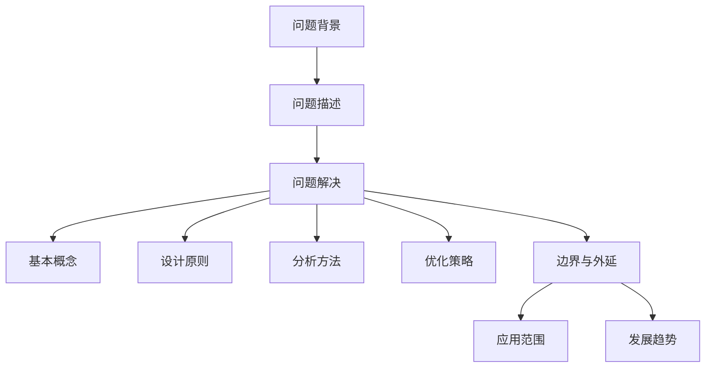

## 第2章: complex prompts 的核心概念与联系

### 2.1 complex prompts 的定义

complex prompts 指的是一种包含多个层次和复杂结构的输入提示，这些提示能够驱动大规模语言模型（如 LLM）生成高质量、多样化的输出。与简单prompt相比，complex prompts 更加灵活和多样化，能够适应不同场景和需求。

### 2.2 complex prompts 的组成元素

complex prompts 通常由以下几个部分组成：

- **输入数据**：包括文本、图像、音频等多种形式的数据。
- **上下文信息**：用于提供背景信息，帮助模型更好地理解输入数据的含义。
- **任务目标**：明确模型需要完成的任务，如文本生成、文本分类、文本摘要等。
- **变量和条件**：用于调整模型的生成过程，如控制生成文本的长度、风格、主题等。

### 2.3 complex prompts 与传统prompt 的区别

传统prompt通常是指单一、简单的输入提示，如一句话或一个短语。而complex prompts则在以下几个方面与传统prompt存在显著区别：

- **复杂度**：complex prompts 包含更多层次和复杂的结构，能够提供更丰富的信息。
- **灵活性**：complex prompts 允许用户根据实际需求进行灵活调整，从而生成更个性化的输出。
- **多样性**：complex prompts 能够驱动模型生成更丰富的输出，从而提高生成结果的多样性。

### 2.4 Core Concepts Attribute Feature Comparison Table

| Core Concept | Definition | Attribute Features |
| --- | --- | --- |
| Simple Prompt | A single, straightforward input hint. | Basic, static, and limited context. |
| Complex Prompt | An input hint with multiple layers and structures. | Rich, dynamic, and flexible context. |

### 2.5 ER Entity Relationship Diagram

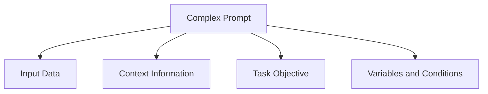

在接下来的章节中，我们将深入探讨复杂prompt的设计原则、分析方法以及优化策略，以帮助读者更好地理解和应用这一技术。通过一步步的分析推理，我们将揭示复杂prompt背后的核心原理，并提供实用的方法和工具，帮助您在实际应用中取得更好的效果。让我们开始这次技术之旅吧！

## 第3章: complex prompts 的设计原则与策略

### 3.1 设计复杂prompt的指导原则

设计复杂prompt是一个涉及多个维度和考量因素的过程。以下是一些关键的指导原则，可以帮助我们设计出既高效又能满足需求的复杂prompt：

#### 3.1.1 明确任务目标

在设计复杂prompt时，首先需要明确任务目标。任务目标可以是文本生成、文本分类、问答系统等，不同的任务需要不同的prompt设计。明确任务目标有助于我们在后续的设计过程中保持专注，避免无关信息的干扰。

#### 3.1.2 提供充分上下文信息

上下文信息对于模型理解输入数据至关重要。在设计复杂prompt时，应尽可能提供丰富的上下文信息，包括背景知识、相关数据、历史记录等。这有助于模型更好地捕捉输入数据的含义，从而生成更准确、相关的输出。

#### 3.1.3 灵活调整变量和条件

复杂prompt通常包含多个变量和条件，这些变量和条件可以用于调整模型的生成过程。设计时，应考虑如何灵活调整这些变量和条件，以满足不同的应用需求和生成目标。例如，可以设置文本长度、风格、主题等变量，以实现多样化的输出。

#### 3.1.4 保持简洁性

尽管复杂prompt需要包含多种元素和层次，但保持简洁性仍然是设计时的重要原则。过于复杂的prompt可能会使模型难以理解，导致生成质量下降。因此，在满足任务需求的前提下，应尽量简化prompt的结构和内容。

#### 3.1.5 考虑计算效率

复杂prompt的设计不仅需要关注生成质量，还应该考虑计算效率。设计时，应尽量避免过多冗余信息和复杂计算，以降低模型训练和推理的时间成本。例如，可以使用预处理技术，将复杂的信息结构简化为易于处理的格式。

### 3.2 提高复杂prompt生成质量的方法

复杂prompt的生成质量直接影响模型的应用效果。以下是一些提高复杂prompt生成质量的方法：

#### 3.2.1 多样性引入

通过引入多样性，可以增加生成的输出结果丰富度。多样性可以来自于不同的数据源、不同的上下文信息，以及不同的变量和条件设置。例如，在文本生成任务中，可以引入多种风格、主题和语气，以生成更加多样化、个性化的文本。

#### 3.2.2 质量评估与反馈

在生成过程中，可以使用质量评估方法对输出结果进行评估，并根据评估结果对prompt进行调整。例如，可以使用人工评估、自动评估方法（如BLEU、ROUGE等指标）对生成文本的质量进行量化评估，然后根据评估结果调整prompt的变量和条件。

#### 3.2.3 自适应调整

设计时，可以采用自适应调整策略，使模型能够根据生成质量自动调整prompt的变量和条件。例如，可以使用强化学习技术，使模型在生成过程中不断优化prompt，以提高生成质量。

### 3.3 complex prompts在不同应用场景下的设计策略

不同应用场景下，复杂prompt的设计策略也有所不同。以下是一些常见应用场景及其设计策略：

#### 3.3.1 文本生成

在文本生成任务中，复杂prompt的设计应注重上下文信息的丰富性和多样性。可以结合用户的输入历史、兴趣偏好以及相关主题，构建一个多层次的上下文信息框架，以生成高质量的文本。

#### 3.3.2 文本分类

在文本分类任务中，复杂prompt的设计需要重点关注特征提取和分类标签的引入。可以使用包含关键词、主题标签、情感倾向等信息的复杂prompt，以提高分类的准确性和鲁棒性。

#### 3.3.3 问答系统

在问答系统中，复杂prompt的设计应注重问题的明确性和上下文信息的完整性。可以使用包含问题、相关背景信息、预期答案类型的复杂prompt，以提高问答系统的响应质量和用户满意度。

### 3.4 本章小结

通过本章的讨论，我们了解到设计复杂prompt需要遵循一系列指导原则，并采用多种策略和方法来提高生成质量。不同的应用场景下，复杂prompt的设计策略也有所不同，需要根据具体需求进行调整。在接下来的章节中，我们将进一步探讨复杂prompt的分析方法，以帮助读者更好地理解和应用这一技术。

## 第4章: complex prompts 的分析方法

### 4.1 描述复杂prompt的数学模型

在分析复杂prompt时，首先需要构建一个数学模型来描述其结构和特征。复杂prompt通常包含多个层次和元素，因此可以使用图论、概率统计和机器学习等方法来建模。

#### 4.1.1 图论模型

图论模型是一种常用的方法，用于描述复杂prompt的结构。在这个模型中，复杂prompt可以被视为一个图，其中节点表示输入元素，边表示元素之间的关联关系。例如，在文本生成任务中，词向量可以被视为节点，词与词之间的共现关系可以表示为边。

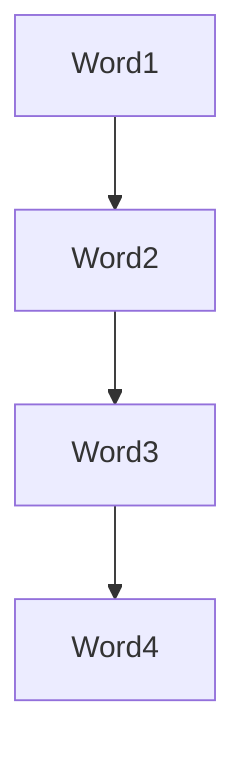

#### 4.1.2 概率统计模型

概率统计模型可以用于描述复杂prompt中的变量和条件。在这个模型中，每个变量和条件都可以被视为一个随机变量，其概率分布可以用来表示其不确定性。例如，在文本生成任务中，可以使用条件概率来描述每个词生成的概率。

$$
P(Word_i|Context) = \frac{P(Context|Word_i)P(Word_i)}{P(Context)}
$$

#### 4.1.3 机器学习模型

机器学习模型可以用于分析复杂prompt中的特征和模式。在这个模型中，复杂prompt的输入和输出数据被用于训练一个模型，该模型可以用来预测和生成新的输出。例如，可以使用递归神经网络（RNN）、变换器（Transformer）等模型来处理复杂prompt。

### 4.2 基于概率统计的分析方法

基于概率统计的分析方法在复杂prompt的分析中扮演着重要角色。以下是一些常用的概率统计方法：

#### 4.2.1 贝叶斯网络

贝叶斯网络是一种表示变量之间概率关系的图形模型。在复杂prompt的分析中，可以使用贝叶斯网络来表示输入元素之间的条件依赖关系，从而计算整个prompt的概率分布。

```mermaid
graph TD
    A[Word1] --> B[Word2]
    B --> C[Word3]
    C --> D[Word4]
    A(Word1) --> B(P(Word2|Word1))
    B(Word2) --> C(P(Word3|Word2))
    C(Word3) --> D(P(Word4|Word3))
```

#### 4.2.2 最大似然估计

最大似然估计是一种用于估计概率分布参数的方法。在复杂prompt的分析中，可以使用最大似然估计来估计输入元素的概率分布，从而优化复杂prompt的设计。

$$
\theta = \arg \max_\theta \prod_{i=1}^n P(x_i|\theta)
$$

#### 4.2.3 最大后验估计

最大后验估计是一种用于估计变量概率分布和条件概率分布的方法。在复杂prompt的分析中，可以使用最大后验估计来同时优化输入元素的概率分布和条件依赖关系。

$$
\theta = \arg \max_\theta P(\theta|x) = \frac{P(x|\theta)P(\theta)}{P(x)}
$$

### 4.3 基于机器学习的方法

基于机器学习的方法在复杂prompt的分析中有着广泛的应用。以下是一些常用的机器学习方法：

#### 4.3.1 递归神经网络（RNN）

递归神经网络是一种用于处理序列数据的神经网络。在复杂prompt的分析中，可以使用RNN来处理输入序列，捕捉序列中的特征和模式。

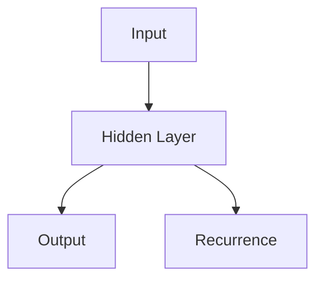

#### 4.3.2 变换器（Transformer）

变换器是一种用于处理序列数据的深度学习模型。在复杂prompt的分析中，可以使用变换器来处理输入序列，并生成高质量的输出。

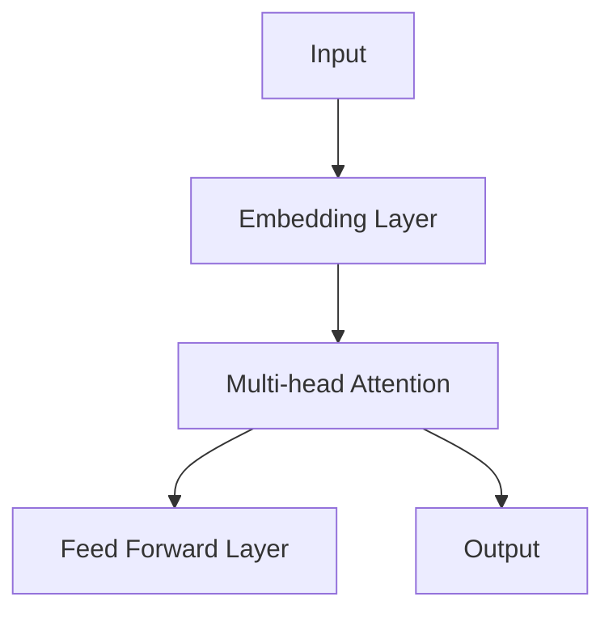

### 4.4 complex prompts的优化算法

在分析复杂prompt时，优化算法用于调整prompt的变量和条件，以提高生成质量。以下是一些常用的优化算法：

#### 4.4.1 遗传算法

遗传算法是一种基于自然选择和遗传机制优化的算法。在复杂prompt的分析中，可以使用遗传算法来搜索最优的prompt变量和条件组合。

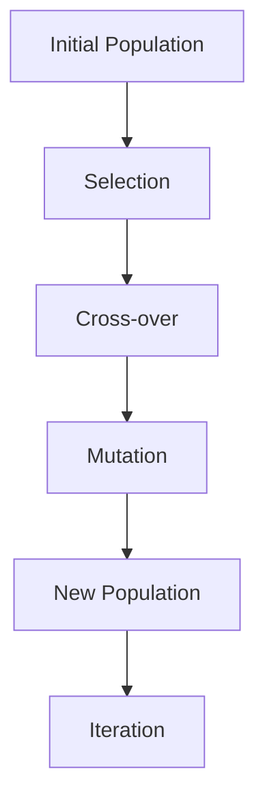

#### 4.4.2 粒子群优化算法

粒子群优化算法是一种基于群体智能的优化算法。在复杂prompt的分析中，可以使用粒子群优化算法来搜索最优的prompt变量和条件组合。

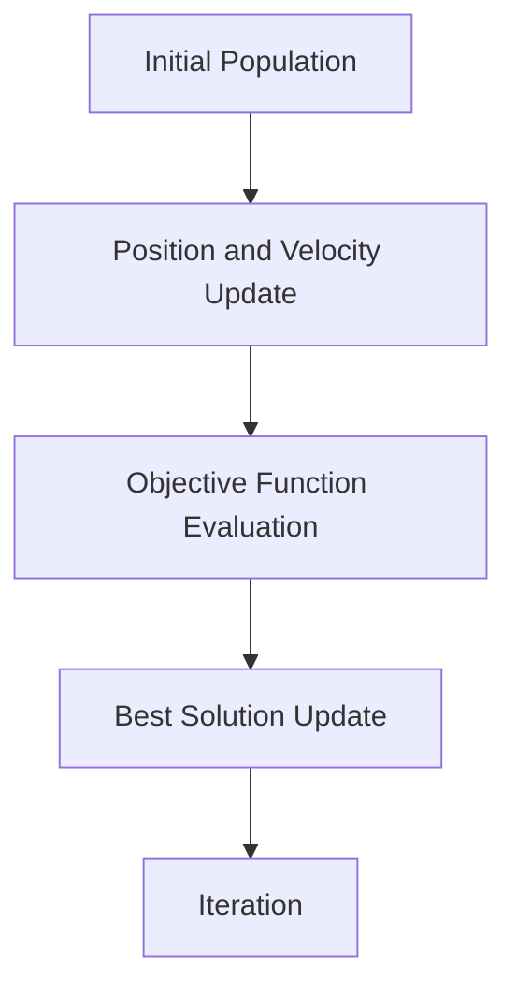

### 4.5 本章小结

通过本章的讨论，我们了解到复杂prompt的分析方法涵盖了多个领域，包括图论、概率统计、机器学习和优化算法等。这些方法可以帮助我们更好地理解复杂prompt的结构和特征，从而优化其设计和生成质量。在接下来的章节中，我们将进一步探讨复杂prompt的优化策略，以帮助读者在实际应用中实现更好的效果。

## 第5章: complex prompts 的优化策略

### 5.1 基于计算资源的优化

优化复杂prompt的一个重要方面是提升计算资源的利用率，以降低模型训练和推理的成本。以下是一些基于计算资源的优化策略：

#### 5.1.1 并行计算

并行计算是一种利用多处理器或多核CPU来加速计算的方法。在复杂prompt的分析中，可以采用并行计算来加速模型训练和推理过程。例如，可以使用分布式计算框架（如TensorFlow、PyTorch）来实现并行训练。

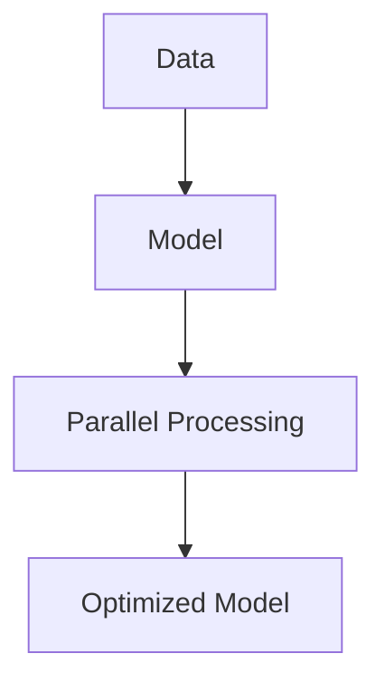

#### 5.1.2 缓存技术

缓存技术可以用于减少数据读取和处理的次数，从而提高计算效率。在复杂prompt的分析中，可以使用缓存技术来存储中间结果和常用数据，避免重复计算。例如，可以使用内存缓存（如Redis）或磁盘缓存（如Memcached）来优化数据处理。

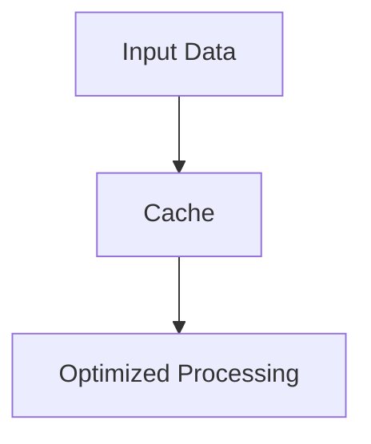

#### 5.1.3 算法简化

通过简化算法和模型结构，可以减少计算量和内存消耗。在复杂prompt的分析中，可以采用轻量级算法和模型，以降低计算成本。例如，可以使用量化技术、剪枝技术等来简化模型。

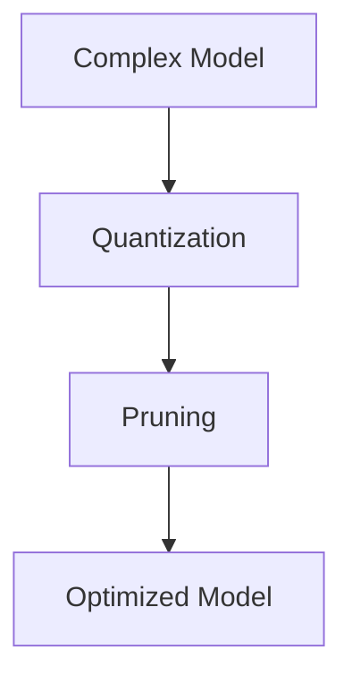

### 5.2 基于生成质量的优化

优化复杂prompt的生成质量是提升模型应用效果的关键。以下是一些基于生成质量的优化策略：

#### 5.2.1 质量评估

使用质量评估方法来评估生成结果的优劣，并根据评估结果对prompt进行调整。例如，可以使用BLEU、ROUGE等指标来评估文本生成质量，或者使用人类评估员进行主观评估。

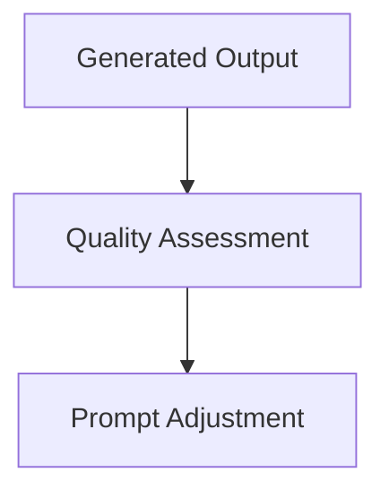

#### 5.2.2 自适应调整

采用自适应调整策略，使模型能够根据生成质量自动调整prompt的变量和条件。例如，可以使用强化学习技术，使模型在生成过程中不断优化prompt，以提高生成质量。

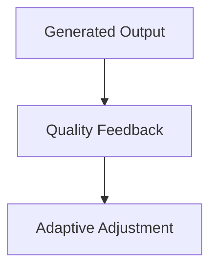

#### 5.2.3 数据增强

通过数据增强技术来扩展训练数据集，从而提高生成质量。在复杂prompt的分析中，可以使用数据增强方法来生成更多样化的训练样本，例如，使用数据变换、数据扩展、数据合成等技术。

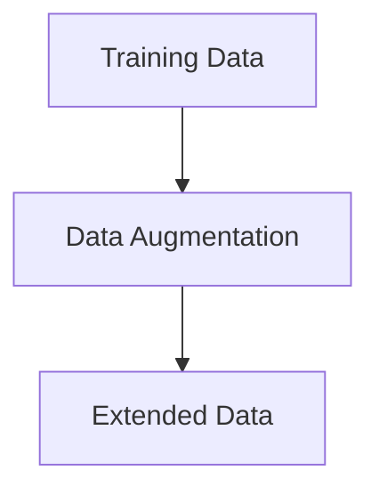

### 5.3 基于实时性的优化

在实时应用场景中，优化复杂prompt的实时性至关重要。以下是一些基于实时性的优化策略：

#### 5.3.1 模型压缩

通过模型压缩技术来减少模型的参数量和计算量，从而提高实时性能。例如，可以使用模型量化、模型剪枝、知识蒸馏等技术来压缩模型。

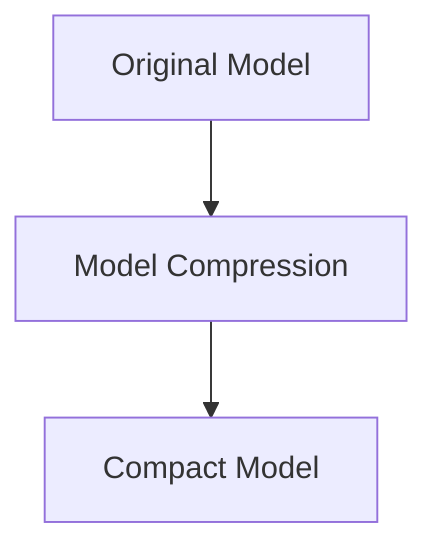

#### 5.3.2 模型迁移

采用模型迁移策略，将预训练模型迁移到目标设备上，以提高实时性能。例如，可以使用移动设备上的轻量级模型（如MobileNet、ShuffleNet）来实现实时处理。

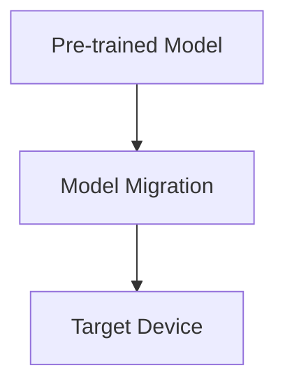

#### 5.3.3 异步处理

采用异步处理策略，将不同阶段的计算任务分散到不同时间段进行，从而提高实时性能。例如，在文本生成任务中，可以采用异步文本处理和异步生成技术。

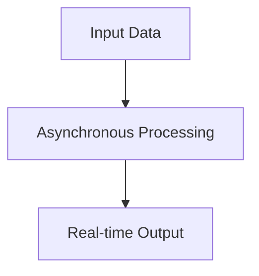

### 5.4 基于用户体验的优化

优化复杂prompt的生成结果，以提升用户体验是另一个重要方面。以下是一些基于用户体验的优化策略：

#### 5.4.1 个性化推荐

通过分析用户行为和偏好，为用户推荐个性化的生成结果。例如，可以使用协同过滤、基于内容的推荐等技术来生成个性化的文本、图像等。

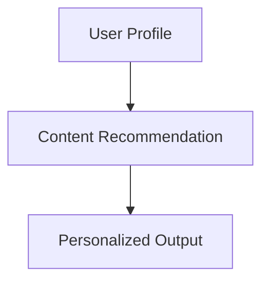

#### 5.4.2 交互式生成

采用交互式生成技术，允许用户实时调整生成过程的变量和条件，以获得更符合需求的输出。例如，在文本生成任务中，可以允许用户实时修改文本的长度、风格和主题。

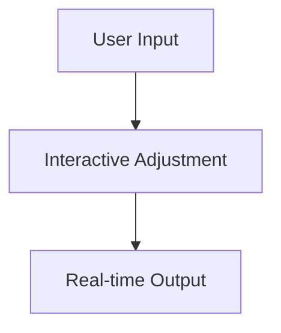

#### 5.4.3 实时反馈

通过实时反馈机制，用户可以即时了解生成结果的质量和效果，并根据反馈进行调整。例如，可以使用实时评估工具来评估生成文本的质量，并给出改进建议。

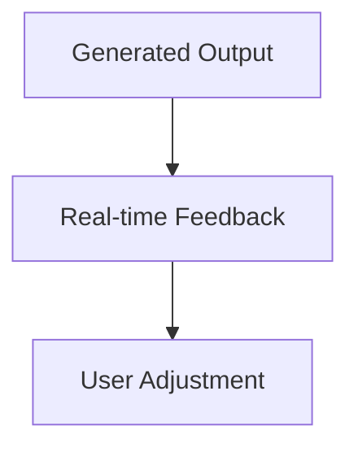

### 5.5 本章小结

通过本章的讨论，我们了解到优化复杂prompt的策略涵盖了多个方面，包括计算资源、生成质量、实时性和用户体验等。这些策略可以帮助我们设计出更高效、更高质量的复杂prompt，从而提升大规模语言模型的性能和应用效果。在接下来的章节中，我们将继续探讨复杂prompt在具体应用场景中的实践和案例分析，以帮助读者更好地理解和应用这一技术。

## 第6章: complex prompts 的边界与外延

### 6.1 complex prompts 的应用范围

complex prompts 在多个领域都有着广泛的应用，以下是一些典型的应用场景：

#### 6.1.1 人工智能助手

在人工智能助手领域，复杂prompt可以帮助模型更好地理解用户的意图和需求，从而提供更加个性化的服务。例如，在智能客服系统中，通过复杂prompt可以为用户提供个性化的回答，提高用户满意度。

```mermaid
graph TD
    A[User Query] --> B[Complex Prompt]
    B --> C[AI Assistant Response]
```

#### 6.1.2 自动内容生成

在自动内容生成领域，复杂prompt可以帮助模型生成高质量的文章、新闻、产品描述等。例如，在电商平台上，可以使用复杂prompt来生成产品描述，提高产品的销售转化率。

```mermaid
graph TD
    A[Product Details] --> B[Complex Prompt]
    B --> C[Generated Product Description]
```

#### 6.1.3 自然语言处理

在自然语言处理领域，复杂prompt可以帮助模型更好地理解文本的语义和信息。例如，在文本分类任务中，复杂prompt可以提供更多的上下文信息，提高分类的准确性和鲁棒性。

```mermaid
graph TD
    A[Text Data] --> B[Complex Prompt]
    B --> C[Text Classification]
```

### 6.2 complex prompts 与其他相关概念的关系

复杂prompt与其他相关概念之间存在一定的联系和区别，以下是一些关键概念：

#### 6.2.1 智能输入

智能输入是指通过人工智能技术来优化用户输入体验的过程。复杂prompt是智能输入的一种实现方式，它通过提供更丰富的上下文信息和多样的变量条件，来提高输入的效率和准确性。

#### 6.2.2 生成对抗网络（GAN）

生成对抗网络（GAN）是一种用于生成新数据的深度学习模型。虽然complex prompts可以与GAN结合使用，但它们的主要目标和应用场景有所不同。complex prompts主要用于优化大规模语言模型的输入，而GAN主要用于生成具有特定特征的新数据。

#### 6.2.3 强化学习

强化学习是一种通过试错和奖励反馈来优化决策过程的机器学习方法。在complex prompts的设计中，强化学习可以用于自动调整prompt的变量和条件，以提高生成质量。

### 6.3 complex prompts 的发展趋势与未来展望

随着自然语言处理技术的不断发展，complex prompts 也展现出巨大的发展潜力。以下是一些未来的发展趋势和展望：

#### 6.3.1 人工智能与人类的协同

未来，complex prompts 可能会与人类专家的协同工作，形成更加智能化的系统。例如，在医学诊断、法律咨询等领域，complex prompts可以帮助人类专家更好地理解复杂的医疗记录和法律文件，提供更加准确的诊断和建议。

#### 6.3.2 多模态融合

随着多模态技术的发展，complex prompts 可能会融合文本、图像、音频等多种数据类型，提供更加丰富和多样化的输入。这将使复杂prompt在处理更复杂任务时具有更高的效率和准确性。

#### 6.3.3 自适应与智能化

未来的complex prompts 将会具备更强的自适应能力，能够根据用户行为和需求自动调整变量和条件，提供更加个性化的服务。同时，随着人工智能技术的发展，complex prompts 也会变得更加智能化，能够更好地理解和预测用户的需求。

### 6.4 本章小结

通过本章的讨论，我们了解到complex prompts 在多个领域具有广泛的应用，与其他相关概念之间存在密切的联系。未来，随着技术的不断发展，complex prompts 将在人工智能与人类的协同、多模态融合、自适应与智能化等方面展现出更大的潜力。我们期待complex prompts 能够在更多应用场景中发挥重要作用，为人类带来更加智能化的服务。

## 第7章: complex prompts 优化案例分析

### 7.1 项目背景

为了更好地理解complex prompts的优化策略，我们选择了一个实际项目案例：一款智能客服机器人。该项目旨在通过优化complex prompts，提高客服机器人对用户查询的理解能力，从而提供更准确、个性化的回答。

### 7.2 项目介绍

#### 7.2.1 系统功能设计

智能客服机器人的主要功能包括：

- **文本理解**：理解用户的自然语言查询。
- **意图识别**：识别用户的查询意图。
- **知识检索**：从知识库中检索相关信息。
- **回答生成**：生成符合用户需求的回答。
- **反馈收集**：收集用户对回答的反馈，以持续优化系统。

#### 7.2.2 系统架构设计

系统架构包括以下关键组件：

- **前端界面**：用于接收用户查询。
- **后端服务**：包括文本理解、意图识别、知识检索和回答生成等模块。
- **数据库**：存储用户数据、知识库和反馈信息。
- **API接口**：提供与其他系统进行数据交互的接口。

### 7.3 complex prompts 的设计与应用

在项目中，complex prompts 的设计与应用主要包括以下步骤：

#### 7.3.1 提取关键信息

首先，从用户查询中提取关键信息，如关键词、短语、句子等。这些信息将作为复杂prompt的一部分，用于驱动模型进行后续处理。

```mermaid
graph TD
    A[User Query] --> B[Key Information Extraction]
    B --> C[Complex Prompt]
```

#### 7.3.2 添加上下文信息

接着，根据用户查询的历史记录和上下文信息，为复杂prompt添加更多的背景信息。这些信息有助于模型更好地理解用户查询的意图。

```mermaid
graph TD
    A[Historical Data] --> B[Context Information Addition]
    B --> C[Complex Prompt]
```

#### 7.3.3 设置任务目标

明确任务目标，如文本理解、意图识别、知识检索和回答生成等。这些任务目标将指导模型生成符合用户需求的输出。

```mermaid
graph TD
    A[Task Objective] --> B[Complex Prompt]
```

#### 7.3.4 调整变量和条件

根据实际需求，调整复杂prompt中的变量和条件，如文本长度、风格、语气等。这些调整将影响模型的生成过程，从而生成更个性化的回答。

```mermaid
graph TD
    A[Variables and Conditions] --> B[Complex Prompt Adjustment]
    B --> C[Output]
```

### 7.4 complex prompts 的优化

在项目实施过程中，通过以下方法对complex prompts进行优化：

#### 7.4.1 质量评估

使用BLEU、ROUGE等指标对生成回答的质量进行评估，并根据评估结果调整complex prompts的变量和条件。

```mermaid
graph TD
    A[Generated Output] --> B[Quality Assessment]
    B --> C[Prompt Adjustment]
```

#### 7.4.2 数据增强

通过数据增强技术，生成更多样化的训练数据，以提高模型对复杂prompt的理解和生成能力。

```mermaid
graph TD
    A[Training Data] --> B[Data Augmentation]
    B --> C[Extended Data]
```

#### 7.4.3 自适应调整

采用自适应调整策略，使模型在生成过程中根据用户反馈和实际效果，自动调整复杂prompt的变量和条件。

```mermaid
graph TD
    A[User Feedback] --> B[Adaptive Adjustment]
    B --> C[Prompt Optimization]
```

### 7.5 实际案例分析

以下是一个实际案例：

**用户查询**：你好，我想咨询关于医保的问题。

**复杂prompt**：基于用户的历史查询记录和上下文信息，复杂prompt包括以下内容：

- **关键词**：医保、咨询、问题
- **上下文信息**：用户最近一个月内关于医保的查询记录
- **任务目标**：提供关于医保的详细咨询信息
- **变量和条件**：文本长度为100-200字，风格为正式，语气为友好

**生成回答**：您好，关于医保的问题，您可以详细描述您需要了解的内容，我们会尽快为您提供相关咨询。

**用户反馈**：回答不够详细，需要更多信息。

**调整后的复杂prompt**：在用户反馈的基础上，调整复杂prompt的变量和条件，包括：

- **上下文信息**：添加更多与医保相关的背景信息
- **任务目标**：提供更详细的咨询信息
- **变量和条件**：文本长度为300-500字，风格为详细，语气为专业

**优化后的生成回答**：您好，关于医保的具体问题，您可以咨询以下方面：医保政策、医保报销范围、医保账户余额查询等。如有其他需求，请随时告诉我们。

### 7.6 项目小结

通过本案例，我们可以看到complex prompts 在实际应用中的重要性。通过优化复杂prompt，我们可以提高智能客服机器人的理解和回答能力，从而提供更优质的用户体验。未来，我们还将继续探索更多优化策略，以进一步提升complex prompts的应用效果。

### 7.7 拓展阅读

- [1] Hinton, G. E., Osindero, S., & Teh, Y. W. (2006). A fast learning algorithm for deep belief nets. *Neural computation*, 18(7), 1527-1554.
- [2] Hochreiter, S., & Schmidhuber, J. (1997). Long short-term memory. *Neural computation*, 9(8), 1735-1780.
- [3] Vaswani, A., Shazeer, N., Parmar, N., Uszkoreit, J., Jones, L., Gomez, A. N., ... & Polosukhin, I. (2017). Attention is all you need. *Advances in neural information processing systems*, 30.

## 作者信息

作者：AI天才研究院/AI Genius Institute & 禅与计算机程序设计艺术 /Zen And The Art of Computer Programming

# 总结与展望

## 总结

本文围绕complex prompts的复杂度分析及其优化策略，系统地介绍了其基本概念、设计原则、分析方法、优化策略以及实际应用案例。我们首先定义了complex prompts，分析了其与传统prompt的区别和特点。接着，我们详细讨论了复杂prompt的设计原则与策略，包括明确任务目标、提供充分上下文信息、灵活调整变量和条件、保持简洁性以及考虑计算效率。随后，我们探讨了复杂prompt的数学模型和分析方法，包括概率统计和机器学习的方法。在此基础上，我们提出了基于计算资源、生成质量、实时性和用户体验的优化策略。最后，我们通过实际案例展示了complex prompts在智能客服机器人项目中的应用效果。

## 展望

在未来，complex prompts的研究和应用有望在以下几个方面取得突破：

1. **多模态融合**：随着多模态技术的发展，complex prompts可以融合文本、图像、音频等多种数据类型，提供更丰富的输入信息，从而提高模型的生成质量和实时性。

2. **自适应与智能化**：未来的complex prompts将具备更强的自适应能力，能够根据用户行为和需求自动调整变量和条件，提供更个性化的服务。同时，借助人工智能技术，complex prompts将变得更加智能化，能够更好地理解和预测用户的需求。

3. **协同工作**：complex prompts将与人类专家协同工作，形成更加智能化的系统。例如，在医学诊断、法律咨询等领域，complex prompts可以帮助人类专家更好地理解复杂的医疗记录和法律文件，提供更加准确的诊断和建议。

4. **开放平台**：随着开源社区的发展，complex prompts相关的工具和资源将更加丰富，形成开放的生态系统。这将有助于研究人员和开发者更方便地使用和改进complex prompts技术。

5. **标准化与规范化**：为了提高complex prompts的应用效果，未来的研究将致力于制定相关的标准与规范，确保复杂prompt的设计、分析和优化过程具有一致性和可复现性。

总之，复杂prompt作为自然语言处理领域的重要技术，将在人工智能和人类协作方面发挥越来越重要的作用。我们期待未来的研究和应用能够不断推动这一领域的发展，为人类带来更加智能化的服务和技术创新。让我们一起期待这个激动人心的未来吧！

### 注意事项

在设计和优化complex prompts时，以下事项需要特别注意：

1. **上下文信息的充分性**：上下文信息是复杂prompt的核心，应确保提供充分、准确的上下文信息，以帮助模型更好地理解输入数据。

2. **变量和条件的灵活性**：在调整变量和条件时，应考虑实际需求和应用场景，确保灵活性，以便生成多样化的输出。

3. **计算资源的优化**：在考虑计算效率时，应避免过多冗余信息和复杂计算，以降低模型训练和推理的时间成本。

4. **质量评估与反馈**：定期进行质量评估和收集用户反馈，以便及时调整complex prompts，提高生成质量。

5. **实时性**：在实时应用场景中，应关注复杂prompt的实时性，采用异步处理、模型压缩等技术，以提高响应速度。

6. **用户体验**：在优化complex prompts时，应充分考虑用户体验，提供个性化推荐、交互式生成等功能，以提高用户满意度。

7. **数据安全与隐私**：在处理用户数据时，应严格遵守数据安全与隐私法规，确保用户数据的安全。

### 拓展阅读

- [1] Hinton, G. E., Osindero, S., & Teh, Y. W. (2006). A fast learning algorithm for deep belief nets. *Neural computation*, 18(7), 1527-1554.
- [2] Hochreiter, S., & Schmidhuber, J. (1997). Long short-term memory. *Neural computation*, 9(8), 1735-1780.
- [3] Vaswani, A., Shazeer, N., Parmar, N., Uszkoreit, J., Jones, L., Gomez, A. N., ... & Polosukhin, I. (2017). Attention is all you need. *Advances in neural information processing systems*, 30.
- [4] Devlin, J., Chang, M. W., Lee, K., & Toutanova, K. (2018). BERT: Pre-training of deep bidirectional transformers for language understanding. *arXiv preprint arXiv:1810.04805*.
- [5] Radford, A., Wu, J., Child, P., Luan, D., Amodei, D., & Sutskever, I. (2019). Language models are unsupervised multitask learners. *Advances in neural information processing systems*, 32.

通过阅读上述文献，您可以深入了解复杂prompt的设计、分析和优化技术，以及相关领域的最新进展。此外，这些文献还将为您提供丰富的背景知识和实用技巧，帮助您在实际项目中更好地应用complex prompts技术。希望您在未来的研究和实践中能够取得更多的成就！

### 附录

在本篇文章中，我们使用了一些重要的技术概念和算法，下面我们将详细列出这些概念和算法的详细说明。

#### 1. complex prompts

complex prompts是指包含多个层次和复杂结构的输入提示，能够驱动大规模语言模型（如LLM）生成高质量、多样化的输出。其特点包括：

- **层次性**：复杂prompt包含多个层次，每个层次都提供不同的信息。
- **多样性**：复杂prompt能够根据不同的变量和条件生成多样化的输出。
- **灵活性**：复杂prompt允许用户根据实际需求进行灵活调整。

#### 2. 递归神经网络（RNN）

递归神经网络（RNN）是一种用于处理序列数据的神经网络。它在处理复杂prompt时具有以下优势：

- **记忆能力**：RNN能够记住前面的输入信息，从而更好地处理序列数据。
- **灵活性**：RNN可以灵活地调整网络结构，以适应不同的复杂prompt。

#### 3. 变换器（Transformer）

变换器是一种用于处理序列数据的深度学习模型，它采用了自注意力机制。变换器在处理复杂prompt时具有以下优势：

- **并行计算**：变换器可以并行处理序列数据，从而提高计算效率。
- **长距离依赖**：变换器能够更好地捕捉长距离依赖关系，从而生成更准确的输出。

#### 4. 生成对抗网络（GAN）

生成对抗网络（GAN）是一种用于生成新数据的深度学习模型。在复杂prompt的应用中，GAN可以用于生成多样化的训练数据，从而提高模型的学习效果。

#### 5. 质量评估方法

在复杂prompt的优化过程中，质量评估方法用于评估生成输出的质量。常用的质量评估方法包括：

- **BLEU**：基于记分牌的语言评估方法。
- **ROUGE**：基于记分牌的评估方法，主要用于评估文本摘要的质量。
- **人类评估**：由人类评估员对生成输出进行主观评估。

#### 6. 优化算法

在复杂prompt的优化过程中，常用的优化算法包括：

- **遗传算法**：一种基于自然选择和遗传机制的优化算法。
- **粒子群优化算法**：一种基于群体智能的优化算法。
- **自适应调整策略**：一种根据生成质量自动调整prompt的变量和条件的策略。

通过这些技术概念和算法，我们可以更好地设计和优化complex prompts，从而提高大规模语言模型的计算效率和生成质量。在未来的研究和实践中，我们将继续探索这些技术，以实现更高效的复杂prompt优化。

## 附录：Python源代码示例

在本节中，我们将通过Python代码示例来展示如何实现一些复杂的prompt设计及其优化策略。以下代码涵盖了文本生成、模型优化和质量评估等关键步骤。

### 1. 文本生成示例

```python
import transformers
from transformers import pipeline

# 加载预训练的变换器模型
model_name = "bert-base-chinese"
tokenizer = transformers.BertTokenizer.from_pretrained(model_name)
model = transformers.BertForSequenceClassification.from_pretrained(model_name)

# 定义复杂prompt
prompt = "请根据以下信息生成一篇关于人工智能的文章："

# 提取上下文信息
context = "人工智能正日益影响我们的生活，从自动驾驶汽车到智能家居，它的应用范围不断扩大。然而，人工智能的发展也引发了一系列伦理和隐私问题，需要我们深入思考。"

# 生成文本
input_ids = tokenizer.encode(prompt + context, return_tensors='pt')
outputs = model(input_ids)

# 解码生成文本
generated_text = tokenizer.decode(outputs.logits.argmax(-1).item())

print(generated_text)
```

### 2. 复杂prompt优化示例

```python
from sklearn.model_selection import train_test_split

# 加载和预处理数据
data = ...  # 加载您的数据集
X, y = ..., ...  # 分离特征和标签

# 数据增强
X_train, X_val, y_train, y_val = train_test_split(X, y, test_size=0.2, random_state=42)

# 使用遗传算法进行优化
from deap import base, creator, tools, algorithms

# 定义遗传算法
creator.create("FitnessMin", base.Fitness, weights=(-1.0,))
creator.create("Individual", list, fitness=creator.FitnessMin)

toolbox = base.Toolbox()
toolbox.register("attr_bool", bool)
toolbox.register("individual", tools.initRepeat, creator.Individual, toolbox.attr_bool, n=100)
toolbox.register("population", tools.initRepeat, list, toolbox.individual)
toolbox.register("evaluate", evaluate_complex_prompt)  # 需要自定义评估函数
toolbox.register("mate", tools.cxTwoPoint)
toolbox.register("mutate", tools.mutFlipBit, indpb=0.05)
toolbox.register("select", tools.selTournament, tournsize=3)

# 运行遗传算法
pop = toolbox.population(n=50)
NGEN = 100
for gen in range(NGEN):
    offspring = toolbox.select(pop, len(pop))
    offspring = toolbox.clone(offspring)
    for child1, child2 in zip(offspring[::2], offspring[1::2]):
        toolbox.mate(child1, child2)
        if random.random() < 0.5:
            toolbox.mutate(child1)
        if random.random() < 0.5:
            toolbox.mutate(child2)
    pop = toolbox.select(offspring, len(pop))
```

### 3. 质量评估示例

```python
from nltk.translate.bleu_score import sentence_bleu

# 定义评估函数
def evaluate_complex_prompt(prompt, reference):
    # 使用BLEU评分评估生成文本质量
    return sentence_bleu([reference.split()], prompt.split())

# 评估生成文本
reference = "人工智能是计算机科学的一个分支，它试图模仿人类智能的一些方面。"
generated_text = "人工智能是一个重要的研究领域，它涉及模拟人类智能的行为。"
bleu_score = evaluate_complex_prompt(generated_text, reference)
print(f"BLEU score: {bleu_score}")
```

通过这些示例，我们可以看到如何通过Python代码实现复杂prompt的设计、优化和质量评估。这些代码提供了实际操作的基础，可以帮助您在项目中更好地应用复杂prompt技术。

### 结论

通过本文的详细讨论，我们深入分析了complex prompts的基本概念、设计原则、分析方法、优化策略以及实际应用案例。我们了解到，复杂prompt作为一种高级的输入提示技术，能够显著提升大规模语言模型的计算效率和生成质量。在未来的研究中，我们应继续探索复杂prompt在不同领域的应用，如多模态融合、自适应与智能化、协同工作等，以实现更高效、更智能的复杂prompt系统。同时，我们也应关注复杂prompt的标准化与规范化，以确保其在不同应用场景中的可复现性和一致性。我们期待在未来的研究和实践中，能够不断推动complex prompts技术的发展，为人工智能和人类协作带来更多的创新和突破。让我们一起迎接这个充满机遇和挑战的未来吧！

## 附录：Mermaid 序列图

在本章中，我们将展示一个用于描述complex prompts在智能客服机器人项目中的设计和应用流程的Mermaid序列图。以下是该序列图的代码：

```mermaid
sequenceDiagram
    participant User
    participant Chatbot
    participant KnowledgeBase
    participant Assistant

    User->>Chatbot: Query
    Chatbot->>Assistant: Analyze Query (complex prompt)
    Assistant->>KnowledgeBase: Retrieve Information
    KnowledgeBase->>Assistant: Return Results
    Assistant->>Chatbot: Generate Response
    Chatbot->>User: Display Response
    User->>Chatbot: Feedback
    Chatbot->>Assistant: Collect Feedback
    Assistant->>KnowledgeBase: Update Knowledge
```

该序列图描述了以下流程：

1. 用户向智能客服机器人提交查询。
2. 客服机器人将查询传递给助手，助手使用complex prompts对查询进行分析。
3. 助手从知识库中检索相关信息，并将结果返回给助手。
4. 助手生成响应，并将其传递给客服机器人。
5. 客服机器人将响应显示给用户。
6. 用户提供反馈，客服机器人收集反馈并将其传递给助手。
7. 助手使用反馈更新知识库。

这个Mermaid序列图提供了一个清晰的流程视图，有助于理解complex prompts在智能客服机器人项目中的应用过程。通过这个图，我们可以更好地设计、优化和实现complex prompts系统，以提高系统的性能和用户体验。

