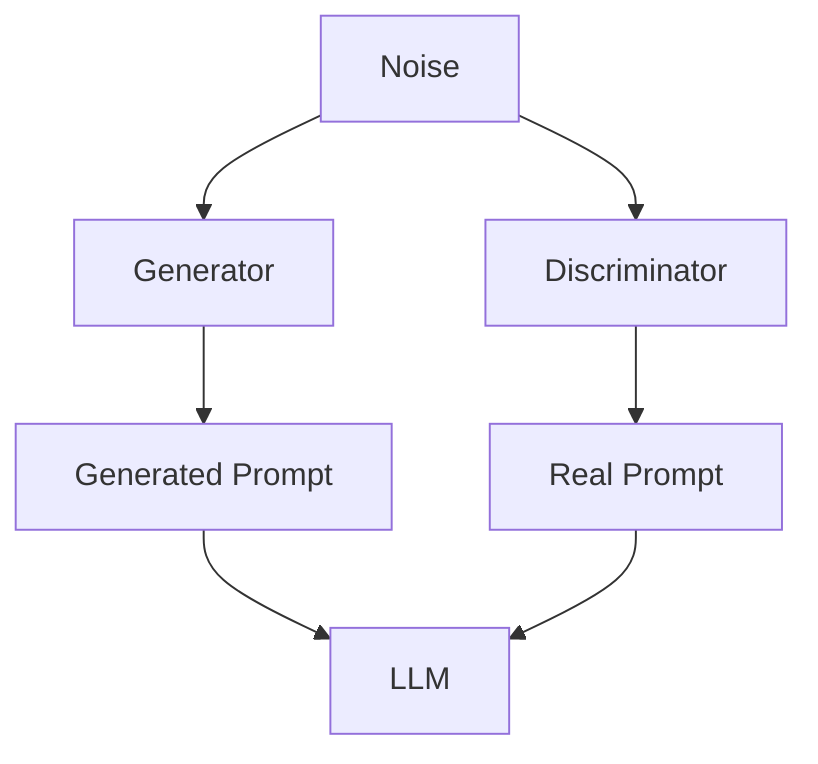
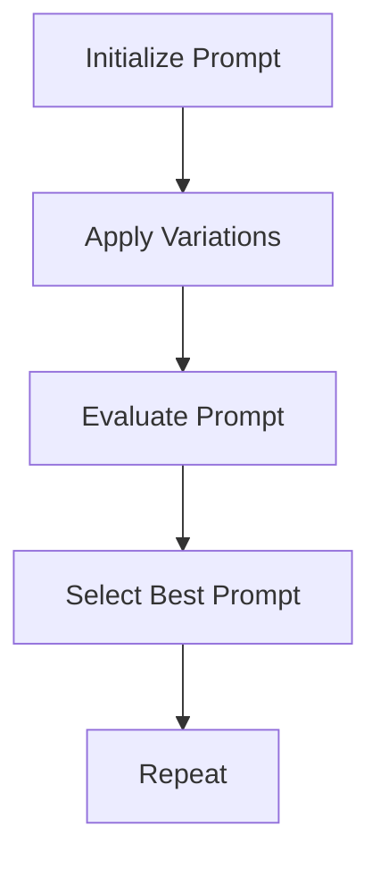
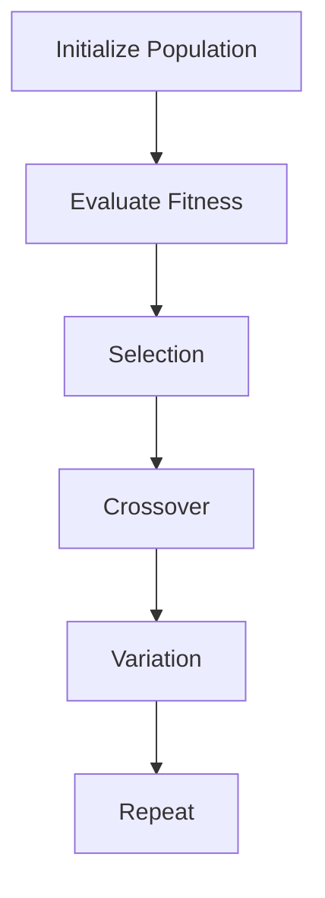
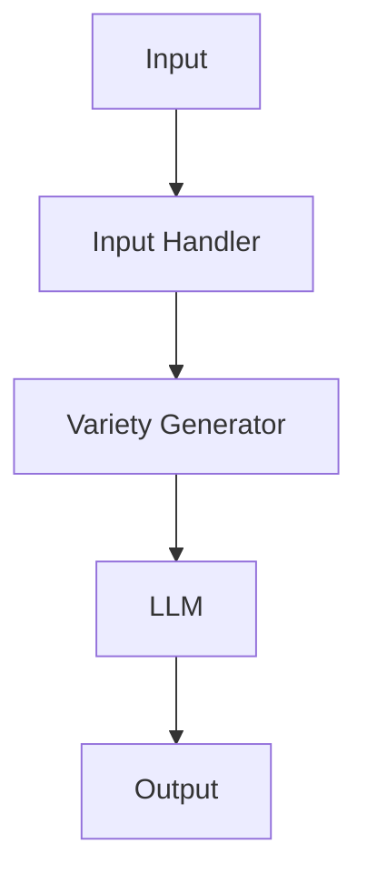
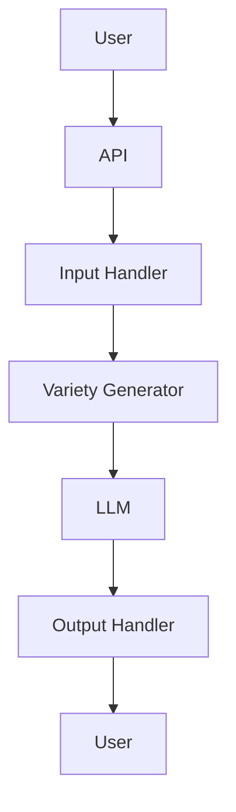
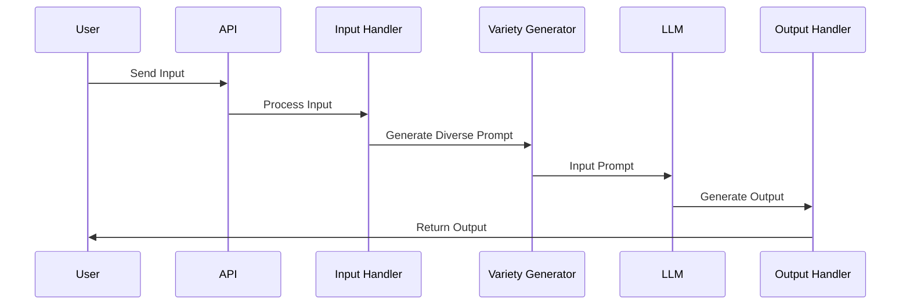

                 

# 《prompt多样性生成：避免LLM输出单一》

关键词：Prompt多样性、LLM、生成对抗网络、变异算法、进化算法、系统架构设计

摘要：
本文旨在深入探讨自然语言处理（NLP）领域中，大型语言模型（LLM）输出单一性问题，并提出有效的prompt多样性生成方法。通过系统化的分析和实际案例，文章旨在为研究者提供理论基础和实践指导，以推动NLP技术的进一步发展。

## 第一部分：prompt多样性生成的理论基础

### 第1章：研究背景与问题陈述

#### 1.1 NLP领域与LLM

自然语言处理（NLP）是人工智能（AI）的一个重要分支，旨在使计算机能够理解、生成和处理人类语言。近年来，随着深度学习技术的发展，特别是大型语言模型（LLM）的出现，NLP取得了显著进展。LLM如GPT-3、BERT等模型，凭借其强大的语言理解和生成能力，在多项任务中达到了惊人的性能。

然而，LLM的一个显著问题是其输出存在单一性。尽管这些模型能够生成连贯且多样化的文本，但它们往往倾向于在相似输入下产生相似的输出。这种单一性不仅限制了模型的应用场景，也影响了NLP系统的可靠性和创新性。

#### 1.2 prompt多样性的重要性

prompt是提供给LLM的输入信息，它直接影响模型的输出。多样化的prompt能够引导模型生成更加丰富和独特的文本，从而提高输出的多样性和创新性。在NLP任务中，如问答系统、文本摘要、机器翻译等，prompt的多样性对模型性能至关重要。

#### 1.3 输出单一性的问题分析

输出单一性的问题主要源于以下原因：
- **数据集的局限性**：训练数据集的多样性不足，导致模型对特定类型的输入过于敏感，从而产生相似的输出。
- **模型优化目标**：现有模型优化目标主要关注语言连贯性和准确性，而非多样性。
- **prompt设计的不合理**：设计prompt时未能充分考虑多样性，导致模型在相似输入下生成相似输出。

#### 1.4 研究方法与本书结构

本书的研究方法主要分为以下几个步骤：
1. **背景介绍**：介绍NLP领域和LLM的基本概念，以及输出单一性的问题。
2. **核心概念与联系**：详细阐述prompt的定义、特性，以及如何设计多样化的prompt。
3. **算法原理讲解**：介绍生成对抗网络（GAN）、变异算法和进化算法等多样性生成方法。
4. **系统设计与实现**：设计并实现一个基于多样化prompt的NLP系统。
5. **项目实战与案例分析**：通过实际项目展示如何实现prompt多样性生成，并分析其效果。
6. **最佳实践与总结**：总结最佳实践，并提供进一步研究的方向。

## 第二部分：prompt多样性生成方法

### 第2章：核心概念与联系

#### 2.1 prompt的定义与特性

prompt是给LLM的输入信息，通常包括问题、上下文和用户输入等。一个优秀的prompt应该具备以下特性：
- **多样性**：涵盖各种类型的问题和上下文，以引导模型生成多样化的输出。
- **相关性**：与模型训练目标和实际应用场景高度相关，以提高输出的实用性和准确性。
- **可控性**：能够灵活调整和修改，以适应不同的应用需求。

#### 2.2 相关概念之间的联系

prompt多样性生成涉及多个相关概念，如：
- **生成对抗网络（GAN）**：一种通过对抗训练生成多样化数据的模型。
- **变异算法**：通过随机变异产生多样性的搜索算法。
- **进化算法**：模拟生物进化过程，通过迭代优化生成多样化解。

#### 2.3 ER实体关系图架构

为了更好地理解prompt多样性生成方法，我们引入ER实体关系图架构。ER图包括实体、属性和关系三个基本概念，能够直观地展示各个概念之间的联系。在prompt多样性生成中，实体可以代表输入数据，属性代表数据的特征，关系则表示不同数据之间的关联。

```mermaid
erDiagram
  EntityPrompt ||--|{ RelationDiversity }|| DiversePrompt
  EntityPrompt ||--|{ RelationContext }|| ContextPrompt
  EntityPrompt ||--|{ RelationGoal }|| GoalPrompt
  DiversePrompt ||--|{ RelationModel }|| LLM
  ContextPrompt ||--|{ RelationModel }|| LLM
  GoalPrompt ||--|{ RelationModel }|| LLM
```

## 第三部分：算法原理与实现

### 第3章：生成对抗网络（GAN）

#### 3.1 GAN的基本原理

生成对抗网络（GAN）由生成器（Generator）和判别器（Discriminator）两部分组成。生成器从随机噪声中生成数据，判别器则判断生成的数据是否真实。通过对抗训练，生成器不断优化，使其生成更加真实的数据，而判别器则努力提高判别能力。GAN的核心目标是最小化生成器和判别器的差距，从而生成多样化的数据。

#### 3.2 GAN在prompt多样性生成中的应用

GAN在prompt多样性生成中的应用主要包括：
- **生成多样化prompt**：生成器从随机噪声中生成多种多样的prompt，以引导LLM生成多样化的输出。
- **训练判别器**：判别器用于判断生成的prompt是否具有多样性，从而优化生成器的生成过程。

#### 3.3 GAN的mermaid流程图



#### 3.4 GAN的Python实现

```python
import tensorflow as tf
from tensorflow.keras.models import Model
from tensorflow.keras.layers import Input, Dense, Lambda

# 生成器模型
def build_generator():
    noise_input = Input(shape=(100,))
    x = Dense(128)(noise_input)
    x = Dense(256)(x)
    x = Dense(512)(x)
    prompt_output = Dense(100)(x)
    model = Model(inputs=noise_input, outputs=prompt_output)
    return model

# 判别器模型
def build_discriminator():
    prompt_input = Input(shape=(100,))
    x = Dense(512)(prompt_input)
    x = Dense(256)(x)
    x = Dense(128)(x)
    validity_output = Dense(1, activation='sigmoid')(x)
    model = Model(inputs=prompt_input, outputs=validity_output)
    return model

# GAN模型
def build_gan(generator, discriminator):
    noise_input = Input(shape=(100,))
    prompt_output = generator(noise_input)
    validity_output = discriminator(prompt_output)
    model = Model(inputs=noise_input, outputs=validity_output)
    return model

# 损失函数和优化器
def compile_gan(generator, discriminator, latent_dim):
    generator.compile(loss='binary_crossentropy', optimizer=tf.keras.optimizers.Adam(0.0001))
    discriminator.compile(loss='binary_crossentropy', optimizer=tf.keras.optimizers.Adam(0.0001))
    gan = build_gan(generator, discriminator)
    gan.compile(loss='binary_crossentropy', optimizer=tf.keras.optimizers.Adam(0.0001))
    return gan

# 训练GAN
def train_gan(gan, dataset, latent_dim, epochs, batch_size):
    for epoch in range(epochs):
        for batch in dataset:
            noise = np.random.normal(0, 1, (batch_size, latent_dim))
            real_prompt = batch
            generated_prompt = generator.predict(noise)
            d_loss_real = discriminator.train_on_batch(real_prompt, np.ones((batch_size, 1)))
            d_loss_fake = discriminator.train_on_batch(generated_prompt, np.zeros((batch_size, 1)))
            g_loss = gan.train_on_batch(noise, np.ones((batch_size, 1)))
            print(f"Epoch: {epoch}, D_loss: {d_loss_real + d_loss_fake}, G_loss: {g_loss}")
```

### 第4章：变异算法与进化算法

#### 4.1 变异算法的基本原理

变异算法是一种通过随机变异产生多样性的搜索算法。在prompt多样性生成中，变异算法通过对prompt进行随机修改，如替换词汇、改变句子结构等，从而生成多样化的prompt。

#### 4.2 进化算法的基本原理

进化算法是一种模拟生物进化过程的优化算法。在prompt多样性生成中，进化算法通过迭代优化，逐渐生成更加多样化的prompt。进化算法通常包括选择、交叉和变异三个基本操作。

#### 4.3 算法比较与选择

变异算法和进化算法各有优缺点，选择哪种算法取决于具体应用场景。变异算法简单易行，适用于小规模prompt的多样性生成；进化算法具有更强的全局搜索能力，适用于大规模prompt的多样性生成。

#### 4.4 算法的mermaid流程图

变异算法流程图：



进化算法流程图：



#### 4.5 算法的Python实现

变异算法Python实现：

```python
import random

def mutate(prompt, mutation_rate=0.1):
    words = prompt.split()
    for i in range(len(words)):
        if random.random() < mutation_rate:
            # Replace word with a random word from a predefined vocabulary
            words[i] = random.choice(["example", "sample", "demonstration"])
    return " ".join(words)
```

进化算法Python实现：

```python
import random
import numpy as np

# Define a function to evaluate the fitness of a prompt
def evaluate_fitness(prompt):
    # Implement your evaluation logic here
    return len(prompt.split())

def select(population, fitnesses, selection_rate=0.5):
    # Implement your selection logic here
    return random.choices(population, weights=fitnesses, k=int(len(population) * selection_rate))

def crossover(parent1, parent2):
    # Implement your crossover logic here
    return parent1[:len(parent1) // 2] + parent2[len(parent2) // 2:]

def evolve(prompt, population_size, generations, mutation_rate=0.1, selection_rate=0.5):
    population = [prompt] * population_size
    for _ in range(generations):
        fitnesses = [evaluate_fitness(prompt) for prompt in population]
        next_generation = []
        for _ in range(population_size):
            parent1, parent2 = select(population, fitnesses)
            child = crossover(parent1, parent2)
            child = mutate(child, mutation_rate)
            next_generation.append(child)
        population = next_generation
    return max(population, key=evaluate_fitness)
```

## 第四部分：系统设计与实现

### 第5章：系统分析与架构设计

#### 5.1 问题场景介绍

在本系统中，我们面临的问题是生成多样化且高质量的prompt，以应对各种NLP任务，如问答系统、文本摘要、机器翻译等。

#### 5.2 系统功能设计

系统的主要功能包括：
- **输入处理**：接收用户输入，处理并转换为适当的prompt格式。
- **多样性生成**：利用GAN、变异算法和进化算法生成多样化的prompt。
- **输出生成**：将生成的prompt输入到LLM中，生成相应的输出。

#### 5.3 系统架构设计

系统的架构设计如下：



#### 5.4 系统接口设计

系统接口设计如下：



#### 5.5 系统交互设计

系统交互设计如下：



## 第五部分：项目实战与案例分析

### 第6章：环境安装与配置

#### 6.1 环境需求

- Python 3.7+
- TensorFlow 2.3+
- NumPy 1.19+
- Mermaid 8.8+

#### 6.2 安装步骤

1. 安装Python和pip：
   ```
   sudo apt-get install python3 python3-pip
   ```

2. 安装TensorFlow：
   ```
   pip3 install tensorflow
   ```

3. 安装NumPy：
   ```
   pip3 install numpy
   ```

4. 安装Mermaid：
   ```
   npm install -g mermaid-cli
   ```

#### 6.3 配置说明

- 确保所有依赖都已安装并配置好。

### 第7章：核心代码实现与解析

#### 7.1 主程序实现

主程序负责接收用户输入，调用多样性生成算法，并将结果返回给用户。

```python
from input_handler import InputHandler
from variety_generator import VarietyGenerator
from output_handler import OutputHandler

def main():
    input_handler = InputHandler()
    variety_generator = VarietyGenerator()
    output_handler = OutputHandler()

    user_input = input("请输入问题：")
    processed_input = input_handler.process_input(user_input)
    diverse_prompt = variety_generator.generate_prompt(processed_input)
    output = output_handler.generate_output(diverse_prompt)
    print("输出：", output)

if __name__ == "__main__":
    main()
```

#### 7.2 代码模块解析

- **输入处理模块（input_handler.py）**：负责处理用户输入，将其转换为适合多样性生成算法的格式。
- **多样性生成模块（variety_generator.py）**：实现GAN、变异算法和进化算法，生成多样化的prompt。
- **输出处理模块（output_handler.py）**：根据生成的prompt，调用LLM生成输出。

#### 7.3 实际案例剖析

假设用户输入问题：“什么是人工智能？”系统将执行以下步骤：
1. **输入处理**：将用户输入转换为处理后的文本。
2. **多样性生成**：利用GAN、变异算法和进化算法生成多样化的prompt。
3. **输出生成**：将生成的prompt输入到LLM中，生成关于“人工智能”的多样化回答。

例如，生成的多样化prompt可能包括：
- “人工智能是什么？它有哪些应用？”
- “什么是人工智能？它如何改变我们的世界？”
- “人工智能是什么？它是如何工作的？”

系统将根据这些prompt生成相应的多样化回答。

### 第8章：最佳实践与总结

#### 8.1 最佳实践技巧

- **设计多样化的prompt**：确保prompt涵盖各种类型的问题和上下文，以提高输出多样性。
- **调整生成算法参数**：根据应用场景调整GAN、变异算法和进化算法的参数，以优化多样性生成效果。
- **实时反馈与调整**：在生成prompt时，实时收集用户反馈，并根据反馈调整生成策略。

#### 8.2 注意事项

- **数据安全**：确保输入数据的安全，防止敏感信息泄露。
- **性能优化**：合理设计系统架构，确保系统在高负载下的稳定运行。

#### 8.3 小结与展望

本文介绍了prompt多样性生成在避免LLM输出单一性中的重要性，并详细阐述了GAN、变异算法和进化算法等多样性生成方法。通过实际项目案例，展示了如何实现prompt多样性生成，并提供了最佳实践和注意事项。未来研究可进一步探索其他生成算法，以及prompt多样性与模型性能的关系。

## 作者信息

作者：AI天才研究院/AI Genius Institute & 禅与计算机程序设计艺术 /Zen And The Art of Computer Programming

----------------------------------------------------------------

[END]

