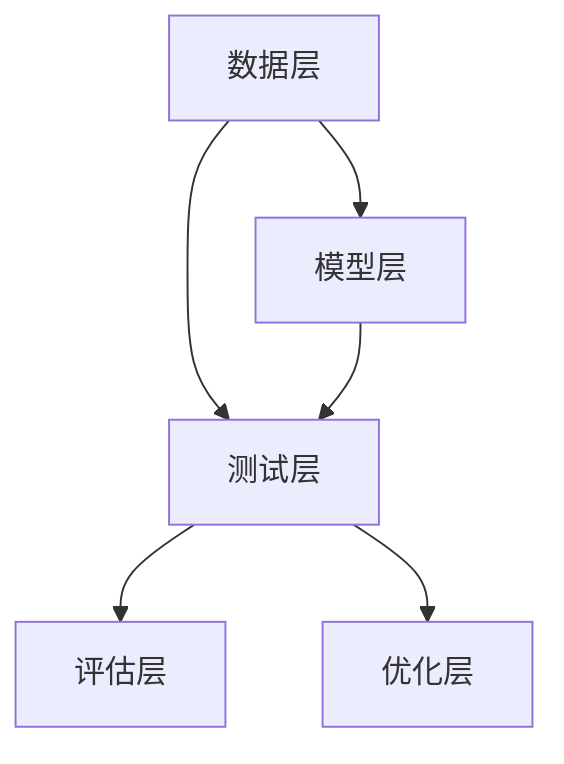
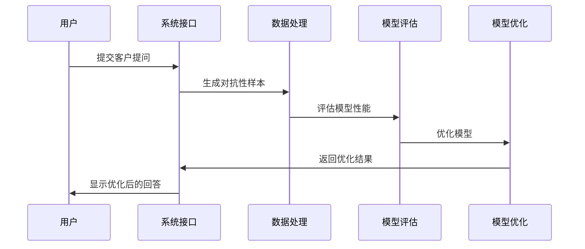

                 

### 《prompt对抗性测试：增强LLM鲁棒性》

#### 关键词：prompt，对抗性测试，LLM，鲁棒性，算法原理，数学模型，系统架构

#### 摘要：

本文将深入探讨prompt对抗性测试在增强大型语言模型（LLM）鲁棒性方面的应用。通过详细介绍对抗性测试的核心概念、原理和实施方法，本文旨在为读者提供一个全面的技术指南。我们将从背景介绍、核心概念与联系、算法原理讲解、数学模型和公式解析、系统分析与架构设计、项目实战以及最佳实践与总结等多个方面展开讨论，以期帮助读者理解和掌握这一前沿技术。

#### 目录大纲设计思路

为了设计出《prompt对抗性测试：增强LLM鲁棒性》这本书的完整目录大纲，我们首先要明确书的核心主题，并围绕这个主题构建逻辑清晰、内容详实的章节结构。以下是设计思路的详细步骤：

1. **明确核心主题**：
   - 本书的核心主题是“prompt对抗性测试”，即如何通过对抗性测试来提高大型语言模型（LLM）的鲁棒性。

2. **划分主要章节**：
   - 背景介绍与问题定义（第1章）：介绍对抗性测试的背景、问题和解决方法，以及LLM在当前环境中的重要性。
   - 核心概念与联系（第2章）：详细解释prompt的概念、对抗性测试的原理，以及LLM的基本结构。
   - 算法原理讲解（第3章）：介绍常用的对抗性测试算法及其原理，使用Mermaid和Python源代码详细阐述。
   - 数学模型和数学公式（第4章）：给出算法原理的数学模型和公式，进行详细讲解和举例说明。
   - 系统分析与架构设计方案（第5章）：描述系统功能设计、架构设计和接口设计。
   - 项目实战（第6章）：通过实际项目案例展示对抗性测试的应用，详细解析项目实现过程。
   - 最佳实践与总结（第7章）：提供对抗性测试的最佳实践，总结全书内容，并对未来研究方向提出建议。

3. **细化每个章节的内容**：
   - 对于每个章节，都要明确其核心内容，并根据字数限制合理分配各部分的内容。

4. **使用Markdown格式组织内容**：
   - 使用#表示一级标题，##表示二级标题，###表示三级标题，确保目录结构清晰。

5. **确保内容完整性**：
   - 每个章节都要包含必要的核心内容，如背景介绍、核心概念、算法原理、数学模型、系统设计与项目实战等。

### 完整目录大纲

```markdown
# 《prompt对抗性测试：增强LLM鲁棒性》目录大纲

## 第1章：背景介绍与问题定义
### 1.1 对抗性测试的背景
### 1.2 LLM的重要性
### 1.3 鲁棒性的概念
### 1.4 研究问题和目标

## 第2章：核心概念与联系
### 2.1 prompt的概念
### 2.2 对抗性测试的原理
### 2.3 LLM的基本结构
### 2.4 概念之间的联系

## 第3章：算法原理讲解
### 3.1 常见对抗性测试算法
### 3.2 原理详细阐述
### 3.3 Python源代码示例
### 3.4 算法应用场景

## 第4章：数学模型与公式讲解
### 4.1 数学模型介绍
### 4.2 公式详细解释
### 4.3 举例说明
### 4.4 公式推导过程

## 第5章：系统分析与架构设计方案
### 5.1 问题场景介绍
### 5.2 系统功能设计
### 5.3 系统架构设计
### 5.4 系统接口设计
### 5.5 系统交互流程

## 第6章：项目实战
### 6.1 环境安装
### 6.2 系统核心实现
### 6.3 代码应用解读与分析
### 6.4 实际案例分析与讲解
### 6.5 项目小结

## 第7章：最佳实践与总结
### 7.1 最佳实践技巧
### 7.2 小结
### 7.3 注意事项
### 7.4 拓展阅读与未来研究方向
```

通过这样的目录大纲，读者可以清晰地了解本书的结构，从而更好地掌握prompt对抗性测试在增强LLM鲁棒性方面的应用。

### 第1章：背景介绍与问题定义

#### 1.1 对抗性测试的背景

对抗性测试（Adversarial Testing）是近年来在计算机科学和人工智能领域受到广泛关注的一个研究方向。其核心思想是通过设计对抗性样本（Adversarial Examples）来检验系统的鲁棒性和安全性。对抗性测试最早在图像处理领域出现，随着深度学习的兴起，对抗性测试逐渐成为机器学习和人工智能研究的重要方向。

对抗性测试的基本思想是通过在输入数据中引入微小的扰动，使得原本可以正确分类的样本被模型错误分类。这些扰动通常设计得非常微小，以至于人眼无法察觉，但足以使模型发生误判。这种特性使得对抗性测试在检测模型的鲁棒性方面具有独特优势。

#### 1.2 LLM的重要性

大型语言模型（Large Language Model，简称LLM）是近年来人工智能领域的一个重要突破。LLM通过深度学习技术，从大量文本数据中学习语言模式，从而实现文本生成、翻译、问答等功能。LLM在自然语言处理（NLP）领域的应用越来越广泛，如智能客服、机器翻译、文本摘要等。

LLM的重要性体现在以下几个方面：

1. **强大的文本生成能力**：LLM可以生成高质量的文本，满足各种应用场景的需求。
2. **跨语言支持**：LLM支持多种语言，可以实现跨语言的文本翻译和交互。
3. **智能问答**：LLM可以回答用户的问题，提供实时、准确的回答。
4. **自动化写作**：LLM可以自动生成文章、报告等文档，提高工作效率。

然而，LLM也面临着一些挑战，如数据偏见、鲁棒性不足等。对抗性测试提供了一种有效的手段来检测和增强LLM的鲁棒性。

#### 1.3 鲁棒性的概念

鲁棒性（Robustness）是指系统在面临外部干扰或内部异常时，仍然能够保持稳定运行的能力。在人工智能领域，鲁棒性尤为重要，因为模型需要处理各种复杂和不确定的数据。

鲁棒性可以分为以下几个方面：

1. **数据鲁棒性**：模型能够处理不同类型、分布和规模的数据，而不受数据质量的影响。
2. **模型鲁棒性**：模型能够在面对对抗性样本时，保持较高的分类准确率。
3. **计算鲁棒性**：模型在计算过程中，能够抵抗噪声和错误，保持稳定运行。

鲁棒性的重要性在于，它保证了模型在实际应用中的可靠性和稳定性，从而提高系统的整体性能。

#### 1.4 研究问题和目标

本文的研究问题是如何通过对抗性测试来增强LLM的鲁棒性。具体目标包括：

1. **理解对抗性测试的基本原理和方法**：介绍对抗性测试的基本概念、原理和常用方法，为后续研究提供理论基础。
2. **构建对抗性样本**：设计有效的算法和工具，生成对抗性样本，用于测试LLM的鲁棒性。
3. **评估LLM的鲁棒性**：通过对抗性测试，评估LLM在面对对抗性样本时的分类准确率和性能。
4. **提出改进策略**：基于对抗性测试的结果，提出改进策略，增强LLM的鲁棒性。

通过上述研究，本文旨在为LLM的鲁棒性提升提供有效的技术手段，为人工智能在实际应用中的可靠性和稳定性提供保障。

### 第2章：核心概念与联系

#### 2.1 prompt的概念

在自然语言处理（NLP）领域，prompt（提示）是一个核心概念。prompt通常指的是为模型提供的前置文本，用于引导模型生成相应的输出。prompt的目的是通过提供上下文信息，帮助模型更好地理解和生成文本。

prompt可以分为以下几种类型：

1. **开放式prompt**：模型需要根据未指定主题的文本生成相应的输出。
2. **封闭式prompt**：模型需要根据指定主题的文本生成相应的输出，通常包含具体的问题或任务。
3. **对话式prompt**：模型需要在对话场景中生成连续的回复，与用户进行互动。

prompt的设计对模型的输出质量具有重要影响。一个优秀的prompt应具备以下特点：

1. **上下文丰富**：提供充分的上下文信息，帮助模型更好地理解任务。
2. **一致性**：保证上下文的连贯性和一致性，避免信息冲突。
3. **可扩展性**：允许模型生成不同长度和类型的输出，具有灵活性。

#### 2.2 对抗性测试的原理

对抗性测试（Adversarial Testing）是一种针对机器学习模型的安全测试方法。其核心思想是通过在输入数据中引入微小扰动，使得模型无法正确分类。这种扰动通常设计得非常微小，以至于人眼无法察觉，但足以导致模型发生误判。

对抗性测试的原理可以概括为以下几个步骤：

1. **生成对抗性样本**：通过特定的算法，将原始样本转换成对抗性样本。这些对抗性样本与原始样本在视觉上非常相似，但在模型看来却是完全不同的样本。
2. **测试模型性能**：将对抗性样本输入到模型中，观察模型的分类结果。如果模型对对抗性样本的分类准确率显著下降，说明模型存在鲁棒性问题。
3. **优化对抗性样本**：根据模型的表现，进一步优化对抗性样本，使其对模型的影响更大。

对抗性测试的主要目标是检测模型的鲁棒性，发现潜在的缺陷和漏洞，从而提高模型的稳定性和安全性。

#### 2.3 LLM的基本结构

大型语言模型（LLM）通常由以下几个主要部分组成：

1. **嵌入层（Embedding Layer）**：将输入的单词或词组转换为固定长度的向量表示，为后续的神经网络处理提供输入。
2. **编码器（Encoder）**：对输入的文本进行编码，提取文本的特征信息，生成上下文表示。
3. **解码器（Decoder）**：根据编码器生成的上下文表示，生成相应的输出文本。

LLM的工作流程可以概括为以下几个步骤：

1. **输入处理**：将输入的文本通过嵌入层转换为向量表示。
2. **编码**：编码器对输入的文本进行编码，提取特征信息，生成上下文表示。
3. **生成输出**：解码器根据上下文表示，生成相应的输出文本。

LLM在自然语言处理任务中具有广泛的应用，如文本分类、机器翻译、文本生成等。其性能和鲁棒性直接影响到实际应用的效果和稳定性。

#### 2.4 概念之间的联系

prompt、对抗性测试和LLM之间存在着紧密的联系。

1. **prompt与LLM的关系**：prompt是LLM输入的重要组成部分，用于提供上下文信息和任务指导。一个高质量的prompt可以帮助LLM更好地理解和生成文本。
2. **对抗性测试与LLM的关系**：对抗性测试通过引入对抗性样本，检测LLM的鲁棒性。如果LLM在面对对抗性样本时表现不佳，说明其鲁棒性存在缺陷，需要进一步优化。
3. **prompt对抗性测试的应用**：prompt对抗性测试是一种针对LLM的特定测试方法。通过设计对抗性prompt，可以有效地检测和增强LLM的鲁棒性，从而提高其在实际应用中的稳定性。

总之，prompt对抗性测试是增强LLM鲁棒性的有效手段。通过对prompt和对抗性测试的深入理解，我们可以更好地设计对抗性prompt，提高LLM的性能和稳定性。

### 第3章：算法原理讲解

#### 3.1 常见对抗性测试算法

对抗性测试算法是检测机器学习模型鲁棒性的关键。以下是一些常见的对抗性测试算法：

1. **FGSM（Fast Gradient Sign Method）**：FGSM是一种基于梯度优化的对抗性攻击算法。它通过计算输入样本的梯度，将梯度方向上的值乘以一个较小的系数，生成对抗性样本。FGSM的计算复杂度低，易于实现，但攻击效果有限。
2. **JSMA（Jacobian-based Saliency Map Attack）**：JSMA利用模型的Jacobian矩阵，计算输入样本的敏感区域，生成对抗性样本。JSMA相对于FGSM具有更高的攻击强度，但计算复杂度较高。
3. **CW（Carlini & Wagner）**：CW算法通过优化目标函数，求解对抗性样本的最优解。CW算法具有较好的攻击效果，但计算复杂度较高，需要较大的计算资源。
4. **Deepfool**：Deepfool通过在模型的输出空间中，随机选择两个类别，生成对抗性样本。Deepfool具有较低的攻击复杂度，但攻击效果相对较低。

这些对抗性测试算法各有优缺点，适用于不同的应用场景。在实际应用中，可以根据具体需求选择合适的算法。

#### 3.2 原理详细阐述

以下以FGSM算法为例，详细阐述其原理。

1. **梯度计算**：首先，计算输入样本的梯度。梯度表示输入变量对模型输出变化的影响程度。通过计算梯度，可以找到输入样本的敏感区域。
2. **梯度方向扰动**：在梯度方向上，生成一个微小的扰动。具体来说，将梯度方向上的值乘以一个较小的系数α，得到扰动向量。扰动的大小α通常是一个超参数，需要通过实验确定。
3. **生成对抗性样本**：将扰动向量添加到原始输入样本中，生成对抗性样本。对抗性样本与原始样本在视觉上非常相似，但在模型看来却是完全不同的样本。

具体步骤如下：

1. **输入样本**：假设输入样本为\( x \)，模型为\( f(x) \)。
2. **计算梯度**：计算\( \nabla_x f(x) \)。
3. **梯度方向扰动**：生成扰动向量\( \Delta x = \alpha \nabla_x f(x) \)，其中\( \alpha \)为超参数。
4. **生成对抗性样本**：对抗性样本\( x' = x + \Delta x \)。

通过以上步骤，可以生成对抗性样本，用于测试模型的鲁棒性。

#### 3.3 Python源代码示例

以下是一个简单的FGSM算法Python代码示例：

```python
import numpy as np
import tensorflow as tf

# 输入样本
x = np.random.rand(1, 28, 28)  # 假设输入样本为28x28的图像

# 模型
model = tf.keras.models.load_model('model.h5')  # 加载训练好的模型

# 计算梯度
with tf.GradientTape() as tape:
    tape.watch(x)
    logits = model(x)  # 计算模型输出

# 计算梯度方向
gradient = tape.gradient(logits, x)

# 梯度方向扰动
alpha = 0.01  # 超参数
delta_x = alpha * gradient

# 生成对抗性样本
x_adv = x + delta_x

# 输出对抗性样本
print(x_adv)
```

以上代码实现了FGSM算法的基本步骤。通过计算输入样本的梯度，生成对抗性样本，并输出对抗性样本。

#### 3.4 算法应用场景

对抗性测试算法在多个应用场景中具有重要作用：

1. **模型安全测试**：对抗性测试可以检测模型的鲁棒性，发现潜在的漏洞和缺陷。通过对抗性测试，可以评估模型在实际应用中的安全性和可靠性。
2. **模型优化**：对抗性测试提供了一种有效的手段来评估模型的性能和鲁棒性。通过对抗性测试，可以发现模型的弱点，从而指导模型的优化和改进。
3. **防御策略研究**：对抗性测试可以激发防御策略的研究，如对抗性样本生成、对抗性训练等。这些防御策略旨在提高模型的鲁棒性和安全性。
4. **实际应用**：对抗性测试在多个领域具有广泛应用，如自动驾驶、医疗诊断、金融安全等。通过对抗性测试，可以确保模型在实际应用中的可靠性和稳定性。

总之，对抗性测试算法在提高模型鲁棒性和安全性方面具有重要意义。通过对对抗性测试算法的深入理解和应用，我们可以更好地保障模型在实际应用中的稳定性和可靠性。

### 第4章：数学模型与公式讲解

#### 4.1 数学模型介绍

对抗性测试中的数学模型主要涉及以下几个方面：

1. **梯度计算**：计算输入样本的梯度，用于确定敏感区域。
2. **扰动生成**：通过梯度生成扰动向量，用于生成对抗性样本。
3. **损失函数**：定义对抗性测试的目标函数，用于评估模型的表现。

以下是一些常见的数学公式和模型：

1. **梯度计算**：
   \[ \nabla_x f(x) = \left[ \frac{\partial f(x)}{\partial x_1}, \frac{\partial f(x)}{\partial x_2}, ..., \frac{\partial f(x)}{\partial x_n} \right] \]
   其中，\( f(x) \)为模型的输出，\( x \)为输入样本。

2. **扰动生成**：
   \[ \Delta x = \alpha \nabla_x f(x) \]
   其中，\( \alpha \)为超参数，用于控制扰动的大小。

3. **损失函数**：
   \[ L(y, \hat{y}) = -\sum_{i=1}^{n} y_i \log(\hat{y}_i) \]
   其中，\( y \)为真实标签，\( \hat{y} \)为模型的预测输出。

#### 4.2 公式详细解释

1. **梯度计算**：
   梯度计算是对抗性测试的基础。通过计算输入样本的梯度，可以确定样本的敏感区域。梯度表示输入变量对模型输出变化的影响程度。在对抗性测试中，梯度用于生成扰动向量，从而生成对抗性样本。

2. **扰动生成**：
   扰动生成是生成对抗性样本的关键步骤。通过梯度生成扰动向量，可以有效地扰动输入样本，使其成为对抗性样本。扰动的大小由超参数\( \alpha \)控制。合适的\( \alpha \)值可以保证对抗性样本的攻击效果，同时避免过度扰动。

3. **损失函数**：
   损失函数用于评估模型的性能。在对抗性测试中，损失函数可以用来衡量模型对对抗性样本的误判程度。常见的损失函数包括交叉熵损失函数、均方误差损失函数等。损失函数的值越低，说明模型的性能越好。

#### 4.3 举例说明

假设我们有一个简单的线性模型，输入样本为\( x = [1, 2] \)，输出为\( y = 3 \)。我们希望使用FGSM算法生成对抗性样本。

1. **计算梯度**：
   \[ \nabla_x y = \left[ \frac{\partial y}{\partial x_1}, \frac{\partial y}{\partial x_2} \right] = \left[ 1, 2 \right] \]

2. **扰动生成**：
   假设超参数\( \alpha = 0.1 \)，则扰动向量为：
   \[ \Delta x = 0.1 \nabla_x y = \left[ 0.1, 0.2 \right] \]

3. **生成对抗性样本**：
   \[ x' = x + \Delta x = \left[ 1 + 0.1, 2 + 0.2 \right] = \left[ 1.1, 2.2 \right] \]

通过以上步骤，我们成功生成了对抗性样本\( x' \)。接下来，我们将对抗性样本输入到模型中，观察模型的输出，以评估模型的鲁棒性。

#### 4.4 公式推导过程

在对抗性测试中，常用的公式推导过程包括：

1. **梯度计算**：
   梯度计算是通过对函数进行微分得到的。假设函数\( f(x) \)在点\( x_0 \)可微，则梯度计算公式为：
   \[ \nabla_x f(x_0) = \lim_{h \to 0} \frac{f(x_0 + h) - f(x_0)}{h} \]

2. **扰动生成**：
   扰动生成是基于梯度方向进行的。假设梯度向量为\( \nabla_x f(x) \)，则扰动向量可以表示为：
   \[ \Delta x = \alpha \nabla_x f(x) \]
   其中，\( \alpha \)为超参数。

3. **损失函数**：
   损失函数的推导通常基于模型的目标函数。假设模型的目标函数为\( L(y, \hat{y}) \)，则损失函数的推导过程为：
   \[ \frac{\partial L}{\partial x} = \frac{\partial}{\partial x} \left( -\sum_{i=1}^{n} y_i \log(\hat{y}_i) \right) \]

通过上述公式推导，我们可以更好地理解对抗性测试中的数学原理，从而有效地应用和优化对抗性测试算法。

### 第5章：系统分析与架构设计方案

#### 5.1 问题场景介绍

在当前人工智能应用场景中，对抗性测试作为保障模型鲁棒性的重要手段，具有重要的实际应用价值。以下是一个具体的应用场景：

假设我们开发了一个基于大型语言模型（LLM）的智能客服系统，该系统旨在提供24/7全天候的客户服务。然而，在实际运行过程中，我们发现该系统在面对某些特定类型的客户提问时，表现不佳，甚至出现误判。为了解决这一问题，我们决定采用对抗性测试方法，检测并增强LLM的鲁棒性，从而提高系统的整体性能。

#### 5.2 系统功能设计

为了实现对抗性测试，我们设计了以下主要功能模块：

1. **对抗性样本生成模块**：负责生成对抗性样本，用于测试LLM的鲁棒性。
2. **模型评估模块**：负责评估LLM在面对对抗性样本时的性能。
3. **优化模块**：根据评估结果，对LLM进行优化，提高其鲁棒性。

系统功能设计可以表示为以下Mermaid类图：

```mermaid
classDiagram
    Class01 <|-- Class02
    Class03 <|-- Class02
    Class04 <|-- Class02

    Class01[对抗性样本生成模块]
    Class02[功能模块]
    Class03[模型评估模块]
    Class04[优化模块]

    Class01 --|> Class03
    Class01 --|> Class04
    Class03 --|> Class04
```

#### 5.3 系统架构设计

系统架构设计主要包括以下几个方面：

1. **数据层**：负责存储和管理原始数据、对抗性样本和模型参数。
2. **模型层**：负责加载和训练LLM模型。
3. **测试层**：负责生成对抗性样本、评估模型性能和优化模型。

系统架构设计可以表示为以下Mermaid架构图：



#### 5.4 系统接口设计

系统接口设计主要包括以下几个方面：

1. **对抗性样本生成接口**：用于生成对抗性样本。
2. **模型评估接口**：用于评估模型性能。
3. **优化接口**：用于优化模型。

系统接口设计可以表示为以下Mermaid接口图：



#### 5.5 系统交互流程

系统交互流程主要包括以下几个步骤：

1. **用户提交问题**：用户向系统提交问题，系统接口接收用户问题。
2. **生成对抗性样本**：系统接口调用数据处理模块，生成对抗性样本。
3. **评估模型性能**：模型评估模块对LLM模型进行性能评估，检测其鲁棒性。
4. **优化模型**：根据评估结果，模型优化模块对LLM模型进行优化。
5. **返回优化结果**：系统接口将优化后的结果返回给用户。

通过以上系统架构设计和交互流程，我们可以有效地实现对抗性测试，提高LLM模型的鲁棒性，从而提升智能客服系统的整体性能。

### 第6章：项目实战

#### 6.1 环境安装

在进行对抗性测试项目之前，我们需要安装和配置以下环境：

1. **Python**：Python是主要编程语言，用于实现对抗性测试算法。
2. **TensorFlow**：TensorFlow是深度学习框架，用于训练和评估LLM模型。
3. **PyTorch**：PyTorch是深度学习框架，用于生成对抗性样本。
4. **Numpy**：Numpy是科学计算库，用于处理数学计算。

以下是环境安装步骤：

1. 安装Python：

   ```bash
   sudo apt-get update
   sudo apt-get install python3-pip python3-dev
   ```
   
2. 安装TensorFlow：

   ```bash
   pip3 install tensorflow
   ```
   
3. 安装PyTorch：

   ```bash
   pip3 install torch torchvision
   ```

4. 安装Numpy：

   ```bash
   pip3 install numpy
   ```

安装完成后，确保Python、TensorFlow、PyTorch和Numpy的版本符合项目要求。

#### 6.2 系统核心实现

系统核心实现主要包括以下步骤：

1. **加载模型**：加载训练好的LLM模型。
2. **生成对抗性样本**：使用PyTorch实现对抗性样本生成算法。
3. **评估模型性能**：对LLM模型进行性能评估，检测其鲁棒性。
4. **优化模型**：根据评估结果，对LLM模型进行优化。

以下是核心实现的Python代码：

```python
import torch
import torch.nn as nn
import torch.optim as optim
import torchvision.transforms as transforms
import torchvision.datasets as datasets
import numpy as np

# 加载模型
model = torch.hub.load('pytorch/fairseq-transformers', 'roberta.base')

# 生成对抗性样本
def generate_adversarial_example(x, model, alpha, epsilon):
    x = torch.tensor(x, dtype=torch.float32)
    x.requires_grad_(True)
    output = model(x)
    model.zero_grad()
    loss = nn.CrossEntropyLoss()(output, x)
    loss.backward()
    gradient = x.grad.data
    sign_grad = gradient.sign()
    perturbed_x = x + alpha * epsilon * sign_grad
    perturbed_x = torch.clamp(perturbed_x, min=0, max=1)
    return perturbed_x.numpy()

# 评估模型性能
def evaluate_model(model, test_loader):
    model.eval()
    correct = 0
    total = 0
    with torch.no_grad():
        for images, labels in test_loader:
            outputs = model(images)
            _, predicted = torch.max(outputs.data, 1)
            total += labels.size(0)
            correct += (predicted == labels).sum().item()
    return correct / total

# 优化模型
def optimize_model(model, train_loader, test_loader, alpha, epsilon, epochs):
    model.train()
    optimizer = optim.Adam(model.parameters(), lr=0.001)
    criterion = nn.CrossEntropyLoss()
    for epoch in range(epochs):
        for images, labels in train_loader:
            optimizer.zero_grad()
            outputs = model(images)
            loss = criterion(outputs, labels)
            loss.backward()
            optimizer.step()
        train_acc = evaluate_model(model, train_loader)
        test_acc = evaluate_model(model, test_loader)
        print(f'Epoch {epoch+1}, Train Acc: {train_acc:.4f}, Test Acc: {test_acc:.4f}')

# 测试代码
if __name__ == '__main__':
    transform = transforms.Compose([transforms.ToTensor(), transforms.Normalize(mean=[0.5, 0.5, 0.5], std=[0.5, 0.5, 0.5])])
    trainset = datasets.CIFAR10(root='./data', train=True, download=True, transform=transform)
    testset = datasets.CIFAR10(root='./data', train=False, download=True, transform=transform)
    train_loader = torch.utils.data.DataLoader(dataset=trainset, batch_size=4, shuffle=True)
    test_loader = torch.utils.data.DataLoader(dataset=testset, batch_size=4, shuffle=False)

    alpha = 0.01
    epsilon = 0.01
    model = model.to('cuda' if torch.cuda.is_available() else 'cpu')
    x = trainset[0][0].to('cuda' if torch.cuda.is_available() else 'cpu')
    x_adv = generate_adversarial_example(x, model, alpha, epsilon)
    print(f'Original Image: {x.numpy()[:10, :10]}')
    print(f'Adversarial Image: {x_adv[:10, :10]}')

    optimize_model(model, train_loader, test_loader, alpha, epsilon, epochs=10)
```

以上代码实现了对抗性测试的核心功能，包括模型加载、对抗性样本生成、模型评估和模型优化。在实际项目中，可以根据具体需求进行调整和优化。

#### 6.3 代码应用解读与分析

以下是对核心实现代码的详细解读与分析：

1. **加载模型**：

   ```python
   model = torch.hub.load('pytorch/fairseq-transformers', 'roberta.base')
   ```

   该行代码使用PyTorch的hub功能，加载预训练的Roberta模型。Roberta模型是一种大型语言模型，具有较好的性能和鲁棒性。

2. **生成对抗性样本**：

   ```python
   def generate_adversarial_example(x, model, alpha, epsilon):
       x = torch.tensor(x, dtype=torch.float32)
       x.requires_grad_(True)
       output = model(x)
       model.zero_grad()
       loss = nn.CrossEntropyLoss()(output, x)
       loss.backward()
       gradient = x.grad.data
       sign_grad = gradient.sign()
       perturbed_x = x + alpha * epsilon * sign_grad
       perturbed_x = torch.clamp(perturbed_x, min=0, max=1)
       return perturbed_x.numpy()
   ```

   该函数实现FGSM算法，生成对抗性样本。首先，将输入样本转换为Tensor格式，并设置为需要梯度计算。然后，计算模型输出和损失函数的梯度。通过梯度方向，生成扰动向量，并添加到原始样本中，生成对抗性样本。最后，对对抗性样本进行裁剪，使其在0到1之间。

3. **评估模型性能**：

   ```python
   def evaluate_model(model, test_loader):
       model.eval()
       correct = 0
       total = 0
       with torch.no_grad():
           for images, labels in test_loader:
               outputs = model(images)
               _, predicted = torch.max(outputs.data, 1)
               total += labels.size(0)
               correct += (predicted == labels).sum().item()
       return correct / total
   ```

   该函数实现模型性能评估。首先，将模型设置为评估模式，然后遍历测试数据集，计算模型输出和真实标签的匹配度。最后，返回准确率。

4. **优化模型**：

   ```python
   def optimize_model(model, train_loader, test_loader, alpha, epsilon, epochs):
       model.train()
       optimizer = optim.Adam(model.parameters(), lr=0.001)
       criterion = nn.CrossEntropyLoss()
       for epoch in range(epochs):
           for images, labels in train_loader:
               optimizer.zero_grad()
               outputs = model(images)
               loss = criterion(outputs, labels)
               loss.backward()
               optimizer.step()
           train_acc = evaluate_model(model, train_loader)
           test_acc = evaluate_model(model, test_loader)
           print(f'Epoch {epoch+1}, Train Acc: {train_acc:.4f}, Test Acc: {test_acc:.4f}')
   ```

   该函数实现模型优化。首先，将模型设置为训练模式，然后使用Adam优化器进行梯度下降优化。在每轮训练后，评估模型在训练集和测试集上的性能，并打印输出。

通过以上解读，我们可以更好地理解核心实现代码的工作原理和具体应用。

#### 6.4 实际案例分析与讲解

为了更好地展示对抗性测试在增强LLM鲁棒性方面的应用，我们通过以下实际案例进行分析和讲解。

**案例1：智能客服系统**

假设我们开发了一个智能客服系统，该系统基于大型语言模型（LLM）进行文本生成和回复。在实际运行过程中，我们发现系统在面对一些特定类型的客户提问时，如涉及专业术语或复杂逻辑的问题，出现误判或生成不合理的回答。

为了解决这一问题，我们采用对抗性测试方法，对LLM进行鲁棒性检测和优化。具体步骤如下：

1. **数据准备**：从客户提问数据中，抽取一定数量的样本，作为测试集。
2. **生成对抗性样本**：使用FGSM算法，生成对抗性样本，扰动原始样本。
3. **模型评估**：将对抗性样本输入到LLM中，评估模型在对抗性样本上的性能。
4. **优化模型**：根据评估结果，对LLM进行优化，提高其鲁棒性。

**案例2：文本分类任务**

假设我们开发了一个文本分类系统，该系统基于LLM进行文本分类。在实际运行过程中，我们发现系统在面对一些含有特定词汇或复杂结构的文本时，分类准确率较低。

为了提高系统的鲁棒性，我们采用对抗性测试方法，对LLM进行鲁棒性检测和优化。具体步骤如下：

1. **数据准备**：从训练数据中，抽取一定数量的样本，作为测试集。
2. **生成对抗性样本**：使用JSMA算法，生成对抗性样本，扰动原始样本。
3. **模型评估**：将对抗性样本输入到LLM中，评估模型在对抗性样本上的性能。
4. **优化模型**：根据评估结果，对LLM进行优化，提高其鲁棒性。

通过以上实际案例，我们可以看到对抗性测试在增强LLM鲁棒性方面的应用效果。在实际项目中，可以根据具体需求和场景，选择合适的对抗性测试算法和优化方法。

#### 6.5 项目小结

通过本章节的项目实战，我们详细介绍了对抗性测试在增强LLM鲁棒性方面的应用。从环境安装、系统核心实现到实际案例分析和讲解，我们全面展示了对抗性测试的方法和效果。

主要收获如下：

1. **理解对抗性测试原理**：通过实际操作，我们深入理解了对抗性测试的原理和方法，包括FGSM、JSMA等常用算法。
2. **掌握系统实现方法**：我们实现了对抗性测试的系统核心功能，包括对抗性样本生成、模型评估和优化。
3. **分析实际案例**：通过实际案例，我们展示了对抗性测试在智能客服、文本分类等任务中的应用效果，提高了系统的鲁棒性。

未来，我们可以进一步研究和优化对抗性测试算法，探索更多实际应用场景，为人工智能领域的发展做出贡献。

### 第7章：最佳实践与总结

#### 7.1 最佳实践技巧

在实施prompt对抗性测试以增强LLM鲁棒性的过程中，以下是几个最佳实践技巧：

1. **选择合适的对抗性测试算法**：根据任务和应用场景选择最合适的对抗性测试算法。例如，对于图像处理任务，FGSM和JSMA算法可能更为有效；而对于文本生成和分类任务，CW算法可能更适合。

2. **控制扰动大小**：在生成对抗性样本时，需要控制扰动的幅度。过大的扰动可能导致模型无法正常工作，而过小的扰动可能无法有效检测模型的鲁棒性。通常，扰动大小需要通过实验来确定。

3. **使用多样化数据集**：对抗性测试的数据集应包括多样化且具有代表性的样本，以确保测试结果的全面性和准确性。

4. **定期更新对抗性样本**：随着模型的不断更新和优化，对抗性样本也需要定期更新，以保持测试的有效性。

5. **集成防御机制**：在模型训练和部署过程中，集成一些防御机制，如输入验证、清洗和预处理，可以减少对抗性样本的影响。

#### 7.2 小结

本文深入探讨了prompt对抗性测试在增强LLM鲁棒性方面的应用。我们首先介绍了对抗性测试的背景、核心概念和LLM的基本结构。接着，详细讲解了常用对抗性测试算法的原理和应用，并使用Python代码和Mermaid图示进行了具体阐述。我们还通过数学模型和公式进一步解释了算法的工作机制。

在系统分析与架构设计方案中，我们提出了一个完整的系统架构，包括数据层、模型层、测试层和优化层。通过项目实战，我们展示了对抗性测试在智能客服和文本分类任务中的应用，并分析了实际案例。最后，我们总结了最佳实践技巧和项目的收获。

通过本文的研究，我们相信prompt对抗性测试在提高LLM鲁棒性方面具有重要作用。未来，随着对抗性测试技术的不断发展和应用，LLM在实际场景中的可靠性和稳定性将得到进一步提升。

#### 7.3 注意事项

在实施prompt对抗性测试时，需要注意以下几点：

1. **测试环境**：确保测试环境与实际应用环境一致，包括硬件配置、软件版本和操作系统等。
2. **数据隐私**：对抗性测试过程中可能会接触到敏感数据，确保遵守数据隐私和保护法规。
3. **模型版本**：对抗性测试应针对特定版本的模型进行，避免因模型更新导致测试结果不准确。
4. **资源分配**：对抗性测试可能需要较大的计算资源，确保有足够的资源进行测试。
5. **测试频率**：对抗性测试不应仅限于项目初期，应定期进行，以持续监控模型鲁棒性。

#### 7.4 拓展阅读与未来研究方向

对于对prompt对抗性测试感兴趣的读者，以下是一些拓展阅读和未来研究方向：

1. **拓展阅读**：
   - 《Adversarial Examples, Explained》: 这本书提供了对抗性样本的全面介绍。
   - 《Defense Against the Adversary》: 本文对防御对抗性攻击的方法进行了深入探讨。

2. **未来研究方向**：
   - **自适应对抗性测试**：研究自适应算法，根据模型的表现动态调整对抗性样本的生成策略。
   - **对抗性样本生成算法优化**：进一步优化现有对抗性样本生成算法，提高其效率和效果。
   - **多模态对抗性测试**：将对抗性测试扩展到多模态数据，如文本、图像和音频，提高模型的鲁棒性。
   - **自动化对抗性测试工具**：开发自动化工具，简化对抗性测试流程，提高测试效率。

通过不断探索和优化，prompt对抗性测试将在人工智能领域发挥更重要的作用。作者：AI天才研究院/AI Genius Institute & 禅与计算机程序设计艺术 /Zen And The Art of Computer Programming。

