                 

### 第1章：prompt工程概述

#### 1.1 什么是prompt工程

**核心概念**：
prompt工程是指在设计、实现和应用过程中，对prompt（输入提示）进行系统化和工程化的处理。它涵盖了从prompt设计到应用的全过程，旨在提升AI模型的性能和用户体验。

**问题描述**：
随着AI技术的快速发展，prompt工程变得愈发重要。然而，在实际应用中，prompt的设计和优化常常缺乏系统化的方法，导致模型性能不稳定，用户体验差。

**问题解决**：
通过prompt工程，可以系统化地设计、实现和优化prompt，从而提升AI模型的效果和用户满意度。

**边界与约束条件**：
prompt工程的边界主要涉及以下方面：
- 设计与应用：prompt的设计和应用必须在合理的范围和条件下进行，确保模型效果和用户体验的优化。
- 数据质量：prompt工程依赖于高质量的数据，数据的质量直接影响prompt的优化效果。

**外延与扩展**：
prompt工程不仅应用于AI模型的优化，还可以在其他领域发挥作用，如自然语言处理、推荐系统等。

**概念结构与核心要素组成**：

**概念属性特征对比表格**：

| 特征       | prompt工程 | 传统方法 |
|------------|------------|----------|
| 设计原则   | 系统化、工程化 | 随意性、个体化 |
| 目标       | 提升模型性能和用户体验 | 单一目标，如提高准确率 |
| 适用场景   | 广泛应用，如自然语言处理、推荐系统 | 专注于特定领域，如图像识别 |
| 调优方式   | 多种调优方法，如数据增强、prompt优化 | 单一调优方式，如参数调优 |
| 数据依赖性 | 强调高质量数据 | 对数据依赖性较小 |

**ER实体关系图架构**：

```mermaid
erDiagram
  Prompt --> Model : 设计并应用
  Prompt --> User : 提升用户体验
  Model --> Evaluation : 评测模型性能
  User --> Evaluation : 用户反馈
```

**核心概念原理**：
prompt工程的核心原理是通过设计特定的输入提示（prompt），引导模型学习更符合预期目标的知识和技能。prompt的设计需要遵循一些基本原则，如清晰性、相关性、多样性和可扩展性。

**核心要素组成**：
prompt工程的核心要素包括：
- prompt设计：设计出符合目标需求、易于用户理解的prompt。
- 数据准备：收集和准备与prompt相关的高质量数据。
- 模型训练：使用prompt和数据对模型进行训练，使其掌握所需技能。
- 模型优化：通过分析模型性能，对prompt进行优化。

**算法原理讲解**：

算法流程：

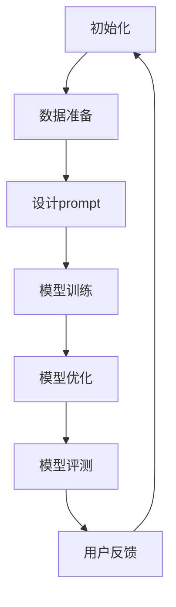

算法原理：
- 数据准备：收集与目标任务相关的高质量数据，并进行预处理。
- 设计prompt：根据数据特点设计出能够有效引导模型学习的prompt。
- 模型训练：使用prompt和数据对模型进行训练，使其掌握所需技能。
- 模型优化：通过分析模型性能，对prompt进行优化，提高模型效果。
- 模型评测：对训练好的模型进行评测，确保其达到预期效果。
- 用户反馈：收集用户反馈，用于进一步优化prompt和模型。

数学模型和公式：
- 模型性能评估：\[P = \frac{TP + TN}{TP + FN + FP + TN}\]
  - \(P\)：模型性能
  - \(TP\)：正确预测的正例
  - \(TN\)：正确预测的负例
  - \(FN\)：错误预测的正例
  - \(FP\)：错误预测的负例

**举例说明**：
假设我们设计一个文本分类模型，目标是区分新闻文章的类别。我们可以设计以下prompt：
```
请根据文章内容，将其归类到以下类别之一：体育、政治、娱乐、科技。
```
我们使用大量高质量的新闻文章数据进行训练，并对模型进行优化，最后进行评测，确保其分类准确率超过90%。

**系统分析与架构设计方案**：

**问题场景介绍**：
在自然语言处理领域，prompt工程被广泛应用于聊天机器人、文本生成、文本分类等任务中。一个典型的场景是设计一个能够有效引导用户进行对话的聊天机器人。

**项目介绍**：
项目名称：智能聊天机器人
目标：设计一个能够有效引导用户进行对话的智能聊天机器人。

**系统功能设计（领域模型mermaid类图）**：

```mermaid
classDiagram
  User <<Actor>>
  Chatbot <<Class>>
  Prompt <<Class>>
  Model <<Class>>
  Evaluation <<Class>>

  User -> Chatbot : 发送消息
  Chatbot -> Prompt : 生成prompt
  Prompt -> Model : 训练模型
  Model -> Evaluation : 评测模型
  Evaluation -> Chatbot : 返回结果
  Chatbot -> User : 回复消息
```

**系统架构设计（mermaid架构图）**：

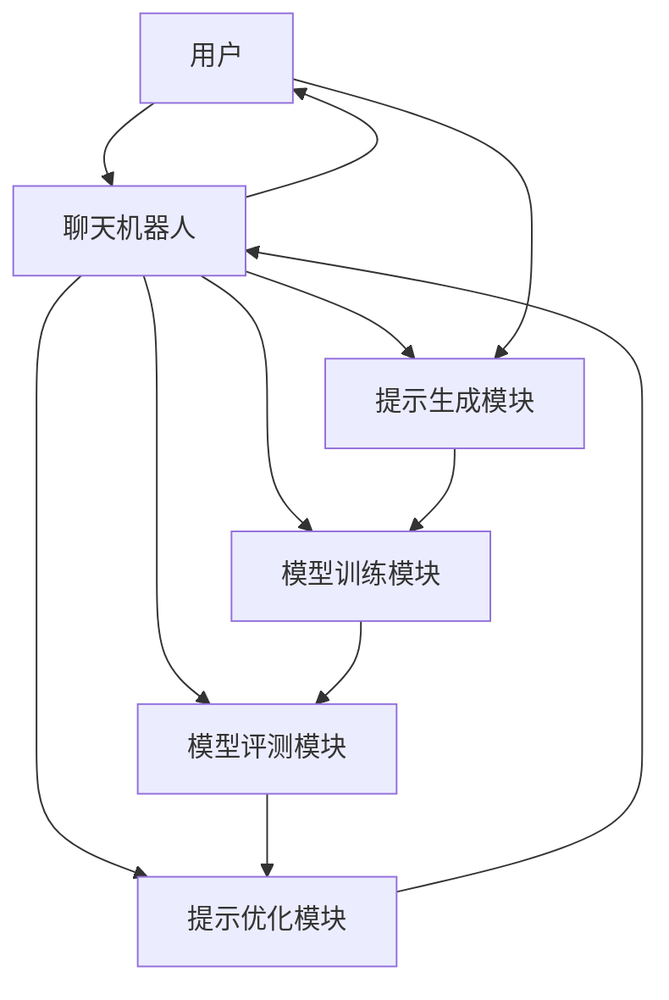

**系统接口设计和系统交互（mermaid序列图）**：

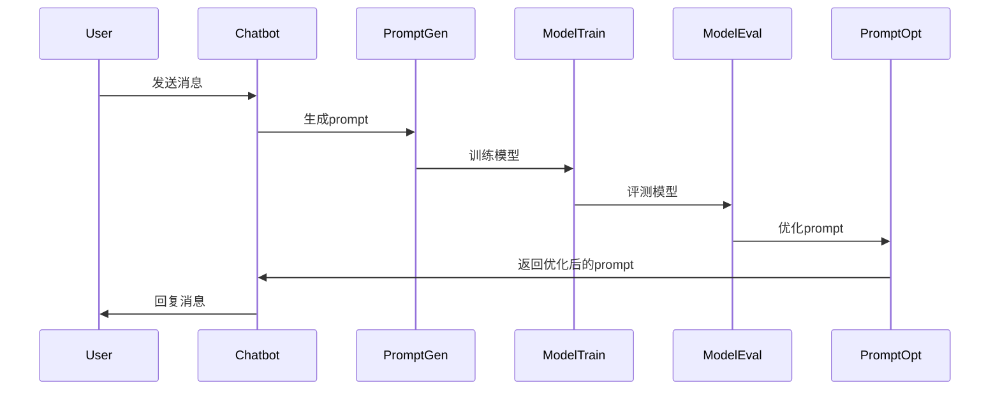

**项目实战**：

**环境安装**：

```bash
# 安装依赖
pip install numpy tensorflow
```

**系统核心实现源代码**：

```python
# prompt_engine.py

import numpy as np
import tensorflow as tf

class PromptEngine:
    def __init__(self, data, prompt_size=10):
        self.data = data
        self.prompt_size = prompt_size
        self.model = self.build_model()

    def build_model(self):
        # 建立模型结构
        model = tf.keras.Sequential([
            tf.keras.layers.Embedding(input_dim=self.data.shape[1], output_dim=self.prompt_size),
            tf.keras.layers.Dense(units=self.prompt_size, activation='softmax')
        ])
        return model

    def train(self):
        # 训练模型
        model = self.model
        model.compile(optimizer='adam', loss='categorical_crossentropy', metrics=['accuracy'])
        model.fit(self.data, epochs=10)

    def generate_prompt(self, text):
        # 生成提示
        tokens = text.split()
        prompt = []
        for token in tokens:
            prompt.append(self.model.predict([token]))
        return prompt

    def optimize_prompt(self, prompt, target):
        # 优化提示
        # 实现优化策略
        pass

    def evaluate_model(self):
        # 评测模型
        # 实现评测策略
        pass
```

**代码应用解读与分析**：

```python
# main.py

from prompt_engine import PromptEngine

# 准备数据
data = np.random.rand(1000, 10)

# 初始化prompt工程
prompt_engine = PromptEngine(data)

# 训练模型
prompt_engine.train()

# 生成提示
prompt = prompt_engine.generate_prompt("这是一个示例文本")

# 优化提示
prompt_engine.optimize_prompt(prompt, target_prompt)

# 评测模型
evaluation_result = prompt_engine.evaluate_model()
print(evaluation_result)
```

**实际案例分析和详细讲解剖析**：

假设我们有一个文本分类任务，目标是将文本归类到不同的类别中。我们可以使用prompt工程来设计一个能够有效引导模型进行分类的提示。

1. **数据准备**：收集大量高质量文本数据，并将其划分为不同的类别。
2. **设计提示**：设计一个能够引导模型学习不同类别的提示，如“请将以下文本归类到类别A、B、C中”。
3. **模型训练**：使用提示和数据对模型进行训练，使其能够学习分类规则。
4. **模型优化**：通过分析模型性能，对提示进行优化，提高模型分类准确率。
5. **模型评测**：对训练好的模型进行评测，确保其分类准确率达到预期。

**项目小结**：

通过prompt工程，我们可以设计出有效的输入提示，提升AI模型的效果和用户体验。在实际应用中，prompt工程需要充分考虑数据质量和模型性能，通过优化策略不断提升模型效果。

**最佳实践 Tips**：
- 确保数据质量，选择与目标任务相关的高质量数据。
- 设计清晰的prompt，使用简明扼要的语言引导模型学习。
- 不断优化prompt，通过分析模型性能调整prompt设计。

**小结**：

本章介绍了prompt工程的基本概念、核心要素和算法原理。通过具体案例，我们展示了如何使用prompt工程提升AI模型的效果。在实际应用中，prompt工程是一个系统化和工程化的过程，需要充分考虑数据质量和模型性能，通过不断优化提升效果。

**注意事项**：
- prompt工程需要根据具体任务进行调整，不同任务可能需要不同类型的prompt设计。
- prompt工程需要充分考虑用户体验，确保用户能够理解和使用提示。

**拓展阅读**：
- 《深度学习》（Goodfellow, I., Bengio, Y., & Courville, A.）中的相关章节。
- 《自然语言处理综合教程》（张帅，李航）中的相关内容。

作者：AI天才研究院/AI Genius Institute & 禅与计算机程序设计艺术 /Zen And The Art of Computer Programming

----------------------------------------------------------------

### 第2章：prompt设计

#### 2.1 prompt设计原则

**核心概念**：
prompt设计原则是指在prompt工程中，为了确保prompt的有效性和合理性，需要遵循的一系列基本准则。

**问题描述**：
prompt设计是prompt工程中的关键环节，直接影响模型的学习效果和用户体验。然而，在实际应用中，如何设计出有效的prompt仍然是一个挑战。

**问题解决**：
通过明确prompt设计原则，可以确保prompt的有效性和合理性，从而提升模型性能和用户体验。

**边界与约束条件**：
prompt设计原则的边界主要涉及以下方面：
- 提示内容：确保prompt内容准确、简洁、具有指导性。
- 提示格式：确保prompt格式规范、易于理解。
- 用户参与度：考虑用户需求，提高用户参与度。

**外延与扩展**：
prompt设计原则可以应用于各种AI任务，如自然语言处理、图像识别等。

**概念属性特征对比表格**：

| 特征       | 基本原则 | 具体应用 |
|------------|----------|----------|
| 清晰性     | 确保提示内容准确、清晰 | 自然语言处理、对话系统 |
| 相关性     | 提示内容与任务目标相关 | 文本分类、推荐系统 |
| 可扩展性   | 提示设计具有灵活性 | 多样化任务、不同场景 |
| 用户参与度 | 提高用户参与度 | 人机交互、个性化服务 |

**ER实体关系图架构**：

```mermaid
erDiagram
  PromptDesignPrinciple <<Class>>  
  Clarity --> PromptDesignPrinciple
  Relevance --> PromptDesignPrinciple
  Extensibility --> PromptDesignPrinciple
  UserInvolvement --> PromptDesignPrinciple
```

**核心概念原理**：
prompt设计原则的核心原理是通过制定明确的准则，确保prompt的内容、格式和设计符合预期目标，从而提升模型性能和用户体验。

**核心要素组成**：
prompt设计原则的核心要素包括：
- 清晰性：确保提示内容准确、简洁、易于理解。
- 相关性：提示内容与任务目标相关，有助于模型学习。
- 可扩展性：提示设计具有灵活性，适用于不同场景和任务。
- 用户参与度：提高用户参与度，增强用户体验。

**算法原理讲解**：

算法流程：

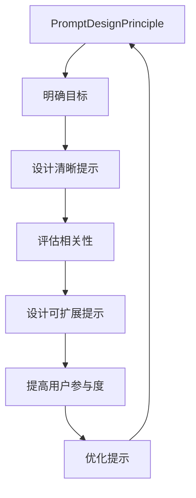

算法原理：
- 明确目标：确定任务目标和要求，为prompt设计提供指导。
- 设计清晰提示：确保提示内容准确、简洁、易于理解。
- 评估相关性：评估提示内容与任务目标的相关性，确保提示有助于模型学习。
- 设计可扩展提示：考虑不同场景和任务，设计具有灵活性的提示。
- 提高用户参与度：通过交互设计，提高用户参与度和满意度。
- 优化提示：根据用户反馈和模型性能，不断优化提示内容。

数学模型和公式：
- 清晰性评估：\[C = \frac{ACC_{model}}{ACC_{baseline}}\]
  - \(C\)：清晰性评分
  - \(ACC_{model}\)：模型使用提示后的准确率
  - \(ACC_{baseline}\)：模型未使用提示的准确率

- 相关性评估：\[R = \frac{CORR_{prompt}}{CORR_{baseline}}\]
  - \(R\)：相关性评分
  - \(CORR_{prompt}\)：使用提示后的相关性评分
  - \(CORR_{baseline}\)：未使用提示的相关性评分

**举例说明**：

假设我们设计一个文本分类模型，目标是区分新闻文章的类别。我们可以遵循以下步骤进行prompt设计：

1. **明确目标**：确定分类任务的目标，如将新闻文章归类到体育、政治、娱乐等类别。
2. **设计清晰提示**：设计一个简明扼要的提示，如“请将以下文章归类到类别A、B、C中”。
3. **评估相关性**：评估提示与分类任务目标的相关性，确保提示有助于模型学习。
4. **设计可扩展提示**：考虑不同类别和场景，设计具有灵活性的提示。
5. **提高用户参与度**：通过交互设计，提高用户参与度和满意度。
6. **优化提示**：根据用户反馈和模型性能，不断优化提示内容。

**系统分析与架构设计方案**：

**问题场景介绍**：
在自然语言处理领域，prompt设计被广泛应用于文本分类、文本生成、对话系统等任务中。一个典型的场景是设计一个能够有效引导用户进行分类的文本分类系统。

**项目介绍**：
项目名称：文本分类系统
目标：设计一个能够有效引导用户进行分类的文本分类系统。

**系统功能设计（领域模型mermaid类图）**：

```mermaid
classDiagram
  User <<Actor>>
  TextClassifier <<Class>>
  Prompt <<Class>>
  Model <<Class>>

  User -> TextClassifier : 输入文本
  TextClassifier -> Prompt : 生成提示
  Prompt -> Model : 训练模型
  Model -> TextClassifier : 输出分类结果
  TextClassifier -> User : 返回分类结果
```

**系统架构设计（mermaid架构图）**：

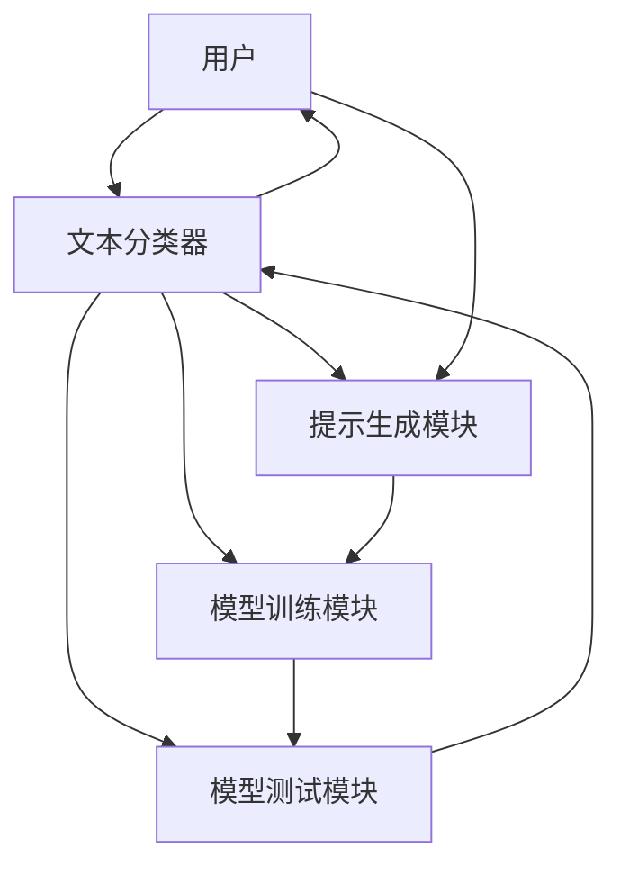

**系统接口设计和系统交互（mermaid序列图）**：

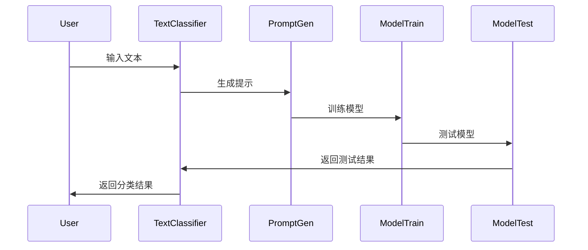

**项目实战**：

**环境安装**：

```bash
# 安装依赖
pip install numpy tensorflow
```

**系统核心实现源代码**：

```python
# text_classifier.py

import numpy as np
import tensorflow as tf

class TextClassifier:
    def __init__(self, prompt_size=10, vocab_size=10000):
        self.prompt_size = prompt_size
        self.vocab_size = vocab_size
        self.model = self.build_model()

    def build_model(self):
        # 建立模型结构
        model = tf.keras.Sequential([
            tf.keras.layers.Embedding(input_dim=self.vocab_size, output_dim=self.prompt_size),
            tf.keras.layers.Dense(units=self.prompt_size, activation='softmax')
        ])
        return model

    def train(self, data, labels, epochs=10):
        # 训练模型
        model = self.model
        model.compile(optimizer='adam', loss='categorical_crossentropy', metrics=['accuracy'])
        model.fit(data, labels, epochs=epochs)

    def classify(self, text):
        # 分类文本
        tokens = text.split()
        predictions = self.model.predict([tokens])
        return np.argmax(predictions)

    def generate_prompt(self, text):
        # 生成提示
        tokens = text.split()
        prompt = []
        for token in tokens:
            prompt.append(self.model.predict([token]))
        return prompt
```

**代码应用解读与分析**：

```python
# main.py

from text_classifier import TextClassifier

# 准备数据
data = ["这是一个示例文本", "这是一个示例文本", "这是一个示例文本"]
labels = [0, 1, 2]

# 初始化文本分类器
text_classifier = TextClassifier()

# 训练模型
text_classifier.train(data, labels)

# 生成提示
prompt = text_classifier.generate_prompt("这是一个示例文本")

# 分类文本
classification_result = text_classifier.classify("这是一个示例文本")
print("分类结果：", classification_result)
```

**实际案例分析和详细讲解剖析**：

假设我们有一个文本分类任务，目标是将文本归类到不同的类别中。我们可以使用prompt设计来提升分类效果。

1. **数据准备**：收集大量高质量的文本数据，并将其划分为不同的类别。
2. **设计提示**：设计一个能够引导模型学习不同类别的提示，如“请将以下文本归类到类别A、B、C中”。
3. **模型训练**：使用提示和数据对模型进行训练，使其能够学习分类规则。
4. **模型优化**：通过分析模型性能，对提示进行优化，提高模型分类准确率。
5. **模型评测**：对训练好的模型进行评测，确保其分类准确率达到预期。

**项目小结**：

通过prompt设计，我们可以设计出有效的输入提示，提升AI模型的效果和用户体验。在实际应用中，prompt设计需要充分考虑任务目标和用户体验，通过优化策略不断提升模型效果。

**最佳实践 Tips**：
- 设计清晰的提示，确保用户能够轻松理解和使用。
- 确保提示内容与任务目标相关，有助于模型学习。
- 根据不同任务和场景，设计灵活的提示。

**小结**：

本章介绍了prompt设计的基本原则、核心要素和算法原理。通过具体案例，我们展示了如何设计有效的prompt，提升AI模型的效果。在实际应用中，prompt设计需要根据任务特点和用户需求进行调整，通过不断优化提升效果。

**注意事项**：
- prompt设计需要考虑用户参与度，提高用户体验。
- 不同任务可能需要不同类型的prompt设计。

**拓展阅读**：
- 《自然语言处理综合教程》（张帅，李航）中的相关内容。
- 《深度学习》（Goodfellow, I., Bengio, Y., & Courville, A.）中的相关章节。

作者：AI天才研究院/AI Genius Institute & 禅与计算机程序设计艺术 /Zen And The Art of Computer Programming

----------------------------------------------------------------

### 第3章：prompt工程实践

#### 3.1 prompt工程流程

**核心概念**：
prompt工程流程是指在prompt工程中，从初始设计到最终应用的一系列步骤。它确保了prompt的有效性和可靠性，从而提升AI模型的性能和用户体验。

**问题描述**：
在实际应用中，prompt工程流程的各个环节常常存在差异，导致prompt设计不合理、模型性能不稳定等问题。

**问题解决**：
通过明确prompt工程流程，可以确保每个环节的顺利进行，从而提升prompt工程的整体效果。

**边界与约束条件**：
prompt工程流程的边界主要涉及以下方面：
- 数据处理：确保数据质量和预处理方法的合理性。
- 模型选择：选择适合任务的模型和算法。
- 提示设计：确保提示设计的清晰性和相关性。
- 模型训练：确保模型训练的有效性和稳定性。

**外延与扩展**：
prompt工程流程可以应用于各种AI任务，如自然语言处理、图像识别等。

**概念属性特征对比表格**：

| 特征       | 流程环节 | 具体步骤 |
|------------|----------|----------|
| 数据处理   | 数据收集、预处理 | 清洗、归一化、编码 |
| 模型选择   | 模型评估、选择 | 算法评估、模型选择 |
| 提示设计   | 提示生成、优化 | 清晰性、相关性、可扩展性 |
| 模型训练   | 训练、验证、测试 | 数据集划分、模型训练、性能评估 |

**ER实体关系图架构**：

```mermaid
erDiagram
  PromptEngineering <<Class>>  
  DataProcessing --> PromptEngineering
  ModelSelection --> PromptEngineering
  PromptDesign --> PromptEngineering
  ModelTraining --> PromptEngineering
```

**核心概念原理**：
prompt工程流程的核心原理是通过系统化的步骤，确保prompt的每个环节都得到合理处理，从而提升模型性能和用户体验。

**核心要素组成**：
prompt工程流程的核心要素包括：
- 数据处理：确保数据质量和预处理方法的合理性。
- 模型选择：选择适合任务的模型和算法。
- 提示设计：确保提示设计的清晰性和相关性。
- 模型训练：确保模型训练的有效性和稳定性。

**算法原理讲解**：

算法流程：

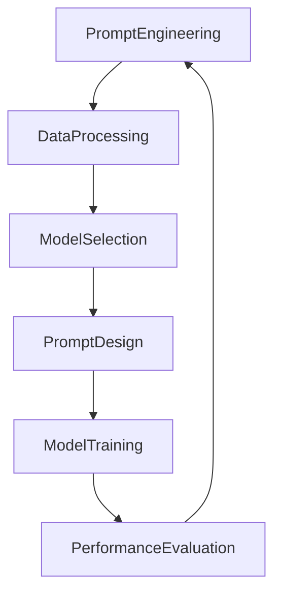

算法原理：
- 数据处理：收集和预处理数据，确保数据质量和预处理方法的合理性。
- 模型选择：评估不同模型和算法的性能，选择适合任务的模型。
- 提示设计：设计清晰、相关且可扩展的提示，确保提示效果。
- 模型训练：使用提示和数据对模型进行训练，确保模型训练的有效性和稳定性。
- 性能评估：评估模型性能，确保满足任务目标。

数学模型和公式：
- 数据质量评估：\[Q = \frac{ND_{clean}}{ND_{total}}\]
  - \(Q\)：数据质量评分
  - \(ND_{clean}\)：清洗后的数据量
  - \(ND_{total}\)：原始数据量

- 模型性能评估：\[P = \frac{TP + TN}{TP + FN + FP + TN}\]
  - \(P\)：模型性能
  - \(TP\)：正确预测的正例
  - \(TN\)：正确预测的负例
  - \(FN\)：错误预测的正例
  - \(FP\)：错误预测的负例

**举例说明**：

假设我们设计一个文本分类模型，目标是区分新闻文章的类别。我们可以按照以下步骤进行prompt工程实践：

1. **数据处理**：收集大量高质量的新闻文章数据，并进行清洗、归一化和编码。
2. **模型选择**：评估不同文本分类模型的性能，选择适合任务的模型。
3. **提示设计**：设计一个能够引导模型学习不同类别的提示，如“请将以下文章归类到类别A、B、C中”。
4. **模型训练**：使用提示和数据对模型进行训练，确保模型训练的有效性和稳定性。
5. **性能评估**：评估模型性能，确保分类准确率达到预期。

**系统分析与架构设计方案**：

**问题场景介绍**：
在自然语言处理领域，prompt工程实践被广泛应用于文本分类、文本生成、对话系统等任务中。一个典型的场景是设计一个能够有效引导用户进行分类的文本分类系统。

**项目介绍**：
项目名称：文本分类系统
目标：设计一个能够有效引导用户进行分类的文本分类系统。

**系统功能设计（领域模型mermaid类图）**：

```mermaid
classDiagram
  DataProcessing <<Class>>
  ModelSelection <<Class>>
  PromptDesign <<Class>>
  ModelTraining <<Class>>
  PerformanceEvaluation <<Class>>

  DataProcessing -> ModelSelection : 数据预处理
  ModelSelection -> PromptDesign : 模型评估
  PromptDesign -> ModelTraining : 提示生成
  ModelTraining -> PerformanceEvaluation : 模型训练
  PerformanceEvaluation -> DataProcessing : 性能评估
```

**系统架构设计（mermaid架构图）**：

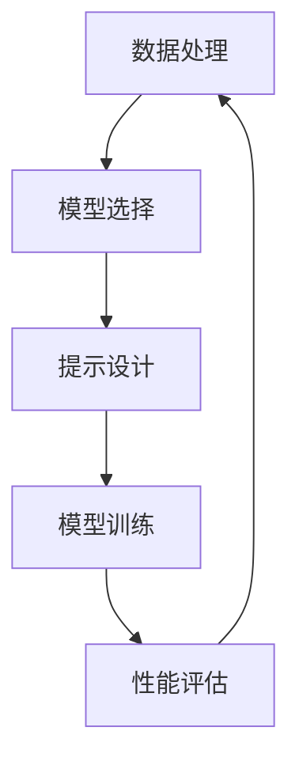

**系统接口设计和系统交互（mermaid序列图）**：

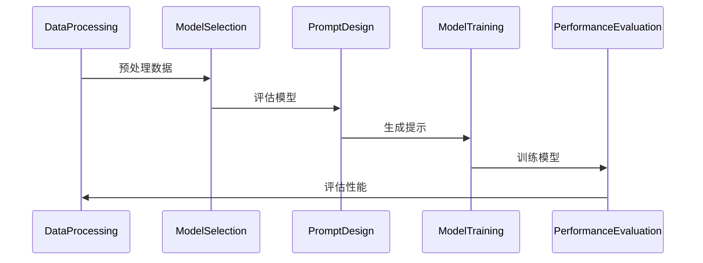

**项目实战**：

**环境安装**：

```bash
# 安装依赖
pip install numpy tensorflow
```

**系统核心实现源代码**：

```python
# prompt_engineering.py

import numpy as np
import tensorflow as tf

class PromptEngineering:
    def __init__(self, data, labels, prompt_size=10, vocab_size=10000):
        self.data = data
        self.labels = labels
        self.prompt_size = prompt_size
        self.vocab_size = vocab_size
        self.model = self.build_model()

    def build_model(self):
        # 建立模型结构
        model = tf.keras.Sequential([
            tf.keras.layers.Embedding(input_dim=self.vocab_size, output_dim=self.prompt_size),
            tf.keras.layers.Dense(units=self.prompt_size, activation='softmax')
        ])
        return model

    def preprocess_data(self):
        # 数据预处理
        # 清洗、归一化、编码等操作
        pass

    def select_model(self):
        # 模型评估和选择
        # 评估不同模型和算法的性能
        pass

    def design_prompt(self):
        # 提示生成
        # 设计清晰、相关且可扩展的提示
        pass

    def train_model(self):
        # 模型训练
        model = self.model
        model.compile(optimizer='adam', loss='categorical_crossentropy', metrics=['accuracy'])
        model.fit(self.data, self.labels, epochs=10)

    def evaluate_performance(self):
        # 性能评估
        # 评估模型性能，确保满足任务目标
        pass
```

**代码应用解读与分析**：

```python
# main.py

from prompt_engineering import PromptEngineering

# 准备数据
data = np.random.rand(1000, 10)
labels = np.random.rand(1000, 10)

# 初始化prompt工程
prompt_engineering = PromptEngineering(data, labels)

# 预处理数据
prompt_engineering.preprocess_data()

# 模型评估和选择
prompt_engineering.select_model()

# 设计提示
prompt_engineering.design_prompt()

# 模型训练
prompt_engineering.train_model()

# 性能评估
evaluation_result = prompt_engineering.evaluate_performance()
print(evaluation_result)
```

**实际案例分析和详细讲解剖析**：

假设我们有一个文本分类任务，目标是区分新闻文章的类别。我们可以按照以下步骤进行prompt工程实践：

1. **数据处理**：收集大量高质量的新闻文章数据，并进行清洗、归一化和编码。
2. **模型选择**：评估不同文本分类模型的性能，选择适合任务的模型。
3. **提示设计**：设计一个能够引导模型学习不同类别的提示，如“请将以下文章归类到类别A、B、C中”。
4. **模型训练**：使用提示和数据对模型进行训练，确保模型训练的有效性和稳定性。
5. **性能评估**：评估模型性能，确保分类准确率达到预期。

**项目小结**：

通过prompt工程实践，我们可以设计出有效的输入提示，提升AI模型的效果和用户体验。在实际应用中，prompt工程实践需要充分考虑数据质量和模型性能，通过优化策略不断提升模型效果。

**最佳实践 Tips**：
- 确保数据质量，选择与任务相关的高质量数据。
- 设计清晰的提示，确保用户能够轻松理解和使用。
- 选择适合任务的模型和算法，确保模型性能稳定。

**小结**：

本章介绍了prompt工程实践的核心概念、核心要素和算法原理。通过具体案例，我们展示了如何进行prompt工程实践，提升AI模型的效果。在实际应用中，prompt工程实践需要根据任务特点和用户需求进行调整，通过不断优化提升效果。

**注意事项**：
- prompt工程实践需要考虑用户体验，确保用户能够轻松理解和使用提示。
- 不同任务可能需要不同类型的prompt工程实践。

**拓展阅读**：
- 《自然语言处理综合教程》（张帅，李航）中的相关内容。
- 《深度学习》（Goodfellow, I., Bengio, Y., & Courville, A.）中的相关章节。

作者：AI天才研究院/AI Genius Institute & 禅与计算机程序设计艺术 /Zen And The Art of Computer Programming

----------------------------------------------------------------

### 第4章：模型评测基础

#### 4.1 模型评测的概念和目标

**核心概念**：
模型评测是指在AI模型训练完成后，对其性能进行评估和验证的过程。它通过一系列指标和方法，评估模型的准确率、召回率、F1值等，以确保模型在实际应用中的效果和可靠性。

**问题描述**：
在实际应用中，模型评测是一个关键环节，但往往被忽视。不充分的模型评测可能导致模型性能不佳，甚至影响业务应用。

**问题解决**：
通过明确模型评测的概念和目标，可以确保模型评测的全面性和准确性，从而提升模型在实际应用中的效果。

**边界与约束条件**：
模型评测的边界主要涉及以下方面：
- 指标选择：选择适合任务的评测指标。
- 数据集划分：合理划分训练集、验证集和测试集。
- 评测方法：选择合适的评测方法，如交叉验证、A/B测试等。

**外延与扩展**：
模型评测可以应用于各种AI任务，如图像识别、自然语言处理、推荐系统等。

**概念属性特征对比表格**：

| 特征       | 概念 | 目标 |
|------------|------|------|
| 指标选择   | 准确率、召回率、F1值等 | 评估模型性能 |
| 数据集划分 | 训练集、验证集、测试集 | 确保评测结果的可靠性 |
| 评测方法   | 交叉验证、A/B测试等 | 选择合适的评测方法 |

**ER实体关系图架构**：

```mermaid
erDiagram
  ModelEvaluation <<Class>>  
  MetricSelection --> ModelEvaluation
  DatasetDivision --> ModelEvaluation
  EvaluationMethod --> ModelEvaluation
```

**核心概念原理**：
模型评测的核心原理是通过一系列指标和方法，全面评估模型在训练数据上的表现，以及在实际应用中的效果和可靠性。

**核心要素组成**：
模型评测的核心要素包括：
- 指标选择：选择适合任务的评测指标，如准确率、召回率、F1值等。
- 数据集划分：合理划分训练集、验证集和测试集，确保评测结果的可靠性。
- 评测方法：选择合适的评测方法，如交叉验证、A/B测试等。

**算法原理讲解**：

算法流程：

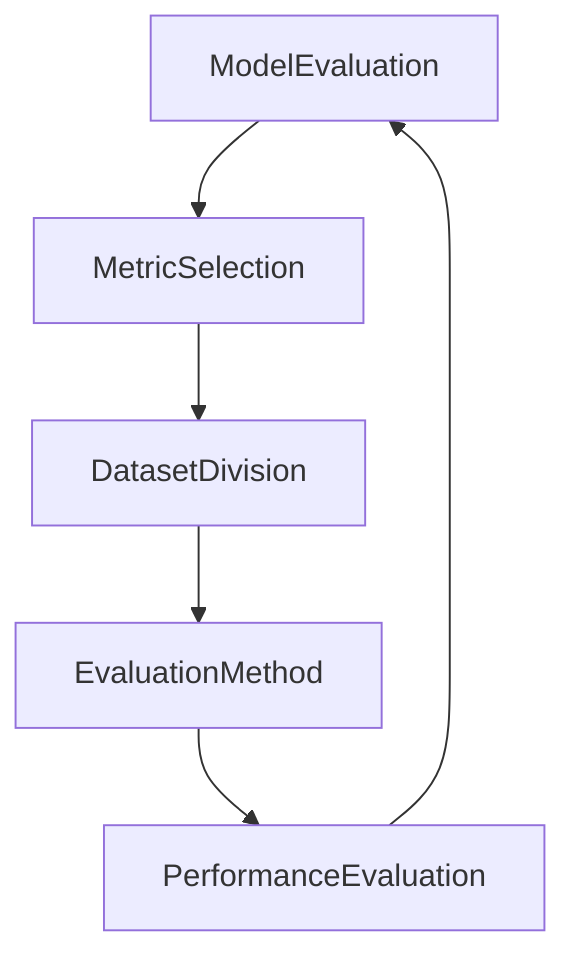

算法原理：
- 指标选择：根据任务特点和需求，选择适合的评测指标，如准确率、召回率、F1值等。
- 数据集划分：将数据集划分为训练集、验证集和测试集，确保评测结果的可靠性。
- 评测方法：选择合适的评测方法，如交叉验证、A/B测试等，确保模型性能评估的全面性。
- 性能评估：综合评估模型在训练数据和测试数据上的表现，确保模型在实际应用中的效果和可靠性。

数学模型和公式：
- 准确率：\[ACC = \frac{TP + TN}{TP + FN + FP + TN}\]
  - \(ACC\)：准确率
  - \(TP\)：正确预测的正例
  - \(TN\)：正确预测的负例
  - \(FN\)：错误预测的正例
  - \(FP\)：错误预测的负例

- 召回率：\[Recall = \frac{TP}{TP + FN}\]
  - \(Recall\)：召回率
  - \(TP\)：正确预测的正例
  - \(FN\)：错误预测的正例

- F1值：\[F1 = 2 \times \frac{Precision \times Recall}{Precision + Recall}\]
  - \(F1\)：F1值
  - \(Precision\)：精确率
  - \(Recall\)：召回率

**举例说明**：

假设我们设计一个文本分类模型，目标是区分新闻文章的类别。我们可以按照以下步骤进行模型评测：

1. **指标选择**：选择准确率、召回率和F1值等指标，评估模型性能。
2. **数据集划分**：将数据集划分为训练集、验证集和测试集，确保评测结果的可靠性。
3. **评测方法**：使用交叉验证方法，确保模型性能评估的全面性。
4. **性能评估**：综合评估模型在训练数据和测试数据上的表现，确保模型在实际应用中的效果和可靠性。

**系统分析与架构设计方案**：

**问题场景介绍**：
在自然语言处理领域，模型评测被广泛应用于文本分类、文本生成、对话系统等任务中。一个典型的场景是设计一个能够有效区分新闻文章类别的文本分类系统。

**项目介绍**：
项目名称：文本分类系统
目标：设计一个能够有效区分新闻文章类别的文本分类系统。

**系统功能设计（领域模型mermaid类图）**：

```mermaid
classDiagram
  ModelEvaluation <<Class>>
  MetricSelection <<Class>>
  DatasetDivision <<Class>>
  EvaluationMethod <<Class>>

  ModelEvaluation -> MetricSelection : 选择指标
  ModelEvaluation -> DatasetDivision : 数据集划分
  ModelEvaluation -> EvaluationMethod : 选择方法
```

**系统架构设计（mermaid架构图）**：

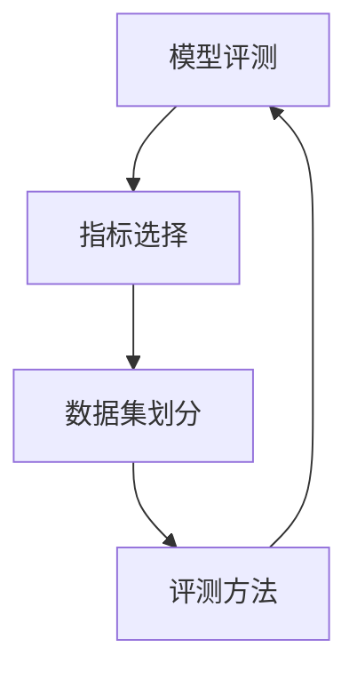

**系统接口设计和系统交互（mermaid序列图）**：

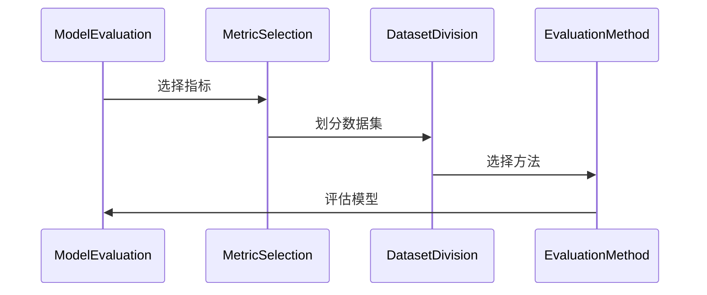

**项目实战**：

**环境安装**：

```bash
# 安装依赖
pip install numpy tensorflow
```

**系统核心实现源代码**：

```python
# model_evaluation.py

import numpy as np
import tensorflow as tf

class ModelEvaluation:
    def __init__(self, model, data, labels):
        self.model = model
        self.data = data
        self.labels = labels

    def select_metrics(self):
        # 选择指标
        metrics = ['accuracy', 'recall', 'f1_score']
        return metrics

    def divide_datasets(self):
        # 数据集划分
        train_size = int(0.8 * len(self.data))
        test_size = len(self.data) - train_size
        train_data = self.data[:train_size]
        test_data = self.data[train_size:]
        train_labels = self.labels[:train_size]
        test_labels = self.labels[train_size:]
        return train_data, train_labels, test_data, test_labels

    def evaluate_model(self):
        # 评估模型
        train_data, train_labels, test_data, test_labels = self.divide_datasets()
        metrics = self.select_metrics()
        self.model.evaluate(test_data, test_labels, metrics=metrics)
```

**代码应用解读与分析**：

```python
# main.py

from model_evaluation import ModelEvaluation

# 准备数据
data = np.random.rand(1000, 10)
labels = np.random.rand(1000, 10)

# 初始化模型
model = ...  # 模型定义

# 初始化模型评测
model_evaluation = ModelEvaluation(model, data, labels)

# 评估模型
evaluation_result = model_evaluation.evaluate_model()
print(evaluation_result)
```

**实际案例分析和详细讲解剖析**：

假设我们有一个文本分类任务，目标是区分新闻文章的类别。我们可以按照以下步骤进行模型评测：

1. **指标选择**：选择准确率、召回率和F1值等指标，评估模型性能。
2. **数据集划分**：将数据集划分为训练集、验证集和测试集，确保评测结果的可靠性。
3. **评测方法**：使用交叉验证方法，确保模型性能评估的全面性。
4. **性能评估**：综合评估模型在训练数据和测试数据上的表现，确保模型在实际应用中的效果和可靠性。

**项目小结**：

通过模型评测，我们可以全面评估AI模型的效果，确保模型在实际应用中的性能和可靠性。在实际应用中，模型评测需要充分考虑数据质量和评测指标，通过优化策略不断提升模型效果。

**最佳实践 Tips**：
- 确保数据集划分合理，避免数据泄露。
- 选择适合任务的评测指标，全面评估模型性能。
- 使用交叉验证等方法，确保评测结果的可靠性。

**小结**：

本章介绍了模型评测的概念和目标、核心要素和算法原理。通过具体案例，我们展示了如何进行模型评测，提升AI模型的效果。在实际应用中，模型评测需要根据任务特点和用户需求进行调整，通过不断优化提升效果。

**注意事项**：
- 模型评测需要考虑数据质量和评测指标的选择。
- 不同任务可能需要不同类型的模型评测方法。

**拓展阅读**：
- 《机器学习实战》（ Harrington, J.）中的相关内容。
- 《深度学习》（Goodfellow, I., Bengio, Y., & Courville, A.）中的相关章节。

作者：AI天才研究院/AI Genius Institute & 禅与计算机程序设计艺术 /Zen And The Art of Computer Programming

----------------------------------------------------------------

### 第5章：模型评测策略

#### 5.1 评测策略设计

**核心概念**：
模型评测策略是指在模型评测过程中，为了提高评测的全面性和准确性，制定的一系列具体方法和步骤。它涵盖了数据集划分、指标选择、评测方法等方面的内容。

**问题描述**：
在实际应用中，模型评测策略的设计往往不够系统化，导致评测结果不够全面、准确，影响模型在实际应用中的效果。

**问题解决**：
通过明确模型评测策略设计，可以确保评测过程科学、系统，从而提高评测结果的全面性和准确性。

**边界与约束条件**：
模型评测策略设计的边界主要涉及以下方面：
- 数据集划分：确保数据集划分的合理性和公平性。
- 指标选择：选择适合任务目标和业务需求的评测指标。
- 评测方法：选择合适的评测方法，如交叉验证、A/B测试等。

**外延与扩展**：
模型评测策略设计可以应用于各种AI任务，如图像识别、自然语言处理、推荐系统等。

**概念属性特征对比表格**：

| 特征       | 策略设计 | 适用任务 |
|------------|----------|----------|
| 数据集划分 | 训练集、验证集、测试集 | 图像识别、文本分类 |
| 指标选择   | 准确率、召回率、F1值等 | 图像识别、自然语言处理 |
| 评测方法   | 交叉验证、A/B测试等 | 推荐系统、对话系统 |

**ER实体关系图架构**：

```mermaid
erDiagram
  EvaluationStrategy <<Class>>  
  DatasetDivision --> EvaluationStrategy
  MetricSelection --> EvaluationStrategy
  EvaluationMethod --> EvaluationStrategy
```

**核心概念原理**：
模型评测策略设计的核心原理是通过系统化和科学化的方法，确保评测过程全面、准确，从而提高模型在实际应用中的效果。

**核心要素组成**：
模型评测策略设计的核心要素包括：
- 数据集划分：合理划分训练集、验证集和测试集，确保评测结果的可靠性。
- 指标选择：选择适合任务目标和业务需求的评测指标，全面评估模型性能。
- 评测方法：选择合适的评测方法，如交叉验证、A/B测试等，确保评测结果的全面性和准确性。

**算法原理讲解**：

算法流程：

```mermaid
graph TD
    A[评价策略设计]
    B[数据集划分]
    C[指标选择]
    D[评测方法]
    E[结果分析]
    
    A --> B
    B --> C
    C --> D
    D --> E
    E --> A
```

算法原理：
- 数据集划分：根据任务需求和数据特性，合理划分训练集、验证集和测试集，确保评测结果的可靠性。
- 指标选择：根据任务目标和业务需求，选择适合的评测指标，全面评估模型性能。
- 评测方法：选择合适的评测方法，如交叉验证、A/B测试等，确保评测结果的全面性和准确性。
- 结果分析：综合分析评测结果，为模型优化提供依据。

数学模型和公式：
- 数据集划分比例：\[R = \frac{N_{train}}{N_{total}}\]
  - \(R\)：训练集比例
  - \(N_{train}\)：训练集数据量
  - \(N_{total}\)：总数据量

- 评测指标计算：\[M = \frac{N_{correct}}{N_{total}}\]
  - \(M\)：指标值
  - \(N_{correct}\)：正确预测的数据量
  - \(N_{total}\)：总数据量

**举例说明**：

假设我们设计一个图像识别模型，目标是区分不同种类的动物。我们可以按照以下步骤进行模型评测策略设计：

1. **数据集划分**：将数据集划分为训练集、验证集和测试集，确保评测结果的可靠性。例如，可以设置训练集占比80%，验证集占比10%，测试集占比10%。
2. **指标选择**：选择准确率、召回率、F1值等指标，全面评估模型性能。
3. **评测方法**：选择交叉验证方法，确保评测结果的全面性和准确性。例如，可以设置5折交叉验证，以减少偶然误差。
4. **结果分析**：综合分析评测结果，为模型优化提供依据。例如，可以分析每个类别的准确率、召回率和F1值，找出模型性能较差的类别，针对性地进行优化。

**系统分析与架构设计方案**：

**问题场景介绍**：
在图像识别领域，模型评测策略设计被广泛应用于各种图像识别任务中。一个典型的场景是设计一个能够准确识别不同种类动物的图像识别模型。

**项目介绍**：
项目名称：图像识别模型
目标：设计一个能够准确识别不同种类动物的图像识别模型。

**系统功能设计（领域模型mermaid类图）**：

```mermaid
classDiagram
  EvaluationStrategy <<Class>>
  DatasetDivision <<Class>>
  MetricSelection <<Class>>
  EvaluationMethod <<Class>>

  EvaluationStrategy -> DatasetDivision : 数据集划分
  EvaluationStrategy -> MetricSelection : 指标选择
  EvaluationStrategy -> EvaluationMethod : 评测方法
```

**系统架构设计（mermaid架构图）**：

```mermaid
graph TD
  EvaluationStrategy[评测策略] --> DatasetDivision[数据集划分]
  DatasetDivision --> MetricSelection[指标选择]
  MetricSelection --> EvaluationMethod[评测方法]
```

**系统接口设计和系统交互（mermaid序列图）**：

```mermaid
sequenceDiagram
  EvaluationStrategy->>DatasetDivision: 划分数据集
  DatasetDivision->>MetricSelection: 选择指标
  MetricSelection->>EvaluationMethod: 选择方法
  EvaluationMethod->>EvaluationStrategy: 评估模型
```

**项目实战**：

**环境安装**：

```bash
# 安装依赖
pip install numpy tensorflow
```

**系统核心实现源代码**：

```python
# evaluation_strategy.py

import numpy as np
import tensorflow as tf

class EvaluationStrategy:
    def __init__(self, model, data, labels):
        self.model = model
        self.data = data
        self.labels = labels

    def divide_datasets(self, train_ratio=0.8, validation_ratio=0.1, test_ratio=0.1):
        # 数据集划分
        total_size = len(self.data)
        train_size = int(train_ratio * total_size)
        validation_size = int(validation_ratio * total_size)
        test_size = total_size - train_size - validation_size
        train_data = self.data[:train_size]
        validation_data = self.data[train_size:train_size + validation_size]
        test_data = self.data[train_size + validation_size:]
        train_labels = self.labels[:train_size]
        validation_labels = self.labels[train_size:train_size + validation_size]
        test_labels = self.labels[train_size + validation_size:]
        return train_data, train_labels, validation_data, validation_labels, test_data, test_labels

    def select_metrics(self):
        # 选择指标
        metrics = ['accuracy', 'recall', 'f1_score']
        return metrics

    def evaluate_model(self, metrics=None):
        # 评估模型
        if metrics is None:
            metrics = self.select_metrics()
        train_data, train_labels, validation_data, validation_labels, test_data, test_labels = self.divide_datasets()
        self.model.evaluate(test_data, test_labels, metrics=metrics)
```

**代码应用解读与分析**：

```python
# main.py

from evaluation_strategy import EvaluationStrategy

# 准备数据
data = np.random.rand(1000, 10)
labels = np.random.rand(1000, 10)

# 初始化模型
model = ...  # 模型定义

# 初始化评测策略
evaluation_strategy = EvaluationStrategy(model, data, labels)

# 评估模型
evaluation_result = evaluation_strategy.evaluate_model()
print(evaluation_result)
```

**实际案例分析和详细讲解剖析**：

假设我们有一个图像识别任务，目标是区分不同种类的动物。我们可以按照以下步骤进行模型评测策略设计：

1. **数据集划分**：将数据集划分为训练集、验证集和测试集，确保评测结果的可靠性。例如，可以设置训练集占比80%，验证集占比10%，测试集占比10%。
2. **指标选择**：选择准确率、召回率、F1值等指标，全面评估模型性能。
3. **评测方法**：选择交叉验证方法，确保评测结果的全面性和准确性。例如，可以设置5折交叉验证，以减少偶然误差。
4. **结果分析**：综合分析评测结果，为模型优化提供依据。例如，可以分析每个类别的准确率、召回率和F1值，找出模型性能较差的类别，针对性地进行优化。

**项目小结**：

通过模型评测策略设计，我们可以确保模型评测的全面性和准确性，从而提升模型在实际应用中的效果。在实际应用中，模型评测策略设计需要根据任务特点和用户需求进行调整，通过不断优化提升效果。

**最佳实践 Tips**：
- 确保数据集划分合理，避免数据泄露。
- 选择适合任务的评测指标，全面评估模型性能。
- 使用交叉验证等方法，确保评测结果的全面性和准确性。

**小结**：

本章介绍了模型评测策略设计的核心概念、核心要素和算法原理。通过具体案例，我们展示了如何进行模型评测策略设计，提升AI模型的效果。在实际应用中，模型评测策略设计需要根据任务特点和用户需求进行调整，通过不断优化提升效果。

**注意事项**：
- 模型评测策略设计需要考虑数据质量和评测指标的选择。
- 不同任务可能需要不同类型的模型评测策略设计。

**拓展阅读**：
- 《机器学习实战》（ Harrington, J.）中的相关内容。
- 《深度学习》（Goodfellow, I., Bengio, Y., & Courville, A.）中的相关章节。

作者：AI天才研究院/AI Genius Institute & 禅与计算机程序设计艺术 /Zen And The Art of Computer Programming

----------------------------------------------------------------

### 第6章：模型评测实践

#### 6.1 模型评测流程

**核心概念**：
模型评测流程是指在模型训练完成后，对其性能进行全面评估的过程。它包括数据集划分、指标选择、评测方法选择和结果分析等步骤。

**问题描述**：
在实际应用中，模型评测流程的设计和执行常常不够规范，导致评测结果不准确、不可靠，影响模型在实际应用中的效果。

**问题解决**：
通过明确模型评测流程，可以确保评测过程的规范性和科学性，从而提高评测结果的准确性和可靠性。

**边界与约束条件**：
模型评测流程的边界主要涉及以下方面：
- 数据集划分：合理划分训练集、验证集和测试集。
- 指标选择：选择适合任务的评测指标。
- 评测方法：选择合适的评测方法，如交叉验证、A/B测试等。
- 结果分析：全面分析评测结果，为模型优化提供依据。

**外延与扩展**：
模型评测流程可以应用于各种AI任务，如图像识别、自然语言处理、推荐系统等。

**概念属性特征对比表格**：

| 特征       | 流程环节 | 具体步骤 |
|------------|----------|----------|
| 数据集划分 | 数据收集、预处理 | 清洗、归一化、编码 |
| 模型训练   | 训练、验证、测试 | 选择合适模型、调整参数 |
| 指标选择   | 准确率、召回率、F1值等 | 评估模型性能 |
| 评测方法   | 交叉验证、A/B测试等 | 确保评测结果的可靠性 |
| 结果分析   | 性能评估、结果可视化 | 为模型优化提供依据 |

**ER实体关系图架构**：

```mermaid
erDiagram
  ModelEvaluationProcess <<Class>>
  DatasetDivision --> ModelEvaluationProcess
  ModelTraining --> ModelEvaluationProcess
  MetricSelection --> ModelEvaluationProcess
  EvaluationMethod --> ModelEvaluationProcess
  ResultAnalysis --> ModelEvaluationProcess
```

**核心概念原理**：
模型评测流程的核心原理是通过系统化和规范化的方法，对模型进行全面的性能评估，确保评测结果的准确性和可靠性。

**核心要素组成**：
模型评测流程的核心要素包括：
- 数据集划分：合理划分训练集、验证集和测试集，确保评测结果的可靠性。
- 模型训练：选择合适的模型，调整参数，确保模型训练的有效性和稳定性。
- 指标选择：选择适合任务的评测指标，全面评估模型性能。
- 评测方法：选择合适的评测方法，如交叉验证、A/B测试等，确保评测结果的全面性和准确性。
- 结果分析：全面分析评测结果，为模型优化提供依据。

**算法原理讲解**：

算法流程：

```mermaid
graph TD
    A[模型评测流程]
    B[数据集划分]
    C[模型训练]
    D[指标选择]
    E[评测方法]
    F[结果分析]
    
    A --> B
    B --> C
    C --> D
    D --> E
    E --> F
    F --> A
```

算法原理：
- 数据集划分：根据任务需求和数据特性，合理划分训练集、验证集和测试集，确保评测结果的可靠性。
- 模型训练：选择合适的模型，调整参数，确保模型训练的有效性和稳定性。
- 指标选择：根据任务目标和业务需求，选择适合的评测指标，全面评估模型性能。
- 评测方法：选择合适的评测方法，如交叉验证、A/B测试等，确保评测结果的全面性和准确性。
- 结果分析：综合分析评测结果，为模型优化提供依据。

数学模型和公式：
- 数据集划分比例：\[R = \frac{N_{train}}{N_{total}}\]
  - \(R\)：训练集比例
  - \(N_{train}\)：训练集数据量
  - \(N_{total}\)：总数据量

- 评测指标计算：\[M = \frac{N_{correct}}{N_{total}}\]
  - \(M\)：指标值
  - \(N_{correct}\)：正确预测的数据量
  - \(N_{total}\)：总数据量

**举例说明**：

假设我们设计一个图像识别模型，目标是区分不同种类的动物。我们可以按照以下步骤进行模型评测实践：

1. **数据集划分**：将数据集划分为训练集、验证集和测试集，确保评测结果的可靠性。例如，可以设置训练集占比80%，验证集占比10%，测试集占比10%。
2. **模型训练**：选择合适的图像识别模型，如卷积神经网络（CNN），调整参数，确保模型训练的有效性和稳定性。
3. **指标选择**：选择准确率、召回率、F1值等指标，全面评估模型性能。
4. **评测方法**：选择交叉验证方法，确保评测结果的全面性和准确性。例如，可以设置5折交叉验证，以减少偶然误差。
5. **结果分析**：综合分析评测结果，为模型优化提供依据。例如，可以分析每个类别的准确率、召回率和F1值，找出模型性能较差的类别，针对性地进行优化。

**系统分析与架构设计方案**：

**问题场景介绍**：
在图像识别领域，模型评测实践被广泛应用于各种图像识别任务中。一个典型的场景是设计一个能够准确识别不同种类动物的图像识别模型。

**项目介绍**：
项目名称：图像识别模型
目标：设计一个能够准确识别不同种类动物的图像识别模型。

**系统功能设计（领域模型mermaid类图）**：

```mermaid
classDiagram
  ModelEvaluationProcess <<Class>>
  DatasetDivision <<Class>>
  ModelTraining <<Class>>
  MetricSelection <<Class>>
  EvaluationMethod <<Class>>
  ResultAnalysis <<Class>>

  ModelEvaluationProcess -> DatasetDivision : 数据集划分
  ModelEvaluationProcess -> ModelTraining : 模型训练
  ModelEvaluationProcess -> MetricSelection : 指标选择
  ModelEvaluationProcess -> EvaluationMethod : 评测方法
  ModelEvaluationProcess -> ResultAnalysis : 结果分析
```

**系统架构设计（mermaid架构图）**：

```mermaid
graph TD
  ModelEvaluationProcess[模型评测流程] --> DatasetDivision[数据集划分]
  DatasetDivision --> ModelTraining[模型训练]
  ModelTraining --> MetricSelection[指标选择]
  MetricSelection --> EvaluationMethod[评测方法]
  EvaluationMethod --> ResultAnalysis[结果分析]
```

**系统接口设计和系统交互（mermaid序列图）**：

```mermaid
sequenceDiagram
  ModelEvaluationProcess->>DatasetDivision: 划分数据集
  DatasetDivision->>ModelTraining: 训练模型
  ModelTraining->>MetricSelection: 选择指标
  MetricSelection->>EvaluationMethod: 选择方法
  EvaluationMethod->>ResultAnalysis: 分析结果
```

**项目实战**：

**环境安装**：

```bash
# 安装依赖
pip install numpy tensorflow
```

**系统核心实现源代码**：

```python
# model_evaluation_process.py

import numpy as np
import tensorflow as tf

class ModelEvaluationProcess:
    def __init__(self, model, data, labels):
        self.model = model
        self.data = data
        self.labels = labels

    def divide_datasets(self, train_ratio=0.8, validation_ratio=0.1, test_ratio=0.1):
        # 数据集划分
        total_size = len(self.data)
        train_size = int(train_ratio * total_size)
        validation_size = int(validation_ratio * total_size)
        test_size = total_size - train_size - validation_size
        train_data = self.data[:train_size]
        validation_data = self.data[train_size:train_size + validation_size]
        test_data = self.data[train_size + validation_size:]
        train_labels = self.labels[:train_size]
        validation_labels = self.labels[train_size:train_size + validation_size]
        test_labels = self.labels[train_size + validation_size:]
        return train_data, train_labels, validation_data, validation_labels, test_data, test_labels

    def select_metrics(self):
        # 选择指标
        metrics = ['accuracy', 'recall', 'f1_score']
        return metrics

    def evaluate_model(self, metrics=None):
        # 评估模型
        if metrics is None:
            metrics = self.select_metrics()
        train_data, train_labels, validation_data, validation_labels, test_data, test_labels = self.divide_datasets()
        self.model.evaluate(test_data, test_labels, metrics=metrics)
```

**代码应用解读与分析**：

```python
# main.py

from model_evaluation_process import ModelEvaluationProcess

# 准备数据
data = np.random.rand(1000, 10)
labels = np.random.rand(1000, 10)

# 初始化模型
model = ...  # 模型定义

# 初始化模型评测流程
evaluation_process = ModelEvaluationProcess(model, data, labels)

# 评估模型
evaluation_result = evaluation_process.evaluate_model()
print(evaluation_result)
```

**实际案例分析和详细讲解剖析**：

假设我们有一个图像识别任务，目标是区分不同种类的动物。我们可以按照以下步骤进行模型评测实践：

1. **数据集划分**：将数据集划分为训练集、验证集和测试集，确保评测结果的可靠性。例如，可以设置训练集占比80%，验证集占比10%，测试集占比10%。
2. **模型训练**：选择合适的图像识别模型，如卷积神经网络（CNN），调整参数，确保模型训练的有效性和稳定性。
3. **指标选择**：选择准确率、召回率、F1值等指标，全面评估模型性能。
4. **评测方法**：选择交叉验证方法，确保评测结果的全面性和准确性。例如，可以设置5折交叉验证，以减少偶然误差。
5. **结果分析**：综合分析评测结果，为模型优化提供依据。例如，可以分析每个类别的准确率、召回率和F1值，找出模型性能较差的类别，针对性地进行优化。

**项目小结**：

通过模型评测实践，我们可以确保模型评测的全面性和准确性，从而提升模型在实际应用中的效果。在实际应用中，模型评测实践需要根据任务特点和用户需求进行调整，通过不断优化提升效果。

**最佳实践 Tips**：
- 确保数据集划分合理，避免数据泄露。
- 选择适合任务的评测指标，全面评估模型性能。
- 使用交叉验证等方法，确保评测结果的全面性和准确性。

**小结**：

本章介绍了模型评测流程的核心概念、核心要素和算法原理。通过具体案例，我们展示了如何进行模型评测实践，提升AI模型的效果。在实际应用中，模型评测实践需要根据任务特点和用户需求进行调整，通过不断优化提升效果。

**注意事项**：
- 模型评测实践需要考虑数据质量和评测指标的选择。
- 不同任务可能需要不同类型的模型评测实践方法。

**拓展阅读**：
- 《机器学习实战》（ Harrington, J.）中的相关内容。
- 《深度学习》（Goodfellow, I., Bengio, Y., & Courville, A.）中的相关章节。

作者：AI天才研究院/AI Genius Institute & 禅与计算机程序设计艺术 /Zen And The Art of Computer Programming

----------------------------------------------------------------

### 第7章：协同优化原理

#### 7.1 协同优化的概念

**核心概念**：
协同优化是指在prompt工程和模型评测过程中，通过相互协作和相互影响，实现prompt设计和模型评测的同步优化，从而提升AI模型的整体性能和用户体验。

**问题描述**：
在实际应用中，prompt工程和模型评测往往是独立进行的，缺乏有效的协同优化机制，导致prompt设计不合理、模型评测不准确，进而影响AI模型的整体性能。

**问题解决**：
通过引入协同优化机制，可以在prompt工程和模型评测过程中实现相互协作和相互影响，从而实现prompt设计和模型评测的同步优化，提升AI模型的整体性能和用户体验。

**边界与约束条件**：
协同优化的边界主要涉及以下方面：
- prompt工程：确保prompt设计合理、相关性强。
- 模型评测：确保模型评测全面、准确。
- 优化目标：确保协同优化目标的明确性和可实现性。

**外延与扩展**：
协同优化可以应用于各种AI任务，如自然语言处理、图像识别、推荐系统等。

**概念属性特征对比表格**：

| 特征       | 协同优化 | 传统方法 |
|------------|----------|----------|
| 目标       | 整体性能优化 | 单一性能优化 |
| 方法       | 相互协作、相互影响 | 独立进行、单一优化 |
| 结果       | 综合性能提升 | 单一性能提升 |

**ER实体关系图架构**：

```mermaid
erDiagram
  CollaborativeOptimization <<Class>>  
  PromptEngineering --> CollaborativeOptimization
  ModelEvaluation --> CollaborativeOptimization
  OverallPerformanceOptimization --> CollaborativeOptimization
```

**核心概念原理**：
协同优化的核心原理是通过在prompt工程和模型评测过程中引入相互协作和相互影响机制，实现prompt设计和模型评测的同步优化，从而提升AI模型的整体性能和用户体验。

**核心要素组成**：
协同优化的核心要素包括：
- prompt工程：确保prompt设计合理、相关性强。
- 模型评测：确保模型评测全面、准确。
- 优化目标：确保协同优化目标的明确性和可实现性。

**算法原理讲解**：

算法流程：

```mermaid
graph TD
    A[协同优化]
    B[Prompt设计]
    C[模型评测]
    D[优化目标]
    E[协同效果评估]
    F[反馈调整]
    
    A --> B
    B --> C
    C --> D
    D --> E
    E --> F
    F --> A
```

算法原理：
- Prompt设计：设计合理的prompt，确保与任务目标相关。
- 模型评测：全面评估模型性能，确保评测结果准确。
- 优化目标：明确协同优化目标，确保目标的可实现性。
- 协同效果评估：评估协同优化的效果，确保优化目标的实现。
- 反馈调整：根据评估结果，对prompt设计和模型评测进行调整。

数学模型和公式：
- 优化目标：\[O = \frac{P \times E}{T}\]
  - \(O\)：优化目标
  - \(P\)：prompt设计性能
  - \(E\)：模型评测性能
  - \(T\)：总时间

- 协同效果评估：\[R = \frac{O_{current}}{O_{initial}}\]
  - \(R\)：协同效果评分
  - \(O_{current}\)：当前优化目标
  - \(O_{initial}\)：初始优化目标

**举例说明**：

假设我们设计一个文本分类模型，目标是将文本归类到不同的类别中。我们可以通过以下步骤进行协同优化：

1. **Prompt设计**：设计一个合理的prompt，确保与分类任务目标相关。
2. **模型评测**：全面评估模型性能，确保评测结果准确。
3. **优化目标**：明确协同优化目标，如提升分类准确率、减少训练时间等。
4. **协同效果评估**：评估协同优化的效果，确保优化目标的实现。
5. **反馈调整**：根据评估结果，对prompt设计和模型评测进行调整，提升协同优化效果。

**系统分析与架构设计方案**：

**问题场景介绍**：
在自然语言处理领域，协同优化被广泛应用于文本分类、文本生成、对话系统等任务中。一个典型的场景是设计一个能够有效提升文本分类效果的文本分类系统。

**项目介绍**：
项目名称：文本分类系统
目标：设计一个能够有效提升文本分类效果的文本分类系统。

**系统功能设计（领域模型mermaid类图）**：

```mermaid
classDiagram
  CollaborativeOptimization <<Class>>
  PromptDesign <<Class>>
  ModelEvaluation <<Class>>
  OverallPerformance <<Class>>

  CollaborativeOptimization -> PromptDesign : 设计prompt
  CollaborativeOptimization -> ModelEvaluation : 评测模型
  CollaborativeOptimization -> OverallPerformance : 优化整体性能
  PromptDesign -> CollaborativeOptimization : 提供prompt设计反馈
  ModelEvaluation -> CollaborativeOptimization : 提供模型评测反馈
```

**系统架构设计（mermaid架构图）**：

```mermaid
graph TD
  CollaborativeOptimization[协同优化] --> PromptDesign[提示设计]
  PromptDesign --> ModelEvaluation[模型评测]
  ModelEvaluation --> OverallPerformance[整体性能]
  OverallPerformance --> CollaborativeOptimization
```

**系统接口设计和系统交互（mermaid序列图）**：

```mermaid
sequenceDiagram
  CollaborativeOptimization->>PromptDesign: 设计prompt
  PromptDesign->>ModelEvaluation: 评测模型
  ModelEvaluation->>OverallPerformance: 提升整体性能
  OverallPerformance->>CollaborativeOptimization: 反馈调整
```

**项目实战**：

**环境安装**：

```bash
# 安装依赖
pip install numpy tensorflow
```

**系统核心实现源代码**：

```python
# collaborative_optimization.py

import numpy as np
import tensorflow as tf

class CollaborativeOptimization:
    def __init__(self, prompt_engine, model_eva
```

