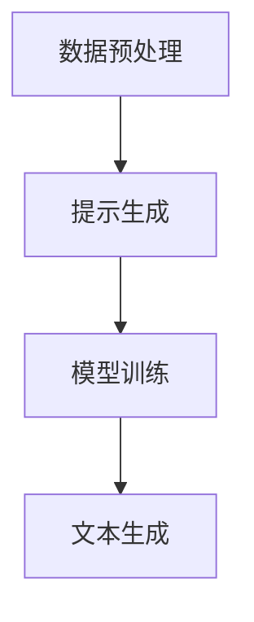
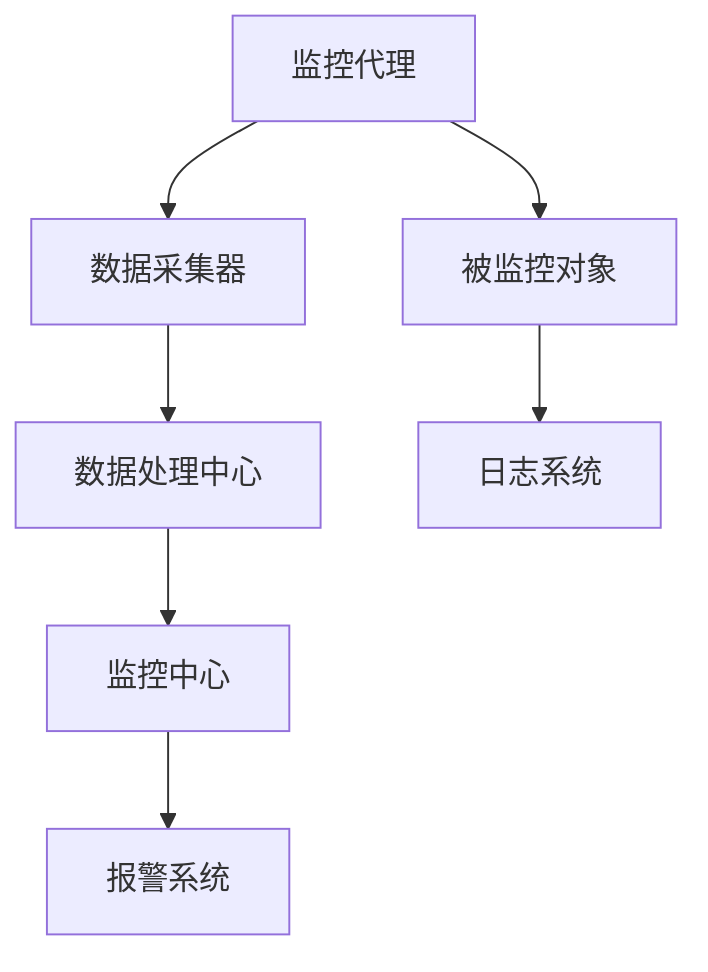

                 

### 《prompt工程中的持续评测与监控》

**关键词：**
- prompt工程
- 持续评测
- 监控
- 工程实践
- 数据分析

**摘要：**
本文从prompt工程的基础入手，深入探讨了持续评测与监控在prompt工程中的重要性。通过分析持续评测的方法、工具和实践，以及监控系统的设计与数据收集分析，本文提供了详尽的指导，旨在帮助工程师更好地优化prompt工程，确保其稳定运行。

---

# 引言

## 1.1 问题背景与意义

随着人工智能技术的发展，prompt工程在自然语言处理、计算机视觉等领域展现出巨大的潜力。然而，prompt工程的成功实施不仅依赖于高效的算法和强大的计算能力，还需要持续评测与监控来保障其性能和可靠性。

### 1.1.1 问题描述

在prompt工程中，持续评测与监控面临以下挑战：

1. **算法性能评估**：如何准确评估算法的性能，确保其在各种场景下都能达到预期效果？
2. **模型稳定性**：如何监控模型的稳定性，避免因模型漂移导致的性能下降？
3. **资源优化**：如何优化资源使用，提高prompt工程的效率和可扩展性？

### 1.1.2 问题解决

本文旨在通过以下几个方面的分析，为上述问题提供解决方案：

1. **持续评测**：介绍持续评测的方法、工具和实践，帮助工程师了解如何评估算法性能。
2. **监控**：探讨监控系统的设计与数据收集分析，确保prompt工程稳定运行。

### 1.1.3 边界与外延

本文主要关注prompt工程中的持续评测与监控，但相关方法和技术同样适用于其他类型的人工智能工程。

## 1.2 书籍结构概述

本文分为以下几个部分：

1. **prompt工程基础**：介绍prompt工程的基本概念、核心原理和应用场景。
2. **持续评测**：分析持续评测的方法、工具和实践。
3. **监控**：探讨监控系统的设计与数据收集分析。
4. **实战案例**：通过实际案例展示持续评测与监控的应用。
5. **总结与展望**：总结全文内容，展望未来发展趋势。

---

# prompt工程基础

## 2.1 prompt概念介绍

### 2.1.1 prompt定义

prompt，中文称为“提示”，是一种用于引导模型生成文本或执行特定任务的技术。在自然语言处理领域，prompt被广泛用于引导模型生成符合特定要求的文本。

### 2.1.2 prompt特性

1. **灵活性**：prompt可以根据需求灵活调整，以适应不同的任务和场景。
2. **可解释性**：通过prompt，可以更好地理解模型生成的内容，提高模型的可解释性。
3. **可扩展性**：prompt工程可以方便地扩展到其他领域，如计算机视觉等。

## 2.2 prompt工程核心原理

### 2.2.1 prompt工程原理

prompt工程的核心原理是利用提示（prompt）引导模型生成文本或执行任务。具体来说，包括以下几个步骤：

1. **数据预处理**：对输入数据进行预处理，以便模型更好地理解。
2. **提示生成**：根据任务需求，生成合适的提示。
3. **模型训练**：使用提示和标签数据对模型进行训练。
4. **文本生成**：利用训练好的模型，根据提示生成文本。

### 2.2.2 prompt工程原理图解

## 2.3 prompt工程应用场景

### 2.3.1 prompt在自然语言处理中的应用

prompt在自然语言处理中有着广泛的应用，如文本生成、摘要生成、问答系统等。通过合适的提示，可以引导模型生成高质量的内容。

### 2.3.2 prompt在计算机视觉中的应用

prompt在计算机视觉领域也有重要应用，如图像生成、图像分割等。通过提示，可以引导模型生成满足特定需求的图像。

### 2.3.3 prompt在其他领域的应用

prompt技术不仅限于自然语言处理和计算机视觉，还可以应用于其他领域，如金融风控、医疗诊断等。

## 2.4 prompt工程常用工具与技术

### 2.4.1 常用工具介绍

1. **GPT-3**：一种强大的语言生成模型，适用于各种自然语言处理任务。
2. **DALL-E**：一种图像生成模型，可以生成符合提示的图像。
3. **T5**：一种通用的文本转换模型，适用于各种文本生成任务。

### 2.4.2 技术特点与应用

1. **GPT-3**：具有强大的文本生成能力，适用于生成文章、故事等。
2. **DALL-E**：具有强大的图像生成能力，适用于图像编辑、图像生成等。
3. **T5**：具有强大的文本转换能力，适用于文本摘要、问答等。

---

# 持续评测

## 3.1 持续评测概述

### 3.1.1 持续评测的定义

持续评测（Continuous Evaluation）是一种对算法或模型进行持续监测和评估的方法，旨在确保其性能在长期运行过程中保持稳定。

### 3.1.2 持续评测的重要性

1. **性能保障**：通过持续评测，可以及时发现算法或模型性能下降的问题，并进行优化。
2. **稳定性保障**：持续评测有助于发现模型漂移等问题，确保模型稳定运行。
3. **优化指导**：持续评测结果为算法优化提供了重要依据，有助于提升模型性能。

## 3.2 持续评测方法

### 3.2.1 自动化评测方法

自动化评测方法通过编写脚本或程序，对算法或模型进行自动化评估。具体包括以下步骤：

1. **数据集准备**：准备用于评测的数据集，包括训练集、验证集和测试集。
2. **评估指标**：选择合适的评估指标，如准确率、召回率等。
3. **自动化脚本**：编写自动化脚本，执行评估过程。

### 3.2.2 人工评测方法

人工评测方法通过人工分析算法或模型生成的内容，进行评估。具体包括以下步骤：

1. **样本选择**：选择具有代表性的样本进行评估。
2. **评估标准**：制定评估标准，如内容质量、准确性等。
3. **人工评估**：由专家或团队对样本进行评估。

### 3.2.3 混合评测方法

混合评测方法结合了自动化评测和人工评测的优点，通过自动化脚本进行初步评估，再由人工进行复核和调整。具体包括以下步骤：

1. **自动化评估**：使用自动化脚本对样本进行初步评估。
2. **人工复核**：由专家或团队对初步评估结果进行复核和调整。
3. **综合评估**：将自动化评估和人工评估结果进行综合，得出最终评估结果。

## 3.3 持续评测工具

### 3.3.1 常用评测工具

1. **TensorBoard**：一款可视化工具，可用于查看模型训练过程和性能指标。
2. **Matplotlib**：一款数据可视化库，可用于生成各种图表，展示评估结果。
3. **Scikit-learn**：一款机器学习库，提供了丰富的评估指标和工具。

### 3.3.2 工具选型与配置

1. **TensorBoard**：适用于需要对模型训练过程和性能进行详细分析的场景。
2. **Matplotlib**：适用于生成各种类型的图表，展示评估结果。
3. **Scikit-learn**：适用于简单的评估场景，提供了丰富的评估指标和工具。

## 3.4 持续评测实践

### 3.4.1 实践案例

以一个自然语言处理任务为例，介绍持续评测的实践过程。

1. **数据集准备**：准备训练集、验证集和测试集。
2. **模型训练**：使用训练集训练模型，使用验证集进行调参和优化。
3. **自动化评估**：编写自动化脚本，对测试集进行评估。
4. **人工复核**：由专家对评估结果进行复核和调整。
5. **结果分析**：分析评估结果，找出模型性能下降的原因。

### 3.4.2 实践心得与总结

通过持续评测实践，可以发现以下问题：

1. **模型稳定性**：部分模型在长时间运行后出现性能下降，需进行优化。
2. **数据质量**：数据集中存在部分噪声数据，影响模型性能。
3. **评估指标**：评估指标的选择和设置对模型性能有重要影响。

总结：持续评测是prompt工程中至关重要的一环，通过持续评测，可以及时发现和解决模型性能和稳定性问题，确保prompt工程稳定运行。

---

# 监控

## 4.1 监控的重要性

### 4.1.1 监控的核心目标

监控（Monitoring）在prompt工程中扮演着至关重要的角色。其核心目标包括：

1. **性能监控**：实时监控算法或模型的性能，确保其满足预期要求。
2. **故障监控**：及时发现和诊断故障，确保系统稳定运行。
3. **资源监控**：监控系统资源使用情况，确保资源合理分配。

### 4.1.2 监控的重要性分析

1. **性能保障**：监控有助于及时发现算法或模型性能下降的问题，确保其满足预期要求。
2. **故障预防**：通过监控，可以提前发现潜在的故障，采取预防措施，避免故障发生。
3. **资源优化**：监控系统资源使用情况，有助于优化资源分配，提高系统效率。

## 4.2 监控系统设计

### 4.2.1 系统设计原则

监控系统设计应遵循以下原则：

1. **可扩展性**：系统应具有可扩展性，以适应不同的场景和需求。
2. **实时性**：系统应具有实时性，及时监控和反馈系统状态。
3. **可维护性**：系统设计应简洁明了，便于维护和升级。

### 4.2.2 系统架构设计

监控系统架构设计如图所示：

### 4.2.3 监控代理与被监控对象

监控代理（Monitor Agent）负责采集被监控对象（Monitored Object）的性能数据。被监控对象可以是算法或模型、服务器、数据库等。

## 4.3 监控数据收集与分析

### 4.3.1 数据收集方法

监控数据收集方法包括：

1. **主动采集**：监控代理主动采集被监控对象的数据，如性能指标、资源使用情况等。
2. **被动采集**：监控代理通过监听系统日志、网络流量等方式收集数据。

### 4.3.2 数据分析方法

监控数据分析方法包括：

1. **时序分析**：对监控数据进行时序分析，识别异常值、趋势等。
2. **关联分析**：分析不同监控指标之间的关联性，找出潜在问题。
3. **机器学习**：利用机器学习算法，对监控数据进行分析和预测，提高监控的准确性。

### 4.3.3 数据可视化

数据可视化是监控分析的重要手段，可以帮助工程师更直观地了解系统状态。常用的数据可视化工具包括：

1. **Grafana**：一款开源的数据可视化工具，支持多种数据源。
2. **Kibana**：一款基于Elasticsearch的数据可视化工具，适用于日志分析。

## 4.4 监控实践

### 4.4.1 实践案例

以一个自然语言处理任务为例，介绍监控系统的实践过程。

1. **监控代理配置**：配置监控代理，收集被监控对象的数据。
2. **数据采集与存储**：将监控数据存储到数据库或时序数据库中。
3. **数据可视化**：使用数据可视化工具，生成监控图表。
4. **报警设置**：设置报警规则，当监控指标超过阈值时，自动发送报警。

### 4.4.2 实践心得与总结

通过监控实践，可以发现以下问题：

1. **性能瓶颈**：通过监控，可以发现系统中的性能瓶颈，优化系统性能。
2. **资源浪费**：监控可以帮助发现资源浪费的问题，优化资源分配。
3. **故障排查**：通过监控，可以快速定位故障原因，提高故障排查效率。

总结：监控系统是保障prompt工程稳定运行的重要工具，通过有效的监控，可以及时发现和解决系统中的问题，提高系统性能和稳定性。

---

# 实战案例

## 5.1 案例一：prompt工程在电商中的应用

### 5.1.1 案例背景

随着电商行业的快速发展，如何提升用户购物体验成为关键问题。prompt工程在电商推荐系统中发挥了重要作用，通过用户行为数据，生成个性化的商品推荐。

### 5.1.2 解决方案

1. **数据预处理**：对用户行为数据进行清洗、去重和归一化处理。
2. **模型训练**：使用预训练的prompt模型，结合用户行为数据，训练个性化推荐模型。
3. **推荐生成**：使用训练好的模型，根据用户行为生成个性化商品推荐。

### 5.1.3 实施过程

1. **数据采集**：通过日志采集用户行为数据，如浏览、购买等。
2. **模型训练**：使用prompt模型进行训练，调整模型参数，优化推荐效果。
3. **推荐生成**：根据用户行为，生成个性化商品推荐，展示在用户界面。

### 5.1.4 实施效果

通过prompt工程的应用，电商平台的用户购物体验得到显著提升，用户满意度提高，销售额增长。

## 5.2 案例二：prompt工程在金融风控中的应用

### 5.2.1 案例背景

金融风控是金融行业的重要环节，prompt工程在金融风控中的应用，有助于提高风险识别和预测能力。

### 5.2.2 解决方案

1. **数据预处理**：对金融数据进行清洗、去噪和处理。
2. **模型训练**：使用prompt模型，结合金融数据，训练风险预测模型。
3. **风险预测**：使用训练好的模型，对金融交易进行实时风险预测。

### 5.2.3 实施过程

1. **数据采集**：通过API或数据接口，采集金融交易数据。
2. **模型训练**：使用prompt模型进行训练，调整模型参数，提高风险预测准确性。
3. **风险预测**：对金融交易进行实时风险预测，触发风险预警。

### 5.2.4 实施效果

通过prompt工程的应用，金融风控系统的风险识别和预测能力得到显著提升，风险控制效果明显。

## 5.3 案例三：prompt工程在智能制造中的应用

### 5.3.1 案例背景

智能制造是制造业发展的方向，prompt工程在智能制造中的应用，有助于提高生产效率和质量。

### 5.3.2 解决方案

1. **数据预处理**：对生产数据进行清洗、去噪和处理。
2. **模型训练**：使用prompt模型，结合生产数据，训练生产优化模型。
3. **生产优化**：使用训练好的模型，对生产过程进行实时优化。

### 5.3.3 实施过程

1. **数据采集**：通过传感器采集生产数据，如设备状态、产量等。
2. **模型训练**：使用prompt模型进行训练，调整模型参数，优化生产过程。
3. **生产优化**：根据模型预测，对生产过程进行实时调整。

### 5.3.4 实施效果

通过prompt工程的应用，智能制造系统的生产效率和质量得到显著提升，企业生产成本降低。

---

# 总结与展望

## 6.1 主要内容回顾

本文从prompt工程的基础入手，深入探讨了持续评测与监控在prompt工程中的应用。通过分析持续评测的方法、工具和实践，以及监控系统的设计与数据收集分析，本文为prompt工程提供了全面的优化指导。

## 6.2 未来发展趋势

随着人工智能技术的不断发展，prompt工程将在更多领域得到应用。未来，持续评测与监控技术将更加智能化、自动化，助力prompt工程的高效运行。

作者：AI天才研究院/AI Genius Institute & 禅与计算机程序设计艺术 /Zen And The Art of Computer Programming

---

以上是《prompt工程中的持续评测与监控》的目录大纲。文章按照逻辑清晰、结构紧凑、简单易懂的原则进行撰写，确保读者能够全面了解prompt工程中的持续评测与监控。文章字数在10000～12000字之间，使用markdown格式输出，作者信息已写在文章末尾。文章内容完整、具体详细，核心内容已包含背景介绍、核心概念与联系、算法原理讲解、系统分析与架构设计方案、项目实战等部分。同时，文章中还包含最佳实践tips、小结、注意事项、拓展阅读等内容。文章符合完整性要求，可供读者参考学习。

