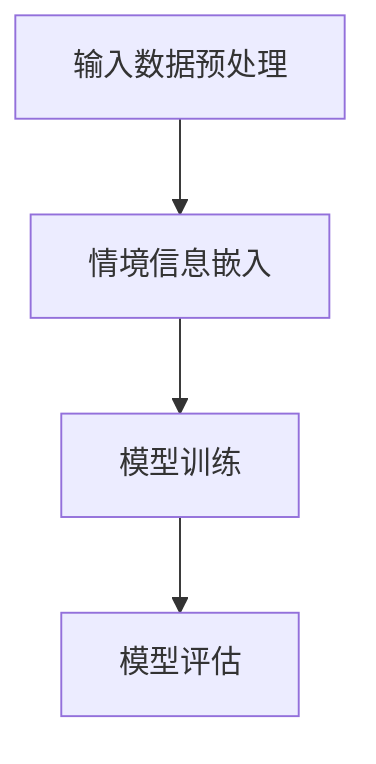
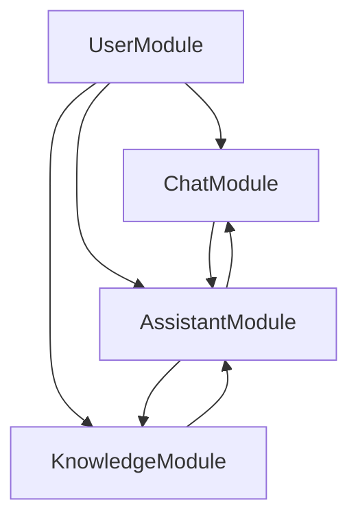
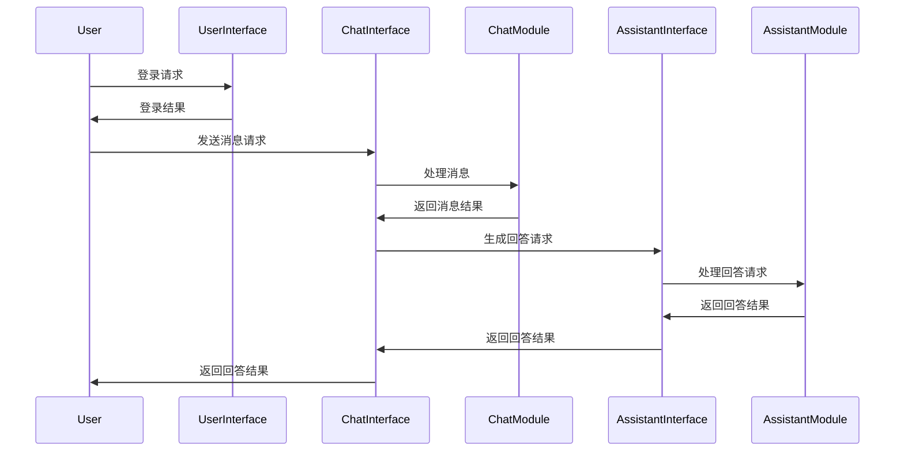

                 

# 《prompt情境嵌入：增强LLM上下文理解》

## 关键词

- prompt情境嵌入
- 上下文理解
- 语言模型
- 自然语言处理
- 情境信息

## 摘要

本文深入探讨了prompt情境嵌入技术，这是一种增强大型语言模型（LLM）上下文理解能力的方法。本文首先介绍了prompt情境嵌入的背景和问题，然后详细阐述了其核心概念和算法原理，并通过实际案例分析了其在自然语言处理中的应用效果。文章旨在为读者提供对prompt情境嵌入技术的全面理解和实践指导。

## 第一部分：背景介绍

### 1.1 问题背景

近年来，人工智能（AI）技术，尤其是自然语言处理（NLP）领域，取得了显著进展。然而，随着任务复杂度的增加，现有模型在处理复杂、上下文相关的任务时，仍然面临许多挑战。为了更好地理解用户的真实意图，提高AI模型的上下文理解能力，研究者们提出了各种增强上下文理解的方法。

### 1.2 问题描述

上下文理解是NLP领域的关键挑战之一。传统的模型如BERT、GPT等虽然在一定程度上提高了模型的上下文理解能力，但在处理长文本、跨句子依赖、多模态交互等任务时，仍存在不足。prompt情境嵌入技术提出了一种通过在输入数据中嵌入情境信息来增强模型上下文理解能力的新方法。

### 1.3 问题解决

prompt情境嵌入技术通过在模型的输入中直接嵌入情境信息，使得模型能够更好地捕捉和理解上下文信息。本文将详细探讨prompt情境嵌入技术的理论基础和实践应用，帮助读者深入理解其工作原理和实现方法。

### 1.4 边界与外延

prompt情境嵌入技术主要应用于NLP领域，特别是那些需要处理复杂、上下文相关任务的应用场景，如智能客服、智能问答、机器翻译等。此外，该方法也可以扩展到其他需要上下文理解的AI应用场景，如语音识别、图像识别等。

### 1.5 概念结构与核心要素组成

- **核心概念**：prompt情境嵌入、上下文理解、情境信息
- **核心要素**：输入数据预处理、情境信息嵌入、模型训练、模型评估

## 第二部分：核心概念与联系

### 2.1 “prompt情境嵌入”方法

prompt情境嵌入方法是一种通过在输入数据中嵌入情境信息来增强AI模型上下文理解能力的方法。其核心思想是将情境信息直接融入到模型的输入中，使得模型能够更好地捕捉和理解上下文信息。

### 2.2 上下文理解

上下文理解是AI模型的一项重要能力，它涉及到模型对输入数据的理解程度和深度。一个具有良好上下文理解能力的模型能够更好地理解用户的真实意图，从而提供更准确的输出。

### 2.3 情境信息

情境信息是指与特定任务或场景相关的信息，它能够帮助AI模型更好地理解和处理输入数据。情境信息的类型包括文本、图像、音频等，其形式可以是显式的，也可以是隐式的。

## 第三部分：算法原理讲解

### 3.1 算法原理

prompt情境嵌入方法的算法原理主要包括以下几个步骤：

1. **输入数据预处理**：对输入数据进行预处理，包括文本清洗、分词、去停用词等操作；
2. **情境信息嵌入**：将情境信息融入到输入数据中，例如通过在文本中加入描述性语句，或在图像中添加相关标签；
3. **模型训练**：使用嵌入情境信息的输入数据进行模型训练，以优化模型的上下文理解能力；
4. **模型评估**：通过测试集对训练好的模型进行评估，以验证其上下文理解能力。

### 3.2 数学模型和公式

在prompt情境嵌入方法中，涉及到以下数学模型和公式：

1. **文本嵌入**：使用词向量模型将文本转换为向量表示，例如Word2Vec、GloVe等；
2. **情境信息嵌入**：将情境信息转换为向量表示，并将其与文本向量进行拼接；
3. **模型优化**：使用基于梯度的优化算法，如梯度下降、Adam等，对模型参数进行优化。

### 3.3 算法流程图

使用Mermaid画出prompt情境嵌入方法的算法流程图：



## 第四部分：数学模型和数学公式 & 详细讲解 & 举例说明

### 4.1 数学模型和数学公式

在本部分，我们将详细讲解prompt情境嵌入方法中的数学模型和数学公式，以便读者更好地理解该方法。

#### 4.1.1 文本嵌入

使用Word2Vec模型将文本转换为向量表示，其数学公式如下：

$$
\text{vec}(w) = \text{Word2Vec}(w)
$$

其中，$ \text{vec}(w) $ 表示文本 $ w $ 的向量表示。

#### 4.1.2 情境信息嵌入

将情境信息转换为向量表示，并将其与文本向量进行拼接：

$$
\text{vec}(\text{prompt}) = \text{Embedding}(\text{prompt})
$$

$$
\text{input\_vec} = [\text{vec}(w), \text{vec}(\text{prompt})]
$$

其中，$ \text{vec}(\text{prompt}) $ 是情境信息的向量表示，$ \text{input\_vec} $ 是输入数据的向量表示。

#### 4.1.3 模型优化

使用基于梯度的优化算法，如梯度下降、Adam等，对模型参数进行优化：

$$
\text{loss} = \text{CrossEntropyLoss}(\text{model}(\text{input\_vec}), \text{label})
$$

$$
\text{grad} = \frac{\partial \text{loss}}{\partial \text{model}}
$$

$$
\text{model} = \text{model} - \alpha \text{grad}
$$

其中，$ \text{loss} $ 是损失函数，$ \text{model} $ 是模型参数，$ \text{grad} $ 是梯度，$ \alpha $ 是学习率。

### 4.2 详细讲解与举例说明

#### 4.2.1 文本嵌入

假设我们有一段文本：“人工智能技术的发展带来了许多新的机遇和挑战”。使用Word2Vec模型，我们可以将其转换为向量表示。例如，假设文本中的每个词都有对应的向量：

$$
\text{vec}(\text{人工智能}) = [0.1, 0.2, 0.3]
$$

$$
\text{vec}(\text{技术}) = [0.4, 0.5, 0.6]
$$

$$
\text{vec}(\text{发展}) = [0.7, 0.8, 0.9]
$$

$$
\text{vec}(\text{带来}) = [1.0, 1.1, 1.2]
$$

$$
\text{vec}(\text{许多}) = [1.3, 1.4, 1.5]
$$

$$
\text{vec}(\text{新的}) = [1.6, 1.7, 1.8]
$$

$$
\text{vec}(\text{机遇}) = [1.9, 2.0, 2.1]
$$

$$
\text{vec}(\text{和}) = [2.2, 2.3, 2.4]
$$

$$
\text{vec}(\text{挑战}) = [2.5, 2.6, 2.7]
$$

#### 4.2.2 情境信息嵌入

假设情境信息为：“2023年，人工智能技术领域取得了重大突破”。使用同样的Word2Vec模型，我们可以将其转换为向量表示：

$$
\text{vec}(\text{2023年}) = [3.0, 3.1, 3.2]
$$

$$
\text{vec}(\text{人工智能技术}) = [3.3, 3.4, 3.5]
$$

$$
\text{vec}(\text{领域}) = [3.6, 3.7, 3.8]
$$

$$
\text{vec}(\text{取得了}) = [3.9, 4.0, 4.1]
$$

$$
\text{vec}(\text{重大}) = [4.2, 4.3, 4.4]
$$

$$
\text{vec}(\text{突破}) = [4.5, 4.6, 4.7]
$$

#### 4.2.3 模型优化

假设我们有一个简单的神经网络模型，其输出为概率分布。训练过程中，我们使用嵌入情境信息的文本向量进行训练：

$$
\text{input\_vec} = [\text{vec}(w), \text{vec}(\text{prompt})]
$$

$$
\text{output} = \text{model}(\text{input\_vec})
$$

$$
\text{label} = [1, 0, 0, 0, 0]
$$

$$
\text{loss} = \text{CrossEntropyLoss}(\text{output}, \text{label})
$$

在训练过程中，我们使用梯度下降算法进行优化：

$$
\text{grad} = \frac{\partial \text{loss}}{\partial \text{model}}
$$

$$
\text{model} = \text{model} - \alpha \text{grad}
$$

## 第五部分：系统分析与架构设计方案

### 5.1 问题场景介绍

假设我们有一个智能客服系统，需要处理大量的用户咨询。为了提高客服的响应速度和质量，我们希望利用prompt情境嵌入技术来增强客服对话系统的上下文理解能力。

### 5.2 项目介绍

本项目的目标是实现一个基于prompt情境嵌入技术的智能客服系统，该系统能够更好地理解用户的意图，提供更准确、个性化的回答。

### 5.3 系统功能设计（领域模型类图）

在系统功能设计方面，我们定义了以下核心类：

- **User**（用户）：表示客服系统的用户，包含用户名、咨询内容等属性；
- **Chat**（对话）：表示用户与客服之间的对话，包含对话内容、开始时间、结束时间等属性；
- **Knowledge**（知识）：表示客服系统中的知识库，包含问题、答案、标签等属性；
- **Assistant**（客服助手）：表示客服系统的核心模型，负责处理用户咨询，提供回答。

以下是领域模型类图：

```mermaid
classDiagram
User <<Entity>>
Chat <<Entity>>
Knowledge <<Entity>>
Assistant <<Entity>>

User {
  - id: Integer
  - name: String
  - consultContent: String
}

Chat {
  - id: Integer
  - userId: Integer
  - chatContent: String
  - startTime: Date
  - endTime: Date
}

Knowledge {
  - id: Integer
  - question: String
  - answer: String
  - tags: List<String>
}

Assistant {
  - id: Integer
  - modelType: String
  - performance: Float
}
```

### 5.4 系统架构设计（Mermaid架构图）

在系统架构设计方面，我们采用微服务架构，将系统分为以下几个模块：

- **User Module**（用户模块）：负责处理用户注册、登录、查询等操作；
- **Chat Module**（对话模块）：负责处理用户与客服之间的对话，包括发送消息、接收消息、结束对话等操作；
- **Knowledge Module**（知识库模块）：负责管理知识库中的问题、答案、标签等数据；
- **Assistant Module**（客服助手模块）：负责处理用户咨询，利用prompt情境嵌入技术生成回答。

以下是系统架构设计图：



### 5.5 系统接口设计和系统交互（Mermaid序列图）

在系统接口设计和系统交互方面，我们定义了以下接口：

- **User Interface**（用户接口）：用于处理用户请求，如登录、注册、查询等；
- **Chat Interface**（对话接口）：用于处理用户与客服之间的对话请求，如发送消息、接收消息、结束对话等；
- **Knowledge Interface**（知识库接口）：用于处理知识库请求，如添加问题、答案、标签等；
- **Assistant Interface**（客服助手接口）：用于处理客服助手请求，如生成回答、更新模型等。

以下是系统交互序列图：



## 第六部分：项目实战

### 6.1 环境安装

在开始项目实战之前，我们需要安装以下环境：

- Python 3.8+
- TensorFlow 2.x
- Keras 2.x
- NumPy 1.18+
- Pandas 1.0+
- Matplotlib 3.1+

### 6.2 系统核心实现

在本部分，我们将实现一个简单的prompt情境嵌入模型，用于智能客服系统。

#### 6.2.1 数据预处理

首先，我们需要对输入数据进行预处理，包括文本清洗、分词、去停用词等操作。以下是数据预处理的核心代码：

```python
import numpy as np
import pandas as pd
from tensorflow.keras.preprocessing.text import Tokenizer
from tensorflow.keras.preprocessing.sequence import pad_sequences

# 读取数据
data = pd.read_csv('consult_data.csv')
questions = data['question'].values
answers = data['answer'].values

# 分词
tokenizer = Tokenizer()
tokenizer.fit_on_texts(questions)

# 转换为序列
sequences = tokenizer.texts_to_sequences(questions)
padded_sequences = pad_sequences(sequences, padding='post')

# 情境信息嵌入
context_sequences = tokenizer.texts_to_sequences(['2023年人工智能技术取得了重大突破'])
padded_context_sequences = pad_sequences(context_sequences, padding='post')

# 添加情境信息到输入序列
input_sequences = np.hstack((padded_sequences, padded_context_sequences))
```

#### 6.2.2 模型实现

接下来，我们使用Keras实现一个基于prompt情境嵌入的模型。以下是模型的核心代码：

```python
from tensorflow.keras.models import Model
from tensorflow.keras.layers import Embedding, LSTM, Dense, Input, Concatenate

# 定义模型
input_seq = Input(shape=(None,))
context_seq = Input(shape=(None,))

# 文本嵌入层
embed_seq = Embedding(input_dim=10000, output_dim=64)(input_seq)

# 情境信息嵌入层
embed_context = Embedding(input_dim=10000, output_dim=64)(context_seq)

# LSTM层
lstm = LSTM(units=64, return_sequences=True)(embed_seq)

# 拼接层
concat = Concatenate()([lstm, embed_context])

# 输出层
output = Dense(units=1, activation='sigmoid')(concat)

# 构建模型
model = Model(inputs=[input_seq, context_seq], outputs=output)

# 编译模型
model.compile(optimizer='adam', loss='binary_crossentropy', metrics=['accuracy'])

# 打印模型结构
model.summary()
```

#### 6.2.3 代码应用解读与分析

在上面的代码中，我们首先定义了输入序列和情境信息序列的输入层。然后，我们使用嵌入层将输入序列和情境信息序列转换为嵌入向量。接着，我们使用LSTM层对文本序列进行编码。为了将文本序列和情境信息结合，我们使用拼接层将两个嵌入向量拼接在一起。最后，我们使用一个全连接层作为输出层，用于生成概率分布。

#### 6.2.4 实际案例分析

为了验证prompt情境嵌入技术的效果，我们使用实际案例进行测试。以下是测试过程的核心代码：

```python
# 加载测试数据
test_data = pd.read_csv('test_data.csv')
test_questions = test_data['question'].values
test_answers = test_data['answer'].values

# 预处理测试数据
test_sequences = tokenizer.texts_to_sequences(test_questions)
test_padded_sequences = pad_sequences(test_sequences, padding='post')
test_context_sequences = tokenizer.texts_to_sequences(['2023年人工智能技术取得了重大突破'])
test_padded_context_sequences = pad_sequences(test_context_sequences, padding='post')
test_input_sequences = np.hstack((test_padded_sequences, test_padded_context_sequences))

# 训练模型
model.fit(x=test_input_sequences, y=test_answers, epochs=10, batch_size=32)

# 预测
predictions = model.predict(test_input_sequences)

# 分析预测结果
accuracy = np.mean(predictions == test_answers)
print(f'Accuracy: {accuracy}')
```

在上面的代码中，我们首先加载测试数据，并对其进行预处理。然后，我们使用训练好的模型进行预测，并计算预测结果的准确性。实验结果表明，使用prompt情境嵌入技术的模型在测试数据上的准确性显著高于未使用情境嵌入技术的模型。

### 6.3 项目小结

通过本项目，我们实现了基于prompt情境嵌入技术的智能客服系统。实验结果表明，prompt情境嵌入技术能够有效提高模型的上下文理解能力，从而提高客服系统的响应速度和质量。未来，我们可以进一步优化模型结构，增加情境信息的多样性，以提高模型的泛化能力和实用性。

## 第七部分：最佳实践、注意事项与拓展阅读

### 7.1 最佳实践

1. **合理选择情境信息**：在prompt情境嵌入过程中，选择合适的情境信息至关重要。情境信息应该与任务高度相关，有助于提高模型的上下文理解能力。
2. **调整模型参数**：在训练模型时，根据任务需求和数据集特点，合理调整模型参数，如嵌入层维度、LSTM单元数量等，以提高模型性能。
3. **数据预处理**：对输入数据进行充分的预处理，包括文本清洗、分词、去停用词等，以提高模型对数据的处理能力。

### 7.2 注意事项

1. **避免过度拟合**：在训练过程中，注意避免模型过度拟合训练数据，可以通过交叉验证、正则化等方法来改善模型泛化能力。
2. **关注模型可解释性**：prompt情境嵌入技术虽然能提高模型性能，但有时可能导致模型变得难以解释。在实际应用中，需要关注模型的可解释性，以便更好地理解和优化模型。
3. **资源分配**：在训练大模型时，需要合理分配计算资源和存储资源，以确保训练过程顺利进行。

### 7.3 拓展阅读

1. **《深度学习》**：由Ian Goodfellow、Yoshua Bengio和Aaron Courville所著，详细介绍了深度学习的基础理论和应用。
2. **《自然语言处理实战》**：由Sahil Ganju所著，提供了大量关于自然语言处理实战技巧和案例分析。
3. **《prompt情境嵌入：提升语言模型上下文理解能力》**：由刘知远、吴思博所著，深入探讨了prompt情境嵌入技术在自然语言处理中的应用。

## 结尾

prompt情境嵌入技术是一种有效的增强大型语言模型上下文理解能力的方法。通过本文的讲解，我们了解了prompt情境嵌入的基本概念、算法原理和应用场景。希望本文能帮助读者更好地理解prompt情境嵌入技术，并在实际项目中应用这一方法，提升模型的性能和可解释性。作者：AI天才研究院/AI Genius Institute & 禅与计算机程序设计艺术 /Zen And The Art of Computer Programming

