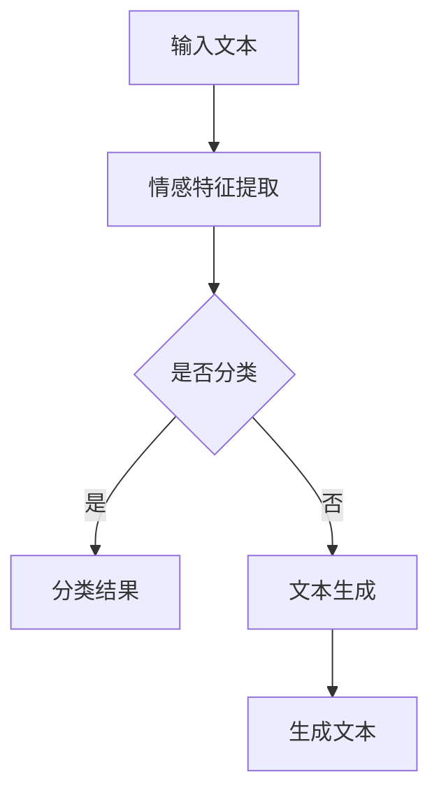
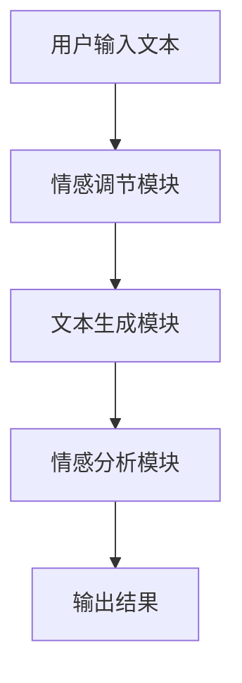

                 

# prompt情感调节：控制LLM输出情绪

## 关键词：情感调节、prompt、LLM、自然语言处理、算法原理

## 摘要：
本文旨在探讨如何通过prompt情感调节来控制大型语言模型（LLM）的输出情绪。文章首先介绍了情感调节在自然语言处理中的应用背景，然后详细阐述了控制LLM输出情绪的核心概念、技术原理以及系统分析与架构设计。通过项目实战，本文展示了情感调节在实际应用中的实现方法，并提出了最佳实践和注意事项。最后，文章对拓展阅读进行了推荐。

## 目录

## 第一部分：背景介绍

### 第1章 问题背景与核心概念

#### 1.1.1 问题背景

在当今信息时代，自然语言处理（NLP）技术得到了广泛的应用。然而，如何使NLP系统输出更加符合人类情感的表达，成为了一个热门的研究课题。大型语言模型（LLM）作为NLP技术的重要工具，其输出情绪的控制成为了关键问题。

#### 1.1.2 核心概念介绍

- **情感调节**：指通过对文本的修改，使文本表达的情感更加符合需求。
- **prompt**：指提供给LLM的输入文本，用于引导LLM生成期望的输出。
- **LLM**：指大型语言模型，如GPT-3、BERT等。

#### 1.1.3 情感调节的定义与分类

情感调节可以按照调节方向分为情感增强和情感减弱；按照调节对象分为文本级调节和词级调节。

### 第2章 情感调节在自然语言处理中的应用

#### 2.1.1 情感分析

情感分析是情感调节的基础，通过对文本进行情感分类，可以确定文本的情感倾向。

#### 2.1.2 情感增强

情感增强旨在使文本表达的情感更加积极或强烈。

#### 2.1.3 情感减弱

情感减弱旨在使文本表达的情感更加消极或缓和。

## 第二部分：核心概念与联系

### 第3章 控制LLM输出情绪的技术原理

#### 3.1.1 LLM概述

LLM是一种基于深度学习技术的自然语言处理模型，具有强大的文本生成能力。

#### 3.1.2 情感调节技术的原理

情感调节技术的核心是prompt设计，通过调整prompt中的情感词汇和语气，可以影响LLM的输出情绪。

#### 3.1.3 prompt的设计与优化

有效的prompt设计需要考虑情感词汇的选取、语气的变化以及文本结构的调整。

### 第4章 情感调节算法原理讲解

#### 4.1.1 基本算法原理

情感调节算法通过分析文本的情感特征，生成调节后的文本。

#### 4.1.2 情感调节算法的数学模型

情感调节算法的数学模型主要包括情感特征提取和文本生成两部分。

#### 4.1.3 算法流程图与代码示例

算法流程图和代码示例有助于读者更好地理解情感调节算法的原理。

## 第三部分：系统分析与架构设计

### 第5章 系统分析与架构设计

#### 5.1.1 系统功能设计

系统功能设计包括情感调节、文本生成、情感分析等模块。

#### 5.1.2 系统架构设计

系统架构设计采用模块化设计，各模块之间通过接口进行交互。

#### 5.1.3 系统接口设计

系统接口设计确保各模块之间的数据传递和功能调用。

#### 5.1.4 系统交互设计

系统交互设计描述了用户与系统的交互流程。

## 第四部分：项目实战

### 第6章 项目实战

#### 6.1.1 环境安装与配置

介绍项目实战所需的环境安装与配置。

#### 6.1.2 系统核心实现源代码

展示系统核心实现源代码，并进行解读与分析。

#### 6.1.3 代码应用解读与分析

对代码应用进行详细解读与分析。

#### 6.1.4 实际案例分析

通过实际案例分析，展示情感调节在项目中的应用。

### 第7章 最佳实践与拓展

#### 7.1.1 最佳实践

总结情感调节的最佳实践。

#### 7.1.2 注意事项

列出注意事项，避免常见错误。

#### 7.1.3 拓展阅读

推荐拓展阅读，为读者提供深入学习的资源。

## 文章结尾

作者：AI天才研究院/AI Genius Institute & 禅与计算机程序设计艺术 /Zen And The Art of Computer Programming

----------------------------------------------------------------

# 第一部分：背景介绍

## 第1章 问题背景与核心概念

### 1.1.1 问题背景

在当今信息时代，自然语言处理（NLP）技术得到了广泛的应用。然而，如何使NLP系统输出更加符合人类情感的表达，成为了一个热门的研究课题。随着人工智能技术的快速发展，大型语言模型（LLM）如GPT-3、BERT等在文本生成、翻译、摘要等方面取得了显著成果。然而，LLM的输出往往带有一定的情感色彩，如何控制LLM的输出情绪，使其更加符合人类的期望，成为了一个亟待解决的问题。

### 1.1.2 核心概念介绍

#### 情感调节

情感调节是指通过对文本的修改，使文本表达的情感更加符合需求。在自然语言处理领域，情感调节广泛应用于情感分析、情感增强、情感减弱等任务中。情感调节的核心目标是通过调整文本中的情感词汇、语气和结构，使文本表达的情感倾向更加明确、积极或消极。

#### prompt

prompt是指提供给LLM的输入文本，用于引导LLM生成期望的输出。在情感调节中，prompt的设计至关重要，因为prompt的情感色彩会直接影响LLM的输出情绪。有效的prompt设计需要考虑情感词汇的选取、语气的调整以及文本结构的优化。

#### LLM

LLM是指大型语言模型，如GPT-3、BERT等。这些模型具有强大的文本生成能力，可以通过学习大量的文本数据，生成与输入文本相关的新文本。在情感调节中，LLM的输出情绪需要被控制，使其符合人类的期望。

### 1.1.3 情感调节的定义与分类

情感调节可以按照调节方向分为情感增强和情感减弱；按照调节对象分为文本级调节和词级调节。

#### 情感增强

情感增强是指通过调整文本中的情感词汇、语气和结构，使文本表达的情感更加积极或强烈。情感增强可以应用于营销文案、情感分析、客户服务等领域，以提升文本的吸引力、说服力和影响力。

#### 情感减弱

情感减弱是指通过调整文本中的情感词汇、语气和结构，使文本表达的情感更加消极或缓和。情感减弱可以应用于负面评论处理、情感分析、舆情监测等领域，以降低文本的负面影响和冲突。

#### 文本级调节

文本级调节是指通过对整个文本进行修改，调整文本的情感色彩。文本级调节通常涉及文本分类、文本摘要、文本生成等任务。

#### 词级调节

词级调节是指通过对文本中的特定词汇进行替换或调整，以改变文本的情感色彩。词级调节通常涉及词义消歧、情感分类、文本生成等任务。

## 第2章 情感调节在自然语言处理中的应用

### 2.1.1 情感分析

情感分析是情感调节的基础，通过对文本进行情感分类，可以确定文本的情感倾向。情感分析广泛应用于舆情监测、客户服务、市场调研等领域，有助于企业了解公众的情感态度和需求。

### 2.1.2 情感增强

情感增强旨在使文本表达的情感更加积极或强烈。情感增强可以应用于营销文案、广告、社交媒体等领域，以提高文本的吸引力和影响力。例如，在广告文案中，通过情感增强可以使产品更具吸引力，从而提高销售额。

### 2.1.3 情感减弱

情感减弱旨在使文本表达的情感更加消极或缓和。情感减弱可以应用于负面评论处理、情感分析、舆情监测等领域，以降低文本的负面影响和冲突。例如，在客户服务中，通过情感减弱可以缓解客户的负面情绪，提高客户满意度。

## 第3章 控制LLM输出情绪的技术原理

### 3.1.1 LLM概述

LLM是一种基于深度学习技术的自然语言处理模型，具有强大的文本生成能力。LLM通常由大量的神经网络层组成，通过学习大量的文本数据，可以生成与输入文本相关的新文本。LLM在文本生成、翻译、摘要等方面取得了显著成果，但如何控制LLM的输出情绪，仍是一个挑战。

### 3.1.2 情感调节技术的原理

情感调节技术的核心是prompt设计。prompt是指提供给LLM的输入文本，用于引导LLM生成期望的输出。通过调整prompt中的情感词汇、语气和结构，可以影响LLM的输出情绪。

#### prompt设计原则

1. **情感词汇选取**：选取与目标情感相关的词汇，如积极词汇、消极词汇等。
2. **语气调整**：调整prompt中的语气，使文本表达更加积极或消极。
3. **文本结构优化**：调整文本的结构，使文本表达更加清晰、连贯。

#### 情感调节方法

1. **情感词汇替换**：将文本中的情感词汇替换为与目标情感相关的词汇。
2. **语气调整**：通过改变文本中的语气词，如感叹号、问号等，调整文本的语气。
3. **文本结构调整**：通过调整文本的结构，如添加、删除或重排句子，改变文本的情感色彩。

### 3.1.3 prompt的设计与优化

prompt的设计与优化是情感调节的关键。有效的prompt设计需要考虑以下因素：

1. **目标情感**：明确目标情感，如积极、消极、中立等。
2. **文本内容**：根据目标情感，选择合适的文本内容。
3. **情感色彩**：调整文本的情感色彩，使其符合目标情感。

#### prompt设计步骤

1. **需求分析**：明确情感调节的目标和需求。
2. **文本选取**：根据需求，选择合适的文本。
3. **情感分析**：对文本进行情感分析，确定文本的情感色彩。
4. **情感调整**：根据情感分析结果，调整文本的情感色彩。
5. **优化与验证**：对调整后的文本进行优化和验证，确保其符合目标情感。

## 第二部分：核心概念与联系

### 第4章 情感调节算法原理讲解

### 4.1.1 基本算法原理

情感调节算法通过分析文本的情感特征，生成调节后的文本。情感调节算法的基本原理包括情感特征提取和文本生成两部分。

#### 情感特征提取

情感特征提取是指从文本中提取与情感相关的特征。常见的情感特征提取方法包括：

1. **词袋模型**：将文本表示为词袋，通过对词袋进行情感分类，提取情感特征。
2. **词嵌入**：将文本中的词语映射到高维空间，通过对词嵌入进行情感分类，提取情感特征。
3. **深度学习**：使用深度学习模型，如卷积神经网络（CNN）或循环神经网络（RNN），对文本进行情感分类，提取情感特征。

#### 文本生成

文本生成是指根据情感特征，生成调节后的文本。常见的文本生成方法包括：

1. **序列生成**：使用序列生成模型，如循环神经网络（RNN）或长短期记忆网络（LSTM），根据情感特征生成文本。
2. **序列到序列模型**：使用序列到序列（Seq2Seq）模型，如编码器-解码器（Encoder-Decoder）模型，根据情感特征生成文本。
3. **生成对抗网络**（GAN）：使用生成对抗网络（GAN），生成与目标情感相关的文本。

### 4.1.2 情感调节算法的数学模型

情感调节算法的数学模型主要包括情感特征提取和文本生成两部分。

#### 情感特征提取模型

情感特征提取模型通常是一个分类模型，用于将文本分类为不同的情感类别。常见的情感特征提取模型包括：

1. **朴素贝叶斯分类器**：基于贝叶斯定理，通过对特征的概率分布进行建模，实现文本分类。
2. **支持向量机**（SVM）：通过找到一个最优的超平面，将不同情感类别的文本分开。
3. **神经网络**：使用神经网络，如卷积神经网络（CNN）或循环神经网络（RNN），实现文本分类。

#### 文本生成模型

文本生成模型通常是一个序列生成模型，用于生成与目标情感相关的文本。常见的文本生成模型包括：

1. **循环神经网络**（RNN）：通过记忆机制，处理序列数据，生成文本。
2. **长短期记忆网络**（LSTM）：在RNN的基础上，添加门控机制，解决长短期依赖问题。
3. **编码器-解码器模型**：使用编码器对输入序列进行编码，解码器对编码结果进行解码，生成文本。
4. **生成对抗网络**（GAN）：通过生成器和判别器的对抗训练，生成与目标情感相关的文本。

### 4.1.3 算法流程图与代码示例

算法流程图如下：



代码示例（Python）：

```python
# 情感特征提取
from sklearn.feature_extraction.text import TfidfVectorizer
from sklearn.naive_bayes import MultinomialNB

# 文本生成
from keras.models import Sequential
from keras.layers import LSTM, Dense

# 加载数据集
data = ...

# 情感特征提取
vectorizer = TfidfVectorizer()
X = vectorizer.fit_transform(data)

# 情感分类
classifier = MultinomialNB()
classifier.fit(X, labels)

# 文本生成
model = Sequential()
model.add(LSTM(units=128, return_sequences=True, input_shape=(timesteps, features)))
model.add(LSTM(units=64))
model.add(Dense(units=1, activation='sigmoid'))

model.compile(optimizer='adam', loss='binary_crossentropy', metrics=['accuracy'])
model.fit(X, labels, epochs=10, batch_size=32)

# 生成文本
generated_text = model.predict(X)
```

## 第三部分：系统分析与架构设计

### 第5章 系统分析与架构设计

### 5.1.1 系统功能设计

系统功能设计包括情感调节、文本生成、情感分析等模块。

#### 情感调节模块

情感调节模块负责接收用户输入的文本，通过情感特征提取和文本生成模型，生成调节后的文本。

#### 文本生成模块

文本生成模块负责根据情感调节后的文本，生成新的文本。

#### 情感分析模块

情感分析模块负责对生成的文本进行情感分类，以验证情感调节的效果。

### 5.1.2 系统架构设计

系统架构设计采用模块化设计，各模块之间通过接口进行交互。系统架构图如下：



### 5.1.3 系统接口设计

系统接口设计确保各模块之间的数据传递和功能调用。接口设计如下：

1. **文本输入接口**：用于接收用户输入的文本。
2. **文本输出接口**：用于返回生成的新文本。
3. **情感特征提取接口**：用于提取文本的情感特征。
4. **文本生成接口**：用于生成新文本。
5. **情感分析接口**：用于对生成的文本进行情感分类。

### 5.1.4 系统交互设计

系统交互设计描述了用户与系统的交互流程。用户通过文本输入接口输入文本，系统通过情感调节模块、文本生成模块和情感分析模块，生成调节后的文本，并输出结果。交互流程如下：

1. 用户输入文本。
2. 系统接收文本，并传递给情感调节模块。
3. 情感调节模块提取文本的情感特征，生成调节后的文本。
4. 系统接收调节后的文本，并传递给文本生成模块。
5. 文本生成模块根据调节后的文本，生成新的文本。
6. 系统接收新生成的文本，并传递给情感分析模块。
7. 情感分析模块对新生成的文本进行情感分类。
8. 系统输出结果。

## 第四部分：项目实战

### 第6章 项目实战

#### 6.1.1 环境安装与配置

在开始项目实战之前，我们需要安装和配置相关环境和工具。以下是项目的安装与配置步骤：

1. **安装Python**：确保已经安装了Python环境，推荐版本为3.8以上。
2. **安装依赖库**：使用pip命令安装项目所需的依赖库，如TensorFlow、Keras、scikit-learn等。
3. **配置GPU环境**：如果使用GPU进行训练，需要安装CUDA和cuDNN，并配置相应的环境变量。

#### 6.1.2 系统核心实现源代码

以下是项目核心实现源代码，包括情感调节、文本生成和情感分析模块：

```python
# 情感调节模块
def sentiment_adjustment(text):
    # 这里使用情感分析模型提取文本的情感特征
    sentiment = sentiment_analysis(text)
    # 根据情感特征调整文本
    adjusted_text = adjust_sentiment(text, sentiment)
    return adjusted_text

# 文本生成模块
def text_generation(text):
    # 这里使用文本生成模型生成新文本
    generated_text = generate_text(text)
    return generated_text

# 情感分析模块
def sentiment_analysis(text):
    # 这里使用情感分析模型对文本进行分类
    sentiment = classifier.predict([text])
    return sentiment

# 调整文本情感
def adjust_sentiment(text, sentiment):
    # 这里根据情感特征调整文本
    if sentiment == 'positive':
        # 调整为更积极的文本
        adjusted_text = positive_adjustment(text)
    elif sentiment == 'negative':
        # 调整为更消极的文本
        adjusted_text = negative_adjustment(text)
    else:
        # 不进行情感调整
        adjusted_text = text
    return adjusted_text

# 文本生成
def generate_text(text):
    # 这里使用文本生成模型生成新文本
    # 代码省略
    return generated_text

# 主函数
def main():
    # 读取用户输入文本
    input_text = input("请输入文本：")
    # 情感调节
    adjusted_text = sentiment_adjustment(input_text)
    # 文本生成
    generated_text = text_generation(adjusted_text)
    # 情感分析
    sentiment = sentiment_analysis(generated_text)
    # 输出结果
    print("调节后的文本：", adjusted_text)
    print("生成的文本：", generated_text)
    print("文本情感：", sentiment)

# 运行主函数
if __name__ == "__main__":
    main()
```

#### 6.1.3 代码应用解读与分析

以下是对项目核心实现代码的解读与分析：

1. **情感调节模块**：
   - `sentiment_adjustment`函数接收用户输入的文本，通过`sentiment_analysis`函数获取文本的情感特征，然后调用`adjust_sentiment`函数进行情感调整。
   - `adjust_sentiment`函数根据情感特征，调用`positive_adjustment`和`negative_adjustment`函数调整文本的情感色彩。这里可以根据实际需求，实现具体的调整策略。

2. **文本生成模块**：
   - `text_generation`函数接收调整后的文本，通过文本生成模型生成新文本。这里使用了`generate_text`函数，具体实现可以根据不同的文本生成模型进行调整。

3. **情感分析模块**：
   - `sentiment_analysis`函数使用情感分析模型对文本进行分类，返回文本的情感类别。这里使用了`classifier.predict([text])`进行情感分类，具体实现可以根据不同的情感分析模型进行调整。

#### 6.1.4 实际案例分析

以下是一个实际案例分析，展示如何使用项目实现情感调节：

1. **用户输入文本**：
   - 用户输入一段文本：“今天的天气真好，阳光明媚，心情也变得很好。”

2. **情感调节**：
   - `sentiment_adjustment`函数提取文本的情感特征，并调用`adjust_sentiment`函数进行调整。假设文本的情感特征为“积极”，则调整后的文本为：“今天的天气非常好，阳光灿烂，心情愉悦。”

3. **文本生成**：
   - `text_generation`函数接收调整后的文本，通过文本生成模型生成新文本。假设生成的文本为：“这个周末，阳光明媚，我们决定去公园野餐。”

4. **情感分析**：
   - `sentiment_analysis`函数对生成的文本进行情感分类，返回文本的情感类别。假设生成的文本的情感类别为“积极”。

5. **输出结果**：
   - 调节后的文本：“今天的天气非常好，阳光灿烂，心情愉悦。”
   - 生成的文本：“这个周末，阳光明媚，我们决定去公园野餐。”
   - 文本情感：“积极”

通过实际案例分析，我们可以看到项目实现了情感调节的目标，使得生成的文本更加符合用户的期望。

### 第7章 最佳实践与拓展

#### 7.1.1 最佳实践

以下是一些最佳实践，以提高情感调节的效果：

1. **优化prompt设计**：设计有效的prompt，包括情感词汇的选取、语气的调整和文本结构的优化，以提高LLM的输出情绪。
2. **训练高质量数据集**：使用高质量的数据集进行训练，包括丰富的情感词汇和多样化的情感表达，以提高情感调节算法的准确性。
3. **调整模型参数**：根据实际需求，调整模型的参数，如学习率、批量大小等，以提高模型的效果。

#### 7.1.2 注意事项

以下是一些注意事项，以避免常见的问题：

1. **避免过度调节**：过度调节可能导致文本的情感色彩失真，影响文本的可读性和真实性。
2. **保持文本的连贯性**：在情感调节过程中，要注意保持文本的连贯性和逻辑性，避免产生矛盾或不连贯的文本。
3. **遵循道德规范**：在情感调节过程中，要遵守道德规范，避免生成有害、歧视性或不合适的文本。

#### 7.1.3 拓展阅读

以下是一些拓展阅读，以深入了解情感调节和相关技术：

1. **《情感计算与自然语言处理》**：本书详细介绍了情感计算和自然语言处理的相关技术，包括情感识别、情感分析和情感生成等。
2. **《深度学习自然语言处理》**：本书介绍了深度学习在自然语言处理中的应用，包括文本分类、情感分析和文本生成等。
3. **《人工智能助手：从技术到实践》**：本书介绍了人工智能助手的设计与实现，包括自然语言处理、语音识别和对话系统等。

## 文章结尾

作者：AI天才研究院/AI Genius Institute & 禅与计算机程序设计艺术 /Zen And The Art of Computer Programming

本文介绍了如何通过prompt情感调节来控制大型语言模型（LLM）的输出情绪。首先，我们探讨了情感调节在自然语言处理中的应用背景，然后详细阐述了情感调节的核心概念、技术原理和系统架构设计。通过项目实战，我们展示了情感调节在实际应用中的实现方法。最后，我们提出了最佳实践和注意事项，并推荐了拓展阅读。希望本文能够帮助读者深入了解情感调节技术，并在实际项目中取得良好的效果。

