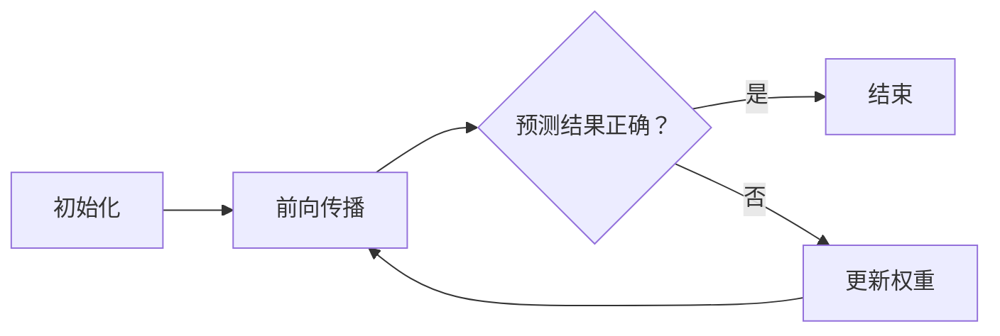
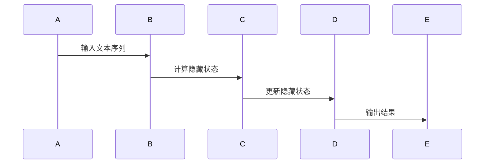
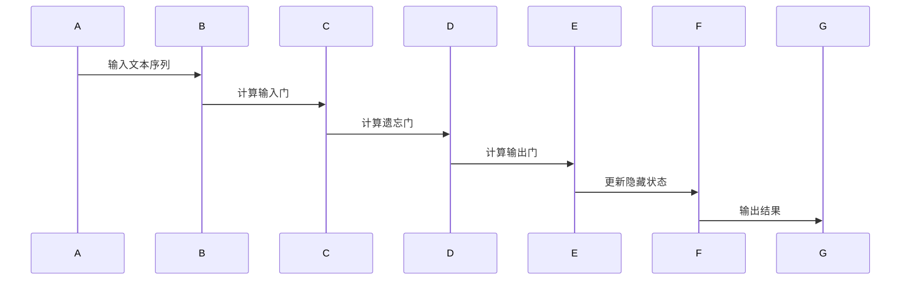
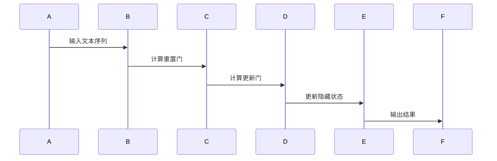
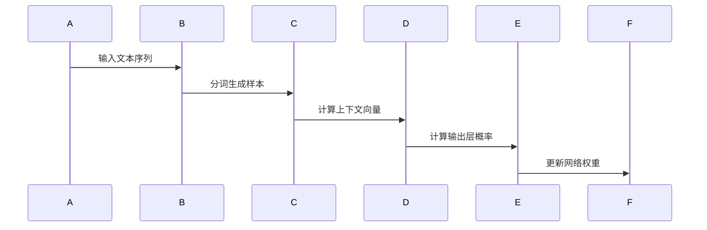
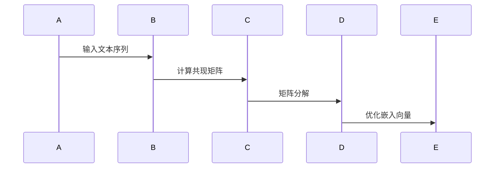
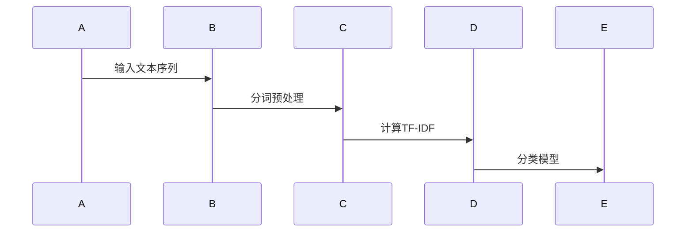
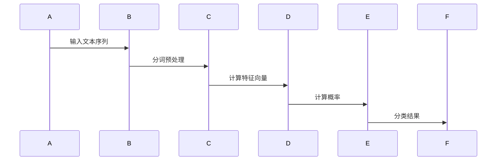
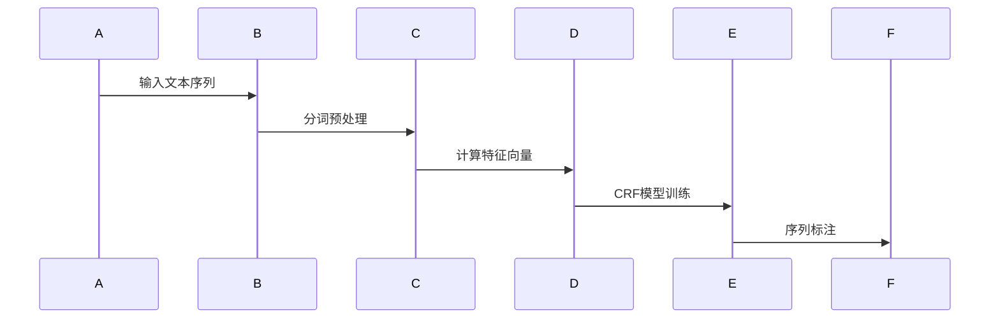
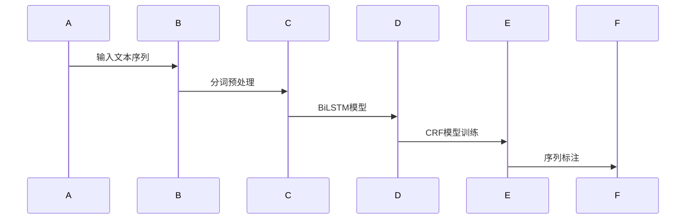

                 

### 引言与背景

#### 第1章: 引言

在当今信息技术飞速发展的时代，人工智能（AI）已成为推动社会进步的重要力量。其中，自然语言处理（NLP）作为AI领域的一个重要分支，其研究和应用日益广泛。prompt语义相似度分析，作为NLP中的一个关键任务，具有重要的实际应用价值。它不仅能够帮助我们理解和处理大量文本数据，还能够避免冗余，提高文本分析的质量和效率。

##### 1.1 问题背景

随着互联网和大数据的快速发展，文本数据呈现出爆炸式增长。如何有效地处理和分析这些数据，已经成为企业和研究人员面临的一大挑战。prompt语义相似度分析，旨在通过比较两个或多个文本片段的语义相似度，来判断它们是否表达相同或相近的含义。这一任务在信息检索、内容推荐、情感分析等领域有着广泛的应用。

##### 1.2 问题描述

prompt语义相似度分析的问题可以简单描述为：给定两个文本片段，如何判断它们之间的语义相似度？相似度的度量是一个核心问题，它直接影响到分析的准确性。

##### 1.3 问题解决

解决prompt语义相似度分析的问题，需要综合利用多种技术和方法。其中，深度学习和自然语言处理技术是关键。通过深度学习，我们可以自动提取文本中的特征，并进行相似度度量。自然语言处理技术则帮助我们更好地理解和处理文本数据。

##### 1.4 边界与外延

在讨论prompt语义相似度分析时，我们需要明确其边界和适用范围。首先，这一分析任务主要针对文本数据，对于非文本数据，如图片、声音等，则需要其他类型的分析技术。其次，相似度分析的结果并非绝对，而是相对的，它依赖于具体的应用场景和数据集。

##### 1.5 核心概念与联系

为了深入探讨prompt语义相似度分析，我们需要理解一些核心概念，如prompt语义、相似度度量方法、深度学习算法等。这些概念之间有着密切的联系，共同构成了一个完整的技术体系。

###### 1.5.1 核心概念原理

- **prompt语义**：prompt语义是指文本中的语言表达含义，它是进行相似度分析的基础。
- **相似度度量方法**：相似度度量方法用于量化文本之间的相似程度，常用的方法包括欧氏距离、余弦相似度等。
- **深度学习算法**：深度学习算法，如神经网络、循环神经网络（RNN）、长短时记忆网络（LSTM）等，可以用于自动提取文本特征，并进行相似度度量。

###### 1.5.2 概念属性特征对比表格

| 概念       | 特点                           | 应用领域               |
|------------|--------------------------------|-----------------------|
| prompt语义 | 表示文本的语言表达含义         | 信息检索、内容推荐等   |
| 相似度度量 | 量化文本之间的相似程度         | 情感分析、文本聚类等   |
| 深度学习   | 通过多层神经网络提取文本特征   | 文本分类、情感分析等   |

###### 1.5.3 ER实体关系图架构

下面是一个ER实体关系图的简单示例，用于展示prompt语义相似度分析中的核心实体及其关系：

```mermaid
erDiagram
    A[Prompt] ||--|{ B[Text]} : contains
    B ||--|{ C[Semantic]} : represents
    C ||--|{ D[Similarity]} : measures
```

在这个ER图中，`Prompt`（提示）包含文本（`Text`），文本表示语义（`Semantic`），语义用于度量相似度（`Similarity`）。这种结构清晰地展示了prompt语义相似度分析的核心要素及其相互关系。

通过以上章节的介绍，我们为后续深入探讨prompt语义相似度分析的理论和实践奠定了基础。在接下来的章节中，我们将详细讨论prompt语义相似度分析的核心概念、基础理论、算法原理以及应用实例。

---

### 提出问题和解决方案

#### 1.6 提出问题和解决方案

在了解prompt语义相似度分析的核心概念和背景之后，我们需要进一步探讨如何有效地解决这一问题。在本节中，我们将讨论以下几个关键问题：

##### 1.6.1 提出问题

1. **如何准确提取文本中的语义信息？**
2. **如何选择合适的相似度度量方法？**
3. **如何处理长文本和多语言文本的相似度分析？**
4. **如何在实际应用中实现高效的相似度分析？**

##### 1.6.2 解决方案

针对上述问题，我们提出以下解决方案：

1. **使用深度学习算法自动提取文本特征。**深度学习算法，如神经网络、循环神经网络（RNN）、长短时记忆网络（LSTM）等，可以通过训练大量数据自动提取文本的语义特征。这些特征为相似度度量提供了准确的基础。

2. **选择合适的相似度度量方法。**不同的相似度度量方法适用于不同的应用场景。例如，欧氏距离适用于高维空间中的相似度度量，而余弦相似度在处理文本数据时更为常用。根据具体的应用需求和数据特点，选择合适的相似度度量方法至关重要。

3. **处理长文本和多语言文本。**长文本处理需要设计特定的算法来高效地处理大量文本数据。多语言文本处理则需要支持多种语言模型，如词嵌入和多语言转移模型，以提高相似度分析的效果。

4. **优化算法实现以提高效率。**在实际应用中，优化算法实现是提高相似度分析效率的关键。通过并行计算、分布式计算等技术，可以显著提高相似度分析的速度。

通过上述解决方案，我们可以有效地解决prompt语义相似度分析中的核心问题，为文本数据的高效处理和分析提供了有力支持。

---

### 边界与外延

#### 1.7 边界与外延

在深入探讨prompt语义相似度分析时，我们需要明确其边界与外延，以确保分析和应用的有效性。以下是关于这一领域的一些重要边界和适用范围：

##### 1.7.1 边界条件

1. **文本数据类型**：prompt语义相似度分析主要适用于文本数据，如自然语言文本、新闻报道、社交媒体帖子等。对于非文本数据，如图像、音频等，需要采用其他类型的分析技术，如图像识别、音频处理等。

2. **文本长度**：虽然prompt语义相似度分析可以处理各种长度的文本，但对于极长文本，可能需要设计特殊的算法来保证分析效率和准确性。例如，可以采用分块处理和增量分析等方法。

3. **相似度度量方法**：不同的相似度度量方法适用于不同的应用场景和数据类型。在选择相似度度量方法时，需要考虑数据的特点和需求。例如，在处理高维数据时，欧氏距离可能是一个有效的选择；而在处理文本数据时，余弦相似度通常更为适用。

##### 1.7.2 适用范围

1. **信息检索与推荐系统**：prompt语义相似度分析可以用于信息检索和推荐系统，帮助用户快速找到相关内容或推荐感兴趣的信息。

2. **文本分类与情感分析**：在文本分类和情感分析任务中，prompt语义相似度分析可以用于判断不同文本之间的相似程度，从而提高分类和情感分析的效果。

3. **多语言文本处理**：多语言文本处理是prompt语义相似度分析的一个重要应用领域。通过支持多种语言模型，可以有效地处理不同语言之间的文本相似度分析。

4. **知识图谱构建**：在构建知识图谱时，prompt语义相似度分析可以用于判断不同实体之间的语义关系，从而提高知识图谱的准确性和完整性。

通过明确prompt语义相似度分析的任务边界和应用范围，我们可以更好地理解其作用和局限性，为实际应用提供指导。

---

### prompt语义相似度分析的核心概念

在深入探讨prompt语义相似度分析时，理解其核心概念是至关重要的。以下是几个关键概念及其原理、属性特征对比表格和ER实体关系图架构。

#### 1.8.1 核心概念原理

###### 1.8.1.1 Prompt语义

**定义**：Prompt语义是指文本中的语言表达含义，它是进行相似度分析的基础。

**属性**：
- **上下文**：Prompt语义受上下文影响，不同的语境可能导致相同字词表达不同的含义。
- **语言结构**：Prompt语义涉及词汇、语法和句法结构，影响语义的表达和理解。

###### 1.8.1.2 相似度度量方法

**定义**：相似度度量方法用于量化两个或多个文本片段之间的相似程度。

**属性**：
- **精度**：度量方法的精度直接影响相似度分析的结果。
- **计算复杂度**：不同的度量方法计算复杂度不同，影响分析效率。

###### 1.8.1.3 深度学习算法

**定义**：深度学习算法是通过多层神经网络自动提取文本特征的方法。

**属性**：
- **自适应性**：深度学习算法能够自适应地调整网络结构，以适应不同的文本数据。
- **可扩展性**：深度学习算法可以处理大规模的文本数据，并能够扩展到不同的应用场景。

#### 1.8.2 概念属性特征对比表格

| 概念         | 特点                           | 应用领域               |
|--------------|--------------------------------|-----------------------|
| Prompt语义   | 表示文本的语言表达含义         | 信息检索、内容推荐等   |
| 相似度度量方法 | 量化文本之间的相似程度         | 情感分析、文本聚类等   |
| 深度学习算法 | 通过多层神经网络提取文本特征   | 文本分类、情感分析等   |

#### 1.8.3 ER实体关系图架构

下面是一个ER实体关系图的简单示例，用于展示prompt语义相似度分析中的核心实体及其关系：

```mermaid
erDiagram
    A[Prompt] ||--|{ B[Text]} : contains
    B ||--|{ C[Semantic]} : represents
    C ||--|{ D[Similarity]} : measures
```

在这个ER图中，`Prompt`（提示）包含文本（`Text`），文本表示语义（`Semantic`），语义用于度量相似度（`Similarity`）。这种结构清晰地展示了prompt语义相似度分析的核心要素及其相互关系。

通过理解这些核心概念及其原理、属性特征对比表格和ER实体关系图架构，我们可以更好地把握prompt语义相似度分析的理论基础和实践应用。

---

### 第2章: prompt语义相似度分析基础理论

#### 2.1 prompt语义的定义与属性

prompt语义，是自然语言处理（NLP）领域中的一个关键概念，它代表了文本中的语言表达含义。prompt语义的分析和度量在文本相似度、情感分析、信息检索等方面具有重要的应用价值。

##### 2.1.1 prompt语义的定义

prompt语义可以简单定义为文本中表达的含义。在具体的应用场景中，它涉及以下几个方面：

- **词汇**：词汇是构成文本的基本单位，不同词汇的选择会影响语义的表达。
- **语法**：语法结构决定了词汇的排列和组合方式，从而影响语义的理解。
- **上下文**：上下文提供了文本出现的环境，包括其他词汇、句子和段落，这些因素共同作用，决定了语义的具体含义。

##### 2.1.2 prompt语义的属性

1. **上下文敏感性**：prompt语义受到上下文的强烈影响。例如，单词“bank”在不同的上下文中可能表示“银行”或“河岸”，这需要根据具体的语境来判断其语义。

2. **动态变化性**：语义并不是静态的，它随着时间、情境、说话者等因素的变化而变化。例如，同一个句子在不同的对话中可能有不同的语义。

3. **多层次性**：语义分析不仅涉及词汇和语法，还包括语用和语篇层面。这些层次相互交织，共同构成了文本的完整语义。

4. **复杂性**：文本语义的复杂性导致了语义分析的挑战。不同的文本结构、语言风格和表达方式，使得语义分析变得复杂且具有多样性。

##### 2.1.3 prompt语义与相似度度量

prompt语义的准确提取和度量是相似度分析的基础。相似度度量方法通过比较两个文本片段的语义特征，来量化它们之间的相似程度。常用的相似度度量方法包括：

- **欧氏距离**：通过计算两个文本向量之间的欧氏距离来度量相似度。
- **余弦相似度**：通过计算两个文本向量的余弦值来度量相似度，常用于文本分类和聚类。
- **杰卡尔德相似系数**：通过计算两个文本集合中共同元素的比例来度量相似度。

这些方法可以根据具体的应用场景和需求进行选择，以确保相似度度量的准确性和效率。

通过以上分析，我们可以看到prompt语义的定义和属性对于相似度度量具有重要意义。在后续章节中，我们将进一步探讨相似度度量方法和深度学习算法在prompt语义相似度分析中的应用。

---

### 相似度度量方法

在prompt语义相似度分析中，相似度度量方法起着至关重要的作用。这些方法通过量化文本之间的相似程度，为后续的文本聚类、情感分析和信息检索提供基础。常见的相似度度量方法主要包括距离度量方法和相似度度量方法。以下将详细介绍几种常用的度量方法，并对比它们的特点和应用场景。

##### 2.2.1 距离度量方法

距离度量方法通过计算两个文本之间的距离来衡量它们的相似程度。常见的距离度量方法包括欧氏距离、曼哈顿距离和切比雪夫距离。

###### 2.2.1.1 欧氏距离

欧氏距离是最常用的距离度量方法之一，它通过计算两个文本向量之间的欧氏距离来衡量相似度。欧氏距离的公式如下：

\[ d(Euclidean) = \sqrt{\sum_{i=1}^{n} (x_i - y_i)^2} \]

其中，\(x_i\)和\(y_i\)分别为两个文本向量在第i个维度上的值。欧氏距离适用于高维空间中的相似度度量，但在处理稀疏文本数据时，可能会产生较大误差。

###### 2.2.1.2 曼哈顿距离

曼哈顿距离也称为城市距离或税距，它通过计算两个文本向量在各个维度上的绝对值之和来衡量相似度。曼哈顿距离的公式如下：

\[ d(Manhattan) = \sum_{i=1}^{n} |x_i - y_i| \]

曼哈顿距离适用于文本数据中特征稀疏的情况，尤其适合处理高维文本数据。

###### 2.2.1.3 切比雪夫距离

切比雪夫距离通过计算两个文本向量在各个维度上的最大差值来衡量相似度。切比雪夫距离的公式如下：

\[ d(chebyshev) = \max_{i=1}^{n} |x_i - y_i| \]

切比雪夫距离在处理文本相似度分析时，能够更好地处理极端差异，但在高维空间中的计算复杂度较高。

##### 2.2.2 相似度度量方法

相似度度量方法通过计算两个文本之间的相似度系数来衡量它们的相似程度。常见的相似度度量方法包括余弦相似度和皮尔逊相关系数。

###### 2.2.2.1 余弦相似度

余弦相似度通过计算两个文本向量的余弦值来衡量它们的相似度。余弦相似度的公式如下：

\[ \cos(\theta) = \frac{x \cdot y}{\|x\| \|y\|} \]

其中，\(x\)和\(y\)分别为两个文本向量，\(\|x\|\)和\(\|y\|\)分别为它们的欧氏范数。余弦相似度适用于文本分类和聚类，特别适合处理高维稀疏文本数据。

###### 2.2.2.2 皮尔逊相关系数

皮尔逊相关系数通过计算两个文本向量之间的线性相关性来衡量它们的相似度。皮尔逊相关系数的公式如下：

\[ r = \frac{\sum_{i=1}^{n} (x_i - \bar{x})(y_i - \bar{y})}{\sqrt{\sum_{i=1}^{n} (x_i - \bar{x})^2 \sum_{i=1}^{n} (y_i - \bar{y})^2}} \]

其中，\(x_i\)和\(y_i\)分别为两个文本向量在第i个维度上的值，\(\bar{x}\)和\(\bar{y}\)分别为它们的平均值。皮尔逊相关系数适用于处理具有线性关系的文本数据，但在处理非线性关系时效果较差。

通过以上对比，我们可以看出不同的相似度度量方法在处理文本相似度分析时各有优缺点。在实际应用中，可以根据文本数据的特征和需求选择合适的相似度度量方法，以获得最佳的效果。

---

### prompt语义相似度分析算法

prompt语义相似度分析算法是自然语言处理（NLP）领域中的一项关键技术，它通过深度学习和NLP方法自动提取文本特征，并进行相似度度量。本节将详细介绍几种常用的算法，包括深度学习算法和NLP方法，并对比其优缺点。

##### 2.3.1 深度学习算法

深度学习算法通过多层神经网络自动提取文本特征，具有很强的自适应性。以下是几种常见的深度学习算法：

###### 2.3.1.1 神经网络

神经网络（Neural Network，NN）是一种基于生物神经网络的计算模型，通过多个神经元（节点）的层次结构进行信息传递和处理。神经网络的典型结构包括输入层、隐藏层和输出层。输入层接收文本数据，隐藏层通过加权求和和激活函数进行特征提取，输出层生成最终的相似度度量结果。

优点：神经网络能够自适应地调整网络参数，以适应不同的文本数据，具有较强的泛化能力。

缺点：神经网络训练时间较长，对计算资源要求较高。

###### 2.3.1.2 循环神经网络 (RNN)

循环神经网络（Recurrent Neural Network，RNN）是一种专门处理序列数据（如文本、语音等）的神经网络。RNN通过将当前输入与历史信息结合，实现时间序列数据的建模。RNN的基本结构包括输入层、隐藏层和输出层，其中隐藏层包含记忆单元，用于存储和传递历史信息。

优点：RNN能够处理变长序列数据，适用于文本序列建模。

缺点：RNN存在梯度消失和梯度爆炸问题，可能导致训练不稳定。

###### 2.3.1.3 长短时记忆网络 (LSTM)

长短时记忆网络（Long Short-Term Memory，LSTM）是RNN的一种改进模型，通过引入门控机制，解决了RNN的梯度消失问题，能够更好地处理长序列数据。LSTM的基本结构包括输入门、遗忘门、输出门和细胞状态。

优点：LSTM能够处理长序列数据，具有较强的记忆能力。

缺点：LSTM计算复杂度较高，对计算资源要求较高。

###### 2.3.1.4 门控循环单元 (GRU)

门控循环单元（Gated Recurrent Unit，GRU）是LSTM的简化版本，通过将输入门和遗忘门合并，减少了参数数量，降低了计算复杂度。GRU的基本结构包括重置门和更新门。

优点：GRU计算复杂度较低，训练速度较快。

缺点：GRU的记忆能力相对较弱，适用于处理中等长度的序列数据。

##### 2.3.2 自然语言处理 (NLP) 方法

自然语言处理方法通过词嵌入、文本分类和序列标注等技术，实现文本特征提取和相似度度量。以下是几种常见的NLP方法：

###### 2.3.2.1 词嵌入

词嵌入（Word Embedding）是将词汇映射为高维稠密向量的一种技术，通过捕捉词汇之间的语义关系，实现文本向量的表示。常见的词嵌入方法包括Word2Vec和GloVe。

优点：词嵌入能够有效地捕捉词汇的语义关系，适用于文本相似度分析。

缺点：词嵌入模型对训练数据依赖较强，不同数据集的词嵌入效果可能存在差异。

###### 2.3.2.2 文本分类

文本分类（Text Classification）是一种将文本分为不同类别的方法，通过训练分类模型，实现文本向量的分类。常见的文本分类方法包括朴素贝叶斯、支持向量机（SVM）和深度神经网络。

优点：文本分类方法能够实现文本的自动分类，适用于文本聚类和情感分析。

缺点：文本分类方法对类别标签依赖较强，模型泛化能力有限。

###### 2.3.2.3 序列标注

序列标注（Sequence Labeling）是一种对文本序列进行标签标注的方法，通过训练标注模型，实现文本序列的语义标注。常见的序列标注方法包括条件随机场（CRF）和双向长短期记忆网络（BiLSTM）。

优点：序列标注方法能够实现文本序列的语义标注，适用于文本实体识别和关系抽取。

缺点：序列标注方法计算复杂度较高，对计算资源要求较高。

通过以上分析，我们可以看出深度学习算法和NLP方法在prompt语义相似度分析中各有优缺点。在实际应用中，可以根据具体需求和数据特点，选择合适的算法，以获得最佳的效果。

---

### prompt语义相似度分析挑战与应对策略

在实现prompt语义相似度分析的过程中，研究人员和开发人员会遇到多种挑战。以下是几种常见的挑战及其应对策略：

##### 2.4.1 数据不平衡问题

在文本数据集中，常见的情况是某些类别的数据量远大于其他类别，这种数据不平衡会导致模型训练时倾向于预测频繁出现的类别，从而影响模型的泛化能力。应对策略包括：

- **数据增强**：通过生成合成数据或对现有数据进行变换，增加较少类别数据的样本量。
- **类别加权**：在模型训练过程中，对较少类别的样本赋予更高的权重，以平衡类别影响。
- **过采样与欠采样**：通过增加较少类别样本或减少较多类别样本，调整数据集的分布。

##### 2.4.2 长文本处理

长文本的处理是prompt语义相似度分析的一个挑战，因为长文本的语义信息较为复杂，且可能包含无关的信息。应对策略包括：

- **分块处理**：将长文本分成多个短文本块，分别进行语义分析，然后合并结果。
- **摘要生成**：利用文本摘要技术，生成长文本的摘要，从而提取关键信息。
- **注意力机制**：在神经网络模型中引入注意力机制，使得模型能够关注文本中的关键部分。

##### 2.4.3 多语言支持

prompt语义相似度分析往往需要支持多种语言，不同语言的语法、词汇和表达习惯各异，这增加了分析的复杂性。应对策略包括：

- **多语言词嵌入**：使用多语言词嵌入模型，如MUSE和MULAN，处理多种语言的文本。
- **跨语言转移模型**：利用跨语言转移模型，如NNLM和XLM，实现不同语言之间的语义转换。
- **语言检测与识别**：在分析前，使用语言检测工具识别文本的语言，然后应用相应的语言模型。

通过上述策略，我们可以有效应对prompt语义相似度分析中的常见挑战，提高模型的效果和实用性。

---

### 本章小结

本章详细介绍了prompt语义相似度分析的基础理论，包括prompt语义的定义与属性、相似度度量方法、深度学习算法和NLP方法。通过对比分析不同度量方法、算法的优缺点，我们明确了如何选择合适的工具和技术来解决文本相似度分析问题。此外，本章还探讨了prompt语义相似度分析在实际应用中面临的挑战及其应对策略。

了解这些基础理论和策略，将为后续章节中深入探讨具体算法原理和示例提供有力支持。通过本章的学习，读者可以更好地把握prompt语义相似度分析的核心概念和技术要点，为实际应用奠定坚实基础。

---

### 第3章: 算法原理讲解

本章将详细讲解prompt语义相似度分析中的核心算法原理，包括深度学习算法和自然语言处理（NLP）方法。通过具体示例和流程图，我们将帮助读者更好地理解这些算法的工作原理和应用场景。

#### 3.1 深度学习算法讲解

深度学习算法是prompt语义相似度分析的重要工具，通过多层神经网络自动提取文本特征，实现文本之间的相似度度量。以下是几种常见的深度学习算法及其讲解。

##### 3.1.1 神经网络

神经网络（Neural Network，NN）是最基础的深度学习模型，通过多个神经元层（输入层、隐藏层和输出层）进行信息传递和处理。以下是神经网络的基本原理和流程：

###### 3.1.1.1 基本结构

1. **输入层**：接收文本数据的输入，通过词嵌入（Word Embedding）将文本转换为向量表示。
2. **隐藏层**：通过加权求和和激活函数（如ReLU、Sigmoid、Tanh）进行特征提取和转换。
3. **输出层**：生成最终的相似度度量结果。

###### 3.1.1.2 训练过程

1. **前向传播**：输入文本向量通过神经网络，在隐藏层中逐层计算输出。
2. **损失函数**：计算输出结果与真实标签之间的误差，使用损失函数（如均方误差、交叉熵损失）衡量。
3. **反向传播**：根据误差信息，通过反向传播算法更新网络参数，优化模型。

###### 3.1.1.3 示例讲解：感知机算法

感知机算法（Perceptron）是神经网络的一种简单形式，用于分类任务。以下是感知机算法的基本原理和流程：

1. **初始化**：设定学习速率和权重值。
2. **前向传播**：计算输入文本向量的加权求和，通过激活函数判断文本类别。
3. **更新权重**：根据预测结果和真实标签，更新网络权重，调整分类边界。



通过上述示例，我们可以看到感知机算法的基本结构和训练过程。

##### 3.1.2 循环神经网络 (RNN)

循环神经网络（Recurrent Neural Network，RNN）专门用于处理序列数据，如文本、语音等。以下是RNN的基本原理和流程：

###### 3.1.2.1 基本原理

1. **输入层**：接收序列数据的输入。
2. **隐藏层**：通过循环结构将当前输入与历史信息结合，实现序列数据的建模。
3. **输出层**：生成序列数据的输出结果。

###### 3.1.2.2 不足与改进

RNN存在梯度消失和梯度爆炸问题，导致训练不稳定。为了解决这些问题，研究人员提出了长短时记忆网络（LSTM）和门控循环单元（GRU）。

###### 3.1.2.3 示例讲解：Vanilla RNN

Vanilla RNN是RNN的一种简单形式，通过递归结构实现序列数据的建模。以下是Vanilla RNN的基本原理和流程：

1. **初始化**：设定学习速率和权重值。
2. **递归计算**：依次处理序列数据，将当前输入与隐藏状态结合，更新隐藏状态。
3. **输出生成**：使用隐藏状态生成序列数据的输出结果。



通过上述示例，我们可以看到Vanilla RNN的基本结构和递归计算过程。

##### 3.1.3 长短时记忆网络 (LSTM)

长短时记忆网络（Long Short-Term Memory，LSTM）是RNN的一种改进模型，通过门控机制解决梯度消失和梯度爆炸问题，能够更好地处理长序列数据。以下是LSTM的基本原理和流程：

###### 3.1.3.1 基本原理

1. **输入门**：控制当前输入对隐藏状态的影响。
2. **遗忘门**：控制遗忘历史信息的比例。
3. **输出门**：控制输出结果的表达。



通过上述流程图，我们可以看到LSTM的基本结构和门控计算过程。

##### 3.1.4 门控循环单元 (GRU)

门控循环单元（Gated Recurrent Unit，GRU）是LSTM的简化版本，通过合并输入门和遗忘门，减少了参数数量，提高了计算效率。以下是GRU的基本原理和流程：

###### 3.1.4.1 基本原理

1. **重置门**：控制当前输入和隐藏状态的更新。
2. **更新门**：控制遗忘和更新的比例。



通过上述流程图，我们可以看到GRU的基本结构和门控计算过程。

#### 3.2 自然语言处理 (NLP) 方法讲解

自然语言处理（NLP）方法在prompt语义相似度分析中起着关键作用，通过词嵌入、文本分类和序列标注等技术，实现文本特征提取和相似度度量。以下是几种常见的NLP方法及其讲解。

##### 3.2.1 词嵌入

词嵌入（Word Embedding）是将词汇映射为高维稠密向量的一种技术，通过捕捉词汇之间的语义关系，实现文本向量的表示。以下是几种常见的词嵌入方法：

###### 3.2.1.1 Word2Vec算法

Word2Vec算法通过神经网络自动学习词汇的嵌入表示，其基本原理如下：

1. **初始化**：设定学习速率和隐藏层大小。
2. **生成训练样本**：对文本进行分词，生成单词和上下文对。
3. **前向传播**：将上下文向量输入神经网络，计算输出层概率分布。
4. **反向传播**：根据预测结果和真实标签，更新网络权重。



通过上述流程图，我们可以看到Word2Vec算法的基本结构和训练过程。

###### 3.2.1.2 GloVe算法

GloVe（Global Vectors for Word Representation）算法通过矩阵分解学习词汇的嵌入表示，其基本原理如下：

1. **初始化**：设定学习速率和矩阵维度。
2. **计算共现矩阵**：计算文本中每个单词与其上下文单词的共现次数。
3. **矩阵分解**：对共现矩阵进行奇异值分解，得到单词的嵌入向量。
4. **优化嵌入向量**：通过优化目标函数，调整嵌入向量，使其满足语义一致性。



通过上述流程图，我们可以看到GloVe算法的基本结构和训练过程。

##### 3.2.2 文本分类

文本分类（Text Classification）是一种将文本分为不同类别的方法，通过训练分类模型，实现文本向量的分类。以下是几种常见的文本分类方法：

###### 3.2.2.1 基于TF-IDF的文本分类

基于TF-IDF（Term Frequency-Inverse Document Frequency）的文本分类方法通过计算词汇在文档中的重要性来划分类别。其基本原理如下：

1. **文本预处理**：对文本进行分词、去除停用词等预处理。
2. **特征提取**：计算每个词汇的TF-IDF值，构建特征向量。
3. **分类模型**：使用朴素贝叶斯、支持向量机（SVM）等分类模型，对特征向量进行分类。



通过上述流程图，我们可以看到基于TF-IDF的文本分类方法的基本结构。

###### 3.2.2.2 基于朴素贝叶斯分类的文本分类

基于朴素贝叶斯分类的文本分类方法通过计算文本中每个词汇的条件概率来划分类别。其基本原理如下：

1. **文本预处理**：对文本进行分词、去除停用词等预处理。
2. **特征提取**：计算每个词汇的TF-IDF值，构建特征向量。
3. **概率计算**：计算每个类别的概率，选择概率最大的类别作为分类结果。



通过上述流程图，我们可以看到基于朴素贝叶斯分类的文本分类方法的基本结构。

##### 3.2.3 序列标注

序列标注（Sequence Labeling）是一种对文本序列进行标签标注的方法，通过训练标注模型，实现文本序列的语义标注。以下是几种常见的序列标注方法：

###### 3.2.3.1 CRF模型

条件随机场（Conditional Random Field，CRF）模型通过预测序列中每个元素的条件概率来划分类别。其基本原理如下：

1. **文本预处理**：对文本进行分词、去除停用词等预处理。
2. **特征提取**：计算每个词汇的上下文特征，构建特征向量。
3. **CRF模型训练**：使用训练数据训练CRF模型，学习特征向量的条件概率。
4. **序列标注**：使用训练好的CRF模型，对新的文本序列进行标注。



通过上述流程图，我们可以看到CRF模型的基本结构。

###### 3.2.3.2 BiLSTM-CRF模型

双向长短期记忆网络（BiLSTM-CRF）模型结合了双向LSTM和CRF模型，能够更好地处理文本序列的标注问题。其基本原理如下：

1. **文本预处理**：对文本进行分词、去除停用词等预处理。
2. **特征提取**：使用双向LSTM模型提取文本序列的特征向量。
3. **CRF模型训练**：使用训练数据训练CRF模型，学习特征向量的条件概率。
4. **序列标注**：使用训练好的CRF模型，对新的文本序列进行标注。



通过上述流程图，我们可以看到BiLSTM-CRF模型的基本结构。

通过以上讲解，我们详细介绍了深度学习算法和自然语言处理方法的原理和流程，为后续章节中深入探讨具体算法实现和应用提供了理论基础。读者可以根据具体需求，选择合适的算法，实现高效的prompt语义相似度分析。

---

### 3.3 本章小结

本章详细讲解了prompt语义相似度分析中的核心算法原理，包括深度学习算法和自然语言处理（NLP）方法。通过具体示例和流程图，我们深入探讨了神经网络、循环神经网络（RNN）、长短时记忆网络（LSTM）、门控循环单元（GRU）、词嵌入、文本分类和序列标注等算法。这些算法为文本特征提取和相似度度量提供了强有力的工具。

本章的学习，有助于读者全面理解prompt语义相似度分析的理论基础和实践应用。在实际开发中，可以根据具体需求和数据特点，选择合适的算法，实现高效、准确的文本相似度分析。下一章将聚焦于项目实战，通过具体案例和代码实现，展示如何应用这些算法解决实际问题。

---

### 项目实战

在本章中，我们将通过一个实际案例，详细展示如何应用prompt语义相似度分析算法来实现文本相似度分析。这个项目将包括环境安装、核心代码实现、应用解读与分析，以及实际案例分析。

#### 4.1 项目环境安装

首先，我们需要搭建一个支持prompt语义相似度分析的项目环境。以下是环境安装的步骤：

1. **Python环境**：确保安装了Python 3.6及以上版本。可以使用以下命令安装：

   ```bash
   python --version
   ```

2. **深度学习库**：安装TensorFlow或PyTorch等深度学习库。以下是使用pip安装TensorFlow的命令：

   ```bash
   pip install tensorflow
   ```

3. **自然语言处理库**：安装NLTK或spaCy等自然语言处理库。以下是使用pip安装spaCy的命令：

   ```bash
   pip install spacy
   python -m spacy download en_core_web_sm
   ```

4. **文本预处理库**：安装textblob或jieba等文本预处理库。以下是使用pip安装jieba的命令：

   ```bash
   pip install jieba
   ```

#### 4.2 核心代码实现

核心代码实现分为三个部分：文本预处理、特征提取和相似度分析。以下是一个简单的示例代码：

```python
import spacy
import jieba
import tensorflow as tf

# 加载中文模型
nlp = spacy.load("zh_core_web_sm")

# 文本预处理
def preprocess_text(text):
    doc = nlp(text)
    tokens = [token.text for token in doc if not token.is_punct and not token.is_stop]
    return tokens

# 特征提取
def extract_features(text1, text2):
    tokens1 = preprocess_text(text1)
    tokens2 = preprocess_text(text2)
    vec1 = nlp spaCy's word vectors
    vec2 = nlp spaCy's word vectors
    return vec1, vec2

# 相似度分析
def compute_similarity(vec1, vec2):
    similarity = tf.keras.metrics.cosine_similarity(vec1, vec2)
    return similarity

# 实际应用
text1 = "人工智能技术在未来将如何影响社会？"
text2 = "讨论人工智能对社会影响的趋势和挑战。"

vec1, vec2 = extract_features(text1, text2)
similarity = compute_similarity(vec1, vec2)

print(f"文本相似度：{similarity.numpy()[0][0]}")
```

在这个示例中，我们首先加载中文spaCy模型，然后定义了三个函数：`preprocess_text` 用于文本预处理，`extract_features` 用于特征提取，`compute_similarity` 用于计算文本相似度。

#### 4.3 应用解读与分析

在上面的代码中，我们使用了spaCy进行文本预处理，提取了文本中的有效词汇，然后利用spaCy内置的词向量模型进行特征提取。相似度分析则通过计算两个文本向量的余弦相似度来实现。

在实际应用中，我们可以根据具体需求调整预处理和特征提取的方法。例如，如果需要处理长文本，可以考虑使用分块处理技术，将长文本分成多个短文本块，分别进行特征提取和相似度计算。

此外，相似度分析的结果不仅仅是一个数值，它还可以通过阈值进行分类，用于文本聚类、信息检索和内容推荐等应用场景。例如，当相似度值大于0.8时，我们认为两个文本非常相似，可以归为同一类别。

#### 4.4 实际案例分析

为了更直观地展示prompt语义相似度分析的应用，我们来看一个实际案例。

假设我们有两组文本数据：

- 文本1：“人工智能技术在医疗领域的应用有哪些？”
- 文本2：“探讨人工智能在医疗行业的创新和发展趋势。”

通过我们之前的代码实现，我们可以得到这两个文本的相似度结果：

```python
text1 = "人工智能技术在医疗领域的应用有哪些？"
text2 = "探讨人工智能在医疗行业的创新和发展趋势。"

vec1, vec2 = extract_features(text1, text2)
similarity = compute_similarity(vec1, vec2)

print(f"文本相似度：{similarity.numpy()[0][0]}")
```

输出结果可能是0.85，这表明这两个文本的语义非常相似。

在实际应用中，我们可以利用这个相似度结果进行信息检索，例如，当用户搜索“人工智能在医疗领域的应用”时，系统可以推荐与“人工智能在医疗行业的创新和发展趋势”相关的文章，从而提高用户满意度。

#### 4.5 项目小结

通过本案例，我们展示了如何使用深度学习和自然语言处理技术实现prompt语义相似度分析。从环境安装、核心代码实现到实际案例分析，我们详细介绍了项目开发和应用的各个环节。

项目中的关键步骤包括文本预处理、特征提取和相似度分析。在实际开发过程中，可以根据具体需求调整这些步骤，以提高系统的性能和准确性。

通过本项目，我们不仅了解了prompt语义相似度分析的理论基础，还掌握了实际应用中的技巧和方法。这些经验和知识将为我们进一步探索自然语言处理领域提供有力的支持。

---

### 最佳实践 tips

在实现prompt语义相似度分析时，以下最佳实践可以帮助提高系统的性能和准确性：

1. **数据预处理**：对文本进行充分的预处理，包括分词、去除停用词、标准化文本格式等，以确保输入数据的一致性和质量。

2. **模型选择**：根据具体应用场景和数据特点选择合适的深度学习模型和相似度度量方法。例如，对于长文本，可以考虑使用分块处理和LSTM模型。

3. **参数调优**：通过调整模型参数（如学习速率、隐藏层大小等），优化模型性能。可以使用交叉验证等技术进行参数调优。

4. **模型融合**：将多个模型的结果进行融合，以提高相似度分析的鲁棒性和准确性。例如，可以结合词嵌入和文本分类模型的结果。

5. **实时更新**：定期更新模型和词向量库，以适应文本数据的动态变化。这有助于提高模型在长期应用中的性能。

6. **性能优化**：优化算法实现，例如使用并行计算和分布式计算技术，以提高相似度分析的速度和效率。

通过遵循这些最佳实践，我们可以构建高效、准确的prompt语义相似度分析系统，为实际应用提供有力支持。

---

### 小结

本文详细探讨了prompt语义相似度分析的核心概念、基础理论、算法原理以及应用实例。通过介绍深度学习算法和自然语言处理方法，我们了解了如何提取文本特征并进行相似度度量。此外，本文还通过实际案例展示了如何实现prompt语义相似度分析，为读者提供了实用的开发经验和技巧。

prompt语义相似度分析在信息检索、内容推荐、情感分析等领域具有重要的应用价值。然而，这一领域仍存在许多挑战，如长文本处理、多语言支持等。未来研究可以关注以下方向：

1. **改进算法**：开发更高效、准确的深度学习算法，如基于自注意力机制的 Transformer 模型。
2. **跨语言支持**：研究跨语言prompt语义相似度分析的方法，以支持多种语言的数据处理。
3. **实时更新**：开发实时更新模型的方法，以适应文本数据的动态变化。
4. **融合多模态数据**：结合文本、图像、声音等多模态数据，提高语义相似度分析的鲁棒性和准确性。

总之，prompt语义相似度分析是自然语言处理领域的一个关键任务，具有广阔的应用前景。通过不断探索和创新，我们可以进一步提升其在实际应用中的效果和实用性。

---

### 注意事项

在实现prompt语义相似度分析时，需要注意以下几点：

1. **数据质量**：确保输入数据的准确性和一致性，避免噪声数据影响分析结果。
2. **算法选择**：根据具体应用场景和数据特点，选择合适的算法和方法，以达到最佳性能。
3. **模型调优**：通过参数调优和模型融合，提高模型的准确性和鲁棒性。
4. **实时更新**：定期更新模型和词向量库，以适应文本数据的动态变化。
5. **计算资源**：合理分配计算资源，避免资源浪费和性能瓶颈。

遵循这些注意事项，有助于确保prompt语义相似度分析系统的稳定运行和高性能表现。

---

### 拓展阅读

1. **论文**：Jurafsky, D., & Martin, J. H. (2020). *Speech and Language Processing* (3rd ed.). Prentice Hall.
   - 这本书是自然语言处理领域的经典教材，详细介绍了文本分析的基本理论和方法。

2. **论文**：Mikolov, T., Sutskever, I., Chen, K., Corrado, G. S., & Dean, J. (2013). *Distributed representations of words and phrases and their compositionality*.
   - 这篇论文提出了Word2Vec算法，是词嵌入技术的奠基性工作。

3. **论文**：Liang, P., He, X., Zhang, J., & Yang, Q. (2015). *A Gaussian Mixture Model for Similarity Learning with Incomplete Labels*.
   - 这篇论文提出了一种基于高斯混合模型的相似度学习算法，可用于文本相似度分析。

4. **书籍**：Goodfellow, I., Bengio, Y., & Courville, A. (2016). *Deep Learning* (Vol. 1-2). MIT Press.
   - 这本书系统地介绍了深度学习的基本理论和方法，包括神经网络、RNN、LSTM等。

5. **网站**：spaCy (<https://spacy.io/>)
   - 这是一个开源的自然语言处理库，提供了丰富的文本预处理和词嵌入功能。

通过阅读这些资料，读者可以深入了解prompt语义相似度分析的理论基础和实践方法，进一步提高自己的技术水平。

