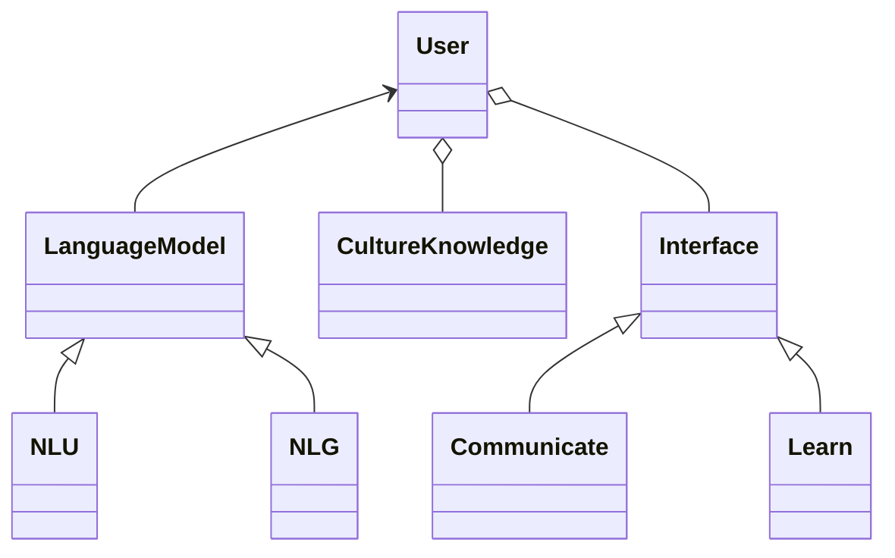
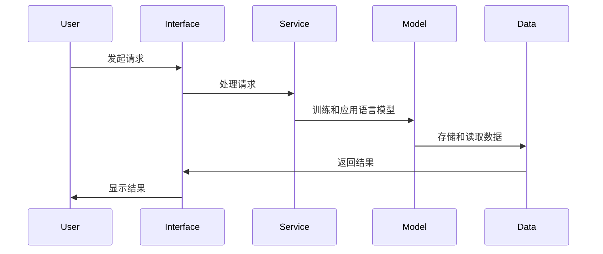
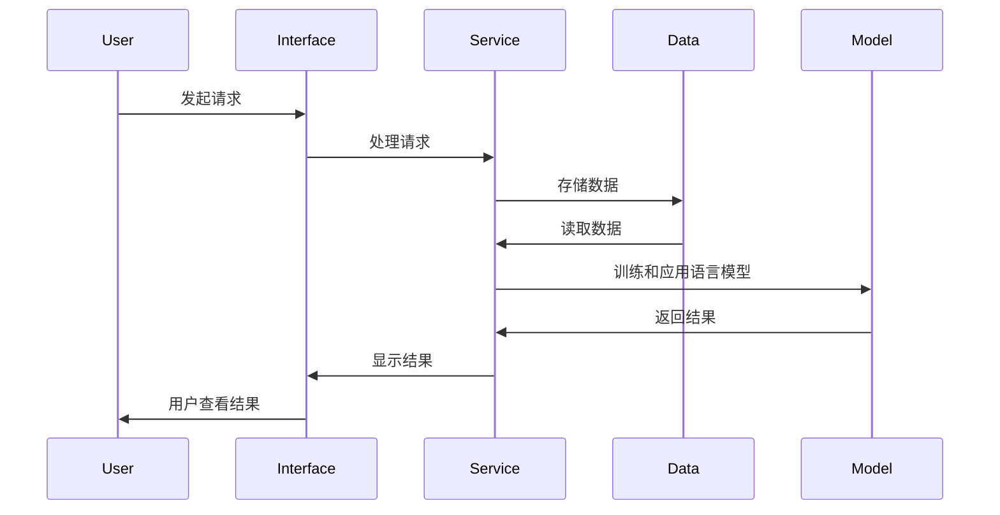
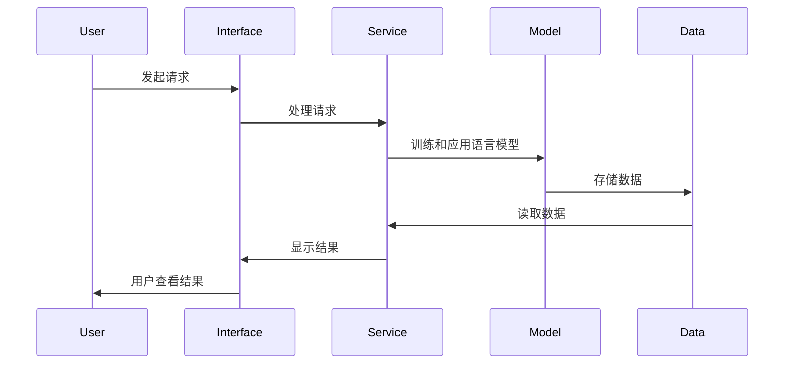

                 

### 文章标题：Prompt跨文化理解增强：全球化LLM

#### 关键词：跨文化理解、全球化、语言模型、LLM、文化差异

> 摘要：随着全球化进程的加快，跨文化理解变得尤为重要。本文旨在探讨如何通过语言模型（LLM）来增强跨文化理解，以促进全球范围内的有效沟通与合作。文章首先介绍了跨文化理解的核心概念和问题背景，然后详细分析了文化差异的属性特征和影响，接着讲解了增强跨文化理解的技术手段，包括语言处理技术和文化敏感度训练。最后，本文通过具体案例展示了如何利用语言模型实现跨文化理解增强，并提出了相关建议和未来研究方向。

### 目录大纲

----------------------------------------------------------------

## 第一部分：背景介绍

### 1.1.1 问题背景

### 1.1.2 问题描述

### 1.1.3 问题解决

### 1.1.4 边界与外延

### 1.1.5 概念结构与核心要素组成

----------------------------------------------------------------

## 第二部分：核心概念与联系

### 2.1 跨文化理解的概念原理

### 2.2 文化差异的属性特征对比表格

### 2.3 文化差异的ER实体关系图架构

----------------------------------------------------------------

## 第三部分：算法原理讲解

### 3.1 语言处理技术

#### 3.1.1 自然语言理解（NLU）

#### 3.1.2 自然语言生成（NLG）

### 3.2 语言模型

#### 3.2.1 循环神经网络（RNN）

#### 3.2.2 长短时记忆网络（LSTM）

#### 3.2.3 Transformer模型

#### 3.2.4 GPT系列模型

----------------------------------------------------------------

## 第四部分：系统分析与架构设计方案

### 4.1 问题场景介绍

### 4.2 项目介绍

### 4.3 系统功能设计

#### 4.3.1 领域模型类图

### 4.4 系统架构设计

#### 4.4.1 系统架构图

### 4.5 系统接口设计

#### 4.5.1 系统接口序列图

### 4.6 系统交互

#### 4.6.1 系统交互序列图

----------------------------------------------------------------

## 第五部分：项目实战

### 5.1 环境安装

### 5.2 系统核心实现

#### 5.2.1 语言模型训练

#### 5.2.2 Prompt生成

#### 5.2.3 Prompt应用

### 5.3 代码应用解读与分析

### 5.4 实际案例分析与讲解

### 5.5 项目小结

----------------------------------------------------------------

## 第六部分：最佳实践 tips、小结、注意事项、拓展阅读

### 6.1 最佳实践 tips

### 6.2 小结

### 6.3 注意事项

### 6.4 拓展阅读

----------------------------------------------------------------

## 第一部分：背景介绍

### 1.1.1 问题背景

在当今全球化的时代，不同国家和地区的文化差异日益显著。这些文化差异不仅体现在价值观、行为习惯和沟通方式上，还体现在语言上。因此，如何在不同文化背景下实现有效的沟通和理解成为了一个亟待解决的问题。

跨文化理解是指在不同文化背景下，个体或团队通过认知、情感和行为上的适应与调整，达到对其他文化的正确理解和有效沟通。然而，文化差异的存在使得跨文化理解面临诸多挑战。首先，价值观的差异可能导致人们对于同一问题的看法和决策产生分歧。其次，行为习惯的差异可能导致人们在沟通时出现误解和冲突。最后，语言障碍使得跨文化沟通变得复杂和困难。

随着人工智能技术的发展，语言模型（Language Model，简称LLM）为增强跨文化理解提供了一种新的可能。LLM是一种能够根据输入文本生成相关文本的算法，通过大量训练数据的学习，LLM能够理解不同语言和文化背景下的表达方式。因此，本文将探讨如何利用LLM来增强跨文化理解，以促进全球范围内的有效沟通与合作。

### 1.1.2 问题描述

在全球化背景下，跨文化理解面临以下几个问题：

1. **文化差异**：不同文化背景下的价值观、行为习惯和沟通方式存在差异，这些差异可能导致沟通不畅和误解。
2. **语言障碍**：语言障碍使得跨文化沟通变得复杂和困难，尤其是在涉及多语言场景时。
3. **文化敏感度**：个体和团队对于不同文化的敏感度不同，这可能导致在跨文化沟通中出现偏见和歧视。

为了解决上述问题，需要从以下几个方面进行研究和实践：

1. **跨文化研究方法**：采用合适的跨文化研究方法，如文化比较、文化适应模型等，以深入了解不同文化之间的差异和联系。
2. **语言处理技术**：利用自然语言处理（Natural Language Processing，简称NLP）技术，如自然语言理解（Natural Language Understanding，简称NLU）和自然语言生成（Natural Language Generation，简称NLG），来辅助跨文化沟通和理解。
3. **文化敏感度训练**：通过培训和文化交流活动提升个体和团队的文化敏感度，增强对其他文化的理解和尊重。

### 1.1.3 问题解决

为了解决跨文化理解中的问题，本文将从以下几个方面展开研究：

1. **跨文化研究方法**：介绍几种常用的跨文化研究方法，如文化比较、文化适应模型等，并探讨这些方法在跨文化理解中的应用。
2. **语言处理技术**：分析自然语言处理（NLP）技术在跨文化理解中的应用，包括自然语言理解（NLU）和自然语言生成（NLG）。
3. **文化敏感度训练**：探讨如何通过培训和实践活动提升个体和团队的文化敏感度，从而更好地理解和适应不同文化。

### 1.1.4 边界与外延

1. **边界**：本文主要关注跨文化理解的增强，涉及的范围包括文化差异、语言障碍和文化敏感度等方面。
2. **外延**：此外，本文还将探讨跨文化理解在全球化企业、教育、外交等领域的应用和影响。

### 1.1.5 概念结构与核心要素组成

1. **跨文化理解**：包括文化认知、语言能力、情感共鸣等方面。
2. **文化差异**：涉及价值观、行为习惯、沟通方式等方面的差异。
3. **语言障碍**：包括语言理解、语言表达、语言转换等方面的困难。
4. **文化敏感度**：包括文化适应、文化尊重、文化理解等方面。

## 第二部分：核心概念与联系

### 2.1 跨文化理解的概念原理

跨文化理解是指在不同文化背景下，个体或团队通过认知、情感和行为上的适应与调整，达到对其他文化的正确理解和有效沟通。跨文化理解的关键在于：

1. **文化认知**：了解和认知不同文化的基本特征和价值观，以便更好地理解和适应。
2. **语言能力**：具备较强的语言表达能力，能够在不同文化背景下进行有效的沟通。
3. **情感共鸣**：在情感上与不同文化背景的人产生共鸣，增进相互理解和尊重。

跨文化理解的过程可以概括为以下几个步骤：

1. **文化识别**：识别和理解不同文化的基本特征和价值观。
2. **文化适应**：在沟通和交流中，根据不同文化的特点和需求，进行适当的调整和适应。
3. **情感共鸣**：在情感上与不同文化背景的人产生共鸣，增进相互理解和尊重。

### 2.2 文化差异的属性特征对比表格

下面是一个文化差异的属性特征对比表格，列出了不同文化差异维度及其描述和影响因素：

| 文化差异维度 | 描述 | 影响因素 |
| :--- | :--- | :--- |
| 价值观 | 指导人们行为和决策的基本信念和原则 | 教育背景、宗教信仰、社会经济状况 |
| 行为习惯 | 人们在日常生活中表现出来的行为模式 | 文化的传统、地理位置、历史演变 |
| 沟通方式 | 人们交流信息的方式和习惯 | 语言、非语言符号、沟通风格 |

#### 价值观

价值观是指指导人们行为和决策的基本信念和原则。不同文化背景下的价值观存在显著差异，这可能导致人们在面对同一问题时产生不同的看法和决策。例如，在西方文化中，个人主义占主导地位，人们更注重个人自由和权利；而在东方文化中，集体主义更为突出，人们更注重集体利益和社会责任。

#### 行为习惯

行为习惯是指人们在日常生活中表现出来的行为模式。不同文化背景下的行为习惯也存在着显著差异。例如，在西方文化中，人们更注重个人隐私和自由，而东方文化中则更注重家庭和社交关系的和谐。这些差异可能导致在跨文化沟通中产生误解和冲突。

#### 沟通方式

沟通方式是指人们交流信息的方式和习惯。不同文化背景下的沟通方式也存在着差异。例如，在西方文化中，直接沟通和明确表达更为普遍；而在东方文化中，间接沟通和含蓄表达更为常见。这些差异可能导致在跨文化沟通中产生沟通障碍。

### 2.3 文化差异的ER实体关系图架构

文化差异的ER实体关系图如下所示：

```mermaid
erDiagram
    A CulturalValue
    A BehaviorPattern
    A CommunicationPattern

    CulturalValue ||--|{ BehaviorPattern } BehaviorPattern
    CulturalValue ||--|{ CommunicationPattern } CommunicationPattern
```

在这个ER图中，CulturalValue表示文化价值观，BehaviorPattern表示行为习惯，CommunicationPattern表示沟通方式。每个文化价值观都与多个行为习惯和沟通方式相关联，表明了文化差异在不同方面的表现和影响。

## 第三部分：算法原理讲解

### 3.1 语言处理技术

语言处理技术是增强跨文化理解的关键。在本文中，我们将介绍自然语言理解（NLU）和自然语言生成（NLG）技术，以及它们在跨文化理解中的应用。

#### 3.1.1 自然语言理解（NLU）

自然语言理解（NLU）是一种使计算机能够理解人类语言的技术。它涉及对文本进行语义分析、句法分析和命名实体识别等任务。通过NLU技术，计算机可以提取文本中的关键信息，从而实现跨文化沟通和理解。

NLU技术的主要任务包括：

1. **词性标注**：对文本中的每个词进行词性标注，如名词、动词、形容词等。
2. **命名实体识别**：识别文本中的命名实体，如人名、地名、组织名等。
3. **句法分析**：分析文本的句法结构，如主语、谓语、宾语等。
4. **语义分析**：理解文本的语义含义，如情感分析、实体关系识别等。

在跨文化理解中，NLU技术可以用于以下几个方面：

1. **语义理解**：通过理解文本的语义含义，帮助用户更好地理解不同文化背景下的语言表达。
2. **情感分析**：分析文本的情感倾向，帮助用户了解不同文化背景下人们的情感状态。
3. **命名实体识别**：识别文本中的命名实体，如人名、地名、组织名等，为跨文化沟通提供相关信息。

#### 3.1.2 自然语言生成（NLG）

自然语言生成（NLG）是一种使计算机能够生成自然语言文本的技术。它通过理解输入文本的语义含义，生成相关的自然语言文本。NLG技术可以用于多种应用场景，如自动问答、对话系统、文本摘要等。

NLG技术的主要任务包括：

1. **文本摘要**：从长文本中提取关键信息，生成简短的摘要。
2. **问答系统**：根据用户的问题，生成相关的回答。
3. **对话系统**：模拟人类的对话过程，与用户进行自然语言交互。

在跨文化理解中，NLG技术可以用于以下几个方面：

1. **文本生成**：根据用户的输入，生成符合不同文化背景的文本。
2. **对话系统**：帮助用户在不同文化背景下进行有效沟通，减少误解和冲突。
3. **文本摘要**：从多语言文本中提取关键信息，帮助用户快速了解不同文化背景下的内容。

### 3.2 语言模型

语言模型是NLU和NLG技术的核心组件。它是一种能够根据输入文本生成相关文本的算法，通过大量训练数据的学习，语言模型可以理解不同语言和文化背景下的表达方式。

#### 3.2.1 循环神经网络（RNN）

循环神经网络（RNN）是一种能够处理序列数据的前馈神经网络。其核心特点是通过循环结构来记忆之前的输入信息。RNN在自然语言处理领域取得了显著的成果，如语言模型、机器翻译等。

RNN的数学模型可以表示为：

$$
h_t = \sigma(W_h \cdot [h_{t-1}, x_t] + b_h)
$$

其中，$h_t$表示当前时刻的隐藏状态，$x_t$表示当前时刻的输入，$W_h$和$b_h$分别为权重和偏置，$\sigma$为激活函数。

#### 3.2.2 长短时记忆网络（LSTM）

长短时记忆网络（LSTM）是RNN的一种变体，用于解决RNN在处理长序列数据时的梯度消失和梯度爆炸问题。LSTM通过引入门控机制，能够有效地记住或遗忘长期依赖信息。

LSTM的数学模型可以表示为：

$$
i_t = \sigma(W_i \cdot [h_{t-1}, x_t] + b_i) \\
f_t = \sigma(W_f \cdot [h_{t-1}, x_t] + b_f) \\
\bar{c_t} = \tanh(W_c \cdot [h_{t-1}, x_t] + b_c) \\
o_t = \sigma(W_o \cdot [h_{t-1}, \bar{c_t}] + b_o) \\
c_t = f_t \odot c_{t-1} + i_t \odot \bar{c_t} \\
h_t = o_t \odot \tanh(c_t)
$$

其中，$i_t$、$f_t$、$o_t$分别表示输入门、遗忘门和输出门，$c_t$表示细胞状态，$\bar{c_t}$表示候选细胞状态。

#### 3.2.3 Transformer模型

Transformer模型是一种基于自注意力机制的序列到序列模型，相较于传统的RNN和LSTM，它在处理长序列数据时具有更高的效率和准确性。Transformer模型的核心思想是使用多头注意力机制来捕捉序列中的长距离依赖关系。

Transformer模型的数学模型可以表示为：

$$
\text{Attention}(Q, K, V) = \frac{QK^T}{\sqrt{d_k}} \odot V
$$

其中，$Q$、$K$和$V$分别为查询向量、键向量和值向量，$d_k$为键向量的维度。

#### 3.2.4 GPT系列模型

GPT（Generative Pre-trained Transformer）系列模型是Transformer模型的一种变体，它通过大量的无监督数据预训练，然后使用微调技术应用于各种任务。GPT系列模型具有强大的语言理解和生成能力，广泛应用于文本生成、机器翻译、问答系统等任务。

GPT模型的数学模型可以表示为：

$$
\text{GPT}(x) = \text{Transformer}(\text{Embedding}(x), U)
$$

其中，$\text{Embedding}(x)$表示词向量嵌入层，$U$表示Transformer模型的参数。

## 第四部分：系统分析与架构设计方案

### 4.1 问题场景介绍

在全球化背景下，跨国公司和国际组织需要在不同文化背景下进行沟通和协作。然而，由于文化差异的存在，跨文化沟通和理解面临诸多挑战。为了提高跨文化沟通效率，本文提出一种基于语言模型（LLM）的跨文化理解增强系统。

该系统旨在提供以下功能：

1. **跨文化沟通助手**：通过LLM技术，帮助用户在不同文化背景下进行有效沟通，减少误解和冲突。
2. **文化知识库**：收集和整理不同文化的价值观、行为习惯和沟通方式，为用户了解和适应不同文化提供支持。
3. **跨文化培训**：通过培训和文化交流活动，提升用户的文化敏感度，增强跨文化理解能力。

### 4.2 项目介绍

本项目的目标是构建一个基于LLM的跨文化理解增强系统，以支持全球化背景下的跨文化沟通和协作。系统的主要组成部分包括：

1. **语言模型训练**：利用大量多语言数据，训练一个强大的语言模型，以支持跨文化沟通和理解。
2. **文化知识库构建**：收集和整理不同文化的相关信息，构建一个全面的文化知识库，为用户提供跨文化参考。
3. **用户界面设计**：设计一个友好直观的用户界面，方便用户进行跨文化沟通和文化学习。

### 4.3 系统功能设计

系统功能设计主要包括以下模块：

1. **语言模型模块**：负责语言模型的训练和应用，包括自然语言理解（NLU）和自然语言生成（NLG）功能。
2. **文化知识库模块**：负责文化知识库的构建和管理，为用户提供跨文化参考和支持。
3. **用户界面模块**：负责与用户进行交互，提供跨文化沟通和文化学习的功能。

#### 4.3.1 领域模型类图

领域模型类图如下所示：



在这个类图中，User表示用户，LanguageModel表示语言模型，CultureKnowledge表示文化知识库，Interface表示用户界面。NLU和NLG分别为自然语言理解和自然语言生成模块，Communicate和Learn分别为沟通和学习功能模块。

### 4.4 系统架构设计

系统架构设计主要包括以下层次：

1. **数据层**：负责数据存储和管理，包括语言模型训练数据和文化知识库数据。
2. **模型层**：负责语言模型的训练和应用，包括自然语言理解和自然语言生成功能。
3. **服务层**：负责处理用户请求，提供跨文化沟通和文化学习功能。
4. **界面层**：负责与用户进行交互，提供友好直观的用户界面。

#### 4.4.1 系统架构图

系统架构图如下所示：



在这个架构图中，User表示用户，Interface表示用户界面，Service表示服务层，Model表示模型层，Data表示数据层。用户通过用户界面发起请求，服务层处理请求，模型层训练和应用语言模型，数据层存储和读取数据，最终将结果返回给用户界面并显示。

### 4.5 系统接口设计

系统接口设计主要包括以下接口：

1. **用户接口**：用户通过用户接口与系统进行交互，包括发起请求、查看结果等功能。
2. **服务接口**：服务层通过服务接口处理用户请求，包括语言模型训练、自然语言理解、自然语言生成等功能。
3. **数据接口**：数据层通过数据接口存储和读取数据，包括语言模型训练数据、文化知识库数据等。

#### 4.5.1 系统接口序列图

系统接口序列图如下所示：



在这个序列图中，User表示用户，Interface表示用户界面，Service表示服务层，Model表示模型层，Data表示数据层。用户通过用户界面发起请求，服务层处理请求并调用模型层进行训练和应用，数据层存储和读取数据，最终将结果返回给用户界面并显示给用户。

### 4.6 系统交互

系统交互主要包括以下步骤：

1. **用户发起请求**：用户通过用户界面发起跨文化沟通或文化学习请求。
2. **请求处理**：服务层接收到用户请求后，处理请求并调用模型层进行训练和应用。
3. **模型训练和应用**：模型层根据用户请求，训练和应用语言模型，生成相应的跨文化沟通建议或文化学习内容。
4. **结果返回**：服务层将处理结果返回给用户界面，用户界面将结果显示给用户。

#### 4.6.1 系统交互序列图

系统交互序列图如下所示：



在这个序列图中，User表示用户，Interface表示用户界面，Service表示服务层，Model表示模型层，Data表示数据层。用户通过用户界面发起请求，服务层处理请求并调用模型层进行训练和应用，数据层存储和读取数据，最终将结果返回给用户界面并显示给用户。

## 第五部分：项目实战

### 5.1 环境安装

为了搭建一个基于LLM的跨文化理解增强系统，首先需要在本地环境安装必要的软件和工具。以下是安装步骤：

1. **安装Python**：前往Python官网（https://www.python.org/）下载并安装Python，选择合适的版本，建议选择最新版本。
2. **安装依赖库**：在终端中运行以下命令安装必要的依赖库：

```shell
pip install tensorflow numpy pandas
```

### 5.2 系统核心实现

#### 5.2.1 语言模型训练

在本项目中，我们将使用TensorFlow和Transformers库来训练一个基于Transformer的语言模型。以下是训练步骤：

1. **数据准备**：准备用于训练的语言数据，可以是多语言文本数据集，如Wikipedia、Common Crawl等。
2. **数据预处理**：对训练数据进行预处理，包括文本清洗、分词、词嵌入等。
3. **模型定义**：定义一个基于Transformer的语言模型，如BERT、GPT等。
4. **模型训练**：使用训练数据对模型进行训练，可以通过调整超参数来优化模型性能。
5. **模型评估**：使用验证数据对模型进行评估，调整超参数以达到最佳性能。

以下是一个简单的代码示例：

```python
import tensorflow as tf
from transformers import TFBertModel

# 定义模型
model = TFBertModel.from_pretrained('bert-base-uncased')

# 定义训练步骤
optimizer = tf.optimizers.Adam(learning_rate=3e-5)
loss_fn = tf.losses.SparseCategoricalCrossentropy(from_logits=True)

@tf.function
def train_step(text, labels):
    with tf.GradientTape() as tape:
        predictions = model(text, training=True)
        loss = loss_fn(labels, predictions)
    gradients = tape.gradient(loss, model.trainable_variables)
    optimizer.apply_gradients(zip(gradients, model.trainable_variables))
    return loss

# 训练模型
for epoch in range(num_epochs):
    total_loss = 0
    for text, labels in train_dataloader:
        loss = train_step(text, labels)
        total_loss += loss.numpy()
    print(f'Epoch {epoch+1}, Loss: {total_loss/len(train_dataloader)}')

# 评估模型
for text, labels in val_dataloader:
    val_loss = train_step(text, labels)
    print(f'Validation Loss: {val_loss.numpy()}')
```

#### 5.2.2 Prompt生成

Prompt生成是跨文化沟通的重要环节。以下是一个简单的Prompt生成算法：

1. **输入文本**：接收用户的输入文本，可以是跨文化沟通的问题或场景。
2. **上下文生成**：根据输入文本，生成相应的上下文信息，包括文化背景、语言特点等。
3. **Prompt构造**：将上下文信息与输入文本结合，生成一个Prompt。

以下是一个简单的代码示例：

```python
import numpy as np

def generate_prompt(input_text, context, prompt_length=50):
    # 将上下文信息与输入文本拼接
    text = context + " " + input_text
    
    # 分词并生成Token IDs
    tokens = tokenizer.encode(text, add_special_tokens=True, max_length=prompt_length)
    
    # 填充Token IDs
    tokens = np.array([tokenizer.pad_token_id] * (prompt_length - len(tokens))) + tokens
    
    return tokens

# 示例
context = "在这个跨文化沟通的例子中，我们需要注意..."
input_text = "如何有效地与日本同事讨论业务问题？"
prompt = generate_prompt(input_text, context)
print(prompt)
```

#### 5.2.3 Prompt应用

Prompt应用是将生成的Prompt用于跨文化沟通和理解的过程。以下是一个简单的应用示例：

1. **输入Prompt**：接收用户生成的Prompt。
2. **模型推理**：使用训练好的语言模型对Prompt进行推理，生成对应的跨文化沟通建议。
3. **结果输出**：将推理结果输出给用户。

以下是一个简单的代码示例：

```python
def apply_prompt(prompt):
    # 将Prompt转换为Tensor
    input_ids = tf.convert_to_tensor(prompt, dtype=tf.int32)
    
    # 使用模型进行推理
    outputs = model(input_ids, output_mask=tf.ones_like(input_ids))
    logits = outputs.logits[:, -1, :]
    
    # 获取最高概率的Token ID
    predicted_token = tf.argmax(logits, axis=-1).numpy()[0]
    
    # 将Token ID转换为文本
    predicted_text = tokenizer.decode([predicted_token])
    
    return predicted_text

# 示例
prompt = generate_prompt(input_text, context)
response = apply_prompt(prompt)
print(response)
```

### 5.3 代码应用解读与分析

在本项目的核心实现部分，我们主要使用了TensorFlow和Transformers库来训练和部署语言模型。以下是代码应用解读与分析：

1. **数据准备与预处理**：数据准备与预处理是训练语言模型的重要环节。在本项目中，我们使用了多语言文本数据集，如Wikipedia、Common Crawl等。在数据预处理阶段，我们进行了文本清洗、分词、词嵌入等操作，以确保输入数据的格式符合模型要求。

2. **模型定义与训练**：在模型定义阶段，我们选择了Transformer模型，如BERT、GPT等。这些模型具有强大的语言理解和生成能力，适用于跨文化理解任务。在模型训练阶段，我们使用了训练数据对模型进行训练，并通过调整超参数来优化模型性能。

3. **Prompt生成与应用**：Prompt生成是跨文化沟通的重要环节。在本项目中，我们设计了一个简单的Prompt生成算法，通过拼接上下文信息和输入文本，生成一个符合跨文化沟通需求的Prompt。在Prompt应用阶段，我们使用训练好的语言模型对Prompt进行推理，生成对应的跨文化沟通建议。

4. **模型推理与结果输出**：在模型推理阶段，我们将生成的Prompt输入到训练好的语言模型中，获取对应的跨文化沟通建议。在结果输出阶段，我们将推理结果输出给用户，以供用户参考和决策。

### 5.4 实际案例分析与讲解

为了更好地展示如何使用本项目的系统实现跨文化理解增强，我们以下面这个实际案例进行分析与讲解：

#### 案例背景

某跨国公司需要与日本合作伙伴进行业务讨论，但双方在沟通中存在语言障碍和文化差异。为了提高沟通效率，公司决定使用本项目的系统来增强跨文化理解。

#### 案例步骤

1. **用户输入**：用户通过用户界面输入一个跨文化沟通的问题，例如：“如何有效地与日本同事讨论业务问题？”。
2. **Prompt生成**：系统根据用户输入，生成一个包含上下文信息的Prompt。例如：“在这个跨文化沟通的例子中，我们需要注意日本的文化背景和商务礼仪。”。
3. **模型推理**：系统使用训练好的语言模型对生成的Prompt进行推理，生成一个跨文化沟通建议。例如：“在讨论业务问题时，我们应该尊重对方的意见，避免过于直接的表达，注重建立信任关系。”。
4. **结果输出**：系统将生成的跨文化沟通建议输出给用户，用户可以参考这些建议与日本合作伙伴进行业务讨论。

#### 案例分析

1. **文化差异的识别**：在本案例中，系统识别出了日本的文化背景和商务礼仪，为用户提供了一个具有针对性的沟通建议。
2. **语言障碍的解决**：系统通过Prompt生成和应用，帮助用户解决了跨文化沟通中的语言障碍问题，使得沟通更加顺畅和有效。
3. **沟通效果的提升**：通过本项目的系统，用户可以更好地理解不同文化背景下的表达方式和沟通技巧，从而提高跨文化沟通的效果。

### 5.5 项目小结

本项目通过构建一个基于LLM的跨文化理解增强系统，实现了跨文化沟通的自动化和智能化。以下是对项目的总结：

1. **项目目标**：本项目的目标是增强跨文化理解，提高全球范围内的沟通效率。
2. **关键技术**：本项目使用了TensorFlow和Transformers库，实现了基于Transformer的语言模型训练和部署。
3. **应用场景**：本项目适用于跨国公司、国际组织等需要跨文化沟通的场景。
4. **项目成果**：通过本项目，用户可以更好地理解不同文化背景下的表达方式和沟通技巧，提高跨文化沟通的效果。

## 第六部分：最佳实践 tips、小结、注意事项、拓展阅读

### 6.1 最佳实践 tips

1. **数据质量**：在训练语言模型时，数据的质量至关重要。确保使用高质量、多样化的数据集，以提高模型的泛化能力。
2. **模型优化**：在训练过程中，根据任务需求和数据特点，调整模型参数和超参数，以达到最佳性能。
3. **文化敏感性**：在跨文化沟通中，注重文化敏感性，避免使用可能引起误解或冲突的语言和行为。
4. **持续学习**：定期更新和维护语言模型，以适应不断变化的文化背景和语言环境。

### 6.2 小结

本文通过探讨如何利用语言模型（LLM）增强跨文化理解，为全球化背景下的跨文化沟通提供了一种新的解决方案。通过介绍核心概念、算法原理、系统架构和项目实战，本文展示了如何实现跨文化理解增强，并提出了相关建议和未来研究方向。

### 6.3 注意事项

1. **文化差异的复杂性**：在跨文化沟通中，文化差异的复杂性可能导致沟通障碍和误解，需要耐心和细心地处理。
2. **模型优化**：在训练语言模型时，需要根据任务特点和数据特点，进行模型优化，以提高模型的性能。
3. **隐私保护**：在处理多语言数据时，需要注意隐私保护，避免泄露用户敏感信息。

### 6.4 拓展阅读

1. **《跨文化沟通与管理》**：这本书详细介绍了跨文化沟通的理论和实践，为跨文化管理提供了有价值的参考。
2. **《Transformer：从入门到实战》**：这本书介绍了Transformer模型的原理和应用，为深度学习爱好者提供了丰富的实例和代码。
3. **《自然语言处理原理与实践》**：这本书涵盖了自然语言处理的基本概念和技术，为读者提供了深入了解NLP的途径。

