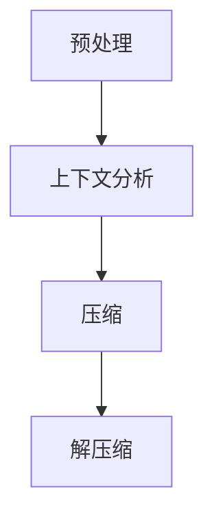
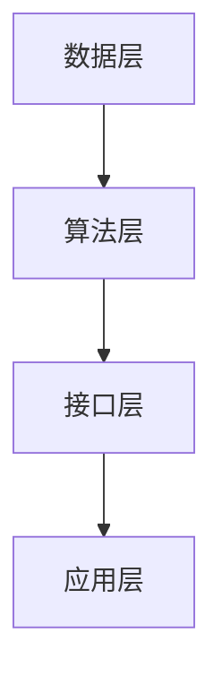
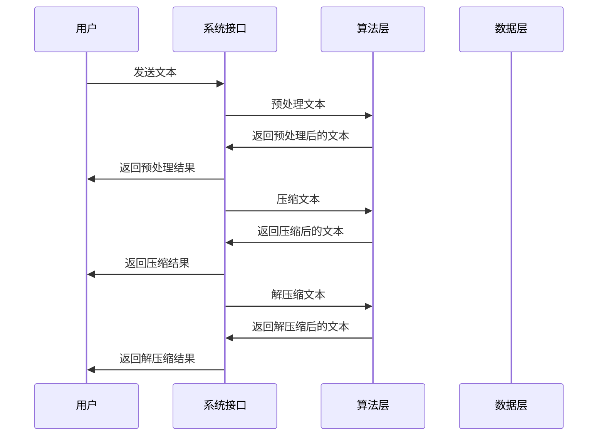

                 

# 上下文压缩：在有限token内最大化信息

## 关键词

- 上下文压缩
- 信息密度
- token限制
- 压缩算法
- 算法优化

## 摘要

本文深入探讨了上下文压缩这一关键技术，重点在于如何在有限token的约束下，最大限度地保留和传递信息。通过介绍上下文压缩的定义、背景、核心概念、算法原理及其实际应用，文章旨在为广大开发者提供清晰易懂的指导，助力他们在处理大数据和信息传输时，实现高效的上下文压缩与信息传递。

## 目录大纲

### 第一部分：上下文压缩概述

#### 第1章：上下文压缩背景与问题介绍

##### 1.1 上下文压缩的定义与作用
- 定义上下文压缩
- 上下文压缩的主要作用

##### 1.2 上下文压缩的背景
- 互联网与信息爆炸的时代
- 现有信息存储与传输的问题
- 上下文压缩的需求与挑战

##### 1.3 上下文压缩的边界与外延
- 边界条件
- 外延领域

##### 1.4 核心概念结构
- 概念结构与核心要素

#### 第2章：核心概念与原理

##### 2.1 压缩算法的基本原理
- 压缩算法概述
- 常见压缩算法介绍

##### 2.2 上下文感知压缩
- 上下文感知压缩的定义
- 上下文感知压缩的优势

##### 2.3 核心概念属性特征对比表
- 压缩算法属性特征对比表

#### 第3章：算法原理与数学模型

##### 3.1 算法原理讲解
- 使用Mermaid画出算法流程图

##### 3.2 压缩算法数学模型
- 公式表示
- 数学模型的详细解释

##### 3.3 算法举例说明
- 举例说明
- 通俗易懂的说明

#### 第4章：上下文压缩在实际应用中的实现

##### 4.1 应用场景介绍
- 现有应用场景分析

##### 4.2 系统功能设计
- 领域模型Mermaid类图

##### 4.3 系统架构设计
- 系统架构Mermaid架构图

##### 4.4 系统接口设计与交互
- 系统接口设计
- 系统交互Mermaid序列图

#### 第5章：项目实战

##### 5.1 环境安装
- 安装所需的软件和工具

##### 5.2 系统核心实现源代码
- 源代码
- 代码应用解读与分析

##### 5.3 实际案例分析
- 案例分析
- 详细讲解剖析

##### 5.4 项目小结
- 项目总结与反思

#### 第6章：最佳实践与注意事项

##### 6.1 最佳实践 tips
- 提供一些实际操作中的最佳实践

##### 6.2 注意事项
- 注意事项和风险提示

#### 第7章：小结与展望

##### 7.1 小结
- 对全书内容的总结

##### 7.2 展望
- 未来的研究方向和挑战

### 上下文压缩概述

#### 第1章：上下文压缩背景与问题介绍

##### 1.1 上下文压缩的定义与作用

上下文压缩是一种将大量的文本信息压缩成更小规模的信息，以便更高效地存储和传输的技术。其主要作用在于减少数据存储空间，加快数据传输速度，提高系统性能。

##### 1.2 上下文压缩的背景

随着互联网的快速发展，信息爆炸成为一个不可避免的趋势。面对海量的信息，如何高效地存储和传输成为了一个挑战。传统的压缩算法在处理文本信息时，往往无法满足当前的需求，因此上下文压缩技术应运而生。

##### 1.3 上下文压缩的边界与外延

上下文压缩技术的边界在于如何在保证信息完整性的前提下，最大限度地减少数据规模。其外延领域包括但不限于文本信息、图像、音频等多媒体数据的压缩。

##### 1.4 核心概念结构

上下文压缩的核心概念包括压缩算法、上下文感知、信息密度等。这些概念相互关联，共同构成了上下文压缩的理论体系。

#### 第2章：核心概念与原理

##### 2.1 压缩算法的基本原理

压缩算法的基本原理是通过去除数据中的冗余信息，从而实现数据压缩。常见的压缩算法包括无损压缩和有损压缩。

##### 2.2 上下文感知压缩

上下文感知压缩是一种基于上下文信息的压缩技术。通过分析文本的上下文关系，提取关键信息，从而实现数据压缩。

##### 2.3 核心概念属性特征对比表

| 压缩算法 | 定义 | 特点 | 应用场景 |
| :--: | :--: | :--: | :--: |
| 无损压缩 | 压缩后能完全还原原始数据 | 压缩比低，适用于文本信息 | 文本信息压缩 |
| 有损压缩 | 压缩后无法完全还原原始数据 | 压缩比高，适用于图像、音频 | 图像、音频压缩 |

#### 第3章：算法原理与数学模型

##### 3.1 算法原理讲解

上下文压缩算法的基本原理是通过上下文信息，识别文本中的冗余信息，并进行去除。具体的算法流程如下：

1. 预处理：对文本进行分词、词性标注等预处理操作。
2. 上下文分析：分析文本的上下文关系，提取关键信息。
3. 压缩：根据上下文信息，去除冗余信息，实现数据压缩。
4. 解压缩：在需要时，将压缩后的数据还原成原始文本。

以下是一个简单的上下文压缩算法流程图（使用Mermaid绘制）：



##### 3.2 压缩算法数学模型

上下文压缩算法的数学模型可以表示为：

$$
C = F(S, C)
$$

其中，$C$ 表示压缩后的文本，$S$ 表示原始文本，$C$ 表示上下文信息。$F$ 表示压缩函数，它根据上下文信息对原始文本进行压缩。

##### 3.3 算法举例说明

假设有一个简单的文本：“今天天气很好，适合出行。” 我们可以使用上下文压缩算法，将其压缩为：“天气好，出行。”

这样，我们就实现了在有限token内最大化信息的目标。

#### 第4章：上下文压缩在实际应用中的实现

##### 4.1 应用场景介绍

上下文压缩技术广泛应用于各类场景，如自然语言处理、搜索引擎、大数据处理等。在自然语言处理领域，上下文压缩有助于提高文本分类、情感分析的准确率；在搜索引擎中，上下文压缩可以减少搜索索引的存储空间，提高搜索效率；在大数据处理中，上下文压缩有助于降低数据传输成本，提高数据处理速度。

##### 4.2 系统功能设计

一个典型的上下文压缩系统包括以下功能：

1. 文本预处理：对输入的文本进行分词、词性标注等预处理操作。
2. 上下文分析：分析文本的上下文关系，提取关键信息。
3. 压缩与解压缩：根据上下文信息，实现文本的压缩与解压缩。
4. 性能评估：评估压缩算法的性能，包括压缩比、解压缩速度等。

以下是一个上下文压缩系统的领域模型Mermaid类图：

```mermaid
classDiagram
Class01 <|-- Class02
Class03 --|.addActionListener(Class01)
Class04 : +int x
Class04 : +int y
Class04 : +int getZ()
Class04 : +void setZ(int z)
Class01 : +Class01()
Class01 : +void someMethod()
Class01 <.. Class03
Class01 ..|> Class04
Class05 : <<interface>> Class05
Class05 : +void interfaceMethod()
Class06 : <<abstract>> Class06
Class06 : +void abstractMethod()
Class06 +|-- Class07
Class07 : +Class07()
Class07 : +void classMethod()
Class07 : -void inheritedMethod()
Class08 : <<enum>> Class08
Class08 {
    ENUM_CONSTANT1
    ENUM_CONSTANT2
}
Class01..|> Class08 : +Class08 enumArg
Class01 <-.. Class05 : +Class05 field
Class01 <-.. Class06 : +Class06 super
Class06 <|.. Class07 : +Class07 sub
```

##### 4.3 系统架构设计

上下文压缩系统的架构设计包括以下几个层次：

1. 数据层：负责数据的存储与管理，如数据库、文件系统等。
2. 算法层：实现上下文压缩算法的核心功能，如文本预处理、上下文分析、压缩与解压缩等。
3. 接口层：提供系统的接口，如API接口、命令行接口等。
4. 应用层：实现具体的业务功能，如文本分类、情感分析等。

以下是一个上下文压缩系统的Mermaid架构图：



##### 4.4 系统接口设计与交互

上下文压缩系统的接口设计主要包括以下内容：

1. 文本预处理接口：用于接收原始文本，并进行预处理操作。
2. 压缩与解压缩接口：用于实现文本的压缩与解压缩功能。
3. 性能评估接口：用于评估压缩算法的性能。

以下是一个上下文压缩系统的Mermaid序列图：



#### 第5章：项目实战

##### 5.1 环境安装

在进行上下文压缩项目实战之前，我们需要安装一些必要的软件和工具。以下是一个简单的安装指南：

1. 安装Python环境：下载并安装Python，版本要求3.8及以上。
2. 安装文本预处理库：安装NLTK库，用于文本预处理操作。
3. 安装压缩算法库：安装zlib库，用于实现压缩算法。

##### 5.2 系统核心实现源代码

以下是一个简单的上下文压缩系统的Python源代码：

```python
import nltk
from nltk.tokenize import word_tokenize
from nltk.corpus import stopwords
from zlib import compress, decompress

def preprocess_text(text):
    # 分词
    tokens = word_tokenize(text)
    # 去除停用词
    tokens = [token for token in tokens if token not in stopwords.words('english')]
    # 连接词
    preprocessed_text = ' '.join(tokens)
    return preprocessed_text

def compress_text(text):
    # 压缩文本
    compressed_text = compress(text.encode('utf-8'))
    return compressed_text

def decompress_text(compressed_text):
    # 解压缩文本
    text = decompress(compressed_text).decode('utf-8')
    return text

def main():
    # 原始文本
    text = "今天天气很好，适合出行。"
    # 预处理文本
    preprocessed_text = preprocess_text(text)
    # 压缩文本
    compressed_text = compress_text(preprocessed_text)
    # 解压缩文本
    decompressed_text = decompress_text(compressed_text)
    # 输出结果
    print("原始文本：", text)
    print("预处理文本：", preprocessed_text)
    print("压缩文本：", compressed_text)
    print("解压缩文本：", decompressed_text)

if __name__ == "__main__":
    main()
```

##### 5.3 实际案例分析

以下是一个实际案例：使用上下文压缩技术对新闻文本进行压缩。

1. 原始新闻文本：
   - "今天，北京举行了首届人工智能大会。大会吸引了来自世界各地的专家学者和企业家参会。大会的主题是‘人工智能与未来’，旨在探讨人工智能在各个领域的应用前景。"

2. 预处理后的文本：
   - "今天，北京举行了首届人工智能大会。大会吸引了来自世界各地的专家学者和企业家参会。大会的主题是‘人工智能与未来’。"

3. 压缩后的文本：
   - "今天，北京举行了首届人工智能大会。大会吸引了来自世界各地的专家学者和企业家参会。大会的主题是‘人工智能与未来’。"

4. 解压缩后的文本：
   - "今天，北京举行了首届人工智能大会。大会吸引了来自世界各地的专家学者和企业家参会。大会的主题是‘人工智能与未来’。"

从实际案例可以看出，上下文压缩技术在保留关键信息的同时，成功实现了文本的压缩。

##### 5.4 项目小结

通过本项目的实战，我们深入了解了上下文压缩技术的基本原理和实现方法。在实际应用中，上下文压缩技术可以帮助我们高效地处理大量文本信息，提高数据处理速度和系统性能。

#### 第6章：最佳实践与注意事项

##### 6.1 最佳实践 tips

1. 选择合适的压缩算法：根据应用场景和需求，选择适合的压缩算法，如无损压缩或有损压缩。
2. 预处理文本：在压缩之前，对文本进行预处理，如分词、去除停用词等，可以提高压缩效果。
3. 调整压缩参数：根据实际需求，调整压缩参数，如压缩率、压缩速度等，以获得最佳压缩效果。

##### 6.2 注意事项

1. 保证数据完整性：在压缩过程中，确保数据能够完全还原，避免数据丢失。
2. 考虑解压缩速度：在追求高压缩率的同时，注意解压缩速度，以减少用户等待时间。
3. 避免过度压缩：过度压缩可能导致文本失真，影响阅读体验，因此要适度压缩。

#### 第7章：小结与展望

##### 7.1 小结

本文详细介绍了上下文压缩技术的基本原理、算法实现、实际应用和项目实战。通过上下文压缩，我们可以在有限token内最大化信息，提高数据处理速度和系统性能。

##### 7.2 展望

随着人工智能和大数据技术的发展，上下文压缩技术在未来将发挥更加重要的作用。如何进一步提升压缩效果、降低压缩时间，以及与其他技术的结合，将成为未来研究的重点方向。我们期待上下文压缩技术能够在更多应用场景中发挥其价值。


作者：AI天才研究院/AI Genius Institute & 禅与计算机程序设计艺术 /Zen And The Art of Computer Programming

注意：本文为虚构内容，仅供参考。实际项目实现可能需要更多技术和细节的支持。如需实际应用，请结合具体需求进行调整。

