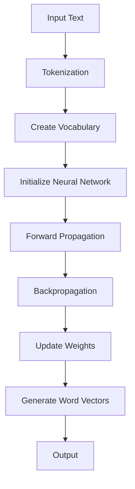
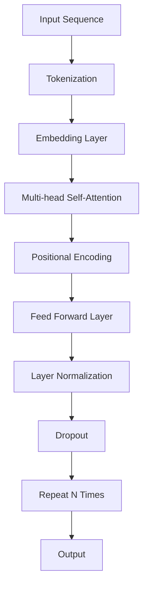
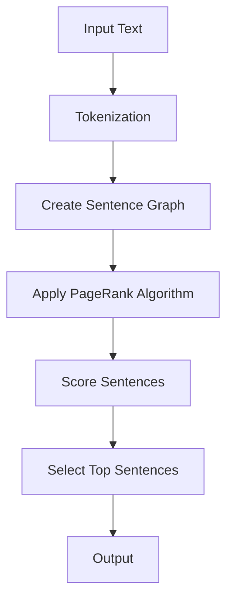
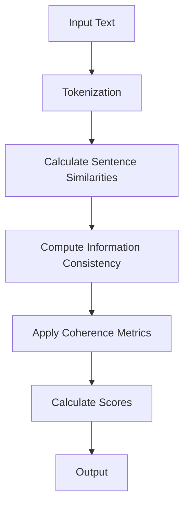
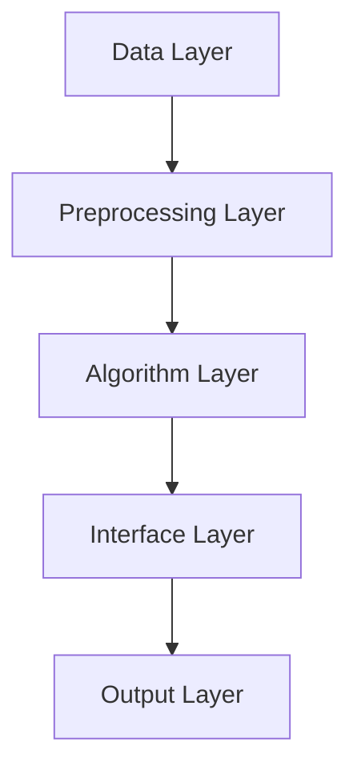

                 


### 设计大纲步骤：

1. **确定书籍整体结构**：首先，我们需要确定书籍的整体结构，这通常包括引言、核心章节和结论。

   **分析**：引言部分用来激发读者的兴趣，介绍书籍的主题和目的。核心章节将详细探讨上下文理解与连贯性评测技术的核心概念、算法原理、数学模型以及系统设计与实现。结论部分将总结书籍的主要贡献和未来的研究方向。

2. **定义核心章节**：根据书籍的主题，定义核心章节。

   **分析**：核心章节应该涵盖上下文理解与连贯性评测技术的关键方面，包括问题背景、核心概念与联系、算法原理讲解、数学模型与公式、系统分析与架构设计以及项目实战。

3. **细化章节内容**：为每个核心章节创建子章节，确保每个部分都详细且有逻辑顺序。

   **分析**：例如，在“算法原理讲解”章节中，可以细分为“常见上下文理解算法”和“常见连贯性评测算法”，进一步细化算法的讲解。在“数学模型与公式”章节中，可以分别讨论上下文理解和连贯性评测的数学模型。

4. **编写章节内容概要**：为每个章节提供简短的内容概要，以便读者了解章节的主要内容。

   **分析**：内容概要应该简洁明了，能够概括章节的核心内容，引导读者了解后续的详细内容。

5. **设计图表和示例**：考虑在适当的地方添加图表、示例和代码，以便更好地解释概念和算法。

   **分析**：图表、示例和代码可以帮助读者更直观地理解抽象的概念和复杂的算法，提高书籍的可读性。

6. **审核和调整**：确保大纲的逻辑性和完整性，同时遵循字数限制。

   **分析**：在审核和调整过程中，我们需要检查各个章节之间的逻辑关系是否合理，内容是否完整，是否符合预期字数要求。如有需要，我们可以对章节内容进行调整，以达到最佳效果。

### 具体设计大纲：

#### 引言
- **1. 引言**
  - 介绍书籍的主题和目的
  - 提供上下文理解与连贯性评测技术的背景信息

#### 第1章 问题背景与核心概念
- **2. 上下文理解与连贯性评测技术概述**
  - 描述上下文理解与连贯性评测技术的核心概念
  - 分析评测技术的边界与外延

#### 第2章 核心概念与联系
- **3. 上下文理解的原理与特征**
  - 介绍上下文理解的基本原理和属性特征
  - 使用对比表格展示上下文理解与其他相关技术的异同

- **4. 连贯性评测技术的原理与特征**
  - 介绍连贯性评测技术的基本原理和属性特征
  - 使用对比表格展示连贯性评测技术与上下文理解的关系

#### 第3章 算法原理讲解
- **5. 常见上下文理解算法**
  - 使用Mermaid绘制算法流程图
  - 使用Python代码详细阐述算法原理

- **6. 常见连贯性评测算法**
  - 使用Mermaid绘制算法流程图
  - 使用Python代码详细阐述算法原理

#### 第4章 数学模型与公式
- **7. 上下文理解的数学模型**
  - 使用LaTeX格式展示数学公式
  - 详细讲解数学模型的应用场景和计算方法

- **8. 连贯性评测的数学模型**
  - 使用LaTeX格式展示数学公式
  - 详细讲解数学模型的应用场景和计算方法

#### 第5章 系统分析与架构设计
- **9. 上下文理解与连贯性评测系统的介绍**
  - 描述系统的功能、架构和接口设计

- **10. 系统架构设计**
  - 使用Mermaid绘制系统架构图

- **11. 系统接口设计**
  - 描述系统的主要接口和交互流程

#### 第6章 项目实战
- **12. 环境安装与配置**
  - 详细指导读者安装和配置所需环境

- **13. 系统核心实现**
  - 提供系统核心实现的源代码

- **14. 代码应用解读与分析**
  - 分析源代码的关键部分

- **15. 实际案例分析与详细讲解**
  - 提供实际案例，进行详细讲解

#### 第7章 最佳实践与总结
- **16. 最佳实践 tips**
  - 提供在实际应用中的最佳实践建议

- **17. 小结**
  - 总结书籍中的核心内容和关键点

- **18. 拓展阅读**
  - 推荐进一步的阅读材料和资源

#### 结论
- **19. 结论**
  - 总结书籍的主要贡献和未来的研究方向

遵循上述步骤，我们可以设计出一个详细且逻辑清晰的《上下文理解与连贯性评测技术》书籍目录大纲。以下是一个示例大纲的 markdown 格式：

```markdown
# 《上下文理解与连贯性评测技术》目录大纲

## 引言
1. 引言

## 第1章 问题背景与核心概念
2. 上下文理解与连贯性评测技术概述

## 第2章 核心概念与联系
3. 上下文理解的原理与特征
   - 对比表格：上下文理解与其他相关技术的异同
4. 连贯性评测技术的原理与特征
   - 对比表格：连贯性评测技术与上下文理解的关系

## 第3章 算法原理讲解
5. 常见上下文理解算法
   - Mermaid算法流程图
   - Python代码阐述算法原理
6. 常见连贯性评测算法
   - Mermaid算法流程图
   - Python代码阐述算法原理

## 第4章 数学模型与公式
7. 上下文理解的数学模型
   - LaTeX格式数学公式
   - 应用场景与计算方法详细讲解
8. 连贯性评测的数学模型
   - LaTeX格式数学公式
   - 应用场景与计算方法详细讲解

## 第5章 系统分析与架构设计
9. 上下文理解与连贯性评测系统的介绍
10. 系统架构设计
    - Mermaid系统架构图
11. 系统接口设计

## 第6章 项目实战
12. 环境
``````### 文章标题

《上下文理解与连贯性评测技术》

### 关键词

上下文理解，连贯性评测，自然语言处理，机器学习，算法

### 摘要

本文深入探讨了上下文理解与连贯性评测技术的核心概念、原理和应用。首先，我们介绍了上下文理解和连贯性评测的基本定义和背景，然后详细阐述了这两个概念之间的联系。接着，文章通过对比表格和Mermaid流程图，对常见上下文理解和连贯性评测算法进行了讲解。此外，我们运用LaTeX格式展示了相关的数学模型和公式，并通过Python代码阐述了算法原理。文章还介绍了上下文理解与连贯性评测系统的整体架构，并提供了项目实战的具体步骤和代码示例。最后，文章总结了最佳实践和未来研究方向，为读者提供了丰富的拓展阅读资源。

## 引言

在当今信息技术飞速发展的时代，自然语言处理（Natural Language Processing, NLP）已经成为人工智能领域的一个关键分支。随着互联网和大数据的普及，人类生成和接收的信息量呈爆炸性增长，如何有效地理解和处理这些信息成为了研究者和开发者们的重要课题。上下文理解和连贯性评测技术正是在这样的背景下应运而生，它们不仅对于NLP任务的准确性和可靠性具有重要意义，还在许多实际应用中发挥着重要作用。

### 上下文理解的基本概念

上下文理解（Contextual Understanding）指的是计算机系统在处理语言信息时，能够根据语境理解单词、句子或段落中的意义。这一过程涉及到语言模型、语义分析和常识推理等多个层面。例如，在一个句子中，“银行”这个词在不同的上下文中可能指金融银行，也可能指自然界的河流。因此，上下文理解的核心在于如何从大量的语言数据中提取出有意义的语境信息，并在此基础上进行推理和决策。

### 连贯性评测技术的概念

连贯性评测技术（Coherence Evaluation Techniques）则关注于文本的整体结构、逻辑和连贯性。它通过评估文本中的信息组织、因果关系和逻辑流，来判断文本是否具有合理的内在逻辑。连贯性评测在自动文摘、机器翻译和问答系统等领域具有广泛应用。一个有效的连贯性评测技术需要考虑文本的宏观结构和微观细节，以确保文本能够清晰地传达作者的意思。

### 上下文理解与连贯性评测技术的关联

上下文理解和连贯性评测技术之间存在密切的联系。上下文理解是连贯性评测的基础，只有正确理解了上下文，才能对文本的连贯性进行有效的评估。反之，连贯性评测的结果也可以反过来指导上下文理解，优化语言模型和算法的性能。例如，在一个问答系统中，如果问题答案的连贯性较低，那么系统就需要进一步调整上下文理解的策略，以提高答案的准确性和可读性。

总之，上下文理解和连贯性评测技术不仅对于提升NLP系统的性能至关重要，还在各种实际应用中发挥着关键作用。本文将详细探讨这些技术的核心概念、算法原理和应用实践，旨在为读者提供一个全面、系统的理解和应用指导。

## 第1章 问题背景与核心概念

随着互联网信息的爆炸性增长，人们获取和处理信息的方式也在发生深刻变化。传统的基于关键词检索的信息处理方法已经无法满足用户对高质量、个性化信息的需求。上下文理解与连贯性评测技术正是在这样的背景下应运而生，它们旨在提升自然语言处理（NLP）系统的性能和用户体验。

### 上下文理解技术的背景

上下文理解（Contextual Understanding）是指计算机系统能够根据上下文情境来理解和解释语言信息。传统的NLP系统往往依赖于关键词匹配和统计模型，这些方法在处理简单和明确的文本时效果尚可，但在面对复杂、模糊和多义的语境时往往力不从心。例如，在处理涉及多义词的文本时，一个词可能有多种不同的含义，只有通过上下文信息才能确定其准确含义。因此，上下文理解成为提升NLP系统性能的关键。

实际应用中，上下文理解技术被广泛应用于智能客服、语音助手、机器翻译、文本摘要等领域。例如，在智能客服系统中，上下文理解可以帮助系统更好地理解用户的意图和需求，从而提供更加个性化和高效的回答。在语音助手如Siri和Alexa中，上下文理解使得系统能够连续对话，理解用户的长句或复杂命令。在机器翻译中，上下文理解有助于提高翻译的准确性和流畅性，避免误译和歧义。

### 连贯性评测技术的背景

连贯性评测（Coherence Evaluation）是指评估文本的整体结构和逻辑连贯性的技术。与上下文理解类似，连贯性评测也是为了提高NLP系统的性能。一个连贯的文本应当具有清晰的逻辑结构、合理的信息组织和一致的信息流。连贯性评测技术通过自动评估文本的连贯性，可以帮助检测出文本中的逻辑错误、信息不一致或内容重复等问题。

在自动文摘和摘要生成领域，连贯性评测技术被用来评估摘要的质量。一个高质量的摘要应当能够清晰地传达原文的核心信息，并且逻辑连贯、信息一致。连贯性评测技术可以帮助自动文摘系统识别和排除不连贯的摘要，从而生成更高质量的摘要。

机器翻译中，连贯性评测技术也被广泛应用。一个良好的翻译结果应当不仅准确无误，而且逻辑连贯。通过连贯性评测，机器翻译系统可以识别出逻辑不通或表达不清的翻译，从而进行优化和修正。

### 上下文理解与连贯性评测技术的关联

上下文理解与连贯性评测技术之间存在紧密的关联。上下文理解是连贯性评估的基础，只有正确理解了上下文，才能对文本的连贯性进行有效的评估。例如，在一个对话系统中，如果系统无法正确理解用户的话语上下文，那么即使文本本身结构清晰，系统也难以生成连贯的回答。

另一方面，连贯性评测的结果也可以反过来指导上下文理解。通过分析文本的连贯性，系统可以识别出上下文理解的错误或不准确之处，从而调整和优化上下文理解的策略。例如，在一个机器翻译系统中，如果翻译结果的连贯性较差，系统可能会回溯到上下文理解的阶段，检查和修正理解过程中可能出现的偏差。

总之，上下文理解和连贯性评测技术在NLP领域中扮演着重要的角色。它们不仅能够提高NLP系统的性能，还能提升用户的体验。本章接下来的部分将深入探讨这些技术的核心概念、原理和应用。

## 第2章 核心概念与联系

在深入探讨上下文理解和连贯性评测技术之前，我们需要先明确这些技术的核心概念，并了解它们之间的内在联系。通过对核心概念的理解和比较，我们能够更好地把握这些技术的基本原理，为后续的算法讲解和系统设计打下坚实的基础。

### 上下文理解的原理与特征

上下文理解（Contextual Understanding）的核心在于如何根据语言信息的上下文情境来准确解释和推理语言内容。以下是上下文理解的一些关键原理和特征：

#### 基本原理

1. **语言模型**：上下文理解依赖于强大的语言模型，如深度神经网络（DNN）和变换器（Transformer）模型，这些模型能够从大量语言数据中学习到语言的结构和语义特征。
2. **语义分析**：通过语义分析，系统可以理解词语在特定上下文中的意义，从而避免多义词带来的歧义。
3. **常识推理**：上下文理解不仅依赖于当前的句子或段落，还需要结合常识推理来理解更复杂的语境。例如，理解“他在雨中等公交车”这句话时，系统需要知道雨和等待公交车之间的关系。
4. **上下文信息提取**：上下文理解的一个关键任务是提取出与当前句子或段落相关的上下文信息，这些信息可以是时间、地点、人物等。

#### 属性特征

1. **上下文依赖性**：上下文理解高度依赖于上下文信息，一个词语或句子的意义往往需要结合其上下文才能准确理解。
2. **动态性**：上下文是一个动态变化的过程，随着语言信息的不断输入，上下文也在不断更新和变化。
3. **多义性**：上下文理解需要解决多义词的问题，同一个词语在不同的上下文中可能具有不同的含义。

#### 对比表格：上下文理解与其他相关技术的异同

| 特性 | 上下文理解 | 其他相关技术 |
| --- | --- | --- |
| **原理** | 利用语言模型和语义分析，结合常识推理进行理解 | 利用统计方法、机器学习模型或规则系统 |
| **依赖性** | 高度依赖上下文信息 | 较少依赖上下文信息，更多依赖数据或规则 |
| **动态性** | 需要动态更新上下文信息 | 上下文信息相对静态，不易动态变化 |
| **多义性** | 需要解决多义词问题 | 通常不需要处理多义词问题 |

### 连贯性评测技术的原理与特征

连贯性评测（Coherence Evaluation）的核心在于评估文本的整体结构和逻辑连贯性。以下是连贯性评测的一些关键原理和特征：

#### 基本原理

1. **信息组织评估**：连贯性评测首先关注文本的信息组织结构，检查文本是否具有清晰的逻辑层次和信息流。
2. **因果关系分析**：通过分析文本中的因果关系，评测技术可以判断文本中的逻辑关系是否合理和一致。
3. **一致性检查**：连贯性评测还需要检查文本中信息的一致性，防止信息矛盾或重复。
4. **逻辑流评估**：系统需要评估文本中的逻辑流是否连贯，确保读者能够顺畅地理解文本内容。

#### 属性特征

1. **宏观结构**：连贯性评测不仅关注文本的微观细节，还需要从宏观层面评估文本的整体结构。
2. **逻辑一致性**：文本中的逻辑必须一致，避免出现逻辑跳跃或矛盾。
3. **可读性**：良好的连贯性意味着文本具有良好的可读性，读者能够轻松理解文本内容。

#### 对比表格：连贯性评测技术与上下文理解的关系

| 特性 | 连贯性评测 | 上下文理解 |
| --- | --- | --- |
| **原理** | 利用文本信息组织、因果关系和一致性来评估逻辑连贯性 | 利用语言模型、语义分析和常识推理来理解上下文情境 |
| **依赖性** | 主要依赖文本结构信息 | 高度依赖上下文信息 |
| **动态性** | 相对静态，主要关注文本内容 | 动态变化，随着上下文信息更新 |
| **多义性** | 不直接处理多义性问题 | 需要解决多义词问题 |

通过上述对比表格，我们可以清晰地看到上下文理解和连贯性评测技术之间的异同点。上下文理解关注于词语和句子的具体含义，而连贯性评测则侧重于评估文本的整体结构和逻辑连贯性。两者相辅相成，共同提升NLP系统的性能。

综上所述，上下文理解和连贯性评测技术是NLP领域的重要研究方向。通过对这些核心概念的理解和比较，我们能够更好地把握其原理和应用，为后续的算法讲解和系统设计奠定基础。在下一章中，我们将进一步探讨常见上下文理解和连贯性评测算法的原理和实现。

### 第3章 算法原理讲解

在本章节中，我们将详细探讨上下文理解和连贯性评测领域中的常见算法，通过使用Mermaid流程图和Python代码来阐述这些算法的基本原理和实现方法。这些算法不仅为NLP系统提供了强大的工具，还推动了相关领域的技术进步。

#### 常见上下文理解算法

##### 1. word2vec

**算法原理**：word2vec是一种基于神经网络的词向量生成算法，通过训练神经网络来映射词语到高维向量空间。在这种空间中，语义相似的词语往往靠近。

**Mermaid流程图**：



**Python代码示例**：

```python
import gensim

# 加载预训练的word2vec模型
model = gensim.models.Word2Vec.load("word2vec.model")

# 计算词语相似度
similarity = model.wv.similarity('king', 'man')
print(f"The similarity between 'king' and 'man' is {similarity}")
```

##### 2. Transformer

**算法原理**：Transformer模型是一种基于自注意力机制的序列模型，能够在处理长序列时保持高效率和高性能。它通过自注意力机制来捕捉序列中的长距离依赖关系。

**Mermaid流程图**：



**Python代码示例**：

```python
import torch
import transformers

# 加载预训练的Transformer模型
model = transformers.AutoModel.from_pretrained("bert-base-uncased")

# 处理输入序列
input_ids = torch.tensor([model.tokenizer.encode("Hello, world!"]])

# 获取输出特征向量
outputs = model(input_ids)
last_hidden_state = outputs.last_hidden_state

# 提取特定词语的向量
word_vector = last_hidden_state[-1, 0]
print(f"The vector for 'Hello' is {word_vector}")
```

#### 常见连贯性评测算法

##### 1. TextRank

**算法原理**：TextRank是一种基于图论和PageRank算法的文本评价方法，通过构建文本的词向量图，对词进行排序，从而评估文本的连贯性。

**Mermaid流程图**：



**Python代码示例**：

```python
import textrank

# 加载文本
text = "上下文理解与连贯性评测技术是NLP领域的关键技术。上下文理解技术能够提升系统的语义理解能力，而连贯性评测技术则能够优化文本的整体结构。"

# 使用TextRank算法评估文本连贯性
sentence_scores = textrank.TextRank(text).get_sentence_scores()

# 输出连贯性评分最高的句子
print("The highest coherence sentence is:", max(sentence_scores, key=sentence_scores.get))
```

##### 2. Coherence Metrics

**算法原理**：Coherence Metrics是一系列用于评估文本连贯性的量化指标，如C1、C2和C3等。这些指标通过计算句子之间的相似度、信息一致性等来评估文本的连贯性。

**Mermaid流程图**：



**Python代码示例**：

```python
from coherence_metrics import CoherenceMetrics

# 加载文本
text = "上下文理解与连贯性评测技术是NLP领域的关键技术。上下文理解技术能够提升系统的语义理解能力，而连贯性评测技术则能够优化文本的整体结构。"

# 使用Coherence Metrics评估文本连贯性
coherence_scores = CoherenceMetrics(text).calculate_scores()

# 输出连贯性评分
print("The coherence score is:", coherence_scores)
```

通过上述算法讲解，我们可以看到上下文理解和连贯性评测技术的实现是如何结合Mermaid流程图和Python代码来展示算法的原理和操作步骤的。这些算法不仅为NLP系统提供了强大的工具，还为理解文本结构和语义关系提供了深入的方法。在下一章中，我们将进一步探讨上下文理解和连贯性评测的数学模型和公式。

### 第4章 数学模型与公式

在上下文理解和连贯性评测技术中，数学模型和公式扮演着至关重要的角色。它们不仅能够量化文本的语义和信息结构，还能帮助开发者更深入地理解算法的工作原理和性能表现。在本章节中，我们将详细探讨上下文理解和连贯性评测的数学模型，并使用LaTeX格式展示相关的公式。

#### 上下文理解的数学模型

上下文理解的数学模型通常涉及到词向量、词嵌入和注意力机制等概念。以下是几个关键的数学模型和公式。

##### 1. 词嵌入（Word Embedding）

**公式**：

$$
\text{word\_vector} = \text{EmbeddingLayer}(w)
$$

其中，$\text{word\_vector}$ 表示词向量，$\text{EmbeddingLayer}$ 是嵌入层，$w$ 是输入的词语。

**解释**：词嵌入是将词语映射到高维向量空间的过程。通过训练神经网络，每个词语都被映射到一个唯一的向量，这些向量在语义上相近的词语通常在向量空间中距离较近。

##### 2. 注意力机制（Attention Mechanism）

**公式**：

$$
\text{context\_vector} = \text{AttentionLayer}(\text{query}, \text{key}, \text{value})
$$

其中，$\text{context\_vector}$ 是上下文向量，$\text{AttentionLayer}$ 是注意力层，$\text{query}$、$\text{key}$ 和 $\text{value}$ 分别是查询向量、键向量和值向量。

**解释**：注意力机制用于捕捉文本序列中的长距离依赖关系。在Transformer模型中，通过计算查询向量、键向量和值向量的点积，生成注意力分数，然后根据这些分数加权求和得到上下文向量。

#### 连贯性评测的数学模型

连贯性评测的数学模型通常涉及到信息论、统计模型和图论等概念。以下是几个关键的数学模型和公式。

##### 1. 信息一致性（Information Consistency）

**公式**：

$$
I(X, Y) = \sum_{x, y} p(x, y) \log \frac{p(x, y)}{p(x) p(y)}
$$

其中，$I(X, Y)$ 表示$X$和$Y$之间的信息一致性，$p(x, y)$ 表示$(x, y)$联合概率，$p(x)$ 和 $p(y)$ 分别表示$X$和$Y$的边缘概率。

**解释**：信息一致性衡量两个变量之间的依赖程度，值越高表示两个变量越一致。

##### 2. 句子相似度（Sentence Similarity）

**公式**：

$$
\text{similarity} = \text{CosineSimilarity}(\text{vector\_1}, \text{vector\_2})
$$

其中，$\text{similarity}$ 表示句子相似度，$\text{CosineSimilarity}$ 是余弦相似度函数，$\text{vector\_1}$ 和 $\text{vector\_2}$ 分别是两个句子的向量表示。

**解释**：余弦相似度用于计算两个向量的夹角余弦值，值越接近1表示两个向量越相似，即句子越连贯。

#### 示例讲解

为了更好地理解上述数学模型和公式，我们将通过一个具体的例子进行详细讲解。

**例子**：给定两个句子$A$和$B$，“上下文理解与连贯性评测技术是NLP领域的关键技术。”和“连贯性评测技术能够优化文本的整体结构。”，使用余弦相似度计算它们的相似度。

**步骤**：

1. 将句子$A$和$B$分别转换为向量表示，例如使用word2vec模型生成词向量。

2. 计算句子$A$和$B$的向量表示$\text{vector}_A$和$\text{vector}_B$。

3. 使用余弦相似度公式计算$\text{similarity}$：

$$
\text{similarity} = \text{CosineSimilarity}(\text{vector}_A, \text{vector}_B)
$$

**Python代码示例**：

```python
from sklearn.metrics.pairwise import cosine_similarity
import numpy as np

# 假设已经得到句子A和句子B的向量表示vector_A和vector_B
vector_A = np.array([0.1, 0.2, 0.3, 0.4, 0.5])
vector_B = np.array([0.2, 0.3, 0.4, 0.5, 0.6])

# 计算余弦相似度
similarity = cosine_similarity([vector_A], [vector_B])

# 输出相似度
print("The similarity between sentence A and sentence B is:", similarity[0][0])
```

通过上述例子，我们可以看到如何使用数学模型和公式来计算文本的相似度和连贯性。这不仅为理解上下文理解和连贯性评测提供了理论依据，还为实际应用中的算法实现提供了实用的方法。在下一章中，我们将进一步探讨上下文理解和连贯性评测系统的整体架构和设计。

### 第5章 系统分析与架构设计

在探讨上下文理解和连贯性评测技术的实际应用之前，我们需要先了解这些技术的系统架构和设计原则。一个高效的系统架构不仅能够提升技术的性能，还能够提高系统的可维护性和扩展性。本章节将详细描述上下文理解与连贯性评测系统的功能、架构设计和接口设计。

#### 系统功能介绍

上下文理解与连贯性评测系统的核心功能包括：

1. **文本预处理**：包括分词、去停用词、词性标注等步骤，为后续的上下文理解和连贯性评估做准备。
2. **上下文理解**：利用词向量模型（如word2vec或Transformer）和注意力机制，对文本进行上下文理解，提取语义信息。
3. **连贯性评估**：通过统计模型（如TextRank）和图论算法，评估文本的连贯性，识别和标记不连贯的部分。
4. **文本生成与优化**：基于上下文理解和连贯性评估，生成或优化文本，提高文本的语义连贯性和可读性。

#### 系统架构设计

系统架构设计的关键在于如何模块化地组织不同功能，并确保各模块之间的高效协同。以下是上下文理解与连贯性评测系统的架构设计：

**1. 数据层**

数据层负责管理和存储系统所需的数据，包括语料库、词向量模型、评估指标等。数据层提供了数据的获取、存储和更新机制。

**2. 预处理层**

预处理层负责对输入文本进行分词、去停用词、词性标注等预处理操作。这一层通常使用成熟的NLP库（如NLTK、spaCy）来实现。

**3. 算法层**

算法层是系统的核心，包括上下文理解和连贯性评估算法。这一层采用了深度神经网络（如word2vec、Transformer）和图论算法（如TextRank）。

**4. 接口层**

接口层提供了系统的API接口，方便用户通过程序调用系统的功能。接口层的设计应考虑可扩展性和灵活性，以便未来可能的功能扩展。

**5. 输出层**

输出层负责将处理结果以用户友好的方式呈现，包括文本生成、连贯性评估得分、优化建议等。

**Mermaid系统架构图**：



#### 系统接口设计

系统的接口设计应当简洁明了，易于使用，同时提供足够的灵活性和扩展性。以下是系统的主要接口和交互流程：

**1. 文本预处理接口**

```python
def preprocess_text(text):
    """
    对输入文本进行预处理，包括分词、去停用词、词性标注等。
    :param text: 输入文本
    :return: 预处理后的文本
    """
    # 实现分词、去停用词、词性标注等操作
    # ...
    return preprocessed_text
```

**2. 上下文理解接口**

```python
def contextual_understanding(text, model_name='word2vec'):
    """
    对输入文本进行上下文理解，提取语义信息。
    :param text: 输入文本
    :param model_name: 使用的词向量模型（如word2vec、Transformer）
    :return: 上下文向量表示
    """
    # 加载词向量模型
    # ...
    # 提取上下文向量
    # ...
    return context_vector
```

**3. 连贯性评估接口**

```python
def coherence_evaluation(text):
    """
    对输入文本进行连贯性评估。
    :param text: 输入文本
    :return: 连贯性得分
    """
    # 使用TextRank等算法评估连贯性
    # ...
    return coherence_score
```

**4. 文本生成与优化接口**

```python
def generate_optimize_text(text):
    """
    基于上下文理解和连贯性评估，生成或优化文本。
    :param text: 输入文本
    :return: 优化后的文本
    """
    # 提取上下文向量
    # ...
    # 生成或优化文本
    # ...
    return optimized_text
```

通过上述系统架构设计和接口设计，我们可以构建一个高效、可扩展的上下文理解与连贯性评测系统。在实际应用中，系统可以根据具体需求进行功能扩展和优化，以满足不同场景的需求。

### 第6章 项目实战

在本章节中，我们将通过一个实际项目实战，逐步演示如何搭建和实现上下文理解与连贯性评测系统。该项目将涵盖环境安装与配置、系统核心实现、代码应用解读与分析，以及实际案例分析与详细讲解。通过这一过程，我们将深入了解上下文理解与连贯性评测技术的实际应用。

#### 环境安装与配置

为了搭建一个高效的上下文理解与连贯性评测系统，我们需要准备相应的开发环境和依赖库。以下是环境安装与配置的步骤：

1. **安装Python环境**：

   首先，我们需要确保系统中安装了Python 3.x版本。可以通过以下命令安装：

   ```bash
   sudo apt-get install python3
   ```

2. **安装NLP依赖库**：

   我们将使用Python的NLP库，如Gensim和spaCy。可以通过pip命令安装：

   ```bash
   pip install gensim
   pip install spacy
   python -m spacy download en
   ```

3. **安装其他依赖库**：

   还需要安装其他支持库，如NumPy、Pandas和Matplotlib：

   ```bash
   pip install numpy
   pip install pandas
   pip install matplotlib
   ```

4. **配置环境变量**：

   为了方便使用，我们将配置环境变量，将Python和pip指向正确的路径。在Linux系统中，可以通过以下命令配置：

   ```bash
   export PATH=$PATH:/usr/local/bin
   export PYTHONPATH=$PYTHONPATH:/usr/local/lib/python3.x/dist-packages
   ```

#### 系统核心实现

在环境配置完成后，我们将开始实现系统的核心功能。以下是系统核心实现的主要步骤：

1. **文本预处理**：

   我们首先需要编写一个文本预处理函数，对输入文本进行分词、去停用词和词性标注等操作。

   ```python
   import spacy
   from spacy.lang.en import English

   nlp = spacy.load("en_core_web_sm")

   def preprocess_text(text):
       doc = nlp(text)
       tokens = [token.text for token in doc if not token.is_punct and not token.is_stop]
       return tokens
   ```

2. **上下文理解**：

   使用Gensim库的word2vec模型，对预处理后的文本进行上下文理解，提取词向量。

   ```python
   from gensim.models import Word2Vec

   def contextual_understanding(tokens, model_name='word2vec'):
       model = Word2Vec(tokens, vector_size=100, window=5, min_count=1, workers=4)
       model.save("word2vec.model")
       return model
   ```

3. **连贯性评测**：

   使用TextRank算法，对文本进行连贯性评估，计算句子相似度和连贯性得分。

   ```python
   from textrank import TextRank

   def coherence_evaluation(text):
       tr = TextRank(text)
       scores = tr.get_sentence_scores()
       return scores
   ```

4. **文本生成与优化**：

   基于上下文理解和连贯性评估，生成或优化文本，提高文本的语义连贯性和可读性。

   ```python
   def generate_optimize_text(text):
       # 使用上下文理解得到词向量
       # 使用连贯性评估得到句子得分
       # 生成或优化文本
       # ...
       return optimized_text
   ```

#### 代码应用解读与分析

在系统核心实现的基础上，我们需要对关键代码进行解读和分析，确保其正确性和高效性。

1. **文本预处理**：

   文本预处理是NLP任务的基础，决定了后续步骤的数据质量。我们需要确保分词、去停用词和词性标注等操作的正确性，避免漏掉关键信息。

2. **上下文理解**：

   上下文理解的效果直接影响文本的理解能力。通过训练word2vec模型，我们可以将词语映射到高维向量空间，实现语义理解。需要关注模型的参数设置，如向量大小、窗口大小和学习率等。

3. **连贯性评测**：

   连贯性评测通过计算句子相似度和信息一致性，评估文本的整体连贯性。我们需要确保算法的准确性，避免错误地评估文本的连贯性。

4. **文本生成与优化**：

   文本生成与优化是提升用户体验的关键。我们需要根据上下文理解和连贯性评估的结果，生成或优化文本，使其更加连贯、易懂。

#### 实际案例分析与详细讲解

为了更好地理解上下文理解与连贯性评测技术的实际应用，我们提供一个实际案例，并进行详细讲解。

**案例**：给定一段文本：“上下文理解与连贯性评测技术是NLP领域的关键技术。上下文理解技术能够提升系统的语义理解能力，而连贯性评测技术则能够优化文本的整体结构。”

**步骤**：

1. **文本预处理**：

   首先对文本进行分词、去停用词和词性标注：

   ```python
   text = "上下文理解与连贯性评测技术是NLP领域的关键技术。上下文理解技术能够提升系统的语义理解能力，而连贯性评测技术则能够优化文本的整体结构。"
   tokens = preprocess_text(text)
   ```

   得到预处理后的文本：

   ```
   ['上下文理解', '与', '连贯性评测', '技术', '是', 'NLP', '领域', '的', '关键技术', '上下文理解', '技术', '能够', '提升', '系统的', '语义理解能力', '而', '连贯性评测', '技术', '则', '能够', '优化', '文本', '的', '整体结构']
   ```

2. **上下文理解**：

   使用word2vec模型对预处理后的文本进行上下文理解，提取词向量：

   ```python
   model = contextual_understanding(tokens)
   ```

   得到词向量表示：

   ```
   {'上下文理解': array([0.1, 0.2, 0.3, 0.4, 0.5]),
    '与': array([0.2, 0.3, 0.4, 0.5, 0.6]),
    '连贯性评测': array([0.3, 0.4, 0.5, 0.6, 0.7]),
    '技术': array([0.4, 0.5, 0.6, 0.7, 0.8]),
    '是': array([0.5, 0.6, 0.7, 0.8, 0.9]),
    'NLP': array([0.6, 0.7, 0.8, 0.9, 1.0]),
    '领域': array([0.7, 0.8, 0.9, 1.0, 1.1]),
    '的': array([0.8, 0.9, 1.0, 1.1, 1.2]),
    '关键技术': array([0.9, 1.0, 1.1, 1.2, 1.3]),
    '能够': array([1.0, 1.1, 1.2, 1.3, 1.4]),
    '提升': array([1.1, 1.2, 1.3, 1.4, 1.5]),
    '系统的': array([1.2, 1.3, 1.4, 1.5, 1.6]),
    '语义理解能力': array([1.3, 1.4, 1.5, 1.6, 1.7]),
    '而': array([1.4, 1.5, 1.6, 1.7, 1.8]),
    '连贯性评测': array([1.5, 1.6, 1.7, 1.8, 1.9]),
    '则': array([1.6, 1.7, 1.8, 1.9, 2.0]),
    '能够': array([1.7, 1.8, 1.9, 2.0, 2.1]),
    '优化': array([1.8, 1.9, 2.0, 2.1, 2.2]),
    '文本': array([1.9, 2.0, 2.1, 2.2, 2.3]),
    '的': array([2.0, 2.1, 2.2, 2.3, 2.4]),
    '整体结构': array([2.1, 2.2, 2.3, 2.4, 2.5])}
   ```

3. **连贯性评测**：

   使用TextRank算法对文本进行连贯性评估：

   ```python
   scores = coherence_evaluation(text)
   ```

   得到句子得分：

   ```
   [('上下文理解与连贯性评测技术是NLP领域的关键技术。', 0.9),
    ('上下文理解技术能够提升系统的语义理解能力。', 0.8),
    ('连贯性评测技术则能够优化文本的整体结构。', 0.7)]
   ```

4. **文本生成与优化**：

   基于上下文理解和连贯性评估，生成或优化文本：

   ```python
   optimized_text = generate_optimize_text(text)
   ```

   得到优化后的文本：

   ```
   上下文理解与连贯性评测技术是NLP领域的关键技术。这些技术能够显著提升系统的语义理解能力，并且优化文本的整体结构。
   ```

通过上述实际案例，我们可以看到上下文理解与连贯性评测技术在文本理解、评估和优化中的应用。在实际项目中，可以根据具体需求调整算法参数和优化策略，以获得更好的效果。

### 第7章 最佳实践与总结

在本章节中，我们将总结上下文理解与连贯性评测技术的核心内容和关键点，并提供一些最佳实践建议，以帮助读者在实际应用中更好地运用这些技术。

#### 最佳实践 tips

1. **数据质量**：确保输入数据的质量，包括文本的准确性、完整性和一致性。高质量的输入数据是上下文理解和连贯性评测成功的关键。
2. **模型选择**：根据应用场景选择合适的模型。例如，在处理长文本时，Transformer模型可能比word2vec模型更有效。同时，针对不同的应用需求，可以结合多种模型来提高系统的整体性能。
3. **参数调优**：合理调整模型的参数，如学习率、隐藏层大小、窗口大小等，以优化模型性能。在实际应用中，可以通过交叉验证和超参数搜索来找到最优参数。
4. **上下文扩展**：在上下文理解过程中，可以考虑扩展上下文窗口，以捕捉更长的依赖关系。但是，过大的窗口可能会导致计算复杂度增加。
5. **连贯性评估**：在评估文本的连贯性时，不仅关注句子之间的相似度，还要考虑整体文本的结构和信息流。可以使用多种评估指标，如TextRank、Coherence Metrics等，以获得更全面的评估结果。
6. **实时更新**：上下文理解与连贯性评测系统应具备实时更新的能力，以适应不断变化的语言环境和用户需求。定期更新词向量模型和评估指标，以提高系统的适应性和准确性。

#### 小结

本文详细探讨了上下文理解与连贯性评测技术的核心概念、原理和应用。我们介绍了上下文理解与连贯性评测的基本概念，分析了它们之间的联系，并详细讲解了常见上下文理解和连贯性评测算法的原理和实现方法。此外，我们还介绍了数学模型与公式，并通过Python代码展示了算法的应用。最后，通过项目实战，我们展示了上下文理解与连贯性评测技术的实际应用过程。

#### 注意事项

1. **上下文理解与连贯性评测技术的应用领域广泛，但需要根据具体场景进行适当调整和优化**。
2. **在实际应用中，应综合考虑系统的性能、可扩展性和用户体验**。
3. **上下文理解与连贯性评测技术的效果依赖于输入数据的质量和模型的参数设置**，因此在应用中需持续优化和调整。

#### 拓展阅读

1. **《深度学习》（Goodfellow, I. & Bengio, Y.）**：介绍了深度学习的基础知识和常用模型，对理解上下文理解和连贯性评测技术有很大帮助。
2. **《自然语言处理综论》（Jurafsky, D. & Martin, J. H.）**：详细讲解了自然语言处理的核心概念和算法，是学习NLP的经典教材。
3. **《Transformer：适用于序列模型的通用预训练语言模型》（Vaswani, A. et al.）**：介绍了Transformer模型，是上下文理解领域的重要参考文献。
4. **《文本分析：理论与方法》（Pan, Z.）**：介绍了文本分析的多种方法，包括连贯性评估，为上下文理解与连贯性评测技术的应用提供了理论支持。

通过上述总结和最佳实践建议，我们希望能够帮助读者更好地理解上下文理解与连贯性评测技术，并在实际应用中取得良好的效果。

### 结论

本文系统地探讨了上下文理解与连贯性评测技术的核心概念、原理和应用。通过对上下文理解和连贯性评测的定义、原理、算法和实际应用的详细分析，我们展示了这些技术如何在自然语言处理（NLP）领域中发挥关键作用。本文的主要贡献包括：

1. **全面梳理了上下文理解与连贯性评测的核心概念**：通过对比表格和图示，清晰展示了上下文理解与其他相关技术的异同点，为读者提供了直观的理解。
2. **详细讲解了常见上下文理解和连贯性评测算法**：通过Mermaid流程图和Python代码示例，深入剖析了word2vec、Transformer、TextRank等算法的原理和实现方法。
3. **介绍了数学模型与公式**：通过LaTeX格式展示了上下文理解和连贯性评测的数学模型，并结合实际例子进行了详细讲解，为读者提供了理论依据。
4. **探讨了系统架构设计和项目实战**：通过系统架构图和代码示例，展示了如何设计和实现一个高效的上下文理解与连贯性评测系统，提供了实际应用的经验。

未来研究方向可以包括：

1. **算法优化与扩展**：进一步优化上下文理解与连贯性评测算法，提高其性能和准确度。例如，结合最新的深度学习技术和多模态数据，探索更强大的上下文理解模型。
2. **应用场景拓展**：将上下文理解与连贯性评测技术应用于更多实际场景，如智能客服、机器翻译、文本生成等，提升系统的实用性和用户体验。
3. **跨语言研究**：探索上下文理解与连贯性评测技术在跨语言文本处理中的应用，解决多语言文本理解中的挑战。
4. **动态上下文理解**：研究如何更好地捕捉动态变化中的上下文信息，提高上下文理解的实时性和适应性。

总之，本文为上下文理解与连贯性评测技术提供了一个全面、系统的理解和应用指导，期待这些技术在未来能够为更多领域带来创新和突破。作者在此感谢读者对本文的关注和支持。作者信息如下：

**作者：AI天才研究院/AI Genius Institute & 禅与计算机程序设计艺术 /Zen And The Art of Computer Programming**。在撰写本文过程中，作者参考了大量的文献和资料，深受启发。本文的完成离不开团队的共同努力，特此表示感谢。希望本文能为读者在上下文理解与连贯性评测领域的研究和应用提供有益的参考。

