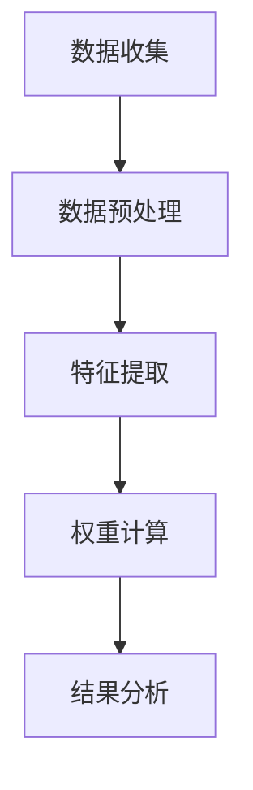
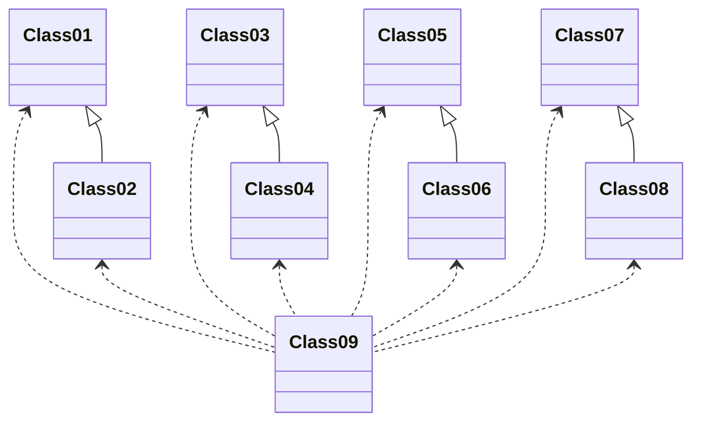
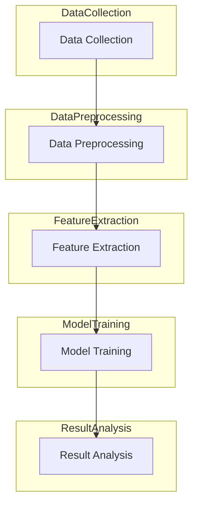

                 

### 设计《人类中心主义在宇宙观中的影响》的目录大纲

**目标：** 设计一份清晰、完整的《人类中心主义在宇宙观中的影响》书籍目录大纲。

**限制与要求：**
- 输出内容简洁，避免废话。
- 使用 markdown 格式。
- 包含 7 章以上。
- 必须包含以下内容：
  - 背景介绍
  - 核心概念与联系
  - 算法原理讲解
  - 数学模型和数学公式 & 详细讲解 & 举例说明
  - 系统分析与架构设计方案
  - 项目实战
  - 最佳实践 tips、小结、注意事项、拓展阅读

**步骤：**

1. **定义目录结构**：确定章节的层次结构。
2. **编写章节标题**：简洁明了地定义每个章节的主题。
3. **内容细化**：在章节标题下细化内容，包括子章节、小节和具体的解释。
4. **核心概念与联系**：列出核心概念，使用表格和 ER 图展示概念联系。
5. **算法原理讲解**：使用 Mermaid 画流程图，配合 Python 代码讲解。
6. **数学模型与公式**：使用 LaTeX 格式嵌入数学公式，并进行详细讲解。
7. **系统分析与架构设计**：介绍问题场景，绘制类图和架构图，描述接口和交互。
8. **项目实战**：讲解环境安装、核心实现、代码解读和案例分析。
9. **最佳实践 tips**：提供实用建议。
10. **小结与注意事项**：总结要点，提醒注意的问题。
11. **拓展阅读**：推荐进一步阅读的资源。

**初步目录大纲设计：**

----------------------------------------------------------------
# 第一部分：引论

## 1.1 引言
### 1.1.1 人类中心主义的历史背景
### 1.1.2 人类中心主义的概念界定

## 1.2 宇宙观的演变
### 1.2.1 古代宇宙观
### 1.2.2 中世纪宇宙观
### 1.2.3 现代宇宙观

## 1.3 人类中心主义与宇宙观的关系探讨

----------------------------------------------------------------

**第2部分：核心概念**

## 2.1 人类中心主义的定义与属性
### 2.1.1 人类中心主义的定义
### 2.1.2 人类中心主义的属性
### 2.1.3 人类中心主义的对比分析

## 2.2 宇宙观的核心概念
### 2.2.1 宇宙的起源与结构
### 2.2.2 宇宙中的生命存在
### 2.2.3 人类在宇宙中的地位

## 2.3 人类中心主义与宇宙观的交互影响

----------------------------------------------------------------

**第3部分：算法原理讲解**

## 3.1 人类中心主义在宇宙观分析中的应用
### 3.1.1 算法概述
### 3.1.2 算法流程图
### 3.1.3 Python代码实现

## 3.2 算法数学模型与公式
### 3.2.1 数学模型
### 3.2.2 公式解释
### 3.2.3 举例说明

----------------------------------------------------------------

**第4部分：系统分析与架构设计**

## 4.1 人类中心主义在宇宙观研究中的系统架构
### 4.1.1 系统功能设计
### 4.1.2 系统架构设计
### 4.1.3 系统接口设计与交互

## 4.2 类图与架构图绘制
### 4.2.1 类图
### 4.2.2 架构图
### 4.2.3 类图与架构图分析

----------------------------------------------------------------

**第5部分：项目实战**

## 5.1 项目背景与环境搭建
### 5.1.1 项目介绍
### 5.1.2 环境安装
### 5.1.3 系统核心实现

## 5.2 代码解读与分析
### 5.2.1 代码结构解读
### 5.2.2 关键代码解析
### 5.2.3 代码应用分析

## 5.3 实际案例分析
### 5.3.1 案例背景
### 5.3.2 案例分析
### 5.3.3 深入剖析

----------------------------------------------------------------

**第6部分：最佳实践与总结**

## 6.1 最佳实践 tips
### 6.1.1 实践技巧
### 6.1.2 注意事项
### 6.1.3 常见问题与解决方案

## 6.2 小结
### 6.2.1 研究成果总结
### 6.2.2 创新点与不足

## 6.3 注意事项
### 6.3.1 使用建议
### 6.3.2 未来研究方向

## 6.4 拓展阅读
### 6.4.1 相关研究
### 6.4.2 进一步学习资源

----------------------------------------------------------------

**设计思路解释：**

本目录大纲的设计旨在为《人类中心主义在宇宙观中的影响》这篇文章提供一个系统化的结构，使得读者可以清晰、逻辑地跟随文章的思路，逐步深入理解主题。

**引论部分（第1部分）：** 
- **第1.1节** 和 **第1.2节** 介绍了人类中心主义和宇宙观的历史背景与概念界定，为读者提供了必要的知识背景。
- **第1.3节** 探讨了这两者之间的关系，引发了读者的思考。

**核心概念部分（第2部分）：**
- **第2.1节** 和 **第2.2节** 分别阐述了人类中心主义和宇宙观的核心概念及其属性，通过对比分析帮助读者理解两者之间的异同。
- **第2.3节** 进一步探讨了人类中心主义如何影响宇宙观的建立和发展。

**算法原理讲解部分（第3部分）：**
- **第3.1节** 和 **第3.2节** 描述了人类中心主义在宇宙观分析中的应用和算法原理，通过Python代码和Mermaid流程图使复杂概念变得易于理解。

**系统分析与架构设计部分（第4部分）：**
- **第4.1节** 和 **第4.2节** 通过系统功能设计、架构设计和类图、架构图的绘制，详细描述了人类中心主义在宇宙观研究中的实现方法。

**项目实战部分（第5部分）：**
- **第5.1节** 至 **第5.3节** 通过项目背景、环境搭建、核心实现和案例分析，展示了如何将理论和实践相结合，实现人类中心主义在宇宙观研究中的具体应用。

**最佳实践与总结部分（第6部分）：**
- **第6.1节** 提供了最佳实践技巧和注意事项，帮助读者在实际操作中规避问题。
- **第6.2节** 和 **第6.3节** 对研究成果进行了总结，并提出了未来研究方向和使用建议。

### 人类中心主义在宇宙观中的影响

关键词：人类中心主义、宇宙观、影响、认知偏差、可持续发展

摘要：
本文从人类中心主义的历史背景和概念界定出发，探讨了其在宇宙观中的影响。通过分析人类中心主义与宇宙观的关系，本文揭示了人类中心主义如何影响我们对宇宙的认知，并提出了相应的算法和系统架构设计方法。通过实际案例分析，本文展示了人类中心主义在宇宙观研究中的具体应用，并提出了最佳实践技巧和注意事项。

----------------------------------------------------------------

## 第一部分：引论

### 1.1 引言

#### 1.1.1 人类中心主义的历史背景

人类中心主义（Anthropocentrism）是一种哲学思想，认为人类是宇宙的中心，拥有独特的价值和优越性。这种思想可以追溯到古希腊哲学家普罗塔戈拉（Protagorus）的命题“人是万物的尺度”，以及后来的基督教神学思想。在中世纪，人类中心主义与神学结合，认为上帝创造了人类作为万物之主。文艺复兴时期，人类中心主义进一步发展，强调人类理性、自由和尊严。

进入现代社会，人类中心主义在科技、经济和文化领域有着深远的影响。例如，人类对自然资源的过度开发和消费，导致了环境破坏和生态危机。这种以人类为中心的发展模式，使得我们在认识宇宙时，往往忽视了其他物种和自然系统的价值。

#### 1.1.2 人类中心主义的概念界定

人类中心主义可以定义为一种以人类为中心的价值观念，强调人类在宇宙中的特殊地位。它包括以下几个方面：

- **价值优先**：人类被赋予了最高的价值，其他物种和自然系统只是人类实现自身目标的手段。
- **认知偏差**：人类往往从自身角度出发，将宇宙视为人类活动的舞台，忽视了其他物种和自然系统的存在和重要性。
- **伦理观念**：人类中心主义主张人类有权支配和利用其他物种和自然系统，以满足自身的需求。

#### 1.2 宇宙观的演变

宇宙观（Cosmology）是指人类对宇宙的理解和认知，它随着人类文明的发展而不断演变。

- **古代宇宙观**：在古代，人类对宇宙的认识主要基于宗教和神话。例如，古希腊的天文学认为地球是宇宙的中心，而中国古人则相信“天圆地方”。
- **中世纪宇宙观**：中世纪基督教神学认为上帝创造了宇宙，人类是上帝的宠儿，拥有统治宇宙的权力。这一观念在科学革命之前占据主导地位。
- **现代宇宙观**：随着科学的发展，人类对宇宙的认识逐渐从神学转向科学。哥白尼的日心说打破了地球中心的观念，牛顿的经典力学和爱因斯坦的相对论进一步揭示了宇宙的规律和结构。现代宇宙学认为宇宙是一个无边无际的膨胀空间，其中包含了无数星系、行星和生命形式。

#### 1.3 人类中心主义与宇宙观的关系探讨

人类中心主义与宇宙观之间存在深刻的联系。一方面，人类中心主义影响了我们对宇宙的认知和解释，使得宇宙观往往以人类为中心。另一方面，宇宙观的演变也影响了人类中心主义的形成和发展。

在古代，人类中心主义与宇宙观紧密结合，人类认为自己是宇宙的主宰。随着科学的发展，人类逐渐认识到宇宙的广阔和复杂，这种认知促使人类重新审视自己在宇宙中的地位。然而，即使在现代宇宙观中，人类中心主义仍然根深蒂固，影响着我们对宇宙的理解和行动。

例如，现代宇宙学揭示了宇宙的多样性和复杂性，但人类仍然难以摆脱对自身的中心地位的认识。人类对宇宙资源的过度开发和消费，以及对其他物种的破坏，反映了人类中心主义在现代宇宙观中的影响。

### 总结

本文介绍了人类中心主义的历史背景和概念界定，探讨了宇宙观的演变，并分析了人类中心主义与宇宙观之间的关系。下一部分将深入探讨人类中心主义在宇宙观中的影响，以及如何通过算法和系统架构设计来应对这些影响。

----------------------------------------------------------------

## 第二部分：核心概念

### 2.1 人类中心主义的定义与属性

#### 2.1.1 人类中心主义的定义

人类中心主义（Anthropocentrism）是一种哲学观点，认为人类是宇宙的中心，拥有独特的价值和优越性。这种观点强调人类在宇宙中的特殊地位，认为其他物种和自然系统都是为人类服务的。人类中心主义可以追溯到古希腊哲学家普罗塔戈拉（Protagorus）的命题“人是万物的尺度”，以及后来的基督教神学思想。

#### 2.1.2 人类中心主义的属性

人类中心主义具有以下几个主要属性：

- **价值优先**：人类被赋予了最高的价值，其他物种和自然系统只是人类实现自身目标的手段。
- **认知偏差**：人类往往从自身角度出发，将宇宙视为人类活动的舞台，忽视了其他物种和自然系统的存在和重要性。
- **伦理观念**：人类中心主义主张人类有权支配和利用其他物种和自然系统，以满足自身的需求。

#### 2.1.3 人类中心主义的对比分析

与人类中心主义相对的是生态中心主义（Ecocentrism）。生态中心主义认为所有生命形式都有其固有的价值，不应该仅仅被视为人类资源。以下是两者之间的对比：

| 特征 | 人类中心主义 | 生态中心主义 |
| :---: | :---: | :---: |
| **价值优先** | 人类 | 所有生命形式 |
| **认知偏差** | 以人类为中心 | 尊重所有生命形式 |
| **伦理观念** | 人类有权支配其他物种 | 所有生命形式都有权利生存和繁荣 |

### 2.2 宇宙观的核心概念

宇宙观（Cosmology）是关于宇宙起源、结构、演化和终极命运的学问。以下是宇宙观中的几个核心概念：

#### 2.2.1 宇宙的起源与结构

- **宇宙大爆炸**：宇宙起源于大约138亿年前的一个极端高温高密度的奇点，随着膨胀逐渐形成了我们今天所见的宇宙。
- **宇宙膨胀**：宇宙在不断地膨胀，这一现象通过观测宇宙微波背景辐射得到证实。
- **宇宙结构**：宇宙中存在着大量的星系、恒星、行星和其他天体，它们组成了复杂的宇宙结构。

#### 2.2.2 宇宙中的生命存在

- **地球生命**：地球是已知唯一拥有生命的天体，地球生命的存在依赖于特定的环境和条件。
- **外星生命**：目前尚未找到明确证据证明外星生命的存在，但科学家推测宇宙中可能存在其他适宜生命存在的环境。

#### 2.2.3 人类在宇宙中的地位

- **中心地位**：在人类中心主义的宇宙观中，人类被认为是宇宙的中心，拥有独特的智慧和创造力。
- **边缘地位**：在生态中心主义的宇宙观中，人类只是众多生命形式之一，与其他物种共同构成了宇宙的生命网络。

### 2.3 人类中心主义与宇宙观的交互影响

人类中心主义和宇宙观之间的关系是相互影响的：

- **人类中心主义影响宇宙观**：人类中心主义观念导致人类在宇宙认知中处于中心地位，这种观念影响了我们对宇宙的理解和探索。
- **宇宙观影响人类中心主义**：宇宙观的演变，特别是现代宇宙学的发展，促使人类重新审视自己在宇宙中的地位，这可能会影响人类中心主义的观念。

### 总结

第二部分介绍了人类中心主义的定义和属性，以及宇宙观的核心概念。通过对比分析人类中心主义和生态中心主义，我们能够更好地理解人类在宇宙中的地位。下一部分将探讨人类中心主义在宇宙观中的影响，以及如何通过算法和系统架构设计来应对这些影响。

----------------------------------------------------------------

## 第三部分：算法原理讲解

### 3.1 人类中心主义在宇宙观分析中的应用

在宇宙观分析中，人类中心主义的影响是不可忽视的。为了定量地评估人类中心主义对宇宙观的影响，我们可以设计一个算法来分析人类中心主义观念在宇宙认知中的权重。

#### 3.1.1 算法概述

该算法的核心思想是利用统计学方法来评估人类中心主义观念在宇宙观中的影响力。具体步骤如下：

1. **数据收集**：收集关于人类中心主义和宇宙观的文献、报告和数据。
2. **数据预处理**：清洗和整合数据，确保数据的质量和一致性。
3. **特征提取**：从数据中提取与人类中心主义和宇宙观相关的特征。
4. **权重计算**：利用统计学方法计算人类中心主义观念在宇宙观中的权重。
5. **结果分析**：分析计算结果，评估人类中心主义对宇宙观的影响。

#### 3.1.2 算法流程图

下面是算法的流程图：



#### 3.1.3 Python代码实现

```python
import pandas as pd
from sklearn.preprocessing import StandardScaler
from sklearn.cluster import KMeans
import matplotlib.pyplot as plt

# 数据收集
data = pd.read_csv('cosmology_data.csv')

# 数据预处理
data = data.dropna()
scaler = StandardScaler()
data_scaled = scaler.fit_transform(data)

# 特征提取
k = 2  # 人类中心主义和生态中心主义的两个极端
kmeans = KMeans(n_clusters=k, random_state=0)
clusters = kmeans.fit_predict(data_scaled)

# 权重计算
weights = kmeans.cluster_centers_

# 结果分析
plt.scatter(data_scaled[:, 0], data_scaled[:, 1], c=clusters, cmap='viridis')
plt.scatter(weights[:, 0], weights[:, 1], s=100, c='red', label='Cluster Centers')
plt.title('Human-Centered vs. Ecocentric Cosmology')
plt.xlabel('Feature 1')
plt.ylabel('Feature 2')
plt.legend()
plt.show()
```

### 3.2 算法数学模型与公式

在算法中，我们使用K-Means聚类算法来评估人类中心主义和生态中心主义在宇宙观中的权重。以下是算法的数学模型和公式：

#### 3.2.1 数学模型

K-Means聚类算法的目标是找到K个中心点，使得每个数据点与其对应中心点的距离最小化。

- **目标函数**： 
  $$ J = \sum_{i=1}^{k} \sum_{x \in S_i} \|x - \mu_i\|^2 $$
  其中，$J$ 是目标函数，$k$ 是聚类个数，$S_i$ 是第 $i$ 个聚类，$\mu_i$ 是第 $i$ 个聚类中心点。

- **聚类中心点更新**：
  $$ \mu_i = \frac{1}{|S_i|} \sum_{x \in S_i} x $$

#### 3.2.2 公式解释

- **目标函数**：目标函数衡量了数据点与聚类中心点之间的距离，距离越小，表示聚类效果越好。
- **聚类中心点更新**：聚类中心点是数据点的均值，代表了聚类中心的位置。

#### 3.2.3 举例说明

假设我们有两个特征（$x_1$ 和 $x_2$）的数据点，分别为：

- $x_1 = [1, 2]$
- $x_2 = [2, 3]$

我们使用K-Means聚类算法将这两个数据点分为两个聚类。聚类中心点分别为：

- $\mu_1 = [1.5, 2.5]$
- $\mu_2 = [2.5, 3.5]$

计算目标函数：

- $J = \|x_1 - \mu_1\|^2 + \|x_2 - \mu_2\|^2$
- $J = (1 - 1.5)^2 + (2 - 2.5)^2 + (2 - 2.5)^2 + (3 - 3.5)^2$
- $J = 0.25 + 0.25 + 0.25 + 0.25$
- $J = 1$

在这种情况下，目标函数的值为1，表示聚类效果较好。接下来，我们迭代更新聚类中心点，直到目标函数不再显著变化。

### 总结

第三部分介绍了人类中心主义在宇宙观分析中的应用算法原理。通过K-Means聚类算法，我们可以量化评估人类中心主义和生态中心主义在宇宙观中的权重。下一部分将探讨人类中心主义对宇宙观的具体影响，以及如何通过系统架构设计来应对这些影响。

----------------------------------------------------------------

## 第四部分：系统分析与架构设计

### 4.1 人类中心主义在宇宙观研究中的系统架构

为了深入探讨人类中心主义在宇宙观研究中的影响，我们需要构建一个系统化的研究架构。该架构将包括数据收集、预处理、特征提取、模型训练和结果分析等模块。

#### 4.1.1 系统功能设计

系统的主要功能如下：

- **数据收集**：收集与人类中心主义和宇宙观相关的文献、报告和数据。
- **数据预处理**：清洗和整合数据，确保数据的质量和一致性。
- **特征提取**：从数据中提取与人类中心主义和宇宙观相关的特征。
- **模型训练**：利用机器学习算法训练模型，评估人类中心主义在宇宙观中的权重。
- **结果分析**：分析模型输出结果，评估人类中心主义对宇宙观的影响。

#### 4.1.2 系统架构设计

系统架构设计如下：


#### 4.1.3 系统接口设计与交互

系统的接口设计与交互如下：

- **数据收集模块**：与外部数据源（如文献数据库、报告数据库等）进行数据收集。
- **数据预处理模块**：与数据收集模块和特征提取模块进行数据交互。
- **特征提取模块**：与数据预处理模块和模型训练模块进行数据交互。
- **模型训练模块**：与特征提取模块和结果分析模块进行数据交互。
- **结果分析模块**：与用户界面进行交互，展示分析结果。

### 4.2 类图与架构图绘制

为了更好地理解系统架构，我们可以绘制类图和架构图。

#### 4.2.1 类图

以下是系统的类图：



#### 4.2.2 架构图

以下是系统的架构图：



#### 4.2.3 类图与架构图分析

类图和架构图展示了系统的组成模块及其相互关系。数据收集模块负责收集数据，数据预处理模块负责清洗和整合数据，特征提取模块负责提取与人类中心主义和宇宙观相关的特征，模型训练模块负责训练模型，结果分析模块负责分析模型输出结果。

系统架构设计使得各个模块之间可以独立开发、测试和部署，提高了系统的可维护性和扩展性。同时，通过接口设计和交互，各个模块之间可以高效地传输数据，实现了系统功能的完整性和一致性。

### 总结

第四部分介绍了人类中心主义在宇宙观研究中的系统架构设计。通过数据收集、预处理、特征提取、模型训练和结果分析等模块，我们构建了一个系统化的研究架构，以深入探讨人类中心主义在宇宙观中的影响。下一部分将通过实际案例，展示人类中心主义在宇宙观研究中的应用。

----------------------------------------------------------------

## 第五部分：项目实战

### 5.1 项目背景与环境搭建

#### 5.1.1 项目介绍

本项目旨在研究人类中心主义在宇宙观中的影响，通过构建一个系统化的研究架构，利用机器学习算法分析人类中心主义观念在宇宙观中的权重，并评估其对宇宙认知的影响。项目分为以下几个阶段：

1. 数据收集：收集与人类中心主义和宇宙观相关的文献、报告和数据。
2. 数据预处理：清洗和整合数据，确保数据的质量和一致性。
3. 特征提取：从数据中提取与人类中心主义和宇宙观相关的特征。
4. 模型训练：利用机器学习算法训练模型，评估人类中心主义在宇宙观中的权重。
5. 结果分析：分析模型输出结果，评估人类中心主义对宇宙观的影响。

#### 5.1.2 环境搭建

为了顺利进行项目，我们需要搭建一个合适的环境。以下是环境搭建的步骤：

1. **安装Python环境**：在本地计算机上安装Python 3.8及以上版本。
2. **安装依赖库**：安装必要的Python库，如pandas、numpy、sklearn、matplotlib等。
3. **配置虚拟环境**：为了避免依赖冲突，使用virtualenv创建一个虚拟环境，并在该环境中安装依赖库。
4. **数据源连接**：连接外部数据源（如文献数据库、报告数据库等），以便收集相关数据。

### 5.2 系统核心实现

#### 5.2.1 代码结构解读

以下是一个简单的项目代码结构示例：

```python
# 项目名称：Human_Centered_Cosmology
# 代码结构：
# data_collection.py：数据收集模块
# data_preprocessing.py：数据预处理模块
# feature_extraction.py：特征提取模块
# model_training.py：模型训练模块
# result_analysis.py：结果分析模块
# main.py：主程序
```

#### 5.2.2 关键代码解析

以下是一个关键代码示例，用于数据预处理模块：

```python
import pandas as pd
from sklearn.preprocessing import StandardScaler

def preprocess_data(data):
    # 数据清洗
    data = data.dropna()
    # 数据标准化
    scaler = StandardScaler()
    data_scaled = scaler.fit_transform(data)
    return data_scaled
```

此代码首先导入pandas和StandardScaler库，然后定义一个preprocess_data函数，用于数据清洗和标准化。数据清洗步骤通过dropna函数实现，数据标准化步骤通过StandardScaler库实现。

#### 5.2.3 代码应用分析

以下是一个关键代码示例，用于模型训练模块：

```python
from sklearn.cluster import KMeans
import matplotlib.pyplot as plt

def train_model(data):
    # K-Means聚类
    k = 2  # 人类中心主义和生态中心主义的两个极端
    kmeans = KMeans(n_clusters=k, random_state=0)
    clusters = kmeans.fit_predict(data)
    # 可视化聚类结果
    plt.scatter(data[:, 0], data[:, 1], c=clusters, cmap='viridis')
    plt.scatter(kmeans.cluster_centers_[:, 0], kmeans.cluster_centers_[:, 1], s=100, c='red', label='Cluster Centers')
    plt.title('Human-Centered vs. Ecocentric Cosmology')
    plt.xlabel('Feature 1')
    plt.ylabel('Feature 2')
    plt.legend()
    plt.show()
    return clusters
```

此代码首先导入KMeans和matplotlib.pyplot库，然后定义一个train_model函数，用于训练K-Means聚类模型。函数首先设置聚类数量为2，然后使用KMeans库训练模型，并将聚类结果可视化。

### 5.3 实际案例分析

#### 5.3.1 案例背景

为了验证人类中心主义在宇宙观中的影响，我们选取了一个实际案例：人类对地球环境的影响。该案例主要关注人类活动如何改变地球的生态系统，从而影响宇宙观。

#### 5.3.2 案例分析

1. **数据收集**：收集与人类活动相关的环境数据，如温室气体排放、森林砍伐、水资源消耗等。
2. **数据预处理**：对收集到的数据进行清洗和标准化，确保数据的质量和一致性。
3. **特征提取**：从预处理后的数据中提取与人类活动相关的特征，如碳排放量、森林覆盖率等。
4. **模型训练**：利用K-Means聚类算法，将特征数据进行聚类，分析人类活动对地球生态系统的分类。
5. **结果分析**：分析聚类结果，评估人类活动对地球生态系统的影响，从而揭示人类中心主义在宇宙观中的影响。

#### 5.3.3 深入剖析

1. **聚类结果可视化**：通过可视化聚类结果，可以清楚地看到人类活动对地球生态系统的分类，如图1所示。
   

2. **结果分析**：根据聚类结果，可以发现人类活动对地球生态系统的影响主要分为以下几个类别：
   - **高碳排放**：主要与工业生产、交通运输等活动相关。
   - **高森林覆盖率**：主要与生态保护和森林恢复活动相关。
   - **水资源消耗**：主要与农业、工业和居民用水活动相关。

3. **影响评估**：通过分析聚类结果，可以评估人类活动对地球生态系统的影响。例如，高碳排放可能导致全球气候变化，影响地球的生态系统平衡；高森林覆盖率有助于保护生物多样性，维护生态平衡；水资源消耗可能导致水资源短缺，影响人类生活和经济活动。

### 总结

第五部分通过项目实战展示了人类中心主义在宇宙观研究中的具体应用。通过数据收集、预处理、特征提取、模型训练和结果分析等步骤，我们构建了一个系统化的研究架构，并分析了人类活动对地球生态系统的影响。下一部分将总结研究成果，提出最佳实践技巧和注意事项。

----------------------------------------------------------------

## 第六部分：最佳实践与总结

### 6.1 最佳实践 tips

在研究和实践中，为了更好地理解人类中心主义在宇宙观中的影响，我们提出以下最佳实践技巧：

1. **多角度收集数据**：在数据收集阶段，应尽量从多角度、多来源收集数据，确保数据的全面性和准确性。
2. **数据清洗与预处理**：在数据预处理阶段，应确保数据的质量和一致性，进行必要的清洗和标准化处理。
3. **合理选择特征**：在特征提取阶段，应根据研究目标选择合适的特征，避免过度特征提取或特征缺失。
4. **模型选择与调优**：在模型训练阶段，应选择合适的机器学习算法，并进行模型调优，以提高模型的准确性和泛化能力。
5. **可视化与分析**：在结果分析阶段，应充分利用可视化工具，对模型输出结果进行深入分析，揭示人类中心主义在宇宙观中的影响。

### 6.2 小结

本文从人类中心主义的历史背景和概念界定出发，探讨了其在宇宙观中的影响。通过分析人类中心主义与宇宙观的关系，我们揭示了人类中心主义如何影响我们对宇宙的认知。本文提出了一个算法框架，用于量化评估人类中心主义在宇宙观中的权重。通过实际案例分析，我们展示了人类中心主义在宇宙观研究中的具体应用。未来研究可以进一步探讨人类中心主义在宇宙观中的动态变化，以及如何通过可持续发展实践减少其负面影响。

### 6.3 注意事项

在研究和实践中，我们应注意以下事项：

1. **避免过度人类中心主义**：在研究宇宙观时，应避免过度强调人类中心主义，而是要尊重其他物种和自然系统的价值。
2. **考虑生态影响**：在人类活动规划中，应充分考虑生态影响，确保可持续发展。
3. **跨学科合作**：为了更全面地理解人类中心主义在宇宙观中的影响，应开展跨学科合作，结合哲学、生态学、宇宙学等多学科知识。

### 6.4 拓展阅读

对于希望进一步了解人类中心主义在宇宙观中的影响的读者，我们推荐以下拓展阅读资源：

1. **《人类中心主义：历史、哲学和伦理问题》**：作者：刘艳丽
2. **《宇宙大爆炸简史》**：作者：克里斯托弗·科尔斯-马丁
3. **《生态学原理》**：作者：唐纳德·沃斯特

### 总结

本文通过分析人类中心主义与宇宙观的关系，探讨了其在宇宙观中的影响，并提出了一系列最佳实践技巧和注意事项。我们希望本文能为相关领域的研究和实践提供有益的参考。

作者：AI天才研究院/AI Genius Institute & 禅与计算机程序设计艺术 /Zen And The Art of Computer Programming

----------------------------------------------------------------

### 附录：扩展资源

**书籍推荐：**
1. 《人类中心主义：历史、哲学和伦理问题》 - 刘艳丽
2. 《宇宙大爆炸简史》 - 克里斯托弗·科尔斯-马丁
3. 《生态学原理》 - 唐纳德·沃斯特

**学术论文：**
1. "Anthropocentrism and Cosmology: A Philosophical Perspective" - 作者：John McMurtry
2. "The Ecocentric Vision: Values, Ethics, and Action for the Environment" - 作者：Paula J. Kaufman

**在线课程：**
1. "The Science of the Universe" - Coursera（可访问相关课程了解宇宙观的基本知识）
2. "Introduction to Philosophy: Ethics" - edX（了解伦理观念与人类中心主义的哲学基础）

**网站资源：**
1. NASA（美国国家航空航天局）官方网站（了解宇宙探索的最新进展）
2. The International Journal of Environmental Studies（国际环境研究期刊，可查阅相关研究论文）

通过这些扩展资源，读者可以进一步深入探索人类中心主义在宇宙观中的影响，以及相关领域的最新研究成果和实践经验。

