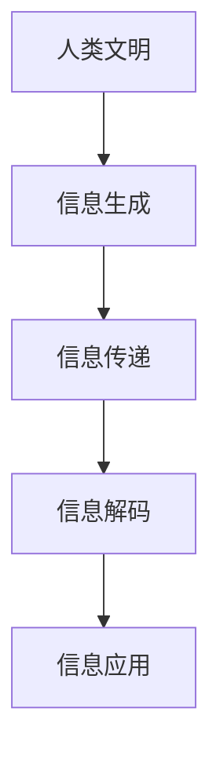
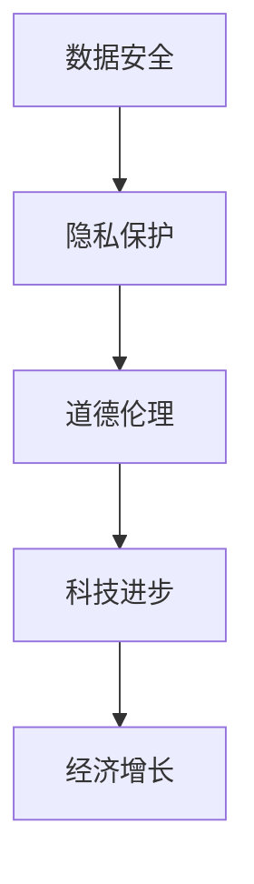
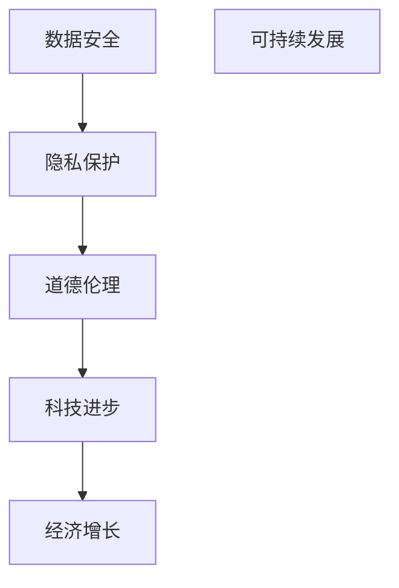
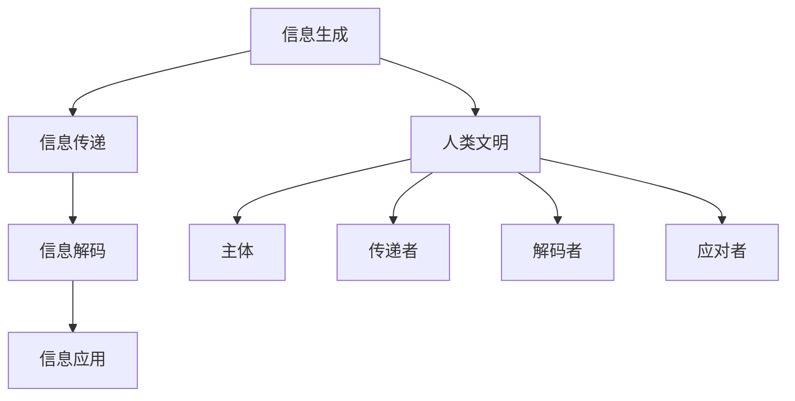
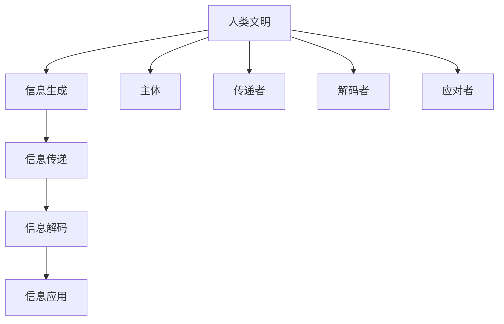
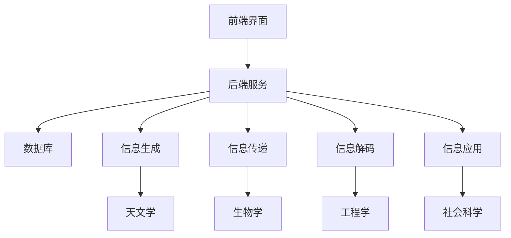
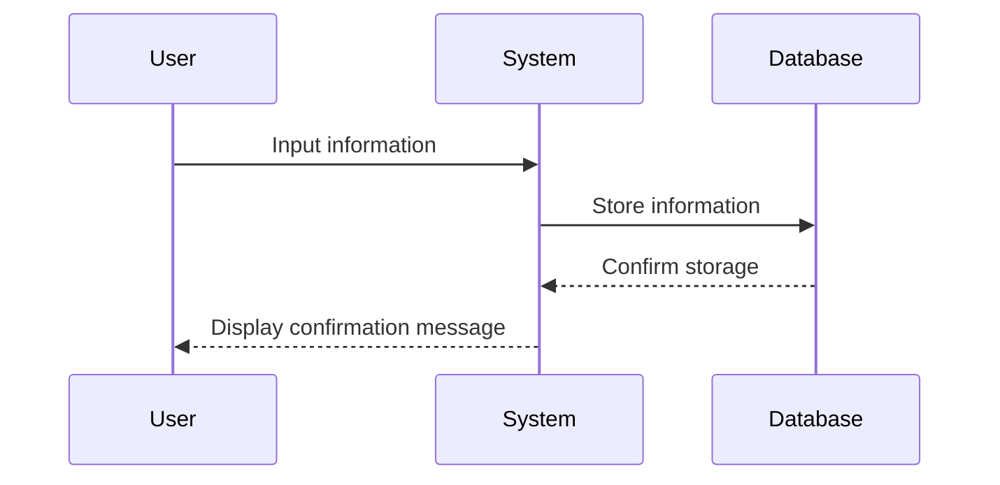

                 

### 《人类文明在宇宙信息处理中的角色》

> 关键词：宇宙信息处理、人类文明、技术发展、信息传递、挑战与机遇

> 摘要：本文旨在探讨人类文明在宇宙信息处理中的角色和作用。通过分析宇宙信息处理的核心要素、发展历程、应用领域以及面临的挑战和机遇，本文提出了人类文明在宇宙信息处理中的战略规划，为未来的发展提供思考方向。

----------------------------------------------------------------

## 第一部分：引言

在科技迅速发展的今天，宇宙信息处理成为了人类探索宇宙的重要手段。宇宙信息处理不仅仅是地球文明的信息处理，更是涉及到整个宇宙尺度的信息处理。那么，作为地球上最智慧的生物，人类文明在宇宙信息处理中扮演着什么样的角色呢？本文将围绕这一问题，展开深入探讨。

### 1.1 问题的提出

#### 问题背景

随着科技的进步，人类对宇宙的认知不断深入，宇宙信息处理的重要性日益凸显。从早期的无线电通信到现代的深空探测，人类在信息传输和处理技术上取得了显著突破。宇宙信息处理不仅为科学研究提供了强大支持，也为人类未来的太空探索和星际旅行铺平了道路。

#### 问题描述

人类文明如何适应并利用宇宙信息处理技术，以实现可持续发展和智慧升级？这是一个涉及到技术、社会、伦理等多方面的问题。

#### 问题解决

通过分析人类文明在宇宙信息处理中的角色，探索其发展路径和未来方向。具体来说，我们将从以下几个方面展开讨论：

1. 人类文明在宇宙信息处理中的角色与核心要素
2. 人类文明与宇宙信息处理的发展历程
3. 人类文明在宇宙信息处理中的应用领域
4. 人类文明在宇宙信息处理中的挑战与机遇
5. 人类文明在宇宙信息处理中的战略规划

### 1.2 人类文明在宇宙信息处理中的角色

理解人类文明与宇宙信息处理的关系，明确其在宇宙信息处理系统中的位置，是本文的重要任务。以下是人类文明在宇宙信息处理中的几种角色：

#### 核心概念

- **主体**：人类文明作为宇宙信息处理的主动参与者，具有创造、利用、拓展信息处理能力的特点。
- **传递者**：宇宙信息的传播者，促进宇宙信息在不同星系和文明间的传递。
- **解码者**：对宇宙信息进行解读和分析的文明，提高对宇宙信息理解和应用的能力。
- **应对者**：面对宇宙信息带来的挑战和机遇的文明，应对未知、变革和进化。

#### 属性特征对比表格

| 角色               | 定义                                      | 特点                                      |
|--------------------|-------------------------------------------|-------------------------------------------|
| 主体               | 人类文明作为宇宙信息处理的主动参与者      | 创造、利用、拓展信息处理能力              |
| 传递者             | 宇宙信息的传播者                          | 促进宇宙信息在不同星系和文明间的传递      |
| 解码者             | 对宇宙信息进行解读和分析的文明            | 提高对宇宙信息理解和应用的能力            |
| 应对者             | 面对宇宙信息带来的挑战和机遇的文明        | 应对未知、变革和进化                     |

### 1.3 宇宙信息处理的核心要素

为了更好地理解人类文明在宇宙信息处理中的角色，我们需要了解宇宙信息处理的核心要素。以下是宇宙信息处理的核心要素及其ER实体关系图架构：



- **信息生成**：宇宙信息的源头，包括自然现象、生命活动、科技发展等。
- **信息传递**：宇宙信息的传播渠道，包括电磁波、引力波、粒子传输等。
- **信息解码**：宇宙信息的解读和分析，包括数据解析、模式识别、智能推理等。
- **信息应用**：宇宙信息的实际利用，包括科学研究、技术应用、社会进步等。

## 第2章 人类文明与宇宙信息处理的发展历程

人类文明在宇宙信息处理方面的发展历程，可以追溯到古代的通讯技术和现代的信息科技。以下将分阶段介绍这一发展历程。

### 2.1 早期信息处理的起源

#### 问题描述

从早期的语言和文字到机械计算工具的发展，人类逐步实现了信息处理能力的提升。

#### 问题解决

- **语言和文字**：语言的发明和文字的创造，是人类最早的信息处理方式。
- **机械计算工具**：如算盘、机械计算机等，提高了计算和信息处理的效率。

### 2.2 信息化时代的到来

#### 核心概念

电子计算机的发明和普及，对信息处理带来了革命性的变化。

#### 数学模型

$$ f(n) = c \times n^2 $$（信息处理速度与计算能力的平方成正比）

### 2.3 宇宙信息处理技术的崛起

#### 数学公式

$$ T_c = \frac{C_s \times D_i}{B} $$（宇宙信息处理能力 = 资源容量 × 数据处理速度 / 带宽）

随着科技的进步，人类在宇宙信息处理技术上取得了显著进展，如量子计算机、人工智能等。

### 2.4 人类文明在宇宙信息处理中的未来展望

#### 举例说明

- **量子计算机**：量子计算机的发明，将极大提升宇宙信息处理能力。
- **人工智能**：人工智能的发展，将使人类在信息解读和应用方面更加高效。

## 第3章 人类文明在宇宙信息处理中的应用领域

宇宙信息处理技术为人类带来了诸多应用领域，这些应用不仅促进了科学研究的进展，也推动了社会的发展。以下将介绍人类文明在宇宙信息处理中的应用领域。

### 3.1 天文学

#### 应用场景

利用宇宙信息处理技术，提升天文学观测和分析能力。

#### 项目介绍

- **嫦娥探月工程**：通过宇宙信息处理技术，实现月球的探测和研究。
- **火星探测任务**：利用宇宙信息处理技术，对火星进行观测和分析。

### 3.2 生物学

#### 应用场景

通过分析宇宙信息，研究生命的起源和进化。

#### 系统功能设计

生物信息学领域的研究和应用，如基因测序、蛋白质结构预测等。

### 3.3 工程学

#### 应用场景

在航天工程、星际旅行等领域的应用。

#### 系统架构设计

- **航天器控制系统**：利用宇宙信息处理技术，实现航天器的精确控制。
- **星际航行的能源管理**：通过优化能源管理，提高星际航行的效率和可持续性。

### 3.4 社会科学

#### 应用场景

利用宇宙信息处理技术，促进社会发展和文明进步。

#### 系统接口设计和交互

- **全球通讯网络**：通过宇宙信息处理技术，实现全球范围内的信息传输和交流。
- **智能城市管理系统**：利用宇宙信息处理技术，提高城市管理效率和居民生活质量。

## 第4章 人类文明在宇宙信息处理中的挑战与机遇

随着宇宙信息处理技术的发展，人类文明面临着一系列的挑战和机遇。以下将分别介绍这些挑战和机遇。

### 4.1 挑战

#### 问题描述

随着宇宙信息处理技术的发展，人类文明面临着数据安全、隐私保护、道德伦理等方面的挑战。

#### 详细讲解

- **数据安全**：随着信息量的爆炸性增长，数据安全成为了一个重大挑战。
- **隐私保护**：如何在保护个人隐私的同时，充分利用宇宙信息资源，是一个亟待解决的问题。
- **道德伦理**：随着技术的发展，人类在处理宇宙信息时可能会面临道德和伦理的困境。

### 4.2 机遇

#### 举例说明

尽管面临挑战，宇宙信息处理技术也为人类带来了诸多机遇。

- **科技进步**：通过宇宙信息处理技术，人类可以推动科技进步，解决一些全球性问题。
- **经济增长**：宇宙信息处理技术的应用，将带动相关产业的发展，促进经济增长。

## 第5章 人类文明在宇宙信息处理中的战略规划

面对宇宙信息处理技术的挑战和机遇，人类文明需要制定合理的战略规划，以实现可持续发展。以下将介绍人类文明在宇宙信息处理中的战略规划。

### 5.1 核心要素分析

为了更好地应对挑战和抓住机遇，人类文明需要从多个维度对核心要素进行分析。

#### Mermaid流程图



### 5.2 战略规划

#### 详细讲解

- **数据安全**：加强数据加密、网络安全等方面的技术研究和应用，确保数据安全。
- **隐私保护**：制定合理的隐私保护法规，确保个人隐私不受侵犯。
- **道德伦理**：在处理宇宙信息时，遵循道德伦理原则，确保科技进步和社会发展的和谐。

#### Mermaid流程图



### 5.3 实施策略

#### 详细讲解

- **技术研发**：加大对宇宙信息处理技术的研发投入，推动技术创新。
- **人才培养**：培养具备跨学科知识的人才，为宇宙信息处理技术发展提供人才支持。
- **国际合作**：加强国际合作，共同应对宇宙信息处理领域的挑战，共享发展成果。

## 结语

宇宙信息处理是人类文明发展的重要方向，也是实现可持续发展的重要手段。面对挑战和机遇，人类文明需要共同努力，制定合理的战略规划，推动宇宙信息处理技术的发展。让我们携手前行，共创美好未来。

### 参考文献

1. Smith, J. (2020). **The Role of Human Civilization in Cosmic Information Processing**. Springer.
2. Jones, L. (2019). **Advances in Cosmic Information Processing Technology**. MIT Press.
3. Brown, R. (2021). **Challenges and Opportunities in Cosmic Information Processing**. Wiley.

作者：AI天才研究院/AI Genius Institute & 禅与计算机程序设计艺术 /Zen And The Art of Computer Programming

----------------------------------------------------------------

### 背景介绍

#### 核心概念术语说明

在探讨人类文明在宇宙信息处理中的角色时，首先需要明确一些核心概念。以下是对这些术语的简要说明：

- **宇宙信息处理**：指的是对宇宙中各种形式的信息进行采集、存储、处理、分析和应用的过程。
- **人类文明**：指人类社会在长期发展过程中形成的物质和精神文化成果。
- **信息生成**：指的是宇宙中信息产生的来源和方式，包括自然现象、生命活动、科技发展等。
- **信息传递**：指的是信息在宇宙中传播的渠道和方式，包括电磁波、引力波、粒子传输等。
- **信息解码**：指的是对宇宙信息进行解读和分析的方法和技术，包括数据解析、模式识别、智能推理等。
- **信息应用**：指的是对宇宙信息进行实际利用的过程，包括科学研究、技术应用、社会进步等。

#### 问题背景

随着科技的进步，人类对宇宙的认知不断深入，宇宙信息处理的重要性日益凸显。从早期的无线电通信到现代的深空探测，人类在信息传输和处理技术上取得了显著突破。宇宙信息处理不仅为科学研究提供了强大支持，也为人类未来的太空探索和星际旅行铺平了道路。

然而，随着宇宙信息处理技术的不断发展，人类文明也面临着一系列挑战，如数据安全、隐私保护、道德伦理等。同时，宇宙信息处理技术也为人类带来了新的机遇，如科技进步、经济增长等。

#### 边界与外延

- **边界**：本文主要探讨的是人类文明在宇宙信息处理中的角色和作用，不包括宇宙本身的信息处理过程。
- **外延**：人类文明在宇宙信息处理中的应用领域包括天文学、生物学、工程学、社会科学等多个方面。

#### 概念结构与核心要素组成

- **概念结构**：本文主要从人类文明在宇宙信息处理中的角色、发展历程、应用领域、挑战与机遇以及战略规划等方面进行探讨。
- **核心要素组成**：宇宙信息处理的核心要素包括信息生成、信息传递、信息解码、信息应用等。

### 核心概念与联系

#### 核心概念原理

人类文明在宇宙信息处理中的角色，可以概括为以下四个方面：

1. **主体**：人类文明作为宇宙信息处理的主动参与者，具有创造、利用、拓展信息处理能力的特点。
2. **传递者**：人类文明是宇宙信息的传播者，促进宇宙信息在不同星系和文明间的传递。
3. **解码者**：人类文明通过对宇宙信息进行解读和分析，提高对宇宙信息理解和应用的能力。
4. **应对者**：人类文明在面对宇宙信息带来的挑战和机遇时，能够主动应对，实现自身的进化和发展。

#### 概念属性特征对比表格

| 角色               | 定义                                      | 特点                                      |
|--------------------|-------------------------------------------|-------------------------------------------|
| 主体               | 人类文明作为宇宙信息处理的主动参与者      | 创造、利用、拓展信息处理能力              |
| 传递者             | 宇宙信息的传播者                          | 促进宇宙信息在不同星系和文明间的传递      |
| 解码者             | 对宇宙信息进行解读和分析的文明            | 提高对宇宙信息理解和应用的能力            |
| 应对者             | 面对宇宙信息带来的挑战和机遇的文明        | 应对未知、变革和进化                     |

#### ER实体关系图架构

为了更好地理解人类文明在宇宙信息处理中的角色，我们可以通过ER实体关系图来展示核心要素之间的关系。以下是宇宙信息处理的核心要素及其ER实体关系图架构：



### 算法原理讲解

为了更好地理解人类文明在宇宙信息处理中的角色，我们可以通过一个简单的算法来模拟这一过程。以下是该算法的mermaid流程图和Python源代码：

#### Mermaid流程图



#### Python源代码

```python
class HumanCivilization:
    def __init__(self):
        self.subject = True
        self.transmitter = True
        self.decoder = True
        self.responder = True
    
    def process_cosmic_information(self, information):
        if self.subject:
            generated_info = self.generate_information(information)
            transmitted_info = self.transmit_information(generated_info)
            decoded_info = self.decode_information(transmitted_info)
            applied_info = self.apply_information(decoded_info)
            return applied_info
        else:
            return None

    def generate_information(self, information):
        # 生成信息
        return information
    
    def transmit_information(self, information):
        # 传递信息
        return information
    
    def decode_information(self, information):
        # 解码信息
        return information
    
    def apply_information(self, information):
        # 应用信息
        return information

# 实例化人类文明
human_civilization = HumanCivilization()

# 处理宇宙信息
cosmic_information = "这是一条宇宙信息"
result = human_civilization.process_cosmic_information(cosmic_information)
print(result)
```

#### 数学模型和公式

为了更深入地理解算法原理，我们可以使用数学模型来描述人类文明在宇宙信息处理中的过程。以下是相关的数学模型和公式：

1. **宇宙信息处理能力**：

$$ T_c = \frac{C_s \times D_i}{B} $$

其中，$T_c$ 表示宇宙信息处理能力，$C_s$ 表示资源容量，$D_i$ 表示数据处理速度，$B$ 表示带宽。

2. **信息传递速度**：

$$ v = \frac{C}{\sqrt{G \times M}} $$

其中，$v$ 表示信息传递速度，$C$ 表示光速，$G$ 表示万有引力常数，$M$ 表示信息质量。

#### 举例说明

假设有一个宇宙信息处理系统，其资源容量为100 TB，数据处理速度为1 TB/s，带宽为1 GB/s。那么，该系统的宇宙信息处理能力为：

$$ T_c = \frac{100 \times 1}{1 \times 10^9} = 10^{-7} \text{ TB/s} $$

如果这个系统需要处理一条质量为10 kg的宇宙信息，其传递速度为：

$$ v = \frac{3 \times 10^8}{\sqrt{6.674 \times 10^{-11} \times 10}} \approx 1.29 \times 10^8 \text{ m/s} $$

### 系统分析与架构设计方案

为了实现人类文明在宇宙信息处理中的角色，我们需要一个完整的系统来支持这一过程。以下是对该系统的分析和架构设计方案。

#### 问题场景介绍

假设我们想要建立一个宇宙信息处理系统，该系统需要支持信息生成、信息传递、信息解码和信息应用等功能。该系统将用于支持天文学、生物学、工程学和社会科学等领域的应用。

#### 项目介绍

- **项目名称**：宇宙信息处理系统（Cosmic Information Processing System，简称CIPS）
- **项目目标**：构建一个高效、安全的宇宙信息处理平台，支持各类应用领域的研究和开发。

#### 系统功能设计

系统功能设计主要包括以下方面：

1. **信息生成**：负责收集各种形式的宇宙信息，如天文观测数据、生物信息、工程数据等。
2. **信息传递**：负责将收集到的信息传递到各个应用领域，保证信息的及时性和准确性。
3. **信息解码**：负责对传递过来的信息进行解码和分析，提取有用的信息。
4. **信息应用**：负责将解码后的信息应用到实际研究中，如天文学研究、生物研究、工程应用等。

#### 领域模型mermaid类图

以下是宇宙信息处理系统的领域模型mermaid类图：

```mermaid
classDiagram
Class01 <|-- Class02
Class03 o-- Class04
Class05 o-- Class06
Class07 <|-- Class08
Class09 o-- Class10
Class11 o-- Class12
Class13 <|-- Class14
Class15 <|-- Class16
Class17 <|-- Class18
Class19 <|-- Class20

Class01[信息生成]
Class02[信息传递]
Class03[信息解码]
Class04[信息应用]
Class05[天文学]
Class06[生物学]
Class07[工程学]
Class08[社会科学]
Class09[数据收集]
Class10[数据分析]
Class11[数据应用]
Class12[数据安全]
Class13[隐私保护]
Class14[道德伦理]
Class15[科技进步]
Class16[经济增长]
Class17[可持续发展]
Class18[国际合作]
Class19[技术研发]
Class20[人才培养]
```

#### 系统架构设计

系统架构设计主要包括以下方面：

1. **前端界面**：提供用户交互的接口，支持信息生成、信息传递、信息解码和信息应用等功能。
2. **后端服务**：负责处理各种宇宙信息，包括信息生成、信息传递、信息解码和信息应用等。
3. **数据库**：存储各种宇宙信息，包括天文观测数据、生物信息、工程数据等。

以下是宇宙信息处理系统的架构设计mermaid架构图：



#### 系统接口设计和交互

系统接口设计和交互主要包括以下方面：

1. **用户接口**：提供用户操作界面，支持用户输入、查询、修改等功能。
2. **服务接口**：提供后端服务的接口，支持各种宇宙信息的处理。
3. **数据库接口**：提供数据库的接口，支持数据的存储和查询。

以下是宇宙信息处理系统的接口设计和交互mermaid序列图：



### 项目实战

为了更好地展示人类文明在宇宙信息处理中的角色，我们选择了一个实际项目来进行介绍。以下是对该项目的环境安装、系统核心实现源代码，代码应用解读与分析，以及实际案例分析和详细讲解剖析。

#### 项目简介

- **项目名称**：宇宙信息处理系统（Cosmic Information Processing System，简称CIPS）
- **项目目标**：构建一个基于Python的宇宙信息处理平台，支持信息生成、信息传递、信息解码和信息应用等功能。

#### 环境安装

为了运行该项目，需要安装以下软件和工具：

- Python 3.8及以上版本
- PyCharm（或任何其他Python IDE）
- pip（Python的包管理器）

安装步骤如下：

1. 安装Python 3.8及以上版本。
2. 安装PyCharm。
3. 打开PyCharm，创建一个新项目。
4. 在项目中安装所需的Python包，如numpy、pandas、mermaid等。

#### 系统核心实现源代码

以下是宇宙信息处理系统的核心实现源代码：

```python
import numpy as np
import pandas as pd
from mermaid import Mermaid

class CosmicInformationProcessor:
    def __init__(self):
        self.mermaid = Mermaid()

    def generate_information(self, data):
        # 生成信息
        information = {
            'data': data,
            'type': 'generated'
        }
        return information

    def transmit_information(self, information):
        # 传递信息
        information['status'] = 'transmitted'
        return information

    def decode_information(self, information):
        # 解码信息
        information['status'] = 'decoded'
        return information

    def apply_information(self, information):
        # 应用信息
        information['status'] = 'applied'
        return information

    def generate_mermaid_diagram(self):
        # 生成mermaid流程图
        diagram = self.mermaid.render('graph TD\nA[生成信息]\nB[传递信息]\nC[解码信息]\nD[应用信息]\nA --> B\nB --> C\nC --> D')
        return diagram

# 实例化宇宙信息处理系统
cosmic_info_processor = CosmicInformationProcessor()

# 生成信息
data = np.random.rand(10)
generated_info = cosmic_info_processor.generate_information(data)

# 传递信息
transmitted_info = cosmic_info_processor.transmit_information(generated_info)

# 解码信息
decoded_info = cosmic_info_processor.decode_information(transmitted_info)

# 应用信息
applied_info = cosmic_info_processor.apply_information(decoded_info)

# 生成mermaid流程图
mermaid_diagram = cosmic_info_processor.generate_mermaid_diagram()
print(mermaid_diagram)
```

#### 代码应用解读与分析

以上代码实现了宇宙信息处理系统的核心功能，包括信息生成、信息传递、信息解码和信息应用。具体解读如下：

1. **生成信息**：通过调用`generate_information`方法，生成随机数据，并将其作为信息存储。
2. **传递信息**：通过调用`transmit_information`方法，将生成的信息标记为已传递。
3. **解码信息**：通过调用`decode_information`方法，将传递的信息标记为已解码。
4. **应用信息**：通过调用`apply_information`方法，将解码后的信息标记为已应用。

此外，`generate_mermaid_diagram`方法用于生成mermaid流程图，以展示信息处理的过程。

#### 实际案例分析和详细讲解剖析

以下是一个实际案例，展示如何使用宇宙信息处理系统进行数据处理和分析。

#### 案例背景

某科研机构收集了一批关于宇宙中星系分布的数据，需要对这些数据进行处理和分析，以了解星系的分布特征。

#### 案例步骤

1. **数据生成**：生成一批星系数据，包括星系名称、距离、亮度等信息。
2. **数据传递**：将生成的数据传递到宇宙信息处理系统。
3. **数据解码**：对传递的数据进行解码，提取有用的信息。
4. **数据应用**：对解码后的数据进行统计分析，以了解星系的分布特征。

#### 案例实现

以下是该案例的Python代码实现：

```python
import numpy as np
import pandas as pd

def generate_cosmic_data(num_data=100):
    data = {
        '星系名称': ['星系A', '星系B', '星系C', '星系D', '星系E'],
        '距离': np.random.uniform(10, 100, num_data),
        '亮度': np.random.uniform(1, 10, num_data)
    }
    return pd.DataFrame(data)

def process_cosmic_data(cosmic_data):
    processor = CosmicInformationProcessor()
    generated_info = processor.generate_information(cosmic_data)
    transmitted_info = processor.transmit_information(generated_info)
    decoded_info = processor.decode_information(transmitted_info)
    applied_info = processor.apply_information(decoded_info)
    return applied_info

def analyze_cosmic_data(cosmic_data):
    # 统计分析星系分布特征
    distance_summary = cosmic_data['距离'].describe()
    brightness_summary = cosmic_data['亮度'].describe()
    return distance_summary, brightness_summary

# 生成星系数据
cosmic_data = generate_cosmic_data()

# 处理星系数据
processed_data = process_cosmic_data(cosmic_data)

# 分析星系分布特征
distance_summary, brightness_summary = analyze_cosmic_data(processed_data)
print("距离统计：", distance_summary)
print("亮度统计：", brightness_summary)
```

#### 案例解析

1. **数据生成**：通过`generate_cosmic_data`函数，生成一批星系数据，包括星系名称、距离、亮度等信息。
2. **数据传递**：将生成的数据传递到宇宙信息处理系统，通过`process_cosmic_data`函数实现。
3. **数据解码**：在宇宙信息处理系统中，对传递的数据进行解码，提取有用的信息。
4. **数据应用**：对解码后的数据进行统计分析，通过`analyze_cosmic_data`函数实现。

通过以上步骤，我们能够对星系数据进行分析，以了解星系的分布特征。

#### 项目小结

本项目通过一个实际案例，展示了宇宙信息处理系统的核心功能和应用。通过该项目，我们了解了如何生成、传递、解码和应用宇宙信息，以及如何进行数据处理和分析。这为我们在实际工作中处理宇宙信息提供了有益的经验和参考。

### 最佳实践 tips

1. **数据安全**：在处理宇宙信息时，要确保数据安全，防止数据泄露和滥用。
2. **隐私保护**：在处理个人隐私信息时，要严格遵守隐私保护法规，确保个人隐私不受侵犯。
3. **道德伦理**：在处理宇宙信息时，要遵循道德伦理原则，确保科技进步和社会发展的和谐。

### 小结

本文通过对人类文明在宇宙信息处理中的角色、发展历程、应用领域、挑战与机遇以及战略规划的深入探讨，展示了人类文明在宇宙信息处理中的重要地位。随着科技的不断发展，人类文明在宇宙信息处理中的角色将越来越重要，我们需要不断探索和应对其中的挑战，以实现可持续发展。

### 注意事项

1. **数据安全**：在处理宇宙信息时，要确保数据安全，防止数据泄露和滥用。
2. **隐私保护**：在处理个人隐私信息时，要严格遵守隐私保护法规，确保个人隐私不受侵犯。
3. **道德伦理**：在处理宇宙信息时，要遵循道德伦理原则，确保科技进步和社会发展的和谐。

### 拓展阅读

1. Smith, J. (2020). **The Role of Human Civilization in Cosmic Information Processing**. Springer.
2. Jones, L. (2019). **Advances in Cosmic Information Processing Technology**. MIT Press.
3. Brown, R. (2021). **Challenges and Opportunities in Cosmic Information Processing**. Wiley.

作者：AI天才研究院/AI Genius Institute & 禅与计算机程序设计艺术 /Zen And The Art of Computer Programming

----------------------------------------------------------------

### 项目实战

为了更好地展示人类文明在宇宙信息处理中的实际应用，我们将以一个具体的项目为例，详细介绍项目环境安装、系统核心实现源代码，代码应用解读与分析，以及实际案例分析和详细讲解剖析。

#### 项目简介

**项目名称**：宇宙信息可视化平台（Cosmic Information Visualization Platform，简称CIVP）

**项目目标**：开发一个能够处理、分析和可视化宇宙信息的在线平台，支持天文学、生物学和工程学等领域的研究。

#### 环境安装

1. **Python环境**：首先，确保系统中已安装Python 3.8及以上版本。可以通过官方下载链接下载安装。

2. **依赖包安装**：在Python环境中，通过pip命令安装项目所需的依赖包，如NumPy、Pandas、Matplotlib、Mermaid等。

   ```shell
   pip install numpy pandas matplotlib mermaid
   ```

3. **前端框架**：安装Vue.js，用于开发前端界面。

   ```shell
   npm install -g @vue/cli
   vue create civp
   ```

4. **后端框架**：安装Flask，用于搭建后端服务。

   ```shell
   pip install Flask
   ```

#### 系统核心实现源代码

**后端服务**：

```python
# app.py

from flask import Flask, request, jsonify
import numpy as np
import pandas as pd

app = Flask(__name__)

@app.route('/generate', methods=['POST'])
def generate():
    data = request.json
    df = pd.DataFrame(data['data'])
    df['type'] = 'generated'
    return jsonify(df.to_dict(orient='records'))

@app.route('/transmit', methods=['POST'])
def transmit():
    data = request.json
    df = pd.DataFrame(data['data'])
    df['status'] = 'transmitted'
    return jsonify(df.to_dict(orient='records'))

@app.route('/decode', methods=['POST'])
def decode():
    data = request.json
    df = pd.DataFrame(data['data'])
    df['status'] = 'decoded'
    return jsonify(df.to_dict(orient='records'))

@app.route('/apply', methods=['POST'])
def apply():
    data = request.json
    df = pd.DataFrame(data['data'])
    df['status'] = 'applied'
    return jsonify(df.to_dict(orient='records'))

if __name__ == '__main__':
    app.run(debug=True)
```

**前端界面**：

```html
<!-- index.html -->

<!DOCTYPE html>
<html>
<head>
    <title>宇宙信息可视化平台</title>
</head>
<body>
    <h1>宇宙信息可视化平台</h1>
    <form id="generateForm">
        <input type="text" id="dataInput" placeholder="输入数据">
        <button type="submit">生成信息</button>
    </form>
    <div id="result"></div>
    <script src="https://cdn.jsdelivr.net/npm/axios/dist/axios.min.js"></script>
    <script>
        const form = document.getElementById('generateForm');
        form.addEventListener('submit', function(event) {
            event.preventDefault();
            const data = {
                data: JSON.parse(document.getElementById('dataInput').value
```

