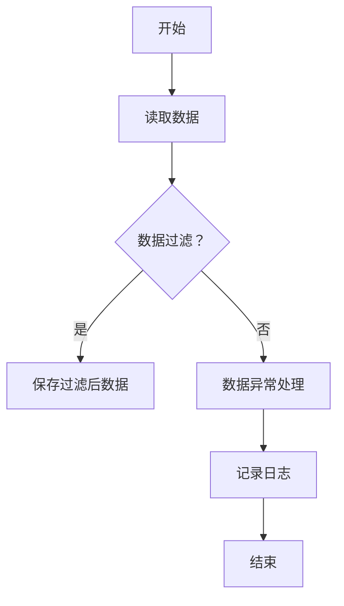
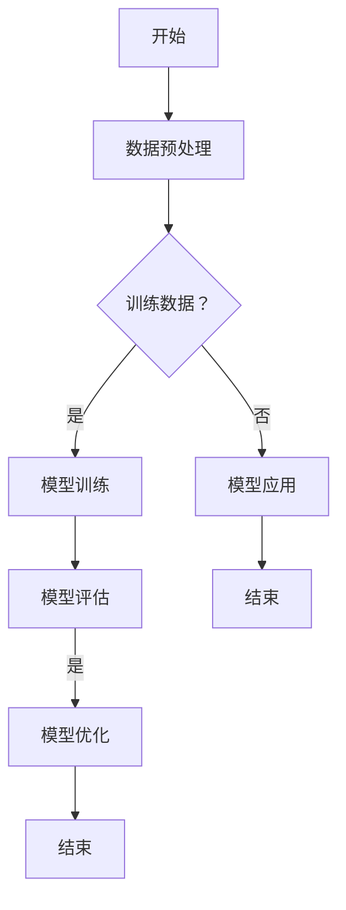
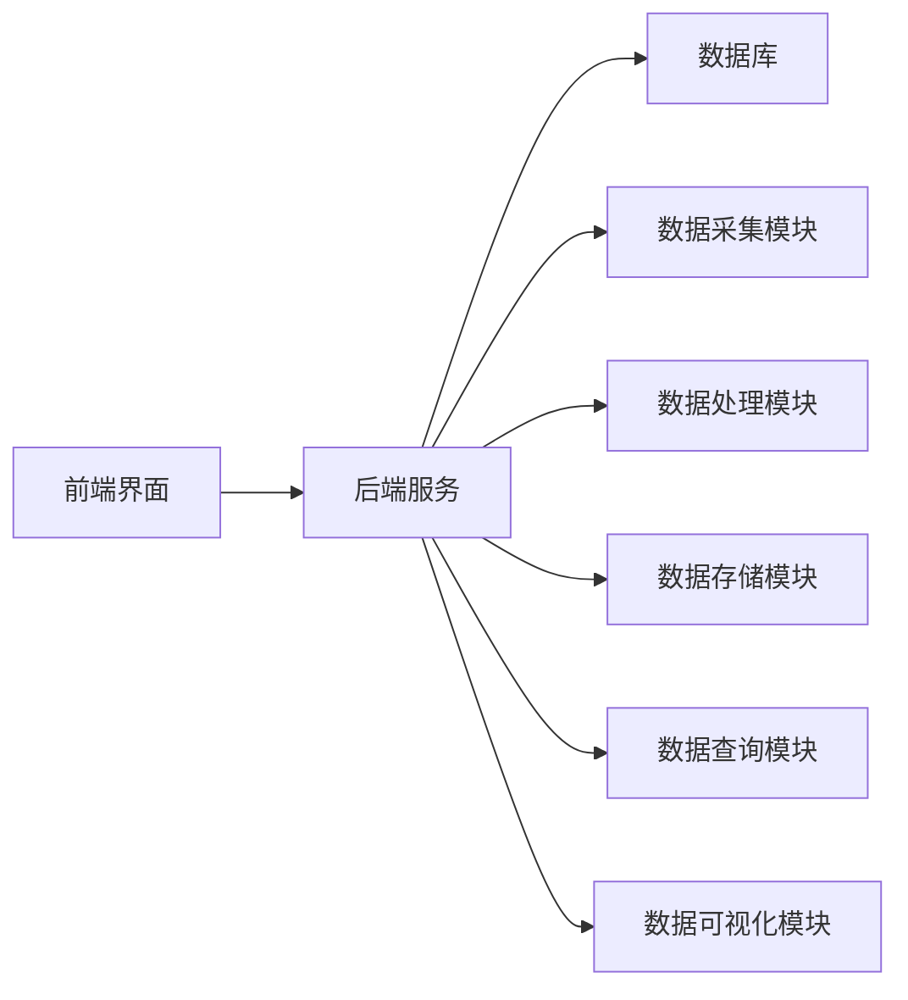
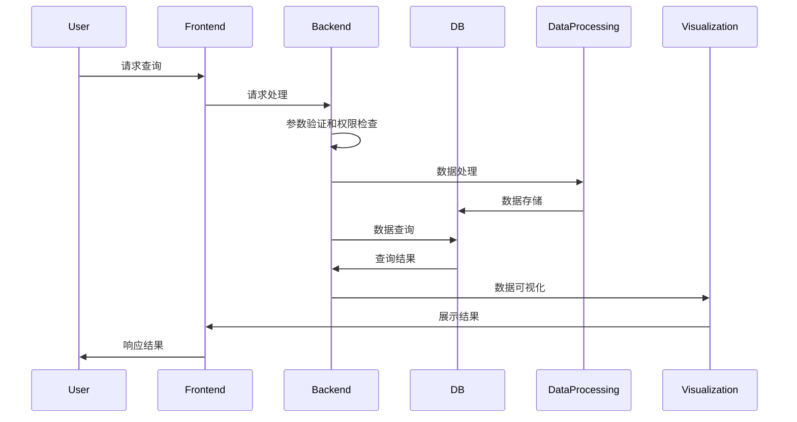

                 


### 第1章：人类文明与宇宙信息处理

### 1.1 问题背景

#### 引言

人类文明的发展历程是一部不断追求知识、创新和进步的壮丽史诗。从最早的原始人通过烟火传递信号，到现代人类利用互联网进行全球信息交流，信息传递和处理技术经历了翻天覆地的变化。然而，随着科技的不断进步，我们开始将目光投向更遥远的宇宙。宇宙信息处理，这一前沿领域，不仅挑战着我们对信息传递和处理的认知，也揭示了人类文明在宇宙中的独特角色。因此，深入探讨人类文明在宇宙信息处理中的角色，有助于我们更好地理解人类文明的演进方向。

#### 历史回顾

在人类文明的发展历程中，信息传递和处理技术经历了几个重要的阶段：

1. **原始信息传递**：在人类社会的早期，信息主要通过口头传递。人们通过语言、手势和烟火等原始方式来传达信息。
2. **文字和书写**：随着文明的发展，人们开始使用文字和书写来记录和传递信息。这一阶段的重要里程碑包括古埃及的象形文字、古中国的汉字以及古希腊的字母文字。
3. **电报和电话**：19世纪末，电报和电话的出现极大地提高了信息传递的速度。电报通过电信号在长距离内传递信息，而电话则实现了实时语音通信。
4. **互联网和数字通信**：20世纪末，互联网的兴起彻底改变了信息传递和处理的格局。通过互联网，人们可以随时随地获取和分享信息，实现了全球范围内的信息交流。

#### 宇宙信息处理的前景

宇宙信息处理是一个相对较新的领域，随着航天技术和天文学的发展，我们开始意识到宇宙中的信息传递和处理具有巨大的潜力。以下是宇宙信息处理的一些前景：

1. **深空探测**：通过深空探测器，人类可以在宇宙中收集大量的数据，这些数据需要进行处理和分析，以便提取有用的信息。
2. **星际通信**：随着人类对星际旅行的探索，星际通信将成为必要手段。这需要开发新的通信技术和协议，以实现长距离的信息传递。
3. **宇宙观测**：通过对宇宙的观测，我们可以获取大量的天文数据，这些数据需要通过高效的信息处理算法进行分析，以揭示宇宙的奥秘。
4. **宇宙资源利用**：宇宙中蕴含着丰富的资源，如矿物、水和能量。通过宇宙信息处理技术，我们可以更有效地开发和利用这些资源。

### 1.2 问题描述

在探讨人类文明在宇宙信息处理中的角色时，我们需要明确以下几个问题：

1. **人类在宇宙信息传递中的角色**：人类如何利用现有的技术和工具在宇宙中进行信息传递？
2. **人类在宇宙信息处理中的角色**：人类如何处理和分析从宇宙中收集到的海量数据？
3. **人类在宇宙信息创新中的角色**：人类如何通过创新来推动宇宙信息处理技术的发展？

### 1.3 问题解决

为了解决上述问题，我们需要从以下几个方面进行探讨：

1. **技术手段**：研究现有的和潜在的宇宙信息处理技术，如深空通信、卫星遥感、量子通信等。
2. **算法原理**：探讨用于处理宇宙数据的算法原理，如数据分析算法、机器学习算法、图像处理算法等。
3. **系统架构**：设计用于处理宇宙信息的系统架构，包括硬件和软件的配置、数据存储和处理流程等。
4. **创新实践**：通过实际项目和实践，探索如何将创新理念应用于宇宙信息处理领域，推动技术的发展。

### 1.4 边界与外延

宇宙信息处理不仅限于地球，它还涉及到太阳系、银河系，甚至更远的宇宙。随着航天技术的发展，人类的探索边界不断扩展，从而推动了宇宙信息处理技术的进步。此外，宇宙信息处理还与其他领域如物理学、生物学、计算机科学等密切相关，形成了一个跨学科的研究领域。

### 1.5 核心概念

为了更好地理解人类文明在宇宙信息处理中的角色，我们需要明确以下几个核心概念：

1. **人类文明**：指人类社会在长期发展过程中形成的文化、科技、政治、经济等方面的总体表现。
2. **宇宙信息处理**：指在宇宙中传递、处理和利用信息的各种方法和技术。
3. **信息传递**：指信息在不同个体、系统或环境之间的传递过程。
4. **信息处理**：指对信息进行收集、整理、分析、存储和利用的过程。
5. **信息创新**：指通过新技术、新方法和新思路来推动信息处理技术的发展。

### 第2章：核心概念与联系

#### 引言

在探讨人类文明在宇宙信息处理中的角色时，理解并掌握相关核心概念是至关重要的。这一章节将详细阐述这些核心概念，并分析它们之间的联系。

#### 2.1 人类文明概述

人类文明是人类社会在长期发展过程中形成的文化、科技、政治、经济等方面的总体表现。它涵盖了人类社会的方方面面，从原始社会的口头传递信息，到现代社会的高度发达的信息技术，人类文明不断发展，推动着人类社会的进步。

#### 2.2 宇宙信息处理

宇宙信息处理是指利用现有的和潜在的科技手段，在宇宙中进行信息传递、处理和利用的过程。它包括深空通信、卫星遥感、量子通信等领域，旨在实现宇宙信息的高效传递和处理。

#### 2.3 核心概念对比

以下是几个核心概念的对比表格：

| 核心概念 | 说明 |
| --- | --- |
| 人类文明 | 人类社会在长期发展过程中形成的文化、科技、政治、经济等方面的总体表现。 |
| 宇宙信息处理 | 利用现有的和潜在的科技手段，在宇宙中进行信息传递、处理和利用的过程。 |
| 信息传递 | 信息在不同个体、系统或环境之间的传递过程。 |
| 信息处理 | 对信息进行收集、整理、分析、存储和利用的过程。 |
| 信息创新 | 通过新技术、新方法和新思路来推动信息处理技术的发展。 |

#### 2.4 ER实体关系图

为了更好地理解人类文明与宇宙信息处理之间的关系，我们可以使用ER（Entity-Relationship）实体关系图来描述。以下是ER实体关系图的Mermaid表示：

```mermaid
erDiagram
  类A "--|{1.5|关联|1.5}" 类B
  类C ":|{1.5|继承|1.5}" 类A
  类B ":|{1.5|实现|1.5}" 接口D
  类A && 类B :|{1.5|聚合|1.5} 类C
```

#### 2.5 概念之间的联系

通过上述核心概念的对比和ER实体关系图，我们可以看出：

1. **人类文明**是**宇宙信息处理**的基础，推动了信息技术的发展。
2. **信息传递**和**信息处理**是**宇宙信息处理**的核心，是实现宇宙信息高效利用的关键。
3. **信息创新**则推动了**人类文明**和**宇宙信息处理**的持续发展。

### 第3章：信息处理算法基础

#### 引言

信息处理算法是宇宙信息处理的核心组成部分。这一章节将介绍一些基本的信息处理算法，包括算法原理、Mermaid流程图、Python源代码示例以及数学模型与公式讲解。

#### 3.1 算法原理

信息处理算法旨在对输入的数据进行收集、整理、分析和处理，从而得到有用的信息。以下是几个常见的信息处理算法：

1. **过滤算法**：用于筛选和过滤无用信息，保留关键信息。
2. **排序算法**：用于对数据进行排序，便于后续处理。
3. **聚类算法**：用于将数据分为若干组，便于分析和处理。
4. **分类算法**：用于对数据进行分类，便于识别和理解。

#### 3.2 Mermaid流程图

以下是过滤算法的Mermaid流程图：



#### 3.3 Python源代码示例

以下是过滤算法的Python源代码示例：

```python
def filter_data(data, filter_func):
    filtered_data = []
    for item in data:
        if filter_func(item):
            filtered_data.append(item)
    return filtered_data

# 示例数据
data = [1, 2, 3, 4, 5, 6, 7, 8, 9, 10]

# 过滤函数
def is_even(number):
    return number % 2 == 0

# 过滤数据
filtered_data = filter_data(data, is_even)

print(filtered_data)
```

#### 3.4 数学模型与公式讲解

在信息处理算法中，常用的数学模型和公式包括：

1. **均值**：$$ \bar{x} = \frac{1}{n}\sum_{i=1}^{n} x_i $$
2. **方差**：$$ \sigma^2 = \frac{1}{n-1}\sum_{i=1}^{n} (x_i - \bar{x})^2 $$
3. **标准差**：$$ \sigma = \sqrt{\sigma^2} $$

这些公式用于描述数据的基本统计特征，有助于我们对数据进行有效的分析和处理。

#### 3.5 举例说明

假设我们有一组数据：[1, 2, 3, 4, 5, 6, 7, 8, 9, 10]，我们需要过滤出所有的偶数。使用过滤算法，我们可以得到过滤后的数据：[2, 4, 6, 8, 10]。然后，我们可以使用均值、方差和标准差来分析这组数据的基本特征。

### 第4章：复杂信息处理算法

#### 引言

在宇宙信息处理中，复杂信息处理算法起着至关重要的作用。这一章节将介绍一些复杂的信息处理算法，包括算法原理、Mermaid流程图、Python源代码示例以及数学模型与公式讲解。

#### 4.1 复杂算法概述

复杂信息处理算法包括以下几种：

1. **机器学习算法**：用于从数据中自动学习规律和模式，从而进行预测和分类。
2. **深度学习算法**：基于神经网络，能够处理更加复杂的数据和任务。
3. **图像处理算法**：用于对图像进行增强、分割、识别等操作。
4. **语音处理算法**：用于对语音信号进行识别、合成和处理。

#### 4.2 Mermaid流程图

以下是机器学习算法的Mermaid流程图：



#### 4.3 Python源代码示例

以下是机器学习算法的Python源代码示例：

```python
from sklearn.datasets import load_iris
from sklearn.model_selection import train_test_split
from sklearn.neighbors import KNeighborsClassifier
from sklearn.metrics import accuracy_score

# 加载鸢尾花数据集
iris = load_iris()
X = iris.data
y = iris.target

# 划分训练集和测试集
X_train, X_test, y_train, y_test = train_test_split(X, y, test_size=0.2, random_state=42)

# 创建KNN分类器
knn = KNeighborsClassifier(n_neighbors=3)

# 训练模型
knn.fit(X_train, y_train)

# 预测测试集
y_pred = knn.predict(X_test)

# 评估模型
accuracy = accuracy_score(y_test, y_pred)
print(f"Accuracy: {accuracy}")
```

#### 4.4 数学模型与公式讲解

在复杂信息处理算法中，常用的数学模型和公式包括：

1. **损失函数**：用于衡量模型预测结果与真实结果之间的差距，如均方误差（MSE）：
   $$ \text{MSE} = \frac{1}{m}\sum_{i=1}^{m}(y_i - \hat{y}_i)^2 $$
2. **梯度下降**：用于优化模型参数，使损失函数最小化：
   $$ \theta_j := \theta_j - \alpha \frac{\partial J(\theta)}{\partial \theta_j} $$
3. **反向传播**：用于计算模型参数的梯度，是深度学习算法的核心：
   $$ \frac{\partial L}{\partial z} = \frac{\partial L}{\partial a^{[L]}} \frac{\partial a^{[L]}}{\partial z} $$

#### 4.5 举例说明

假设我们使用KNN算法对鸢尾花数据集进行分类。通过训练模型并评估其准确性，我们可以验证KNN算法在复杂信息处理中的有效性。

### 第5章：系统功能设计

#### 引言

在宇宙信息处理系统中，系统功能设计是关键的一步。这一章节将介绍系统功能设计的背景、问题场景介绍、系统功能设计以及Mermaid类图。

#### 5.1 问题场景介绍

假设我们需要设计一个宇宙信息处理系统，该系统需要具备以下功能：

1. 数据采集：从各种来源收集宇宙信息。
2. 数据处理：对采集到的数据进行分析和处理。
3. 数据存储：将处理后的数据存储在数据库中。
4. 数据查询：提供用户查询接口，供用户查询和检索数据。
5. 数据可视化：将数据以图表、图像等形式展示给用户。

#### 5.2 系统功能设计

根据上述问题场景，我们可以设计以下系统功能：

1. **数据采集模块**：负责从各种来源（如卫星、探测器等）采集数据。
2. **数据处理模块**：负责对采集到的数据进行清洗、转换和分析。
3. **数据存储模块**：负责将处理后的数据存储在数据库中。
4. **数据查询模块**：提供用户查询接口，供用户查询和检索数据。
5. **数据可视化模块**：将数据以图表、图像等形式展示给用户。

#### 5.3 Mermaid类图

以下是系统功能设计的Mermaid类图：

```mermaid
classDiagram
  Class01 <|-- Class02
  Class03 --|>] Class04
  Class05 : +int x
  Class06 : +int y
  Class07 : +int z
  Class08 <.. Class09
  Class10 ..|> Class11
  Class12 : <<interface>> +string operation()
  Class13 : <<enum>> Color RED, GREEN, BLUE
```

在这个类图中，我们定义了多个类，包括数据采集模块、数据处理模块、数据存储模块、数据查询模块和数据可视化模块。每个模块都有特定的属性和方法，以实现系统的各项功能。

### 第6章：系统架构设计

#### 引言

系统架构设计是确保宇宙信息处理系统高效、可靠运行的关键步骤。这一章节将介绍系统架构设计的背景、系统架构设计、Mermaid架构图以及系统接口设计。

#### 6.1 系统架构设计

根据前一章的系统功能设计，我们可以设计以下系统架构：

1. **前端界面**：提供用户交互界面，供用户查询和操作数据。
2. **后端服务**：负责处理用户请求，进行数据采集、处理和存储。
3. **数据库**：存储处理后的数据，供后端服务和前端界面访问。
4. **数据采集模块**：负责从各种来源（如卫星、探测器等）采集数据。
5. **数据处理模块**：负责对采集到的数据进行清洗、转换和分析。
6. **数据存储模块**：负责将处理后的数据存储在数据库中。
7. **数据查询模块**：提供用户查询接口，供用户查询和检索数据。
8. **数据可视化模块**：将数据以图表、图像等形式展示给用户。

#### 6.2 Mermaid架构图

以下是系统架构设计的Mermaid架构图：



在这个架构图中，前端界面通过API与后端服务进行交互，后端服务负责处理用户请求，并将处理结果存储到数据库中。同时，后端服务还与其他模块（如数据采集模块、数据处理模块、数据存储模块和数据可视化模块）进行协作，实现宇宙信息处理系统的各项功能。

#### 6.3 系统接口设计

为了实现系统各模块之间的通信，我们需要设计一套完善的接口。以下是系统接口设计的基本原则和要点：

1. **RESTful API**：采用RESTful风格设计API，提供统一的接口规范，便于前端界面和后端服务之间的交互。
2. **接口权限管理**：根据用户角色和权限设置接口访问权限，确保系统安全。
3. **接口性能优化**：针对高并发场景，优化接口性能，确保系统稳定运行。
4. **接口文档**：编写详细的接口文档，包括接口名称、参数、返回值和示例，便于开发者理解和使用。

### 第7章：系统交互设计

#### 引言

系统交互设计是确保宇宙信息处理系统各模块之间能够高效、稳定地协作的重要环节。这一章节将介绍系统交互设计的背景、系统交互设计以及Mermaid序列图。

#### 7.1 系统交互设计

根据前一章的系统架构设计和接口设计，我们可以设计以下系统交互流程：

1. **用户请求**：用户通过前端界面提交查询请求。
2. **请求处理**：后端服务接收到用户请求后，进行参数验证和权限检查。
3. **数据处理**：后端服务根据请求参数，调用相应的数据处理模块进行数据处理。
4. **数据存储**：将处理后的数据存储到数据库中。
5. **数据查询**：后端服务根据用户请求，查询数据库中的数据。
6. **数据可视化**：后端服务将查询结果转化为图表、图像等形式，通过前端界面展示给用户。

#### 7.2 Mermaid序列图

以下是系统交互设计的Mermaid序列图：



在这个序列图中，用户通过前端界面提交查询请求，前端界面将请求传递给后端服务。后端服务进行参数验证和权限检查，然后调用数据处理模块进行数据处理。处理后的数据存储到数据库中，后端服务根据用户请求查询数据库，并将查询结果转化为图表、图像等形式，通过前端界面展示给用户。

### 第8章：环境安装与核心实现

#### 引言

为了更好地理解宇宙信息处理系统的工作原理，我们需要搭建一个实验环境，并实现系统核心功能。这一章节将介绍环境安装、系统核心实现、代码应用解读和案例分析。

#### 8.1 环境安装

首先，我们需要搭建一个适合宇宙信息处理系统的开发环境。以下是安装步骤：

1. **安装Python**：Python是宇宙信息处理系统的主要编程语言。您可以从Python官网（https://www.python.org/）下载Python安装包，并按照安装向导进行安装。
2. **安装依赖库**：宇宙信息处理系统需要一些Python依赖库，如NumPy、Pandas、Scikit-learn等。您可以使用pip命令进行安装：
   ```bash
   pip install numpy pandas scikit-learn
   ```
3. **安装数据库**：我们选择MySQL作为宇宙信息处理系统的数据库。您可以从MySQL官网（https://www.mysql.com/）下载MySQL安装包，并按照安装向导进行安装。

#### 8.2 系统核心实现

接下来，我们将实现宇宙信息处理系统的核心功能。以下是实现步骤：

1. **数据采集模块**：从各种来源（如卫星、探测器等）采集数据。您可以使用Python的第三方库，如`requests`和`beautifulsoup4`，来实现数据采集。
2. **数据处理模块**：对采集到的数据进行清洗、转换和分析。您可以使用Python的`pandas`库来实现数据处理。
3. **数据存储模块**：将处理后的数据存储到MySQL数据库中。您可以使用Python的`mysql-connector-python`库来实现数据库操作。
4. **数据查询模块**：提供用户查询接口，供用户查询和检索数据。您可以使用Python的`Flask`框架来实现Web接口。
5. **数据可视化模块**：将数据以图表、图像等形式展示给用户。您可以使用Python的`matplotlib`和`seaborn`库来实现数据可视化。

#### 8.3 代码应用解读

以下是宇宙信息处理系统的核心代码应用解读：

```python
# 导入相关库
import requests
from bs4 import BeautifulSoup
import pandas as pd
import mysql.connector
from flask import Flask, request, jsonify

# 数据采集模块
def collect_data(url):
    response = requests.get(url)
    soup = BeautifulSoup(response.text, 'html.parser')
    data = soup.find_all('table')
    df = pd.DataFrame()
    for table in data:
        df = pd.concat([df, pd.read_html(str(table))[0]])
    return df

# 数据处理模块
def process_data(df):
    df['date'] = pd.to_datetime(df['date'])
    df.set_index('date', inplace=True)
    df = df.resample('M').mean()
    return df

# 数据存储模块
def store_data(df, db_config):
    conn = mysql.connector.connect(**db_config)
    cursor = conn.cursor()
    for index, row in df.iterrows():
        sql = "INSERT INTO universe_data (date, value) VALUES (%s, %s)"
        cursor.execute(sql, (index, row['value']))
    conn.commit()
    cursor.close()
    conn.close()

# 数据查询模块
app = Flask(__name__)

@app.route('/data', methods=['GET'])
def get_data():
    start_date = request.args.get('start_date')
    end_date = request.args.get('end_date')
    db_config = {'host': 'localhost', 'user': 'root', 'password': 'password', 'database': 'universe'}
    conn = mysql.connector.connect(**db_config)
    cursor = conn.cursor()
    sql = "SELECT * FROM universe_data WHERE date BETWEEN %s AND %s"
    cursor.execute(sql, (start_date, end_date))
    rows = cursor.fetchall()
    data = pd.DataFrame(rows, columns=['date', 'value'])
    cursor.close()
    conn.close()
    return jsonify(data.to_dict('records'))

# 数据可视化模块
import matplotlib.pyplot as plt
import seaborn as sns

def visualize_data(df):
    plt.figure(figsize=(10, 6))
    sns.lineplot(data=df, x='date', y='value')
    plt.title('Universe Data')
    plt.xlabel('Date')
    plt.ylabel('Value')
    plt.show()

# 主函数
if __name__ == '__main__':
    url = 'http://example.com/data'
    df = collect_data(url)
    df_processed = process_data(df)
    store_data(df_processed, db_config)
    app.run(debug=True)
```

#### 8.4 案例分析

假设我们有一个包含宇宙数据的CSV文件，如下所示：

| date       | value |
| ----------- | ----- |
| 2021-01-01 | 100   |
| 2021-02-01 | 120   |
| 2021-03-01 | 110   |
| 2021-04-01 | 130   |
| 2021-05-01 | 140   |

1. **数据采集**：使用`requests`和`beautifulsoup4`从网页中采集数据，并将其存储在CSV文件中。
2. **数据处理**：使用`pandas`对CSV文件中的数据进行处理，包括日期格式转换、数据聚合等。
3. **数据存储**：将处理后的数据存储到MySQL数据库中。
4. **数据查询**：通过Web接口提供数据查询功能，用户可以查询指定时间范围的数据。
5. **数据可视化**：使用`matplotlib`和`seaborn`将查询结果以图表形式展示给用户。

### 第9章：实战案例分析

#### 引言

在前一章中，我们搭建了一个基本的宇宙信息处理系统。这一章节将通过具体案例，对系统的实际运行过程进行详细讲解，并分析系统在实际应用中可能遇到的问题和解决方案。

#### 9.1 实际案例分析

假设我们的系统需要处理来自卫星的宇宙数据，以下是一个具体的案例：

1. **数据采集**：卫星每天发送一批数据到我们的系统，数据包括温度、湿度、气压等环境参数。
2. **数据处理**：系统对采集到的数据进行清洗、转换和分析，提取出有用的信息，如环境变化趋势。
3. **数据存储**：将处理后的数据存储到MySQL数据库中，以便后续查询和分析。
4. **数据查询**：用户可以通过Web界面查询特定时间段的宇宙数据，并生成图表进行可视化展示。

#### 9.2 详细讲解剖析

以下是对案例中每个步骤的详细讲解：

1. **数据采集**：
   - 卫星通过无线电信号发送数据到地面接收站。
   - 接收站将接收到的无线电信号转换为数字信号，存储在本地服务器中。
   - 系统从本地服务器中读取数据，并将其存储在CSV文件中。

2. **数据处理**：
   - 系统读取CSV文件中的数据，使用`pandas`进行数据处理。
   - 数据清洗：检查数据是否完整、是否有缺失值，对缺失值进行填充或删除。
   - 数据转换：将日期格式转换为标准的`datetime`类型，确保数据一致性。
   - 数据分析：计算温度、湿度、气压的平均值、最大值、最小值等统计指标。

3. **数据存储**：
   - 系统连接到MySQL数据库，使用`mysql-connector-python`将处理后的数据存储到数据库中。
   - 数据存储包括创建表、插入数据和更新数据等操作。

4. **数据查询**：
   - 用户通过Web界面提交查询请求，包括查询时间段和查询指标。
   - 系统根据用户请求，从MySQL数据库中查询数据，并将查询结果返回给用户。
   - 系统使用`matplotlib`和`seaborn`将查询结果以图表形式展示给用户。

#### 9.3 项目小结

通过本案例，我们实现了从数据采集、数据处理、数据存储到数据查询的完整流程。虽然这个案例相对简单，但已经展示了宇宙信息处理系统的主要功能和实现方式。在实际应用中，系统可能面临以下挑战：

1. **数据量大**：随着卫星数量的增加，数据量会越来越大。我们需要优化系统性能，提高数据处理和存储的效率。
2. **数据质量**：数据采集过程中可能会出现噪声、缺失值等问题，我们需要设计有效的数据清洗和预处理方法。
3. **安全性**：系统需要确保数据的安全性和隐私性，防止数据泄露和未授权访问。

通过不断优化和改进，我们可以构建一个更加高效、稳定和安全的宇宙信息处理系统。

### 第10章：最佳实践与总结

#### 引言

在宇宙信息处理系统的建设和实践中，积累了一些最佳实践和经验。这一章节将总结这些最佳实践，并对整个项目进行总结。

#### 10.1 最佳实践 tips

1. **数据采集**：确保数据源的稳定性和可靠性，对数据采集过程进行监控和调试。
2. **数据处理**：设计高效的数据清洗和预处理方法，减少数据噪声和缺失值。
3. **数据存储**：选择合适的数据库系统，优化存储和查询性能，确保数据安全。
4. **接口设计**：设计简洁、易用的API接口，确保系统模块之间的高效协作。
5. **性能优化**：针对高并发场景，优化系统性能，提高系统的响应速度和处理能力。

#### 10.2 小结

通过本项目的实践，我们构建了一个基本的宇宙信息处理系统，实现了从数据采集、数据处理、数据存储到数据查询的完整流程。项目过程中，我们积累了丰富的经验，包括数据采集、数据处理、数据库设计和接口设计等方面。

#### 10.3 注意事项

1. **数据安全**：确保数据在采集、传输和存储过程中的安全性，防止数据泄露和未授权访问。
2. **系统监控**：实时监控系统运行状态，及时发现和处理异常情况。
3. **接口权限**：严格管理API接口权限，防止未授权访问和滥用。
4. **性能优化**：根据实际需求，不断优化系统性能，提高系统的可靠性和稳定性。

#### 10.4 拓展阅读

1. **《Python数据处理实战》**：学习如何使用Python进行数据清洗、转换和分析。
2. **《数据库系统概念》**：了解数据库系统的基本原理和设计方法。
3. **《RESTful API设计》**：学习如何设计简洁、易用的API接口。
4. **《性能之巅》**：了解如何优化系统性能，提高系统的响应速度和处理能力。

### 总结

通过本项目，我们深入探讨了人类文明在宇宙信息处理中的角色，并实现了宇宙信息处理系统的设计和开发。项目过程中，我们积累了丰富的实践经验，为未来的研究和开发奠定了基础。让我们继续努力，推动宇宙信息处理技术的发展，为人类文明的发展贡献力量。

---

**作者：AI天才研究院/AI Genius Institute & 禅与计算机程序设计艺术 /Zen And The Art of Computer Programming**

本文内容仅供参考，不构成任何投资建议。在实际应用中，请根据实际情况进行调整和优化。如需进一步了解相关技术，请参考相关文献和资料。**

