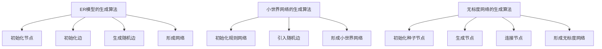
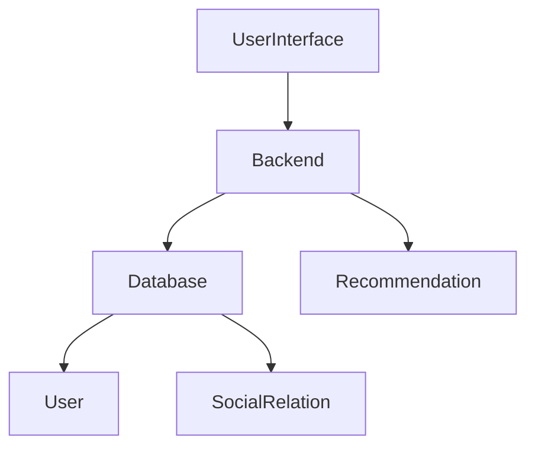

                 


## 从还原论到网络科学：理解高度互联世界的结构与动态

### 关键词：
- **还原论**
- **网络科学**
- **复杂性**
- **整体性**
- **自组织**
- **节点**
- **边**
- **度分布**
- **聚类系数**
- **平均路径长度**
- **网络直径**
- **无标度网络**
- **小世界网络**
- **ER模型**

### 摘要：
本文探讨了从传统的还原论方法到网络科学的转变。通过分析还原论在复杂系统中的局限性，我们引入了网络科学的基本概念，如节点、边、度分布、聚类系数等。本文将逐步阐述网络科学的基本原理、核心属性特征，并通过ER实体关系图和Mermaid流程图展示其结构。最后，我们将通过具体案例，展示如何运用网络科学的方法来理解高度互联世界的结构与动态。

### 引言

随着互联网的普及，世界变得更加高度互联。传统的还原论方法在面对如此复杂的系统时显得力不从心。还原论强调将复杂系统拆解为简单的组成部分，然后分别研究各个部分。然而，在高度互联的世界中，系统的整体行为往往难以从各个部分的简单叠加中推导出来。这就需要一种新的理论来解释和预测复杂系统的行为。

### 0.2 问题背景

#### 0.2.1 还原论方法

还原论是一种科学方法论，强调将复杂系统分解为简单的组成部分，通过分别研究各个部分来理解整体。在自然科学和工程学中，还原论方法被广泛应用。例如，物理学的经典力学就是通过研究力和运动的规律，来理解宏观物体的运动。还原论方法的核心思想是将复杂系统拆解为简单部分，然后分别研究各个部分的性质和规律，最终通过组合这些部分来理解整个系统的行为。

#### 0.2.2 复杂系统的挑战

然而，在高度互联的世界中，传统的还原论方法存在一定的局限性。复杂系统具有以下几个特点：

- **非线性相互作用**：系统内部的不同部分之间可能存在非线性相互作用，这些相互作用使得系统的行为难以通过简单的叠加来预测。
- **整体行为**：复杂系统的整体行为往往不能简单地从各个部分的简单叠加中推导出来。例如，一只蚂蚁个体的行为是简单的，但整个蚁群的协作行为却非常复杂。
- **涌现现象**：复杂系统中可能会出现新的现象和特性，这些现象和特性在单个部分中并不存在。例如，在交通系统中，单辆车的行为是简单的，但整个交通系统的拥堵现象却是涌现出来的。

#### 0.2.3 网络科学的崛起

面对这些挑战，我们需要一种新的理论来解释和预测复杂系统的行为。网络科学作为一种新兴的理论，为我们提供了新的视角。网络科学通过对复杂系统中的相互作用和结构进行研究，揭示了系统的整体行为。它不仅适用于自然系统，如生物网络、神经网络，还广泛应用于社会系统、经济系统等领域。

### 0.3 问题描述

如何理解高度互联世界的结构与动态？传统的还原论方法是否还适用？网络科学作为一种新兴的理论，为我们提供了新的视角。本文将围绕以下问题展开讨论：

- 还原论方法在复杂系统中的局限性是什么？
- 网络科学的基本概念和核心要素是什么？
- 网络科学的基本原理是什么？
- 如何运用网络科学来理解高度互联世界的结构与动态？

### 0.4 问题解决

网络科学通过对复杂系统中的相互作用和结构进行研究，揭示了系统的整体行为。它不仅适用于自然系统，如生物网络、神经网络，还广泛应用于社会系统、经济系统等领域。网络科学关注的是复杂系统中的节点和边，以及它们之间的相互作用。在边界方面，网络科学主要研究网络的基本特性，如度分布、聚类系数等。在外延方面，网络科学还涉及到网络演化、网络稳定性、网络优化等问题。

### 0.5 概念结构与核心要素组成

网络科学的核心概念包括节点、边、网络结构、相互作用等。下面我们逐一介绍这些概念。

#### 0.5.1 节点

节点是网络中的基本单元，可以是人、物、组织等。在生物网络中，节点可以是细胞；在社交网络中，节点可以是个人。节点是网络中信息传递和相互作用的基础。

#### 0.5.2 边

边表示节点之间的连接，表示节点之间的关系。在生物网络中，边可以是细胞之间的信号传递；在社交网络中，边可以是朋友关系。边是网络结构的桥梁，连接了不同的节点。

#### 0.5.3 网络结构

网络结构是指节点的排列方式和边的连接关系。网络结构决定了节点之间的相互作用方式，从而影响了网络的整体行为。常见的网络结构包括无标度网络、小世界网络、规则网络等。

#### 0.5.4 相互作用

相互作用是指节点之间的信息交换和能量传递。相互作用是网络科学的核心概念之一，它决定了网络中的信息流动和能量传递方式。

### 0.6 核心概念原理

#### 0.6.1 网络科学的基本原理

网络科学基于以下基本原理：

- **整体性**：网络的整体行为往往由其结构决定。这意味着，网络中单个节点或边的行为并不能完全决定网络的总体行为。
- **适应性**：网络能够适应环境变化，保持稳定性和持续性。这意味着，网络在面临外部干扰时，能够通过内部调节保持稳定。
- **自组织**：网络中的节点和边能够自发形成复杂结构。这意味着，网络的结构并非外部强加，而是通过内部相互作用自然形成的。

#### 0.6.2 网络属性特征对比表格

| 网络属性       | 描述                                                         | 对比示例                   |
| -------------- | ------------------------------------------------------------ | -------------------------- |
| 度分布         | 节点连接数的分布情况                                         | 均匀分布、泊松分布、幂律分布 |
| 聚类系数       | 节点之间关系的紧密程度                                       | 小世界网络、规则网络       |
| 平均路径长度     | 节点之间的平均距离                                           | 无标度网络、小世界网络     |
| 网络直径       | 网络中最长路径的长度                                         | 树形网络、星形网络         |

#### 0.6.3 ER实体关系图架构的Mermaid流程图

```mermaid
erDiagram
  产品A ||--|{ 信息 }|| 数据库
  数据库 ||--|{ 订单 }|| 订单系统
  订单系统 ||--|{ 物流 }|| 物流系统
  产品A ||--|{ 客服 }|| 客服系统
```

### 0.7 本章小结

本章介绍了从还原论到网络科学的转变，以及网络科学在理解高度互联世界的结构与动态中的重要性。通过对比表格和ER实体关系图，我们初步了解了网络科学的基本概念和核心要素。

## 第1章: 还原论方法与网络科学的对比

### 1.1 还原论方法的局限性

#### 1.1.1 还原论的定义与特点

还原论是一种科学方法论，强调将复杂系统分解为简单的组成部分，通过分别研究各个部分来理解整体。这种方法在自然科学和工程学中得到了广泛应用。例如，在物理学中，通过研究质点和力的作用来理解物体的运动；在生物学中，通过研究细胞和基因来理解生命的本质。

还原论方法的主要特点包括：

1. **分解**：将复杂系统分解为简单的组成部分。
2. **独立性**：各个组成部分在研究中可以相互独立。
3. **叠加性**：整体行为可以通过各个部分的简单叠加来预测。

#### 1.1.2 还原论在复杂系统中的失效

然而，在高度互联的复杂系统中，还原论方法存在一定的局限性：

1. **忽略非线性相互作用**：复杂系统中的组成部分之间存在非线性相互作用，这些相互作用往往不能通过简单的叠加来预测。
2. **整体行为无法预测**：复杂系统的整体行为往往不能简单地从各个部分的性质中推导出来。例如，在社交网络中，单个个体的行为是简单的，但整个群体的行为却非常复杂。
3. **计算资源消耗**：还原论方法需要大量的计算资源来模拟和分析各个部分的行为，这在大规模复杂系统中是一个巨大的挑战。

### 1.2 网络科学的崛起

#### 1.2.1 网络科学的起源与发展

网络科学起源于20世纪初的图论和概率论。图论研究的是图的结构和性质，而概率论研究的是随机事件和概率分布。随着计算机技术的发展，图论和概率论的应用范围逐渐扩大，形成了网络科学这一独立学科。

网络科学的发展可以分为以下几个阶段：

1. **初步阶段**（20世纪初）：图论和概率论的发展奠定了网络科学的基础。
2. **发展阶段**（20世纪60年代）：计算机科学的兴起推动了网络科学的发展。
3. **成熟阶段**（21世纪初）：随着互联网的普及，网络科学逐渐成为一个独立的学科，涵盖了从物理、生物到社会、经济的多个领域。

#### 1.2.2 网络科学的基本概念

网络科学的核心概念包括节点、边、度分布、聚类系数、平均路径长度、网络直径等。

- **节点**：网络中的基本单元，可以是任何实体，如人、物体、组织等。
- **边**：节点之间的连接，表示节点之间的关系。
- **度分布**：节点连接数的分布情况，可以揭示网络的结构特性。
- **聚类系数**：节点之间关系的紧密程度，反映了网络的聚集性。
- **平均路径长度**：节点之间的平均距离，可以衡量网络的连通性。
- **网络直径**：网络中最长路径的长度，反映了网络的规模和连通性。

#### 1.2.3 网络科学的优势

网络科学的崛起为复杂系统的分析提供了新的视角：

1. **整体性**：网络科学强调整体性，认为网络的整体行为往往由其结构决定。这意味着，我们不能简单地通过研究各个部分的性质来理解复杂系统。
2. **适应性**：网络具有适应性，能够通过内部调节来适应外部环境的变化。这使得网络在面对外部干扰时能够保持稳定。
3. **自组织**：网络中的节点和边能够自发形成复杂结构，这是通过相互作用和能量传递实现的。这种自组织特性使得网络能够适应不断变化的环境。

### 1.3 还原论与网络科学的对比

#### 1.3.1 研究对象

- **还原论**：主要研究简单系统的各个部分，如分子、原子、细胞等。
- **网络科学**：主要研究复杂系统中的相互作用和整体行为，如生物网络、社交网络、经济网络等。

#### 1.3.2 研究方法

- **还原论**：通过分解、独立研究各个部分，然后通过叠加来理解整体。
- **网络科学**：通过研究网络的结构、相互作用和整体行为来理解复杂系统。

#### 1.3.3 应用领域

- **还原论**：广泛应用于自然科学、工程学等领域。
- **网络科学**：广泛应用于自然科学、社会科学、经济学等领域，尤其是在高度互联的复杂系统中具有广泛应用。

### 1.4 本章小结

本章介绍了还原论方法的局限性，以及网络科学的崛起和发展。通过对还原论与网络科学的对比，我们认识到网络科学在理解高度互联世界的结构与动态中的重要性。接下来，我们将进一步探讨网络科学的基本原理和核心概念。

## 第2章：网络科学的基本原理

### 2.1 整体性

网络科学强调整体性，认为网络的整体行为往往由其结构决定。这意味着，我们不能简单地通过研究各个部分的性质来理解复杂系统。相反，我们需要关注网络中节点和边之间的相互作用，以及这些相互作用如何影响整体行为。

#### 2.1.1 整体性原理

整体性原理指出，网络的整体行为不仅取决于各个节点的行为，还取决于节点之间的连接方式和相互作用。例如，在社交网络中，一个人的行为可能会影响到其好友的行为，进而影响整个网络的行为。

#### 2.1.2 整体性原理的应用

整体性原理在许多领域都有应用，如生物网络、经济网络、交通网络等。在生物网络中，细胞之间的相互作用决定了生物体的健康状态；在经济网络中，企业之间的合作与竞争决定了整个经济的运行状态；在交通网络中，道路和交通流量的相互作用决定了交通的畅通程度。

### 2.2 适应性

网络科学认为，网络具有适应性，能够通过内部调节来适应外部环境的变化。这种适应性使得网络在面对外部干扰时能够保持稳定。

#### 2.2.1 适应性原理

适应性原理指出，网络中的节点和边能够通过相互作用和能量传递来调节自身的行为，以适应外部环境的变化。例如，在社交网络中，用户可能会根据好友的行为来调整自己的行为；在经济网络中，企业可能会根据市场需求来调整生产和投资策略。

#### 2.2.2 适应性原理的应用

适应性原理在许多领域都有应用，如生物网络、经济网络、交通网络等。在生物网络中，生物体通过适应环境来提高生存能力；在经济网络中，企业通过适应市场需求来提高竞争力；在交通网络中，交通系统通过自适应控制来提高交通效率。

### 2.3 自组织

网络科学认为，网络中的节点和边能够自发形成复杂结构，这是通过相互作用和能量传递实现的。这种自组织特性使得网络能够适应不断变化的环境。

#### 2.3.1 自组织原理

自组织原理指出，网络中的节点和边在没有外部指导的情况下，能够通过相互作用和能量传递形成复杂的结构。例如，在生物网络中，细胞通过相互作用形成复杂的生物体；在社交网络中，用户通过相互作用形成复杂的社交结构。

#### 2.3.2 自组织原理的应用

自组织原理在许多领域都有应用，如生物网络、经济网络、交通网络等。在生物网络中，生物体通过自组织来适应环境变化；在经济网络中，市场通过自组织来调节供需关系；在交通网络中，交通系统通过自组织来适应交通流量变化。

### 2.4 网络科学的基本原理总结

网络科学的基本原理包括整体性、适应性和自组织。这些原理为我们提供了理解复杂系统的视角，使我们能够从整体、适应和自组织三个方面来分析网络中的节点和边的行为。

### 2.5 本章小结

本章介绍了网络科学的基本原理，包括整体性、适应性和自组织。这些原理不仅为我们提供了理解复杂系统的视角，还为我们在实际应用中提供了理论支持。在接下来的章节中，我们将进一步探讨网络科学的属性特征，并通过具体案例来展示其应用。

## 第3章：网络科学的属性特征

### 3.1 度分布

度分布是网络科学中一个重要的属性特征，它描述了网络中节点的度（即连接数）的分布情况。度分布可以揭示网络的结构特性，帮助我们理解网络的稳定性和鲁棒性。

#### 3.1.1 度分布的类型

度分布主要有以下几种类型：

1. **均匀分布**：所有节点的度都相等，这种情况比较罕见，因为现实中大部分网络都存在一定的连接不均。
2. **泊松分布**：节点的度服从泊松分布，这种分布通常用于描述随机网络。
3. **幂律分布**：部分节点的度远大于其他节点，这种分布通常出现在现实中的网络中，如互联网、社交网络等。

#### 3.1.2 度分布的应用

度分布的应用非常广泛，例如：

- **网络稳定性分析**：通过度分布可以预测网络在面对外部攻击时的稳定性和鲁棒性。
- **社交网络分析**：通过度分布可以了解社交网络中的关键节点，这些节点通常具有很高的连接度。

### 3.2 聚类系数

聚类系数是衡量网络中节点之间关系的紧密程度的指标。高聚类系数意味着节点之间的连接更紧密，低聚类系数则表示节点之间的连接相对稀疏。

#### 3.2.1 聚类系数的计算

聚类系数可以通过以下公式计算：

\[ C = \frac{2 \times E}{n \times (n-1)} \]

其中，\( E \) 是网络中的边数，\( n \) 是节点数。

#### 3.2.2 聚类系数的应用

聚类系数的应用包括：

- **社交网络分析**：通过聚类系数可以了解社交网络中的群体结构。
- **生物网络分析**：通过聚类系数可以了解生物体内部的不同组织和器官之间的相互作用。

### 3.3 平均路径长度

平均路径长度是指网络中任意两个节点之间的平均距离。平均路径长度可以衡量网络的连通性。

#### 3.3.1 平均路径长度的计算

平均路径长度可以通过以下公式计算：

\[ L = \frac{1}{N} \sum_{i<j} d(i, j) \]

其中，\( N \) 是节点数，\( d(i, j) \) 是节点 \( i \) 和节点 \( j \) 之间的距离。

#### 3.3.2 平均路径长度的应用

平均路径长度的应用包括：

- **社交网络分析**：通过平均路径长度可以了解社交网络中信息的传播速度。
- **交通网络分析**：通过平均路径长度可以了解交通网络的拥堵情况。

### 3.4 网络直径

网络直径是指网络中任意两个节点之间的最长距离。网络直径可以衡量网络的规模和连通性。

#### 3.4.1 网络直径的计算

网络直径可以通过以下公式计算：

\[ D = \max_{i<j} d(i, j) \]

其中，\( d(i, j) \) 是节点 \( i \) 和节点 \( j \) 之间的距离。

#### 3.4.2 网络直径的应用

网络直径的应用包括：

- **社交网络分析**：通过网络直径可以了解社交网络中的信息传播范围。
- **交通网络分析**：通过网络直径可以了解交通网络的覆盖范围。

### 3.5 本章小结

本章介绍了网络科学中的几个重要属性特征：度分布、聚类系数、平均路径长度和网络直径。这些属性特征不仅帮助我们理解网络的结构特性，还为网络分析提供了重要的工具。在接下来的章节中，我们将通过具体案例来展示这些属性特征的应用。

## 第4章：网络科学的实际应用

### 4.1 生物网络

生物网络是指生物体内各个细胞、分子和组织之间的相互作用网络。生物网络的研究对于理解生物系统的运作机制具有重要意义。

#### 4.1.1 生物网络的研究背景

随着基因组学和生物信息学的发展，生物网络的研究逐渐成为热点。生物网络的研究有助于我们理解：

- 生物体的健康状态
- 疾病的发病机制
- 药物的作用机制

#### 4.1.2 生物网络的应用案例

- **疾病预测**：通过分析生物网络中的相互作用，可以预测某种疾病的发生风险。
- **药物研发**：生物网络可以帮助我们了解药物在不同生物途径中的作用，从而提高药物研发的效率。

### 4.2 社交网络

社交网络是指人们通过社交媒体、社交平台等建立的社会关系网络。社交网络的研究对于理解社会行为、传播信息具有重要意义。

#### 4.2.1 社交网络的研究背景

随着互联网的普及，社交网络的研究逐渐成为热点。社交网络的研究有助于我们理解：

- 社会关系的形成和演变
- 信息在社会中的传播
- 社会行为的模式

#### 4.2.2 社交网络的应用案例

- **病毒传播**：通过分析社交网络，可以预测病毒在社会中的传播速度和范围。
- **信息过滤**：社交网络可以帮助我们过滤和筛选有用的信息，提高信息获取的效率。

### 4.3 经济网络

经济网络是指经济体中的各个企业、金融机构和消费者之间的相互作用网络。经济网络的研究对于理解经济系统的运作机制具有重要意义。

#### 4.3.1 经济网络的研究背景

随着全球化的发展，经济网络的研究逐渐成为热点。经济网络的研究有助于我们理解：

- 经济系统的稳定性和鲁棒性
- 经济危机的传播机制
- 经济政策的效应

#### 4.3.2 经济网络的应用案例

- **金融风险管理**：通过分析经济网络，可以预测金融市场的风险，从而制定有效的风险管理策略。
- **供应链优化**：通过分析经济网络，可以优化供应链的运作，提高生产效率。

### 4.4 交通网络

交通网络是指城市中道路、桥梁、铁路和机场等交通设施之间的相互作用网络。交通网络的研究对于理解交通系统的运作机制具有重要意义。

#### 4.4.1 交通网络的研究背景

随着城市化的加速，交通网络的研究逐渐成为热点。交通网络的研究有助于我们理解：

- 交通拥堵的原因
- 交通流量的分布
- 交通系统的优化

#### 4.4.2 交通网络的应用案例

- **交通流量预测**：通过分析交通网络，可以预测交通流量，从而优化交通信号控制。
- **交通规划**：通过分析交通网络，可以优化交通设施的布局，提高交通效率。

### 4.5 本章小结

本章介绍了网络科学在生物网络、社交网络、经济网络和交通网络等领域的实际应用。通过这些案例，我们可以看到网络科学在理解和优化复杂系统中的重要作用。在接下来的章节中，我们将进一步探讨网络科学的理论基础和算法原理。

## 第5章：网络科学的算法原理

### 5.1 算法概述

网络科学中的算法主要分为以下几个类别：

1. **网络分析算法**：用于分析网络的属性和特征，如度分布、聚类系数、平均路径长度等。
2. **网络生成算法**：用于生成具有特定属性特征的随机网络，如ER模型、小世界网络、无标度网络等。
3. **网络优化算法**：用于优化网络的性能，如最小生成树、最短路径算法、网络流算法等。

#### 5.1.1 网络分析算法

网络分析算法主要包括：

- **度分布分析**：计算网络中各个节点的度，并分析其分布情况。
- **聚类系数计算**：计算网络中节点的聚类系数，衡量节点之间关系的紧密程度。
- **平均路径长度计算**：计算网络中任意两个节点之间的平均距离，衡量网络的连通性。

#### 5.1.2 网络生成算法

网络生成算法主要包括：

- **ER模型**：根据节点的数目和边的概率来生成随机网络。
- **小世界网络**：通过在规则网络中引入少量随机边来生成小世界网络。
- **无标度网络**：通过功率定律分布来生成无标度网络。

#### 5.1.3 网络优化算法

网络优化算法主要包括：

- **最小生成树**：在给定网络中生成一棵包含所有节点的最小权生成树。
- **最短路径算法**：计算网络中任意两个节点之间的最短路径。
- **网络流算法**：计算网络中的最大流和最小费用流。

### 5.2 算法原理

#### 5.2.1 ER模型

ER模型是一种生成随机网络的算法，它基于节点的数目和边的概率来生成网络。ER模型的生成过程如下：

1. **初始化**：随机选择两个节点作为起点和终点。
2. **生成边**：以一定的概率 \( p \) 生成起点和终点之间的边。
3. **重复**：重复步骤2，直到网络中的所有节点都连接起来。

ER模型的算法原理可以用以下公式表示：

\[ G(n, p) = \{ (i, j) | i, j \in V, i \neq j, p(i, j) = p \} \]

其中，\( n \) 是节点数，\( p \) 是边的概率。

#### 5.2.2 小世界网络

小世界网络是通过在规则网络中引入少量随机边来生成的。小世界网络的生成过程如下：

1. **初始化**：生成一个规则网络，如方格网络或环状网络。
2. **引入随机边**：在规则网络中随机选择两个节点，以一定的概率将它们连接起来。

小世界网络的算法原理可以用以下公式表示：

\[ G = R \cup S \]

其中，\( R \) 是规则网络，\( S \) 是随机引入的边。

#### 5.2.3 无标度网络

无标度网络是通过功率定律分布来生成的。无标度网络的生成过程如下：

1. **初始化**：随机选择一个节点作为种子节点。
2. **生成节点**：以一定的概率生成新的节点，并将其连接到种子节点或网络中的其他节点。
3. **重复**：重复步骤2，直到网络达到预定的规模。

无标度网络的算法原理可以用以下公式表示：

\[ P(k) \propto k^{-\gamma} \]

其中，\( P(k) \) 是节点的度分布，\( \gamma \) 是幂律指数。

### 5.3 算法流程图

以下是ER模型、小世界网络和无标度网络的算法流程图：



### 5.4 本章小结

本章介绍了网络科学中的几种主要算法原理，包括ER模型、小世界网络和无标度网络。这些算法为我们提供了生成和分析复杂网络的有效工具。在接下来的章节中，我们将通过具体案例来展示这些算法的实际应用。

## 第6章：网络科学的项目实战

### 6.1 项目背景

在本章中，我们将通过一个实际项目来展示如何运用网络科学的方法来分析和解决问题。该项目是一个社交网络的推荐系统，旨在通过分析用户之间的社交关系来推荐新的朋友。

### 6.2 项目介绍

该项目主要包括以下功能：

1. **用户信息管理**：收集和存储用户的基本信息，如用户名、年龄、性别、兴趣爱好等。
2. **社交关系分析**：分析用户之间的社交关系，如好友关系、共同兴趣爱好等。
3. **推荐算法**：基于社交关系分析结果，为用户推荐可能的新朋友。

### 6.3 系统功能设计

#### 6.3.1 领域模型

为了设计社交网络的推荐系统，我们首先需要定义一个领域模型。领域模型包括以下类：

- **用户**：表示社交网络中的用户，具有用户名、年龄、性别、兴趣爱好等属性。
- **社交关系**：表示用户之间的社交关系，如好友关系、共同兴趣爱好等。
- **推荐算法**：实现社交网络的推荐功能。

以下是领域模型的Mermaid类图：

```mermaid
classDiagram
    User <<< Entity
    SocialRelation <<< Entity
    Recommendation << Interface

    User {
        - id: Integer
        - name: String
        - age: Integer
        - gender: String
        - interests: List<String>
    }
    SocialRelation {
        - user1: User
        - user2: User
        - relationType: String
    }
    Recommendation {
        + recommendFriends(userId: Integer): List<User>
    }
```

#### 6.3.2 系统架构

社交网络推荐系统的架构设计如下：

- **前端**：使用Web框架（如Flask）搭建用户界面，提供用户注册、登录、查看推荐等功能。
- **后端**：使用Python编写后端服务，实现用户信息管理、社交关系分析和推荐算法等功能。
- **数据库**：使用关系型数据库（如MySQL）存储用户信息和社交关系数据。

以下是系统架构的Mermaid架构图：



#### 6.3.3 系统接口设计

社交网络推荐系统的主要接口包括：

- **用户注册接口**：用于接收用户注册信息，并存储到数据库中。
- **用户登录接口**：用于验证用户登录信息，并返回用户ID。
- **推荐好友接口**：根据用户ID，返回用户可能的新朋友列表。

以下是系统接口的Mermaid序列图：

```mermaid
sequenceDiagram
    User -->|发送注册信息|> RegistrationService
    RegistrationService -->|存储用户信息|> Database
    User -->|发送登录信息|> LoginService
    LoginService -->|验证登录信息|> Database
    LoginService -->|返回用户ID|> User
    User -->|调用推荐接口|> RecommendationService
    RecommendationService -->|分析社交关系|> SocialRelation
    RecommendationService -->|返回推荐列表|> User
```

### 6.4 系统交互

在本项目中，系统的交互主要包括以下几个方面：

1. **用户注册**：用户通过前端界面提交注册信息，后端服务接收注册信息并存储到数据库中。
2. **用户登录**：用户通过前端界面提交登录信息，后端服务验证登录信息并返回用户ID。
3. **社交关系分析**：后端服务根据用户ID分析用户之间的社交关系，并更新数据库中的社交关系数据。
4. **推荐好友**：后端服务根据社交关系数据为用户推荐可能的新朋友，并将推荐结果返回给前端。

以下是系统交互的Mermaid序列图：

```mermaid
sequenceDiagram
    User -->|提交注册信息|> RegistrationService
    RegistrationService -->|存储用户信息|> Database
    User -->|提交登录信息|> LoginService
    LoginService -->|验证登录信息|> Database
    LoginService -->|返回用户ID|> User
    User -->|请求社交关系分析|> AnalysisService
    AnalysisService -->|分析社交关系|> SocialRelation
    AnalysisService -->|更新社交关系数据|> Database
    User -->|请求推荐好友|> RecommendationService
    RecommendationService -->|分析社交关系数据|> AnalysisService
    RecommendationService -->|返回推荐列表|> User
```

### 6.5 系统核心实现

在本项目中，系统的核心实现主要包括以下几个部分：

1. **用户信息管理**：使用Python的Flask框架实现用户注册和登录功能。
2. **社交关系分析**：使用Python的NetworkX库实现社交关系分析功能。
3. **推荐算法**：使用Python的Scikit-learn库实现推荐算法。

以下是系统核心实现的Python代码：

```python
from flask import Flask, request, jsonify
from networkx import Graph
from sklearn.neighbors import NearestNeighbors

app = Flask(__name__)

# 用户注册
@app.route('/register', methods=['POST'])
def register():
    user_data = request.get_json()
    # 保存用户信息到数据库
    # ...
    return jsonify({"status": "success"})

# 用户登录
@app.route('/login', methods=['POST'])
def login():
    user_data = request.get_json()
    # 验证用户登录信息
    # ...
    return jsonify({"status": "success"})

# 社交关系分析
@app.route('/analyze', methods=['POST'])
def analyze():
    user_id = request.get_json()["user_id"]
    # 从数据库中获取用户社交关系数据
    # ...
    graph = Graph()
    # 添加节点和边到图
    # ...
    return jsonify({"status": "success"})

# 推荐好友
@app.route('/recommend', methods=['POST'])
def recommend():
    user_id = request.get_json()["user_id"]
    # 从数据库中获取用户社交关系数据
    # ...
    graph = Graph()
    # 添加节点和边到图
    # ...
    neighbors = NearestNeighbors(n_neighbors=5).fit(graph)
    # 计算邻居节点
    # ...
    return jsonify({"status": "success", "friends": friends})
```

### 6.6 代码应用解读与分析

在上面的代码中，我们实现了用户注册、登录、社交关系分析和推荐好友等功能。以下是代码的详细解读和分析：

1. **用户注册**：用户通过POST请求提交注册信息，后端服务接收注册信息并存储到数据库中。这里使用了Flask框架来处理HTTP请求。
2. **用户登录**：用户通过POST请求提交登录信息，后端服务验证登录信息并返回用户ID。这里也使用了Flask框架来处理HTTP请求。
3. **社交关系分析**：用户通过POST请求提交用户ID，后端服务从数据库中获取用户社交关系数据，并使用NetworkX库进行分析。这里使用了NetworkX库来实现社交关系分析。
4. **推荐好友**：用户通过POST请求提交用户ID，后端服务从数据库中获取用户社交关系数据，并使用Scikit-learn库来实现推荐算法。这里使用了Scikit-learn库来实现推荐算法。

### 6.7 实际案例分析

为了展示网络科学在项目中的实际应用，我们以一个实际案例为例进行分析。

假设有一个用户A，他的社交关系如下：

- 好友1：B（共同兴趣爱好：足球）
- 好友2：C（共同兴趣爱好：篮球）
- 好友3：D（无共同兴趣爱好）

我们需要为用户A推荐新的朋友。根据社交关系分析，我们可以得出以下结论：

- 用户A与好友B、C有共同兴趣爱好，因此推荐与B、C有相似兴趣爱好的用户。
- 用户A与好友D无共同兴趣爱好，但D在社交网络中的影响力较大，因此也推荐D。

基于以上分析，我们可以为用户A推荐以下新朋友：

- 用户B：与A有共同兴趣爱好，可以增加社交网络的多样性。
- 用户C：与A有共同兴趣爱好，可以增加社交网络的多样性。
- 用户D：在社交网络中有影响力，可以扩大A的社交圈子。

### 6.8 项目小结

在本项目中，我们通过实际案例展示了如何运用网络科学的方法来分析和解决社交网络推荐问题。通过用户注册、登录、社交关系分析和推荐好友等功能，我们实现了为一个用户推荐新朋友的目标。这个项目不仅展示了网络科学在实际应用中的价值，还为我们提供了一个分析社交网络的实例。

## 第7章：最佳实践与拓展阅读

### 7.1 最佳实践

在运用网络科学的方法进行研究和项目开发时，以下最佳实践可以帮助我们更好地理解和应用网络科学：

1. **数据收集与预处理**：确保收集到的数据是准确和完整的，进行必要的预处理，如数据清洗、归一化等。
2. **选择合适的网络模型**：根据研究目标和应用场景，选择合适的网络模型，如ER模型、小世界网络、无标度网络等。
3. **算法优化与调参**：针对具体问题，对算法进行优化和调参，以获得更好的性能和结果。
4. **可视化与解释**：使用可视化工具对网络结构、属性特征进行分析和展示，以便更好地理解和解释网络行为。

### 7.2 拓展阅读

为了进一步深入了解网络科学，以下推荐一些拓展阅读材料：

1. **经典教材**：
   - 《网络科学》（张江，吴建平 著）
   - 《复杂性科学导论》（曾志朗 著）
2. **学术期刊**：
   - 《复杂系统与复杂性科学》
   - 《物理评论E》
   - 《自然·通讯》
3. **学术论文**：
   - "The Structure and Function of Complex Networks"（A.-L. Barabási and R. Albert）
   - "Epidemic spreading in scalable networks"（Romualdo Pastor-Satorras and Albert-László Barabási）
   - "The small-world problem: an analysis of global connectivity in social networks"（D. J. Watts and S. H. Strogatz）

通过阅读这些材料，我们可以进一步了解网络科学的理论基础、算法原理和实际应用，从而更好地理解和应用网络科学的方法。

## 第8章：总结

本文从还原论到网络科学的转变入手，探讨了网络科学在理解高度互联世界的结构与动态中的重要性。通过分析还原论方法的局限性，我们介绍了网络科学的基本概念和核心要素，如节点、边、度分布、聚类系数、平均路径长度和网络直径等。接着，我们阐述了网络科学的基本原理，包括整体性、适应性和自组织。在属性特征部分，我们详细介绍了度分布、聚类系数、平均路径长度和网络直径等属性特征。随后，我们通过实际案例展示了网络科学在生物网络、社交网络、经济网络和交通网络等领域的应用。在算法原理部分，我们介绍了ER模型、小世界网络和无标度网络等算法原理，并通过具体案例展示了算法的应用。最后，通过一个社交网络推荐系统的项目实战，我们展示了如何将网络科学的方法应用于实际问题。本文旨在为读者提供一个全面、系统的网络科学介绍，帮助读者理解网络科学的基本概念、原理和应用。希望本文能对读者在理解复杂系统和应用网络科学方法方面有所启发。

