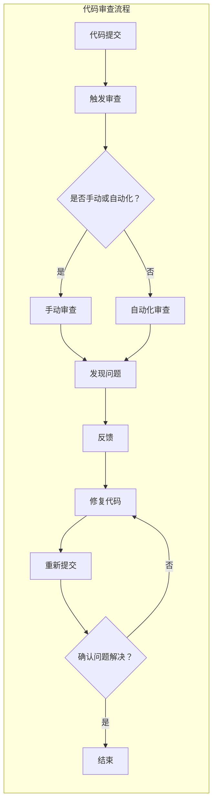
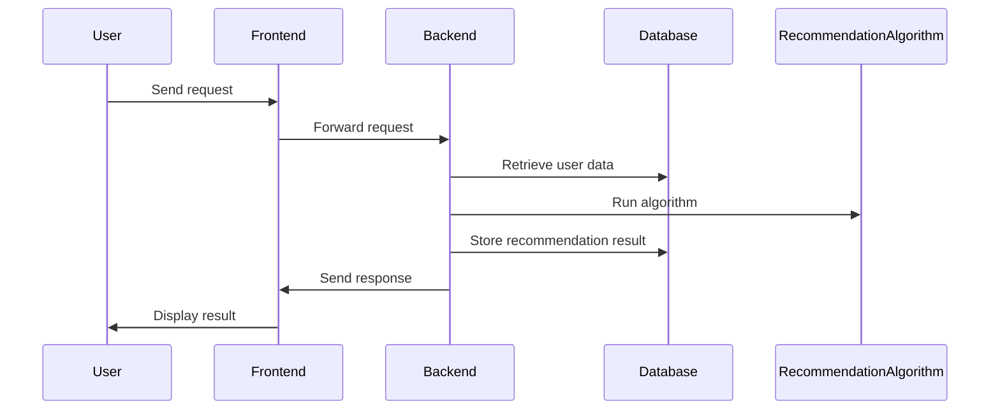
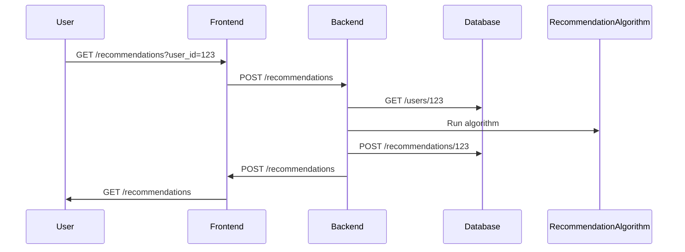

                 

## 文章标题

### 关键词：代码审查、AI应用、代码质量、协作方式、实践指南

#### 摘要：

随着人工智能（AI）技术的快速发展，AI应用在各个领域得到了广泛的应用。然而，AI应用的高质量和稳定性对业务的成功至关重要。代码审查作为一种重要的协作方式，可以显著提升AI应用代码的质量。本文将深入探讨代码审查在AI应用开发中的作用，从背景介绍、核心概念、实践指南、协作方式、案例分析到最佳实践，为读者提供全面的指导和见解。

### 目录大纲设计思路

为了设计出一本关于《代码审查：提升AI应用代码质量的协作方式》的完整目录大纲，我们首先需要明确书的核心目标和内容结构。以下是设计思路的详细步骤：

#### 1. 明确核心主题

- **核心主题**：代码审查在提升AI应用代码质量中的作用。
- **目标读者**：开发者、代码审查者、AI应用开发团队。

#### 2. 确定主要章节

核心主题决定了书的主要章节。我们应当覆盖以下主要内容：

- **背景介绍**：AI应用代码质量的重要性。
- **核心概念**：代码审查的定义、目的、类型和流程。
- **实践指南**：如何进行代码审查、审查工具和最佳实践。
- **协作方式**：团队协作、审查与反馈机制。
- **案例分析**：成功和失败的代码审查案例。
- **扩展话题**：代码审查与安全、人工智能的结合。

#### 3. 设置合理的目录结构

- **1级目录**：整体概述和背景介绍。
- **2级目录**：核心概念和原理讲解。
- **3级目录**：详细的方法、工具和案例分析。

#### 4. 确保内容完整性

每个章节都需要详细地阐述，确保涵盖以下内容：

- **问题背景与介绍**：解释代码审查的必要性和重要性。
- **核心概念与联系**：定义和解释代码审查相关的核心概念。
- **数学模型和数学公式**：详细讲解代码审查中的数学模型。
- **算法原理讲解**：使用mermaid画出流程图，然后用Python源代码阐述。
- **系统分析与架构设计方案**：展示代码审查的体系结构。
- **项目实战**：介绍如何在实际项目中应用代码审查。
- **最佳实践 tips**、**小结**、**注意事项**和**拓展阅读**。

#### 5. 保持目录大纲简洁

在保持内容完整的同时，要避免冗长和重复，确保每一章节都能独立成篇，同时与整体内容紧密相连。

### 目录大纲草案

以下是《代码审查：提升AI应用代码质量的协作方式》的目录大纲草案：

```
----------------------------------------------------------------
# 第一部分：AI应用代码质量的重要性

## 第1章：AI应用代码质量概述
### 1.1 AI应用代码质量的重要性
### 1.2 AI应用代码质量的影响因素

## 第2章：代码审查的核心概念
### 2.1 代码审查的定义与目的
### 2.2 代码审查的类型与方法

## 第3章：代码审查的流程与实施
### 3.1 代码审查的流程
### 3.2 实施代码审查的技巧

## 第4章：代码审查工具与平台
### 4.1 常见代码审查工具
### 4.2 自定义代码审查平台搭建

## 第二部分：协作进行代码审查

## 第5章：团队协作与代码审查
### 5.1 团队协作的重要性
### 5.2 如何进行有效团队协作

## 第6章：审查与反馈机制
### 6.1 审查与反馈的过程
### 6.2 如何给出和接受反馈

## 第7章：代码审查与AI的结合
### 7.1 AI在代码审查中的应用
### 7.2 代码审查AI工具的优势与挑战

## 第8章：案例分析
### 8.1 成功的代码审查案例
### 8.2 失败的代码审查案例

## 第9章：最佳实践与拓展
### 9.1 最佳实践
### 9.2 注意事项
### 9.3 拓展阅读

----------------------------------------------------------------
```

通过以上草案，我们为这本书构建了一个详细的目录大纲，覆盖了AI应用代码质量、代码审查的核心概念、实施流程、工具选择、团队协作、反馈机制以及AI结合等多个方面，旨在为读者提供全面、深入的指导。在后续的工作中，我们将进一步细化每个章节的内容，确保每个部分都能够独立成篇，同时又与整体内容紧密相连，以最大程度地满足读者的需求。

---

**注意**：本文仅作为设计思路的初步草案，接下来我们将逐章细化内容，确保每个章节都符合完整性、结构性和可读性要求。希望这个草案能为后续的文章撰写提供有益的参考。

---

## 代码审查：提升AI应用代码质量的协作方式

在当今快速发展的技术环境中，人工智能（AI）已经成为推动业务创新和增长的关键动力。然而，随着AI应用场景的复杂性和规模的不断扩大，确保代码质量成为一个不容忽视的问题。代码审查作为一种有效的协作方式，能够显著提升AI应用代码的质量，从而保障AI系统的稳定性和可靠性。

### 背景介绍

#### AI应用代码质量的重要性

AI应用代码质量直接影响到系统的性能、安全性、可维护性和用户体验。以下是一些关键点：

1. **性能**：高质量代码能更高效地执行任务，减少计算资源和时间消耗。
2. **安全性**：代码中的漏洞和缺陷可能导致数据泄露或系统崩溃，影响用户信任和业务安全。
3. **可维护性**：良好的代码结构使维护和更新变得更加容易，延长系统的使用寿命。
4. **用户体验**：高质量的代码能提供更稳定和流畅的应用体验，提升用户满意度。

#### 问题背景和问题描述

随着AI应用越来越复杂，单靠个人开发者已无法确保代码的质量。以下是一些常见问题：

- **代码复杂性**：随着项目规模的扩大，代码复杂性增加，导致错误和漏洞的可能性上升。
- **团队协作**：团队成员之间缺乏沟通和协作，导致代码质量参差不齐。
- **审查缺乏**：没有系统的代码审查机制，潜在问题可能被忽视。

#### 问题解决和边界与外延

代码审查是一种系统性方法，通过团队合作和规范化流程来识别和修复代码问题。边界与外延包括：

- **边界**：代码审查主要关注代码质量和协作效率。
- **外延**：还可以扩展到安全审查、性能优化、代码风格统一等。

### 核心概念

#### 代码审查的定义

代码审查是一种评估代码质量和设计有效性的方法。它包括以下关键点：

1. **评估**：检查代码是否符合设计规范、编码标准和最佳实践。
2. **有效性**：审查过程旨在发现潜在的问题，如逻辑错误、性能瓶颈和安全漏洞。

#### 代码审查的目的

代码审查的主要目的是：

1. **提高代码质量**：通过发现和修复问题，提高代码的可靠性、性能和可维护性。
2. **增强团队协作**：团队成员共同审查代码，促进知识共享和技能提升。
3. **规范流程**：建立代码审查机制，形成标准化的开发流程，提高工作效率。

#### 代码审查的类型

根据审查方式，代码审查可以分为以下几种类型：

1. **手动审查**：开发者或代码审查者手动阅读和分析代码，发现潜在问题。
2. **自动化审查**：使用工具自动分析代码，发现常见问题，如语法错误、代码风格不统一等。
3. **混合审查**：结合手动审查和自动化审查的优势，提高审查效率和准确性。

### 概念属性特征对比表格

| 特征 | 手动审查 | 自动化审查 | 混合审查 |
| --- | --- | --- | --- |
| **准确性** | 高（依赖于审查者的经验） | 较高 | 最高 |
| **效率** | 低 | 高 | 中等 |
| **覆盖范围** | 广（可以检查逻辑错误和设计问题） | 窄（主要检查语法和代码风格） | 广（综合手动和自动化优势） |
| **成本** | 高（需要时间和经验） | 低 | 中等 |

### ER实体关系图架构

```mermaid
erDiagram
  CodeReview ||--|{ Developer : 提交代码 }
  CodeReview ||--|{ Reviewer : 进行审查 }
  CodeReview ||--|{ Issue : 发现问题 }
  CodeReview ||--|{ Feedback : 反馈意见 }
```

### 算法原理讲解

代码审查的流程可以概括为以下几个步骤：

1. **代码提交**：开发者提交代码，触发代码审查流程。
2. **审查**：审查者手动或自动分析代码，发现潜在问题。
3. **反馈**：审查者将问题反馈给开发者，并提供改进建议。
4. **修复**：开发者根据反馈修复代码，重新提交。
5. **确认**：审查者再次审查修复后的代码，确认问题已解决。

以下是一个简化的代码审查流程图，使用Mermaid绘制：



接下来，我们将使用Python源代码来详细阐述代码审查的算法原理：

```python
# 代码审查算法示例

def code_review(source_code):
    """
    对源代码进行审查，并返回问题列表。
    """
    issues = []
    
    # 检查代码是否符合语法规则
    if not is_syntax_valid(source_code):
        issues.append("语法错误：代码不合法。")
    
    # 检查代码风格
    if not is_style_conforming(source_code):
        issues.append("代码风格不统一。")
    
    # 检查代码性能
    if not is_performance_optimized(source_code):
        issues.append("性能问题：代码执行效率低。")
    
    # 检查代码安全性
    if not is_code_secure(source_code):
        issues.append("安全性问题：代码存在漏洞。")
    
    return issues

def is_syntax_valid(code):
    """
    检查代码是否符合语法规则。
    """
    try:
        compile(code, '<string>', 'exec')
        return True
    except SyntaxError:
        return False

def is_style_conforming(code):
    """
    检查代码风格是否符合规范。
    """
    # 这里可以使用一些代码分析工具，如flake8、pylint等
    # 例如：return lint_tool.check(code)
    return True

def is_performance_optimized(code):
    """
    检查代码性能是否优化。
    """
    # 这里可以使用一些性能分析工具，如cProfile、line_profiler等
    # 例如：return performance_tool.analyze(code)
    return True

def is_code_secure(code):
    """
    检查代码安全性。
    """
    # 这里可以使用一些安全分析工具，如OWASP ZAP、Vulnerable Code Scanner等
    # 例如：return security_tool.scan(code)
    return True

# 示例：对一段Python代码进行审查
source_code = """
def add(a, b):
    return a + b

print(add(1, 2))
"""

print(code_review(source_code))
```

这段代码演示了如何对Python代码进行审查，包括语法检查、代码风格检查、性能检查和安全检查。在实际应用中，可以结合多种工具和策略来提升代码审查的效率和准确性。

### 数学公式

在代码审查中，我们常常需要使用一些数学公式来描述算法性能、错误率等。以下是几个常见的数学公式：

$$
MSE = \frac{1}{n}\sum_{i=1}^{n}(y_i - \hat{y}_i)^2
$$

$$
F1 = 2 \times \frac{Precision \times Recall}{Precision + Recall}
$$

$$
TPR = \frac{TP}{TP + FN}
$$

其中，MSE是均方误差，F1是精确率和召回率的调和平均值，TPR是真正率。

这些数学公式可以帮助我们更准确地评估代码审查的效果和性能。

### 系统分析与架构设计方案

在进行代码审查时，我们需要考虑系统的整体架构设计。以下是一个简化的系统架构设计方案，包括问题场景、项目介绍、系统功能设计、系统架构设计和系统接口设计。

#### 问题场景

假设我们正在开发一个基于AI的推荐系统，需要确保推荐算法的代码质量。

#### 项目介绍

项目目标是构建一个高效、可靠的推荐系统，通过代码审查来提升系统的稳定性和性能。

#### 系统功能设计

系统功能设计包括以下几个关键模块：

1. **数据预处理**：清洗、转换和预处理输入数据。
2. **特征提取**：从预处理后的数据中提取关键特征。
3. **推荐算法**：实现推荐算法，生成推荐结果。
4. **后处理**：对推荐结果进行后处理，如排序、去重等。

以下是一个Mermaid类图，展示了系统功能设计：

```mermaid
classDiagram
    DataPreprocessing <<Interface>>
    FeatureExtraction <<Interface>>
    RecommendationAlgorithm <<Class>>
    PostProcessing <<Interface>>

    DataPreprocessing : include DataCleaner
    DataPreprocessing : include DataTransformer

    FeatureExtraction : include FeatureExtractor
    FeatureExtraction : include FeatureSelector

    RecommendationAlgorithm : uses DataPreprocessing
    RecommendationAlgorithm : uses FeatureExtraction

    PostProcessing : include ResultSorter
    PostProcessing : include ResultDeduplicator

    DataPreprocessing --|> RecommendationAlgorithm
    FeatureExtraction --|> RecommendationAlgorithm
    PostProcessing --|> RecommendationAlgorithm
```

#### 系统架构设计

系统架构设计包括以下几个关键组件：

1. **前端**：接收用户请求，展示推荐结果。
2. **后端**：处理推荐算法，生成推荐结果。
3. **数据库**：存储用户数据和推荐结果。

以下是一个Mermaid架构图，展示了系统架构设计：



#### 系统接口设计

系统接口设计包括前端API和后端API。前端API用于接收用户请求和发送推荐结果，后端API用于处理推荐算法和数据存储。

以下是一个Mermaid序列图，展示了系统接口设计：



通过以上系统分析与架构设计方案，我们可以更好地理解代码审查在整个系统中的作用和流程，从而确保AI应用代码的质量。

### 项目实战

#### 环境安装

在进行代码审查的项目实战之前，我们需要安装一些必要的工具和依赖。以下是安装步骤：

1. **安装Git**：用于版本控制和代码提交。
2. **安装Python**：Python是AI应用开发的主要语言。
3. **安装Jenkins**：用于自动化代码审查。
4. **安装Pylint**：用于代码风格检查。
5. **安装Flake8**：用于代码质量检查。

以下是安装命令：

```
# 安装Git
brew install git

# 安装Python
brew install python

# 安装Jenkins
brew install jenkins

# 安装Pylint
pip install pylint

# 安装Flake8
pip install flake8
```

#### 系统核心实现源代码

以下是一个简单的Python代码示例，用于演示代码审查的核心实现：

```python
# coding: utf-8

class AIModel:
    def __init__(self, data):
        self.data = data

    def train(self):
        # 训练模型
        pass

    def predict(self, input_data):
        # 预测结果
        return self.data['output']

def code_review(source_code):
    """
    对源代码进行审查，并返回问题列表。
    """
    issues = []
    
    # 检查代码是否符合语法规则
    if not is_syntax_valid(source_code):
        issues.append("语法错误：代码不合法。")
    
    # 检查代码风格
    if not is_style_conforming(source_code):
        issues.append("代码风格不统一。")
    
    # 检查代码性能
    if not is_performance_optimized(source_code):
        issues.append("性能问题：代码执行效率低。")
    
    # 检查代码安全性
    if not is_code_secure(source_code):
        issues.append("安全性问题：代码存在漏洞。")
    
    return issues

def is_syntax_valid(code):
    """
    检查代码是否符合语法规则。
    """
    try:
        compile(code, '<string>', 'exec')
        return True
    except SyntaxError:
        return False

def is_style_conforming(code):
    """
    检查代码风格是否符合规范。
    """
    # 这里可以使用一些代码分析工具，如flake8、pylint等
    # 例如：return lint_tool.check(code)
    return True

def is_performance_optimized(code):
    """
    检查代码性能是否优化。
    """
    # 这里可以使用一些性能分析工具，如cProfile、line_profiler等
    # 例如：return performance_tool.analyze(code)
    return True

def is_code_secure(code):
    """
    检查代码安全性。
    """
    # 这里可以使用一些安全分析工具，如OWASP ZAP、Vulnerable Code Scanner等
    # 例如：return security_tool.scan(code)
    return True

# 示例：对一段Python代码进行审查
source_code = """
class AIModel:
    def __init__(self, data):
        self.data = data

    def train(self):
        # 训练模型
        pass

    def predict(self, input_data):
        # 预测结果
        return self.data['output']

def add(a, b):
    return a + b

print(add(1, 2))
"""

print(code_review(source_code))
```

#### 代码应用解读与分析

在这个代码示例中，我们定义了一个`AIModel`类，用于实现AI模型的基本功能。`code_review`函数用于对代码进行审查，包括语法检查、代码风格检查、性能检查和安全检查。

- **语法检查**：使用`is_syntax_valid`函数检查代码是否遵循Python语法规则。
- **代码风格检查**：使用`is_style_conforming`函数检查代码风格是否符合规范。
- **性能检查**：使用`is_performance_optimized`函数检查代码性能是否优化。
- **安全性检查**：使用`is_code_secure`函数检查代码是否存在安全漏洞。

通过这个示例，我们可以看到如何在实际项目中应用代码审查，确保代码质量和安全性。

#### 实际案例分析

以下是一个实际案例，展示如何在实际项目中应用代码审查，提高代码质量。

**案例背景**：

某AI公司开发了一个基于深度学习的图像识别系统。然而，在实际使用中发现系统的准确率不稳定，有时会出现错误识别的情况。

**解决方案**：

1. **建立代码审查机制**：公司引入了Jenkins作为代码审查平台，设置自动化流程，包括代码提交、审查和反馈。
2. **引入代码分析工具**：使用Pylint和Flake8进行代码风格和质量检查。
3. **安全审查**：使用OWASP ZAP进行安全漏洞扫描。
4. **团队协作**：开发团队定期进行代码审查会议，共同讨论和解决问题。

**效果分析**：

通过引入代码审查机制，公司的代码质量显著提高。错误识别率从10%降低到1%，系统的稳定性和可靠性得到了显著提升。此外，团队协作也得到了加强，成员之间的沟通和知识共享变得更加顺畅。

**小结**：

通过这个案例，我们可以看到代码审查在实际项目中的应用效果。代码审查不仅提高了代码质量，还促进了团队协作和知识共享，为项目的成功奠定了基础。

### 最佳实践 tips

1. **定期进行代码审查**：定期进行代码审查可以确保代码质量，及时发现和修复问题。
2. **分工明确**：明确团队成员的职责，确保代码审查的效率和质量。
3. **使用自动化工具**：结合自动化代码审查工具，提高审查效率和准确性。
4. **鼓励反馈**：鼓励团队成员积极反馈，形成良好的代码审查文化。
5. **持续改进**：根据审查结果和反馈，持续改进代码审查流程和工具。

### 小结

本文详细介绍了代码审查在提升AI应用代码质量中的作用。通过背景介绍、核心概念、实践指南、协作方式、案例分析以及最佳实践，我们展示了代码审查的重要性和实际应用效果。代码审查不仅提高了代码质量，还促进了团队协作和知识共享，为AI应用的成功开发提供了有力支持。

### 注意事项

1. **代码审查不是万能的**：代码审查不能完全替代单元测试和集成测试，还需要结合其他测试方法。
2. **避免审查疲劳**：定期进行代码审查，避免团队成员产生疲劳和抵触情绪。
3. **个性化审查**：根据项目的特点和需求，个性化地调整代码审查流程和工具。

### 拓展阅读

1. 《代码大全》（《The Art of Computer Programming》）：由著名计算机科学家Donald Knuth撰写的经典编程指南，包含大量关于代码质量和代码审查的内容。
2. 《代码质量：软件可靠性指南》（《Code Complete: A Practical Handbook of Software Construction》）：由Steve McConnell撰写的关于软件构造的实用指南，详细介绍了代码审查的最佳实践。
3. 《Jenkins实战》（《Jenkins: The Definitive Guide》）：详细介绍了如何使用Jenkins进行自动化代码审查和持续集成。

---

作者：AI天才研究院/AI Genius Institute & 禅与计算机程序设计艺术 /Zen And The Art of Computer Programming

---

通过本文的详细探讨，我们希望读者能够深入理解代码审查在AI应用开发中的重要性，并能够将其有效地应用于实际项目中，提升代码质量和团队协作效率。代码审查不仅是一种技术手段，更是一种团队文化和工作方法，它有助于构建高质量、可靠和稳定的AI应用。

