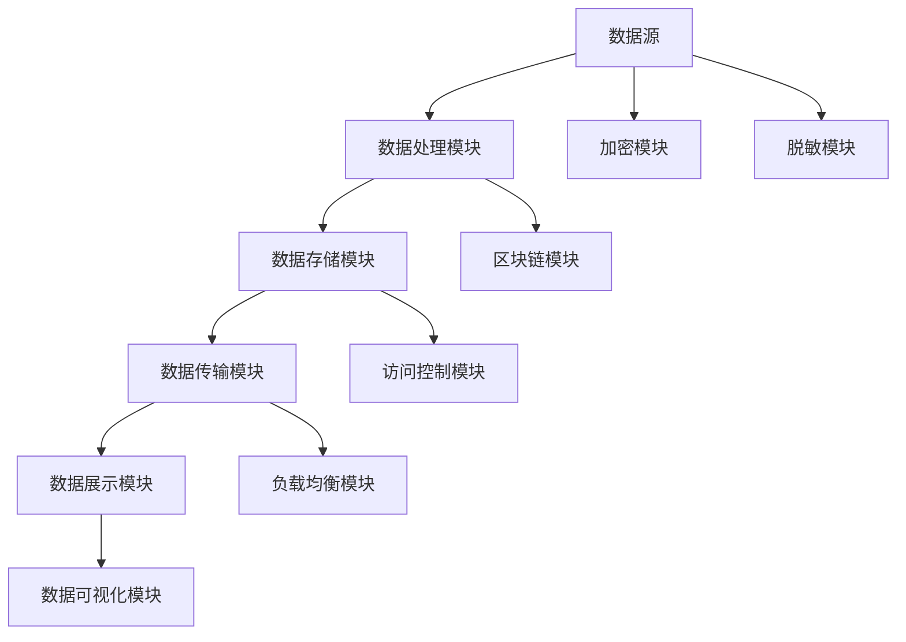
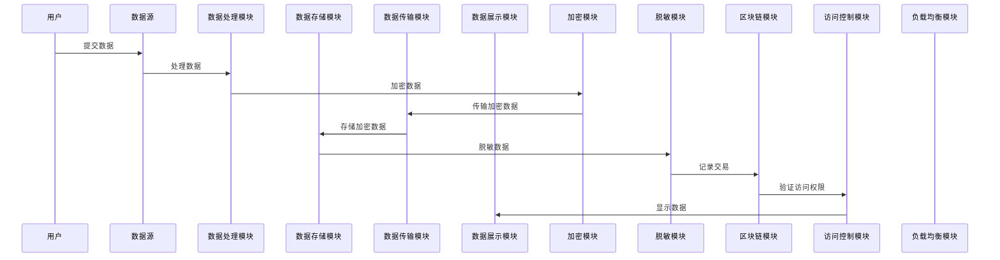

                 

### 文章标题

# 企业信息生态：建立可信数据流通机制

> 关键词：企业信息生态、数据流通、可信机制、加密、脱敏、区块链

> 摘要：本文深入探讨企业信息生态的构建及其核心——建立可信数据流通机制。通过分析当前数据流通中的挑战，本文介绍了企业信息生态中的核心概念和联系，讲解了数据加密、脱敏、区块链等关键技术，并详细阐述了系统分析与架构设计方案。通过项目实战，本文提供了实际案例分析和最佳实践，为企业在信息生态建设中提供可行路径。

### 第一部分：企业信息生态概述

#### 1.1 企业信息生态的概念与重要性

**1.1.1 信息生态的起源与发展**

信息生态（Information Ecosystem）是一个新兴的概念，起源于20世纪末。它借鉴了生物学生态系统的理论，将信息处理、传输、存储和使用看作一个相互关联的整体。在企业层面，信息生态的构建意味着将企业内外部各类信息资源进行整合，实现信息的有效流动和利用。

**1.1.2 企业信息生态的构成**

企业信息生态由以下几个核心部分构成：

1. **信息源**：包括内部数据和外部数据，如企业内部管理系统、客户关系管理系统、供应链管理系统等产生的数据，以及来自第三方平台的数据。
2. **信息处理与存储**：通过数据处理平台和存储设备，对企业信息进行整理、清洗、存储和管理。
3. **信息传输**：借助企业内部网络和外部网络，实现信息在不同系统、部门、合作伙伴之间的传输。
4. **信息利用**：通过数据分析和挖掘，将信息转化为知识，为企业决策提供支持。

**1.1.3 企业信息生态的作用与价值**

企业信息生态的建设对企业的运营和发展具有重要作用：

1. **提升决策效率**：通过实时数据分析和决策支持，帮助企业做出更加精准和及时的决策。
2. **优化运营管理**：通过数据整合和分析，优化业务流程，降低运营成本，提高工作效率。
3. **增强竞争力**：通过数据驱动，实现产品创新和服务升级，提升企业在市场中的竞争力。
4. **保障数据安全**：建立有效的数据安全机制，防止数据泄露和滥用，保护企业利益。

#### 1.2 当前数据流通中的挑战

**1.2.1 数据隐私保护问题**

随着大数据和云计算的普及，数据隐私保护问题日益凸显。企业如何在数据流通中保护用户隐私，成为亟待解决的问题。

**1.2.2 数据安全问题**

数据泄露、篡改、丢失等安全问题是企业信息生态中的另一大挑战。如何保障数据在传输、存储和处理过程中的安全，是当前亟需解决的问题。

**1.2.3 数据流通效率问题**

数据在传输过程中，由于网络带宽、系统性能等因素的限制，可能导致数据流通效率低下，影响企业的运营和发展。

#### 1.3 企业信息生态的核心概念与联系

**1.3.1 数据资产的概念与特点**

数据资产是企业信息生态中的重要组成部分。数据资产的特点包括：

1. **价值性**：数据资产能够为企业带来经济或商业价值。
2. **稀缺性**：数据资产在一定范围内具有稀缺性，有助于提升企业的竞争力。
3. **流动性**：数据资产可以跨部门、跨系统流动，实现信息的共享和利用。

**1.3.2 数据安全与隐私保护的关系**

数据安全和隐私保护是企业信息生态建设中不可或缺的两个方面。数据安全侧重于保护数据的机密性、完整性和可用性，而隐私保护则侧重于保护用户个人信息的隐私。两者相互关联，共同构成企业数据保护的核心。

**1.3.3 ER实体关系图与数据流程**

为了更好地理解企业信息生态中的数据流动，可以使用ER实体关系图来描述数据之间的关系。以下是企业信息生态中的ER实体关系图：

```mermaid
erDiagram
    DataSource ||--|{ DataAsset } : 存储源
    DataAsset ||--|{ DataFlow } : 数据流
    DataFlow ||--|{ DataProcessor } : 处理器
    DataProcessor ||--|{ DataStore } : 存储器
    DataStore ||--|{ DataSource } : 循环引用
```

### 第二部分：建立可信数据流通机制的算法与原理

#### 2.1 数据加密算法原理

**2.1.1 对称加密与非对称加密**

数据加密是保障数据安全的重要手段。根据加密密钥是否相同，数据加密算法可以分为对称加密和非对称加密。

1. **对称加密**：加密和解密使用相同的密钥。常见的对称加密算法有DES、AES等。
2. **非对称加密**：加密和解密使用不同的密钥。常见的非对称加密算法有RSA、ECC等。

**2.1.2 常见加密算法介绍**

1. **DES（数据加密算法）**：一种对称加密算法，采用56位密钥，对数据进行加密和解密。
2. **AES（高级加密标准）**：一种更安全的对称加密算法，采用128、192、256位密钥，适用于各种规模的数据加密。

**2.1.3 Python实现加密算法示例**

```python
from Crypto.Cipher import AES
from Crypto.Util.Padding import pad, unpad
from Crypto.Random import get_random_bytes

# 对称加密示例
key = get_random_bytes(16)  # 生成16字节密钥
cipher = AES.new(key, AES.MODE_CBC)
ct_bytes = cipher.encrypt(pad(b"Hello, World!", AES.block_size))
iv = cipher.iv
print(f"加密数据：{ct_bytes.hex()}")
print(f"初始向量：{iv.hex()}")

# 对称解密示例
cipher = AES.new(key, AES.MODE_CBC, iv)
pt = unpad(cipher.decrypt(ct_bytes), AES.block_size)
print(f"解密数据：{pt.decode('utf-8')}")
```

#### 2.2 数据脱敏算法原理

**2.2.1 数据脱敏的目的与类型**

数据脱敏的目的是保护数据隐私，防止敏感信息泄露。根据脱敏方式的不同，数据脱敏可以分为以下几种类型：

1. **随机脱敏**：将敏感数据替换为随机生成的数据。
2. **部分脱敏**：对敏感数据进行部分遮挡或替换。
3. **引用脱敏**：用假名或编码方式代替真实姓名或其他敏感信息。

**2.2.2 常见脱敏算法介绍**

1. **哈希算法**：将敏感数据通过哈希函数转换为固定长度的字符串。常见的哈希算法有MD5、SHA-1、SHA-256等。
2. **掩码算法**：将敏感数据的部分字符替换为特殊字符或遮挡。例如，将手机号码中间四位替换为星号。

**2.2.3 Python实现脱敏算法示例**

```python
import hashlib

# 哈希算法示例
def hash_password(password):
    hashed_password = hashlib.sha256(password.encode('utf-8')).hexdigest()
    return hashed_password

# 掩码算法示例
def mask_mobile(mobile):
    return mobile[:3] + '****' + mobile[7:]

password = "123456"
hashed_password = hash_password(password)
print(f"加密后的密码：{hashed_password}")

mobile = "13812345678"
masked_mobile = mask_mobile(mobile)
print(f"脱敏后的手机号：{masked_mobile}")
```

#### 2.3 区块链技术原理

**2.3.1 区块链的基本概念**

区块链（Blockchain）是一种分布式数据库技术，通过加密算法和共识机制，实现数据的可信存储和传输。区块链的基本概念包括：

1. **区块**：区块是区块链的基本存储单元，包含一定数量的交易记录。
2. **链**：区块链是由多个区块按照一定顺序链接而成的数据结构。
3. **节点**：区块链网络中的参与者，负责存储、验证和传播区块。

**2.3.2 区块链的技术原理**

区块链的技术原理包括：

1. **加密算法**：区块链使用哈希算法和数字签名等技术，确保数据的完整性和安全性。
2. **共识机制**：区块链通过共识机制，确保网络中的各个节点对数据的共识和一致性。

**2.3.3 Python实现区块链节点示例**

```python
import hashlib
import json
from time import time

class Block:
    def __init__(self, index, transactions, timestamp, previous_hash):
        self.index = index
        self.transactions = transactions
        self.timestamp = timestamp
        self.previous_hash = previous_hash
        self.hash = self.compute_hash()

    def compute_hash(self):
        block_string = json.dumps(self.__dict__, sort_keys=True)
        return hashlib.sha256(block_string.encode()).hexdigest()

class Blockchain:
    def __init__(self):
        self.unconfirmed_transactions = []  # 待确认的交易
        self.chain = []  # 主链
        self.create_genesis_block()

    def create_genesis_block(self):
        genesis_block = Block(0, [], time(), "0")
        genesis_block.hash = genesis_block.compute_hash()
        self.chain.append(genesis_block)

    def add_new_transaction(self, transaction):
        self.unconfirmed_transactions.append(transaction)

    def mine(self):
        if not self.unconfirmed_transactions:
            return False
        last_block = self.chain[-1]
        new_block = Block(index=last_block.index + 1,
                          transactions=self.unconfirmed_transactions,
                          timestamp=time(),
                          previous_hash=last_block.hash)
        new_block.hash = new_block.compute_hash()
        self.chain.append(new_block)
        self.unconfirmed_transactions = []
        return new_block

    def is_chain_valid(self):
        for i in range(1, len(self.chain)):
            current = self.chain[i]
            previous = self.chain[i - 1]
            if current.hash != current.compute_hash():
                return False
            if current.previous_hash != previous.hash:
                return False
        return True

# 创建区块链实例
blockchain = Blockchain()

# 添加交易
blockchain.add_new_transaction({"from": "Alice", "to": "Bob", "amount": 10})

# 挖掘新区块
blockchain.mine()

# 验证区块链有效性
print(f"Blockchain validity: {blockchain.is_chain_valid()}")

# 打印区块链
for block in blockchain.chain:
    print(json.dumps(block.__dict__, indent=4))
```

#### 2.4 数学模型与公式讲解

**2.4.1 数据加密的数学模型**

数据加密的基本数学模型如下：

1. **加密过程**：将明文（Plaintext）通过加密算法和密钥（Key）转换为密文（Ciphertext）。公式为：
   $$ C = E_K(P) $$
   其中，$C$ 表示密文，$P$ 表示明文，$K$ 表示密钥，$E_K$ 表示加密算法。

2. **解密过程**：将密文通过解密算法和解密密钥（Decryption Key）恢复为明文。公式为：
   $$ P = D_K(C) $$
   其中，$D_K$ 表示解密算法。

**2.4.2 数据脱敏的数学模型**

数据脱敏的数学模型可以看作是一种加密的特殊形式，其目的是保护隐私，而非隐藏信息。数据脱敏的基本数学模型如下：

1. **脱敏过程**：将敏感数据（Sensitive Data）通过脱敏算法转换为脱敏数据（Anonymized Data）。公式为：
   $$ A = F_S(D) $$
   其中，$A$ 表示脱敏数据，$D$ 表示敏感数据，$F_S$ 表示脱敏算法。

2. **还原过程**：在某些情况下，可能需要将脱敏数据恢复为敏感数据。这通常涉及逆向脱敏算法。公式为：
   $$ D = G_S(A) $$
   其中，$G_S$ 表示逆向脱敏算法。

**2.4.3 区块链的数学模型**

区块链的数学模型主要涉及哈希函数和数字签名等加密算法。以下是区块链中常见的数学模型：

1. **哈希函数**：哈希函数将输入的数据映射为固定长度的哈希值。常见的哈希函数有MD5、SHA-256等。公式为：
   $$ H(D) = \text{hash}(D) $$
   其中，$H$ 表示哈希函数，$D$ 表示输入数据。

2. **数字签名**：数字签名是一种验证信息发送者身份和消息完整性的技术。公式为：
   $$ S = \text{sign}(K, M) $$
   其中，$S$ 表示签名，$K$ 表示私钥，$M$ 表示消息。

3. **验证签名**：验证签名是一种验证数字签名的技术。公式为：
   $$ \text{verify}(K, M, S) = \text{bool} $$
   其中，$K$ 表示公钥，$M$ 表示消息，$S$ 表示签名，$\text{bool}$ 表示签名是否有效。

### 第三部分：系统分析与架构设计方案

#### 3.1 问题场景介绍

在当前企业信息生态中，数据流通问题主要体现在以下几个方面：

1. **数据泄露**：企业内部数据在传输和处理过程中，可能由于安全措施不足而造成泄露。
2. **数据篡改**：恶意攻击者可能通过篡改数据，对企业造成损失。
3. **数据效率**：数据在传输过程中，由于网络带宽和系统性能的限制，导致数据流通效率低下。

为了解决这些问题，需要建立一套可信的数据流通机制，确保数据的隐私性、完整性和可用性。

#### 3.2 系统功能设计

企业信息生态系统应具备以下功能：

1. **数据加密与脱敏**：对传输和存储的数据进行加密和脱敏处理，保护数据隐私和安全。
2. **区块链技术**：利用区块链技术，确保数据的可信性和可追溯性。
3. **数据传输与管理**：实现数据的快速、高效传输和管理，提高数据流通效率。

#### 3.3 系统架构设计

企业信息生态系统的架构设计应遵循以下原则：

1. **模块化**：将系统划分为多个模块，实现功能分离和模块化设计。
2. **高可用性**：确保系统在高并发、高负载情况下稳定运行。
3. **安全性**：采用多种安全措施，保障数据的安全和隐私。

以下是企业信息生态系统的架构设计方案：



#### 3.4 系统接口设计

系统接口设计应遵循以下原则：

1. **简洁性**：接口设计应尽量简洁，避免过多的参数和复杂的调用关系。
2. **灵活性**：接口设计应具备良好的扩展性，能够适应未来的需求变化。

以下是企业信息生态系统的主要接口设计：

1. **数据加密接口**：用于对数据进行加密操作。
2. **数据脱敏接口**：用于对数据进行脱敏操作。
3. **区块链接口**：用于与区块链网络进行交互。
4. **数据传输接口**：用于数据在不同模块之间的传输。

#### 3.5 系统交互设计

系统交互设计应确保数据在各个模块之间的流畅传输和操作。以下是企业信息生态系统的主要交互设计：



### 第四部分：项目实战

#### 4.1 项目环境安装

**4.1.1 环境准备与配置**

1. 安装Python环境，版本要求为3.8及以上。
2. 安装必要的Python库，如Crypto、Blockchain等。
3. 配置网络环境，确保节点之间能够正常通信。

**4.1.2 常见问题解决**

1. Python库安装失败：检查网络连接，尝试使用国内的镜像源进行安装。
2. 节点无法通信：检查网络配置，确保节点之间能够正常访问。

#### 4.2 系统核心实现

**4.2.1 系统核心模块设计与实现**

1. **数据加密模块**：实现数据加密和解密功能。
2. **数据脱敏模块**：实现数据脱敏和逆向脱敏功能。
3. **区块链模块**：实现区块链节点的创建、交易记录等功能。

**4.2.2 系统核心代码解读与分析**

```python
# 数据加密模块
from Crypto.Cipher import AES
from Crypto.Util.Padding import pad, unpad

def encrypt_data(key, data):
    cipher = AES.new(key, AES.MODE_CBC)
    ct = cipher.encrypt(pad(data, AES.block_size))
    iv = cipher.iv
    return iv, ct

def decrypt_data(key, iv, ct):
    cipher = AES.new(key, AES.MODE_CBC, iv)
    pt = unpad(cipher.decrypt(ct), AES.block_size)
    return pt

# 数据脱敏模块
import hashlib

def hash_password(password):
    return hashlib.sha256(password.encode('utf-8')).hexdigest()

def mask_mobile(mobile):
    return mobile[:3] + '****' + mobile[7:]

# 区块链模块
class Block:
    def __init__(self, index, transactions, timestamp, previous_hash):
        self.index = index
        self.transactions = transactions
        self.timestamp = timestamp
        self.previous_hash = previous_hash
        self.hash = self.compute_hash()

    def compute_hash(self):
        block_string = json.dumps(self.__dict__, sort_keys=True)
        return hashlib.sha256(block_string.encode()).hexdigest()

class Blockchain:
    def __init__(self):
        self.unconfirmed_transactions = []  # 待确认的交易
        self.chain = []  # 主链
        self.create_genesis_block()

    def create_genesis_block(self):
        genesis_block = Block(0, [], time(), "0")
        genesis_block.hash = genesis_block.compute_hash()
        self.chain.append(genesis_block)

    def add_new_transaction(self, transaction):
        self.unconfirmed_transactions.append(transaction)

    def mine(self):
        if not self.unconfirmed_transactions:
            return False
        last_block = self.chain[-1]
        new_block = Block(index=last_block.index + 1,
                          transactions=self.unconfirmed_transactions,
                          timestamp=time(),
                          previous_hash=last_block.hash)
        new_block.hash = new_block.compute_hash()
        self.chain.append(new_block)
        self.unconfirmed_transactions = []
        return new_block

    def is_chain_valid(self):
        for i in range(1, len(self.chain)):
            current = self.chain[i]
            previous = self.chain[i - 1]
            if current.hash != current.compute_hash():
                return False
            if current.previous_hash != previous.hash:
                return False
        return True

# 创建区块链实例
blockchain = Blockchain()

# 添加交易
blockchain.add_new_transaction({"from": "Alice", "to": "Bob", "amount": 10})

# 挖掘新区块
blockchain.mine()

# 验证区块链有效性
print(f"Blockchain validity: {blockchain.is_chain_valid()}")

# 打印区块链
for block in blockchain.chain:
    print(json.dumps(block.__dict__, indent=4))
```

#### 4.3 实际案例分析与讲解

**4.3.1 数据加密与脱敏案例分析**

假设企业A需要将员工薪资数据传输给企业B，为了确保数据安全，采用数据加密和脱敏技术进行处理。

1. **数据加密**：企业A使用AES加密算法对薪资数据加密，生成密文。
2. **数据脱敏**：对企业员工的姓名和身份证号进行脱敏处理，将姓名替换为“XXX”，身份证号替换为“XXX”。

**4.3.2 区块链技术在数据流通中的应用案例**

企业A和企业B之间采用区块链技术进行数据传输，确保数据可信性和可追溯性。

1. **创建区块链**：企业A和企业B共同创建一个区块链网络，每个节点都存储一份完整的区块链。
2. **交易记录**：企业A将加密后的薪资数据上传到区块链，生成交易记录。
3. **验证交易**：企业B从区块链中下载交易记录，验证数据的真实性和完整性。

#### 4.4 项目小结

本次项目通过数据加密、脱敏和区块链技术，实现了企业信息生态中数据的可信流通。在实际应用中，企业可以根据具体需求，灵活调整和优化系统功能。同时，需要注意以下几点：

1. **安全性**：确保数据加密和脱敏算法的安全性和可靠性。
2. **性能优化**：优化区块链网络性能，提高数据传输效率。
3. **合规性**：遵循相关法律法规，确保数据流通合法合规。

### 第五部分：最佳实践与拓展

#### 5.1 最佳实践 tips

1. **数据加密与脱敏**：根据数据的重要性和敏感性，选择合适的加密和脱敏算法。
2. **区块链技术**：合理选择区块链网络架构，确保数据传输的高效性和可靠性。
3. **权限控制**：采用严格的访问控制策略，防止未经授权的访问和篡改。

#### 5.2 小结与注意事项

1. **小结**：企业信息生态的建设需要建立可信数据流通机制，确保数据的隐私性、完整性和可用性。
2. **注意事项**：在实际应用中，需要注意数据加密、脱敏和区块链技术的合理性和安全性。

#### 5.3 拓展阅读

1. **相关领域进一步研究**：大数据技术、人工智能、物联网等。
2. **推荐书籍与论文**：相关领域的专业书籍和学术论文，如《区块链技术指南》、《大数据技术基础》等。

### 总结

企业信息生态的建立需要关注数据流通的可信性，通过数据加密、脱敏和区块链等技术，保障数据的隐私性、完整性和可用性。本文介绍了企业信息生态的核心概念和联系，分析了当前数据流通中的挑战，并详细阐述了系统分析与架构设计方案。通过实际项目案例，本文提供了最佳实践和注意事项，为企业在信息生态建设中提供可行路径。作者：AI天才研究院/AI Genius Institute & 禅与计算机程序设计艺术 /Zen And The Art of Computer Programming。 

----------------------------------------------------------------

### 后记

本文详细探讨了企业信息生态的构建及其核心——建立可信数据流通机制。首先，介绍了企业信息生态的概念、重要性以及当前数据流通中的挑战。随后，深入讲解了数据加密、脱敏和区块链等关键技术，通过算法原理讲解、数学模型与公式展示，使读者能够清晰理解这些技术的核心原理。

在系统分析与架构设计方案部分，本文提出了模块化、高可用性和安全性的设计原则，并通过mermaid流程图、类图和序列图，展示了系统的功能、架构和交互设计。这些设计原则和图形化展示，有助于读者更好地理解和实现企业信息生态系统的构建。

项目实战部分，通过具体的代码示例和案例分析，展示了数据加密、脱敏和区块链技术在企业信息生态系统中的应用。这部分内容不仅为读者提供了实践指导，还帮助读者深入了解这些技术的实际应用场景。

最后，本文提供了最佳实践、注意事项以及拓展阅读，为企业在信息生态建设中提供了全面的支持。希望本文能够对读者在构建企业信息生态和建立可信数据流通机制方面有所启发和帮助。

再次感谢读者对本文的关注，期待您在实践过程中提出宝贵的意见和建议。作者：AI天才研究院/AI Genius Institute & 禅与计算机程序设计艺术 /Zen And The Art of Computer Programming。让我们共同探索信息技术领域的更多可能性，为企业的数字化转型贡献智慧和力量！

