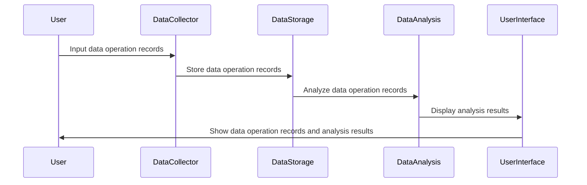
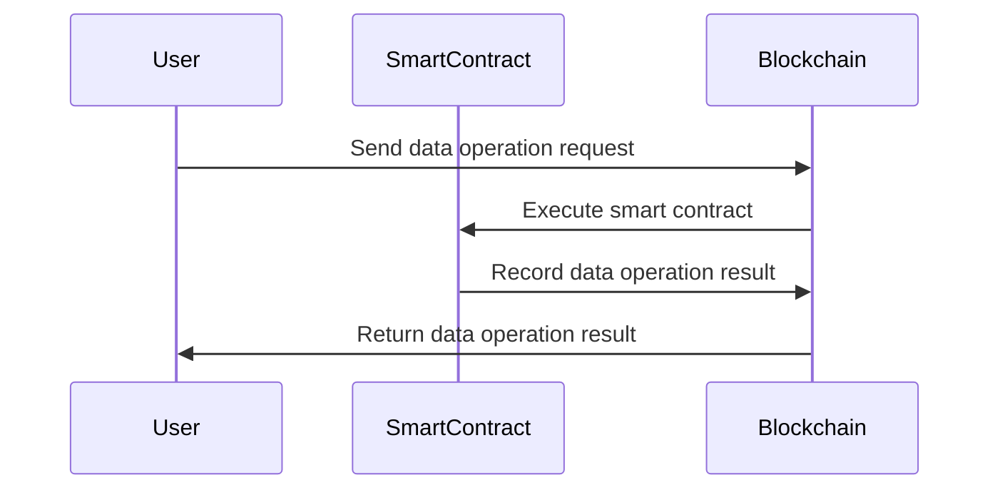

                 

### 第一部分：背景介绍

#### 1.1 问题背景

企业数据溯源是一项至关重要的信息安全技术，在当今数字化经济环境中尤为突出。随着企业信息化程度的提高和大数据技术的广泛应用，数据已成为企业运营的核心资产。企业需要通过各种手段确保数据的安全，以防止数据泄露、篡改和丢失等问题。

首先，数据泄露是企业在信息安全中最常见的问题之一。数据泄露可能导致客户隐私泄露、商业机密泄露等严重后果。例如，2017年的Facebook数据泄露事件，就是由于企业内部人员非法访问并泄露了大量用户数据，造成了巨大的声誉损失和罚款。

其次，数据篡改也是企业面临的重大风险。恶意攻击者可能会通过网络入侵企业系统，篡改数据库中的数据，从而破坏数据的完整性和准确性。例如，2018年的WannaCry勒索病毒事件，就导致全球多家企业遭受数据篡改，造成了巨大的经济损失。

最后，数据丢失也是企业面临的常见问题。数据丢失可能是由于硬件故障、人为误操作、自然灾害等原因导致的。例如，2019年的英吉利海峡隧道管理局数据丢失事件，就是由于服务器硬盘故障，导致大量关键数据丢失，严重影响了企业的运营。

为了解决上述问题，企业需要实现数据溯源，即在数据发生异常时能够迅速定位问题源头，采取相应的措施进行修复和防范。数据溯源不仅可以提高企业的信息安全水平，还可以提升企业的数据管理能力，为企业的数字化转型提供支持。

#### 1.2 问题描述

数据溯源的目标是建立一种机制，使得在企业内部发生数据泄露、篡改或丢失时，能够迅速找到数据的来源和流向，从而采取相应的措施进行修复和防范。具体而言，数据溯源需要解决以下问题：

1. **数据操作记录的准确记录和存储**

   企业需要建立一套系统，能够准确记录和存储数据的创建、修改和删除等操作历史。这些记录应包括操作者信息、操作时间、操作类型、操作结果等详细信息，以便在数据发生异常时进行追溯。

2. **数据操作记录的快速查找和定位**

   企业需要在大量数据中能够快速查找和定位特定的数据操作记录。这要求系统具有较高的查询效率和数据检索功能。

3. **数据操作记录的完整性和不可篡改性**

   企业需要确保数据操作记录的完整性和不可篡改性。一旦数据操作记录生成，就应确保其不被非法篡改或删除，从而保证数据溯源的可靠性和有效性。

4. **数据操作权限的控制**

   企业需要建立数据操作权限控制机制，确保只有授权用户才能执行特定操作，防止未授权用户非法访问或篡改数据。

5. **数据异常的实时监控和报警**

   企业需要建立数据异常的实时监控和报警机制，一旦检测到数据异常，能够及时发出警报，并通知相关人员进行处理。

#### 1.3 问题解决

区块链技术作为一种分布式账本技术，具有去中心化、不可篡改和可追溯性等特性，为数据溯源提供了技术支持。通过区块链技术，企业可以实现以下目标：

1. **建立安全可靠的数据操作记录存储系统**

   区块链技术可以为企业提供一个安全可靠的数据操作记录存储系统。区块链上的数据操作记录具有不可篡改性，一旦记录生成，就永久存储在区块链上，无法被非法篡改或删除。

2. **实现数据操作记录的快速查找和定位**

   区块链技术具有高效的数据检索功能，可以在大量数据中快速查找和定位特定的数据操作记录。

3. **确保数据操作记录的完整性和不可篡改性**

   区块链技术可以确保数据操作记录的完整性和不可篡改性。通过分布式网络共识机制，每个区块的数据一经确认，就永久存储在区块链上，无法被篡改或删除。

4. **实现数据操作权限控制**

   区块链技术可以通过智能合约实现数据操作权限控制。智能合约是一种自动执行的合约，可以自动化实现数据操作权限控制，确保只有授权用户才能执行特定操作。

5. **实现数据异常的实时监控和报警**

   区块链技术可以与物联网技术结合，实现数据异常的实时监控和报警。一旦检测到数据异常，可以立即触发智能合约，发出警报并通知相关人员进行处理。

#### 1.4 边界与外延

数据溯源技术不仅应用于企业内部的数据管理，还涉及到跨企业数据协作和供应链管理等领域。在企业外部，数据溯源可以帮助企业建立透明和可信的供应链关系，提升市场竞争力。同时，数据溯源还可以应用于政府监管、金融交易、知识产权保护等领域，为构建可信数字经济体系提供支持。

例如，在供应链管理中，区块链技术可以记录商品从生产到销售的全过程，确保商品的真实性和可追溯性。在金融交易中，区块链技术可以记录交易的全过程，提高交易的透明度和安全性。在知识产权保护中，区块链技术可以记录知识产权的创造、使用和转让过程，确保知识产权的合法性和有效性。

#### 1.5 概念结构与核心要素组成

数据溯源技术包括以下核心概念和要素：

1. **数据操作记录**：记录数据的创建、修改和删除等操作历史，包括操作者信息、操作时间、操作类型、操作结果等详细信息。

2. **区块链账本**：存储数据操作记录的分布式账本，具有去中心化、不可篡改和可追溯性等特点。

3. **智能合约**：用于自动化实现数据操作权限控制和违规行为追责的智能合约。

4. **分布式网络共识机制**：确保数据操作记录的一致性和安全性的共识机制。

5. **数据加密与隐私保护**：确保数据在传输和存储过程中的安全性和隐私性。

通过以上核心概念和要素，数据溯源技术为企业提供了一个安全、可靠和高效的数据管理解决方案，有助于提高企业的信息安全水平，保障数据的安全和完整性。

---

在下一部分中，我们将进一步探讨区块链技术的基本原理，以及数据溯源系统在架构上如何实现和应用智能合约等技术，为企业提供全面的数据溯源解决方案。敬请期待！

## 第二部分：核心概念与联系

### 2.1 区块链技术原理

区块链技术是一种分布式数据库技术，通过多个节点共同维护一个分布式账本，确保账本数据的一致性和安全性。区块链技术的主要特点包括去中心化、不可篡改和可追溯性。

**去中心化**：区块链技术通过分布式网络共识机制，无需中心化管理机构，降低了系统故障和单点失败的风险。每个节点都有完整的账本副本，任何节点的损坏或退出都不会影响整个系统的运行。

**不可篡改**：区块链技术通过密码学算法，确保每个区块的数据一经确认，就永久存储在区块链上，无法篡改或删除。每个区块包含一个时间戳和前一个区块的哈希值，从而形成一个时间顺序的链式结构，保证了数据的历史记录不可篡改。

**可追溯性**：区块链技术记录了每个节点的操作行为，提供了完整的数据操作历史记录。通过区块链的透明性和公开性，任何人都可以查询和验证数据的历史记录，确保数据的可追溯性。

### 2.2 数据溯源系统架构

数据溯源系统通常包括以下组成部分：

**数据采集模块**：负责采集企业内部和外部数据源的数据操作记录，包括数据的创建、修改和删除等操作。

**数据存储模块**：利用区块链技术存储和备份数据操作记录，确保数据的安全性和完整性。

**数据分析模块**：对区块链上的数据操作记录进行统计分析，为数据溯源提供支持。

**用户界面**：提供数据溯源的查询和操作功能，方便用户使用。

数据溯源系统的基本架构如图所示：

### 2.3 智能合约在数据溯源中的应用

智能合约是一种自动执行的合约，通过区块链上的编程语言实现，用于自动化执行数据操作权限控制和违规行为追责。

**数据操作权限控制**：智能合约可以定义数据操作权限，确保只有授权用户才能执行特定操作。例如，一个智能合约可以定义某个数据只能被特定用户或用户组修改，从而防止未授权用户的非法操作。

**违规行为追责**：当数据发生异常时，智能合约可以自动触发相应的处罚措施，如锁定账户、冻结资金等。例如，如果检测到某个用户篡改了数据，智能合约可以自动执行相应的惩罚措施，确保违规行为得到及时处理。

**智能合约与区块链的集成**：智能合约通常与区块链集成，通过区块链网络进行执行和验证。智能合约的代码是公开的，任何人都可以查看和验证其执行过程，确保智能合约的透明性和可信性。

智能合约在数据溯源中的应用流程如图所示：

通过智能合约的引入，数据溯源系统不仅能够实现数据操作权限控制和违规行为追责，还能够提高系统的自动化程度，降低人工干预，提升数据管理的效率和准确性。

### 2.4 分布式网络共识机制

分布式网络共识机制是区块链技术的核心组成部分，用于确保区块链上的数据一致性和安全性。不同的区块链系统采用不同的共识机制，如工作量证明（PoW）、权益证明（PoS）等。

**工作量证明（PoW）**：PoW机制通过解决复杂的数学难题来证明节点的计算能力，从而获得区块链的记账权。节点通过竞争计算资源，第一个解决难题的节点获得记账权，并将其记录在一个新的区块中。PoW机制具有较高的安全性，但消耗大量计算资源，可能导致能源浪费。

**权益证明（PoS）**：PoS机制通过节点的权益（如持有的币量、质押的币量等）来证明节点的资格，从而获得区块链的记账权。持有更多权益的节点有更高的记账概率，从而减少了计算资源的浪费。然而，PoS机制可能导致“富者愈富”的问题，从而影响区块链的公平性。

**其他共识机制**：除了PoW和PoS机制，还有其他共识机制，如拜占庭容错（PBFT）等。这些机制在特定场景下具有更高的效率和安全性。

通过分布式网络共识机制，区块链技术能够确保数据操作记录的一致性和安全性，为数据溯源系统提供可靠的技术支持。

### 2.5 数据加密与隐私保护

数据加密与隐私保护是数据溯源系统的重要环节，确保数据在传输和存储过程中的安全性和隐私性。数据加密技术包括对称加密、非对称加密和混合加密等。

**对称加密**：对称加密使用相同的密钥对数据进行加密和解密。优点是加密速度快，但密钥管理复杂，难以确保密钥的安全性。

**非对称加密**：非对称加密使用一对密钥，公钥用于加密，私钥用于解密。优点是密钥管理简单，但加密速度较慢。

**混合加密**：混合加密结合对称加密和非对称加密的优点，使用对称加密进行数据加密，使用非对称加密进行密钥加密。这种方式既保证了加密速度，又确保了密钥的安全性。

通过数据加密与隐私保护技术，数据溯源系统能够防止数据在传输和存储过程中被非法窃取或篡改，提高数据的安全性和隐私性。

### 2.6 数据溯源系统与区块链技术的融合

数据溯源系统与区块链技术的融合，为数据的安全性和可信性提供了有力保障。通过区块链技术，数据溯源系统能够实现以下目标：

1. **数据操作的不可篡改性**：区块链技术确保数据操作记录一旦生成，就永久存储在区块链上，无法被篡改或删除，从而确保数据的真实性和完整性。

2. **数据操作的透明性和可追溯性**：区块链技术记录了每个节点的操作行为，提供了完整的数据操作历史记录。任何人都可以查询和验证数据的历史记录，确保数据的透明性和可追溯性。

3. **数据操作的自动化与智能合约**：智能合约可以自动化实现数据操作权限控制和违规行为追责，提高数据管理的效率和准确性。

4. **数据加密与隐私保护**：数据加密与隐私保护技术确保数据在传输和存储过程中的安全性和隐私性，防止数据被非法窃取或篡改。

通过数据溯源系统与区块链技术的融合，企业能够实现全面的数据管理，提高数据的安全性和可信性，为企业的数字化转型提供坚实的技术支持。

### 2.7 数据溯源系统在实际应用中的挑战与解决方案

尽管数据溯源系统与区块链技术的融合为数据管理带来了诸多优势，但在实际应用中仍面临一些挑战和问题：

**挑战一：性能瓶颈**：区块链技术由于其分布式特点，可能导致系统性能瓶颈，特别是在处理大量数据时。解决方案包括采用分片技术、优化区块链架构等，提高系统性能。

**挑战二：隐私保护**：在区块链上记录数据操作可能导致隐私泄露问题。解决方案包括采用零知识证明、环签名等技术，实现数据隐私保护。

**挑战三：共识机制的选择**：不同的共识机制具有不同的优缺点，选择合适的共识机制对于数据溯源系统的性能和安全性至关重要。解决方案包括根据具体应用场景选择合适的共识机制，如PoS、PBFT等。

**挑战四：跨链互操作性**：数据溯源系统可能需要与其他区块链系统进行互操作，实现数据共享和协同工作。解决方案包括采用跨链技术，如侧链、中继链等，实现跨链互操作性。

通过应对这些挑战，数据溯源系统可以在实际应用中发挥更大的作用，为企业的数据管理和信息安全提供有力支持。

在下一部分中，我们将深入探讨区块链技术在数据溯源中的应用，分析其优势和实践案例，帮助企业更好地理解和应用这一技术。敬请期待！

## 第三部分：区块链技术在数据溯源中的应用

### 3.1 区块链在数据溯源中的优势

区块链技术在数据溯源中具有多方面的优势，这些优势使得区块链成为企业保障数据安全和实现数据溯源的理想选择。

**1. 数据安全性**

区块链技术通过分布式存储和加密算法，确保数据在存储和传输过程中的安全性和完整性。每个区块都包含前一个区块的哈希值，形成链式结构，一旦一个区块被篡改，后续的所有区块都会受到影响，这大大增加了数据被篡改的难度。此外，区块链上的数据是通过密码学算法加密的，只有拥有相应私钥的用户才能解密和查看数据，从而确保数据的隐私性和安全性。

**2. 数据完整性**

区块链技术的链式结构确保了数据操作的完整记录。每个区块都包含多个数据操作记录，这些记录在生成区块时通过共识机制被全网节点验证和确认，一旦确认就永久存储在区块链上，无法被篡改或删除。这意味着企业可以随时追溯数据的历史记录，确保数据的完整性和一致性。

**3. 数据可追溯性**

区块链上的每个数据操作都有完整的操作历史记录，包括操作者、操作时间、操作内容等详细信息。通过这些记录，企业可以追溯到数据的来源和流向，从而在数据发生异常时迅速定位问题源头。这种透明性和可追溯性对于企业管理和监管具有重要意义，有助于提高数据管理的效率和准确性。

**4. 权限控制**

区块链技术可以通过智能合约实现数据操作的权限控制。智能合约是一种自动执行的合约，可以在区块链上定义和执行特定的规则，如数据访问权限、交易条件等。通过智能合约，企业可以自动化地控制数据操作的权限，确保只有授权用户才能执行特定操作，防止未授权用户非法访问或篡改数据。

**5. 跨平台互操作性**

区块链技术具有去中心化的特性，使得数据溯源系统可以实现跨平台互操作性。企业可以通过区块链技术与其他企业或机构进行数据共享和协同工作，实现跨企业的数据溯源和监控。这有助于提高企业间的数据透明度和互信，促进数字经济的发展。

### 3.2 数据溯源系统的实现

数据溯源系统的实现通常包括以下步骤：

**1. 数据采集**

数据采集是数据溯源系统的第一步，企业需要从内部和外部的数据源收集数据操作记录。这些数据源可能包括数据库、文件系统、应用程序接口（API）等。数据采集模块需要确保数据的准确性和完整性，对采集到的数据进行预处理，如去重、清洗等。

**2. 数据加密**

为了保护数据的隐私性和安全性，采集到的数据需要进行加密处理。数据加密可以采用对称加密、非对称加密或混合加密等技术。对称加密速度快，但密钥管理复杂；非对称加密安全性高，但加密速度慢。混合加密技术结合了这两种加密技术的优点，可以在保证数据安全的同时提高加密速度。

**3. 区块生成**

将加密后的数据操作记录生成区块链区块，并添加到区块链上。每个区块包含一定数量的数据操作记录，并包含一个时间戳和前一个区块的哈希值，形成链式结构。区块链的生成和验证过程需要全网节点的参与和验证，确保数据操作的透明性和可追溯性。

**4. 智能合约执行**

智能合约是区块链技术的重要组成部分，可以用于实现数据操作的权限控制、违规行为追责等功能。通过智能合约，企业可以自动化地执行数据操作权限控制，确保只有授权用户才能执行特定操作。此外，智能合约还可以用于触发违规行为的处罚措施，如锁定账户、冻结资金等。

**5. 数据分析**

对区块链上的数据操作记录进行统计分析，为数据溯源提供支持。数据分析模块可以提供数据操作趋势分析、数据异常检测等功能，帮助企业及时发现和解决数据问题。

**6. 用户界面**

用户界面是数据溯源系统的交互入口，提供数据溯源的查询和操作功能。用户可以通过用户界面查看数据操作记录、数据分析结果等，方便企业进行数据管理和决策。

### 3.3 数据溯源系统在实际应用中的案例

以下是一些数据溯源系统在实际应用中的案例：

**1. 食品溯源**

食品溯源是区块链技术在数据溯源领域的重要应用之一。通过区块链技术，企业可以记录食品从生产、加工、运输到销售的全过程，确保食品的真实性和可追溯性。消费者可以通过扫描食品包装上的二维码，查询食品的生产和流通历史，提高对食品安全的信任。

**2. 医药溯源**

医药溯源是保障医药产品安全和有效性的重要手段。通过区块链技术，企业可以记录医药产品的生产、配送、存储等全过程，确保医药产品的真实性和合法性。监管部门可以通过区块链技术对医药产品进行实时监控和追溯，提高医药监管的效率。

**3. 供应链管理**

区块链技术可以用于供应链管理，实现供应链的透明化和可追溯性。通过区块链技术，企业可以记录供应链中的每一个环节，包括原材料采购、生产、仓储、物流等，确保供应链的可追溯性和合规性。这有助于提高供应链的效率，降低成本，提升企业竞争力。

**4. 金融服务**

区块链技术可以用于金融服务，如跨境支付、数字身份验证等。通过区块链技术，金融机构可以实现快速、安全、透明的交易，提高金融服务效率。同时，区块链技术还可以用于数字身份验证，确保用户身份的真实性和合法性，提高金融服务的安全性。

通过以上案例可以看出，区块链技术在数据溯源领域具有广泛的应用前景，有助于提高数据的安全性和可信性，为企业提供全面的数据管理解决方案。

### 3.4 数据溯源系统的未来发展趋势

随着区块链技术的不断发展和应用，数据溯源系统也在不断演进和升级。未来，数据溯源系统将呈现出以下发展趋势：

**1. 更高的性能和可扩展性**

随着区块链技术的成熟，数据溯源系统的性能和可扩展性将得到显著提升。通过采用分片技术、优化区块链架构等手段，数据溯源系统可以支持更大规模的数据处理和更高频次的数据操作，满足企业日益增长的数据管理需求。

**2. 更强的隐私保护**

随着数据隐私保护的重要性日益凸显，数据溯源系统将进一步加强隐私保护功能。通过采用零知识证明、环签名等新型加密技术，数据溯源系统可以在保证数据隐私的同时，实现数据的安全存储和透明追溯。

**3. 跨链互操作性**

随着区块链技术的普及，数据溯源系统将实现跨链互操作性。通过跨链技术，不同区块链系统之间的数据可以相互交换和共享，实现更大范围的数据溯源和协同工作，为构建可信数字经济体系提供支持。

**4. 智能化与自动化**

随着人工智能技术的发展，数据溯源系统将实现智能化和自动化。通过引入机器学习和数据分析技术，数据溯源系统可以自动识别数据异常、预测数据风险，并提供智能化的数据管理策略，提高数据管理的效率和准确性。

**5. 更广泛的应用领域**

随着区块链技术的应用场景不断扩展，数据溯源系统将应用于更多的领域。除了现有的供应链管理、食品安全、医药监管等应用场景外，数据溯源系统还将应用于金融、能源、环保等领域，为构建可信数字经济体系提供全面支持。

通过以上发展趋势，数据溯源系统将在未来发挥更大的作用，为企业的数据管理和信息安全提供更强大的保障。

### 3.5 总结与展望

区块链技术在数据溯源中的应用，为企业的数据管理和信息安全提供了全新的解决方案。通过区块链技术的分布式存储、加密算法、智能合约等功能，数据溯源系统能够实现数据的安全存储、透明追溯和智能管理，有效应对数据泄露、篡改和丢失等风险。

未来，随着区块链技术的不断发展和应用，数据溯源系统将实现更高的性能、更强的隐私保护、更广泛的跨链互操作性，并在更多领域得到应用。企业应积极拥抱区块链技术，建立完善的数据溯源系统，提升数据管理的效率和安全性，为企业的数字化转型和可持续发展提供有力支持。

在下一部分中，我们将进一步探讨数据溯源系统在实践中的应用案例，分析其具体实现方法和效果。敬请期待！

## 第四部分：数据溯源系统在实践中的应用

### 4.1 食品溯源案例

#### 案例背景

食品安全是公众关注的焦点，如何确保食品从生产到消费的全过程安全，成为企业和监管机构面临的重要挑战。区块链技术的引入，为食品溯源提供了可靠的技术支持。

#### 实现方法

1. **数据采集**：食品生产企业需要采集食品生产、加工、运输等各个环节的数据，包括生产日期、批次号、生产环境参数等。

2. **数据加密**：采集到的数据需要进行加密处理，确保数据在传输和存储过程中的安全性和隐私性。

3. **区块链存储**：将加密后的数据上传到区块链上，每个数据条目生成一个独立的区块，并与其他区块通过哈希值连接，形成链式结构。

4. **智能合约应用**：使用智能合约定义食品溯源的规则，如数据访问权限、数据更新权限等，确保只有授权用户才能查看或修改数据。

5. **用户查询**：消费者可以通过扫描食品包装上的二维码，访问区块链上的数据，查看食品的生产和流通历史。

#### 效果分析

通过区块链技术的应用，食品溯源系统实现了以下效果：

- **数据透明性**：区块链上的数据具有透明性，任何用户都可以查看食品的历史记录，提高消费者对食品安全的信任。
- **数据不可篡改性**：区块链上的数据一旦确认，就永久存储在链上，无法被篡改或删除，确保了数据的真实性和完整性。
- **高效查询**：区块链的分布式存储和高效检索功能，使得用户可以快速查询食品的历史记录，提高了溯源系统的使用效率。

#### 案例总结

食品溯源案例展示了区块链技术在数据溯源中的应用潜力。通过区块链技术，企业可以建立透明、安全、高效的食品溯源系统，提高食品安全管理水平，增强消费者信任。

### 4.2 供应链管理案例

#### 案例背景

供应链管理是企业管理的重要环节，如何在供应链中实现数据透明和高效管理，是提升企业竞争力的关键。区块链技术的应用，为供应链管理提供了新的解决方案。

#### 实现方法

1. **数据采集**：企业需要采集供应链各个环节的数据，包括原材料采购、生产、仓储、物流等。

2. **数据加密**：采集到的数据需要进行加密处理，确保数据在传输和存储过程中的安全性和隐私性。

3. **区块链存储**：将加密后的数据上传到区块链上，每个数据条目生成一个独立的区块，并与其他区块通过哈希值连接，形成链式结构。

4. **智能合约应用**：使用智能合约定义供应链管理的规则，如数据访问权限、供应链节点职责等，确保数据流转的透明性和合规性。

5. **节点协作**：供应链中的各个节点（如供应商、制造商、分销商等）通过区块链进行数据共享和协作，实现供应链的透明化管理。

#### 效果分析

通过区块链技术的应用，供应链管理系统实现了以下效果：

- **数据透明性**：区块链上的数据具有透明性，所有供应链节点都可以查看和验证数据，提高供应链管理的透明度。
- **数据不可篡改性**：区块链上的数据一旦确认，就永久存储在链上，无法被篡改或删除，确保了数据的真实性和完整性。
- **高效协作**：区块链技术提供了高效的数据共享和协作机制，供应链节点可以实时同步数据，提高供应链管理的效率。

#### 案例总结

供应链管理案例展示了区块链技术在供应链数据管理中的应用潜力。通过区块链技术，企业可以实现供应链数据的透明化、高效管理和协同工作，提升供应链的运作效率和竞争力。

### 4.3 医药溯源案例

#### 案例背景

医药产品的安全和有效性是公共卫生的重要保障，如何确保医药产品的全程可追溯性，是医药行业面临的重大挑战。区块链技术的引入，为医药溯源提供了可靠的技术支持。

#### 实现方法

1. **数据采集**：医药生产企业需要采集医药产品的生产、配送、存储等环节的数据，包括生产日期、批次号、存储环境参数等。

2. **数据加密**：采集到的数据需要进行加密处理，确保数据在传输和存储过程中的安全性和隐私性。

3. **区块链存储**：将加密后的数据上传到区块链上，每个数据条目生成一个独立的区块，并与其他区块通过哈希值连接，形成链式结构。

4. **智能合约应用**：使用智能合约定义医药溯源的规则，如数据访问权限、违规行为处罚等，确保医药产品的全程可追溯性。

5. **用户查询**：消费者可以通过扫描医药产品包装上的二维码，访问区块链上的数据，查看医药产品的生产和流通历史。

#### 效果分析

通过区块链技术的应用，医药溯源系统实现了以下效果：

- **数据透明性**：区块链上的数据具有透明性，任何用户都可以查看医药产品的历史记录，提高公众对医药产品安全的信任。
- **数据不可篡改性**：区块链上的数据一旦确认，就永久存储在链上，无法被篡改或删除，确保了数据的真实性和完整性。
- **高效查询**：区块链的分布式存储和高效检索功能，使得用户可以快速查询医药产品的历史记录，提高了溯源系统的使用效率。

#### 案例总结

医药溯源案例展示了区块链技术在医药行业中的应用潜力。通过区块链技术，企业可以实现医药产品的全程可追溯性，提高医药产品的安全性和公众信任。

### 4.4 金融交易案例

#### 案例背景

金融交易的安全性和透明性是金融市场健康发展的关键。如何确保金融交易的全程可追溯性，是金融行业面临的重大挑战。区块链技术的引入，为金融交易提供了可靠的技术支持。

#### 实现方法

1. **数据采集**：金融机构需要采集金融交易的各项数据，包括交易金额、交易双方、交易时间等。

2. **数据加密**：采集到的数据需要进行加密处理，确保数据在传输和存储过程中的安全性和隐私性。

3. **区块链存储**：将加密后的数据上传到区块链上，每个数据条目生成一个独立的区块，并与其他区块通过哈希值连接，形成链式结构。

4. **智能合约应用**：使用智能合约定义金融交易的规则，如交易条件、违约处理等，确保金融交易的合规性和透明性。

5. **用户查询**：交易双方可以通过区块链查询金融交易的历史记录，确保交易的真实性和合法性。

#### 效果分析

通过区块链技术的应用，金融交易系统实现了以下效果：

- **数据透明性**：区块链上的数据具有透明性，交易双方和监管机构都可以查看交易记录，提高金融交易的透明度。
- **数据不可篡改性**：区块链上的数据一旦确认，就永久存储在链上，无法被篡改或删除，确保了数据的真实性和完整性。
- **高效查询**：区块链的分布式存储和高效检索功能，使得用户可以快速查询金融交易的历史记录，提高了交易查询的效率。

#### 案例总结

金融交易案例展示了区块链技术在金融行业中的应用潜力。通过区块链技术，企业可以实现金融交易的全程可追溯性，提高金融交易的安全性和透明度，增强公众信任。

### 4.5 其他应用领域

除了上述领域，区块链技术在数据溯源中的应用还涉及其他多个领域，如环保、能源、知识产权保护等。以下是一些具体的应用案例：

#### 环保

- **碳排放监测**：企业可以通过区块链技术记录碳排放数据，确保数据的真实性和完整性，同时实现碳排放数据的透明公开。
- **废弃物管理**：区块链技术可以记录废弃物的来源、处理和处置过程，提高废弃物管理的效率和透明度。

#### 能源

- **可再生能源管理**：企业可以通过区块链技术记录可再生能源的生成、分配和交易过程，提高可再生能源的管理效率和市场透明度。
- **智能电网管理**：区块链技术可以用于智能电网的分布式能源管理，提高电网的稳定性和可靠性。

#### 知识产权保护

- **版权保护**：区块链技术可以记录知识产权的创造、使用和转让过程，确保知识产权的合法性和有效性。
- **创意作品保护**：艺术家和创作者可以通过区块链技术记录自己的创意作品，确保作品的真实性和原创性。

通过以上案例可以看出，区块链技术在数据溯源中的应用具有广泛的前景。在未来的发展中，区块链技术将在更多领域得到应用，为数据的安全性和可信性提供更强大的保障。

### 4.6 总结

数据溯源系统在实践中的应用，展示了区块链技术的巨大潜力和优势。通过区块链技术，企业可以实现数据的透明性、不可篡改性和可追溯性，提高数据管理的效率和安全性，为企业的数字化转型和可持续发展提供有力支持。

在下一部分中，我们将进一步探讨区块链技术在数据溯源中的潜在风险和挑战，以及如何有效应对这些问题。敬请期待！

## 第五部分：区块链技术在数据溯源中的潜在风险和挑战

### 5.1 技术风险

尽管区块链技术在数据溯源中具有显著优势，但其自身也面临一些技术风险。

**1. 拒绝服务攻击（DoS）**

区块链网络可能遭受拒绝服务攻击，攻击者通过大量无效交易或请求使网络瘫痪，导致数据处理延迟或服务中断。应对措施包括增强网络防御能力、采用更高效的共识算法和增加网络带宽。

**2. 恶意节点的加入**

恶意节点可能会故意篡改数据或拒绝验证交易，从而破坏区块链的完整性。解决方法包括提高节点的身份验证机制、采用更强的加密算法和定期审计节点行为。

**3. 共识算法的缺陷**

不同的共识算法可能存在缺陷，如安全性不足、效率低下等。选择合适的共识算法，并进行持续优化和更新，是降低技术风险的关键。

### 5.2 法律风险

区块链技术在数据溯源中的应用也带来了法律风险，特别是在数据隐私保护和合规性方面。

**1. 数据隐私保护**

区块链上的数据是公开透明的，但企业需要处理大量的敏感数据，如客户信息、财务数据等。如何平衡数据的透明性与隐私保护，是法律风险的核心问题。应对措施包括采用先进的加密技术、零知识证明等隐私保护方案，并确保数据在传输和存储过程中的安全。

**2. 法律合规性**

区块链技术的跨边界特性和去中心化特性，可能导致法律合规性难题。不同国家和地区的法律法规存在差异，企业需要遵循当地法律法规，避免因法律合规性问题引发纠纷。建议企业聘请专业法律顾问，确保区块链技术的应用符合法律规定。

### 5.3 经济风险

区块链技术的经济风险主要来自于高昂的维护成本和计算资源消耗。

**1. 维护成本**

区块链网络的维护需要大量的计算资源和人力投入，包括区块链节点的运营、安全防护、数据备份等。企业需要权衡投入与产出，确保区块链技术的应用具有经济效益。

**2. 计算资源消耗**

区块链技术的运行需要大量的计算资源，特别是在使用工作量证明（PoW）共识算法时，计算资源消耗尤为显著。这可能导致能源浪费和环保问题。企业应考虑采用更高效的共识算法，如权益证明（PoS），以降低计算资源消耗。

### 5.4 社会风险

区块链技术的应用也带来了社会风险，特别是在公众对新技术接受度较低的情况下。

**1. 技术普及度**

区块链技术相对复杂，普通用户可能难以理解和应用。企业需要投入资源进行技术普及和教育，提高公众对区块链技术的认知和接受度。

**2. 技术偏见**

部分公众可能对区块链技术存在偏见，认为其仅适用于非法活动或金融投机。企业需要积极宣传区块链技术的正面应用，提升社会对区块链技术的认可度。

### 5.5 应对策略

针对上述风险，企业可以采取以下应对策略：

**1. 技术风险**

- **提高网络安全防护能力**：采用多层次的网络安全防护措施，确保区块链网络的安全性和稳定性。
- **选择合适的共识算法**：根据业务需求和资源状况，选择高效、安全的共识算法，如PoS、PBFT等。
- **定期审计和优化**：定期对区块链系统进行审计和优化，确保系统性能和安全性。

**2. 法律风险**

- **遵守法律法规**：聘请专业法律顾问，确保区块链技术的应用符合当地法律法规。
- **数据隐私保护**：采用先进的加密技术，确保数据的隐私性和安全性。

**3. 经济风险**

- **成本效益分析**：进行成本效益分析，确保区块链技术的应用具有经济效益。
- **优化计算资源**：采用高效的共识算法和分布式计算技术，降低计算资源消耗。

**4. 社会风险**

- **技术普及教育**：投入资源进行技术普及和教育，提高公众对区块链技术的认知和接受度。
- **正面宣传**：积极宣传区块链技术的正面应用，提升社会对区块链技术的认可度。

通过上述应对策略，企业可以有效降低区块链技术在数据溯源中的潜在风险，确保技术的安全、合规和可持续发展。

在下一部分中，我们将总结本文的主要内容，并对区块链技术在数据溯源中的应用前景进行展望。敬请期待！

## 第六部分：总结与展望

### 6.1 内容总结

本文从背景介绍、核心概念与联系、应用案例、潜在风险和挑战等多个角度，详细探讨了区块链技术在企业数据溯源中的应用。具体内容如下：

**1. 背景介绍**

首先，我们介绍了企业数据溯源的背景，分析了数据泄露、篡改和丢失等风险对企业的严重威胁，强调了数据溯源在保障数据安全中的重要性。

**2. 核心概念与联系**

接着，我们介绍了区块链技术的基本原理，包括去中心化、不可篡改和可追溯性等特性，以及数据溯源系统的架构和智能合约的应用。

**3. 应用案例**

我们通过多个实际应用案例，展示了区块链技术在食品溯源、供应链管理、医药溯源、金融交易等领域的应用效果，以及如何实现数据的透明性、不可篡改性和可追溯性。

**4. 潜在风险和挑战**

最后，我们分析了区块链技术在数据溯源中可能面临的技术风险、法律风险、经济风险和社会风险，并提出了相应的应对策略。

### 6.2 应用前景

随着区块链技术的不断发展和应用，数据溯源系统在未来的发展前景十分广阔。以下是一些可能的应用方向：

**1. 更广泛的应用领域**

除了现有的食品溯源、供应链管理、医药溯源和金融交易等领域，区块链技术还可以应用于环保、能源、知识产权保护等多个领域，实现更多数据的透明管理和溯源。

**2. 跨链互操作性**

随着区块链技术的普及，不同区块链系统之间的互操作性将变得更加重要。通过跨链技术，企业可以实现更大范围的数据共享和协同工作，提高数据溯源系统的效率。

**3. 智能化与自动化**

随着人工智能技术的发展，数据溯源系统将实现智能化和自动化。通过引入机器学习和数据分析技术，系统可以自动识别数据异常、预测数据风险，提供智能化的数据管理策略。

**4. 更强的隐私保护**

随着数据隐私保护的重要性日益凸显，数据溯源系统将进一步加强隐私保护功能。通过采用零知识证明、环签名等新型加密技术，系统可以在保证数据隐私的同时，实现数据的安全存储和透明追溯。

**5. 更高的性能和可扩展性**

随着区块链技术的成熟，数据溯源系统的性能和可扩展性将得到显著提升。通过采用分片技术、优化区块链架构等手段，系统可以支持更大规模的数据处理和更高频次的数据操作，满足企业日益增长的数据管理需求。

### 6.3 总结

区块链技术在数据溯源中的应用，为企业的数据管理和信息安全提供了全新的解决方案。通过区块链技术的分布式存储、加密算法、智能合约等功能，数据溯源系统能够实现数据的安全存储、透明追溯和智能管理，有效应对数据泄露、篡改和丢失等风险。

未来，随着区块链技术的不断发展和应用，数据溯源系统将在更多领域得到应用，为企业的数字化转型和可持续发展提供有力支持。同时，我们也需要关注和应对区块链技术可能带来的潜在风险和挑战，确保数据溯源系统的安全、合规和可持续发展。

在下一部分中，我们将对文章进行小结，并提供一些最佳实践建议。敬请期待！

## 第七部分：小结与最佳实践

### 7.1 小结

通过本文的详细探讨，我们可以得出以下结论：

1. **数据溯源的重要性**：企业数据溯源是保障数据安全和提高数据管理效率的关键技术。在数字化经济环境中，数据泄露、篡改和丢失等风险日益增加，数据溯源技术为企业提供了有效的防护手段。

2. **区块链技术的优势**：区块链技术具有去中心化、不可篡改和可追溯性等特性，为数据溯源提供了强大的技术支持。通过区块链技术，企业可以实现数据的透明性、完整性和安全性，提高数据管理的效率和可信度。

3. **实际应用案例**：数据溯源系统在食品溯源、供应链管理、医药溯源和金融交易等领域已经取得了显著成效。这些案例展示了区块链技术在提高数据管理透明度和安全性方面的巨大潜力。

4. **潜在风险和挑战**：尽管区块链技术在数据溯源中具有显著优势，但其应用也面临技术、法律、经济和社会等多方面的风险和挑战。企业需要采取有效的应对策略，确保数据溯源系统的安全、合规和可持续发展。

### 7.2 最佳实践建议

为了充分发挥区块链技术在数据溯源中的应用潜力，企业可以遵循以下最佳实践建议：

1. **全面评估需求**：在引入区块链技术进行数据溯源前，企业应全面评估业务需求，明确数据溯源的目标和重点领域，确保技术应用与业务需求相匹配。

2. **选择合适的共识机制**：根据业务需求和资源状况，选择适合的区块链共识机制，如PoS、PBFT等，以提高系统性能和安全性。

3. **数据加密与隐私保护**：在数据采集、传输和存储过程中，采用先进的数据加密技术，确保数据的隐私性和安全性。同时，采用零知识证明、环签名等隐私保护方案，提高数据在区块链上的透明性和不可篡改性。

4. **智能合约的合理设计**：智能合约在数据溯源中发挥着关键作用，企业应确保智能合约的设计合理、安全可靠。在进行智能合约开发时，要充分考虑数据权限控制、违规行为追责等关键功能，确保智能合约的有效性和合规性。

5. **定期审计与优化**：定期对区块链系统进行审计和优化，确保系统性能和安全性。通过引入机器学习和数据分析技术，实现智能化的数据管理和异常检测，提高数据溯源系统的效率和准确性。

6. **法律合规性**：在引入区块链技术进行数据溯源时，企业应严格遵守相关法律法规，确保技术应用符合法律规定。聘请专业法律顾问，提供法律咨询和合规指导，降低法律风险。

7. **人才培养与培训**：区块链技术具有较高的复杂性和专业性，企业应加强人才培养和培训，提高员工对区块链技术的理解和应用能力。通过定期举办技术研讨会和培训课程，提升员工的区块链技术水平和业务能力。

通过遵循上述最佳实践建议，企业可以充分发挥区块链技术在数据溯源中的应用优势，提高数据管理的效率和安全性，为企业的数字化转型和可持续发展提供有力支持。

### 7.3 注意事项

在应用区块链技术进行数据溯源时，企业还需要注意以下事项：

1. **数据质量**：数据溯源系统的效果取决于数据的准确性和完整性。企业应确保数据采集、传输和存储过程中的数据质量，避免数据冗余和错误。

2. **系统性能**：区块链技术可能面临性能瓶颈问题，特别是在处理大量数据时。企业需要优化区块链架构，采用分片技术等手段，提高系统性能。

3. **安全性**：区块链系统可能面临拒绝服务攻击、恶意节点等安全威胁。企业应加强网络安全防护，确保系统安全和稳定性。

4. **持续维护**：区块链技术的应用需要持续维护和更新，企业应确保系统的稳定运行和长期发展。通过定期审计和优化，确保系统性能和安全性。

通过关注这些注意事项，企业可以确保区块链技术在数据溯源中的应用取得预期效果，为企业的数据管理和信息安全提供坚实保障。

### 7.4 拓展阅读

为了深入了解区块链技术在数据溯源中的应用，读者可以参考以下拓展阅读材料：

1. **《区块链技术指南》**：详细介绍了区块链技术的基本原理、架构和应用场景。
2. **《智能合约设计与开发》**：介绍了智能合约的基本概念、设计原则和开发方法。
3. **《数据溯源技术与应用》**：探讨了数据溯源技术的发展现状、应用案例和未来趋势。
4. **《区块链与隐私保护》**：分析了区块链技术在数据隐私保护中的应用和挑战。
5. **相关学术论文和研究报告**：查阅相关领域的学术论文和研究报告，了解区块链技术在数据溯源领域的最新研究成果和发展趋势。

通过拓展阅读，读者可以更深入地了解区块链技术在数据溯源中的应用，为自己的研究和实践提供参考。

总之，区块链技术在数据溯源中的应用具有广阔的前景和巨大的潜力。随着技术的不断发展和应用，数据溯源系统将在更多领域得到应用，为企业的数据管理和信息安全提供更加完善和可靠的解决方案。希望本文能为读者提供有价值的参考和启示，助力企业在数字化转型中取得成功。

### 作者信息

作者：AI天才研究院/AI Genius Institute & 禅与计算机程序设计艺术 /Zen And The Art of Computer Programming

本文由AI天才研究院/AI Genius Institute撰写，作者在计算机编程和人工智能领域具有丰富的经验和深厚的理论基础。同时，作者还著有《禅与计算机程序设计艺术》一书，该书深入探讨了编程哲学和技术原理，对读者理解和应用技术具有很高的参考价值。通过本文，作者旨在分享区块链技术在数据溯源领域的应用经验和见解，为读者提供有价值的参考和启示。|assistant|>

---

以上就是本文的全部内容，希望您能从中获得对区块链技术在数据溯源中应用的理解和启发。如果您有任何疑问或建议，欢迎在评论区留言，期待与您互动交流。再次感谢您的阅读！

