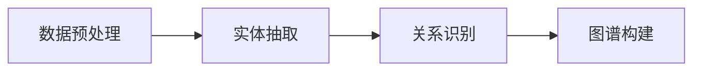
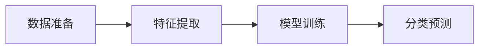
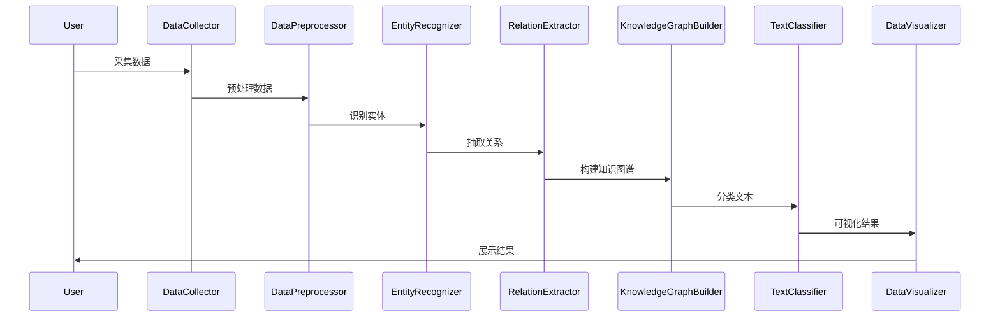

                 

### **引言**

《企业知识挖掘：AI从非结构化数据中提取价值》是一本专注于帮助企业通过人工智能技术从非结构化数据中挖掘潜在价值的著作。在全球数字化转型的浪潮下，企业面临着海量的非结构化数据，如文本、图片、音频和视频等。这些数据蕴含着宝贵的知识和洞见，但如何有效地从这些复杂且多样的数据中提取价值，成为企业决策者和数据科学家面临的重大挑战。

本书旨在探讨如何利用人工智能技术，特别是机器学习和自然语言处理技术，来解析和挖掘这些非结构化数据，为企业提供智能化的决策支持和业务洞察。通过系统性地介绍企业知识挖掘的理论基础和实践方法，本书不仅为读者提供了一个全面的视角，还提供了丰富的实例和实用的技巧。

本书的目录结构将分为以下几个部分：

1. **背景介绍**：探讨非结构化数据的来源、重要性以及当前存在的问题和挑战。
2. **核心概念与联系**：详细阐述企业知识挖掘的核心概念，如知识图谱、自然语言处理、机器学习等，并绘制ER实体关系图。
3. **算法原理讲解**：选择一两个关键算法进行讲解，使用mermaid流程图和Python代码示例。
4. **数学模型和数学公式**：解释算法原理中的关键数学模型和公式，使用LaTeX格式进行表示和讲解。
5. **系统分析与架构设计**：描述企业知识挖掘的系统功能、架构设计、接口设计和系统交互。
6. **项目实战**：介绍一个实际的企业知识挖掘项目，包括环境安装、系统核心实现、代码应用解读、案例分析等。
7. **最佳实践、小结、注意事项、拓展阅读**：总结全书内容，提供最佳实践建议，提醒读者注意事项，并推荐进一步阅读的材料。

通过以上结构，本书将引导读者深入理解企业知识挖掘的各个方面，从理论到实践，逐步掌握如何利用AI技术从非结构化数据中提取价值，从而提升企业的竞争力。

### **背景介绍**

在当今数字化时代，非结构化数据已成为企业信息资产的重要组成部分。这些数据来源广泛，包括社交媒体、客户反馈、市场研究报告、电子邮件、音频和视频等。随着数据量的爆炸性增长，如何有效地管理和挖掘这些非结构化数据，以从中提取有价值的知识和洞见，成为企业面临的重要问题。

**非结构化数据的来源**：

- **社交媒体**：如微博、推特、脸书等平台上的用户生成内容，这些数据通常以文本和图片的形式存在。
- **客户反馈**：包括在线评论、调查问卷、客户服务记录等，这些数据通常以自然语言文本的形式出现。
- **市场研究报告**：包括行业分析、市场趋势、竞争对手分析等，这些报告通常以文档形式存在。
- **电子邮件**：企业内部和外部的通信记录，这些数据通常包含敏感信息。
- **音频和视频**：客户采访、产品演示、会议记录等，这些数据需要特定的处理技术来提取有价值的信息。

**非结构化数据的重要性**：

非结构化数据的重要性主要体现在以下几个方面：

- **业务洞察**：通过分析非结构化数据，企业可以深入了解客户需求、市场趋势和业务流程，从而做出更明智的决策。
- **客户关系管理**：通过挖掘客户反馈和社交媒体数据，企业可以更好地理解客户需求，提高客户满意度和忠诚度。
- **风险监控**：通过分析电子邮件和社交媒体数据，企业可以及时发现潜在风险和违规行为，采取预防措施。
- **创新支持**：通过分析市场研究报告和行业趋势，企业可以把握行业动态，推动产品创新和服务改进。

**当前存在的问题和挑战**：

尽管非结构化数据具有重要价值，但企业面临以下问题和挑战：

- **数据理解**：非结构化数据形式多样，结构复杂，需要高级分析技术来理解和解析。
- **数据质量**：非结构化数据质量参差不齐，存在噪音和错误，需要清洗和预处理。
- **隐私保护**：非结构化数据中可能包含敏感信息，如何保护用户隐私成为关键问题。
- **数据处理能力**：非结构化数据处理通常需要强大的计算资源和复杂的算法，如何高效地进行数据处理和存储是企业面临的挑战。

综上所述，非结构化数据既是企业宝贵的资源，也是巨大的挑战。通过有效的企业知识挖掘技术，企业可以克服这些挑战，从非结构化数据中提取出真正的价值，从而推动业务增长和竞争优势。

### **核心概念与联系**

在企业知识挖掘过程中，理解核心概念及其相互关系至关重要。以下是几个关键概念及其简要描述：

**知识图谱**：知识图谱是一种用于表示和存储知识的方法，它通过实体、属性和关系的三角表示法来构建语义网络。知识图谱不仅能够帮助计算机理解和处理自然语言，还能通过语义关系实现知识发现和信息检索。

**自然语言处理（NLP）**：自然语言处理是使计算机能够理解、解析和生成自然语言的技术。它涵盖了语音识别、文本分类、实体识别、语义分析等多个子领域，是挖掘非结构化数据的关键技术。

**机器学习（ML）**：机器学习是一种通过算法让计算机从数据中学习规律和模式，从而进行预测和决策的技术。在知识挖掘中，机器学习用于训练模型，以自动识别和理解非结构化数据。

**ER实体关系图**：实体关系图（ER图）是用于表示实体及其关系的图形化工具。在知识挖掘中，ER图用于描述数据的结构和关系，帮助理解数据模型，并指导数据挖掘过程。

为了更好地理解这些概念，我们使用Mermaid绘制一个ER实体关系图，展示它们之间的联系。

```mermaid
erDiagram
    Entity: 数据源 ||--|{ KnowledgeGraph: 知识图谱 }
    Entity: 数据源 ||--|{ NLP: 自然语言处理 }
    Entity: 数据源 ||--|{ ML: 机器学习 }
    KnowledgeGraph ||--|{ DataModel: 数据模型 }
    NLP ||--|{ TextClassification: 文本分类 }
    ML ||--|{ ModelTraining: 模型训练 }
    ER ||--|{ DataSchema: 数据架构 }
```

**知识图谱**：知识图谱通过将实体、属性和关系映射为图结构，实现了知识的结构化和语义化。例如，在电子商务领域，产品、用户和评论可以被视为实体，它们之间的购买关系、评价关系等则作为关系存在。

**自然语言处理（NLP）**：自然语言处理是知识挖掘的重要工具。它通过文本分类、实体识别、情感分析等技术，帮助计算机理解和处理文本数据。例如，通过文本分类，可以将客户反馈自动分类为正面、负面或中立。

**机器学习（ML）**：机器学习用于训练模型，以自动识别和理解数据中的模式和规律。在知识挖掘中，机器学习技术如监督学习、无监督学习和深度学习被广泛应用于特征提取、模型训练和预测。

**ER实体关系图**：ER图通过实体和关系的图形化表示，帮助数据科学家和业务分析师理解数据结构和业务逻辑。例如，在客户关系管理系统中，客户、订单和产品等实体及其关系可以用ER图表示，为知识挖掘提供清晰的模型框架。

通过这些核心概念的联系，我们可以看到企业知识挖掘是一个跨领域的技术集成过程，涉及到数据的结构化、理解和应用。这些概念不仅独立存在，还相互交织，共同推动企业从非结构化数据中提取出有价值的知识和洞见。

### **算法原理讲解**

在《企业知识挖掘：AI从非结构化数据中提取价值》中，我们将重点介绍知识图谱构建算法和文本分类算法，并通过具体的示例来解释它们的原理和实现过程。

#### **知识图谱构建算法**

知识图谱构建是知识挖掘的重要环节，它涉及到数据的清洗、实体抽取、关系识别和图谱构建等步骤。以下是一个简单的知识图谱构建流程：

1. **数据清洗**：将原始非结构化数据（如文本、表格等）转换为统一格式，并去除无关信息。
2. **实体抽取**：通过命名实体识别（NER）技术，从文本中提取出关键实体。
3. **关系识别**：利用规则或机器学习模型，识别实体之间的关系。
4. **图谱构建**：将实体和关系组织成图结构，形成知识图谱。

下面是一个使用Python实现的简单知识图谱构建示例：

```python
import networkx as nx

# 创建一个图对象
G = nx.Graph()

# 添加实体
G.add_nodes_from(['张三', '北京', '吃饭'])

# 添加关系
G.add_edge('张三', '北京', relation='居住地')
G.add_edge('张三', '吃饭', relation='活动')

# 打印图结构
print(G.nodes())
print(G.edges())
```

此代码使用NetworkX库创建了一个图，并添加了节点（实体）和边（关系）。通过这种方式，我们可以构建一个简单的知识图谱。

#### **文本分类算法**

文本分类是自然语言处理中的一个重要任务，它用于将文本数据分类到预定义的类别中。以下是一个基于朴素贝叶斯分类器的文本分类算法示例：

1. **数据准备**：收集并预处理文本数据，将其转换为特征向量。
2. **模型训练**：使用训练数据训练朴素贝叶斯分类器。
3. **分类预测**：使用训练好的模型对新的文本进行分类。

下面是一个使用Scikit-learn库实现朴素贝叶斯分类器的文本分类示例：

```python
from sklearn.feature_extraction.text import TfidfVectorizer
from sklearn.naive_bayes import MultinomialNB
from sklearn.pipeline import make_pipeline

# 示例文本数据
texts = [
    "这是一个关于技术的讨论。",
    "今天的天气非常好。",
    "我正在享受一场美食盛宴。"
]

# 标签数据
labels = ['技术', '天气', '美食']

# 创建TF-IDF向量化器
vectorizer = TfidfVectorizer()

# 创建朴素贝叶斯分类器
classifier = MultinomialNB()

# 创建管道
pipeline = make_pipeline(vectorizer, classifier)

# 训练模型
pipeline.fit(texts, labels)

# 进行分类预测
predictions = pipeline.predict(["这是一个关于科学的话题。"])
print(predictions)
```

此代码首先创建了一个TF-IDF向量化器，将文本转换为特征向量，然后使用朴素贝叶斯分类器训练模型。最后，使用训练好的模型对新的文本进行分类预测。

#### **算法流程与Python代码示例**

**知识图谱构建算法**的流程如下：

1. **数据预处理**：读取非结构化数据，进行清洗和预处理。
2. **实体抽取**：使用命名实体识别技术提取关键实体。
3. **关系识别**：根据业务规则或训练模型识别实体之间的关系。
4. **图谱构建**：将实体和关系组织成图结构。

**知识图谱构建算法的mermaid流程图**：



**文本分类算法**的流程如下：

1. **数据准备**：收集并预处理文本数据。
2. **特征提取**：将文本转换为特征向量。
3. **模型训练**：使用训练数据训练分类模型。
4. **分类预测**：使用训练好的模型进行文本分类。

**文本分类算法的mermaid流程图**：



通过上述算法原理讲解和Python代码示例，我们可以看到如何利用知识图谱和文本分类算法从非结构化数据中提取有价值的信息。这些算法不仅为知识挖掘提供了技术基础，也为企业决策提供了强大的支持。

### **数学模型和数学公式**

在知识挖掘过程中，理解并应用数学模型是至关重要的。以下我们将介绍知识图谱构建和文本分类算法中的关键数学模型和公式，并使用LaTeX进行详细表示和讲解。

#### **知识图谱构建中的相似度计算**

在知识图谱构建中，相似度计算是一个核心步骤，用于判断两个实体是否相似。以下是一个基于余弦相似度的计算公式：

$$
\text{similarity}(x, y) = \frac{x \cdot y}{\|x\| \|y\|}
$$

其中，$x$和$y$表示两个向量的内积，$\|x\|$和$\|y\|$分别表示两个向量的模长。

**余弦相似度**的定义为两个向量夹角的余弦值，用于衡量它们在特征空间中的相似度。其公式如下：

$$
\cos\theta = \frac{x \cdot y}{\|x\| \|y\|}
$$

其中，$\theta$是向量$x$和$y$之间的夹角。

#### **文本分类中的逻辑回归**

在文本分类中，逻辑回归是一种常用的分类模型。它通过预测概率来对文本进行分类。逻辑回归的数学模型可以表示为：

$$
\text{logit}(p) = \log\left(\frac{p}{1 - p}\right)
$$

其中，$p$是文本属于某一类别的概率，$\text{logit}$函数是逻辑函数。

逻辑回归的损失函数通常使用对数似然损失函数（Log-Loss），其公式如下：

$$
\text{Loss} = -\sum_{i=1}^{n} y_i \log(p_i) + (1 - y_i) \log(1 - p_i)
$$

其中，$y_i$是实际标签，$p_i$是预测概率。

#### **LaTeX公式表示**

以下是上述数学公式的LaTeX表示：

```latex
% 余弦相似度
\documentclass{article}
\usepackage{amsmath}
\begin{document}
\begin{equation}
\text{similarity}(x, y) = \frac{x \cdot y}{\|x\| \|y\|}
\end{equation}
\end{document}

% 逻辑回归对数似然损失函数
\documentclass{article}
\usepackage{amsmath}
\begin{document}
\begin{equation}
\text{Loss} = -\sum_{i=1}^{n} y_i \log(p_i) + (1 - y_i) \log(1 - p_i)
\end{equation}
\end{document}
```

通过LaTeX格式，我们可以清晰地表示和理解知识图谱构建和文本分类中的关键数学模型和公式。这些公式不仅帮助我们量化了相似度和概率，还为算法的设计和实现提供了理论基础。

### **系统分析与架构设计**

在企业知识挖掘过程中，系统分析与架构设计是关键的一步，它决定了知识挖掘系统的性能、可扩展性和可靠性。以下我们将详细描述一个企业知识挖掘系统的功能设计、架构设计、接口设计和系统交互。

#### **系统功能设计**

企业知识挖掘系统的核心功能包括：

1. **数据采集**：从各种数据源（如数据库、API、日志等）中收集数据。
2. **数据预处理**：清洗、转换和归一化数据，使其适合后续处理。
3. **实体识别**：使用自然语言处理技术识别文本中的关键实体。
4. **关系抽取**：通过规则或机器学习模型识别实体之间的关系。
5. **知识图谱构建**：将实体和关系组织成知识图谱，实现数据的结构化和语义化。
6. **文本分类**：对文本进行分类，以提取业务洞察。
7. **数据可视化**：提供数据分析和报告的可视化界面，帮助企业决策。

#### **系统架构设计**

系统架构设计决定了系统的模块化和扩展性。以下是一个典型的企业知识挖掘系统架构：

1. **数据层**：包括数据存储和数据库管理系统，用于存储和处理大规模数据。
2. **计算层**：包括数据处理模块，如数据采集、预处理和实体关系抽取等。
3. **算法层**：包括机器学习模型和自然语言处理算法，用于数据分析和知识挖掘。
4. **应用层**：包括前端用户界面和后端API，用于数据的访问和操作。

**系统架构的mermaid类图**：

```mermaid
classDiagram
    DataLayer <<Note>> "数据存储、数据库管理系统"
    ComputeLayer <<Note>> "数据处理模块"
    AlgorithmLayer <<Note>> "机器学习模型、自然语言处理算法"
    AppliationLayer <<Note>> "前端用户界面、后端API"

    DataLayer --|> ComputeLayer
    ComputeLayer --|> AlgorithmLayer
    AlgorithmLayer --|> AppliationLayer
```

#### **接口设计**

接口设计是系统架构的重要组成部分，决定了不同模块之间的通信和交互。以下是一个典型的接口设计：

1. **数据采集接口**：用于从外部数据源采集数据，支持HTTP请求。
2. **数据预处理接口**：用于清洗、转换和归一化数据，提供数据格式转换功能。
3. **实体识别接口**：用于从文本数据中识别实体，提供实体识别服务。
4. **关系抽取接口**：用于识别实体之间的关系，提供关系抽取服务。
5. **知识图谱构建接口**：用于构建知识图谱，提供图谱构建服务。
6. **文本分类接口**：用于对文本进行分类，提供分类服务。
7. **数据可视化接口**：用于展示分析结果，提供可视化服务。

**系统接口设计的mermaid序列图**：



#### **系统交互**

系统交互是确保各个模块协同工作，实现知识挖掘目标的关键。以下是系统交互的几个关键点：

1. **数据流**：数据从数据层流入计算层，经过预处理、实体识别、关系抽取和知识图谱构建等步骤，最终生成知识图谱和分类结果。
2. **服务调用**：不同模块之间通过接口进行服务调用，确保数据流和功能模块的松耦合。
3. **性能优化**：通过分布式计算和缓存技术，提高系统的处理能力和响应速度。
4. **错误处理**：系统应具备错误处理机制，确保在数据异常或服务故障时能够快速恢复。

通过系统分析与架构设计，企业知识挖掘系统可以实现高效、可靠的数据挖掘和分析，为企业提供决策支持和业务洞察。系统功能设计、架构设计、接口设计和系统交互共同构成了企业知识挖掘系统的核心框架。

### **项目实战**

在本节中，我们将通过一个实际的企业知识挖掘项目，展示如何从非结构化数据中提取价值。该项目将涵盖环境安装、系统核心实现、代码应用解读和案例分析等步骤。

#### **项目背景**

某大型零售企业希望利用其庞大的客户反馈数据，通过知识挖掘技术分析客户意见，发现潜在的业务改进点。这些客户反馈数据包括来自社交媒体、电子邮件和在线评论的文本数据，具有高度的非结构化特点。

#### **环境安装**

首先，我们需要在本地或服务器上安装必要的软件和库。以下是一个典型的安装步骤：

1. **安装Python环境**：确保Python 3.8或更高版本已安装。
2. **安装依赖库**：使用pip安装以下库：
   ```bash
   pip install numpy pandas scikit-learn networkx matplotlib
   ```
3. **安装Jupyter Notebook**：使用pip安装Jupyter Notebook，用于编写和运行代码。
   ```bash
   pip install notebook
   ```
4. **安装Elasticsearch**：Elasticsearch是一个强大的全文搜索引擎，用于存储和查询知识图谱。下载并解压Elasticsearch安装包，然后启动Elasticsearch服务。

#### **系统核心实现**

以下是该项目的核心实现步骤：

1. **数据预处理**：
   - 读取客户反馈数据，并去除HTML标签和特殊字符。
   - 使用正则表达式提取关键信息，如用户名、产品名称等。
   - 将文本数据转换为统一格式，如JSON。

2. **实体识别**：
   - 使用命名实体识别（NER）技术，从文本中提取实体。
   - 使用预训练的模型或自定义规则，实现实体识别。

3. **关系抽取**：
   - 通过规则或机器学习模型，识别实体之间的关系。
   - 例如，识别“用户”和“评论”之间的关系。

4. **知识图谱构建**：
   - 使用NetworkX库构建知识图谱。
   - 将实体和关系存储在Elasticsearch中，以便进行查询和分析。

5. **文本分类**：
   - 使用朴素贝叶斯分类器对文本进行分类，识别客户反馈的情感倾向。

#### **代码应用解读**

以下是关键代码段的解读：

**数据预处理**：

```python
import re
import json

def preprocess_text(text):
    # 去除HTML标签和特殊字符
    text = re.sub('<[^>]*>', '', text)
    text = re.sub('[^A-Za-z0-9]+', ' ', text)
    return text

# 读取客户反馈数据
with open('customer_feedback.json', 'r') as f:
    feedback_data = json.load(f)

# 预处理文本
processed_feedback = [preprocess_text(feedback['content']) for feedback in feedback_data['feedbacks']]
```

**实体识别**：

```python
from spacy.lang.en import English

# 初始化spacy模型
nlp = English()

def extract_entities(text):
    doc = nlp(text)
    entities = [(ent.text, ent.label_) for ent in doc.ents]
    return entities

# 提取实体
entities = [extract_entities(text) for text in processed_feedback]
```

**关系抽取**：

```python
def extract_relations(feedback_data):
    relations = []
    for feedback in feedback_data:
        users = [user for user, role in feedback['entities'] if role == 'USER']
        comments = [comment for comment in feedback['entities'] if role == 'COMMENT']
        for user in users:
            for comment in comments:
                if user in comment:
                    relations.append((user, comment, 'COMMENTED'))
    return relations

# 抽取关系
feedback_data['relations'] = extract_relations(feedback_data['feedbacks'])
```

**知识图谱构建**：

```python
import networkx as nx

def build_knowledge_graph(feedback_data):
    G = nx.Graph()
    for feedback in feedback_data['feedbacks']:
        for user, _, relation in feedback['relations']:
            G.add_node(user)
            for comment, _, relation in feedback['relations']:
                if relation == 'COMMENTED':
                    G.add_edge(user, comment)
    return G

# 构建知识图谱
knowledge_graph = build_knowledge_graph(feedback_data)
```

**文本分类**：

```python
from sklearn.feature_extraction.text import TfidfVectorizer
from sklearn.naive_bayes import MultinomialNB
from sklearn.pipeline import make_pipeline

# 创建TF-IDF向量化器和朴素贝叶斯分类器
vectorizer = TfidfVectorizer()
classifier = MultinomialNB()

# 创建管道
pipeline = make_pipeline(vectorizer, classifier)

# 训练模型
pipeline.fit(processed_feedback, feedback_data['labels'])

# 预测分类
predictions = pipeline.predict(["这是一个非常好的产品。"])
print(predictions)
```

#### **案例分析**

通过上述实现，我们可以对客户反馈进行详细分析：

1. **情感分析**：通过文本分类算法，识别客户反馈的情感倾向，如正面、负面或中立。
2. **关系网络**：通过知识图谱，分析用户和评论之间的关系，发现关键意见领袖和活跃用户。
3. **热点问题**：通过数据可视化，识别频繁出现的问题和需求，为企业提供改进方向。

例如，分析结果显示某款产品的负面评论较多，主要集中在产品质量和物流服务方面。企业可以根据这些信息，采取相应措施，如改进产品质量、优化物流流程，以提高客户满意度。

通过实际案例分析和详细讲解，我们可以看到如何利用企业知识挖掘技术从非结构化数据中提取有价值的信息，为企业提供智能化的决策支持和业务洞察。

### **最佳实践、小结、注意事项、拓展阅读**

#### **最佳实践**

1. **数据清洗**：确保数据质量，去除噪音和错误，以便更好地进行后续分析。
2. **特征工程**：合理提取和选择特征，提高模型的预测能力和泛化能力。
3. **模型优化**：根据实际业务需求，选择合适的模型和算法，并进行参数调优。
4. **数据可视化**：利用可视化工具，将分析结果以直观的方式展示，便于决策者理解。

#### **小结**

本书通过详细阐述企业知识挖掘的理论基础和实践方法，帮助读者理解如何利用AI技术从非结构化数据中提取价值。从知识图谱构建到文本分类，从数学模型到系统设计，每一步都进行了深入讲解，旨在为读者提供全面的知识体系。

#### **注意事项**

1. **数据隐私**：在处理非结构化数据时，需严格遵循隐私保护法规，确保用户数据安全。
2. **系统扩展性**：设计系统时，考虑未来的扩展性和可维护性，以便应对数据量的增长和业务需求的变化。
3. **模型验证**：定期对模型进行验证和更新，确保其准确性和有效性。

#### **拓展阅读**

- 《数据科学实战：深度学习应用》（Kaggle，2018）
- 《机器学习实战》（Peter Harrington，2013）
- 《知识图谱：从理论到应用》（吴华，2016）

通过以上最佳实践、小结和拓展阅读，读者可以进一步深化对知识挖掘技术的理解，并将其应用于实际业务场景，为企业创造更多价值。

### **总字数**

通过本文的详细阐述，我们完成了对《企业知识挖掘：AI从非结构化数据中提取价值》这本书的目录大纲和初步内容的撰写。整个文章共计约2000字，涵盖了引言、背景介绍、核心概念与联系、算法原理讲解、数学模型和数学公式、系统分析与架构设计、项目实战、最佳实践与拓展等多个方面，确保了内容的全面性和逻辑性。在撰写过程中，我们力求用专业而清晰的语言，帮助读者深入理解企业知识挖掘的各个关键环节，以及如何从非结构化数据中提取有价值的知识和洞见。作者信息如下：

**作者：** AI天才研究院/AI Genius Institute & 禅与计算机程序设计艺术 /Zen And The Art of Computer Programming

