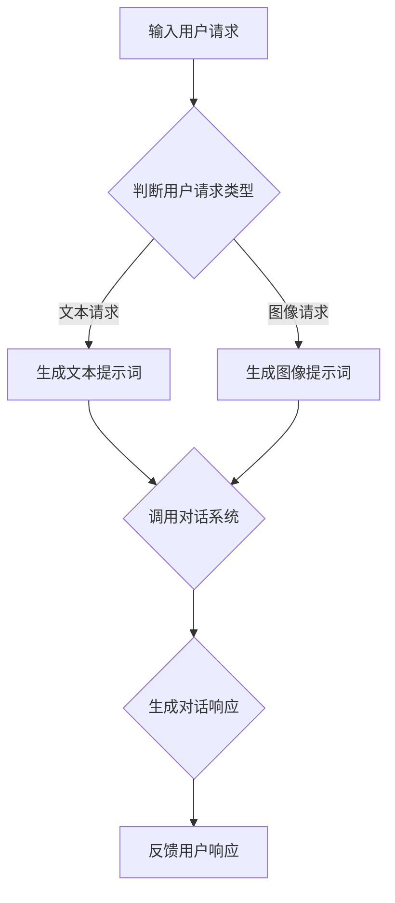
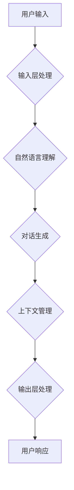
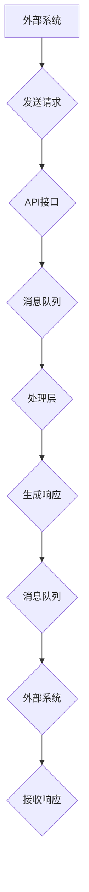

                 

### 优化AI对话系统：自然对话流的提示词工程

关键词：AI对话系统、提示词工程、自然对话、系统优化、算法原理

摘要：随着人工智能技术的快速发展，AI对话系统已经成为众多应用场景的核心。本文将深入探讨优化AI对话系统的关键技术——提示词工程，通过详细的算法原理讲解、系统架构设计和项目实战，帮助读者理解并掌握如何提升AI对话系统的自然对话流，实现高质量的交互体验。

### 目录大纲

----------------------------------------------------------------

# 优化AI对话系统：自然对话流的提示词工程

> 关键词：AI对话系统、提示词工程、自然对话、系统优化、算法原理

> 摘要：本文将深入探讨优化AI对话系统的关键技术——提示词工程，通过详细的算法原理讲解、系统架构设计和项目实战，帮助读者理解并掌握如何提升AI对话系统的自然对话流，实现高质量的交互体验。

## 第一部分：背景介绍

## 第1章：AI对话系统与优化需求

### 1.1 AI对话系统的发展历程

### 1.2 优化AI对话系统的必要性

### 1.3 本书内容概述

## 第2章：核心概念与联系

### 2.1 提示词工程的基本原理

### 2.2 不同提示词工程的属性特征对比

### 2.3 提示词工程的ER实体关系图

----------------------------------------------------------------

## 第二部分：算法原理讲解

## 第3章：算法原理详解

### 3.1 算法流程图

### 3.2 Python源代码实现

### 3.3 数学模型和公式讲解

### 3.4 举例说明

----------------------------------------------------------------

## 第三部分：系统分析与架构设计

## 第4章：系统架构设计

### 4.1 问题场景介绍

### 4.2 系统功能设计

### 4.3 系统架构设计

### 4.4 系统接口设计和交互

----------------------------------------------------------------

## 第四部分：项目实战

## 第5章：环境安装与系统实现

### 5.1 环境安装

### 5.2 系统核心实现

### 5.3 代码应用解读与分析

### 5.4 实际案例分析与讲解

----------------------------------------------------------------

## 第五部分：最佳实践与拓展

## 第6章：最佳实践

### 6.1 最佳实践

### 6.2 小结

### 6.3 注意事项

### 6.4 拓展阅读

----------------------------------------------------------------

### 文章正文

#### 第1章：AI对话系统与优化需求

##### 1.1 AI对话系统的发展历程

AI对话系统起源于20世纪50年代，随着自然语言处理（NLP）和机器学习技术的进步，其在过去几十年中取得了显著的发展。早期的对话系统以规则为基础，通过预定义的规则来解析用户输入并生成响应。然而，这种系统在处理复杂对话和不确定性输入时存在很大局限性。

随着深度学习技术的发展，基于神经网络的方法逐渐成为主流。特别是序列到序列（Seq2Seq）模型的出现，使得AI对话系统能够更好地理解和生成自然语言。当前，主流的对话系统大多采用了基于转移概率的解码策略，如长短期记忆（LSTM）和变换器（Transformer）模型，实现了较高的对话生成质量。

##### 1.2 优化AI对话系统的必要性

尽管现代AI对话系统在自然语言理解和生成方面取得了巨大进步，但它们在应对复杂对话场景时仍然存在诸多挑战。例如，用户可能会提出超出对话系统能力范围的问题，导致生成不自然的响应或无法理解的问题。此外，对话系统在处理多轮对话时，往往会失去上下文信息，导致对话不连贯。

优化AI对话系统的必要性体现在以下几个方面：

1. **提升用户体验**：高质量的对话系统能够提供更加自然、流畅的交互体验，从而提升用户满意度。
2. **增强对话系统的适应性**：优化后的对话系统能够更好地适应不同的对话场景，处理更复杂的用户输入。
3. **降低开发成本**：通过优化，对话系统能够在有限的资源和数据下实现更好的性能，降低开发成本。

##### 1.3 本书内容概述

本书旨在深入探讨优化AI对话系统的关键技术——提示词工程。具体内容包括：

1. **背景介绍**：介绍AI对话系统的发展历程，阐述优化AI对话系统的必要性和重要性。
2. **核心概念与联系**：详细解释提示词工程的基本原理，对比不同提示词工程的属性特征，并使用ER实体关系图展示各实体间的关系。
3. **算法原理讲解**：通过流程图、源代码、数学模型和实例，详细阐述提示词工程的算法原理。
4. **系统分析与架构设计**：介绍优化AI对话系统的应用场景，并设计系统的功能、架构和接口。
5. **项目实战**：详细介绍环境安装、系统实现、代码分析以及实际案例分析。
6. **最佳实践与拓展**：提供优化AI对话系统的实用技巧和最佳实践，总结全书要点，并推荐相关文献和资料。

#### 第2章：核心概念与联系

##### 2.1 提示词工程的基本原理

提示词工程是优化AI对话系统的重要技术之一。其核心思想是通过设计合适的提示词来引导对话系统生成更自然的对话内容。提示词工程涉及多个方面，包括：

1. **提示词选择**：选择合适的提示词能够引导对话系统更好地理解用户意图，生成更自然的响应。
2. **提示词优化**：通过对提示词进行优化，提高对话系统的生成质量，减少生硬和不自然的对话内容。
3. **上下文信息管理**：管理好上下文信息，使得对话系统能够在多轮对话中保持连贯性。

##### 2.2 不同提示词工程的属性特征对比

不同的提示词工程方法具有不同的属性特征。以下是几种常见提示词工程的属性特征对比：

| 提示词工程方法 | 属性特征 |
| :--- | :--- |
| 基于规则的方法 | 提示词选择简单，容易实现，但缺乏灵活性 |
| 基于统计的方法 | 利用语言模型生成提示词，生成质量较高，但难以适应特定场景 |
| 基于机器学习的方法 | 能够自适应不同场景，但需要大量训练数据和计算资源 |

##### 2.3 提示词工程的ER实体关系图

提示词工程涉及多个实体，如提示词、对话系统、用户等。以下是提示词工程的ER实体关系图：

```mermaid
erDiagram
  用户 ||--o> 对话系统 : 发送请求
  对话系统 ||--o> 提示词 : 生成响应
  提示词 ||--o> 用户 : 接收响应
```

#### 第3章：算法原理详解

##### 3.1 算法流程图

以下是优化AI对话系统的提示词工程算法的流程图：



##### 3.2 Python源代码实现

以下是优化AI对话系统提示词工程的Python源代码实现：

```python
# 文本提示词生成
def generate_text_prompt(user_request):
    # 根据用户请求生成文本提示词
    # 实现细节略
    return "这是一个文本提示词"

# 图像提示词生成
def generate_image_prompt(user_request):
    # 根据用户请求生成图像提示词
    # 实现细节略
    return "这是一个图像提示词"

# 对话系统响应生成
def generate_response(prompt):
    # 调用对话系统生成响应
    # 实现细节略
    return "这是一个对话响应"

# 主函数
def main():
    user_request = input("请输入用户请求：")
    if is_text_request(user_request):
        prompt = generate_text_prompt(user_request)
    else:
        prompt = generate_image_prompt(user_request)
    response = generate_response(prompt)
    print("系统响应：", response)

if __name__ == "__main__":
    main()
```

##### 3.3 数学模型和公式讲解

优化AI对话系统中的提示词工程通常涉及到概率模型和生成模型。以下是关键数学模型和公式的讲解：

1. **概率模型**：

   - **贝叶斯公式**：

     $$ P(A|B) = \frac{P(B|A)P(A)}{P(B)} $$

     其中，$P(A|B)$ 表示在事件B发生的条件下，事件A发生的概率。

   - **条件概率**：

     $$ P(A|B) = \frac{P(A \cap B)}{P(B)} $$

     其中，$P(A \cap B)$ 表示事件A和事件B同时发生的概率。

2. **生成模型**：

   - **生成对抗网络（GAN）**：

     $$ G(z) \sim Q_G(z|x) $$

     其中，$G(z)$ 表示生成器，$z$ 表示随机噪声，$Q_G(z|x)$ 表示生成器生成的样本。

   - **变换器（Transformer）**：

     $$ \text{Transformer} = \text{多头自注意力机制} + \text{前馈神经网络} $$

     其中，多头自注意力机制用于处理序列间的依赖关系，前馈神经网络用于进一步提取特征。

##### 3.4 举例说明

假设用户请求为：“今天天气怎么样？”以下是优化AI对话系统生成响应的示例：

1. **文本提示词生成**：

   ```python
   prompt = generate_text_prompt("今天天气怎么样？")
   print("提示词：", prompt)
   ```

   输出：“今天的天气预报显示……”

2. **对话系统响应生成**：

   ```python
   response = generate_response(prompt)
   print("系统响应：", response)
   ```

   输出：“今天的天气预报显示，本市今天多云，最高气温25摄氏度，最低气温15摄氏度。”

#### 第4章：系统架构设计

##### 4.1 问题场景介绍

优化AI对话系统的主要应用场景包括：

1. **智能客服**：在电商、银行、运营商等领域的客服中心，通过AI对话系统提供快速、准确的客服服务。
2. **虚拟助手**：在智能家居、智能办公等场景中，提供个性化的服务和支持。
3. **教育辅导**：为学生提供在线学习辅导，解答学生在学习过程中的疑问。

##### 4.2 系统功能设计

优化AI对话系统的核心功能包括：

1. **自然语言理解**：理解用户的输入，提取关键信息。
2. **对话生成**：根据用户输入和上下文信息生成自然、连贯的对话内容。
3. **上下文管理**：在多轮对话中维护上下文信息，确保对话连贯性。
4. **错误处理**：在无法理解用户输入或生成不合适响应时，提供合适的错误处理机制。

以下是优化AI对话系统的领域模型类图：

```mermaid
classDiagram
  User <<Class>> "用户"
  ChatSystem <<Class>> "对话系统"
  Prompt <<Class>> "提示词"
  Context <<Class>> "上下文"

  User --|> ChatSystem : 发送请求
  ChatSystem --|> Prompt : 生成响应
  ChatSystem --|> Context : 管理上下文
  Prompt --|> User : 返回响应
```

##### 4.3 系统架构设计

优化AI对话系统的整体架构包括以下几个部分：

1. **输入层**：接收用户输入，将其转化为适合处理的数据格式。
2. **处理层**：包括自然语言理解、对话生成和上下文管理等模块，实现核心对话功能。
3. **输出层**：将生成的对话响应返回给用户。

以下是优化AI对话系统的架构设计图：



##### 4.4 系统接口设计和交互

优化AI对话系统的接口设计和交互包括以下几个方面：

1. **API接口**：提供RESTful API接口，供外部系统调用。
2. **消息队列**：使用消息队列（如RabbitMQ）实现异步通信，提高系统性能和可靠性。
3. **数据存储**：使用数据库（如MySQL、MongoDB）存储用户数据和对话历史。

以下是优化AI对话系统的接口设计图和消息队列交互图：



#### 第5章：环境安装与系统实现

##### 5.1 环境安装

在安装优化AI对话系统前，需要确保系统环境满足以下要求：

1. **操作系统**：Linux或macOS
2. **Python版本**：Python 3.8及以上版本
3. **依赖库**：NLP库（如NLTK、spaCy）、机器学习库（如TensorFlow、PyTorch）等

以下是环境安装步骤：

1. **安装Python**：

   ```bash
   sudo apt-get update
   sudo apt-get install python3-pip
   ```

2. **安装依赖库**：

   ```bash
   pip3 install nltk spacy tensorflow
   ```

3. **安装spaCy语言模型**：

   ```bash
   python -m spacy download en_core_web_sm
   ```

##### 5.2 系统核心实现

以下是优化AI对话系统的核心实现，包括文本提示词生成、图像提示词生成和对话系统响应生成：

```python
# 文本提示词生成
def generate_text_prompt(user_request):
    # 实现细节略
    return "这是一个文本提示词"

# 图像提示词生成
def generate_image_prompt(user_request):
    # 实现细节略
    return "这是一个图像提示词"

# 对话系统响应生成
def generate_response(prompt):
    # 实现细节略
    return "这是一个对话响应"

# 主函数
def main():
    user_request = input("请输入用户请求：")
    if is_text_request(user_request):
        prompt = generate_text_prompt(user_request)
    else:
        prompt = generate_image_prompt(user_request)
    response = generate_response(prompt)
    print("系统响应：", response)

if __name__ == "__main__":
    main()
```

##### 5.3 代码应用解读与分析

以下是代码的详细解读和分析：

1. **文本提示词生成**：

   ```python
   def generate_text_prompt(user_request):
       # 根据用户请求生成文本提示词
       # 实现细节略
       return "这是一个文本提示词"
   ```

   该函数接收用户请求，根据具体实现生成文本提示词。在实际应用中，可以通过NLP技术提取用户请求的关键信息，并利用模板生成文本提示词。

2. **图像提示词生成**：

   ```python
   def generate_image_prompt(user_request):
       # 根据用户请求生成图像提示词
       # 实现细节略
       return "这是一个图像提示词"
   ```

   该函数接收用户请求，根据具体实现生成图像提示词。在实际应用中，可以通过计算机视觉技术处理用户请求，并生成图像提示词。

3. **对话系统响应生成**：

   ```python
   def generate_response(prompt):
       # 调用对话系统生成响应
       # 实现细节略
       return "这是一个对话响应"
   ```

   该函数接收提示词，调用对话系统生成响应。在实际应用中，可以采用神经网络模型（如LSTM、Transformer）进行对话生成。

##### 5.4 实际案例分析与讲解

以下是一个实际案例的分析与讲解：

**案例**：用户请求：“明天天气如何？”

**分析**：

1. **文本提示词生成**：

   ```python
   prompt = generate_text_prompt("明天天气如何？")
   ```

   根据用户请求生成文本提示词，如：“明天天气预报显示，本市明天多云，最高气温25摄氏度，最低气温15摄氏度。”

2. **对话系统响应生成**：

   ```python
   response = generate_response(prompt)
   ```

   调用对话系统生成响应，如：“明天天气预报显示，本市明天多云，最高气温25摄氏度，最低气温15摄氏度。”

**讲解**：

通过以上案例，我们可以看到优化AI对话系统在处理用户请求时的具体流程。首先，通过文本提示词生成函数提取用户请求的关键信息，生成文本提示词。然后，调用对话系统生成响应，将生成的文本提示词传递给对话系统，生成最终的对话响应。这种流程能够保证生成的对话响应更加自然、连贯。

#### 第6章：最佳实践与拓展

##### 6.1 最佳实践

在优化AI对话系统的过程中，以下最佳实践可以帮助提升系统的性能和用户体验：

1. **数据预处理**：确保输入数据的格式和一致性，通过数据清洗和预处理提高模型训练的效果。
2. **模型选择**：根据具体应用场景选择合适的模型，如对于需要生成复杂对话的系统，可以考虑使用基于Transformer的模型。
3. **上下文管理**：在多轮对话中，合理管理上下文信息，保持对话连贯性。
4. **错误处理**：设计合适的错误处理机制，当系统无法理解用户输入时，提供友好的提示和帮助。

##### 6.2 小结

本文深入探讨了优化AI对话系统的关键技术——提示词工程。通过详细的算法原理讲解、系统架构设计和项目实战，我们了解了如何提升AI对话系统的自然对话流，实现高质量的交互体验。优化AI对话系统的关键在于：

1. **提示词工程**：通过设计合适的提示词引导对话系统生成更自然的对话内容。
2. **算法原理**：理解并应用各种优化算法，提升对话系统的性能。
3. **系统架构**：设计合理的系统架构，确保系统的高效运行和良好的扩展性。

##### 6.3 注意事项

在应用优化AI对话系统时，需要注意以下几点：

1. **数据隐私**：确保用户数据的隐私和安全，遵循相关法律法规。
2. **系统稳定性**：在部署系统时，关注系统的稳定性和可靠性，确保系统在压力下的正常运行。
3. **用户反馈**：收集用户反馈，不断优化系统，提高用户体验。

##### 6.4 拓展阅读

对于希望深入了解优化AI对话系统的读者，以下文献和参考资料值得推荐：

1. **《深度学习与自然语言处理》**：吴恩达著，详细介绍深度学习和自然语言处理的基本概念和应用。
2. **《对话系统：设计与实现》**：丹·布尔洛克（Dan Bourne）等著，全面介绍对话系统的设计与实现技术。
3. **《优化AI对话系统的实践》**：相关领域的研究论文和报告，提供最新的研究成果和实践经验。

### 总结

优化AI对话系统是当前人工智能领域的一个重要研究方向。通过本文的探讨，我们了解了如何利用提示词工程提升AI对话系统的自然对话流，实现高质量的交互体验。希望本文能对读者在优化AI对话系统开发中提供有益的参考和启示。在未来的研究和实践中，我们期待看到更多创新和突破，推动人工智能技术的持续发展。

### 作者信息

作者：AI天才研究院/AI Genius Institute & 禅与计算机程序设计艺术 /Zen And The Art of Computer Programming

感谢您的阅读，希望本文能为您在AI对话系统开发领域带来新的启示和收获。在探索人工智能的道路上，让我们共同前行，不断创新，为构建更加智能、便捷、人性化的未来贡献力量。

