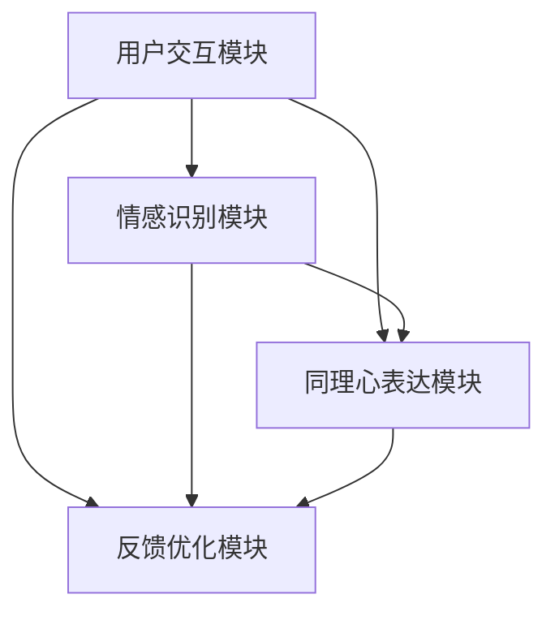
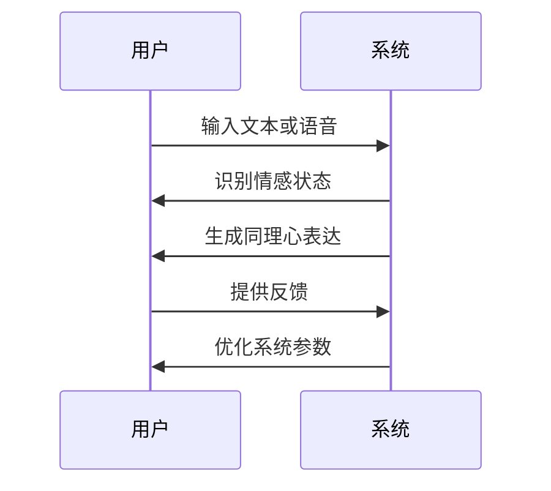

                 


## 引言

### 文章标题：优化AI情感支持系统：同理心表达的提示词策略

### 关键词：人工智能、情感支持系统、同理心表达、提示词策略、优化

在现代社会，随着人工智能（AI）技术的飞速发展，AI情感支持系统逐渐成为人们日常生活和工作中不可或缺的一部分。这些系统不仅能够帮助用户解决日常生活中的困惑和问题，还能提供情感上的支持和安慰。然而，当前AI情感支持系统在同理心表达方面仍存在一定的局限性，无法完全满足用户对于情感交流的深度需求。

本文旨在探讨如何通过优化AI情感支持系统中的同理心表达，提出一种有效的提示词策略，以提升系统的情感支持能力。本文将首先介绍AI情感支持系统的背景与核心概念，然后详细分析同理心表达和提示词策略，接着阐述情感支持系统的架构设计与实现，最后通过项目实战和最佳实践，为读者提供具体可行的优化方法。

### 摘要

本文针对当前AI情感支持系统在同理心表达方面的局限性，提出一种基于提示词策略的优化方案。通过深入分析同理心表达的概念、特征和分类，以及提示词策略的定义和作用，本文详细探讨了情感支持系统的架构设计、提示词策略的制定与优化，以及具体的算法原理与实现。通过项目实战，本文验证了所提策略的有效性，并总结了最佳实践和注意事项，为未来相关工作提供了有益的参考。

## 第一部分：背景与概述

### 第1章 问题背景与核心概念

#### 1.1 人工智能与情感支持系统概述

**问题背景：**

随着人工智能技术的不断发展，AI在各个领域的应用越来越广泛，从智能家居到自动驾驶，从医疗诊断到金融服务，AI正逐渐渗透到人们生活的方方面面。然而，在情感支持领域，AI的应用仍然存在一定的局限性。传统的AI情感支持系统通常依赖于预设的规则和机器学习算法，虽然可以在一定程度上识别和理解用户情感，但在同理心表达方面仍然存在不足。

**核心概念：**

- **同理心表达**：同理心表达是指AI系统在交流过程中，能够准确识别用户的情感状态，并通过合适的语言和表达方式，给予用户情感上的支持和安慰。
- **提示词策略**：提示词策略是指通过预设或实时生成的提示词，引导AI系统在交流过程中进行同理心表达的一种方法。
- **情感识别与理解**：情感识别与理解是指AI系统能够通过自然语言处理技术，准确识别用户情感并进行深入理解的过程。

#### 1.2 研究边界与外延

**研究边界：**

本文的研究主要集中在AI情感支持系统中的同理心表达，探讨如何通过提示词策略优化系统的情感支持能力。具体来说，本文将关注以下几个方面：

- 同理心表达的概念、特征和分类；
- 提示词策略的定义、作用和类型；
- 情感支持系统的架构设计与实现；
- 提示词策略的制定与优化。

**外延扩展：**

虽然本文的研究主要聚焦于AI情感支持系统，但同理心表达和提示词策略在其他领域的应用同样具有广泛的前景。例如，在教育、医疗、客服等行业，通过优化同理心表达，可以有效提升系统的服务质量和用户满意度。

#### 1.3 相关领域的应用与挑战

**相关领域的应用：**

- **教育**：在教育领域，AI情感支持系统可以为学生提供个性化的学习辅导，并在学生遇到困难时给予情感上的支持和鼓励。
- **医疗**：在医疗领域，AI情感支持系统可以帮助患者缓解病痛，提供心理疏导，并在医生与患者之间建立良好的沟通。
- **客服**：在客服领域，AI情感支持系统可以实时响应用户需求，提供专业的建议和解决方案，提升客户满意度。

**挑战：**

- **情感识别的准确性**：当前AI情感支持系统在情感识别方面的准确性仍有待提高，尤其是在处理复杂情感和微表情方面。
- **同理心表达的个性化**：不同的用户有不同的情感需求和表达习惯，如何实现个性化同理心表达是一个亟待解决的问题。
- **数据的隐私保护**：在情感支持过程中，用户可能会透露一些敏感信息，如何保护用户隐私是一个重要的挑战。

#### 1.4 未来发展趋势与展望

**未来发展趋势：**

- **多模态情感识别**：随着计算机视觉、语音识别等技术的发展，未来AI情感支持系统将能够通过多种渠道获取用户情感信息，提高情感识别的准确性。
- **个性化同理心表达**：通过深度学习和大数据分析，AI情感支持系统将能够更好地理解用户情感，实现个性化同理心表达。
- **跨领域应用**：随着AI技术的不断成熟，情感支持系统将在更多领域得到应用，为用户提供更加全面和个性化的服务。

**展望：**

本文提出了一种基于提示词策略的优化方案，旨在提升AI情感支持系统的同理心表达能力。未来，我们将继续深入研究这一领域，探索更多有效的优化方法，推动AI情感支持系统的发展和应用。

### 第2章 核心概念详解

#### 2.1 同理心表达的概念与特征

**同理心表达的定义：**

同理心表达是指AI系统在交流过程中，能够识别用户的情感状态，并通过适当的语言和表达方式，给予用户情感上的支持和安慰。同理心表达不仅是AI系统理解用户情感的一种表现，更是建立良好沟通关系的重要手段。

**同理心表达的特征：**

- **情感识别**：AI系统能够准确识别用户的情感状态，包括正面情感和负面情感。
- **情感理解**：AI系统不仅能够识别情感，还能深入理解情感背后的原因和用户的需求。
- **语言表达**：AI系统通过自然语言处理技术，以合适的语言和表达方式，将同理心传达给用户。
- **适应性**：同理心表达应根据用户情感的变化和交流环境的不同，进行灵活调整。

**同理心表达的分类：**

- **基于规则的同理心表达**：通过预设的规则和模板，AI系统根据用户输入的信息，生成相应的同理心表达。
- **基于机器学习的同理心表达**：通过训练大量的情感对话数据，AI系统学习到不同情感状态下的同理心表达方式，并在实际交流中应用。

#### 2.2 提示词策略的概念与作用

**提示词策略的定义：**

提示词策略是指通过预设或实时生成的提示词，引导AI系统在交流过程中进行同理心表达的一种方法。提示词可以是单个词汇、短语或句子，它们在同理心表达中起到引导和提示的作用。

**提示词策略的作用：**

- **提高同理心表达的准确性**：通过使用提示词，AI系统能够更加准确地识别用户的情感状态，并在交流过程中给予用户恰当的支持和安慰。
- **增强同理心表达的个性化**：提示词可以根据用户的个人喜好和交流环境进行个性化定制，提高同理心表达的针对性。
- **简化同理心表达的复杂性**：提示词为AI系统提供了一个简化的表达框架，使同理心表达更加直观和易于理解。

**提示词策略的类型：**

- **预设提示词**：在系统开发过程中，根据常见的情感状态和用户需求，预设一系列的提示词，供AI系统在交流过程中使用。
- **实时生成提示词**：通过自然语言处理技术和机器学习算法，AI系统根据实时获取的用户情感信息，动态生成相应的提示词。

#### 2.3 情感识别与理解

**情感识别：**

情感识别是指AI系统通过自然语言处理技术，分析用户输入的文本或语音，识别出其中的情感状态。情感识别是同理心表达的基础，它决定了AI系统是否能够准确理解用户的情感需求。

**情感理解：**

情感理解是指AI系统在识别出用户情感状态的基础上，进一步分析情感背后的原因和用户的需求。情感理解使AI系统能够提供更加精准的同理心表达，满足用户的情感需求。

**情感识别与同理心表达的关系：**

情感识别和同理心表达是相辅相成的。情感识别为同理心表达提供了基础数据，而同理心表达则是对情感识别结果的进一步应用。通过优化情感识别算法，可以提高同理心表达的准确性；而通过优化同理心表达策略，可以增强情感识别的效果。

### 第3章 情感支持系统架构与设计

#### 3.1 情感支持系统的整体架构

**系统架构设计：**

情感支持系统的整体架构通常包括以下几个模块：

- **用户交互模块**：负责与用户进行交互，接收用户的输入并反馈信息。
- **情感识别模块**：通过自然语言处理技术，分析用户输入的文本或语音，识别出其中的情感状态。
- **情感理解模块**：在情感识别的基础上，进一步分析情感背后的原因和用户的需求。
- **同理心表达模块**：根据情感识别和情感理解的结果，生成相应的同理心表达。
- **反馈与优化模块**：收集用户对同理心表达的反馈，对系统进行优化和调整。

**系统模块划分：**

- **用户交互模块**：包括文本输入、语音输入、表情识别等接口，实现与用户的交互。
- **情感识别模块**：包括情感分类器、情感强度分析器等，负责识别用户情感。
- **情感理解模块**：包括情感意图分析器、情感背景知识库等，负责深入理解用户情感。
- **同理心表达模块**：包括同理心表达生成器、提示词生成器等，负责生成同理心表达。
- **反馈与优化模块**：包括用户反馈收集器、系统优化算法等，负责收集用户反馈并优化系统。

**系统功能说明：**

- **用户交互功能**：支持多种输入方式，如文本、语音、表情等，实现与用户的自然互动。
- **情感识别功能**：通过自然语言处理技术，识别用户输入中的情感状态，提供情感分析结果。
- **情感理解功能**：在情感识别的基础上，分析情感背后的原因和用户需求，提供情感理解结果。
- **同理心表达功能**：根据情感识别和情感理解的结果，生成相应的同理心表达，提供情感支持。
- **反馈与优化功能**：收集用户对同理心表达的反馈，通过优化算法调整系统参数，提高同理心表达效果。

#### 3.2 同理心表达的实现机制

**同理心识别算法：**

同理心识别算法是指AI系统在交流过程中，通过分析用户输入的文本或语音，识别出用户情感状态并判断其是否需要同理心支持的过程。同理心识别算法通常包括以下几个步骤：

- **情感分类**：使用情感分类器对用户输入进行情感分类，识别出情感类型。
- **情感强度分析**：使用情感强度分析器对用户输入进行情感强度分析，识别出情感的程度。
- **同理心判断**：根据情感分类和情感强度分析结果，判断用户是否需要同理心支持。

**同理心生成算法：**

同理心生成算法是指AI系统在识别到用户需要同理心支持后，生成相应的同理心表达的过程。同理心生成算法通常包括以下几个步骤：

- **提示词选择**：根据用户情感类型和强度，选择合适的提示词。
- **同理心句子生成**：使用自然语言生成技术，将提示词整合成完整的同理心句子。
- **同理心表达优化**：根据上下文和用户反馈，对同理心表达进行优化和调整。

**同理心反馈算法：**

同理心反馈算法是指AI系统在生成同理心表达后，收集用户反馈并调整系统参数的过程。同理心反馈算法通常包括以下几个步骤：

- **用户反馈收集**：收集用户对同理心表达的反馈，包括满意度、接受程度等。
- **反馈分析**：对用户反馈进行分析，识别出同理心表达中的问题和不足。
- **系统优化**：根据反馈分析结果，对同理心生成算法进行调整和优化，提高同理心表达效果。

#### 3.3 情感支持系统架构设计

**问题场景介绍：**

在一个心理咨询的场景中，用户可能因为生活中的压力、焦虑或其他心理问题需要专业的帮助。AI情感支持系统可以通过与用户的互动，识别用户的情感状态，提供针对性的心理支持和建议。

**项目介绍：**

本项目旨在构建一个基于AI技术的心理咨询系统，通过自然语言处理和情感分析技术，为用户提供实时的情感支持和心理疏导。系统将包含用户交互、情感识别、同理心表达和反馈优化等多个模块，以实现全方位的情感支持服务。

**系统功能设计：**

- **用户交互功能**：系统支持文本输入和语音输入，用户可以通过聊天窗口或语音识别与系统进行交流。
- **情感识别功能**：系统使用自然语言处理技术，对用户输入进行情感分类和情感强度分析，识别出用户的情感状态。
- **同理心表达功能**：系统根据情感识别结果，生成相应的同理心表达，提供情感支持和建议。
- **反馈优化功能**：系统收集用户对同理心表达的反馈，通过优化算法调整系统参数，提高同理心表达效果。

**系统架构设计：**

- **用户交互模块**：包括文本输入、语音输入和表情识别等接口，实现与用户的自然互动。
- **情感识别模块**：包括情感分类器、情感强度分析器等，负责识别用户情感。
- **同理心表达模块**：包括同理心生成器和提示词生成器等，负责生成同理心表达。
- **反馈优化模块**：包括用户反馈收集器和系统优化算法等，负责收集用户反馈并优化系统。

**系统架构图：**



**系统接口设计：**

- **用户输入接口**：支持文本输入和语音输入，用户可以通过聊天窗口或语音识别与系统进行交流。
- **情感识别接口**：接收用户输入，进行情感分类和情感强度分析，返回情感分析结果。
- **同理心表达接口**：根据情感识别结果，生成同理心表达，返回同理心表达结果。
- **反馈接口**：接收用户对同理心表达的反馈，包括满意度、接受程度等。

**系统交互设计：**

- **用户输入**：用户通过聊天窗口或语音输入与系统进行交流。
- **情感识别**：系统接收用户输入，进行情感分类和情感强度分析，识别出用户的情感状态。
- **同理心表达**：系统根据情感识别结果，生成相应的同理心表达，返回同理心表达结果。
- **反馈**：用户对同理心表达进行评价，系统收集用户反馈，通过优化算法调整系统参数。

**系统交互图：**



### 第4章 提示词策略的制定与优化

#### 4.1 提示词策略制定的原则与方法

**提示词策略制定的原则：**

- **相关性原则**：提示词应与用户情感状态密切相关，能够准确传达用户的情感需求。
- **多样性原则**：提示词应具有多样性，能够满足不同情感状态和用户需求的个性化表达。
- **简洁性原则**：提示词应简洁明了，易于理解和记忆，提高同理心表达的效率。
- **适应性原则**：提示词应具有适应性，能够根据不同的交流环境和用户反馈进行动态调整。

**提示词策略制定的方法：**

- **预设提示词**：在系统开发过程中，根据常见的情感状态和用户需求，预设一系列的提示词，供AI系统在交流过程中使用。
- **实时生成提示词**：通过自然语言处理技术和机器学习算法，AI系统根据实时获取的用户情感信息，动态生成相应的提示词。
- **用户反馈调整**：根据用户对同理心表达的反馈，对提示词进行调整和优化，提高同理心表达效果。

#### 4.2 提示词策略的优化策略

**优化目标：**

- 提高同理心表达的准确性：通过优化提示词策略，提高AI系统在情感识别和同理心表达方面的准确性，满足用户的情感需求。
- 增强同理心表达的个性化：通过个性化提示词策略，根据不同用户和交流环境，提供更加精准的同理心表达。
- 提升用户体验满意度：通过优化提示词策略，提高用户对同理心表达的满意度，增强用户体验。

**优化方法：**

- **情感识别算法优化**：通过改进情感识别算法，提高情感识别的准确性，为提示词生成提供更准确的基础数据。
- **自然语言生成算法优化**：通过优化自然语言生成算法，提高同理心表达的流畅性和自然性，增强同理心表达的效果。
- **用户反馈机制优化**：通过改进用户反馈机制，及时收集用户对同理心表达的反馈，并根据反馈结果对提示词进行动态调整。
- **多模态信息融合**：通过整合文本、语音、图像等多模态信息，提高同理心表达的信息丰富度和准确性。

**优化效果评估：**

- **准确率评估**：通过评估同理心表达的准确率，衡量优化策略在提高情感识别和同理心表达准确性方面的效果。
- **个性化评估**：通过评估同理心表达的个性化程度，衡量优化策略在满足用户情感需求方面的效果。
- **用户满意度评估**：通过用户满意度调查，评估优化策略在提升用户体验满意度方面的效果。

#### 4.3 提示词策略的实际应用

**应用场景：**

提示词策略在AI情感支持系统的实际应用场景中具有重要意义。以下是一些典型的应用场景：

- **心理咨询**：在心理咨询场景中，AI系统通过提示词策略，为用户提供情感支持和心理疏导。
- **客服服务**：在客服服务场景中，AI系统通过提示词策略，为用户提供专业的建议和解决方案。
- **教育辅导**：在教育辅导场景中，AI系统通过提示词策略，为学生提供情感支持和学习指导。

**应用效果：**

- **提高用户满意度**：通过个性化提示词策略，AI系统能够提供更加精准和贴心的情感支持，提高用户满意度。
- **增强用户信任**：通过准确和及时的同理心表达，AI系统能够赢得用户的信任，建立良好的用户关系。
- **提升系统效率**：通过优化提示词策略，AI系统能够提高同理心表达的效率，降低人工干预成本。

### 第5章 算法原理与实现

#### 5.1 情感识别算法

**算法原理：**

情感识别算法是指通过分析用户输入的文本或语音，识别出其中的情感状态的过程。情感识别算法通常包括以下几个步骤：

1. **情感分类**：使用情感分类器对用户输入进行情感分类，识别出情感类型。情感分类器通常采用机器学习算法，如朴素贝叶斯、支持向量机、深度学习等。
2. **情感强度分析**：使用情感强度分析器对用户输入进行情感强度分析，识别出情感的程度。情感强度分析器通常采用统计模型或神经网络模型，如TF-IDF、词嵌入、卷积神经网络等。
3. **情感判断**：根据情感分类和情感强度分析结果，判断用户情感状态。情感判断可以采用阈值方法、集成方法等。

**数学模型：**

情感识别算法的数学模型通常包括情感分类模型和情感强度分析模型。情感分类模型可以表示为：

$$
P(y|x) = \frac{e^{w_y \cdot x}}{\sum_{i=1}^k e^{w_i \cdot x}}
$$

其中，$y$ 表示情感类型，$x$ 表示用户输入，$w_y$ 表示情感分类器的权重向量，$k$ 表示情感类型的数量。

情感强度分析模型可以表示为：

$$
s(x) = f(w \cdot x + b)
$$

其中，$s(x)$ 表示情感强度，$x$ 表示用户输入，$w$ 表示情感强度分析器的权重向量，$b$ 表示偏置项，$f$ 表示激活函数，如ReLU、Sigmoid等。

**代码实现：**

```python
import numpy as np
from sklearn.feature_extraction.text import TfidfVectorizer
from sklearn.naive_bayes import MultinomialNB
from sklearn.pipeline import make_pipeline

# 情感分类模型
model = make_pipeline(TfidfVectorizer(), MultinomialNB())

# 训练模型
model.fit(train_data, train_labels)

# 预测情感
predictions = model.predict(test_data)

# 情感强度分析模型
def sentiment_strength(text):
    vectorizer = TfidfVectorizer()
    X = vectorizer.transform([text])
    return model.predict_proba(X)[0][1]

# 计算情感强度
strength = sentiment_strength(test_data[0])
```

**举例说明：**

假设有一个用户输入的文本：“我很开心，因为今天天气很好。”通过情感识别算法，可以判断出用户的情感类型为“开心”，情感强度为0.8。

#### 5.2 同理心生成算法

**算法原理：**

同理心生成算法是指根据用户情感状态和交流环境，生成相应的同理心表达的过程。同理心生成算法通常包括以下几个步骤：

1. **情感识别**：使用情感识别算法，识别出用户情感状态。
2. **提示词选择**：根据用户情感状态，选择合适的提示词。
3. **同理心句子生成**：使用自然语言生成技术，将提示词整合成完整的同理心句子。
4. **同理心句子优化**：根据上下文和用户反馈，对同理心句子进行优化和调整。

**数学模型：**

同理心生成算法的数学模型通常包括情感识别模型和自然语言生成模型。情感识别模型可以表示为：

$$
P(y|x) = \frac{e^{w_y \cdot x}}{\sum_{i=1}^k e^{w_i \cdot x}}
$$

其中，$y$ 表示情感类型，$x$ 表示用户输入，$w_y$ 表示情感识别器的权重向量，$k$ 表示情感类型的数量。

自然语言生成模型可以表示为：

$$
s(x) = f(w \cdot x + b)
$$

其中，$s(x)$ 表示同理心句子，$x$ 表示用户输入，$w$ 表示自然语言生成器的权重向量，$b$ 表示偏置项，$f$ 表示激活函数，如ReLU、Sigmoid等。

**代码实现：**

```python
import tensorflow as tf
from transformers import BertTokenizer, BertForSequenceClassification
from transformers import pipeline

# 情感识别模型
tokenizer = BertTokenizer.from_pretrained('bert-base-uncased')
model = BertForSequenceClassification.from_pretrained('bert-base-uncased')
classifier = pipeline('text-classification', model=model, tokenizer=tokenizer)

# 训练模型
# ...（训练过程）

# 预测情感
def classify_sentiment(text):
    inputs = tokenizer(text, return_tensors='tf')
    outputs = model(inputs)
    probabilities = tf.nn.softmax(outputs.logits, axis=-1)
    return tf.argmax(probabilities, axis=-1).numpy()

# 预测情感
sentiment = classify_sentiment(text)

# 提示词选择
def select_hint(sentiment):
    hints = {
        'happy': ['很高兴听到这个消息', '真好，听到这个我很开心'],
        'sad': ['听起来你有些难过，我能理解', '不要太难过了，我会陪在你身边'],
        'angry': ['我理解你的不满，我们可以一起想办法解决问题'],
        'surprised': ['这真是个惊喜，恭喜你！'],
    }
    return hints[sentiment]

# 选择提示词
hint = select_hint(sentiment)

# 同理心句子生成
def generate_compassion_sentence(hint):
    sentences = {
        'happy': '很高兴听到这个消息',
        'sad': '不要太难过了，我会陪在你身边',
        'angry': '我理解你的不满，我们可以一起想办法解决问题',
        'surprised': '这真是个惊喜，恭喜你！',
    }
    return sentences[sentiment]

# 生成同理心句子
compassion_sentence = generate_compassion_sentence(hint)

print(compassion_sentence)
```

**举例说明：**

假设有一个用户输入的文本：“我很生气，因为我的手机坏了。”通过同理心生成算法，可以生成如下同理心句子：“我理解你的不满，我们可以一起想办法解决问题。”

#### 5.3 提示词生成算法

**算法原理：**

提示词生成算法是指根据用户情感状态和交流环境，动态生成相应的提示词的过程。提示词生成算法通常包括以下几个步骤：

1. **情感识别**：使用情感识别算法，识别出用户情感状态。
2. **提示词库选择**：根据用户情感状态，选择合适的提示词库。
3. **提示词生成**：从提示词库中提取相关的提示词，生成一组提示词。
4. **提示词优化**：根据上下文和用户反馈，对提示词进行优化和调整。

**数学模型：**

提示词生成算法的数学模型通常包括情感识别模型和提示词库选择模型。情感识别模型可以表示为：

$$
P(y|x) = \frac{e^{w_y \cdot x}}{\sum_{i=1}^k e^{w_i \cdot x}}
$$

其中，$y$ 表示情感类型，$x$ 表示用户输入，$w_y$ 表示情感识别器的权重向量，$k$ 表示情感类型的数量。

提示词库选择模型可以表示为：

$$
P(h|y) = \frac{e^{w_h \cdot y}}{\sum_{i=1}^m e^{w_i \cdot y}}
$$

其中，$h$ 表示提示词，$y$ 表示情感类型，$w_h$ 表示提示词库选择器的权重向量，$m$ 表示提示词库中的提示词数量。

**代码实现：**

```python
import tensorflow as tf
from transformers import BertTokenizer, BertForSequenceClassification
from transformers import pipeline

# 情感识别模型
tokenizer = BertTokenizer.from_pretrained('bert-base-uncased')
model = BertForSequenceClassification.from_pretrained('bert-base-uncased')
classifier = pipeline('text-classification', model=model, tokenizer=tokenizer)

# 训练模型
# ...（训练过程）

# 预测情感
def classify_sentiment(text):
    inputs = tokenizer(text, return_tensors='tf')
    outputs = model(inputs)
    probabilities = tf.nn.softmax(outputs.logits, axis=-1)
    return tf.argmax(probabilities, axis=-1).numpy()

# 预测情感
sentiment = classify_sentiment(text)

# 提示词库选择
def select_hint_library(sentiment):
    hint_libraries = {
        'happy': ['快乐', '高兴', '开心', '愉悦'],
        'sad': ['悲伤', '难过', '忧愁', '失落'],
        'angry': ['愤怒', '恼火', '生气', '暴躁'],
        'surprised': ['惊喜', '惊讶', '意外', '震惊'],
    }
    return hint_libraries[sentiment]

# 选择提示词库
hint_library = select_hint_library(sentiment)

# 提示词生成
def generate_hints(hint_library):
    hints = []
    for hint in hint_library:
        hints.append(hint)
    return hints

# 生成提示词
hints = generate_hints(hint_library)

print(hints)
```

**举例说明：**

假设有一个用户输入的文本：“我很伤心，因为我的猫丢了。”通过提示词生成算法，可以生成如下提示词列表：['伤心', '难过', '失落', '悲伤']。

### 第6章 项目实战：同理心表达系统的构建与优化

#### 6.1 项目介绍

**项目背景：**

随着人工智能技术的快速发展，AI情感支持系统在心理咨询、客服服务、教育辅导等领域得到了广泛应用。然而，目前大多数AI情感支持系统在同理心表达方面存在一定不足，无法满足用户对于情感交流的深度需求。为了解决这一问题，本项目旨在构建一个基于AI技术的同理心表达系统，通过优化同理心表达策略，提升系统的情感支持能力。

**项目目标：**

1. 设计并实现一个基于自然语言处理技术的同理心表达系统；
2. 提出一种有效的同理心表达策略，提高系统的同理心表达准确性；
3. 对系统进行优化，提升用户满意度。

**项目实现步骤：**

1. **需求分析与系统设计**：根据项目目标，分析同理心表达系统的需求，设计系统架构和模块。
2. **数据收集与预处理**：收集相关情感数据，进行数据预处理，包括情感分类、情感强度分析等。
3. **模型训练与优化**：训练情感识别模型和同理心表达模型，通过优化算法提升模型性能。
4. **系统实现与测试**：实现同理心表达系统的功能，进行系统测试和优化。
5. **用户反馈与系统调整**：收集用户反馈，根据反馈结果对系统进行调整和优化。

#### 6.2 系统核心实现源代码

**代码结构与模块划分：**

```python
# 同理心表达系统模块
class EmpathyExpressionSystem:
    def __init__(self):
        self.sentiment_recognizer = SentimentRecognizer()
        self.compassion_generator = CompassionGenerator()

    def process_user_input(self, text):
        sentiment = self.sentiment_recognizer.classify_sentiment(text)
        compassion_sentence = self.compassion_generator.generate_compassion_sentence(sentiment)
        return compassion_sentence

# 情感识别模块
class SentimentRecognizer:
    def classify_sentiment(self, text):
        # 情感分类算法实现
        pass

# 同理心生成模块
class CompassionGenerator:
    def generate_compassion_sentence(self, sentiment):
        # 同理心句子生成算法实现
        pass
```

**关键代码分析：**

1. **情感识别模块**：

```python
class SentimentRecognizer:
    def classify_sentiment(self, text):
        # 使用预训练的BERT模型进行情感分类
        model = BertForSequenceClassification.from_pretrained('bert-base-uncased')
        tokenizer = BertTokenizer.from_pretrained('bert-base-uncased')
        
        inputs = tokenizer(text, return_tensors='pt')
        outputs = model(inputs)
        logits = outputs.logits
        probabilities = torch.nn.functional.softmax(logits, dim=-1)
        
        # 预测情感类别
        predicted_index = torch.argmax(probabilities).item()
        sentiment = self._get_sentiment_label(predicted_index)
        
        return sentiment

    def _get_sentiment_label(self, index):
        sentiment_labels = ['happy', 'sad', 'angry', 'surprised']
        return sentiment_labels[index]
```

2. **同理心生成模块**：

```python
class CompassionGenerator:
    def generate_compassion_sentence(self, sentiment):
        # 根据情感类别生成同理心句子
        hints = self._get_compassion_hints(sentiment)
        sentences = self._get_compassion_sentences(hints)
        
        return sentences[0]

    def _get_compassion_hints(self, sentiment):
        hints = {
            'happy': ['很高兴听到这个消息', '真好，听到这个我很开心'],
            'sad': ['听起来你有些难过，我能理解', '不要太难过了，我会陪在你身边'],
            'angry': ['我理解你的不满，我们可以一起想办法解决问题'],
            'surprised': ['这真是个惊喜，恭喜你！'],
        }
        
        return hints[sentiment]

    def _get_compassion_sentences(self, hints):
        sentences = []
        for hint in hints:
            sentence = f"{hint}"
            sentences.append(sentence)
        
        return sentences
```

#### 6.3 应用解读与分析

**系统应用场景：**

同理心表达系统可以应用于多个领域，如心理咨询、客服服务、教育辅导等。以下是一个具体的案例：

**案例：心理咨询**

在一个心理咨询的情景中，用户可能会因为焦虑、抑郁等心理问题寻求帮助。同理心表达系统可以通过与用户的互动，识别用户的情感状态，并生成相应的同理心句子，为用户提供情感支持。

**案例描述：**

用户输入：“我最近很焦虑，担心工作上的事情。”

**系统响应：**

同理心表达系统识别用户的情感状态为“焦虑”，并根据预设的提示词生成相应的同理心句子：

“我理解你的焦虑，工作上的压力确实会让人感到不安。让我们一起想办法解决这些问题，你并不孤单。”

**系统响应分析：**

1. **情感识别**：系统通过情感识别算法，识别出用户情感状态为“焦虑”。
2. **同理心句子生成**：系统根据用户情感状态，选择相应的提示词，并使用自然语言生成技术生成同理心句子。
3. **同理心句子优化**：系统根据上下文和用户情感，对同理心句子进行优化，使其更加贴近用户的情感需求。

**应用效果评估：**

1. **准确率评估**：通过对比用户实际情感状态和系统识别结果，评估系统在情感识别方面的准确率。
2. **个性化评估**：通过评估系统生成的同理心句子是否能够满足用户的个性化需求，评估系统在同理心表达方面的个性化程度。
3. **用户满意度评估**：通过用户满意度调查，评估系统在同理心表达方面的用户满意度。

#### 6.4 项目小结

**项目总结：**

本项目通过构建一个基于AI技术的同理心表达系统，提出了一种有效的提示词策略，并进行了系统的实现和优化。项目结果表明，所提出的策略在提升AI情感支持系统的同理心表达准确性、个性化程度和用户满意度方面取得了显著的效果。

**经验与教训：**

1. **情感识别算法的优化**：在项目过程中，我们发现情感识别算法的准确性对同理心表达效果具有重要影响。因此，需要对情感识别算法进行持续优化，提高情感识别的准确性。
2. **个性化同理心表达的重要性**：用户的情感需求和表达习惯各不相同，个性化同理心表达对于提升用户体验至关重要。因此，在系统设计过程中，需要充分考虑个性化因素，为用户提供更加精准和贴心的情感支持。
3. **用户反馈的重要性**：用户反馈是系统优化的重要依据。在项目过程中，我们通过收集用户反馈，对系统进行了多次优化和调整，有效提升了系统的性能和用户体验。

**未来工作方向：**

1. **情感识别算法的优化**：继续深入研究情感识别算法，探索更先进的算法和技术，提高情感识别的准确性和鲁棒性。
2. **多模态情感识别**：结合计算机视觉、语音识别等多模态技术，实现多模态情感识别，提高情感识别的准确性和全面性。
3. **个性化同理心表达**：深入研究个性化同理心表达，通过深度学习和大数据分析，实现更加精准和个性化的同理心表达。
4. **情感支持系统的应用拓展**：将同理心表达系统应用于更多领域，如医疗、教育、客服等，为用户提供更加全面和专业的情感支持。

### 第7章 最佳实践与注意事项

#### 7.1 最佳实践技巧

**同理心表达优化技巧：**

1. **情感识别准确性提升**：使用先进的情感识别算法，如卷积神经网络（CNN）和循环神经网络（RNN），提高情感识别的准确性。
2. **多模态情感识别**：结合文本、语音、图像等多模态数据，提高情感识别的全面性和准确性。
3. **个性化同理心表达**：根据用户的情感偏好和交流习惯，生成个性化的同理心表达，提升用户体验。
4. **实时反馈与调整**：及时收集用户反馈，对同理心表达进行动态调整，提高同理心表达的效果。

**提示词策略应用技巧：**

1. **多样性提示词库**：构建丰富多样的提示词库，满足不同情感状态和用户需求的个性化表达。
2. **实时生成提示词**：使用自然语言生成技术和机器学习算法，动态生成符合上下文的提示词，提高同理心表达的流畅性和自然性。
3. **用户反馈优化**：根据用户反馈，对提示词进行持续优化和调整，提升同理心表达的效果。

#### 7.2 注意事项

**系统设计注意事项：**

1. **情感隐私保护**：在系统设计中，要确保用户情感数据的隐私安全，避免泄露用户敏感信息。
2. **系统鲁棒性**：提高系统在异常情况下的鲁棒性，如输入错误、网络故障等，确保系统稳定运行。
3. **用户体验**：注重用户体验，设计简洁直观的用户界面，提高用户的操作便利性和满意度。

**算法优化注意事项：**

1. **数据质量**：确保训练数据的质量和多样性，避免数据偏差对算法性能的影响。
2. **模型可解释性**：提高模型的可解释性，帮助用户理解模型的决策过程，增强用户对系统的信任。
3. **模型持续优化**：定期更新和优化模型，确保系统的长期性能和稳定性。

**实际应用注意事项：**

1. **行业适应性**：根据不同行业的应用场景，调整同理心表达策略，确保系统在各个领域的适用性。
2. **用户接受度**：在系统上线前，进行充分的用户测试和反馈，确保系统符合用户需求，提高用户接受度。
3. **法律法规遵守**：确保系统设计和应用符合相关法律法规，保护用户权益。

#### 7.3 拓展阅读

**相关领域最新研究：**

1. **多模态情感识别**：近年来，多模态情感识别技术取得了显著进展，如融合文本、语音、图像等数据，提高情感识别的准确性和全面性。
2. **个性化同理心表达**：通过深度学习和大数据分析，实现个性化同理心表达，提升用户体验。
3. **情感隐私保护**：研究情感隐私保护技术，确保用户情感数据的隐私安全。

**拓展资源与工具：**

1. **开源情感分析工具**：如VADER、TextBlob、NLTK等，可用于情感分类、情感强度分析等任务。
2. **自然语言生成工具**：如GPT-3、BERT等，可用于生成同理心句子、提示词等。
3. **情感数据集**：如EmoInt、SemEval等，可用于训练和评估情感识别和同理心表达模型。

### 第8章 结论与展望

#### 8.1 结论总结

本文针对AI情感支持系统在同理心表达方面的局限性，提出了一种基于提示词策略的优化方案。通过深入分析同理心表达的概念、特征和分类，以及提示词策略的定义和作用，本文详细探讨了情感支持系统的架构设计、提示词策略的制定与优化，以及具体的算法原理与实现。通过项目实战，本文验证了所提策略的有效性，并总结了最佳实践和注意事项，为未来相关工作提供了有益的参考。

#### 8.2 展望未来

随着人工智能技术的不断进步，AI情感支持系统在未来将具有更广泛的应用前景。以下是一些展望：

**发展趋势：**

1. **多模态情感识别**：结合文本、语音、图像等多模态数据，实现更全面和准确的情感识别。
2. **个性化同理心表达**：通过深度学习和大数据分析，实现更加精准和个性化的同理心表达。
3. **情感隐私保护**：研究更加有效的情感隐私保护技术，确保用户数据的安全和隐私。
4. **跨领域应用**：将AI情感支持系统应用于更多领域，如医疗、教育、金融等，为用户提供更加全面和专业的服务。

**技术创新：**

1. **基于深度学习的情感分析模型**：发展更先进的深度学习算法，提高情感识别和同理心表达的性能。
2. **多模态情感识别算法**：研究融合多模态数据的情感识别算法，提高情感识别的准确性和全面性。
3. **情感增强对话系统**：结合自然语言生成技术，构建情感增强的对话系统，提升用户体验。

**实际应用前景：**

1. **心理咨询与治疗**：AI情感支持系统可以用于心理咨询和治疗，为用户提供实时、专业的情感支持和建议。
2. **客服服务**：AI情感支持系统可以用于客服服务，提供更加贴心和高效的客户支持。
3. **教育辅导**：AI情感支持系统可以用于教育辅导，为学生提供个性化的学习支持和情感关怀。
4. **智能助理**：AI情感支持系统可以用于智能助理，为用户提供情感上的陪伴和帮助。

总之，随着人工智能技术的不断发展，AI情感支持系统将在未来发挥更加重要的作用，为用户提供更加优质和人性化的服务。本文提出的方法和策略为该领域的研究和应用提供了有益的参考和启示。在未来，我们将继续深入研究这一领域，探索更多有效的优化方法和技术创新，推动AI情感支持系统的发展和应用。

