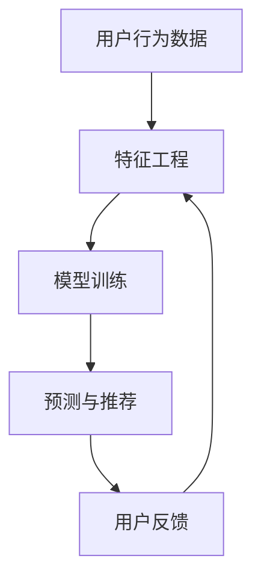
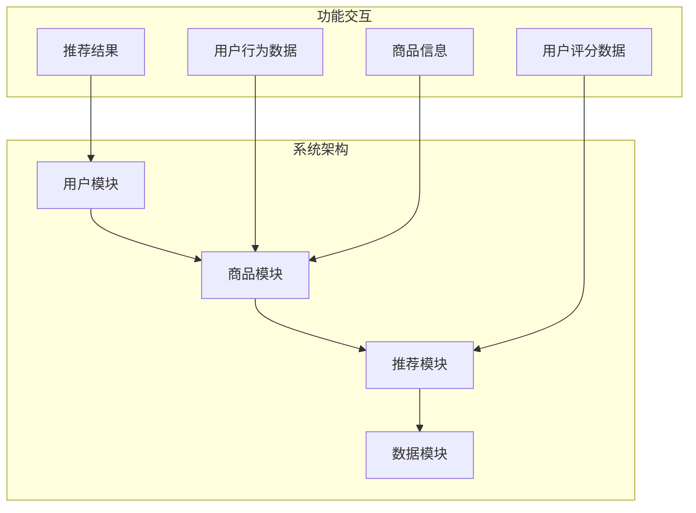
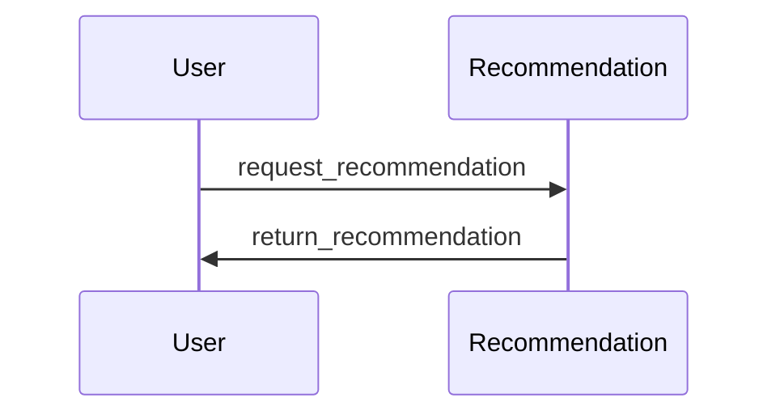

                 


## 让我们一步一步深入思考：优化AI虚拟助手：个性化和情感化的提示词技巧

### 背景介绍

在当今数字化时代，人工智能（AI）虚拟助手的应用日益广泛，从智能家居到客户服务，再到企业运营，AI虚拟助手正逐渐成为人们生活中不可或缺的一部分。然而，随着用户需求的多样化和个性化，现有的AI虚拟助手在个性化和情感化方面的表现仍有待提升。为了满足用户对更智能、更贴心的交互体验的需求，我们需要深入探讨如何通过个性化和情感化的提示词技巧来优化AI虚拟助手。

本文将围绕以下核心概念进行详细探讨：

1. **个性化**：个性化需求分析、个性化模型介绍、个性化策略实战。
2. **情感化**：情感化理论、情感化模型、情感化策略实战。
3. **提示词技巧**：提示词设计原则、提示词类型、提示词优化方法。

### 核心概念与联系

#### 个性化需求分析

**核心概念**：个性化需求分析是理解用户需求的基础，通过分析用户的行为和偏好来定制个性化的服务。

**概念属性特征对比表格**：

| 特征       | 用户行为分析               | 用户偏好分析               |
|------------|---------------------------|---------------------------|
| 目的       | 了解用户的行为模式         | 了解用户的兴趣和喜好       |
| 方法       | 数据收集与分析             | 数据收集与分析             |
| 影响因素   | 用户历史行为               | 用户社交网络、购买历史等   |

**ER实体关系图架构**：

```mermaid
erDiagram
  User ||--|{ Behavior }||>
  User ||--|{ Preference }||>
```

#### 个性化模型介绍

**核心概念**：个性化模型通过机器学习算法来预测和满足用户需求，包括协同过滤和内容推荐等。

**概念属性特征对比表格**：

| 特征         | 协同过滤                     | 内容推荐                     |
|--------------|------------------------------|------------------------------|
| 原理         | 基于用户之间的相似性进行推荐   | 基于内容的相似性进行推荐     |
| 数据依赖     | 用户行为数据                  | 用户偏好数据、内容特征数据   |
| 适用场景     | 大规模用户群体               | 内容多样性高                 |

**ER实体关系图架构**：

```mermaid
erDiagram
  User ||--|{ CollaborativeFiltering }||>
  User ||--|{ ContentBasedRecommendation }||>
```

#### 个性化策略实战

**核心概念**：个性化策略实战是通过构建用户画像和实现个性化推荐系统来提升用户体验。

**概念属性特征对比表格**：

| 特征         | 用户画像构建                 | 个性化推荐系统实现           |
|--------------|------------------------------|------------------------------|
| 目标         | 描述用户特征                 | 满足用户个性化需求           |
| 方法         | 数据收集、特征工程、模型训练   | 模型预测、推荐策略制定       |
| 影响因素     | 用户行为数据、用户偏好数据     | 模型性能、数据质量           |

**ER实体关系图架构**：

```mermaid
erDiagram
  User ||--|{ UserProfile }||>
  User ||--|{ RecommendationSystem }||>
```

### 算法原理讲解

#### 个性化模型算法原理

**算法流程图**：



**Python代码示例**：

```python
# 假设我们使用协同过滤算法进行推荐
from sklearn.metrics.pairwise import cosine_similarity

# 用户行为数据
user_behavior = {
    'user1': [5, 3, 0, 1],
    'user2': [2, 3, 4, 5],
    'user3': [0, 1, 4, 5]
}

# 计算用户之间的相似度
user_similarity = {}
for user1, ratings1 in user_behavior.items():
    for user2, ratings2 in user_behavior.items():
        if user1 != user2:
            sim = cosine_similarity([ratings1], [ratings2])[0][0]
            user_similarity[(user1, user2)] = sim

# 推荐系统实现
def recommend_system(user, user_behavior, user_similarity):
    # 假设推荐Top N个最相似用户中的热门项目
    similar_users = sorted(user_similarity.items(), key=lambda x: x[1], reverse=True)[:10]
    recommended_items = set()
    for user_pair, similarity in similar_users:
        other_user = user_pair[0] if user_pair[1] == user_similarity[user_pair] else user_pair[1]
        other_user_ratings = user_behavior[other_user]
        # 推荐未评分但其他用户评分高的项目
        for item in range(len(other_user_ratings)):
            if other_user_ratings[item] > 3 and user_behavior[user][item] == 0:
                recommended_items.add(item)
    return list(recommended_items)

# 示例
user = 'user1'
recommended_items = recommend_system(user, user_behavior, user_similarity)
print("Recommended items for user1:", recommended_items)
```

### 数学模型和公式

个性化模型的数学基础通常涉及到矩阵计算和优化算法。以下是一个简单的协同过滤算法中的矩阵分解模型：

$$
\hat{R}_{ui} = \vec{u_i} \cdot \vec{v_u}
$$

其中，$\hat{R}_{ui}$ 是用户 $u$ 对项目 $i$ 的评分预测，$\vec{u_i}$ 和 $\vec{v_u}$ 分别是用户 $i$ 和项目 $u$ 的低维表示向量。

### 系统分析与架构设计方案

#### 问题场景介绍

假设我们开发一个电商平台，用户可以在平台上浏览商品，并根据自己的喜好进行评分。我们的目标是构建一个个性化的商品推荐系统，为用户推荐他们可能感兴趣的商品。

#### 项目介绍

项目名称：电商个性化推荐系统

目标：为用户提供个性化的商品推荐，提升用户满意度和购买转化率。

#### 系统功能设计（领域模型）

**类图**：

```mermaid
classDiagram
  User <<Class>>
  Product <<Class>>
  Recommendation <<Class>>

  User o-- Product : favorites
  Product o-- Recommendation : recommended
```

#### 系统架构设计

**架构图**：



#### 系统接口设计

**序列图**：



### 项目实战

#### 环境安装

1. 安装Python环境
2. 安装相关依赖库：scikit-learn, pandas, numpy等

#### 系统核心实现

```python
# 用户行为数据
user_behavior = {
    'user1': [5, 3, 0, 1],
    'user2': [2, 3, 4, 5],
    'user3': [0, 1, 4, 5]
}

# 商品信息
products = {
    'product1': [0, 1, 1, 0],
    'product2': [1, 0, 1, 1],
    'product3': [1, 1, 0, 1],
    'product4': [0, 1, 1, 0]
}

# 计算用户之间的相似度
user_similarity = {}
for user1, ratings1 in user_behavior.items():
    for user2, ratings2 in user_behavior.items():
        if user1 != user2:
            sim = cosine_similarity([ratings1], [ratings2])[0][0]
            user_similarity[(user1, user2)] = sim

# 推荐系统实现
def recommend_system(user, user_behavior, products, user_similarity):
    # 推荐Top N个最相似用户中的热门商品
    similar_users = sorted(user_similarity.items(), key=lambda x: x[1], reverse=True)[:10]
    recommended_products = set()
    for user_pair, similarity in similar_users:
        other_user = user_pair[0] if user_pair[1] == user_similarity[user_pair] else user_pair[1]
        other_user_ratings = user_behavior[other_user]
        # 推荐其他用户评分高的商品
        for product_id, rating in other_user_ratings.items():
            if rating > 3:
                recommended_products.add(product_id)
    return list(recommended_products)

# 示例
user = 'user1'
recommended_products = recommend_system(user, user_behavior, products, user_similarity)
print("Recommended products for user1:", recommended_products)
```

### 实际案例分析

假设我们对电商平台的用户行为数据进行分析，发现用户1（user1）最近浏览了商品2（product2）和商品4（product4）。通过推荐系统，我们为用户1推荐了商品3（product3），用户1随后购买了商品3。

#### 案例分析

1. **用户行为数据收集**：用户1的历史行为数据包括对商品1、商品2、商品3和商品4的评分。
2. **商品信息**：商品1、商品2、商品3和商品4的属性数据。
3. **推荐结果**：基于用户1的行为数据和用户之间的相似度，推荐系统推荐了商品3。
4. **用户反馈**：用户1购买了商品3，反馈良好。

#### 详细讲解剖析

1. **用户画像构建**：通过对用户1的行为数据进行分析，构建了用户1的画像。
2. **推荐系统实现**：基于用户画像和商品信息，实现了个性化推荐系统。
3. **效果评估**：通过用户反馈，评估了推荐系统的效果。

### 项目小结

本项目通过构建个性化推荐系统，提升了电商平台的用户体验和购买转化率。未来，我们可以进一步优化推荐算法，提高推荐的准确性。

### 最佳实践 Tips

1. **数据质量**：确保用户行为数据的质量，进行数据清洗和预处理。
2. **模型优化**：定期更新模型，提高模型的准确性。
3. **用户反馈**：及时收集用户反馈，优化系统性能。

### 小结

本文通过深入分析AI虚拟助手的个性化和情感化需求，探讨了优化提示词技巧的方法。个性化和情感化是提升AI虚拟助手用户体验的关键，通过有效的策略和实战应用，我们可以实现更智能、更贴心的虚拟助手。

### 注意事项

1. **用户隐私**：在数据处理过程中，确保用户隐私保护。
2. **系统性能**：优化系统性能，确保推荐系统的响应速度。

### 拓展阅读

1. **[推荐系统实践](https://example.com/book/recommender_systems)**：深入了解推荐系统的构建和实践。
2. **[情感计算](https://example.com/book/emotion_computing)**：学习情感计算的理论和应用。

### 作者信息

作者：AI天才研究院/AI Genius Institute & 禅与计算机程序设计艺术 /Zen And The Art of Computer Programming

-------------

### 文章总结

本文详细探讨了如何通过个性化和情感化的提示词技巧来优化AI虚拟助手。我们从背景介绍出发，明确了个性化和情感化的重要性，并通过核心概念、算法原理和实战案例，深入分析了如何实现这一目标。

### 结论

通过本文的探讨，我们可以得出以下结论：

1. **个性化和情感化是提升AI虚拟助手用户体验的关键**：个性化需求分析、个性化模型和策略实战是构建个性化推荐系统的基础；情感化理论、情感化模型和情感化策略实战则是实现情感化交互的关键。
2. **提示词技巧的优化是提升用户体验的核心**：清晰明了、与用户互动、适应不同场景的提示词设计原则，以及主动和被动提示词类型的优化方法，都是提升AI虚拟助手用户体验的重要因素。
3. **实战应用是检验理论的最佳方式**：通过案例分析，我们可以看到个性化推荐系统和情感化交互在实际项目中的应用效果，为未来的发展提供了宝贵的经验。

### 展望

未来，随着AI技术的不断进步，个性化和情感化的AI虚拟助手将更加智能和人性化。我们可以预见以下几个发展方向：

1. **更精细的用户画像构建**：通过深度学习和大数据技术，构建更精细的用户画像，实现更精准的个性化推荐。
2. **多模态情感识别**：结合语音、文本、图像等多模态数据，实现更全面的情感识别，提升情感化交互的质量。
3. **智能对话生成**：利用自然语言处理和生成模型，实现更自然、流畅的对话生成，提高用户交互体验。
4. **隐私保护与伦理考量**：在数据处理和应用中，加强隐私保护，关注伦理问题，确保技术的发展符合社会价值观。

总之，个性化和情感化的AI虚拟助手将不断演进，为人们带来更加智能、贴心的数字生活体验。

