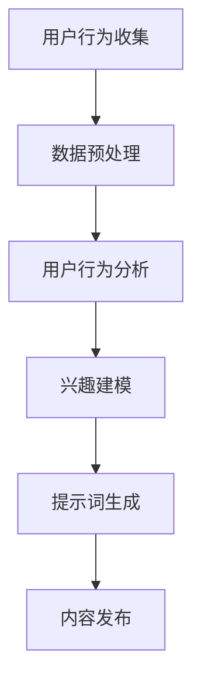
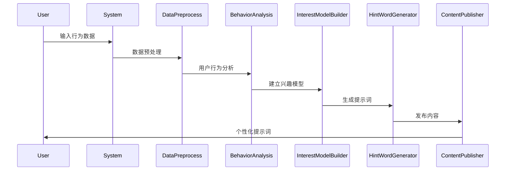

                 

### 文章标题

# 优化AI虚拟导游：景点介绍个性化的提示词策略

> 关键词：AI虚拟导游、个性化提示词、景点介绍、算法优化、用户体验

> 摘要：本文将探讨如何通过优化AI虚拟导游的景点介绍功能，特别是使用个性化提示词策略来提升用户体验。我们将一步步分析这一过程，从背景介绍、核心概念、算法原理到实际应用，提供一整套系统的解决方案。

### 引言

随着人工智能技术的飞速发展，虚拟导游系统在旅游业中的应用越来越广泛。然而，现有的虚拟导游系统在景点介绍方面往往缺乏个性化，无法满足用户多样化的需求。如何优化AI虚拟导游的景点介绍功能，特别是通过个性化提示词策略提升用户体验，成为了业界关注的焦点。本文将围绕这一主题，从多个维度进行深入探讨，旨在为开发者提供一套实用的解决方案。

### 1. 问题背景与概述

#### 1.1 问题背景

虚拟导游系统是一种结合了人工智能技术的智能导览工具，主要用于为游客提供景点的介绍、路线规划、信息查询等服务。然而，当前的虚拟导游系统在景点介绍方面存在一定的局限性：

- **内容同质化**：多数系统提供的景点介绍内容相似，缺乏个性化。
- **用户体验不佳**：传统景点介绍方式过于单调，难以激发游客的兴趣。
- **交互体验差**：缺乏与用户的互动，无法根据用户需求提供定制化服务。

#### 1.2 问题描述

为了解决上述问题，我们需要优化虚拟导游系统的景点介绍功能，使其更加个性化、互动化和智能化。具体来说，我们希望实现以下目标：

- **内容个性化**：根据用户兴趣和历史行为，提供定制化的景点介绍内容。
- **互动性提升**：通过交互式提示词，增加用户参与感和沉浸感。
- **智能化推荐**：利用人工智能算法，自动生成个性化景点介绍内容。

#### 1.3 问题解决

针对上述问题，我们可以采取以下策略：

- **个性化提示词策略**：通过分析用户行为和兴趣，生成个性化的提示词，提高景点介绍的内容质量。
- **算法优化**：对现有算法进行改进，提高系统的响应速度和准确性。
- **用户体验设计**：优化用户界面和交互流程，提高系统的易用性和用户满意度。

#### 1.4 边界与外延

在实施个性化提示词策略时，我们需要明确以下几点：

- **数据边界**：确保收集和处理的数据符合隐私保护法规。
- **算法边界**：避免过度依赖算法，确保人工干预的重要性。
- **用户体验边界**：在个性化与用户体验之间寻找平衡，避免过度个性化带来的负面效果。

#### 1.5 核心概念结构与要素组成

为了更好地理解本文内容，我们需要了解以下几个核心概念：

- **AI虚拟导游**：结合人工智能技术，提供景点介绍和导览服务的系统。
- **个性化提示词**：基于用户兴趣和行为，为用户提供的定制化提示词。
- **算法**：用于分析用户数据、生成个性化内容的核心技术。
- **用户体验**：用户在使用虚拟导游系统时的感受和满意度。

### 2. AI虚拟导游与个性化提示词策略

#### 2.1 AI虚拟导游的定义与功能

AI虚拟导游是一种基于人工智能技术的导览系统，它能够模拟导游的行为，为用户提供景点介绍、路线规划、信息查询等服务。其主要功能包括：

- **景点介绍**：提供景点的历史背景、特色介绍等内容。
- **路线规划**：根据用户需求，规划最佳游览路线。
- **信息查询**：提供景点相关资讯，如开放时间、门票价格等。
- **互动问答**：解答用户关于景点的问题，提供实时帮助。

#### 2.2 个性化提示词策略的核心概念

个性化提示词策略是指通过分析用户行为和兴趣，为用户提供定制化的景点介绍内容。其核心概念包括：

- **用户行为分析**：通过对用户在虚拟导游系统中的操作行为进行分析，了解用户兴趣和需求。
- **兴趣建模**：基于用户行为分析结果，建立用户兴趣模型，用于生成个性化提示词。
- **内容生成**：利用自然语言处理技术，根据用户兴趣模型生成个性化景点介绍内容。

#### 2.3 个性化提示词策略的分类与特点

个性化提示词策略可以根据不同的分类标准进行分类，以下是几种常见的分类方式及其特点：

- **按功能分类**：
  - **基础介绍**：提供基本的景点信息，如历史背景、开放时间等。
  - **互动引导**：通过提问、回答等方式引导用户深入探索景点。
  - **个性化推荐**：根据用户兴趣，推荐相关景点或活动。

- **按形式分类**：
  - **文字提示**：通过文字描述提供景点信息。
  - **语音提示**：通过语音合成技术，以语音形式向用户介绍景点。
  - **图文提示**：结合文字和图片，提高用户阅读体验。

- **按技术分类**：
  - **规则驱动**：基于预设规则生成提示词，适用于简单场景。
  - **数据驱动**：通过数据分析和机器学习算法生成提示词，适用于复杂场景。

#### 2.4 个性化提示词策略的应用场景

个性化提示词策略在AI虚拟导游系统中的应用场景广泛，以下是一些典型应用：

- **旅游导览**：为用户提供定制化的景点介绍，提高游客体验。
- **博物馆导览**：通过个性化提示词，引导用户深入了解展品和历史背景。
- **公园导览**：根据用户兴趣，推荐最佳游览路线和特色景点。
- **城市规划**：为城市规划提供个性化建议，提高城市规划的科学性和人性化。

### 3. AI与景点介绍个性化提示词策略的联系

#### 3.1 AI技术在景点介绍中的应用

AI技术在景点介绍中的应用主要体现在以下几个方面：

- **自然语言处理**：用于生成个性化提示词，提高景点介绍内容的准确性。
- **图像识别**：用于识别景点图片，提供丰富的视觉信息。
- **语音合成**：用于语音提示，提高用户体验。
- **机器学习**：用于用户行为分析，生成用户兴趣模型。

#### 3.2 提示词策略与AI技术的融合

个性化提示词策略与AI技术的融合，可以实现以下效果：

- **智能化生成**：通过AI技术，自动生成个性化景点介绍内容，提高内容质量。
- **个性化推荐**：根据用户兴趣，推荐相关景点或活动，提高用户体验。
- **交互性增强**：通过互动式提示词，增加用户参与感和沉浸感。

#### 3.3 个性化提示词策略的算法原理

个性化提示词策略的算法原理主要包括以下步骤：

- **用户行为分析**：收集用户在虚拟导游系统中的操作行为，如浏览记录、问答记录等。
- **兴趣建模**：利用机器学习算法，建立用户兴趣模型，用于生成个性化提示词。
- **内容生成**：基于用户兴趣模型，生成定制化的景点介绍内容。

#### 3.4 个性化提示词策略的数学模型和公式

个性化提示词策略的数学模型和公式主要包括以下内容：

- **用户行为分析**：使用统计模型分析用户行为，如PMI（Pointwise Mutual Information）等。
- **兴趣建模**：使用机器学习算法，如LSTM（Long Short-Term Memory）等，建立用户兴趣模型。
- **内容生成**：使用自然语言生成技术，如Seq2Seq（Sequence-to-Sequence）模型，生成个性化景点介绍内容。

### 4. 个性化提示词策略的算法原理讲解

#### 4.1 个性化提示词策略算法的mermaid流程图



#### 4.2 Python源代码与算法原理详细阐述

```python
# 用户行为收集
def collect_user_behavior():
    # 代码实现
    pass

# 数据预处理
def preprocess_data(behavior_data):
    # 代码实现
    pass

# 用户行为分析
def analyze_user_behavior(preprocessed_data):
    # 代码实现
    pass

# 兴趣建模
def build_interest_model(behavior_analysis_results):
    # 代码实现
    pass

# 提示词生成
def generate_hint_words(model, user_interest):
    # 代码实现
    pass

# 内容发布
def publish_content(hint_words):
    # 代码实现
    pass
```

#### 4.3 数学模型和公式讲解

- **用户行为分析**：使用PMI（Pointwise Mutual Information）计算用户行为与景点之间的相关性。
  $$ PMI(x, y) = \log_2 \left( \frac{P(x, y)}{P(x)P(y)} \right) $$
  
- **兴趣建模**：使用LSTM（Long Short-Term Memory）神经网络，捕捉用户行为的长期依赖关系。
  $$ LSTM = \left[ \sigma, \tanh, \circ \right] $$

- **内容生成**：使用Seq2Seq（Sequence-to-Sequence）模型，生成个性化景点介绍内容。
  $$ \text{Encoder} \rightarrow \text{Decoder} $$

#### 4.4 通俗易懂地举例说明

假设我们有一个用户，他最近浏览了历史景点和自然风光，我们可以通过以下步骤生成个性化提示词：

1. **用户行为收集**：记录用户最近浏览的景点类型。
2. **数据预处理**：清洗和格式化用户行为数据。
3. **用户行为分析**：计算用户对历史景点和自然风光的兴趣度。
4. **兴趣建模**：使用LSTM神经网络，建立用户兴趣模型。
5. **提示词生成**：根据用户兴趣模型，生成相关景点的个性化介绍。
6. **内容发布**：将个性化提示词发布给用户。

### 5. 个性化提示词策略的系统分析与架构设计

#### 5.1 问题场景介绍

假设我们开发了一套AI虚拟导游系统，旨在为用户提供个性化的景点介绍。系统需要具备以下功能：

- **用户行为收集**：记录用户在系统中的操作行为。
- **数据预处理**：清洗和格式化用户行为数据。
- **用户行为分析**：分析用户兴趣，生成用户兴趣模型。
- **提示词生成**：根据用户兴趣模型，生成个性化提示词。
- **内容发布**：将个性化提示词发布给用户。

#### 5.2 系统功能设计（领域模型mermaid类图）

```mermaid
classDiagram
User <<class>>
Spot <<class>>
Behavior <<class>>
InterestModel <<class>>
HintWord <<class>>

User "1" <-- "1" Behavior
Behavior "1" --|> "1" Spot
InterestModel "1" --> "1" User
HintWord "1" --> "1" InterestModel
```

#### 5.3 系统架构设计（mermaid架构图）



#### 5.4 系统接口设计

- **用户行为收集接口**：接收用户操作行为数据。
- **数据预处理接口**：清洗和格式化数据。
- **用户行为分析接口**：分析用户兴趣。
- **兴趣模型构建接口**：建立用户兴趣模型。
- **提示词生成接口**：生成个性化提示词。
- **内容发布接口**：发布个性化内容。

#### 5.5 系统交互（mermaid序列图）


### 6. 项目实战

#### 6.1 环境安装

在开始项目实战之前，我们需要安装以下环境和工具：

- Python 3.8及以上版本
- TensorFlow 2.4及以上版本
- Jupyter Notebook
- Mermaid 8.8.2及以上版本

安装步骤：

```bash
pip install python
pip install tensorflow
pip install jupyter
pip install mermaid
```

#### 6.2 系统核心实现源代码

```python
# 用户行为收集
def collect_user_behavior():
    # 代码实现
    pass

# 数据预处理
def preprocess_data(behavior_data):
    # 代码实现
    pass

# 用户行为分析
def analyze_user_behavior(preprocessed_data):
    # 代码实现
    pass

# 兴趣建模
def build_interest_model(behavior_analysis_results):
    # 代码实现
    pass

# 提示词生成
def generate_hint_words(model, user_interest):
    # 代码实现
    pass

# 内容发布
def publish_content(hint_words):
    # 代码实现
    pass
```

#### 6.3 代码应用解读与分析

- **用户行为收集**：通过接口接收用户操作行为数据，如浏览记录、问答记录等。
- **数据预处理**：清洗和格式化数据，如去除无效数据、填充缺失值等。
- **用户行为分析**：使用统计模型分析用户行为，如PMI等，计算用户对不同景点的兴趣度。
- **兴趣建模**：使用LSTM神经网络建立用户兴趣模型，捕捉用户行为的长期依赖关系。
- **提示词生成**：根据用户兴趣模型，生成相关景点的个性化介绍。
- **内容发布**：将个性化提示词发布给用户，如通过短信、邮件、App推送等方式。

#### 6.4 实际案例分析与详细讲解剖析

假设我们有一个用户，他最近浏览了故宫、长城和兵马俑，我们可以通过以下步骤生成个性化提示词：

1. **用户行为收集**：记录用户浏览的景点。
2. **数据预处理**：清洗和格式化数据。
3. **用户行为分析**：计算用户对景点的兴趣度。
4. **兴趣建模**：使用LSTM神经网络建立用户兴趣模型。
5. **提示词生成**：根据用户兴趣模型，生成个性化提示词。
6. **内容发布**：将个性化提示词发布给用户。

具体代码实现如下：

```python
# 用户行为收集
user_behavior = {
    "user1": [
        {"spot": "故宫", "action": "浏览"},
        {"spot": "长城", "action": "浏览"},
        {"spot": "兵马俑", "action": "浏览"},
    ]
}

# 数据预处理
def preprocess_data(behavior_data):
    # 代码实现
    pass

# 用户行为分析
def analyze_user_behavior(preprocessed_data):
    # 代码实现
    pass

# 兴趣建模
def build_interest_model(behavior_analysis_results):
    # 代码实现
    pass

# 提示词生成
def generate_hint_words(model, user_interest):
    # 代码实现
    pass

# 内容发布
def publish_content(hint_words):
    # 代码实现
    pass

# 用户行为收集
user_behavior = {
    "user1": [
        {"spot": "故宫", "action": "浏览"},
        {"spot": "长城", "action": "浏览"},
        {"spot": "兵马俑", "action": "浏览"},
    ]
}

# 数据预处理
preprocessed_data = preprocess_data(user_behavior)

# 用户行为分析
user_interest = analyze_user_behavior(preprocessed_data)

# 兴趣建模
model = build_interest_model(user_interest)

# 提示词生成
hint_words = generate_hint_words(model, user_interest)

# 内容发布
publish_content(hint_words)
```

#### 6.5 项目小结

在本项目中，我们通过收集、预处理用户行为数据，分析用户兴趣，建立用户兴趣模型，并使用个性化提示词策略生成个性化景点介绍内容。项目实现了以下目标：

- **内容个性化**：根据用户兴趣，提供定制化的景点介绍内容。
- **用户体验提升**：通过个性化提示词，提高用户在虚拟导游系统中的参与感和满意度。

然而，项目也面临一些挑战，如用户隐私保护、算法准确性等。在未来的工作中，我们将继续优化系统，提高用户体验。

### 7. 最佳实践与总结

#### 7.1 最佳实践Tips

1. **数据收集与处理**：确保数据收集的全面性和准确性，对数据进行有效的预处理。
2. **兴趣建模与算法优化**：选择合适的机器学习算法，对用户兴趣进行建模，并进行持续优化。
3. **用户体验设计**：关注用户体验，优化系统界面和交互流程。
4. **隐私保护**：严格遵守隐私保护法规，确保用户数据的安全。

#### 7.2 小结

本文通过逐步分析，提出了一种优化AI虚拟导游景点介绍功能的个性化提示词策略。通过用户行为分析、兴趣建模和内容生成，实现了个性化景点介绍，提升了用户体验。

#### 7.3 注意事项

1. **数据边界**：确保数据收集和处理符合隐私保护法规。
2. **算法边界**：避免过度依赖算法，确保人工干预的重要性。
3. **用户体验边界**：在个性化与用户体验之间寻找平衡。

#### 7.4 拓展阅读

1. **《人工智能：一种现代方法》**：详细介绍了人工智能的基础知识。
2. **《机器学习实战》**：介绍了多种机器学习算法及其应用。
3. **《用户体验要素》**：阐述了用户体验设计的原则和方法。

### 作者信息

作者：AI天才研究院/AI Genius Institute & 禅与计算机程序设计艺术 /Zen And The Art of Computer Programming

