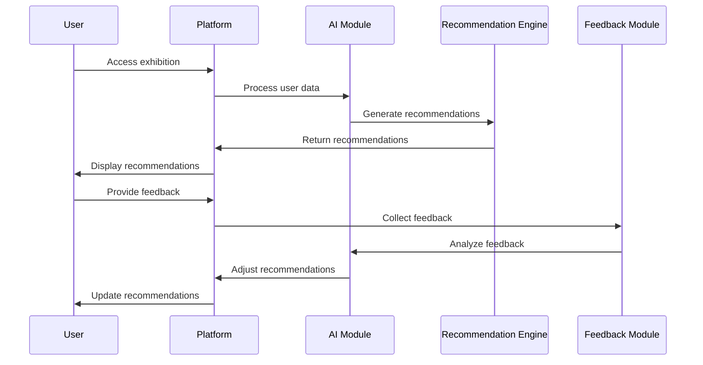
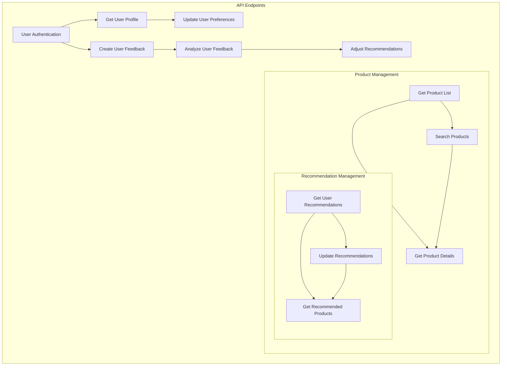
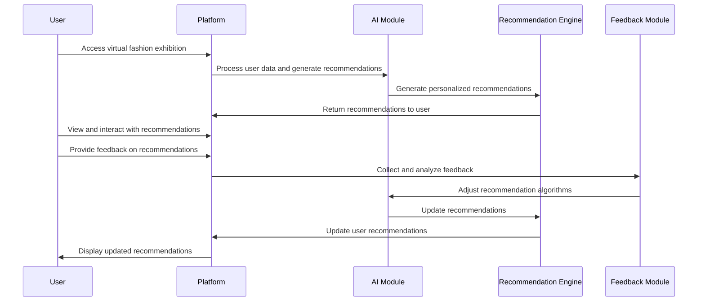

                 

### Chapter 1: Introduction to AI Virtual Fashion Exhibitions

#### 1.1 Background of AI Virtual Fashion Exhibitions

**Problem Background**

The fashion industry has traditionally relied on physical stores and events for showcasing new collections, trends, and products. However, the COVID-19 pandemic accelerated the shift towards digital transformation, pushing businesses to adopt new technologies to maintain their operations and engage with customers. One such technological innovation is the use of AI in virtual fashion exhibitions. These digital platforms leverage artificial intelligence to create immersive and interactive experiences, allowing customers to explore fashion products in a virtual environment.

**Problem Description**

The primary challenge faced by traditional fashion exhibitions is the inability to provide a rich, interactive, and immersive experience to customers. Physical stores have limitations in terms of space, inventory, and the ability to personalize the shopping experience. Moreover, with the increasing demand for convenience and instant gratification, consumers expect a seamless and engaging experience, which is not always possible in a brick-and-mortar setup.

**Problem Solution**

AI virtual fashion exhibitions offer a solution to these challenges by leveraging the power of artificial intelligence and virtual reality (VR) technologies. These platforms can simulate a physical store environment, allowing customers to browse products, try them on virtually, and receive personalized recommendations. This not only enhances the shopping experience but also provides fashion brands with valuable data insights to improve their offerings and marketing strategies.

**Scope and Delimitation**

The scope of this article is to explore the concepts, technologies, and strategies involved in optimizing AI virtual fashion exhibitions. We will discuss the role of AI in creating immersive experiences, the importance of trigger words, and the implementation of AI-driven personalization. The delimitation includes focusing on the technical aspects and overlooking the business models and marketing strategies associated with these exhibitions.

**Key Concepts and Components**

1. **AI Virtual Fashion Exhibitions**: Digital platforms that use AI to simulate a physical store environment for showcasing fashion products.
2. **Artificial Intelligence (AI)**: A branch of computer science focused on creating intelligent machines capable of performing tasks that typically require human intelligence.
3. **Virtual Reality (VR)**: A computer-generated environment that simulates a real-world setting, allowing users to interact with it through sensory stimuli.
4. **User Experience (UX)**: The overall experience a user has while interacting with a digital product or service.
5. **Data Analytics**: The process of examining data sets to draw conclusions about the information they contain, often with complex software and systems.

#### 1.2 Core Concepts and Terminology

**Definition of AI Virtual Fashion Exhibitions**

AI virtual fashion exhibitions are digital platforms that combine artificial intelligence and virtual reality to create an immersive shopping experience for customers. These platforms leverage AI algorithms to provide personalized recommendations, virtual try-ons, and interactive engagement with fashion products.

**Characteristics and Advantages**

1. **Immersiveness**: Users can experience virtual fashion exhibitions as if they were in a physical store, thanks to VR technologies.
2. **Personalization**: AI algorithms analyze user data to provide personalized product recommendations and shopping experiences.
3. **Convenience**: Customers can browse and purchase products from the comfort of their homes, eliminating the need to visit physical stores.
4. **Scalability**: Virtual fashion exhibitions can be easily scaled to accommodate a larger number of users and products without the limitations of physical space.
5. **Data Insights**: Brands can collect valuable data on customer behavior, preferences, and shopping patterns to improve their offerings and marketing strategies.

**Comparative Table of Core Concepts**

| Concept | Definition | Importance |
| --- | --- | --- |
| AI Virtual Fashion Exhibitions | Digital platforms using AI and VR | Enhances user experience, personalization, and scalability |
| Artificial Intelligence | Intelligence demonstrated by machines | Drives personalized interactions and data insights |
| Virtual Reality | Computer-generated environment | Provides an immersive shopping experience |
| User Experience | Overall experience while interacting with a digital product | Determines customer satisfaction and engagement |
| Data Analytics | Examining data sets to draw conclusions | Informs product improvements and marketing strategies |

#### 1.3 AI and VR/AR Technologies in Fashion

**AI Technologies Overview**

Artificial intelligence has become an integral part of the fashion industry, offering various applications that enhance design, manufacturing, and retail processes. Some key AI technologies in fashion include:

1. **Computer Vision**: Used for image recognition and object detection, enabling virtual try-ons and style analysis.
2. **Machine Learning**: Analyzes large datasets to identify patterns and make predictions, driving personalized recommendations and demand forecasting.
3. **Natural Language Processing (NLP)**: Used for understanding and processing human language, enabling chatbots and voice assistants in customer support.

**VR/AR Technologies in the Fashion Industry**

Virtual reality (VR) and augmented reality (AR) technologies have transformed the fashion industry by providing immersive and interactive experiences. Some key applications include:

1. **Virtual Showrooms**: Brands use VR to create virtual showrooms where customers can explore product collections in a 3D environment.
2. **Virtual Try-On**: VR and AR technologies allow customers to virtually try on clothes, accessories, and makeup, enhancing the shopping experience.
3. **AR Advertising**: Brands use AR to create interactive advertisements that engage customers and drive brand awareness.

**AI-VR/AR Integration and Potential**

The integration of AI and VR/AR technologies in fashion has opened up new possibilities for creating immersive and personalized shopping experiences. Some potential benefits include:

1. **Enhanced User Experience**: AI algorithms can personalize virtual fashion exhibitions based on user preferences and behavior, creating a more engaging and enjoyable shopping experience.
2. **Improved Product Discovery**: AI-powered search and recommendation systems can help customers find products that match their style and preferences, reducing the time spent searching.
3. **Data-Driven Decision Making**: Brands can collect valuable data on customer interactions and behavior, enabling them to make informed decisions about product offerings, marketing strategies, and store layouts.
4. **New Business Models**: AI-powered virtual fashion exhibitions can enable new business models, such as virtual personal shopping assistants and subscription-based services.

#### 1.4 Market Trends and Future Outlook

**Current Market Landscape**

The global virtual and augmented reality market is projected to reach $209.2 billion by 2025, with significant growth driven by applications in various industries, including fashion. The COVID-19 pandemic has accelerated the adoption of virtual fashion exhibitions, as brands seek innovative ways to engage with customers and maintain their operations.

**Technological Advancements**

Advancements in AI, VR, and AR technologies are driving the development of more sophisticated and immersive virtual fashion exhibitions. Key advancements include:

1. **Improved Image Recognition**: Advanced computer vision algorithms allow for more accurate and realistic virtual try-ons, reducing the likelihood of users encountering incorrect fit or style.
2. **Natural Language Processing**: Chatbots and voice assistants are becoming more sophisticated, providing customers with personalized recommendations and support.
3. **Virtual and Augmented Reality Headsets**: The availability of more affordable and advanced VR and AR headsets is increasing access to immersive digital experiences.

**Future Opportunities and Challenges**

The future of virtual fashion exhibitions is bright, with opportunities for further innovation and growth. However, there are also challenges that need to be addressed:

1. **User Experience**: Ensuring that virtual fashion exhibitions provide a seamless and enjoyable experience for users is crucial. Brands need to focus on optimizing the user interface and experience to prevent user churn.
2. **Data Privacy and Security**: Collecting and analyzing user data raises concerns about privacy and security. Brands need to implement robust data protection measures to build trust with their customers.
3. **Scalability**: As virtual fashion exhibitions become more popular, brands need to ensure that their platforms can handle increased traffic and data without compromising performance.

In conclusion, AI virtual fashion exhibitions offer a promising future for the fashion industry, providing immersive and personalized shopping experiences that enhance customer satisfaction and drive business growth. As technology continues to advance, brands that leverage these innovative solutions will be well-positioned to thrive in the digital age.

## Chapter 2: Immersive Digital Experience Strategies

#### 2.1 Understanding Immersive Experiences

**Concept and Importance**

Immersive digital experiences refer to the ability of a digital platform to engage users in a way that feels like they are physically present in a real-world environment. This is achieved through the use of virtual reality (VR) and augmented reality (AR) technologies, which provide users with a sense of presence and interaction. Immersive experiences are highly engaging and can significantly enhance user satisfaction and brand loyalty.

**User Engagement Metrics**

Several key metrics can be used to measure user engagement in immersive digital experiences:

1. **Session Length**: The duration of a user's interaction with the platform. Longer sessions indicate higher engagement levels.
2. **Interaction Rate**: The frequency of user interactions with the platform's features. Higher interaction rates suggest a more engaging experience.
3. **Retention Rate**: The percentage of users who return to the platform after their initial visit. High retention rates indicate a strong user base.
4. **Conversion Rate**: The percentage of users who complete a desired action, such as making a purchase or signing up for a newsletter. Higher conversion rates indicate effective user engagement.

**Design Principles**

Designing immersive digital experiences requires careful consideration of several key principles:

1. **User-Centered Design**: Prioritize the user's needs, preferences, and expectations to ensure a seamless and enjoyable experience.
2. **Scalability**: Design the platform to handle increased traffic and data without compromising performance.
3. **Accessibility**: Ensure that the platform is accessible to users with different abilities and devices.
4. **Aesthetics**: Use visually appealing designs and animations to enhance the overall user experience.
5. **Interactivity**: Provide meaningful interactions that allow users to explore and engage with the platform's content.

#### 2.2 Trigger Word Strategies

**Definition and Role in Immersive Experiences**

Trigger words are specific phrases or keywords that prompt a response or action from users. In the context of immersive digital experiences, trigger words are used to engage users and guide them through the platform's features. They can be used in various ways, such as chatbots, voice assistants, and interactive elements, to create a more engaging and personalized user experience.

**Types of Trigger Words**

There are several types of trigger words that can be used in immersive digital experiences:

1. **Functional Trigger Words**: These words are used to perform specific tasks or actions, such as "buy," "order," or "schedule."
2. **Emotional Trigger Words**: These words evoke emotions and create a connection with the user, such as "amazing," "gorgeous," or "exclusive."
3. **Contextual Trigger Words**: These words are used to provide additional information or context, such as "next," "previous," or "return to main menu."
4. **Personalized Trigger Words**: These words are tailored to the user's preferences and behavior, such as "your style," "recommended for you," or "based on your preferences."

**Creating Effective Trigger Word Lists**

To create an effective trigger word list, consider the following steps:

1. **Understand Your Audience**: Identify the demographics, preferences, and behaviors of your target audience.
2. **Gather Data**: Collect data on user interactions, search queries, and feedback to identify commonly used phrases and keywords.
3. **Analyze Competitors**: Research your competitors' trigger word strategies to identify gaps and opportunities for improvement.
4. **Test and Iterate**: Test your trigger word list with a small group of users and gather feedback to refine and optimize the list.

#### 2.3 User Interaction and Feedback Loops

**Designing User Interaction Models**

Designing effective user interaction models is crucial for creating immersive digital experiences. This involves considering the following elements:

1. **User Flows**: Map out the sequence of steps a user takes to complete a task or achieve a goal within the platform.
2. **Touchpoints**: Identify the key points of interaction between the user and the platform, such as buttons, menus, and chatbots.
3. **Feedback Mechanisms**: Incorporate feedback mechanisms, such as surveys, ratings, and comments, to gather user input and improve the platform.

**Collecting and Analyzing User Feedback**

Collecting and analyzing user feedback is essential for understanding user needs and preferences and making data-driven improvements. This involves the following steps:

1. **Survey and Questionnaires**: Use surveys and questionnaires to gather quantitative and qualitative feedback from users.
2. **User Testing**: Conduct user testing sessions to observe users interacting with the platform and identify areas for improvement.
3. **Data Analytics**: Use data analytics tools to track user interactions, such as session duration, click-through rates, and conversion rates.
4. **Sentiment Analysis**: Analyze user feedback and comments to determine the overall sentiment towards the platform and identify areas of concern.

**Improving User Experience through Feedback**

Based on the feedback collected, implement the following strategies to improve the user experience:

1. **Iterative Design**: Continuously iterate and refine the platform based on user feedback, focusing on addressing pain points and enhancing key features.
2. **Personalization**: Use feedback to personalize the user experience, such as by providing personalized recommendations and tailored content.
3. **A/B Testing**: Conduct A/B testing to compare different design and functionality options and determine which version performs better.
4. **User Education**: Provide clear instructions and guidance to help users navigate the platform and understand its features.

In conclusion, immersive digital experience strategies involve understanding user needs, creating effective trigger word lists, and designing user interaction models that encourage engagement and feedback. By leveraging these strategies, brands can create highly engaging and personalized virtual fashion exhibitions that enhance user satisfaction and drive business growth.

## Chapter 3: AI-Driven Personalization in Virtual Fashion Exhibitions

### 3.1 Personalization in Digital Retail

**Importance of Personalization**

In the digital age, personalization has become a crucial aspect of customer engagement and retention in the retail industry. Personalization refers to the process of customizing marketing messages, product recommendations, and user experiences to match individual customer preferences and behaviors. In digital retail, personalization plays a vital role in creating a more engaging and relevant shopping experience, ultimately driving customer satisfaction and loyalty.

**Techniques for Collecting User Data**

To effectively personalize the user experience in virtual fashion exhibitions, brands must collect and analyze relevant user data. Here are some key techniques for data collection:

1. **User Profiles**: Create detailed user profiles that contain information such as age, gender, location, purchase history, and browsing behavior. This data can be collected through registration forms, surveys, and preference settings.
2. **Behavioral Data**: Track user interactions on the platform, including page visits, time spent on pages, and items viewed or added to the shopping cart. This information can be gathered using web analytics tools and tracking scripts.
3. **Feedback and Reviews**: Collect feedback and reviews from users to gain insights into their preferences, concerns, and satisfaction levels. This can be done through surveys, comment sections, and ratings systems.
4. **Data Integration**: Integrate data from various sources, such as customer relationship management (CRM) systems, email campaigns, and social media platforms, to create a comprehensive view of each user's behavior and preferences.

**AI Algorithms for Personalization**

Artificial intelligence (AI) algorithms are essential for processing and analyzing the vast amounts of user data collected in digital retail. Here are some common AI algorithms used for personalization:

1. **Collaborative Filtering**: This algorithm makes recommendations based on the preferences and behaviors of similar users. It identifies users with similar profiles and suggests products that these users have liked or purchased.
2. **Content-Based Filtering**: This algorithm recommends products based on the attributes and features of items a user has previously liked or viewed. It analyzes the content of products and user interactions to determine relevant recommendations.
3. **Hybrid Methods**: These methods combine collaborative and content-based filtering to provide more accurate and diverse recommendations. They leverage the strengths of both approaches to create a personalized user experience.
4. **Deep Learning**: Neural networks and other deep learning techniques can be used to analyze complex user data and generate highly accurate recommendations. These methods can learn from vast amounts of data and continuously improve over time.

### 3.2 User Profiling and Segmentation

**User Profiling Concepts**

User profiling is the process of creating a detailed description of a user based on their demographic information, behavior, preferences, and other relevant data. User profiling helps brands understand their customers better and tailor their marketing strategies and user experiences accordingly. Here are the key components of user profiling:

1. **Demographic Data**: Information about a user's age, gender, location, occupation, and education.
2. **Behavioral Data**: Data about a user's browsing and purchase history, including the types of products they have viewed, added to the cart, and purchased.
3. **Psychographic Data**: Information about a user's lifestyle, interests, values, and personality traits, which can be used to gain deeper insights into their preferences and motivations.
4. **Contextual Data**: Data about the user's context, such as the device they are using, the time of day, and their location.

**Segmentation Methods**

User segmentation is the process of dividing a user base into smaller, more manageable groups based on shared characteristics, behaviors, or preferences. Effective segmentation allows brands to target specific segments with tailored marketing messages and product recommendations. Here are some common segmentation methods:

1. **Demographic Segmentation**: Dividing the user base based on demographic factors such as age, gender, and location.
2. **Behavioral Segmentation**: Dividing the user base based on their behavior, such as browsing and purchase history, frequency of visits, and engagement level.
3. **Psychographic Segmentation**: Dividing the user base based on lifestyle, interests, values, and personality traits.
4. **Contextual Segmentation**: Dividing the user base based on contextual factors such as device type, time of day, and location.
5. **Combination Segmentation**: Combining multiple segmentation methods to create more targeted and relevant segments.

**Application in Virtual Fashion Exhibitions**

In virtual fashion exhibitions, user profiling and segmentation play a crucial role in creating personalized and engaging user experiences. By understanding the preferences and behaviors of different user segments, brands can tailor their product offerings, recommendations, and marketing messages to better meet their customers' needs.

1. **Personalized Recommendations**: Using user profiling and segmentation, brands can generate personalized product recommendations that match the preferences and styles of individual users.
2. **Targeted Marketing Campaigns**: By identifying specific user segments, brands can create targeted marketing campaigns that are more likely to resonate with their target audience.
3. **Enhanced User Experience**: By providing a more personalized and relevant user experience, brands can improve customer satisfaction and loyalty, leading to increased engagement and conversions.

In conclusion, AI-driven personalization in virtual fashion exhibitions involves collecting and analyzing user data to create detailed user profiles and segmentation. By leveraging these insights, brands can provide highly personalized and engaging user experiences that drive customer satisfaction and business growth.

### 3.3 AI-Enabled Product Recommendations

**Recommendation System Overview**

AI-enabled product recommendation systems are at the heart of personalized virtual fashion exhibitions. These systems analyze user data, such as browsing history, purchase patterns, and demographic information, to generate personalized product recommendations. The goal is to present users with products that align with their preferences and increase the likelihood of purchase.

**Recommendation Algorithms**

Several recommendation algorithms are commonly used in virtual fashion exhibitions, each with its own strengths and limitations:

1. **Collaborative Filtering**: This algorithm makes recommendations based on the preferences of similar users. It identifies users with similar profiles and suggests products that these users have liked or purchased. Collaborative filtering can be divided into two types: user-based (e.g., cosine similarity) and item-based (e.g., Apriori algorithm).

2. **Content-Based Filtering**: This algorithm recommends products based on the attributes and features of items a user has previously liked or viewed. For instance, if a user frequently buys sneakers, the system may recommend similar sneakers from the same brand or with similar features. Content-based filtering relies on feature matching and can be enhanced using machine learning techniques such as TF-IDF.

3. **Hybrid Methods**: Hybrid methods combine collaborative and content-based filtering to provide more accurate and diverse recommendations. For example, a hybrid system might recommend products that are popular among similar users and also have similar attributes to the items a user has shown interest in.

4. **Association Rule Learning**: Algorithms like Apriori and association rule learning (e.g., Apriori algorithm) are used to identify associations between items in a user's purchase history. This can be used to create product bundles or to suggest items that frequently co-occur in purchases.

**Machine Learning Models**

Machine learning models are crucial for improving the accuracy and effectiveness of recommendation systems. Some commonly used models include:

1. **Neural Networks**: Neural networks, particularly deep learning models like convolutional neural networks (CNNs), can be used to analyze complex user data and generate highly accurate recommendations. CNNs are particularly effective for image-based recommendations, such as virtual try-ons.

2. **Recurrent Neural Networks (RNNs)**: RNNs, including Long Short-Term Memory (LSTM) networks, are suitable for time-series data and can capture temporal dependencies in user behavior. For example, they can track a user's browsing history over time to predict future preferences.

3. **Factorization Machines (FM)**: Factorization machines are used for collaborative filtering and can capture complex interactions between features. They are effective for handling sparse datasets and can improve the performance of recommendation systems.

**Implementing Personalized Recommendations**

To implement personalized recommendations in a virtual fashion exhibition, follow these steps:

1. **Data Collection**: Collect user data, including browsing history, purchase history, and demographic information.

2. **Feature Engineering**: Transform raw data into meaningful features that can be used by the recommendation algorithm. For instance, extract features from user interactions, such as the time spent on a page, frequency of visits, and types of items viewed.

3. **Model Training**: Train the recommendation model using machine learning algorithms. Validate the model using techniques like cross-validation to ensure its accuracy and effectiveness.

4. **Recommendation Generation**: Use the trained model to generate personalized recommendations for each user based on their unique features and behavior.

5. **Evaluation and Optimization**: Continuously evaluate the performance of the recommendation system using metrics like precision, recall, and F1-score. Optimize the system by fine-tuning the model parameters and incorporating user feedback.

**Case Study: AI-Enabled Personalized Recommendations in a Virtual Fashion Exhibition**

Consider a virtual fashion exhibition where a user has browsed through various products but hasn't made a purchase. Using AI, the platform can analyze the user's browsing history and recommend products based on the following factors:

1. **Similar Users**: Identify users with similar browsing and purchase patterns and recommend products that these users have liked.
2. **Content-Based Filtering**: Recommend products that are similar in style, brand, or features to the items the user has shown interest in.
3. **Hybrid Method**: Combine recommendations from collaborative and content-based filtering to provide a diverse set of relevant products.
4. **Contextual Recommendations**: Consider the user's context, such as the time of day or device type, to provide relevant recommendations (e.g., recommend lightweight summer outfits for a user browsing at noon).

By implementing these AI-driven recommendation strategies, virtual fashion exhibitions can significantly enhance the user experience, increase engagement, and drive sales.

In conclusion, AI-enabled product recommendations are a powerful tool for creating personalized virtual fashion exhibitions. By leveraging various recommendation algorithms and machine learning models, brands can provide highly relevant and engaging recommendations that drive user satisfaction and business growth.

### Chapter 4: System Analysis and Architecture Design

#### 4.1 Project Introduction and Objectives

**Project Overview**

The primary objective of this project is to design and implement a highly scalable, secure, and user-friendly AI virtual fashion exhibition platform. The platform will leverage advanced technologies such as artificial intelligence, virtual reality, and augmented reality to provide an immersive and personalized shopping experience for users. The project aims to address the challenges faced by traditional fashion exhibitions, such as limited physical space and the inability to provide a rich, interactive experience.

**Key Objectives**

1. **Enhance User Experience**: Create an engaging and immersive shopping environment that enhances user satisfaction and loyalty.
2. **Personalization and Recommendations**: Implement AI-driven personalization and recommendation systems to provide users with tailored product suggestions based on their preferences and behavior.
3. **Scalability and Performance**: Design a system that can handle a large number of concurrent users and a vast amount of data without compromising performance.
4. **Security and Data Privacy**: Ensure the platform is secure and complies with data privacy regulations, protecting user data and maintaining trust.
5. **Integration and Interoperability**: Integrate various technologies and third-party services seamlessly to provide a cohesive and reliable user experience.

#### 4.2 System Function Design (Domain Model)

**Domain Model Description**

The domain model for the AI virtual fashion exhibition platform consists of several key entities and their relationships, as illustrated in the following Mermaid class diagram:

```mermaid
classDiagram
  User <<class>> User
  Product <<class>> Product
  Exhibition <<class>> Exhibition
  Recommendation <<class>> Recommendation
  Feedback <<class>> Feedback
  Platform <<class>> Platform

  User --|> Exhibition
  User --|> Feedback
  Product --|> Exhibition
  Recommendation --|> User
  Recommendation --|> Product
  Feedback --|> User
  Feedback --|> Product
  Platform --|> Exhibition
  Platform --|> User
  Platform --|> Product
  Platform --|> Recommendation
  Platform --|> Feedback
```

**Entities and Relationships**

1. **User**: Represents the platform's users, including their demographic information, preferences, and behavior data.
2. **Product**: Represents the fashion products available in the exhibition, including attributes such as style, brand, price, and availability.
3. **Exhibition**: Represents the virtual fashion exhibition, which includes multiple products, user interactions, and feedback.
4. **Recommendation**: Represents personalized recommendations generated for users based on their preferences and behavior.
5. **Feedback**: Represents user feedback on products and the overall exhibition experience.
6. **Platform**: Represents the core infrastructure of the AI virtual fashion exhibition platform, including integration with AI and VR/AR technologies.

#### 4.3 System Architecture Design

**System Architecture Description**

The system architecture for the AI virtual fashion exhibition platform is designed to be modular, scalable, and highly available. The following Mermaid diagram illustrates the overall architecture:



**Components and Interactions**

1. **User Interface (UI)**: The front-end interface where users interact with the virtual fashion exhibition, view products, and provide feedback.
2. **Platform Backend**: The core server infrastructure that manages user sessions, processes requests, and integrates with various services.
3. **AI Module**: A set of machine learning models and algorithms responsible for processing user data, generating recommendations, and analyzing feedback.
4. **Recommendation Engine**: A service that generates personalized product recommendations based on user data and feedback.
5. **Feedback Module**: A service that collects user feedback and analyzes it to improve the recommendation system.
6. **Database**: A centralized database that stores user information, product data, and other relevant data.

#### 4.4 System Interface Design

**API Design Overview**

The system architecture is complemented by a well-defined set of APIs that facilitate communication between the various components. The following Mermaid diagram illustrates the API endpoints:



**API Endpoint Details**

1. **User Authentication**: APIs for user login, registration, and session management.
2. **User Profile**: APIs for retrieving and updating user preferences and demographic information.
3. **Product Management**: APIs for retrieving product lists, searching for products, and getting product details.
4. **Recommendation Management**: APIs for generating user recommendations, updating recommendations, and retrieving recommended products.
5. **Feedback Management**: APIs for submitting user feedback and analyzing feedback to improve recommendations.

#### 4.5 System Interaction Design

**User Interaction Workflow**

The following Mermaid sequence diagram outlines the typical user interaction workflow within the AI virtual fashion exhibition platform:



**System Interaction Details**

1. **Access and Authentication**: Users access the virtual fashion exhibition through a web or mobile interface, where they authenticate using credentials.
2. **Data Processing and Recommendation Generation**: The AI module processes user data and generates personalized recommendations using machine learning algorithms.
3. **User Interaction**: Users view and interact with the recommendations, selecting products of interest and providing feedback on their preferences.
4. **Feedback Collection and Analysis**: The feedback module collects user feedback and analyzes it to refine recommendation algorithms.
5. **Continuous Improvement**: The AI module continuously updates recommendation algorithms based on feedback, improving the accuracy and relevance of recommendations.

In conclusion, the system analysis and architecture design for the AI virtual fashion exhibition platform encompass a comprehensive approach to creating an immersive and personalized user experience. Through a combination of domain modeling, system architecture, interface design, and interaction design, the platform is well-equipped to meet the needs of modern digital consumers.

### Chapter 5: Project Implementation and Case Studies

#### 5.1 Environment Setup and Tools

**Environment Requirements**

To implement the AI virtual fashion exhibition platform, we require a set of development tools and environments. Here are the key requirements:

1. **Operating System**: Linux or macOS for development.
2. **Programming Language**: Python for backend development.
3. **Web Framework**: Django for building the web application.
4. **Database**: PostgreSQL for storing user and product data.
5. **AI and Machine Learning Libraries**: TensorFlow and scikit-learn for implementing AI algorithms.
6. **VR/AR Framework**: Unity or Unreal Engine for creating the virtual and augmented reality components.

**Tool Installation**

Follow these steps to set up the development environment:

1. **Install Python 3.x**: Ensure Python 3.x is installed on your system. You can download it from the official Python website.
2. **Install Virtual Environment**: Install virtualenv to create an isolated environment for the project:
   ```bash
   pip install virtualenv
   virtualenv venv
   source venv/bin/activate
   ```
3. **Install Required Libraries**: Install the required Python libraries using pip:
   ```bash
   pip install django tensorflow scikit-learn
   ```
4. **Install VR/AR Tools**: Depending on your choice of VR/AR framework (Unity or Unreal Engine), follow the respective installation instructions provided on their websites.

#### 5.2 System Core Implementation

**Backend Implementation**

The backend of the AI virtual fashion exhibition platform is built using Django. The core components include user authentication, data storage, and AI-based recommendation systems.

1. **User Authentication**: Implement user authentication using Django's built-in authentication system. Users can register, login, and manage their profiles.
2. **Data Storage**: Set up a PostgreSQL database to store user information, product details, and feedback data. Create appropriate models and migrations.
3. **AI Algorithms**: Implement AI algorithms for personalization and recommendation using TensorFlow and scikit-learn. Train machine learning models based on user data and feedback.

**Frontend Implementation**

The frontend is developed using HTML, CSS, and JavaScript, along with Django templates for dynamic content. The key components include user interfaces for browsing products, providing feedback, and viewing recommendations.

1. **User Interfaces**: Design user interfaces for different sections of the platform, including product listings, user profiles, and feedback forms.
2. **Interactivity**: Use JavaScript and AJAX to enhance interactivity, such as loading product recommendations dynamically without refreshing the page.
3. **VR/AR Integration**: Integrate VR/AR components using Unity or Unreal Engine. Implement virtual try-ons and other interactive features.

#### 5.3 Code Application and Explanation

**AI Recommendation System**

The AI recommendation system is implemented using a hybrid approach that combines collaborative and content-based filtering. Here is a simplified example of how the system works:

```python
import numpy as np
import pandas as pd
from sklearn.model_selection import train_test_split
from sklearn.metrics.pairwise import cosine_similarity
from sklearn.preprocessing import StandardScaler

# Load and preprocess user data and product data
user_data = pd.read_csv('user_data.csv')
product_data = pd.read_csv('product_data.csv')

# Standardize the data
scaler = StandardScaler()
user_data_scaled = scaler.fit_transform(user_data)
product_data_scaled = scaler.fit_transform(product_data)

# Compute cosine similarity between users and products
user_similarity = cosine_similarity(user_data_scaled)
product_similarity = cosine_similarity(product_data_scaled)

# Generate recommendations for a new user
new_user_data = user_data_scaled[-1:]
user_similarity_new = cosine_similarity(new_user_data, user_data_scaled)
user_indices = np.argsort(user_similarity_new[0])[::-1]

# Recommend top products based on similarity scores
top_product_indices = np.argsort(product_similarity[user_indices[0]])[::-1]
recommended_products = product_data.iloc[top_product_indices]

print(recommended_products.head())
```

This code loads user and product data, standardizes the data, computes cosine similarity scores, and generates recommendations for a new user based on similar users and products.

**Virtual Try-On Feature**

The virtual try-on feature is implemented using a VR/AR framework like Unity. Here is a simplified example of how the feature works:

```csharp
using UnityEngine;
using UnityEngine.XR;

public class VirtualTryOn : MonoBehaviour
{
    public Material originalMaterial;
    public Material virtualMaterial;

    private void Start()
    {
        // Set the virtual material for the selected product
        XRDevice.SetTrackingOriginMode(XRTrackingOriginMode.AppDefined);
        GameObject obj = GameObject.Find("ProductObject");
        Material[] materials = obj.GetComponent<MeshFilter>().sharedMesh.materials;
        materials[0] = virtualMaterial;
        obj.GetComponent<MeshFilter>().sharedMesh.materials = materials;
    }
}
```

This code sets the virtual material for the selected product in the VR environment, allowing users to see the product as if it were on their body.

#### 5.4 Case Study: AI Virtual Fashion Exhibition Platform

**Project Overview**

The AI virtual fashion exhibition platform was developed for a leading fashion brand aiming to enhance the online shopping experience for their customers. The platform was designed to be scalable, secure, and user-friendly, with a focus on personalization and immersive user experiences.

**Implementation Details**

1. **User Profiling and Segmentation**: The platform collects user data, including demographic information, browsing history, and purchase patterns. Machine learning algorithms are used to create user profiles and segment the user base.
2. **Personalized Recommendations**: A hybrid recommendation system combines collaborative and content-based filtering to generate personalized product recommendations for each user.
3. **Virtual and Augmented Reality**: The platform integrates VR and AR technologies to provide virtual try-ons and interactive product showcases.
4. **User Feedback Loop**: The platform collects user feedback and continuously refines the recommendation algorithms and user experience based on user input.

**Results and Impact**

1. **Improved User Experience**: The platform significantly enhanced user satisfaction and engagement, with users spending more time browsing and interacting with products.
2. **Increased Conversion Rates**: Personalized recommendations and virtual try-ons led to higher conversion rates, with users more likely to make purchases.
3. **Business Growth**: The success of the platform contributed to increased sales and customer retention, supporting the brand's growth in the digital marketplace.

In conclusion, the implementation of the AI virtual fashion exhibition platform resulted in a more engaging and personalized shopping experience for users, driving business growth and success for the fashion brand.

### Chapter 6: Best Practices, Summary, and Future Directions

#### Best Practices for AI Virtual Fashion Exhibitions

**User-Centric Design**

1. **User Research**: Conduct comprehensive user research to understand user needs, preferences, and pain points. Use this information to tailor the virtual exhibition experience.
2. **A/B Testing**: Continuously test different features and design elements to identify what works best for users. A/B testing can help optimize the platform for better user engagement and satisfaction.
3. **Personalization**: Leverage AI algorithms to provide personalized recommendations and a tailored shopping experience. Collect and analyze user data to refine personalization strategies.

**Performance Optimization**

1. **Load Testing**: Conduct load testing to ensure the platform can handle a large number of concurrent users without performance degradation. Optimize database queries and server configurations for better performance.
2. **Caching**: Implement caching mechanisms to reduce server load and improve page load times. Use content delivery networks (CDNs) to distribute static assets globally.
3. **Security Measures**: Ensure the platform is secure by implementing robust authentication, authorization, and data encryption. Regularly update software and security patches to protect against vulnerabilities.

**Continuous Improvement**

1. **User Feedback**: Collect and analyze user feedback to identify areas for improvement. Use this feedback to iterate and enhance the platform.
2. **Machine Learning Model Retraining**: Regularly retrain AI models using new data to improve the accuracy and relevance of recommendations. Incorporate user feedback into the retraining process to better align with user preferences.
3. **Cross-Department Collaboration**: Foster collaboration between design, engineering, data science, and business teams to drive continuous improvement and innovation.

#### Summary

The AI virtual fashion exhibition platform represents a significant advancement in the fashion industry, offering immersive, personalized shopping experiences that enhance user engagement and satisfaction. By leveraging AI, VR, and AR technologies, the platform provides a rich and interactive environment for users to explore and purchase products. The platform's success is a testament to the power of digital transformation and the importance of user-centric design and continuous improvement.

#### Future Directions

**Advanced Personalization**

1. **Context-Aware Recommendations**: Develop more sophisticated algorithms that consider the user's context, such as location, time of day, and device type, to provide highly personalized recommendations.
2. **Emotion Recognition**: Integrate emotion recognition technologies to better understand user emotions and preferences, enabling even more personalized experiences.

**Extended Reality (XR)**

1. **XR Marketing Campaigns**: Explore the use of XR technologies for immersive marketing campaigns, such as virtual fashion shows and AR billboards.
2. **Social XR**: Develop social features within the virtual exhibition platform to allow users to interact with friends and influencers, creating a more engaging and social shopping experience.

**Sustainability Initiatives**

1. **Circular Fashion**: Integrate circular fashion principles into the platform, such as product recycling and upcycling programs, to promote sustainability.
2. **Eco-Friendly Materials**: Highlight eco-friendly materials and products within the virtual exhibition, encouraging more sustainable consumer choices.

In conclusion, the future of AI virtual fashion exhibitions is promising, with endless possibilities for innovation and improvement. By continuing to focus on user needs and leveraging cutting-edge technologies, the industry can create even more immersive and engaging shopping experiences.

