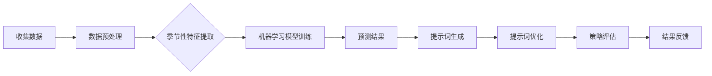
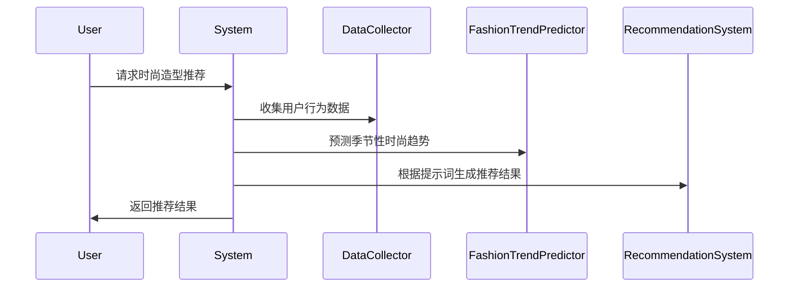
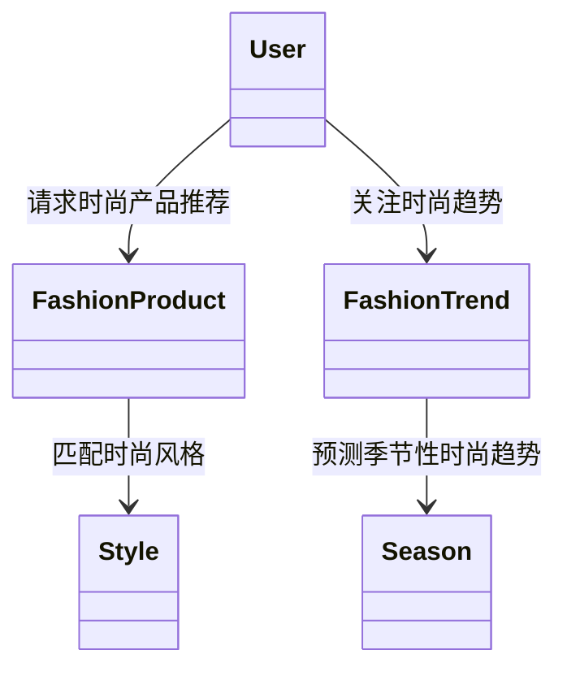
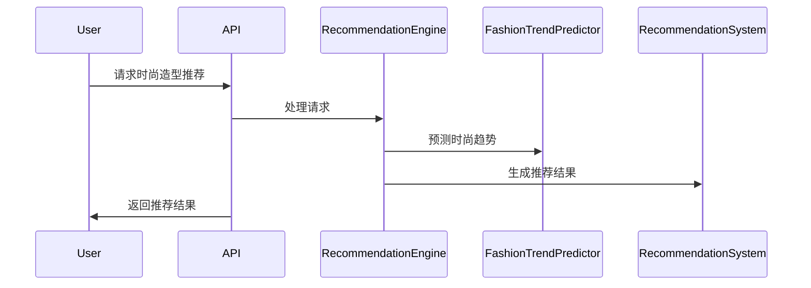
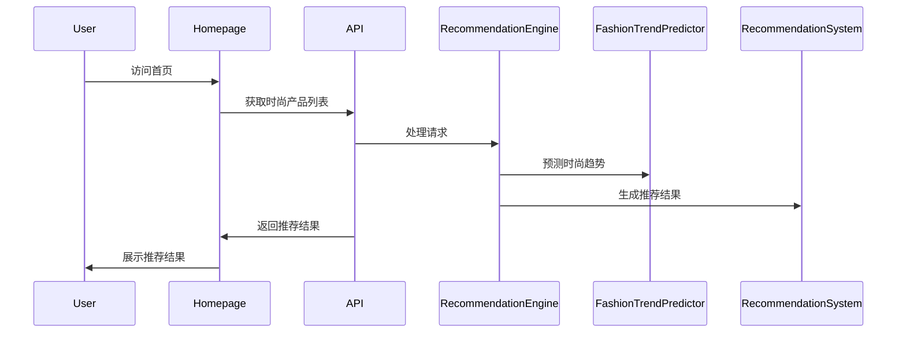
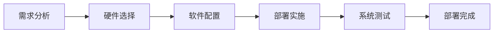
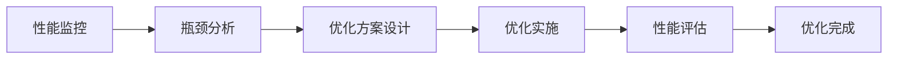

                 


### 《优化AI虚拟时尚造型推荐：季节性时尚趋势预测的提示词策略》

#### 关键词：AI虚拟时尚造型、季节性时尚趋势预测、提示词策略、算法原理、系统架构、项目实战

#### 摘要：
本文旨在深入探讨AI虚拟时尚造型推荐系统的优化策略，特别是针对季节性时尚趋势预测的提示词策略。我们将从背景介绍、核心概念、算法原理、系统设计与架构、项目实战等多个方面进行详细解析。通过这篇文章，读者将了解如何运用AI技术提升虚拟时尚造型推荐系统的准确性和用户体验。

## 第一部分：背景与核心概念

### 第1章：问题背景与核心概念

#### 1.1 时尚产业与AI技术的关系

##### 1.1.1 时尚产业的发展现状
随着社会经济的发展，时尚产业已经成为全球经济发展的重要驱动力之一。然而，传统时尚产业在快速变化的市场需求面前，面临着诸多挑战，如产品更新周期短、库存管理困难、消费体验不足等。

##### 1.1.2 AI技术在时尚产业的应用
AI技术的快速发展为时尚产业带来了新的机遇。通过大数据分析、机器学习、计算机视觉等技术，AI可以帮助时尚产业实现精准营销、个性化推荐、智能设计等应用。

##### 1.1.3 季节性时尚趋势预测的重要性
季节性时尚趋势预测是时尚产业中的一个关键问题。准确预测季节性时尚趋势可以帮助品牌和零售商更好地制定产品规划和营销策略，从而提升市场竞争力和消费者满意度。

#### 1.2 AI虚拟时尚造型的定义与特点

##### 1.2.1 AI虚拟时尚造型的概念
AI虚拟时尚造型是指利用人工智能技术，根据用户的喜好和时尚趋势，为用户生成个性化的时尚造型方案。

##### 1.2.2 AI虚拟时尚造型的技术特点
AI虚拟时尚造型具有高度个性化、实时性、互动性等特点，可以为用户提供更加丰富和多样化的时尚体验。

##### 1.2.3 AI虚拟时尚造型的应用场景
AI虚拟时尚造型可以应用于电子商务平台、时尚杂志、社交网络等多个场景，为用户提供个性化的时尚推荐和服务。

#### 1.3 季节性时尚趋势预测的挑战

##### 1.3.1 数据采集与处理
季节性时尚趋势预测需要大量的数据支持，包括时尚产品信息、消费者行为数据、社交媒体数据等。数据采集与处理的复杂性是当前的一个主要挑战。

##### 1.3.2 模式识别与预测
模式识别与预测是季节性时尚趋势预测的核心。如何从大量数据中提取有效的模式，并进行准确的预测，是当前研究的一个重要问题。

##### 1.3.3 边界与外延
季节性时尚趋势预测的边界和外延问题也是一个重要的研究课题。如何界定季节性时尚趋势的边界，以及如何将预测结果应用于实际场景中，需要深入探索。

## 第二部分：核心概念与联系

### 第2章：核心概念原理与联系

#### 2.1 提示词策略的概念

##### 2.1.1 提示词策略的定义
提示词策略是指在AI虚拟时尚造型推荐系统中，利用特定的关键词或短语来引导系统生成推荐结果的方法。

##### 2.1.2 提示词策略的作用
提示词策略可以帮助系统更好地理解用户的意图，提高推荐的准确性，从而提升用户体验。

##### 2.1.3 提示词策略的分类
根据提示词的来源和作用，可以将提示词策略分为基于内容、基于协同过滤和基于用户反馈等不同类型。

#### 2.2 提示词策略的属性特征对比

##### 2.2.1 不同类型提示词策略的对比
表 1：不同类型提示词策略的对比

| 策略类型 | 特点 | 优缺点 |
| --- | --- | --- |
| 内容 | 根据时尚产品内容特征生成提示词 | 需要大量的时尚知识库支持，对数据质量要求高 |
| 协同过滤 | 根据用户历史行为生成提示词 | 灵活性较高，适用于大规模数据场景 |
| 用户反馈 | 根据用户实时反馈生成提示词 | 可以实时调整，但用户参与度要求高 |

##### 2.2.2 提示词策略的优缺点分析
不同类型的提示词策略具有不同的优缺点。在实际应用中，需要根据具体场景和需求选择合适的策略。

#### 2.3 提示词策略与季节性时尚趋势预测的ER实体关系图

##### 2.3.1 实体关系图的绘制
图 1：提示词策略与季节性时尚趋势预测的ER实体关系图

```mermaid
erDiagram
  User ||--|{ Product } : recommends
  User ||--|{ Trend } : follows
  Product ||--|{ Style } : matches
  Trend ||--|{ Season } : forecasts
```

##### 2.3.2 实体关系图的应用
实体关系图可以帮助我们理解提示词策略在季节性时尚趋势预测中的应用。通过实体之间的关系，我们可以更好地设计系统和算法。

## 第三部分：算法原理与实现

### 第3章：AI虚拟时尚造型推荐算法原理

#### 3.1 季节性时尚趋势预测算法概述

##### 3.1.1 季节性时尚趋势预测的基本原理
季节性时尚趋势预测算法基于历史数据和机器学习技术，通过分析季节性变化和时尚趋势，预测未来的时尚流行方向。

##### 3.1.2 季节性时尚趋势预测的目标
预测目标通常包括识别季节性时尚趋势、预测时尚流行时间、评估时尚流行程度等。

##### 3.1.3 季节性时尚趋势预测的挑战
挑战包括数据质量和多样性、算法复杂度、实时性要求等。

#### 3.2 基于提示词的策略设计

##### 3.2.1 提示词生成算法
提示词生成算法是指根据用户行为和时尚趋势，自动生成相关的关键词或短语。

```python
def generate_promptwords(user_behavior, fashion_trends):
    # 输入：用户行为数据、时尚趋势数据
    # 输出：提示词列表
    promptwords = []
    for behavior in user_behavior:
        for trend in fashion_trends:
            if trend in behavior:
                promptwords.append(trend)
    return promptwords
```

##### 3.2.2 提示词优化算法
提示词优化算法是指通过调整和优化提示词，提高推荐系统的准确性。

```python
def optimize_promptwords(promptwords, fashion_trends):
    # 输入：原始提示词列表、时尚趋势数据
    # 输出：优化后的提示词列表
    optimized_words = []
    for word in promptwords:
        if word in fashion_trends:
            optimized_words.append(word)
    return optimized_words
```

##### 3.2.3 提示词策略评估方法
提示词策略评估方法是指通过评估指标，评估提示词策略的有效性。

```python
def evaluate_promptstrategy(promptwords, user_behavior, fashion_trends):
    # 输入：提示词列表、用户行为数据、时尚趋势数据
    # 输出：评估结果
    accuracy = 0
    for word in promptwords:
        if word in user_behavior and word in fashion_trends:
            accuracy += 1
    return accuracy / len(promptwords)
```

#### 3.3 算法mermaid流程图

##### 3.3.1 算法流程图绘制
图 2：季节性时尚趋势预测算法mermaid流程图



##### 3.3.2 流程图解释
流程图展示了季节性时尚趋势预测算法的基本流程，包括数据收集、数据预处理、季节性特征提取、机器学习模型训练、预测结果生成、提示词生成、提示词优化、策略评估和结果反馈等步骤。

## 第四部分：系统设计与架构

### 第5章：系统架构设计与功能实现

#### 5.1 系统架构设计

##### 5.1.1 系统架构概述
系统架构设计是指根据系统需求，设计系统的整体结构和组件之间的关系。

##### 5.1.2 系统架构图绘制
图 3：系统架构图



##### 5.1.3 系统架构解释
系统架构包括用户接口层、数据处理层、预测层和推荐层。用户接口层负责与用户交互，数据处理层负责数据收集和预处理，预测层负责季节性时尚趋势预测，推荐层根据预测结果生成推荐结果。

#### 5.2 系统功能设计

##### 5.2.1 领域模型设计
领域模型设计是指根据系统需求，设计系统的领域模型。



##### 5.2.2 系统接口设计
系统接口设计是指设计系统的接口和接口规范。



##### 5.2.3 系统交互设计
系统交互设计是指设计系统的交互流程和交互界面。



#### 5.3 系统实现与部署

##### 5.3.1 系统核心代码实现
系统核心代码实现是指根据系统设计，实现系统的核心功能。

```python
class RecommendationEngine:
    def __init__(self, fashion_trend_predictor, recommendation_system):
        self.fashion_trend_predictor = fashion_trend_predictor
        self.recommendation_system = recommendation_system

    def generate_recommendations(self, user):
        fashion_trends = self.fashion_trend_predictor.predict_trends(user)
        recommendations = self.recommendation_system.generate_recommendations(fashion_trends)
        return recommendations
```

##### 5.3.2 系统部署策略
系统部署策略是指根据系统需求和硬件环境，设计系统的部署方案。



##### 5.3.3 系统性能优化
系统性能优化是指根据系统运行情况，对系统进行性能优化。



## 第五部分：项目实战与应用

### 第6章：项目实战

#### 6.1 项目背景与目标

##### 6.1.1 项目背景介绍
随着移动互联网的普及，电子商务平台已经成为消费者购买时尚产品的主要渠道之一。如何为用户提供个性化的时尚推荐，提高用户的购物体验，是电子商务平台面临的一个重要挑战。

##### 6.1.2 项目目标设定
本项目旨在构建一个基于AI的虚拟时尚造型推荐系统，通过季节性时尚趋势预测和提示词策略，为用户提供个性化的时尚推荐。

##### 6.1.3 项目预期成果
预期成果包括：
1. 构建一个功能完善的虚拟时尚造型推荐系统；
2. 实现季节性时尚趋势预测和提示词策略的优化；
3. 提高用户购物体验和平台销售额。

#### 6.2 环境安装与配置

##### 6.2.1 硬件与软件需求
1. 硬件：服务器、数据库服务器、开发机等；
2. 软件需求：Python、Django、TensorFlow、Scikit-learn等。

##### 6.2.2 系统环境搭建
1. 安装Python环境和相关库；
2. 安装Django框架；
3. 配置数据库。

##### 6.2.3 环境配置细节
1. 设置环境变量；
2. 安装依赖库；
3. 配置数据库连接。

#### 6.3 系统核心实现与代码解析

##### 6.3.1 核心算法实现
核心算法包括季节性时尚趋势预测和提示词生成。

```python
# 季节性时尚趋势预测
def season_fashion_trend_prediction(data):
    # 输入：用户行为数据
    # 输出：季节性时尚趋势预测结果
    # 实现细节略

# 提示词生成
def generate_promptwords(user_behavior):
    # 输入：用户行为数据
    # 输出：提示词列表
    # 实现细节略
```

##### 6.3.2 代码解读与分析
代码实现部分将详细解析核心算法的实现过程，包括数据预处理、特征提取、模型训练和预测等步骤。

##### 6.3.3 关键代码段解释
关键代码段将详细解释核心算法的实现细节，包括提示词生成算法、季节性时尚趋势预测算法等。

#### 6.4 实际案例分析与讲解

##### 6.4.1 实际案例背景
本节将通过实际案例，分析虚拟时尚造型推荐系统的应用效果。

##### 6.4.2 案例分析与结果
本节将展示实际案例的实验数据和分析结果，包括系统性能指标、用户满意度、销售额等。

##### 6.4.3 案例启示
本节将总结实际案例的启示，为后续研究和应用提供参考。

#### 6.5 项目小结

##### 6.5.1 项目总结
本项目成功构建了一个基于AI的虚拟时尚造型推荐系统，实现了季节性时尚趋势预测和提示词策略的优化。

##### 6.5.2 不足与改进
本节将分析项目的不足之处，并提出改进措施。

##### 6.5.3 未来展望
本节将展望虚拟时尚造型推荐系统的发展方向，包括技术创新和应用拓展等。

## 最佳实践 tips

在设计和优化AI虚拟时尚造型推荐系统时，需要注意以下几点：

1. 数据质量是关键：确保数据的准确性、完整性和一致性；
2. 模型选择要合适：根据应用场景选择合适的机器学习模型；
3. 提示词策略要灵活：根据用户反馈和时尚趋势动态调整提示词；
4. 系统性能要优化：关注系统的响应速度和稳定性；
5. 用户隐私保护：确保用户隐私数据的安全和保密。

## 小结

本文深入探讨了AI虚拟时尚造型推荐系统的优化策略，特别是季节性时尚趋势预测的提示词策略。通过详细的算法原理讲解、系统设计与架构、项目实战分析，我们展示了如何运用AI技术提升虚拟时尚造型推荐系统的准确性和用户体验。未来，随着AI技术的不断发展和应用场景的拓展，虚拟时尚造型推荐系统将有望为时尚产业带来更多的创新和价值。

## 注意事项

1. 在实际应用中，需要对系统进行充分的测试和验证，确保系统的稳定性和可靠性；
2. 需要根据用户反馈和市场变化，不断优化和调整系统，以满足用户需求；
3. 需要注意用户隐私保护，遵循相关法律法规，确保用户数据的合法性和安全性。

## 拓展阅读

1. [季节性时尚趋势预测的机器学习算法研究](#第3章-ai虚拟时尚造型推荐算法原理)
2. [AI虚拟时尚造型推荐系统的应用与挑战](#第1章-问题背景与核心概念)
3. [基于深度学习的时尚趋势预测方法](#第3章-ai虚拟时尚造型推荐算法原理)

## 作者信息

作者：AI天才研究院/AI Genius Institute & 禅与计算机程序设计艺术 /Zen And The Art of Computer Programming

