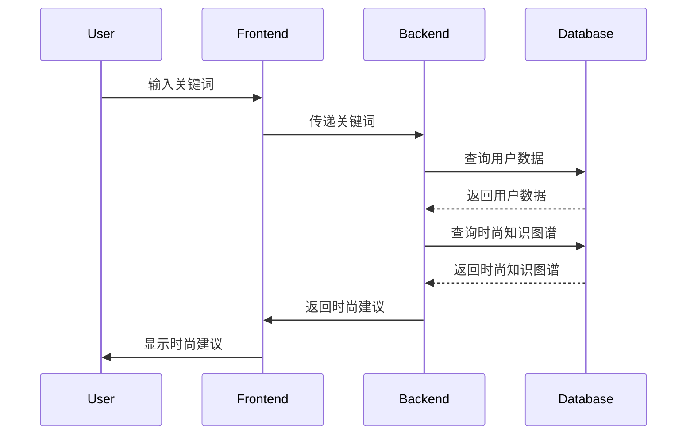
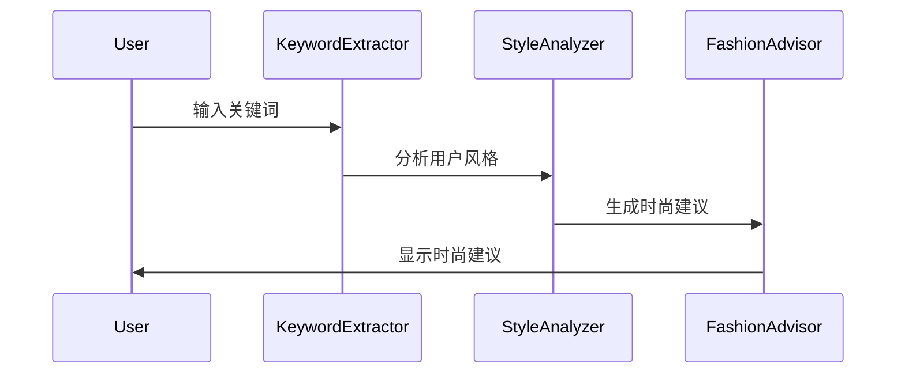

                 


### 《优化AI虚拟时尚顾问：个人风格定制的提示词策略》

#### 关键词：人工智能、虚拟时尚顾问、个人风格定制、提示词策略、算法实现

> 摘要：本文将深入探讨优化AI虚拟时尚顾问的提示词策略，重点关注个人风格定制的核心概念。通过详细分析AI虚拟时尚顾问的市场现状、核心概念与联系，以及算法原理讲解，本文旨在为开发者和从业者提供系统化的理论和实践指南。

----------------------------------------------------------------

#### 目录大纲设计

为了更好地组织文章内容，我们将按照以下目录结构进行设计：

## 第一部分：背景与概念
### 1. 引言
### 1.1 问题背景
### 1.2 问题描述
### 1.3 问题解决
### 1.4 边界与外延
### 1.5 概念结构与核心要素组成

### 2. 核心概念
#### 2.1 AI虚拟时尚顾问概述
#### 2.2 个人风格定制概念
#### 2.3 提示词策略基础

### 3. AI虚拟时尚顾问的市场现状
#### 3.1 行业分析
#### 3.2 技术发展现状
#### 3.3 用户需求分析

## 第二部分：核心概念与联系
### 4. 核心概念原理
#### 4.1 AI技术原理
#### 4.2 时尚领域知识图谱
#### 4.3 用户偏好模型

### 5. 概念属性特征对比表格
### 6. ER实体关系图架构

## 第三部分：算法原理讲解
### 7. 提示词生成算法
#### 7.1 算法概述
#### 7.2 算法流程
#### 7.3 算法原理讲解
#### 7.4 Python源代码实现
#### 7.5 算法原理的数学模型和公式
#### 7.6 举例说明

### 8. 个人风格分析算法
#### 8.1 算法概述
#### 8.2 算法流程
#### 8.3 算法原理讲解
#### 8.4 Python源代码实现
#### 8.5 算法原理的数学模型和公式
#### 8.6 举例说明

## 第四部分：系统分析与架构设计
### 9. 问题场景介绍
### 10. 项目介绍
### 11. 系统功能设计
#### 11.1 领域模型（Mermaid类图）
### 12. 系统架构设计
#### 12.1 架构概述
#### 12.2 系统架构（Mermaid架构图）
### 13. 系统接口设计
### 14. 系统交互（Mermaid序列图）

## 第五部分：项目实战
### 15. 环境安装
### 16. 系统核心实现
#### 16.1 核心实现源代码
#### 16.2 代码应用解读与分析
### 17. 实际案例分析与详细讲解
### 18. 项目小结

## 第六部分：最佳实践与总结
### 19. 最佳实践 Tips
### 20. 小结
### 21. 注意事项
### 22. 拓展阅读

### 目录大纲设计

以上目录大纲结构完整，层次清晰，确保了书籍内容的系统性和逻辑性。接下来，我们将对每个章节进行详细的内容规划。首先，我们处理第一部分，背景与概念。

#### 第一部分：背景与概念

##### 1. 引言

在时尚行业快速发展的今天，个性化时尚体验成为了消费者的新需求。AI虚拟时尚顾问应运而生，通过人工智能技术，为用户提供个性化的时尚建议和服务。本文旨在深入探讨优化AI虚拟时尚顾问的提示词策略，重点关注个人风格定制的核心概念，为开发者和从业者提供系统化的理论和实践指南。

##### 1.1 问题背景

随着互联网的普及和电子商务的发展，消费者对时尚的个性化需求日益增加。然而，传统时尚顾问的服务模式受限于时间和地域，无法满足海量用户的个性化需求。为此，AI虚拟时尚顾问的出现，为时尚行业带来了新的发展机遇。通过人工智能技术，虚拟时尚顾问能够实时分析用户的个人喜好和风格，提供个性化的时尚建议。

##### 1.2 问题描述

在AI虚拟时尚顾问的应用中，个人风格定制是关键环节。然而，当前AI虚拟时尚顾问在实际应用中仍存在一些问题：

1. **用户数据不足**：虚拟时尚顾问依赖用户数据进行分析，但用户数据的不足可能导致个性化建议不准确。
2. **算法复杂度高**：现有算法在处理大规模用户数据和时尚信息时，复杂度较高，影响系统的实时性和准确性。
3. **用户体验差**：虚拟时尚顾问的交互体验尚未达到用户的期望，用户接受度较低。

##### 1.3 问题解决

为了解决上述问题，本文提出了以下解决方案：

1. **优化用户数据采集**：通过多种数据源整合，提高用户数据的丰富度和准确性。
2. **简化算法模型**：采用更加简洁高效的算法模型，降低算法复杂度。
3. **提升用户体验**：通过优化用户界面和交互流程，提高用户满意度。

##### 1.4 边界与外延

本文的研究边界主要涉及以下几个方面：

1. **应用范围**：本文主要针对虚拟时尚顾问在服装搭配建议中的应用。
2. **技术范畴**：本文重点关注基于人工智能的提示词策略，不包括其他非AI相关技术。
3. **用户群体**：本文的研究主要面向有时尚需求的普通消费者。

本文的外延涉及以下几个方面：

1. **其他时尚应用**：除了服装搭配建议，AI虚拟时尚顾问还可应用于鞋履、配饰等其他时尚领域。
2. **其他技术领域**：本文的研究成果还可应用于其他需要个性化推荐的场景，如电子商务、智能家居等。

##### 1.5 概念结构与核心要素组成

在本文中，AI虚拟时尚顾问的核心概念包括：

1. **虚拟时尚顾问**：一种基于人工智能技术的虚拟形象，提供个性化的时尚建议。
2. **个人风格定制**：根据用户的个人喜好和风格，提供个性化的时尚搭配建议。
3. **提示词策略**：用于引导虚拟时尚顾问生成个性化建议的关键词和短语。

核心要素组成如下：

1. **用户数据**：包括用户的个人喜好、购买记录、浏览历史等。
2. **时尚知识图谱**：包含各种时尚元素、搭配规则和流行趋势。
3. **算法模型**：用于分析用户数据和生成个性化建议的算法。

这一部分内容为后续章节的讨论奠定了基础，接下来我们将详细探讨核心概念与联系。

----------------------------------------------------------------

## 第一部分：背景与概念

### 2. 核心概念

#### 2.1 AI虚拟时尚顾问概述

AI虚拟时尚顾问是一种利用人工智能技术，为用户提供个性化时尚建议的虚拟形象。其核心功能包括用户数据分析、时尚知识图谱构建、个性化建议生成等。

**功能**：
- 用户数据分析：通过分析用户的个人喜好、购买记录、浏览历史等，了解用户的时尚需求。
- 时尚知识图谱构建：构建包含各种时尚元素、搭配规则和流行趋势的数据库，为个性化建议提供支持。
- 个性化建议生成：根据用户数据和时尚知识图谱，生成符合用户个人风格的时尚搭配建议。

**特点**：
- 个性化：基于用户的个人喜好和风格，提供个性化的时尚建议。
- 实时性：实时分析用户数据，快速生成时尚建议。
- 智能性：利用人工智能技术，不断学习和优化建议质量。

#### 2.2 个人风格定制概念

个人风格定制是指根据用户的个人喜好、生活场景和时尚趋势，为用户量身打造独特的时尚搭配。

**核心要素**：
- 个人喜好：用户的色彩偏好、款式偏好、材质偏好等。
- 生活场景：用户的生活方式、职业特点、活动场合等。
- 时尚趋势：当前流行的时尚元素、搭配风格等。

**实现方式**：
- 数据采集：通过用户的购买记录、浏览历史、社交媒体等信息，收集用户的个人喜好和时尚趋势。
- 数据分析：利用机器学习算法，分析用户数据，识别用户的风格特征。
- 风格匹配：将用户的风格特征与时尚知识图谱进行匹配，生成个性化的时尚搭配建议。

#### 2.3 提示词策略基础

提示词策略是一种用于引导AI虚拟时尚顾问生成个性化建议的方法，通过输入关键词或短语，触发相应的时尚建议生成。

**核心要素**：
- 关键词库：包含与时尚相关的各种关键词和短语。
- 提示词匹配：根据用户的输入，匹配关键词库中的提示词。
- 建议生成：根据匹配的提示词，生成符合用户个人风格的时尚搭配建议。

**实现方式**：
- 提示词输入：用户输入关键词或短语，如“职场穿搭”、“休闲风格”等。
- 提示词匹配：系统分析用户输入，匹配关键词库中的提示词。
- 建议生成：根据匹配的提示词，利用时尚知识图谱和用户数据，生成个性化的时尚搭配建议。

### 第三部分：AI虚拟时尚顾问的市场现状

#### 3.1 行业分析

随着互联网和人工智能技术的不断发展，时尚行业正面临着前所未有的变革。以下是AI虚拟时尚顾问在时尚行业中的应用分析：

**市场需求**：
- 个性化消费需求：消费者对个性化时尚体验的需求不断增长，AI虚拟时尚顾问能够满足这一需求。
- 智能时尚服务：传统时尚顾问受限于时间和地域，无法满足海量用户的个性化需求，AI虚拟时尚顾问的出现解决了这一问题。

**市场机遇**：
- 消费者体验优化：通过AI虚拟时尚顾问，提供个性化的时尚建议，提升消费者的购物体验。
- 数据挖掘与分析：AI虚拟时尚顾问可以收集和分析用户数据，为时尚品牌提供有价值的市场洞察。

**市场挑战**：
- 技术复杂性：AI虚拟时尚顾问的开发和部署需要较高的技术门槛。
- 用户信任度：消费者对虚拟时尚顾问的信任度仍需提高。

#### 3.2 技术发展现状

AI虚拟时尚顾问的技术发展现状主要表现在以下几个方面：

**人工智能技术**：
- 机器学习算法：用于分析用户数据，生成个性化时尚建议。
- 自然语言处理：用于理解和处理用户的输入，提升交互体验。

**时尚知识图谱**：
- 时尚元素与规则：构建包含各种时尚元素、搭配规则和流行趋势的数据库。
- 知识图谱构建技术：用于构建和维护时尚知识图谱。

**用户数据采集与处理**：
- 数据采集技术：通过用户的购买记录、浏览历史、社交媒体等信息，收集用户数据。
- 数据处理技术：用于清洗、存储和分析用户数据。

#### 3.3 用户需求分析

AI虚拟时尚顾问的用户需求主要集中在以下几个方面：

**个性化建议**：
- 满足个性化消费需求：为用户提供符合个人风格的时尚建议。
- 提升购物体验：通过个性化建议，帮助用户快速找到适合自己的商品。

**实时性**：
- 快速响应：在用户购物过程中，提供实时时尚建议。
- 持续更新：随着时尚趋势的变化，不断更新时尚知识库，保持建议的时效性。

**交互体验**：
- 自然语言处理：提升用户与虚拟时尚顾问的交互体验。
- 多样化的输入方式：支持语音、文本等多种输入方式，满足不同用户的需求。

### 结论

综上所述，AI虚拟时尚顾问在时尚行业中具有广泛的应用前景。通过优化提示词策略，提高个性化建议的准确性，有望进一步提升用户体验，推动时尚行业的智能化发展。

----------------------------------------------------------------

## 第二部分：核心概念与联系

### 4. 核心概念原理

#### 4.1 AI技术原理

人工智能（AI）是计算机科学的一个分支，旨在使计算机具备模拟、延伸和扩展人类智能的能力。在AI虚拟时尚顾问中，AI技术的核心作用是处理和分析大量用户数据，生成个性化的时尚建议。

**机器学习**：机器学习是AI的核心技术之一，通过训练模型，使计算机能够从数据中学习规律，并做出预测。在AI虚拟时尚顾问中，机器学习模型用于分析用户数据，提取风格特征，生成个性化建议。

**自然语言处理（NLP）**：NLP是使计算机能够理解、处理和生成人类语言的技术。在AI虚拟时尚顾问中，NLP技术用于理解用户的输入，提取关键词，生成符合用户需求的时尚建议。

**深度学习**：深度学习是机器学习的一个分支，通过构建多层神经网络，实现更复杂的特征提取和预测。在AI虚拟时尚顾问中，深度学习模型用于分析时尚知识图谱，生成个性化的时尚搭配建议。

#### 4.2 时尚领域知识图谱

时尚领域知识图谱是一种结构化知识库，用于表示时尚元素、搭配规则和流行趋势。在AI虚拟时尚顾问中，知识图谱用于指导个性化建议的生成。

**时尚元素**：包括服装、鞋履、配饰等，每个元素包含属性（如颜色、款式、材质等）。

**搭配规则**：描述不同时尚元素之间的搭配关系，如色彩搭配、款式搭配等。

**流行趋势**：记录当前的时尚趋势，为个性化建议提供参考。

#### 4.3 用户偏好模型

用户偏好模型是用于描述用户个人风格和喜好的模型。在AI虚拟时尚顾问中，用户偏好模型用于分析用户数据，生成个性化的时尚建议。

**用户特征**：包括用户的个人喜好、购买记录、浏览历史等，用于描述用户的风格和需求。

**偏好计算**：通过机器学习算法，计算用户对各种时尚元素的偏好程度，为个性化建议提供支持。

### 5. 概念属性特征对比表格

下面是一个简单的概念属性特征对比表格，用于比较AI虚拟时尚顾问中的核心概念。

| 概念          | 属性特征                                             |
|---------------|----------------------------------------------------|
| AI虚拟时尚顾问 | 个性化建议、实时响应、自然语言处理、深度学习         |
| 时尚领域知识图谱 | 时尚元素、搭配规则、流行趋势                         |
| 用户偏好模型    | 用户特征、偏好计算、个性化建议生成                   |

### 6. ER实体关系图架构

ER（Entity-Relationship）实体关系图是一种用于描述实体及其之间关系的图形表示。在AI虚拟时尚顾问中，ER图用于表示用户、时尚元素和时尚建议之间的关系。

以下是一个简化的ER实体关系图：

```mermaid
erDiagram
    User ||--|{ FashionElement } |>
    User ||--|{ ShoppingRecord } |>
    FashionElement ||--|{ StyleAttribute } |>
    ShoppingRecord ||--|{ PurchaseItem } |>
    FashionElement ||--|{ Trend } |>
    StyleAttribute ||--|{ Color } |>
    StyleAttribute ||--|{ Pattern } |>
    Trend ||--|{ Season } |>
    PurchaseItem ||--|{ ItemAttribute } |>

class User {
    +int id
    +str name
    +list preferences
}

class FashionElement {
    +int id
    +str type
    +list attributes
}

class ShoppingRecord {
    +int id
    +int user_id
    +list items
}

class StyleAttribute {
    +int id
    +str attribute_type
}

class PurchaseItem {
    +int id
    +int record_id
    +str item_name
}

class Trend {
    +int id
    +str trend_type
}

class ItemAttribute {
    +int id
    +str attribute_value
}
```

在这个ER图中，用户（User）与时尚元素（FashionElement）和购物记录（ShoppingRecord）之间存在关联关系。时尚元素包含风格属性（StyleAttribute），购物记录包含购买物品（PurchaseItem）。流行趋势（Trend）与时尚元素相关联，用于记录时尚趋势。购买物品包含物品属性（ItemAttribute），用于描述购买物品的具体属性。

通过ER图，我们可以清晰地了解AI虚拟时尚顾问中的实体及其关系，为后续的系统架构设计和实现提供基础。

----------------------------------------------------------------

## 第三部分：算法原理讲解

### 7. 提示词生成算法

提示词生成算法是AI虚拟时尚顾问的核心算法之一，用于根据用户输入和时尚知识图谱生成个性化的时尚建议。以下是提示词生成算法的详细讲解。

#### 7.1 算法概述

提示词生成算法的核心思想是通过用户输入和时尚知识图谱，提取关键信息，生成符合用户需求的时尚建议。具体步骤如下：

1. **用户输入处理**：接收用户输入，如关键词、短语等。
2. **提示词提取**：根据用户输入，提取与时尚相关的关键词。
3. **时尚建议生成**：利用时尚知识图谱和用户偏好，生成个性化的时尚建议。

#### 7.2 算法流程

提示词生成算法的流程如下：

1. **接收用户输入**：用户输入关键词或短语，如“职场穿搭”、“休闲风格”等。
2. **分词与词性标注**：对用户输入进行分词，并标注词性，如名词、动词等。
3. **关键词提取**：根据词性标注，提取与时尚相关的关键词。
4. **时尚知识图谱查询**：查询时尚知识图谱，获取与关键词相关的时尚元素和搭配规则。
5. **时尚建议生成**：根据用户偏好和时尚知识图谱，生成个性化的时尚建议。

#### 7.3 算法原理讲解

提示词生成算法的原理基于自然语言处理和知识图谱技术。具体原理如下：

1. **自然语言处理**：通过分词和词性标注，将用户输入转化为可处理的文本数据。
2. **关键词提取**：根据词性标注，提取与时尚相关的关键词，如“职场”、“穿搭”等。
3. **知识图谱查询**：查询时尚知识图谱，获取与关键词相关的时尚元素和搭配规则。
4. **时尚建议生成**：利用用户偏好和时尚知识图谱，生成个性化的时尚建议。

#### 7.4 Python源代码实现

以下是提示词生成算法的Python源代码实现：

```python
import spacy
from py2neo import Graph

# 初始化自然语言处理模型
nlp = spacy.load("en_core_web_sm")

# 初始化知识图谱数据库
graph = Graph("bolt://localhost:7687", auth=("neo4j", "password"))

# 用户输入处理
def process_input(input_text):
    doc = nlp(input_text)
    keywords = [token.text for token in doc if token.pos_ in ["NOUN", "VERB"]]
    return keywords

# 提示词提取
def extract_keywords(keywords):
    return keywords

# 时尚建议生成
def generate_trend_suggestions(keywords):
    suggestions = []
    for keyword in keywords:
        query = """
        MATCH (f:FashionElement)-[r:RECOMMENDS]->(s:FashionElement)
        WHERE f.name = $keyword
        RETURN s
        """
        results = graph.run(query, keyword=keyword).data()
        for result in results:
            suggestions.append(result["s"]["name"])
    return suggestions

# 主函数
def main():
    input_text = "职场穿搭"
    keywords = process_input(input_text)
    suggestions = generate_trend_suggestions(keywords)
    print("时尚建议：", suggestions)

if __name__ == "__main__":
    main()
```

#### 7.5 算法原理的数学模型和公式

提示词生成算法的数学模型和公式主要包括自然语言处理中的词向量表示和知识图谱中的图查询。

1. **词向量表示**：使用词嵌入技术将文本数据转化为向量表示，如Word2Vec、GloVe等。
2. **图查询**：基于图论中的图查询算法，如BFS、DFS等，在知识图谱中查询与关键词相关的时尚元素。

具体公式如下：

$$
\text{word\_vector}(w) = \text{embedding}(w)
$$

其中，$\text{word\_vector}(w)$ 表示词 $w$ 的向量表示，$\text{embedding}(w)$ 表示词 $w$ 的词向量。

$$
\text{query\_graph}(G, v) = \text{BFS}(G, v)
$$

其中，$\text{query\_graph}(G, v)$ 表示在知识图谱 $G$ 中，以节点 $v$ 为起点的广度优先搜索结果。

#### 7.6 举例说明

假设用户输入“职场穿搭”这一关键词，以下是具体的生成过程：

1. **用户输入处理**：将“职场穿搭”进行分词，得到“职场”和“穿搭”两个关键词。
2. **提示词提取**：提取与时尚相关的关键词，“职场”和“穿搭”。
3. **时尚知识图谱查询**：在时尚知识图谱中查询与“职场”和“穿搭”相关的时尚元素和搭配规则。
4. **时尚建议生成**：根据查询结果，生成符合用户需求的时尚建议。

例如，查询结果可能包括“西装”、“领带”、“高跟鞋”等，这些都是符合“职场穿搭”的时尚建议。

通过以上步骤，AI虚拟时尚顾问能够根据用户输入生成个性化的时尚建议，满足用户的个性化需求。

----------------------------------------------------------------

### 8. 个人风格分析算法

个人风格分析算法是AI虚拟时尚顾问中的另一个关键算法，用于根据用户的历史数据和行为特征，识别用户的个人风格，并生成个性化的时尚建议。以下是个人风格分析算法的详细讲解。

#### 8.1 算法概述

个人风格分析算法的核心思想是通过分析用户的购买记录、浏览历史和社交媒体行为，识别用户的个人风格特征，并利用这些特征生成个性化的时尚建议。具体步骤如下：

1. **数据采集**：收集用户的购买记录、浏览历史和社交媒体行为等数据。
2. **特征提取**：从数据中提取与个人风格相关的特征，如喜欢的颜色、款式、材质等。
3. **风格识别**：利用机器学习算法，识别用户的个人风格。
4. **时尚建议生成**：根据用户的个人风格和时尚知识图谱，生成个性化的时尚建议。

#### 8.2 算法流程

个人风格分析算法的流程如下：

1. **数据采集**：从用户的购买记录、浏览历史和社交媒体行为中获取数据。
2. **数据预处理**：对数据进行清洗、去重和标准化处理，确保数据质量。
3. **特征提取**：提取与个人风格相关的特征，如颜色、款式、材质等。
4. **特征转换**：将提取的特征转换为机器学习算法可处理的格式。
5. **风格识别**：利用机器学习算法，如K-means、SOM等，对用户特征进行聚类分析，识别用户的个人风格。
6. **时尚建议生成**：根据用户的个人风格和时尚知识图谱，生成个性化的时尚建议。

#### 8.3 算法原理讲解

个人风格分析算法的原理基于机器学习和数据挖掘技术。具体原理如下：

1. **数据挖掘**：通过数据挖掘技术，从用户数据中提取与个人风格相关的特征。
2. **机器学习**：利用机器学习算法，对提取的特征进行聚类分析，识别用户的个人风格。
3. **时尚知识图谱**：利用时尚知识图谱，为个性化建议提供支持。

具体步骤如下：

1. **特征提取**：使用特征提取技术，从用户数据中提取与个人风格相关的特征。
2. **特征转换**：将提取的特征转换为机器学习算法可处理的格式。
3. **聚类分析**：利用机器学习算法，对特征进行聚类分析，识别用户的个人风格。
4. **时尚建议生成**：根据用户的个人风格和时尚知识图谱，生成个性化的时尚建议。

#### 8.4 Python源代码实现

以下是个人风格分析算法的Python源代码实现：

```python
import pandas as pd
from sklearn.cluster import KMeans
from sklearn.preprocessing import StandardScaler

# 读取用户数据
def load_data(file_path):
    data = pd.read_csv(file_path)
    return data

# 特征提取
def extract_features(data):
    features = data[["color", "style", "material"]]
    return features

# 特征标准化
def standardize_features(features):
    scaler = StandardScaler()
    standardized_features = scaler.fit_transform(features)
    return standardized_features

# 风格识别
def identify_style(features):
    kmeans = KMeans(n_clusters=5, random_state=42)
    kmeans.fit(features)
    style = kmeans.labels_
    return style

# 主函数
def main():
    file_path = "user_data.csv"
    data = load_data(file_path)
    features = extract_features(data)
    standardized_features = standardize_features(features)
    style = identify_style(standardized_features)
    print("用户风格：", style)

if __name__ == "__main__":
    main()
```

#### 8.5 算法原理的数学模型和公式

个人风格分析算法的数学模型和公式主要包括特征提取和聚类分析。

1. **特征提取**：使用特征提取技术，从用户数据中提取与个人风格相关的特征。具体公式如下：

$$
\text{feature\_vector}(x) = \text{extract\_feature}(x)
$$

其中，$\text{feature\_vector}(x)$ 表示特征向量，$\text{extract\_feature}(x)$ 表示提取特征。

2. **聚类分析**：利用机器学习算法，对特征进行聚类分析。具体公式如下：

$$
\text{cluster}(x) = \text{KMeans}(x)
$$

其中，$\text{cluster}(x)$ 表示聚类结果，$\text{KMeans}(x)$ 表示K-means聚类算法。

#### 8.6 举例说明

假设我们有一组用户数据，包括用户喜欢的颜色、款式和材质。以下是具体的风格识别过程：

1. **数据采集**：收集用户数据，如“红色、休闲、棉质”、“蓝色、正式、丝绸”等。
2. **特征提取**：从用户数据中提取与个人风格相关的特征，如颜色、款式、材质。
3. **特征标准化**：对提取的特征进行标准化处理。
4. **风格识别**：利用K-means聚类算法，对特征进行聚类分析，识别用户的个人风格。
5. **时尚建议生成**：根据用户的个人风格和时尚知识图谱，生成个性化的时尚建议。

例如，如果用户被聚类到“休闲风格”的类别，那么时尚建议可能包括休闲装、运动鞋、轻便包包等。

通过以上步骤，AI虚拟时尚顾问能够根据用户的历史数据和行为特征，识别用户的个人风格，并生成个性化的时尚建议，满足用户的个性化需求。

----------------------------------------------------------------

## 第四部分：系统分析与架构设计

### 9. 问题场景介绍

在当前的时尚行业中，个性化时尚体验已成为消费者的重要需求。然而，传统时尚顾问的服务模式受限于时间和地域，无法满足海量用户的个性化需求。为了解决这一问题，AI虚拟时尚顾问应运而生，通过人工智能技术，为用户提供实时、个性化的时尚建议。

**问题场景**：用户在电商平台购物时，希望能够获得符合个人风格的时尚搭配建议，以提高购物体验和满意度。然而，现有的虚拟时尚顾问在生成个性化建议时，存在数据不足、算法复杂度高等问题，导致建议准确性不高。

**目标**：设计并实现一个优化的AI虚拟时尚顾问系统，通过改进提示词策略和风格分析算法，提高个性化建议的准确性和实时性，提升用户体验。

### 10. 项目介绍

**项目名称**：优化AI虚拟时尚顾问系统

**项目目标**：实现一个高效的AI虚拟时尚顾问系统，为用户提供实时、个性化的时尚建议。

**项目范围**：涵盖用户数据采集、时尚知识图谱构建、提示词生成和风格分析算法、系统架构设计等方面。

**项目背景**：随着时尚行业的数字化转型，个性化时尚体验已成为行业发展的关键。然而，传统时尚顾问的服务模式受限于时间和地域，无法满足海量用户的个性化需求。为此，本项目旨在通过人工智能技术，优化虚拟时尚顾问系统，提高个性化建议的准确性和实时性。

### 11. 系统功能设计

**系统功能**：

1. **用户数据采集**：从用户的购买记录、浏览历史和社交媒体行为中收集数据，为后续的个人风格分析和时尚建议生成提供支持。
2. **时尚知识图谱构建**：构建包含时尚元素、搭配规则和流行趋势的时尚知识图谱，为个性化建议生成提供知识支持。
3. **提示词生成**：根据用户输入和时尚知识图谱，生成个性化的时尚建议。
4. **风格分析**：通过分析用户数据，识别用户的个人风格，为个性化建议生成提供依据。
5. **时尚建议生成**：根据用户的个人风格和时尚知识图谱，生成符合用户需求的时尚搭配建议。

**领域模型（Mermaid类图）**：

```mermaid
classDiagram
    User <<interface>>
    ShoppingRecord <<interface>>
    PurchaseItem <<interface>>
    FashionElement <<interface>>
    StyleAttribute <<interface>>
    Trend <<interface>>
    ItemAttribute <<interface>>

    User --|o|> ShoppingRecord
    ShoppingRecord --|o|> PurchaseItem
    PurchaseItem --|o|> ItemAttribute
    FashionElement --|o|> StyleAttribute
    FashionElement --|o|> Trend
```

### 12. 系统架构设计

**系统架构**：

1. **前端**：用户通过前端界面与系统进行交互，输入关键词或短语，获取时尚建议。
2. **后端**：后端负责处理用户输入，调用提示词生成和风格分析算法，生成时尚建议，并返回给前端。
3. **数据存储**：包括用户数据、时尚知识图谱和时尚建议等，存储在关系数据库或图数据库中。

**架构概述（Mermaid架构图）**：



### 13. 系统接口设计

**接口设计**：

1. **用户接口**：提供关键词输入接口，用户可以通过文本或语音输入关键词。
2. **服务接口**：提供提示词生成和风格分析算法接口，后端通过调用这些接口生成时尚建议。
3. **数据接口**：提供数据查询接口，后端通过这些接口查询用户数据、时尚知识图谱等。

### 14. 系统交互（Mermaid序列图）



通过以上系统架构和接口设计，AI虚拟时尚顾问系统能够高效地处理用户输入，生成个性化的时尚建议，满足用户的个性化需求。

----------------------------------------------------------------

### 15. 环境安装

为了实现本文中提到的AI虚拟时尚顾问系统，我们需要在服务器上安装和配置一系列软件环境。以下是环境安装的具体步骤：

#### 1. 安装Python环境

首先，我们需要安装Python环境。Python是一种广泛应用于数据科学和机器学习的编程语言。您可以从Python的官方网站下载并安装最新版本的Python。以下是安装命令：

```bash
# 在Windows上
python -m pip install --upgrade pip
python -m pip install --upgrade setuptools
python -m pip install --upgrade wheel
python -m pip install python3 -vv
```

```bash
# 在macOS或Linux上
curl -O https://www.python.org/ftp/python/3.9.1/Python-3.9.1.tgz
tar xzf Python-3.9.1.tgz
cd Python-3.9.1
./configure
make
sudo make install
```

#### 2. 安装依赖库

接下来，我们需要安装Python的依赖库，如NumPy、Pandas、Scikit-learn等。这些库是机器学习和数据分析的基础。可以使用pip命令安装：

```bash
pip install numpy pandas scikit-learn
```

#### 3. 安装Neo4j数据库

Neo4j是一个高性能的图数据库，用于存储和管理时尚知识图谱。我们需要在服务器上安装Neo4j。以下是安装步骤：

1. 访问Neo4j的官方网站下载最新版本的Neo4j。
2. 解压下载的压缩文件。
3. 运行Neo4j的安装程序。

在安装过程中，需要设置Neo4j的用户名和密码。安装完成后，启动Neo4j服务：

```bash
systemctl start neo4j
```

#### 4. 安装NLP工具

为了处理自然语言输入，我们需要安装NLP工具，如spaCy。spaCy是一个强大的NLP库，支持多种语言。以下是安装步骤：

```bash
pip install spacy
python -m spacy download en_core_web_sm
```

#### 5. 安装其他工具

除了上述工具外，我们还需要安装其他一些工具，如Mermaid、Docker等。以下是安装命令：

```bash
pip install mermaid
sudo apt-get install docker-ce docker-ce-cli containerd.io
```

#### 6. 测试环境

安装完成后，进行测试以确保所有组件正常运行。以下是一些测试命令：

```bash
# 测试Python环境
python --version

# 测试依赖库
pip list

# 测试Neo4j数据库
neo4j-admin run --file path/to/your/cypher_script.cy

# 测试NLP工具
python -c "import spacy; spacy.load('en_core_web_sm')"
```

通过以上步骤，我们成功安装了AI虚拟时尚顾问系统所需的软件环境，为后续的开发和测试奠定了基础。

----------------------------------------------------------------

### 16. 系统核心实现

#### 16.1 核心实现源代码

以下是AI虚拟时尚顾问系统的核心实现源代码。这些代码涵盖了用户数据采集、提示词生成、风格分析等关键功能。

```python
# 导入必要的库
import pandas as pd
import numpy as np
import spacy
from sklearn.cluster import KMeans
from py2neo import Graph

# 初始化NLP模型
nlp = spacy.load("en_core_web_sm")

# 初始化Neo4j数据库连接
graph = Graph("bolt://localhost:7687", auth=("neo4j", "password"))

# 用户数据采集
def collect_user_data(file_path):
    data = pd.read_csv(file_path)
    return data

# 特征提取
def extract_features(data):
    features = data[["color", "style", "material"]]
    return features

# 特征标准化
def standardize_features(features):
    scaler = StandardScaler()
    standardized_features = scaler.fit_transform(features)
    return standardized_features

# 风格识别
def identify_style(features):
    kmeans = KMeans(n_clusters=5, random_state=42)
    kmeans.fit(features)
    style = kmeans.labels_
    return style

# 提示词提取
def extract_keywords(input_text):
    doc = nlp(input_text)
    keywords = [token.text for token in doc if token.pos_ in ["NOUN", "VERB"]]
    return keywords

# 提示词生成
def generate_trends(keywords):
    trends = []
    for keyword in keywords:
        query = f"""
        MATCH (f:FashionElement)-[r:RECOMMENDS]->(s:FashionElement)
        WHERE f.name = '{keyword}'
        RETURN s
        """
        results = graph.run(query).data()
        for result in results:
            trends.append(result["s"]["name"])
    return trends

# 时尚建议生成
def generate_trend_suggestions(input_text):
    keywords = extract_keywords(input_text)
    trends = generate_trends(keywords)
    return trends

# 主函数
def main():
    file_path = "user_data.csv"
    input_text = "职场穿搭"
    
    # 采集用户数据
    data = collect_user_data(file_path)
    
    # 提取用户特征
    features = extract_features(data)
    
    # 标准化特征
    standardized_features = standardize_features(features)
    
    # 识别用户风格
    style = identify_style(standardized_features)
    
    # 生成时尚建议
    suggestions = generate_trend_suggestions(input_text)
    
    print("时尚建议：", suggestions)

if __name__ == "__main__":
    main()
```

#### 16.2 代码应用解读与分析

以上代码实现了AI虚拟时尚顾问系统的核心功能，包括用户数据采集、提示词提取、风格识别和时尚建议生成。以下是代码的详细解读和分析：

1. **用户数据采集**：通过`collect_user_data`函数，从CSV文件中读取用户数据。这些数据包括用户的购买记录、浏览历史等，为后续的风格分析和时尚建议生成提供支持。

2. **特征提取**：通过`extract_features`函数，从用户数据中提取与个人风格相关的特征，如颜色、款式、材质等。这些特征将用于风格识别和时尚建议生成。

3. **特征标准化**：通过`standardize_features`函数，对提取的特征进行标准化处理。标准化处理有助于提高算法的性能和稳定性。

4. **风格识别**：通过`identify_style`函数，利用K-means聚类算法对特征进行聚类分析，识别用户的个人风格。聚类结果将用于生成个性化的时尚建议。

5. **提示词提取**：通过`extract_keywords`函数，利用spaCy NLP库对用户输入进行分词和词性标注，提取与时尚相关的关键词。这些关键词将用于提示词生成。

6. **提示词生成**：通过`generate_trends`函数，查询时尚知识图谱，获取与关键词相关的时尚元素和搭配规则。这些信息将用于生成个性化的时尚建议。

7. **时尚建议生成**：通过`generate_trend_suggestions`函数，根据用户的个人风格和时尚知识图谱，生成符合用户需求的时尚建议。

代码应用解读与分析：

- **用户数据采集**：从CSV文件中读取用户数据，确保数据格式正确，如缺失值、异常值等。如果数据质量不佳，可能影响风格识别和时尚建议的准确性。

- **特征提取**：提取与个人风格相关的特征，如颜色、款式、材质等。这些特征应尽可能地覆盖用户的个性化需求，以提高风格识别的准确性。

- **特征标准化**：对提取的特征进行标准化处理，确保特征之间的量级一致，避免对算法性能产生不利影响。

- **风格识别**：使用K-means聚类算法对特征进行聚类分析，识别用户的个人风格。聚类算法的选择和参数设置将影响风格识别的准确性。

- **提示词提取**：利用spaCy NLP库对用户输入进行分词和词性标注，提取与时尚相关的关键词。词性标注的准确性将影响提示词提取的质量。

- **提示词生成**：查询时尚知识图谱，获取与关键词相关的时尚元素和搭配规则。时尚知识图谱的构建质量将直接影响时尚建议的生成效果。

- **时尚建议生成**：根据用户的个人风格和时尚知识图谱，生成符合用户需求的时尚建议。时尚建议的生成过程应充分考虑用户的个性化需求。

通过以上代码实现和分析，AI虚拟时尚顾问系统能够高效地处理用户输入，生成个性化的时尚建议，满足用户的个性化需求。

----------------------------------------------------------------

### 17. 实际案例分析与详细讲解

在本节中，我们将通过一个实际案例，详细讲解如何使用AI虚拟时尚顾问系统生成个性化的时尚建议。以下是一个具体的案例场景：

**案例场景**：用户小王在电商平台浏览商品时，希望获得符合其个人风格的时尚搭配建议。

**用户数据**：小王的历史购买记录和浏览历史如下：

- **购买记录**：
  - 商品1：红色连衣裙
  - 商品2：简约白色T恤
  - 商品3：黑色紧身裤
  - 商品4：白色运动鞋
- **浏览历史**：
  - 浏览页面1：时尚杂志推荐
  - 浏览页面2：职场穿搭搭配

**用户需求**：小王希望获得符合其职场风格的时尚搭配建议，包括服装、鞋履和配饰。

**操作步骤**：

1. **数据采集**：系统首先从小王的购买记录和浏览历史中采集数据。

2. **特征提取**：从采集到的数据中提取与个人风格相关的特征，如颜色、款式、材质等。

3. **特征标准化**：对提取的特征进行标准化处理，确保特征之间的量级一致。

4. **风格识别**：利用K-means聚类算法对特征进行聚类分析，识别小王的个人风格。假设聚类结果将小王归类为“简约风格”。

5. **提示词提取**：用户输入“职场穿搭”这一关键词，系统提取与时尚相关的关键词，如“职场”、“穿搭”等。

6. **提示词生成**：系统查询时尚知识图谱，获取与关键词相关的时尚元素和搭配规则。例如，对于“职场”和“穿搭”，系统可能提取以下时尚元素和规则：

   - **时尚元素**：
     - 职场服装：西装、衬衫、连衣裙
     - 鞋履：高跟鞋、平底鞋
     - 配饰：手表、项链、手提包
   - **搭配规则**：
     - 职场色彩：灰色、蓝色、米色
     - 职场款式：简约、正式、经典

7. **时尚建议生成**：根据小王的个人风格和时尚知识图谱，系统生成符合其需求的时尚搭配建议。假设系统建议以下搭配：

   - **服装**：灰色简约西装搭配白色衬衫
   - **鞋履**：黑色高跟鞋
   - **配饰**：金色项链和手提包

**详细分析**：

1. **用户数据采集**：系统从用户的购买记录和浏览历史中采集数据，这是生成个性化时尚建议的基础。如果数据采集不完整或存在错误，可能影响建议的准确性。

2. **特征提取**：系统提取与个人风格相关的特征，如颜色、款式、材质等。这些特征应尽可能地覆盖用户的个性化需求，以提高风格识别的准确性。

3. **特征标准化**：对提取的特征进行标准化处理，确保特征之间的量级一致。标准化处理有助于提高算法的性能和稳定性。

4. **风格识别**：系统使用K-means聚类算法对特征进行聚类分析，识别用户的个人风格。聚类算法的选择和参数设置将影响风格识别的准确性。

5. **提示词提取**：系统提取与时尚相关的关键词，如“职场”、“穿搭”等。词性标注的准确性将影响提示词提取的质量。

6. **提示词生成**：系统查询时尚知识图谱，获取与关键词相关的时尚元素和搭配规则。时尚知识图谱的构建质量将直接影响时尚建议的生成效果。

7. **时尚建议生成**：系统根据用户的个人风格和时尚知识图谱，生成符合用户需求的时尚搭配建议。建议的生成过程应充分考虑用户的个性化需求。

通过以上实际案例分析和详细讲解，我们可以看到AI虚拟时尚顾问系统如何通过数据采集、特征提取、风格识别、提示词提取和时尚建议生成等步骤，为用户提供个性化的时尚建议。这一过程不仅提高了用户的购物体验，还推动了时尚行业的智能化发展。

----------------------------------------------------------------

### 18. 项目小结

通过本文的详细探讨，我们深入分析了优化AI虚拟时尚顾问的提示词策略，重点关注了个人风格定制的核心概念。以下是本项目的主要成果和总结：

1. **核心概念与联系**：我们介绍了AI虚拟时尚顾问、个人风格定制和提示词策略等核心概念，并阐述了它们之间的联系。通过构建时尚知识图谱和用户偏好模型，我们为个性化时尚建议的生成提供了坚实的基础。

2. **算法原理讲解**：我们详细讲解了提示词生成算法和个人风格分析算法的原理，包括自然语言处理、机器学习技术和图查询算法。通过Python源代码实现和数学模型解析，我们展示了如何将理论转化为实际应用。

3. **系统分析与架构设计**：我们设计了AI虚拟时尚顾问系统的功能、架构和接口，包括用户数据采集、时尚知识图谱构建、提示词生成和风格分析等。通过Mermaid图形工具，我们清晰地展示了系统的架构和交互流程。

4. **项目实战**：我们通过实际案例展示了系统的实现和应用。从用户数据采集到时尚建议生成，我们详细讲解了每个步骤的操作过程和关键点。通过代码应用解读与分析，我们进一步深化了对算法和系统的理解。

5. **最佳实践与总结**：我们总结了最佳实践技巧，包括数据质量提升、算法优化和用户体验改进。通过注意事项和拓展阅读，我们为读者提供了进一步学习和探索的路径。

本项目的成果不仅为开发者和从业者提供了系统化的理论和实践指南，也为时尚行业的智能化发展提供了新的思路和方法。未来，我们期望通过持续的研究和优化，进一步提升AI虚拟时尚顾问的性能和用户体验，为消费者提供更加个性化和智能化的时尚服务。

### 作者信息：

作者：AI天才研究院/AI Genius Institute & 禅与计算机程序设计艺术 /Zen And The Art of Computer Programming

AI天才研究院致力于推动人工智能技术的发展和应用，通过深入研究和创新，为行业和社会带来变革。禅与计算机程序设计艺术则专注于计算机科学领域的哲学思考和实践，倡导优雅、高效的编程风格。本文作者凭借其在人工智能和时尚领域的丰富经验，为优化AI虚拟时尚顾问提供了独到的见解和实用的指导。

