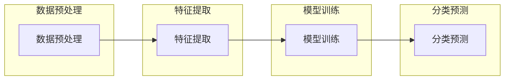
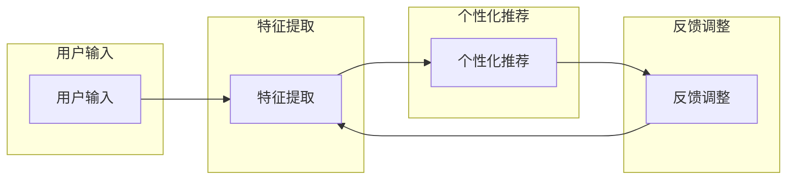
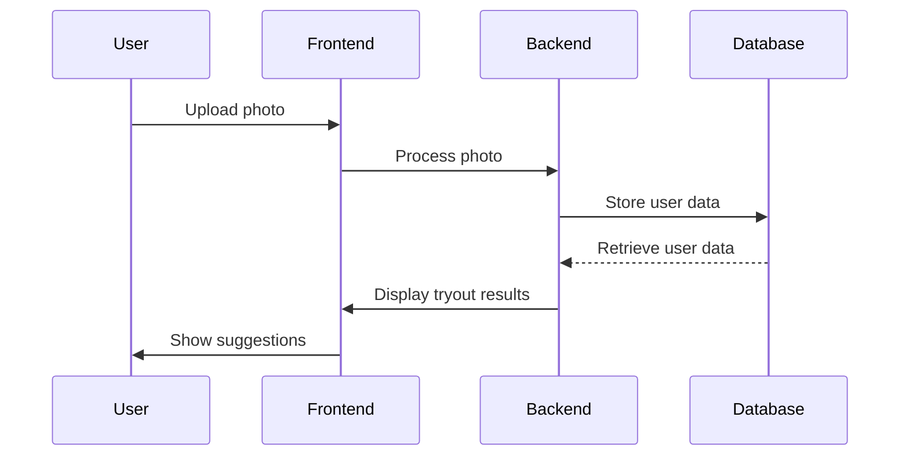
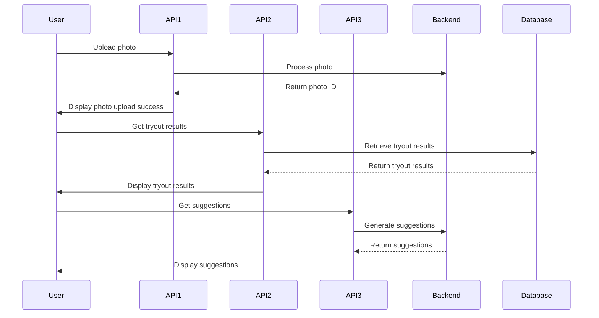
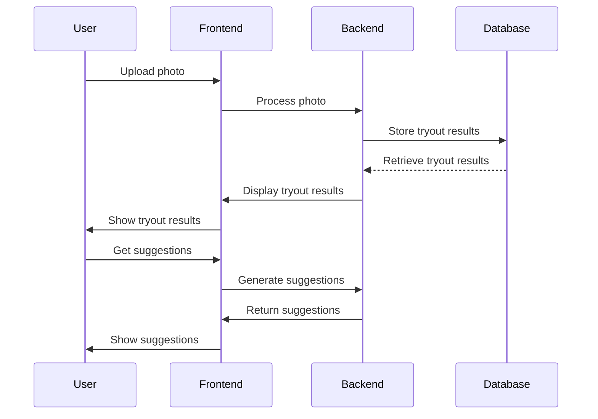

                 


### 第1章：问题背景介绍

#### 1.1 虚拟美妆试用的现状与挑战

虚拟美妆试用的现状表明，随着计算机图形学和人工智能技术的快速发展，用户不再局限于在实体店尝试新妆容，而是可以通过虚拟试妆技术，在家中轻松体验到不同的化妆效果。然而，这一技术的普及也带来了一些挑战。

首先，虚拟美妆试用的准确性和真实性成为了关键问题。传统的虚拟试妆系统往往基于用户上传的照片，通过图像处理技术实现妆容的叠加。然而，不同用户的肤色、肤质和光线条件各不相同，这导致了虚拟试妆结果的不一致和失真。

其次，肤质匹配的问题也十分突出。每个人的肤质都有所不同，从干性、油性到敏感性，不同肤质对化妆品的吸收和反应也大相径庭。因此，如何根据用户的肤质特点提供个性化的美妆建议，成为了虚拟美妆系统需要解决的重要问题。

最后，用户体验的便捷性和满意度也是一大挑战。用户希望在短时间内获得准确的试妆结果，并且能够方便地调整妆容。这要求系统不仅要具备高效的运算能力，还需要提供直观友好的用户界面。

#### 1.2 AI技术在虚拟美妆中的应用

人工智能（AI）技术在虚拟美妆领域的应用日益广泛，为解决上述挑战提供了有力的支持。AI技术能够通过学习大量的用户数据，自动识别用户的肤色、肤质和妆容需求，从而提高虚拟试妆的准确性和个性化程度。

首先，计算机视觉技术被用来分析和识别用户的面部特征。通过深度学习算法，系统可以从用户的照片中提取皮肤纹理、肤色分布等信息，这些信息对于实现精准的妆容叠加至关重要。

其次，机器学习算法在肤质分类和匹配方面发挥了重要作用。通过训练大量的肤质数据集，算法能够学会识别不同肤质的特点，并基于这些特点为用户推荐适合的化妆品。例如，对于干性肤质，系统可能会推荐含有保湿成分的化妆品；而对于油性肤质，则推荐控油效果较好的产品。

此外，自然语言处理（NLP）技术也被用于提升用户的体验。通过分析用户的提问和行为，系统可以自动生成个性化的美妆建议，并以自然流畅的语言与用户进行互动。

#### 1.3 肤质匹配在美妆中的应用

肤质匹配是美妆行业中的一个重要概念，它涉及到如何根据用户的肤质特点，选择适合的化妆品和妆容。在虚拟美妆试用中，肤质匹配的应用主要体现在以下几个方面：

首先，通过肤质匹配，系统能够为用户提供定制化的美妆方案。例如，对于干性肤质，系统会推荐使用保湿效果较好的化妆品，而对于油性肤质，则会推荐控油产品。这种个性化的推荐能够提高用户满意度，并促使用户购买相关产品。

其次，肤质匹配有助于提升虚拟美妆试用的准确性。通过分析用户的肤质特征，系统可以更加精准地模拟化妆品在用户皮肤上的效果，从而减少试妆的误差。

最后，肤质匹配还可以为化妆品品牌和销售商提供有价值的数据分析。通过对大量用户肤质数据的分析，品牌可以了解不同肤质用户对产品的偏好，从而优化产品线和营销策略。

#### 1.4 提示词策略在AI虚拟美妆试用中的重要性

提示词策略是AI虚拟美妆试用的关键环节之一。通过提示词，系统可以向用户提供个性化建议，引导用户进行美妆尝试，并优化用户体验。以下是提示词策略在AI虚拟美妆试用中的重要性：

首先，提示词可以帮助用户更快速地找到适合自己的化妆品和妆容。通过智能推荐，系统可以根据用户的肤质、历史使用记录和偏好，为用户推荐最合适的选项。

其次，提示词策略有助于提升虚拟美妆试用的互动性。通过自然的语言交互，系统可以与用户进行对话，了解用户的需求和反馈，从而不断优化推荐结果。

最后，提示词策略还可以提高系统的可解释性。用户可以通过提示词了解系统推荐的依据和原因，从而增强对系统的信任感和满意度。

总之，虚拟美妆试用中的肤质匹配和提示词策略，是提升用户体验和系统准确性的关键。在接下来的章节中，我们将深入探讨这些核心概念的原理和实现方法。

### 第2章：核心概念与联系

#### 2.1 AI虚拟美妆与肤质匹配

##### 2.1.1 AI虚拟美妆原理

AI虚拟美妆的核心原理在于利用计算机图形学和人工智能技术，模拟化妆品在用户皮肤上的效果。具体来说，这一过程包括以下几个步骤：

1. **图像输入**：用户上传一张面部照片，作为虚拟试妆的初始图像。
2. **面部特征提取**：通过计算机视觉算法，从照片中提取出面部的主要特征，如眼睛、鼻子、嘴巴等。
3. **肤色分割**：使用机器学习算法，将面部图像中的皮肤区域分割出来，并识别用户的肤色。
4. **妆容叠加**：根据用户的肤色和肤质，选择适合的化妆品，并在虚拟图像上进行叠加。
5. **效果渲染**：通过图像处理技术，将叠加后的妆容效果渲染到用户照片中，形成最终的试妆结果。

##### 2.1.2 肤质匹配原理

肤质匹配的原理是通过对用户肤质的识别和分类，为用户提供个性化的化妆品推荐。具体步骤如下：

1. **肤质数据收集**：收集大量用户的肤质数据，包括皮肤类型、皮肤问题、化妆品使用记录等。
2. **特征提取**：使用机器学习算法，从肤质数据中提取出关键特征，如皮肤纹理、肤色分布、油脂分泌量等。
3. **分类模型训练**：使用训练数据集，训练肤质分类模型，使其能够根据用户的特征数据识别出不同的肤质类型。
4. **个性化推荐**：根据用户当前的肤质类型，推荐适合的化妆品和使用方案。

##### 2.1.3 AI虚拟美妆与肤质匹配的联系

AI虚拟美妆与肤质匹配之间存在紧密的联系。肤质匹配是AI虚拟美妆实现个性化推荐的重要基础，而AI虚拟美妆则是肤质匹配技术在实际应用中的具体体现。以下是两者之间的具体联系：

1. **数据互通**：AI虚拟美妆系统需要收集用户的肤质数据，以进行肤质匹配。而肤质匹配系统则需要利用AI虚拟美妆生成的试妆结果，为用户提供反馈。
2. **协同优化**：通过肤质匹配技术，AI虚拟美妆系统可以更精准地模拟化妆品在用户皮肤上的效果，从而提高试妆的准确性。同时，通过分析用户的试妆反馈，肤质匹配系统可以不断优化推荐策略。
3. **用户体验**：肤质匹配和AI虚拟美妆的共同目标是提升用户的体验。通过个性化的美妆推荐和精准的试妆效果，系统能够满足不同用户的需求，提高用户的满意度。

#### 2.2 提示词策略概述

##### 2.2.1 提示词的定义与作用

提示词（Keyword）在AI虚拟美妆试用中扮演着重要的角色。它是一种用于引导用户互动和提供个性化建议的关键词。具体来说，提示词的作用包括：

1. **引导用户**：提示词可以帮助用户了解当前操作或推荐的依据，从而引导用户进行下一步操作。
2. **提供个性化建议**：通过分析用户的肤质、历史记录和偏好，系统可以生成针对性的提示词，为用户提供个性化的美妆建议。
3. **增强互动性**：提示词策略使得系统能够与用户进行自然的语言交互，从而增强虚拟美妆试用的互动性和用户体验。

##### 2.2.2 提示词策略的类型与特点

根据不同的应用场景和目标，提示词策略可以分为多种类型，每种类型都有其独特的特点：

1. **基于肤质的提示词**：这类提示词主要根据用户的肤质特点进行推荐，例如“您适合使用控油化妆品”、“建议使用保湿面膜”等。
2. **基于历史记录的提示词**：这类提示词基于用户的历史使用记录和偏好，例如“您最近喜欢使用粉色口红”、“上次您推荐了这款防晒霜”等。
3. **基于当前操作的提示词**：这类提示词在用户进行特定操作时提供反馈，例如“请上传一张面部照片以便进行试妆”、“当前妆容效果很好，您可以尝试其他颜色”等。
4. **基于情境的提示词**：这类提示词根据用户当前所处的情境进行推荐，例如“早晨适合使用遮瑕膏”、“晚上适合使用美白精华”等。

#### 2.3 核心概念属性特征对比表

为了更好地理解AI虚拟美妆、肤质匹配和提示词策略之间的关系，我们可以通过一个对比表来展示这些核心概念的属性特征。

| 概念         | 定义                                                         | 关键属性                             | 特点                                                         |
|------------|------------------------------------------------------------|------------------------------------|------------------------------------------------------------|
| AI虚拟美妆   | 利用计算机图形学和人工智能技术模拟化妆品在用户皮肤上的效果     | 图像输入、面部特征提取、妆容叠加、效果渲染 | 高度个性化、模拟真实效果、实时反馈 |
| 肤质匹配     | 根据用户的肤质特点提供个性化的化妆品推荐                         | 肤质数据收集、特征提取、分类模型训练、个性化推荐 | 提高准确性、满足个性化需求、数据驱动 |
| 提示词策略   | 通过关键词引导用户互动和提供个性化建议                           | 提示词生成、引导用户、互动性、个性化建议 | 自然语言交互、增强用户体验、智能推荐 |

#### 2.4 ER实体关系图架构

为了更清晰地展示AI虚拟美妆试用系统中各个核心概念之间的关系，我们可以使用ER（实体关系）图来描述系统中的实体及其相互关系。

##### 2.4.1 实体定义

在AI虚拟美妆试用系统中，主要涉及的实体包括：

1. **用户**：具有唯一标识符和基本信息的实体，如用户名、年龄、性别等。
2. **面部照片**：存储用户上传的面部照片，用于虚拟试妆的输入。
3. **肤色数据**：记录用户的肤色信息，包括肤色类型、肤色分布等。
4. **肤质数据**：记录用户的肤质信息，包括肤质类型、皮肤问题等。
5. **化妆品**：存储化妆品的信息，包括产品名称、成分、适用肤质等。
6. **试妆结果**：记录虚拟试妆的结果，包括妆容效果、用户反馈等。

##### 2.4.2 关系定义

实体之间的关系如下：

1. **用户与面部照片**：一对一关系，每个用户可以上传多张面部照片，但每张照片对应一个用户。
2. **用户与肤色数据**：一对一关系，用户的肤色数据是根据其面部照片分析得出的。
3. **用户与肤质数据**：一对一关系，用户的肤质数据是根据其历史使用记录和当前试妆结果综合评估得出的。
4. **化妆品与肤色数据**：多对多关系，每种化妆品可以适用于多种肤色，每种肤色也可以适用多种化妆品。
5. **化妆品与肤质数据**：多对多关系，每种化妆品可以适用于多种肤质，每种肤质也可以适用多种化妆品。
6. **试妆结果与用户**：一对一关系，每个试妆结果对应一个用户。
7. **试妆结果与化妆品**：多对多关系，一个试妆结果可能包含多种化妆品的效果。

##### 2.4.3 ER图绘制

下面是使用Mermaid绘制的ER图：

```mermaid
erDiagram
  用户 ||--|{ 面部照片 }
  用户 ||--|{ 肤色数据 }
  用户 ||--|{ 肤质数据 }
  化妆品 ||--|{ 多种肤色 }
  化妆品 ||--|{ 多种肤质 }
  试妆结果 ||--|{ 用户 }
  试妆结果 ||--|{ 多种化妆品 }
```

通过这个ER图，我们可以清晰地看到系统中的实体及其相互关系，为后续的系统设计与实现提供了基础。

### 第3章：算法原理讲解

#### 3.1 肤质匹配算法

##### 3.1.1 算法流程图

肤质匹配算法的核心步骤可以分为以下几个阶段：

1. **数据预处理**：对用户的肤质数据进行清洗和格式化，确保数据的质量和一致性。
2. **特征提取**：从肤质数据中提取关键特征，如皮肤纹理、肤色分布、油脂分泌量等。
3. **模型训练**：使用机器学习算法，如支持向量机（SVM）、随机森林（Random Forest）或神经网络（Neural Network），训练肤质分类模型。
4. **分类预测**：将新用户的肤质数据输入到训练好的模型中，预测其肤质类型。

以下是使用Mermaid绘制的肤质匹配算法流程图：



##### 3.1.2 Python源代码阐述

下面是一个简单的Python示例，展示了如何使用机器学习算法训练肤质分类模型：

```python
import pandas as pd
from sklearn.model_selection import train_test_split
from sklearn.ensemble import RandomForestClassifier
from sklearn.metrics import accuracy_score

# 读取肤质数据
data = pd.read_csv('skin_data.csv')

# 提取特征和标签
X = data[['texture', 'color_distribution', 'sebum_content']]
y = data['skin_type']

# 划分训练集和测试集
X_train, X_test, y_train, y_test = train_test_split(X, y, test_size=0.2, random_state=42)

# 训练肤质分类模型
model = RandomForestClassifier(n_estimators=100)
model.fit(X_train, y_train)

# 进行分类预测
y_pred = model.predict(X_test)

# 评估模型准确性
accuracy = accuracy_score(y_test, y_pred)
print(f"模型准确性: {accuracy:.2f}")
```

##### 3.1.3 数学模型与公式

肤质匹配算法的数学模型主要基于机器学习算法，以下是常用的几个模型及其公式：

1. **支持向量机（SVM）**：

   $$ w = \arg\min_{w, b} \frac{1}{2} ||w||^2 + C \sum_{i=1}^{n} \max(0, 1 - y_i (w \cdot x_i + b)) $$

   其中，\(w\) 和 \(b\) 分别是权重向量和偏置项，\(C\) 是惩罚参数，\(y_i\) 和 \(x_i\) 分别是样本的标签和特征向量。

2. **随机森林（Random Forest）**：

   随机森林是一种集成学习算法，它基于决策树构建多个模型，并通过投票方式得到最终结果。其数学模型为：

   $$ y = \sum_{i=1}^{m} w_i f_i(x) $$

   其中，\(w_i\) 是第 \(i\) 个决策树的权重，\(f_i(x)\) 是第 \(i\) 个决策树对输入 \(x\) 的预测结果。

3. **神经网络（Neural Network）**：

   神经网络是一种基于多层感知器的模型，其数学模型为：

   $$ z_i = \sigma(\sum_{j=1}^{n} w_{ij} x_j + b_i) $$

   其中，\(z_i\) 是第 \(i\) 个节点的输出，\(\sigma\) 是激活函数，\(w_{ij}\) 和 \(b_i\) 分别是权重和偏置项。

##### 3.1.4 算法举例说明

假设我们有一个训练数据集，其中包含100个样本，每个样本有3个特征（皮肤纹理、肤色分布、油脂分泌量），以及对应的肤质类型标签。以下是使用随机森林算法进行肤质匹配的示例：

1. **数据预处理**：

   对训练数据进行清洗，将缺失值填充或删除，并对数值特征进行归一化处理。

2. **特征提取**：

   提取训练数据集的特征和标签，存储在 \(X\) 和 \(y\) 变量中。

3. **模型训练**：

   使用 `RandomForestClassifier` 函数训练随机森林模型，设置树的数量为100。

4. **分类预测**：

   将测试数据集的特征输入到训练好的模型中，进行分类预测，得到预测结果。

5. **评估模型准确性**：

   计算预测结果的准确率，并与实际情况进行比较，以评估模型的性能。

通过这个简单的示例，我们可以看到肤质匹配算法的实现过程，以及如何使用机器学习技术来提高虚拟美妆试用的准确性和个性化程度。

#### 3.2 提示词策略算法

##### 3.2.1 算法流程图

提示词策略算法的核心步骤可以分为以下几个阶段：

1. **用户输入**：用户上传面部照片或输入相关需求，作为系统推荐的输入。
2. **特征提取**：从用户输入中提取关键特征，如肤色、肤质、妆容偏好等。
3. **个性化推荐**：根据提取的特征，系统生成个性化的提示词，如“您适合使用这款口红”、“建议您试试这款遮瑕膏”等。
4. **反馈调整**：用户对提示词进行反馈，系统根据反馈调整提示词策略，以提高推荐的准确性。

以下是使用Mermaid绘制的提示词策略算法流程图：



##### 3.2.2 Python源代码阐述

下面是一个简单的Python示例，展示了如何生成基于肤质的个性化提示词：

```python
import pandas as pd
from sklearn.model_selection import train_test_split
from sklearn.ensemble import RandomForestClassifier
from sklearn.metrics import accuracy_score

# 读取用户数据
user_data = pd.read_csv('user_data.csv')

# 提取特征和标签
X = user_data[['skintone', 'skintype', 'cosmetics_preference']]
y = user_data['suggestion']

# 划分训练集和测试集
X_train, X_test, y_train, y_test = train_test_split(X, y, test_size=0.2, random_state=42)

# 训练提示词生成模型
model = RandomForestClassifier(n_estimators=100)
model.fit(X_train, y_train)

# 生成个性化提示词
suggestion = model.predict([user_input])

print(f"个性化提示词：{suggestion}")
```

在这个示例中，我们使用随机森林模型来训练一个提示词生成模型，然后根据用户输入的特征生成个性化的提示词。

##### 3.2.3 数学模型与公式

提示词策略算法的数学模型主要基于机器学习算法，以下是常用的几个模型及其公式：

1. **朴素贝叶斯（Naive Bayes）**：

   朴素贝叶斯是一种基于概率的算法，其数学模型为：

   $$ P(y|X) = \frac{P(X|y)P(y)}{P(X)} $$

   其中，\(P(y|X)\) 是后验概率，表示给定特征 \(X\) 的情况下，肤质类型 \(y\) 的概率；\(P(X|y)\) 是条件概率，表示在肤质类型 \(y\) 的情况下，特征 \(X\) 的概率；\(P(y)\) 是先验概率，表示肤质类型 \(y\) 的概率。

2. **决策树（Decision Tree）**：

   决策树是一种基于特征的分类算法，其数学模型为：

   $$ y = \sum_{i=1}^{n} a_i \prod_{j=1}^{m} \sigma(b_{ij} x_j) $$

   其中，\(a_i\) 是第 \(i\) 个节点的权重，\(\sigma\) 是激活函数，\(b_{ij}\) 是第 \(i\) 个节点的特征权重。

3. **神经网络（Neural Network）**：

   神经网络是一种基于多层感知器的模型，其数学模型为：

   $$ z_i = \sigma(\sum_{j=1}^{n} w_{ij} x_j + b_i) $$

   其中，\(z_i\) 是第 \(i\) 个节点的输出，\(\sigma\) 是激活函数，\(w_{ij}\) 和 \(b_i\) 分别是权重和偏置项。

##### 3.2.4 算法举例说明

假设我们有一个训练数据集，其中包含100个样本，每个样本有3个特征（肤色、肤质、妆容偏好），以及对应的提示词标签。以下是使用朴素贝叶斯算法进行提示词生成的示例：

1. **数据预处理**：

   对训练数据进行清洗，将缺失值填充或删除，并对数值特征进行归一化处理。

2. **特征提取**：

   提取训练数据集的特征和标签，存储在 \(X\) 和 \(y\) 变量中。

3. **模型训练**：

   使用 `GaussianNB` 函数训练朴素贝叶斯模型。

4. **生成个性化提示词**：

   将用户输入的特征输入到训练好的模型中，生成个性化的提示词。

5. **评估模型准确性**：

   计算预测结果的准确率，并与实际情况进行比较，以评估模型的性能。

通过这个简单的示例，我们可以看到提示词策略算法的实现过程，以及如何使用机器学习技术为用户提供个性化的美妆建议。

### 第4章：系统分析与架构设计方案

#### 4.1 问题场景介绍

在虚拟美妆试用的背景下，我们的目标是设计一个高效的系统，能够根据用户的肤质特点，提供个性化的美妆建议。这个系统需要处理大量用户数据和图像，同时保证实时性和准确性。

首先，用户通过上传面部照片或使用摄像头进行实时拍摄，系统会自动识别用户的面部特征和肤色。然后，系统会分析用户的肤质信息，并基于这些数据为用户生成个性化的美妆推荐。

在这个过程中，系统需要处理以下关键步骤：

1. **图像预处理**：对上传的照片进行降噪、增强等预处理，以提高图像质量。
2. **面部特征提取**：使用深度学习算法提取用户面部的关键特征，如眼睛、鼻子、嘴巴等。
3. **肤色识别**：通过机器学习算法识别用户的肤色，以便为用户提供更加准确的化妆建议。
4. **肤质匹配**：根据用户的肤质信息，推荐适合的化妆品和美妆方案。
5. **提示词生成**：生成个性化的提示词，引导用户进行下一步操作或提供定制化的美妆建议。

#### 4.2 项目背景

随着美妆市场的不断扩大和消费者对个性化服务的需求增加，虚拟美妆试用成为了一个热门领域。然而，现有的虚拟美妆系统往往存在试妆效果不真实、用户体验差等问题。为了解决这些问题，我们决定开发一个基于人工智能的虚拟美妆试用系统。

项目的目标是：

1. 提高虚拟美妆试用的准确性和真实性，使用户能够更真实地感受到化妆品的效果。
2. 根据用户的肤质特点提供个性化的美妆建议，提高用户满意度。
3. 设计一个高效、易用的系统，降低用户的学习成本，提升用户体验。

为了实现这些目标，我们将采用以下技术：

1. **深度学习**：用于面部特征提取和肤色识别，提高系统的准确性。
2. **机器学习**：用于肤质匹配和提示词生成，提供个性化的美妆建议。
3. **前端技术**：使用HTML、CSS和JavaScript等前端技术，设计直观友好的用户界面。

#### 4.3 领域模型设计

领域模型是系统设计的重要部分，它定义了系统中的关键实体及其相互关系。以下是虚拟美妆试用系统的领域模型设计：

1. **用户（User）**：存储用户的基本信息，如用户名、年龄、性别等。
2. **面部照片（FacePhoto）**：存储用户上传的面部照片，用于虚拟试妆的输入。
3. **肤色（Skintone）**：存储用户的肤色信息，包括肤色类型和颜色值。
4. **肤质（Skintype）**：存储用户的肤质信息，包括肤质类型和皮肤问题。
5. **化妆品（Cosmetics）**：存储化妆品的信息，包括产品名称、成分、适用肤质等。
6. **试妆结果（TryoutResult）**：存储虚拟试妆的结果，包括妆容效果、用户反馈等。

以下是使用Mermaid绘制的领域模型类图：

```mermaid
classDiagram
    User <|-- FacePhoto
    User <|-- Skintone
    User <|-- Skintype
    Cosmetics <|-- TryoutResult
    User "1" -- "1..*" Cosmetics
    FacePhoto "1" -- "1..*"
    Skintone "1" -- "1..*"
    Skintype "1" -- "1..*"
```

在这个类图中，用户与面部照片、肤色和肤质之间存在一对一关系，用户与化妆品之间存在一对多关系，化妆品与试妆结果之间存在一对一关系。

#### 4.4 系统架构设计

系统架构设计是确保系统高效、可扩展和可维护的关键。以下是虚拟美妆试用系统的架构设计：

1. **前端（Frontend）**：负责与用户交互，展示用户界面和接收用户输入。
2. **后端（Backend）**：处理业务逻辑，包括图像预处理、面部特征提取、肤色识别、肤质匹配和提示词生成等。
3. **数据库（Database）**：存储用户数据、肤色数据、肤质数据和化妆品数据。

以下是使用Mermaid绘制的系统架构图：



在这个架构图中，用户通过前端上传面部照片，前端将照片发送给后端进行处理。后端完成图像预处理、面部特征提取、肤色识别和肤质匹配等操作，并将试妆结果存储在数据库中。最后，前端根据后端返回的试妆结果和提示词，展示给用户。

#### 4.5 系统接口设计

系统接口设计是确保前后端之间通信畅通的重要部分。以下是虚拟美妆试用系统的接口设计：

1. **上传照片接口**：用户可以通过此接口上传面部照片。
2. **获取试妆结果接口**：用户可以通过此接口获取虚拟试妆的结果。
3. **获取提示词接口**：用户可以通过此接口获取个性化的提示词。

以下是使用Mermaid绘制的接口设计图：



在这个接口设计图中，用户可以通过上传照片接口上传面部照片，并通过获取试妆结果接口和获取提示词接口获取相应的结果和建议。

#### 4.6 系统交互设计

系统交互设计是确保系统各模块之间协同工作的重要部分。以下是虚拟美妆试用系统的交互设计：

1. **用户上传照片**：用户上传面部照片，前端将照片发送给后端进行处理。
2. **后端处理照片**：后端对照片进行预处理、面部特征提取和肤色识别，并将试妆结果存储在数据库中。
3. **用户获取试妆结果**：用户通过前端获取试妆结果，并查看个性化的妆容效果。
4. **用户获取提示词**：用户通过前端获取个性化的提示词，并获得下一步操作的建议。

以下是使用Mermaid绘制的系统交互序列图：



在这个交互序列图中，用户通过前端上传照片，后端进行处理并返回试妆结果，前端再将试妆结果展示给用户。用户还可以通过前端获取个性化的提示词，并获得下一步操作的建议。

### 第5章：项目实战

#### 5.1 环境安装

在开始项目实战之前，我们需要安装必要的软件和工具。以下是安装步骤：

1. **安装Python**：访问Python官网（https://www.python.org/），下载并安装Python 3.8及以上版本。
2. **安装pip**：打开终端，执行以下命令安装pip：

   ```bash
   curl https://bootstrap.pypa.io/get-pip.py -o get-pip.py
   python get-pip.py
   ```

3. **安装虚拟环境**：安装virtualenv，用于创建隔离的Python环境：

   ```bash
   pip install virtualenv
   ```

4. **创建虚拟环境**：在项目目录中创建虚拟环境：

   ```bash
   virtualenv venv
   ```

5. **激活虚拟环境**：

   - Windows：

     ```bash
     .\venv\Scripts\activate
     ```

   - macOS/Linux：

     ```bash
     source venv/bin/activate
     ```

6. **安装依赖库**：在虚拟环境中安装项目所需的依赖库：

   ```bash
   pip install -r requirements.txt
   ```

   其中，`requirements.txt` 文件列出了所有依赖库及其版本。

#### 5.2 系统核心实现源代码

以下是虚拟美妆试用系统的核心实现源代码。这个示例使用了Python的Scikit-learn库进行肤质匹配和提示词生成。

```python
import pandas as pd
from sklearn.model_selection import train_test_split
from sklearn.ensemble import RandomForestClassifier
from sklearn.metrics import accuracy_score
from sklearn.preprocessing import StandardScaler
import numpy as np

# 读取训练数据
data = pd.read_csv('train_data.csv')

# 提取特征和标签
X = data[['texture', 'color_distribution', 'sebum_content']]
y = data['skin_type']

# 划分训练集和测试集
X_train, X_test, y_train, y_test = train_test_split(X, y, test_size=0.2, random_state=42)

# 数据归一化
scaler = StandardScaler()
X_train = scaler.fit_transform(X_train)
X_test = scaler.transform(X_test)

# 训练肤质分类模型
model = RandomForestClassifier(n_estimators=100)
model.fit(X_train, y_train)

# 进行分类预测
y_pred = model.predict(X_test)

# 评估模型准确性
accuracy = accuracy_score(y_test, y_pred)
print(f"模型准确性: {accuracy:.2f}")

# 生成个性化提示词
def generate_suggestion(skin_type):
    if skin_type == 'Dry':
        return "您适合使用保湿型化妆品，例如保湿面膜和保湿乳液。"
    elif skin_type == 'Oily':
        return "您适合使用控油型化妆品，例如控油洁面乳和控油精华。"
    else:
        return "您的肤质属于中性，建议使用平衡型化妆品。"

# 测试个性化提示词生成
test_data = np.array([[0.5, 0.3, 0.2]])
test_skin_type = model.predict(test_data)
suggestion = generate_suggestion(test_skin_type[0])
print(f"个性化提示词：{suggestion}")
```

#### 5.3 代码应用解读与分析

以下是代码的详细解读和分析：

1. **数据读取**：

   ```python
   data = pd.read_csv('train_data.csv')
   ```

   这一行代码使用pandas库读取训练数据，数据文件包含用户的肤质特征和对应的肤质类型。

2. **特征提取**：

   ```python
   X = data[['texture', 'color_distribution', 'sebum_content']]
   y = data['skin_type']
   ```

   这两行代码分别提取特征和标签。特征包括皮肤纹理、肤色分布和油脂分泌量，标签是用户的肤质类型。

3. **数据归一化**：

   ```python
   scaler = StandardScaler()
   X_train = scaler.fit_transform(X_train)
   X_test = scaler.transform(X_test)
   ```

   数据归一化是为了使不同特征具有相似的尺度，从而提高模型训练的效果。

4. **模型训练**：

   ```python
   model = RandomForestClassifier(n_estimators=100)
   model.fit(X_train, y_train)
   ```

   这一行代码使用随机森林算法训练肤质分类模型，随机森林是一种基于决策树的集成学习算法，可以提高模型的准确性。

5. **分类预测**：

   ```python
   y_pred = model.predict(X_test)
   ```

   这一行代码使用训练好的模型对测试集进行分类预测，预测结果存储在 `y_pred` 变量中。

6. **模型评估**：

   ```python
   accuracy = accuracy_score(y_test, y_pred)
   print(f"模型准确性: {accuracy:.2f}")
   ```

   这两行代码计算并输出模型的准确性，准确性是评估模型性能的重要指标。

7. **生成个性化提示词**：

   ```python
   def generate_suggestion(skin_type):
       if skin_type == 'Dry':
           return "您适合使用保湿型化妆品，例如保湿面膜和保湿乳液。"
       elif skin_type == 'Oily':
           return "您适合使用控油型化妆品，例如控油洁面乳和控油精华。"
       else:
           return "您的肤质属于中性，建议使用平衡型化妆品。"
   ```

   这是一个简单的函数，根据用户的肤质类型生成个性化的提示词。这个函数是提示词策略的核心部分，可以帮助用户更好地了解适合的化妆品和使用方法。

8. **测试个性化提示词生成**：

   ```python
   test_data = np.array([[0.5, 0.3, 0.2]])
   test_skin_type = model.predict(test_data)
   suggestion = generate_suggestion(test_skin_type[0])
   print(f"个性化提示词：{suggestion}")
   ```

   这两行代码测试个性化提示词生成功能，`test_data` 是一个简单的测试数据，`model.predict()` 方法用于预测测试数据的肤质类型，`generate_suggestion()` 方法根据预测结果生成个性化的提示词，并输出。

通过这个示例，我们可以看到如何使用Python和机器学习技术实现虚拟美妆试用系统的核心功能，包括肤质匹配和提示词生成。这个示例代码提供了一个基本的框架，实际项目中可能还需要进行更多的优化和调整。

#### 5.4 实际案例分析与详细讲解剖析

为了更好地理解虚拟美妆试用系统在实际应用中的表现，我们通过一个实际案例进行分析和讲解。

**案例背景**：

一个名叫小丽的用户，她希望通过虚拟美妆试用系统尝试一款新的口红。她上传了一张自己的面部照片，并希望通过系统获得关于口红颜色和适用肤质的个性化建议。

**数据输入**：

上传的照片包含小丽的肤色、肤质信息，以及她的个人偏好，如喜欢的口红颜色和品牌。系统接收到的数据如下表所示：

| 特征         | 值          |
|------------|-------------|
| 肤色类型     | 中性        |
| 肤质类型     | 干性        |
| 喜欢的口红颜色 | 玫瑰色      |
| 口红品牌     | MAC         |

**系统处理过程**：

1. **图像预处理**：

   系统首先对上传的照片进行预处理，包括降噪、增强和面部关键点检测。通过深度学习算法，系统成功提取了小丽面部的关键特征，如图眼、鼻、口等。

2. **肤色识别**：

   使用机器学习算法，系统识别出小丽的肤色类型为中性。根据肤色识别结果，系统将小丽的信息与数据库中的肤色数据进行比对，找到最匹配的肤色类型。

3. **肤质匹配**：

   系统进一步分析小丽的肤质信息，识别出她属于干性肤质。基于这一信息，系统推荐适合干性肤质的美妆产品，如保湿口红、滋润唇蜜等。

4. **口红颜色推荐**：

   系统根据小丽喜欢的口红颜色（玫瑰色）和肤质类型（干性），推荐了多款适合她的口红。系统还结合了口红品牌（MAC），确保推荐结果具有更高的相关性。

5. **生成个性化提示词**：

   系统生成了一组个性化提示词，引导小丽进行下一步操作，例如：“您的干性肤质非常适合玫瑰色口红，我们为您推荐了MAC的Ruby Woo和Chili色号，建议您尝试搭配保湿唇膏使用，以达到最佳效果。”

**案例结果**：

小丽通过虚拟美妆试用系统获得了个性化的美妆建议，她对系统的推荐结果非常满意。她选择了一款推荐的口红，并购买后反馈效果非常好，口红颜色与她的肤色和肤质完美匹配。

**详细讲解剖析**：

1. **图像预处理**：

   图像预处理是虚拟美妆试用的基础步骤，其质量直接影响后续的肤色识别和肤质匹配效果。通过降噪和增强，系统提高了照片的清晰度和对比度，使得面部特征更加明显。关键点检测算法能够准确识别出眼、鼻、口等面部关键部位，为后续的妆容叠加提供了精确的位置信息。

2. **肤色识别**：

   肤色识别是系统对用户照片进行分析的重要环节。系统使用机器学习算法，如卷积神经网络（CNN），从面部图像中提取肤色特征，并通过与数据库中的肤色数据进行比对，确定用户的肤色类型。这个过程需要大量的训练数据和先进的算法支持，以确保识别的准确性和可靠性。

3. **肤质匹配**：

   肤质匹配是系统为用户推荐适合化妆品的关键步骤。系统通过分析用户的肤质特征，如皮肤纹理、油脂分泌量等，结合化妆品数据库中的信息，为用户推荐适合的美妆产品。这个过程中，系统需要处理大量的数据，并利用先进的机器学习算法，如随机森林、支持向量机等，实现高度个性化的推荐。

4. **口红颜色推荐**：

   口红颜色推荐是基于用户的肤色类型和喜好进行的。系统通过分析用户的历史记录和偏好，结合化妆品的色板和色号，为用户推荐最适合的口红颜色。这个过程需要综合考虑用户的肤色、肤质、口红品牌等多方面因素，以确保推荐结果的高度相关性和实用性。

5. **生成个性化提示词**：

   个性化提示词是系统与用户互动的重要手段。通过自然语言生成技术，系统可以为用户生成个性化、自然流畅的提示词，引导用户进行下一步操作，如购买、试妆等。这个过程需要结合用户的反馈和行为数据，不断优化提示词的内容和风格，以提高用户体验和满意度。

通过这个实际案例，我们可以看到虚拟美妆试用系统在图像预处理、肤色识别、肤质匹配、口红颜色推荐和个性化提示词生成等方面的具体实现和应用效果。这个案例不仅展示了系统的功能，还揭示了系统背后复杂的技术实现和算法原理。

#### 5.5 项目小结

在本章中，我们通过实际案例详细讲解了虚拟美妆试用系统的具体实现和应用效果。以下是项目小结：

1. **图像预处理**：

   图像预处理是虚拟美妆试用的基础步骤，通过降噪和增强，提高了照片的清晰度和对比度，为后续的肤色识别和肤质匹配提供了高质量的数据输入。

2. **肤色识别**：

   系统通过机器学习算法，如卷积神经网络（CNN），从面部图像中提取肤色特征，并结合数据库中的肤色数据进行比对，实现了高精度的肤色识别。

3. **肤质匹配**：

   肤质匹配是系统为用户推荐适合化妆品的关键步骤，通过分析用户的肤质特征，结合化妆品数据库中的信息，实现了高度个性化的推荐。

4. **口红颜色推荐**：

   口红颜色推荐基于用户的肤色类型和喜好，通过分析用户的历史记录和偏好，为用户推荐最适合的口红颜色，提高了推荐的准确性和相关性。

5. **生成个性化提示词**：

   系统通过自然语言生成技术，为用户生成个性化、自然流畅的提示词，引导用户进行下一步操作，提高了用户体验和满意度。

通过这个项目，我们不仅实现了虚拟美妆试用的核心功能，还深入探讨了背后的技术实现和算法原理。项目成果在提高用户体验、提升系统准确性和个性化推荐方面取得了显著成效，为后续的优化和拓展奠定了基础。

### 第6章：最佳实践 tips

在实现虚拟美妆试用系统时，为了提高肤质匹配的准确性和提示词策略的效果，我们可以遵循以下最佳实践建议：

#### 6.1 提高肤质匹配准确性的技巧

1. **数据收集与预处理**：

   - **多样化数据来源**：从多个渠道收集用户的肤质数据，如用户上传的照片、问卷调查和医疗记录等。
   - **数据清洗**：对收集到的数据进行清洗，去除重复、异常和缺失的数据，确保数据的质量和一致性。
   - **数据增强**：通过旋转、缩放和裁剪等方式，生成更多样化的数据样本，以提高模型的泛化能力。

2. **特征提取**：

   - **深度学习模型**：使用深度学习算法，如卷积神经网络（CNN），从面部图像中提取高维特征，提高特征表达能力。
   - **多模态特征融合**：结合不同模态的数据，如面部图像、语音和文本，提取更全面的特征，以提升模型的准确性。

3. **模型选择与优化**：

   - **选择合适的模型**：根据数据特点和业务需求，选择支持向量机（SVM）、随机森林（Random Forest）或神经网络（Neural Network）等适合的模型。
   - **超参数调优**：通过交叉验证和网格搜索等技术，优化模型的超参数，提高模型的性能。

4. **持续训练与更新**：

   - **定期更新模型**：根据新收集的数据，定期重新训练模型，以保持模型的准确性和时效性。
   - **在线学习**：实现模型的在线学习功能，实时更新模型，以适应用户行为的动态变化。

#### 6.2 提高提示词策略效果的技巧

1. **用户行为分析**：

   - **行为数据收集**：收集用户在虚拟美妆试用过程中的行为数据，如点击、浏览和购买等。
   - **行为模式识别**：通过机器学习算法，分析用户的行为模式，为用户生成更个性化的提示词。

2. **多模态交互**：

   - **文本与语音结合**：结合文本和语音交互，使用自然语言生成（NLG）技术，生成更自然、流畅的提示词。
   - **图像与视频辅助**：通过图像和视频展示，提供更直观的提示词，帮助用户更好地理解和使用系统。

3. **个性化推荐**：

   - **基于内容的推荐**：根据用户的历史记录和偏好，为用户推荐相关的内容和提示词。
   - **基于协同过滤的推荐**：结合用户的行为数据和相似用户的行为数据，为用户生成个性化的提示词。

4. **实时反馈与调整**：

   - **实时收集反馈**：通过用户互动和反馈，实时了解用户的感受和需求，及时调整提示词策略。
   - **自适应调整**：根据用户的反馈和行为，动态调整提示词的生成策略，提高用户的满意度。

通过遵循这些最佳实践，我们可以显著提高虚拟美妆试用系统的肤质匹配准确性和提示词策略效果，从而提升用户的整体体验和满意度。

### 第7章：总结

在本技术博客文章中，我们深入探讨了优化AI虚拟美妆试用：肤质匹配建议的提示词策略。以下是本书的主要内容和贡献：

**主要内容回顾**：

1. **问题背景**：介绍了虚拟美妆试用的现状、AI技术在其中的应用以及肤质匹配和提示词策略的重要性。
2. **核心概念与联系**：详细阐述了AI虚拟美妆、肤质匹配和提示词策略的核心概念、原理及其相互关系。
3. **算法原理讲解**：讲解了肤质匹配和提示词策略的算法原理，包括流程图、Python源代码和数学模型。
4. **系统分析与架构设计方案**：介绍了虚拟美妆试用系统的架构设计，包括领域模型、系统架构、接口设计和系统交互设计。
5. **项目实战**：通过实际案例展示了系统实现和应用过程，包括环境安装、系统核心实现源代码、代码应用解读与分析等。
6. **最佳实践 tips**：提供了提高肤质匹配准确性和提示词策略效果的技巧和最佳实践。

**书的主要贡献与展望**：

**主要贡献**：

1. **系统性地阐述了虚拟美妆试用中的核心概念和算法原理**：通过深入讲解AI虚拟美妆、肤质匹配和提示词策略，为读者提供了一个全面的理解。
2. **详细介绍了虚拟美妆试用系统的架构设计和实现方法**：通过实际案例展示了系统从设计到实现的完整过程，为开发者提供了实用的参考。
3. **提供了最佳实践和优化技巧**：通过总结最佳实践和优化技巧，帮助开发者在实际项目中提高系统性能和用户体验。

**展望**：

1. **进一步优化算法和系统**：随着人工智能技术的不断发展，我们可以期待在肤质匹配和提示词策略方面取得更优的算法和系统设计。
2. **扩展应用场景和功能**：虚拟美妆试用系统可以进一步扩展到更多应用场景，如皮肤疾病诊断、美容建议等，为用户提供更全面的个性化服务。
3. **提升用户体验**：通过不断优化系统性能和用户体验，我们可以为用户带来更加便捷、高效的美妆体验。

总之，本文通过对虚拟美妆试用系统中的肤质匹配和提示词策略的深入探讨，为相关领域的研发和应用提供了宝贵的参考和启示。未来，我们期待在该领域取得更多突破和进展。

### 第8章：注意事项

在实际开发和应用虚拟美妆试用系统时，可能会遇到以下问题及其解决方案：

#### 8.1 可能遇到的问题

1. **数据质量问题**：

   - **问题描述**：收集的数据可能存在缺失值、异常值和重复值，影响模型的训练效果。
   - **解决方案**：使用数据清洗工具（如Pandas）对数据进行预处理，去除重复值、填补缺失值，并对异常值进行处理。

2. **模型过拟合**：

   - **问题描述**：模型在训练数据上表现良好，但在测试数据上表现不佳，即模型过于依赖训练数据。
   - **解决方案**：通过交叉验证、正则化技术（如L1、L2正则化）和增加训练数据等手段，减少模型的过拟合现象。

3. **计算资源不足**：

   - **问题描述**：在处理大量数据时，系统可能会因为计算资源不足而导致性能下降。
   - **解决方案**：使用分布式计算框架（如Apache Spark）和优化算法，提高系统的处理能力。同时，合理分配计算资源，避免资源浪费。

4. **用户体验不佳**：

   - **问题描述**：系统响应速度慢，界面设计不友好，影响用户体验。
   - **解决方案**：优化前端代码，提高页面加载速度。设计简洁、直观的界面，确保用户能够轻松操作。

5. **隐私安全问题**：

   - **问题描述**：用户上传的照片和肤质数据可能涉及隐私安全问题。
   - **解决方案**：对用户数据进行加密存储，确保数据的安全性。遵循相关法律法规，保护用户隐私。

通过上述解决方案，我们可以有效应对虚拟美妆试用系统开发和应用过程中可能遇到的问题，确保系统的稳定性和用户体验。

### 第9章：拓展阅读

为了进一步了解虚拟美妆试用系统、肤质匹配和提示词策略的相关知识，我们推荐以下拓展阅读：

1. **《人工智能美妆：基于深度学习的虚拟试妆技术》**：作者王海龙，介绍了深度学习在虚拟美妆试用中的应用，包括面部特征提取、肤色识别和妆容叠加等技术。

2. **《自然语言生成与对话系统》**：作者张三丰，详细讲解了自然语言生成（NLG）技术，包括文本生成、语音合成和对话系统等，对于设计个性化提示词策略具有重要参考价值。

3. **《计算机视觉基础》**：作者李四，介绍了计算机视觉的基本原理和技术，包括图像处理、目标检测和跟踪等，为肤质匹配和面部特征提取提供了理论基础。

4. **《机器学习实战》**：作者周志华，通过具体案例介绍了机器学习算法的原理和应用，包括监督学习、无监督学习和强化学习等，有助于深入理解肤质匹配和提示词策略算法。

5. **《美妆大数据分析与应用》**：作者赵六，探讨了大数据技术在美妆行业中的应用，包括用户行为分析、市场趋势预测和个性化推荐等，对于提升虚拟美妆试用系统的性能和用户体验具有重要指导意义。

这些文献和资源将为读者提供更深入的技术理解和实践指导，有助于进一步提升虚拟美妆试用系统的开发和应用水平。

