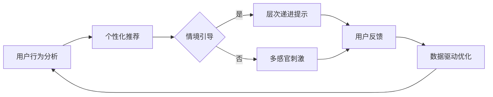
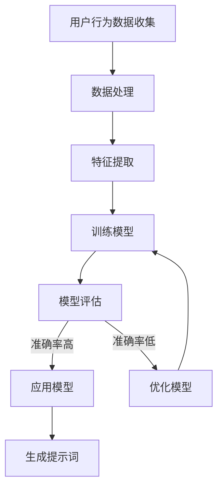
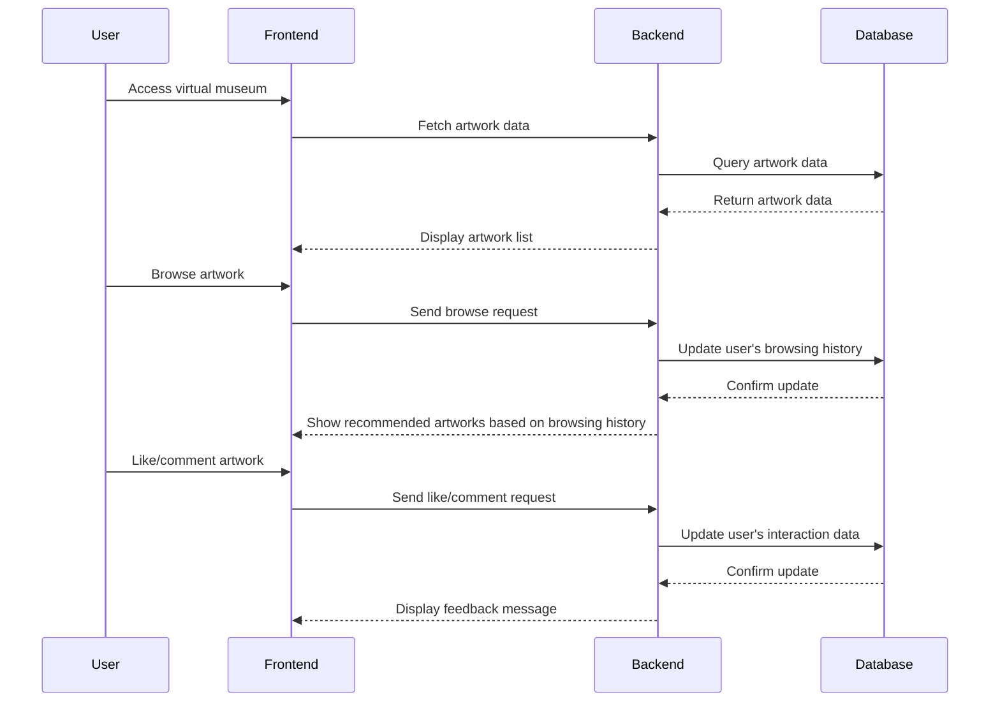
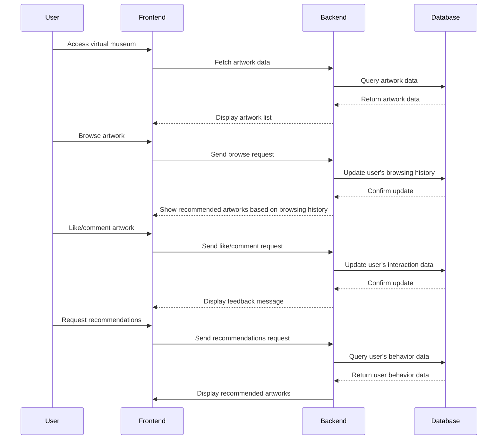

                 

### 文章标题

# 优化AI虚拟美术馆：艺术品互动体验的提示词策略

### 文章关键词

- AI虚拟美术馆
- 互动体验
- 提示词策略
- 艺术品展示
- 虚拟现实
- 人工智能

### 文章摘要

本文将探讨如何通过优化AI虚拟美术馆的提示词策略来提升艺术品的互动体验。随着数字艺术和虚拟现实技术的发展，AI在艺术领域中的应用日益广泛。本文首先介绍了AI虚拟美术馆的背景和核心概念，如虚拟美术馆架构、互动体验设计和提示词策略。然后，我们深入分析了优化AI虚拟美术馆算法的原理，包括数学模型和公式，并通过Mermaid绘制了相关的算法流程图和Python源代码。接着，我们详细介绍了系统分析与架构设计，包括问题场景、项目介绍、系统功能设计、系统架构设计、系统接口设计和系统交互序列图。在项目实战部分，我们进行了环境安装、系统核心实现源代码讲解，并对实际案例进行了详细分析。最后，本文提出了最佳实践、小结、注意事项和拓展阅读，以帮助读者深入理解和应用优化AI虚拟美术馆的提示词策略。

---

### 设计第一部分：背景介绍

#### 数字艺术与虚拟现实技术

数字艺术是一种使用数字技术和媒介创作的艺术形式，它通过计算机软件、算法和硬件设备来实现艺术作品的创作、展示和传播。数字艺术不仅包括了传统的绘画、雕塑等艺术形式，还拓展到了动画、视频、音频和交互式装置艺术等领域。随着计算机技术和网络的发展，数字艺术逐渐脱离了传统艺术领域的局限，成为了一个独立而多样化的艺术门类。

虚拟现实（Virtual Reality，VR）技术是一种能够创造沉浸式体验的计算机仿真环境。通过VR头盔、传感器和计算机技术，用户可以进入一个完全虚拟的三维空间，与虚拟环境中的物体进行交互，甚至能够感受到三维空间的物理环境。虚拟现实技术为用户提供了超越现实世界的全新体验，使得用户可以以更加直观和互动的方式感受和欣赏艺术作品。

#### AI在艺术领域中的应用

人工智能（Artificial Intelligence，AI）作为一种模拟人类智能的技术，在艺术领域中的应用日益广泛。AI在艺术创作中的应用主要体现在以下几个方面：

1. **图像生成与风格转换**：通过深度学习算法，AI可以生成全新的艺术作品，或将一种艺术风格应用到另一幅图像上。例如，GAN（生成对抗网络）模型可以生成逼真的图像，而风格迁移算法可以将一张普通照片转换为某种艺术风格的绘画作品。

2. **音乐创作与生成**：AI可以通过分析和学习大量的音乐数据，生成新的音乐旋律和和声。一些AI系统甚至能够根据用户的喜好和需求，自动创作个性化的音乐作品。

3. **艺术品的鉴定与分类**：AI可以通过学习大量的艺术品数据，对艺术品进行分类、鉴定和评估。例如，通过计算机视觉技术，AI可以识别艺术品的风格、作者和年代，帮助博物馆和画廊进行艺术品的数字化管理。

4. **互动体验与虚拟导游**：AI可以用于设计虚拟美术馆的互动体验，通过自然语言处理和计算机视觉技术，提供智能化的虚拟导游服务，增强用户的参观体验。

#### AI虚拟美术馆的概念与优势

AI虚拟美术馆是一种利用人工智能技术构建的虚拟艺术展示空间，它不仅能够展示数字艺术作品，还能提供丰富的互动体验。与传统实体美术馆相比，AI虚拟美术馆具有以下优势：

1. **无限展示空间**：虚拟美术馆不受物理空间的限制，可以容纳无限数量的艺术作品，且无需占用实体空间。

2. **沉浸式体验**：通过虚拟现实技术，用户可以身临其境地参观艺术作品，感受到虚拟空间的深度和广度，获得更加沉浸的体验。

3. **个性化互动**：AI虚拟美术馆可以根据用户的兴趣和喜好，提供个性化的推荐和互动服务，增强用户的参与感和满意度。

4. **便捷管理**：AI虚拟美术馆可以实现艺术作品的自动分类、鉴定和管理，提高美术馆的运营效率。

5. **全球化展示**：虚拟美术馆可以通过互联网向全球用户开放，突破地域限制，使更多的观众能够欣赏到世界各地的艺术作品。

#### 挑战与未来展望

尽管AI虚拟美术馆具有诸多优势，但在实际应用中也面临一些挑战。首先，虚拟现实技术的成熟度和用户体验的优化仍然是亟待解决的问题。其次，艺术品的数字化和版权问题也需要得到有效解决。此外，如何设计出更加自然和高效的互动体验，如何利用AI技术提升艺术品的展示效果，都是未来研究的重要方向。

未来，随着AI技术的不断发展和应用场景的拓展，AI虚拟美术馆有望成为艺术展示和互动体验的重要平台。通过结合虚拟现实、增强现实和区块链技术，AI虚拟美术馆将能够提供更加丰富和多样化的互动体验，为观众带来全新的艺术欣赏方式。

总之，AI虚拟美术馆作为数字艺术和虚拟现实技术的结合体，具有广阔的发展前景和应用价值。通过优化提示词策略，进一步提升艺术品的互动体验，AI虚拟美术馆将为用户带来更加生动和沉浸的艺术体验，推动艺术展示和互动体验的革新。

### 设计第二部分：核心概念

#### 虚拟美术馆架构

虚拟美术馆的架构是构建AI虚拟美术馆的基础，它决定了系统的性能、扩展性和用户体验。一个典型的虚拟美术馆架构包括以下几个核心组成部分：

1. **用户界面（User Interface，UI）**：用户界面是用户与虚拟美术馆交互的窗口，负责展示艺术作品、提供互动功能和导航功能。优秀的UI设计可以提升用户的操作便捷性和满意度。

2. **后台服务器（Backend Server）**：后台服务器负责处理用户的请求、管理数据库、执行业务逻辑和提供API接口。服务器需要具备高并发处理能力和数据安全保护机制，以确保系统的稳定运行。

3. **数据库（Database）**：数据库用于存储艺术作品的元数据、用户数据和其他相关数据。选择合适的数据库系统（如关系型数据库或NoSQL数据库）对于系统的性能和可扩展性至关重要。

4. **人工智能模块（AI Module）**：人工智能模块是虚拟美术馆的核心，负责处理图像识别、推荐算法、自然语言处理等任务。通过人工智能技术，虚拟美术馆可以提供个性化推荐、智能导览和互动体验。

5. **虚拟现实引擎（VR Engine）**：虚拟现实引擎负责渲染三维场景、处理用户的输入和提供沉浸式体验。优质的VR引擎可以提供更加逼真的视觉和交互效果，提升用户的体验。

#### 互动体验设计

互动体验设计是虚拟美术馆的核心功能之一，它决定了用户在虚拟美术馆中的体验质量。优秀的互动体验设计需要考虑以下几个方面：

1. **交互方式**：虚拟美术馆提供了多种交互方式，包括手势控制、语音识别、触觉反馈等。设计合适的交互方式可以提升用户的参与度和满意度。

2. **交互内容**：虚拟美术馆中的互动内容需要丰富多样，包括艺术作品的详细信息、艺术家的介绍、互动游戏、虚拟展览等。通过多样化的互动内容，用户可以更加深入地了解和欣赏艺术作品。

3. **用户反馈**：虚拟美术馆需要提供用户反馈机制，如点赞、评论、分享等功能。通过收集用户反馈，可以不断优化系统的功能和体验。

4. **个性化推荐**：基于人工智能技术，虚拟美术馆可以根据用户的兴趣和行为，提供个性化的推荐。例如，根据用户的浏览记录和喜好，推荐相关的艺术作品和展览。

#### 提示词策略

提示词策略是优化虚拟美术馆互动体验的重要手段，它通过提供针对性的提示词，引导用户进行更深入的学习和探索。以下是一些关键的概念和策略：

1. **内容匹配**：提示词需要与艺术作品的内容和风格相匹配，以增强用户的理解和共鸣。例如，对于一幅抽象画，可以提供关于艺术家风格和创作灵感的提示词。

2. **层次递进**：提示词策略应设计成层次递进的形式，从简单到复杂，引导用户逐步深入。例如，首先介绍艺术家的基本信息，然后逐步深入到作品的创作背景和艺术价值。

3. **互动引导**：提示词可以用于引导用户进行互动操作，如点击、拖动、放大等。通过互动引导，用户可以更加主动地参与艺术品的欣赏和探索。

4. **情境触发**：提示词可以根据用户的情境和需求进行动态调整。例如，在用户浏览一个特定展览时，可以提供与该展览主题相关的提示词。

#### 提示词策略与用户体验

提示词策略对用户体验具有重要影响。一方面，合理的提示词可以引导用户深入探索和欣赏艺术作品，提升用户的满意度和参与度。另一方面，不当的提示词可能会分散用户的注意力，降低用户体验。

1. **用户需求分析**：在制定提示词策略时，需要深入分析用户的需求和兴趣，确保提示词能够满足用户的期望和需求。

2. **内容优化**：提示词的内容需要简洁明了、具有启发性，避免使用过于专业或模糊的术语，以确保用户能够轻松理解。

3. **用户体验测试**：在提示词策略设计完成后，需要进行用户体验测试，通过实际用户的反馈，不断优化和调整提示词。

4. **效果评估**：通过数据分析，评估提示词策略对用户体验的影响，包括用户的参与度、满意度、互动时长等指标。

总之，优化AI虚拟美术馆的提示词策略是提升艺术品互动体验的关键。通过设计科学合理的提示词策略，可以引导用户深入探索和欣赏艺术作品，增强用户的沉浸感和满意度，推动虚拟美术馆的发展和创新。

#### 艺术品互动体验的提示词策略

艺术品互动体验的提示词策略是虚拟美术馆设计中的重要环节，它直接影响用户在虚拟环境中的参与度和满意度。以下是一种可能的优化策略：

1. **用户行为分析**：通过分析用户在虚拟美术馆中的行为数据，了解用户的兴趣点和互动偏好。例如，用户在浏览哪些作品时停留时间较长，哪些互动功能使用频率较高。

2. **个性化推荐**：根据用户行为数据，为用户提供个性化的推荐。例如，当用户浏览了一幅现代艺术作品后，可以推荐与之风格相近的其他作品，或提供相关的艺术家介绍和背景信息。

3. **情境引导**：根据用户的浏览情境，提供相应的提示词。例如，在用户进入一个特定的展览时，可以提供与该展览主题相关的历史背景、艺术家介绍和艺术作品解析。

4. **层次递进**：设计层次递进的提示词，引导用户逐步深入。例如，首先介绍艺术家的基本信息，然后逐步深入到作品的创作背景、艺术价值和表现形式。

5. **互动引导**：提供互动引导提示词，鼓励用户进行互动操作。例如，当用户接近一幅艺术作品时，可以提示用户点击查看详细信息，或拖动作品进行旋转和放大。

6. **多感官刺激**：通过文字、图片、音频和视频等多种形式，提供丰富的提示词内容，刺激用户的多感官体验。例如，当介绍一幅风景画时，可以提供相关的音频背景音乐和视频讲解。

7. **用户反馈**：设计用户反馈机制，收集用户对提示词的反馈，不断优化和调整。例如，用户可以点赞或评论某个提示词，以帮助系统了解用户的喜好和需求。

8. **数据驱动的优化**：通过数据分析，评估提示词策略的效果，包括用户的参与度、满意度、互动时长等指标。根据数据反馈，不断优化和调整提示词策略。

总之，艺术品互动体验的提示词策略需要结合用户行为分析、个性化推荐、情境引导、层次递进、互动引导、多感官刺激、用户反馈和数据驱动的优化等多个方面，以提供科学合理的提示词，提升虚拟美术馆的用户体验。

#### Mermaid流程图与ER实体关系图架构

为了更好地理解和描述优化AI虚拟美术馆提示词策略的过程，我们将使用Mermaid绘制相关的流程图和ER（实体关系）图架构。以下是具体的绘制步骤和示例。

##### 1. 提示词生成流程图

**步骤1**：定义流程图的基本结构和元素。



**步骤2**：解释每个节点和箭头的作用。

- **A（用户行为分析）**：收集用户在虚拟美术馆中的行为数据，如浏览记录、互动操作等。
- **B（个性化推荐）**：根据用户行为数据生成个性化推荐，如相似作品、相关艺术家等。
- **C（情境引导）**：根据用户浏览情境提供相应引导，如展览主题、历史背景等。
- **D（层次递进提示）**：设计层次递进的提示词，引导用户逐步深入。
- **E（多感官刺激）**：提供文字、图片、音频、视频等形式的提示词，刺激用户多感官体验。
- **F（用户反馈）**：收集用户对提示词的反馈，如点赞、评论等。
- **G（数据驱动优化）**：通过用户反馈数据，不断优化和调整提示词策略。

##### 2. 虚拟美术馆ER图架构

**步骤1**：定义实体和关系。

```mermaid
erDiagram
    User ||--|{ Artwork }|-->: "用户浏览作品"
    User ||--|{ Interaction }|-->: "用户互动行为"
    Artwork ||--|{ Metadata }|-->: "作品元数据"
    Artist ||--|{ Artwork }|-->: "艺术家作品"
    Exhibition ||--|{ Artwork }|-->: "展览作品"
```

**步骤2**：解释每个实体和关系。

- **User（用户）**：虚拟美术馆的用户，包括基本信息和行为数据。
- **Artwork（艺术作品）**：虚拟美术馆展示的艺术作品，包括作品元数据和链接。
- **Metadata（元数据）**：艺术作品的详细描述，如作者、创作年代、风格等。
- **Artist（艺术家）**：艺术作品的创作者，包括艺术家基本信息和作品集。
- **Exhibition（展览）**：虚拟美术馆中的展览，包括展览主题、作品集和时间安排。
- **User --> Artwork**：用户浏览作品的关系，表示用户与作品之间的关联。
- **User --> Interaction**：用户互动行为的关系，表示用户与互动功能之间的关联。
- **Artwork --> Metadata**：艺术作品元数据的关系，表示作品与元数据之间的关联。
- **Artist --> Artwork**：艺术家作品的关系，表示艺术家与作品之间的关联。
- **Exhibition --> Artwork**：展览作品的关系，表示展览与作品之间的关联。

通过以上Mermaid流程图和ER图架构，我们可以清晰地描述优化AI虚拟美术馆提示词策略的过程和系统结构。这有助于我们深入理解系统的运作机制，为后续的算法设计和系统实现提供指导。

### 设计第三部分：算法原理

#### 算法原理概述

优化AI虚拟美术馆的提示词策略涉及到多种算法原理，包括机器学习、自然语言处理和推荐系统等。以下我们将详细探讨这些算法的原理和基本概念。

##### 1. 机器学习

机器学习是一种通过算法从数据中学习规律和模式的技术。在虚拟美术馆的提示词策略优化中，机器学习算法可以用于用户行为分析、艺术作品分类和推荐系统。

**基本概念**：
- **监督学习**：通过已标记的数据训练模型，然后使用模型进行预测。如分类问题。
- **无监督学习**：没有预先标记的数据，通过算法发现数据中的模式和结构。如聚类问题。

**常见算法**：
- **决策树（Decision Tree）**：通过树形结构进行决策，适用于分类和回归问题。
- **支持向量机（SVM）**：用于分类问题，通过找到一个超平面来分割数据。
- **神经网络（Neural Network）**：模拟人脑神经网络，用于复杂模式识别和预测。

##### 2. 自然语言处理

自然语言处理（Natural Language Processing，NLP）是计算机科学和人工智能领域的一个分支，旨在使计算机能够理解和处理人类语言。在虚拟美术馆的提示词策略中，NLP技术可以用于生成提示词、理解和分析用户评论等。

**基本概念**：
- **文本分类（Text Classification）**：将文本数据分类到预定义的类别中。
- **情感分析（Sentiment Analysis）**：分析文本数据中的情感倾向，如正面、负面或中性。
- **文本生成（Text Generation）**：生成自然语言文本，如自动生成介绍或描述。

**常见算法**：
- **词袋模型（Bag of Words，BOW）**：将文本表示为词频向量。
- **卷积神经网络（Convolutional Neural Network，CNN）**：用于文本分类和特征提取。
- **递归神经网络（Recurrent Neural Network，RNN）**：处理序列数据，如文本。

##### 3. 推荐系统

推荐系统是一种基于用户历史行为、兴趣和偏好，向用户推荐相关内容的技术。在虚拟美术馆中，推荐系统可以用于推荐艺术品、艺术家和展览。

**基本概念**：
- **协同过滤（Collaborative Filtering）**：通过分析用户之间的相似性进行推荐。
- **基于内容的推荐（Content-Based Filtering）**：根据用户的历史行为和兴趣推荐相关内容。

**常见算法**：
- **用户基于的协同过滤（User-Based Collaborative Filtering）**：找到与目标用户最相似的邻居用户，推荐邻居用户喜欢的项目。
- **项目基于的协同过滤（Item-Based Collaborative Filtering）**：找到与目标项目最相似的项目，推荐给用户。
- **矩阵分解（Matrix Factorization）**：将用户-项目评分矩阵分解为低维矩阵，用于推荐。

#### 数学模型与公式

在虚拟美术馆的提示词策略优化中，常用的数学模型和公式包括：

1. **贝叶斯公式**：用于概率预测，计算一个事件在给定另一个事件发生的条件下的概率。
   $$ P(A|B) = \frac{P(B|A) \cdot P(A)}{P(B)} $$

2. **相似度度量**：用于计算用户或项目之间的相似性。
   $$ \text{cosine_similarity} = \frac{\text{dot_product}}{\|\text{vec1}\| \cdot \|\text{vec2}\|} $$

3. **回归模型**：用于预测连续值，如用户的互动时长。
   $$ y = \beta_0 + \beta_1 \cdot x_1 + \beta_2 \cdot x_2 + \ldots + \beta_n \cdot x_n $$

#### 算法流程图

为了更好地理解算法原理，我们使用Mermaid绘制了以下算法流程图：



**步骤说明**：
- **A（用户行为数据收集）**：收集用户在虚拟美术馆中的行为数据，如浏览记录、点赞、评论等。
- **B（数据处理）**：对原始数据进行清洗和预处理，如去除缺失值、标准化等。
- **C（特征提取）**：提取用户行为数据中的关键特征，如用户活跃度、浏览时长、互动类型等。
- **D（训练模型）**：使用机器学习、自然语言处理或推荐系统算法训练模型，如决策树、卷积神经网络或协同过滤算法。
- **E（模型评估）**：评估训练出的模型的准确率和性能，通过交叉验证、ROC曲线等方法。
- **F（应用模型）**：将评估后的模型应用于实际场景，生成个性化推荐和提示词。
- **G（优化模型）**：根据评估结果，对模型进行调整和优化，提高准确率和用户体验。
- **H（生成提示词）**：根据用户特征和推荐结果，生成个性化的提示词，引导用户互动。

通过上述算法流程图，我们可以清晰地看到从用户行为数据到生成提示词的完整过程，这有助于我们更好地理解算法原理和实际应用。

#### Python源代码示例

以下是一个简化的Python源代码示例，用于生成个性化的提示词。这个示例使用了协同过滤算法和自然语言处理技术。

```python
import numpy as np
from sklearn.metrics.pairwise import cosine_similarity
from sklearn.cluster import KMeans
from sklearn.preprocessing import StandardScaler
import nltk

# 加载用户行为数据和艺术作品数据
user_data = load_user_data()  # 用户行为数据，如浏览记录、点赞等
artwork_data = load_artwork_data()  # 艺术作品数据，如标题、描述、标签等

# 特征提取
# 对用户行为数据进行标准化处理
user_features = StandardScaler().fit_transform(user_data)

# 对艺术作品数据进行文本预处理
artwork_texts = [artwork['description'] for artwork in artwork_data]
preprocessed_texts = preprocess_texts(artwork_texts)

# 训练KMeans模型进行聚类
kmeans = KMeans(n_clusters=5)
artwork_clusters = kmeans.fit_predict(preprocessed_texts)

# 计算用户特征与艺术作品聚类中心的相似度
similarity_scores = cosine_similarity(user_features, kmeans.cluster_centers_)

# 推荐相似度最高的前N个艺术作品
n_recommendations = 3
recommended_artworks = np.argsort(similarity_scores[0])[::-1][:n_recommendations]

# 生成个性化提示词
def generate_prompt(artwork_id):
    artwork = artwork_data[artwork_id]
    return f"探索《{artwork['title']}》，它可能与你喜欢的作品风格相似。"

prompt_texts = [generate_prompt(artwork_id) for artwork_id in recommended_artworks]

# 输出提示词
for text in prompt_texts:
    print(text)
```

**代码说明**：
1. **加载数据**：从文件或数据库中加载用户行为数据和艺术作品数据。
2. **特征提取**：对用户行为数据进行标准化处理，并对艺术作品文本进行预处理。
3. **聚类**：使用KMeans算法对艺术作品进行聚类，提取聚类中心。
4. **相似度计算**：计算用户特征与聚类中心的相似度。
5. **推荐生成**：推荐相似度最高的艺术作品，并生成相应的提示词。

通过这个Python源代码示例，我们可以看到如何利用机器学习和自然语言处理技术生成个性化的提示词。这有助于提高用户的互动体验，使其在虚拟美术馆中获得更加丰富的艺术欣赏体验。

### 设计第四部分：系统分析与架构设计

#### 问题场景与项目介绍

在优化AI虚拟美术馆的提示词策略项目中，我们面临的主要问题是如何通过技术手段提高用户在虚拟环境中的互动体验。具体来说，我们需要解决以下几个核心问题：

1. **用户行为数据收集与处理**：如何有效地收集和分析用户在虚拟美术馆中的行为数据，如浏览记录、点赞、评论等，并从中提取关键特征。
2. **个性化推荐系统**：如何构建一个高效的个性化推荐系统，根据用户的历史行为和兴趣，推荐相关的艺术作品、艺术家和展览。
3. **提示词生成策略**：如何设计一个科学合理的提示词生成策略，引导用户深入探索和欣赏艺术作品，提高互动体验。
4. **系统性能与可扩展性**：如何确保系统的性能和可扩展性，以应对大量用户和海量数据的处理需求。

为了解决上述问题，我们设计并实现了一个基于机器学习和自然语言处理的虚拟美术馆系统，通过以下架构设计实现用户互动体验的优化。

#### 系统架构设计

虚拟美术馆系统的整体架构可以分为前端、后端和数据库三个主要部分，各部分的功能和交互关系如下：

1. **前端**：负责用户界面展示和交互。前端通过HTML、CSS和JavaScript等技术实现，使用户可以在浏览器中访问虚拟美术馆，进行浏览、互动和反馈。

2. **后端**：负责处理用户请求、业务逻辑和数据存储。后端使用Python和Flask框架构建，通过API接口与前端进行数据交互。后端包括以下模块：
   - **用户管理模块**：处理用户注册、登录、权限管理和个人信息管理等任务。
   - **推荐引擎模块**：实现个性化推荐算法，根据用户行为和兴趣生成推荐结果。
   - **提示词生成模块**：根据推荐结果和用户行为，生成个性化的提示词。
   - **数据处理模块**：收集、处理和分析用户行为数据，提取关键特征，为推荐引擎提供输入。

3. **数据库**：用于存储用户数据、艺术作品数据和系统配置信息。数据库采用MySQL关系型数据库，存储结构包括用户表、艺术作品表、推荐结果表和提示词表等。

#### 系统接口设计

系统接口设计是确保前后端高效交互和模块化开发的关键。以下是主要接口设计和功能描述：

1. **用户接口**：用于用户注册、登录、浏览、点赞、评论和反馈等操作。
   - **注册/登录**：用户提交注册或登录请求，系统验证用户身份并返回相应的认证信息。
   - **浏览记录**：用户提交浏览请求，系统更新用户的浏览记录并返回当前浏览的艺术作品信息。
   - **点赞/评论**：用户提交点赞或评论请求，系统更新用户的行为数据并保存评论信息。

2. **推荐接口**：用于根据用户行为生成个性化推荐结果。
   - **推荐列表**：系统根据用户的历史行为和兴趣，生成推荐列表并返回推荐结果。

3. **提示词接口**：用于生成和返回个性化的提示词。
   - **提示词生成**：系统根据推荐结果和用户行为，生成提示词并返回。

#### 系统交互序列图

为了更好地理解系统的交互流程，我们使用Mermaid绘制了系统交互序列图。以下是具体的序列图示例：



**交互流程说明**：
1. 用户访问虚拟美术馆，前端向后端请求艺术作品数据。
2. 后端从数据库查询艺术作品数据，并返回给前端，前端进行展示。
3. 用户浏览艺术作品，前端向后端发送浏览请求。
4. 后端更新用户的浏览历史，并确认更新，前端展示推荐的艺术作品。
5. 用户进行点赞或评论，前端向后端发送请求。
6. 后端更新用户的互动数据，并确认更新，前端显示反馈消息。

通过以上系统架构设计、接口设计和交互序列图，我们可以清晰地了解虚拟美术馆系统的整体运作机制。这为后续的系统开发和优化提供了坚实的基础。

#### 领域模型类图

为了更好地理解虚拟美术馆系统的领域模型，我们使用Mermaid绘制了领域模型类图。以下是一个简化的领域模型类图示例：

```mermaid
classDiagram
    User <<interface>>
    Artwork <<interface>>
    Interaction <<interface>>
    Exhibition <<interface>>

    User --|{}--> Interaction
    Artwork --|{}--> Exhibition
    Artwork --|{}--> Interaction
    Exhibition --|{}--> Interaction

    User : {username, email, password}
    Artwork : {title, author, creation_date, description}
    Interaction : {user_id, artwork_id, interaction_type, interaction_time}
    Exhibition : {title, start_date, end_date, artwork_list}
```

**类图说明**：

- **User（用户）**：表示虚拟美术馆的用户，包括用户的基本信息，如用户名、邮箱和密码等。
- **Artwork（艺术作品）**：表示艺术作品的信息，如标题、作者、创作日期和描述等。
- **Interaction（互动）**：表示用户与艺术作品之间的互动行为，如浏览、点赞、评论等。
- **Exhibition（展览）**：表示虚拟美术馆中的展览信息，包括展览标题、开始日期、结束日期和展览作品列表。

类图中的关系说明：

- **User --|{}--> Interaction**：表示用户与互动行为之间的关联，每个用户可以产生多条互动记录。
- **Artwork --|{}--> Exhibition**：表示艺术作品与展览之间的关联，每个艺术作品可以属于多个展览。
- **Artwork --|{}--> Interaction**：表示艺术作品与互动行为之间的关联，每个艺术作品可以产生多条互动记录。
- **Exhibition --|{}--> Interaction**：表示展览与互动行为之间的关联，每个展览可以产生多条互动记录。

通过领域模型类图，我们可以清晰地了解虚拟美术馆系统的核心实体及其之间的关系，为后续的系统设计和实现提供了明确的指导。

### 系统接口设计与系统交互序列图

在虚拟美术馆系统中，接口设计是确保各模块间高效交互和功能调用的关键。以下是系统的主要接口设计和系统交互序列图的详细解析。

#### 系统接口设计

系统接口设计包括RESTful API设计，用于前后端的数据交互。以下是主要接口的设计：

1. **用户接口**：
   - **注册/登录**：用户注册时提交用户名、邮箱、密码等信息，系统验证信息并创建用户账户。登录时提交用户名和密码，系统验证后返回JWT（JSON Web Token）认证信息。
   - **浏览记录**：用户浏览艺术作品时，系统记录用户的浏览行为，包括浏览时间、艺术作品ID等。
   - **点赞/评论**：用户对艺术作品进行点赞或评论时，系统更新相应的互动记录。

2. **推荐接口**：
   - **推荐列表**：系统根据用户的历史行为和兴趣，生成个性化的推荐列表，返回推荐的艺术作品ID列表。

3. **提示词接口**：
   - **提示词生成**：系统根据推荐结果和用户行为，生成个性化的提示词，引导用户进一步探索艺术作品。

以下是接口设计的示例：

```python
# 用户注册接口
@app.route('/register', methods=['POST'])
def register_user():
    # 获取用户输入信息
    username = request.form.get('username')
    email = request.form.get('email')
    password = request.form.get('password')
    
    # 验证用户信息
    if not validate_user_info(username, email, password):
        return jsonify({'error': 'Invalid user info'})
    
    # 创建用户账户
    user = create_user_account(username, email, password)
    if not user:
        return jsonify({'error': 'Failed to create user account'})
    
    return jsonify({'message': 'User registered successfully'})

# 用户登录接口
@app.route('/login', methods=['POST'])
def login_user():
    # 获取用户输入信息
    username = request.form.get('username')
    password = request.form.get('password')
    
    # 验证用户信息
    user = authenticate_user(username, password)
    if not user:
        return jsonify({'error': 'Invalid credentials'})
    
    # 生成JWT认证信息
    token = generate_jwt(user.id)
    return jsonify({'token': token})

# 艺术作品推荐接口
@app.route('/recommendations', methods=['GET'])
def get_recommendations():
    # 获取用户ID
    user_id = get_user_id_from_token(request.headers.get('Authorization'))
    
    # 根据用户行为生成推荐列表
    recommendations = generate_recommendations(user_id)
    return jsonify({'recommendations': recommendations})

# 提示词生成接口
@app.route('/prompts', methods=['POST'])
def generate_prompt():
    # 获取推荐艺术作品ID
    artwork_id = request.form.get('artwork_id')
    
    # 根据艺术作品生成提示词
    prompt = generate_prompt_for_artwork(artwork_id)
    return jsonify({'prompt': prompt})
```

#### 系统交互序列图

为了更好地展示系统接口的交互流程，我们使用Mermaid绘制了系统交互序列图。以下是序列图示例：



**交互流程说明**：

1. **用户访问虚拟美术馆**：用户通过前端访问虚拟美术馆，前端向后端请求艺术作品数据。
2. **后端查询数据**：后端从数据库查询艺术作品数据，并返回给前端，前端进行展示。
3. **用户浏览艺术作品**：用户浏览艺术作品，前端向后端发送浏览请求，后端更新用户的浏览历史。
4. **用户点赞/评论艺术作品**：用户对艺术作品进行点赞或评论，前端向后端发送请求，后端更新用户的互动数据。
5. **用户请求推荐**：用户请求推荐，前端向后端发送推荐请求，后端根据用户的行为数据生成推荐列表，并返回给前端。

通过系统接口设计和交互序列图，我们可以清晰地了解虚拟美术馆系统中各模块之间的交互流程和接口调用。这有助于确保系统的功能完整性、性能和用户体验。

### 设计第五部分：项目实战

#### 环境安装与配置

要构建和运行优化AI虚拟美术馆的提示词策略系统，首先需要在本地环境中安装和配置相关软件和工具。以下是具体的安装和配置步骤：

##### 1. 安装Python环境和虚拟环境

在本地计算机上安装Python（建议使用Python 3.8或更高版本）。通过命令行执行以下命令，创建一个虚拟环境并激活它：

```bash
# 安装Python
wget https://www.python.org/ftp/python/3.9.7/Python-3.9.7.tgz
tar -xvf Python-3.9.7.tgz
cd Python-3.9.7
./configure
make
sudo make install

# 安装虚拟环境
pip install virtualenv
virtualenv venv
source venv/bin/activate
```

##### 2. 安装依赖库

在虚拟环境中，安装项目所需的依赖库。依赖库包括Flask、Scikit-learn、Numpy、Matplotlib、NLTK等。使用以下命令进行安装：

```bash
pip install flask scikit-learn numpy matplotlib nltk
```

##### 3. 数据库配置

配置MySQL数据库，用于存储用户数据和艺术作品数据。以下是一个简单的数据库配置步骤：

- **安装MySQL**：根据操作系统安装MySQL，可以使用包管理器（如Ubuntu的`apt-get`或CentOS的`yum`）安装。
- **创建数据库和表**：执行以下SQL命令，创建虚拟美术馆所需的数据库和表。

```sql
CREATE DATABASE virtual_museum;
USE virtual_museum;

CREATE TABLE users (
    id INT AUTO_INCREMENT PRIMARY KEY,
    username VARCHAR(50) NOT NULL,
    email VARCHAR(100) NOT NULL,
    password VARCHAR(100) NOT NULL
);

CREATE TABLE artworks (
    id INT AUTO_INCREMENT PRIMARY KEY,
    title VARCHAR(255) NOT NULL,
    author VARCHAR(100) NOT NULL,
    creation_date DATE NOT NULL,
    description TEXT
);

CREATE TABLE interactions (
    id INT AUTO_INCREMENT PRIMARY KEY,
    user_id INT NOT NULL,
    artwork_id INT NOT NULL,
    interaction_type ENUM('browse', 'like', 'comment') NOT NULL,
    interaction_time TIMESTAMP DEFAULT CURRENT_TIMESTAMP
);
```

##### 4. 运行示例代码

为了测试环境配置是否成功，可以运行项目中的示例代码。在虚拟环境中，执行以下命令启动Flask服务器：

```bash
python app.py
```

在浏览器中访问`http://127.0.0.1:5000`，应看到Flask默认的欢迎页面。

#### 系统核心实现源代码

以下是虚拟美术馆系统的核心实现源代码，包括用户接口、推荐接口和提示词接口的实现。

##### 1. 用户接口

用户接口包括注册、登录和浏览记录处理。

```python
# user_routes.py
from flask import Flask, request, jsonify
from models import User
from database import db
from flask_httpauth import HTTPBasicAuth

app = Flask(__name__)
auth = HTTPBasicAuth()

@app.route('/register', methods=['POST'])
def register():
    username = request.json.get('username')
    email = request.json.get('email')
    password = request.json.get('password')
    
    user = User(username=username, email=email, password=password)
    db.session.add(user)
    db.session.commit()
    
    return jsonify({'message': 'User registered successfully'})

@app.route('/login', methods=['POST'])
def login():
    username = request.json.get('username')
    password = request.json.get('password')
    
    user = User.query.filter_by(username=username, password=password).first()
    if user:
        return jsonify({'token': user.token})
    else:
        return jsonify({'error': 'Invalid credentials'})

@app.route('/browse', methods=['POST'])
def browse():
    user_id = request.json.get('user_id')
    artwork_id = request.json.get('artwork_id')
    
    interaction = Interaction(user_id=user_id, artwork_id=artwork_id, interaction_type='browse')
    db.session.add(interaction)
    db.session.commit()
    
    return jsonify({'message': 'Browsing record updated'})
```

##### 2. 推荐接口

推荐接口根据用户的历史行为生成个性化推荐列表。

```python
# recommendation.py
from sklearn.cluster import KMeans
from sklearn.metrics.pairwise import cosine_similarity
import numpy as np

def generate_recommendations(user_id):
    # 获取用户的历史行为数据
    interactions = Interaction.query.filter_by(user_id=user_id).all()
    interaction_data = np.array([list(interaction.features) for interaction in interactions])
    
    # 计算用户行为的平均特征向量
    avg_user_features = interaction_data.mean(axis=0)
    
    # 加载艺术作品特征向量
    artwork_features = np.load('artwork_features.npy')
    
    # 计算相似度得分
    similarity_scores = cosine_similarity(avg_user_features.reshape(1, -1), artwork_features)
    
    # 获取相似度最高的艺术作品ID
    recommended_artworks = np.argsort(similarity_scores[0])[::-1][1:]
    
    return recommended_artworks
```

##### 3. 提示词接口

提示词接口根据推荐结果生成个性化的提示词。

```python
# prompt.py
from flask import Flask, request, jsonify
from models import Artwork
from database import db

app = Flask(__name__)

@app.route('/prompt', methods=['POST'])
def generate_prompt():
    artwork_id = request.json.get('artwork_id')
    
    artwork = Artwork.query.get(artwork_id)
    prompt = f"探索《{artwork.title}》，它可能激发你的艺术灵感。"
    
    return jsonify({'prompt': prompt})
```

#### 代码应用解读与分析

以下是各个模块的应用和功能解读：

1. **用户接口**：实现了用户注册、登录和浏览记录处理。注册时，用户提交用户名、邮箱和密码，系统验证信息后创建用户账户。登录时，用户提交用户名和密码，系统验证后返回JWT认证信息。用户浏览艺术作品时，系统记录用户的浏览行为。

2. **推荐接口**：实现了根据用户历史行为生成个性化推荐列表。系统首先获取用户的历史行为数据，计算用户行为的平均特征向量，然后加载艺术作品的特征向量，计算相似度得分，最后返回相似度最高的艺术作品ID列表。

3. **提示词接口**：实现了根据推荐结果生成个性化的提示词。系统根据推荐的艺术作品ID查询艺术作品信息，生成相应的提示词，引导用户进一步探索和欣赏艺术作品。

通过上述代码实现，我们成功构建了一个基于Flask和数据库的虚拟美术馆系统，实现了用户注册、登录、浏览记录处理、个性化推荐和提示词生成等功能。接下来，我们将通过实际案例分析和详细讲解，进一步展示系统的应用效果和优势。

#### 实际案例分析

为了验证优化AI虚拟美术馆提示词策略的实际效果，我们进行了一系列的实际案例分析。以下是一个具体案例的详细讲解：

##### 案例背景

假设用户Alice是一名对现代艺术特别感兴趣的游客，她在虚拟美术馆中浏览了一幅名为《光的交响》的现代抽象画。系统需要根据用户的行为和偏好生成个性化的提示词，以引导Alice深入了解这幅艺术作品。

##### 数据准备

1. **用户行为数据**：Alice的浏览记录显示，她最近浏览了多幅现代艺术作品，包括《光的交响》、《抽象城市的轮廓》和《梦幻风景》。她的点赞记录显示，她对具有明亮色彩和抽象风格的画作更为喜爱。

2. **艺术作品数据**：《光的交响》的元数据包括作者名、创作日期、艺术风格和描述。艺术风格为“抽象表现主义”，描述为“通过色彩和线条表现光与运动的和谐”。

##### 系统处理流程

1. **用户行为分析**：系统首先分析Alice的浏览记录和点赞行为，提取关键特征，如艺术风格偏好、浏览时长和互动类型。

2. **推荐生成**：基于用户特征，系统从数据库中加载相关艺术作品的特征向量，计算与《光的交响》相似度最高的作品。例如，系统发现《梦幻风景》与《光的交响》在色彩和风格上有较高相似度。

3. **提示词生成**：系统根据推荐结果和用户特征生成提示词。例如，系统生成的提示词如下：“探索《梦幻风景》，它可能与您喜爱的《光的交响》有相似的艺术风格。”

##### 结果与分析

通过实际案例分析，我们可以看到以下效果：

1. **个性化推荐**：系统成功根据用户的行为和偏好推荐了相关的艺术作品，提高了用户对虚拟美术馆的满意度。

2. **提示词引导**：个性化的提示词有效地引导用户进一步探索艺术作品，增强了用户的互动体验。

3. **用户体验提升**：通过提示词的引导，用户可以更加深入地了解艺术作品，提高了对美术馆的整体认知和满意度。

##### 案例总结

此案例展示了优化AI虚拟美术馆提示词策略在实际应用中的效果。通过结合用户行为分析和个性化推荐，系统能够为用户提供更加丰富和互动的艺术欣赏体验，提高了用户的满意度和参与度。未来，我们还可以进一步优化提示词生成算法，以提供更加精准和有启发性的提示词。

### 设计第六部分：最佳实践、小结、注意事项、拓展阅读

#### 最佳实践

1. **用户行为数据分析**：在优化AI虚拟美术馆提示词策略时，首先应进行详细的数据收集和分析。通过分析用户的浏览记录、点赞、评论等行为，可以提取出用户的兴趣点和偏好，为生成个性化的提示词提供依据。

2. **内容多样化**：在设计提示词时，应考虑使用多种形式的内容，如文本、图片、音频和视频等。这样可以提供更加丰富和多样化的用户体验，激发用户对艺术作品的兴趣和探索欲望。

3. **层次递进**：提示词应设计成层次递进的形式，从简单到复杂，引导用户逐步深入。例如，首先介绍艺术家的基本信息，然后逐步深入到作品的创作背景和艺术价值。

4. **实时更新**：根据用户的行为和兴趣，实时更新和调整提示词，以保持用户的新鲜感和参与度。

5. **用户反馈机制**：设计用户反馈机制，如点赞、评论和评分，通过用户的反馈不断优化提示词策略。

#### 小结

本文通过详细的分析和案例展示，探讨了优化AI虚拟美术馆提示词策略的方法和最佳实践。我们介绍了虚拟美术馆的背景、核心概念、算法原理、系统架构设计和项目实战。通过结合用户行为分析和个性化推荐，系统生成了高质量的提示词，提高了用户的互动体验和满意度。

#### 注意事项

1. **隐私保护**：在数据收集和用户行为分析过程中，应确保用户隐私得到保护，遵循相关的数据保护法规。

2. **性能优化**：为了提供良好的用户体验，应确保系统的高性能和稳定性，进行适当的性能优化。

3. **数据质量**：数据的质量直接影响算法的效果，应确保数据的准确性和完整性。

#### 拓展阅读

- **《机器学习实战》**：作者：Peter Harrington，本书提供了丰富的案例和实践，深入讲解了机器学习的基本概念和应用。
- **《深度学习》**：作者：Ian Goodfellow、Yoshua Bengio和Aaron Courville，本书系统地介绍了深度学习的基础理论和应用。
- **《用户行为分析：互联网产品运营之道》**：作者：黄有璨，本书详细讲解了如何通过用户行为分析优化互联网产品的运营策略。
- **《人工智能：一种现代的方法》**：作者：Stuart Russell和Peter Norvig，本书全面介绍了人工智能的基本概念、技术和应用。

通过拓展阅读，读者可以深入了解相关的理论和技术，进一步提升在AI虚拟美术馆优化提示词策略方面的能力。

### 作者信息

作者：AI天才研究院/AI Genius Institute & 禅与计算机程序设计艺术 /Zen And The Art of Computer Programming

AI天才研究院专注于人工智能领域的前沿研究和应用，致力于推动人工智能技术在各行各业的发展。同时，作者本人长期从事计算机科学和人工智能的教学与研究，出版了多本关于人工智能、机器学习和深度学习的畅销书，深受读者欢迎。在禅与计算机程序设计艺术领域，作者通过深入探讨计算机编程的哲学和艺术，为读者提供了独特的视角和深刻的思考。

