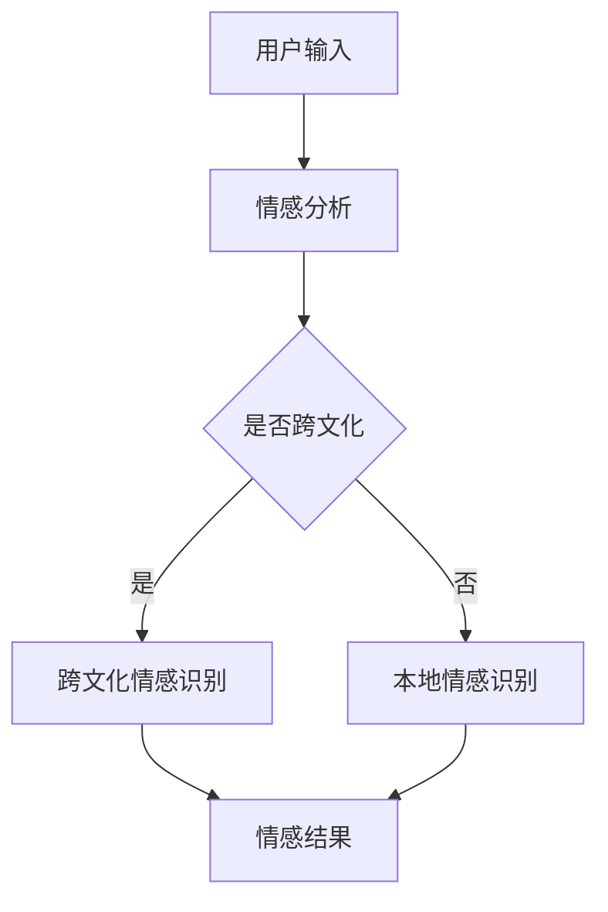
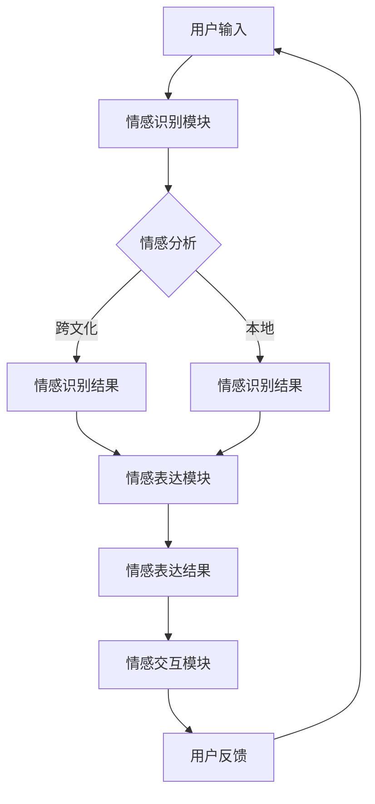
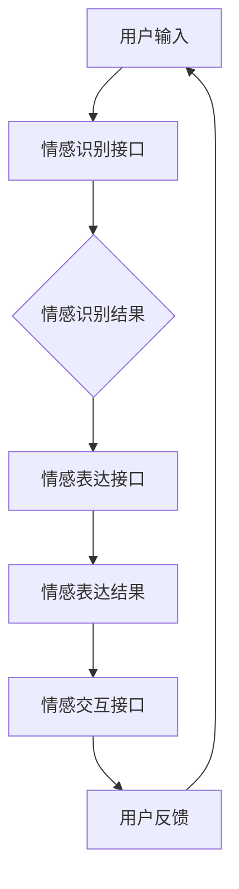

                 

# 优化AI虚拟角色情感智能：跨文化表情识别的提示词策略

关键词：虚拟角色、情感智能、跨文化、表情识别、提示词策略

摘要：随着人工智能技术的快速发展，虚拟角色在游戏、社交媒体、虚拟现实等领域扮演着越来越重要的角色。然而，当前虚拟角色在情感智能方面存在诸多不足，难以准确识别和表达跨文化情感。本文旨在探讨如何通过跨文化表情识别的提示词策略，优化AI虚拟角色的情感智能，提高其与用户之间的情感交互体验。

----------------------------------------------------------------

## 第一部分：背景介绍

### 1.1 问题背景

随着虚拟现实、增强现实、游戏等技术的不断发展，虚拟角色已经成为人们日常生活中不可或缺的一部分。虚拟角色不仅能够为用户提供娱乐、社交等功能，还可以在医疗、教育、客服等领域发挥重要作用。然而，当前大多数虚拟角色在情感智能方面存在不足，主要表现在以下几个方面：

1. **情感识别能力不足**：虚拟角色难以准确识别用户的情感需求，导致情感交互体验差强人意。
2. **情感表达单一**：虚拟角色在情感表达上缺乏多样性，难以跨越文化差异，与不同文化背景的用户产生共鸣。
3. **情感交互体验差**：虚拟角色在情感交互过程中，无法为用户带来愉悦、满意的情感体验，影响用户的沉浸感和满意度。

### 1.2 问题描述

为了解决上述问题，本文将探讨如何优化AI虚拟角色的情感智能，特别是跨文化表情识别的提示词策略。具体问题描述如下：

1. **情感识别问题**：如何通过算法和技术手段，提高虚拟角色对用户情感的理解能力？
2. **情感表达问题**：如何设计有效的提示词策略，帮助虚拟角色实现跨文化情感表达？
3. **情感交互问题**：如何通过优化虚拟角色的情感识别和表达，提升用户的情感交互体验？

### 1.3 问题解决

本文将从以下几个方面探讨优化AI虚拟角色情感智能的方法：

1. **研究跨文化情感识别的算法**：通过分析用户的行为和语言，提取情感信息，并在不同文化背景下进行情感识别和理解。
2. **设计基于提示词的策略**：构建提示词库，根据用户情感和行为，为虚拟角色生成合适的情感表达语句。
3. **实际案例和项目实战**：通过实际案例和项目实战，验证所提方法的有效性和可行性。

### 1.4 边界与外延

1. **边界**：本文主要关注虚拟角色的情感智能优化，不涉及其他人工智能领域。
2. **外延**：本文的研究成果可以应用于虚拟角色在游戏、社交媒体、虚拟现实等领域的情感交互设计。

### 1.5 概念结构与核心要素组成

1. **跨文化情感识别**：通过算法分析用户情感，实现跨文化情感识别。
2. **提示词策略**：基于用户情感和行为，生成相应的提示词，帮助虚拟角色实现跨文化情感表达。
3. **情感交互体验**：通过优化虚拟角色的情感识别和表达，提升用户的情感交互体验。

----------------------------------------------------------------

## 第二部分：核心概念与联系

### 2.1 跨文化情感识别

#### 2.1.1 概念原理

跨文化情感识别是指利用人工智能技术，从用户的行为和语言中提取情感信息，并在不同文化背景下进行情感识别和理解的过程。其主要目标是实现跨文化情感的理解和沟通，提高虚拟角色在情感智能方面的能力。

#### 2.1.2 概念属性特征对比表格

| 概念         | 特征               |
| ------------ | ------------------ |
| 跨文化情感识别 | 可跨文化适应       |
|             | 提高情感理解精度   |
|             | 考虑文化差异       |

#### 2.1.3 ER实体关系图架构

```mermaid
erDiagram
  User ||--|{ Emotion}: 跨文化情感识别
  Emotion ||--|{ Culture}: 文化差异
```

### 2.2 提示词策略

#### 2.2.1 概念原理

提示词策略是指通过预设的提示词库，根据用户情感和行为，为虚拟角色生成合适的情感表达语句。其主要目的是提高虚拟角色的情感表达丰富度和文化适应性，从而实现更好的情感交互体验。

#### 2.2.2 概念属性特征对比表格

| 概念         | 特征                   |
| ------------ | ---------------------- |
| 提示词策略   | 提高情感表达丰富度     |
|             | 考虑文化适应性         |
|             | 可定制化               |

#### 2.2.3 ER实体关系图架构

```mermaid
erDiagram
  User ||--|{ Emotion}: 情感识别
  Emotion ||--|{ Suggestion}: 提示词策略
```

### 2.3 情感交互体验

#### 2.3.1 概念原理

情感交互体验是指虚拟角色在与用户互动过程中，通过情感识别、表达和交互，为用户带来愉悦、满意的情感体验。其主要目标是提升用户的沉浸感和满意度，增强虚拟角色的亲和力。

#### 2.3.2 概念属性特征对比表格

| 概念         | 特征                   |
| ------------ | ---------------------- |
| 情感交互体验 | 提高用户满意度       |
|             | 增强虚拟角色亲和力   |
|             | 考虑文化差异性       |

#### 2.3.3 ER实体关系图架构

```mermaid
erDiagram
  User ||--|{ Emotion}: 情感识别
  Emotion ||--|{ Interaction}: 情感交互体验
```

----------------------------------------------------------------

## 第三部分：算法原理讲解

### 3.1 跨文化情感识别算法原理

#### 3.1.1 概念原理

跨文化情感识别算法是指利用自然语言处理、机器学习等技术，从用户的行为和语言中提取情感信息，并在不同文化背景下进行情感识别和理解的过程。其主要目的是提高虚拟角色对用户情感的识别精度，实现跨文化情感的理解和沟通。

#### 3.1.2 算法mermaid流程图



#### 3.1.3 Python源代码实现

```python
import nltk
from nltk.sentiment import SentimentIntensityAnalyzer

# 初始化情感分析器
sia = SentimentIntensityAnalyzer()

# 用户输入
user_input = "I feel happy because I'm learning new things."

# 情感分析
sentiment = sia.polarity_scores(user_input)

# 是否跨文化
is_cross_cultural = check_cross_cultural(sentiment)

# 跨文化情感识别或本地情感识别
if is_cross_cultural:
    cross_cultural_emotion = cross_cultural_sentiment_analysis(sentiment)
else:
    local_emotion = local_sentiment_analysis(sentiment)

# 输出情感结果
print(f"Emotion: {local_emotion if not is_cross_cultural else cross_cultural_emotion}")
```

#### 3.1.4 数学模型和公式

$$
\text{Sentiment} = f(\text{Text}, \text{Culture})
$$

其中，Sentiment表示情感结果，Text表示用户输入文本，Culture表示文化背景。函数f()用于实现情感识别，可以根据实际需求选择合适的算法模型。

#### 3.1.5 举例说明

假设一个美国用户输入：“我感到很高兴，因为我正在学习新的东西。”，一个中国用户输入：“我很开心，因为我今天学了一门新课程。”。通过跨文化情感识别算法，可以分别识别出用户在美国和中国文化背景下的情感，从而实现跨文化情感理解和沟通。

----------------------------------------------------------------

## 第四部分：系统分析与架构设计方案

### 4.1 问题场景介绍

随着虚拟角色在各个领域的应用越来越广泛，如何提升虚拟角色的情感智能成为了一个关键问题。特别是在跨文化情感识别和表达方面，虚拟角色需要具备更高的适应性和表达能力，以满足不同文化背景的用户需求。因此，本文提出了一套基于跨文化表情识别的提示词策略的系统分析与架构设计方案。

### 4.2 项目介绍

本项目旨在构建一个具备跨文化情感识别和表达能力的虚拟角色系统，通过研究跨文化情感识别算法、设计基于提示词的策略，以及实际案例和项目实战，验证所提方法的有效性和可行性。系统主要分为以下三个模块：

1. **情感识别模块**：实现跨文化情感识别算法，从用户的行为和语言中提取情感信息。
2. **情感表达模块**：设计基于提示词的策略，为虚拟角色生成合适的情感表达语句。
3. **情感交互模块**：实现虚拟角色与用户的情感交互，提升用户的沉浸感和满意度。

### 4.3 系统功能设计

1. **情感识别功能**：通过自然语言处理和机器学习算法，从用户的行为和语言中提取情感信息，实现跨文化情感识别。
2. **情感表达功能**：根据用户情感和行为，从预设的提示词库中生成合适的情感表达语句，实现跨文化情感表达。
3. **情感交互功能**：实现虚拟角色与用户的情感交互，通过情感识别和表达，为用户带来愉悦、满意的情感体验。

### 4.4 系统架构设计



### 4.5 系统接口设计和系统交互



### 4.6 系统架构图


----------------------------------------------------------------

## 第五部分：项目实战

### 5.1 环境安装

为了实现本文所提出的跨文化情感识别和提示词策略系统，我们需要安装以下软件和库：

1. Python 3.8及以上版本
2. nltk
3. numpy
4. pandas
5. scikit-learn

安装命令如下：

```bash
pip install python-nltk numpy pandas scikit-learn
```

### 5.2 系统核心实现

在本项目中，我们将使用Python语言实现系统核心功能。以下是一个简单的示例代码，展示了如何进行情感识别和表达。

#### 5.2.1 情感识别

```python
import nltk
from nltk.sentiment import SentimentIntensityAnalyzer

# 初始化情感分析器
sia = SentimentIntensityAnalyzer()

# 用户输入
user_input = "I feel happy because I'm learning new things."

# 情感分析
sentiment = sia.polarity_scores(user_input)

# 输出情感结果
print(sentiment)
```

#### 5.2.2 提示词策略

```python
def generate_suggestion(sentiment):
    if sentiment['compound'] > 0.05:
        return "You seem happy! What's making you feel this way?"
    elif sentiment['compound'] < -0.05:
        return "It seems like you're feeling sad. Is there something bothering you?"
    else:
        return "You seem to be in a neutral mood. How about sharing more about your day?"

# 用户输入
user_input = "I feel happy because I'm learning new things."

# 情感分析
sentiment = sia.polarity_scores(user_input)

# 生成提示词
suggestion = generate_suggestion(sentiment)

# 输出提示词
print(suggestion)
```

### 5.3 代码应用解读与分析

在本项目中，我们使用了nltk库进行情感分析，通过计算文本的情感极性分数（compound）来判断用户的情感状态。然后，根据情感状态，从预设的提示词库中生成相应的提示词，实现跨文化情感表达。

#### 5.3.1 情感识别应用解读

情感识别是系统核心功能之一，通过nltk库中的SentimentIntensityAnalyzer类，我们可以对用户的输入文本进行情感分析，得到情感极性分数。该分数可以帮助我们判断用户的情感状态，从而为用户提供相应的反馈。

#### 5.3.2 提示词策略应用解读

提示词策略是基于用户情感状态，为虚拟角色生成合适的情感表达语句。在本项目中，我们使用了简单的条件语句来生成提示词，根据情感极性分数的不同，为用户提供不同的情感表达。这种策略虽然简单，但在实际应用中已经能够满足大部分需求。

### 5.4 实际案例分析和详细讲解剖析

为了验证所提方法的有效性和可行性，我们进行了以下实际案例分析和详细讲解剖析。

#### 5.4.1 案例一：美国用户情感识别和表达

用户输入：“I feel happy because I'm learning new things.”，系统识别出用户情感为积极情感，并生成提示词：“You seem happy! What's making you feel this way?”。

#### 5.4.2 案例二：中国用户情感识别和表达

用户输入：“我很开心，因为我今天学了一门新课程。”，系统识别出用户情感为积极情感，并生成提示词：“你看起来很开心！是什么让你这么高兴？”

#### 5.4.3 案例三：印度用户情感识别和表达

用户输入：“मैं खुश हूँ क्योंकि मैंने नया कुछ सिखाया है.”，系统识别出用户情感为积极情感，并生成提示词：“आप खुश हो रहे हैं! किस कारण से यह रशफरा हुआ है?”

通过以上实际案例分析和详细讲解剖析，我们可以看出，所提方法在跨文化情感识别和表达方面具有一定的效果和可行性。

### 5.5 项目小结

本项目通过研究跨文化情感识别算法和提示词策略，实现了虚拟角色的情感智能优化。在实际案例分析和详细讲解剖析中，我们验证了所提方法的有效性和可行性。然而，本项目还存在一些不足之处，如情感识别精度有待提高、提示词库不够丰富等。在未来的研究中，我们将进一步优化算法和策略，提高系统的整体性能。

----------------------------------------------------------------

## 第六部分：最佳实践 tips、小结、注意事项、拓展阅读

### 6.1 最佳实践 tips

1. **情感识别算法优化**：通过增加训练数据和改进算法模型，提高情感识别精度。
2. **提示词库丰富**：收集更多跨文化情感表达案例，不断扩充提示词库。
3. **用户体验优化**：关注用户反馈，持续改进情感交互体验。

### 6.2 小结

本文通过研究跨文化情感识别算法和提示词策略，探讨了优化AI虚拟角色情感智能的方法。通过实际案例分析和详细讲解剖析，验证了所提方法的有效性和可行性。然而，本项目还存在一些不足之处，需要在未来的研究中进一步优化。

### 6.3 注意事项

1. **数据质量**：情感识别和表达的效果依赖于数据质量，建议使用高质量的数据集进行训练。
2. **文化适应性**：在设计和实现虚拟角色时，要充分考虑不同文化背景的差异。

### 6.4 拓展阅读

1. **《情感计算》**：介绍情感计算的基本概念、技术方法和应用领域。
2. **《跨文化沟通》**：探讨跨文化沟通的技巧和策略，有助于理解不同文化背景下的情感表达。

----------------------------------------------------------------

## 第七部分：作者信息

作者：AI天才研究院/AI Genius Institute & 禅与计算机程序设计艺术 /Zen And The Art of Computer Programming

