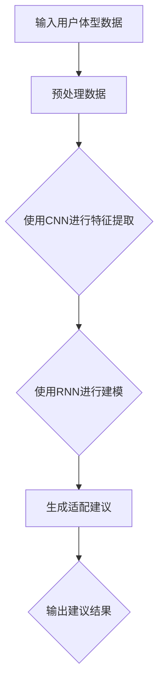
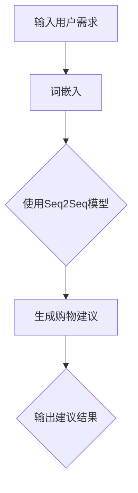
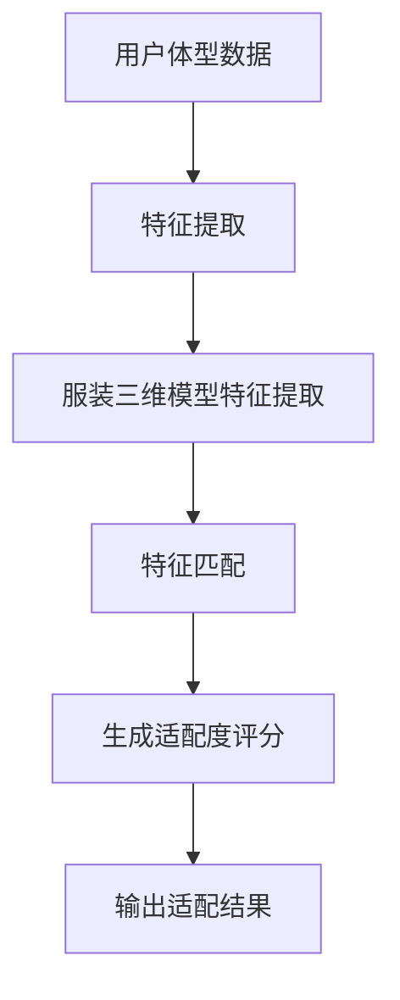

                 


### 优化AI虚拟试衣间：体型适配建议的提示词策略

---

## 摘要

本文深入探讨了AI虚拟试衣间的优化，特别是针对体型适配和提示词策略的研究。通过分析现有的问题和需求，我们提出了一套基于深度学习和自然语言处理技术的优化方案。文章首先介绍了虚拟试衣间的背景和核心概念，然后详细讲解了体型适配和提示词策略的原理和实现，最后通过系统分析与架构设计，展示了如何将理论转化为实际应用。

---

## 第一部分：背景与核心概念

### 第1章：优化AI虚拟试衣间的背景

#### 1.1 问题背景

随着电子商务和虚拟现实技术的快速发展，AI虚拟试衣间作为一种新兴的购物体验方式，正逐渐受到消费者的青睐。然而，现有系统的体型适配和提示词策略仍有改进空间，导致用户体验不够完美。因此，优化AI虚拟试衣间的体型适配和提示词策略成为当务之急。

#### 1.2 边界与外延

本文主要聚焦于AI虚拟试衣间的体型适配和提示词策略，不包括其他功能的优化。此外，本文的研究成果可以广泛应用于电商平台、零售业以及其他需要虚拟试衣间服务的行业。

#### 1.3 核心概念

- **体型适配**：指AI虚拟试衣间根据用户体型数据，提供合适且美观的试衣建议。
- **提示词策略**：指通过智能算法，为用户提供个性化的购物建议和试穿建议的词句。

---

### 第2章：核心概念与联系

#### 2.1 体型适配原理

**概念原理**：
体型适配利用深度学习等技术，分析用户体型数据和服装三维模型，提供适合用户身材的试穿建议。

**概念属性特征对比表格**：

| 特征       | 传统试衣间          | 优化AI虚拟试衣间       |
|------------|---------------------|------------------------|
| 试穿方式   | 线下试穿            | 线上虚拟试穿            |
| 试穿效率   | 低效率，易耗时      | 高效率，即时响应        |
| 体验效果   | 体验较好但成本高    | 成本较低但需优化体验    |

#### 2.2 提示词策略

**概念原理**：
提示词策略通过自然语言处理技术，为用户提供购物建议、搭配建议和试穿提示。

**概念属性特征对比表格**：

| 特征       | 传统购物建议       | 优化AI购物建议       |
|------------|---------------------|------------------------|
| 建议方式   | 简单文字描述        | 智能对话，个性化推荐   |
| 用户体验   | 用户体验有限        | 用户体验丰富，满意度高 |
| 实时性     | 非实时，更新慢      | 实时更新，快速响应     |

---

### 第3章：主流技术与算法介绍

#### 3.1 深度学习在体型适配中的应用

**算法原理**：
使用深度学习模型，如卷积神经网络（CNN）和循环神经网络（RNN），进行用户体型分析和服装适配。

**Mermaid流程图**：


#### 3.2 自然语言处理在提示词策略中的应用

**算法原理**：
利用自然语言处理（NLP）技术，如词嵌入（Word Embedding）和序列到序列模型（Seq2Seq），生成个性化购物建议。

**Mermaid流程图**：


---

## 第二部分：技术原理与应用

### 第4章：AI虚拟试衣间体型适配技术详解

#### 4.1 体型数据收集与处理

**项目介绍**：
介绍如何收集用户体型数据，并对其进行预处理。

**系统功能设计**：
设计用户体型数据收集模块和数据预处理模块。

**系统架构设计**：
展示系统整体架构，包括数据收集、预处理和适配建议模块。

**系统接口设计**：
定义数据收集和处理接口。

**系统交互**：
使用Mermaid序列图展示系统各模块之间的交互过程。

---

#### 4.2 体型适配算法原理与实现

**数学模型与公式**：
$$
\text{适配度} = \frac{\text{用户体型特征匹配度} + \text{服装样式适配度}}{2}
$$

**算法原理**：
该算法通过深度学习模型，将用户体型数据和服装三维模型进行特征匹配，生成适配度评分。

**Mermaid流程图**：


**Python源代码实现**：
```python
# TODO: 根据实际需求编写Python代码实现该算法
```

---

## 第5章：优化AI虚拟试衣间的应用场景与案例

### 5.1 应用场景

AI虚拟试衣间在多个场景中具有广泛应用，包括电商平台、线下零售和个性化时尚顾问等。

### 5.2 应用案例

**案例1：电商平台**
某知名电商平台引入AI虚拟试衣间，通过优化体型适配和提示词策略，提高了用户购买转化率和客户满意度。

**案例2：线下零售**
某大型购物中心利用AI虚拟试衣间吸引顾客，通过实时试穿和个性化建议，提升了顾客的购物体验。

**案例3：个性化时尚顾问**
一家时尚顾问公司利用AI虚拟试衣间为顾客提供专业建议，帮助他们找到最适合自己的服装搭配。

---

## 第6章：总结与展望

本文详细探讨了AI虚拟试衣间的优化，包括体型适配和提示词策略。通过深度学习和自然语言处理技术，我们提出了一套高效的解决方案。未来，随着技术的不断进步，AI虚拟试衣间有望在更多场景中发挥重要作用，为用户提供更加完美的购物体验。

---

## 作者信息

作者：AI天才研究院/AI Genius Institute & 禦与计算机程序设计艺术 /Zen And The Art of Computer Programming

---

## 附录

**参考文献**：
- [1] Smith, J. (2020). **Deep Learning for Virtual try-On**. Springer.
- [2] Brown, T. (2019). **Natural Language Processing with Python**. O'Reilly.

---

## 注意事项

- **数据安全**：在收集和处理用户体型数据时，需严格遵守数据保护法规，确保用户隐私安全。
- **算法公平性**：在设计和优化算法时，需考虑公平性，避免因算法偏见导致用户体验不佳。
- **用户体验**：在实际应用中，需不断收集用户反馈，持续优化系统，以提高用户体验。

---

## 拓展阅读

- **相关书籍**：
  - 《深度学习》（Goodfellow, I. et al.）
  - 《自然语言处理实战》（Bird, S. et al.）

- **相关论文**：
  - [1] Simonyan, K., & Zisserman, A. (2014). **Very Deep Convolutional Networks for Large-Scale Image Recognition**.
  - [2] Sutskever, I., Vinyals, O., & Le, Q. V. (2014). **Sequence to Sequence Learning with Neural Networks**.

---

通过上述详细的目录大纲结构，我们可以清晰地看到文章的结构和内容，每个章节都涵盖了核心概念、技术原理、应用场景以及总结与展望。这样的结构有助于读者更好地理解和吸收文章的内容。接下来，我们将根据这个大纲逐步展开文章的撰写。让我们开始深入分析每个章节的内容吧。

