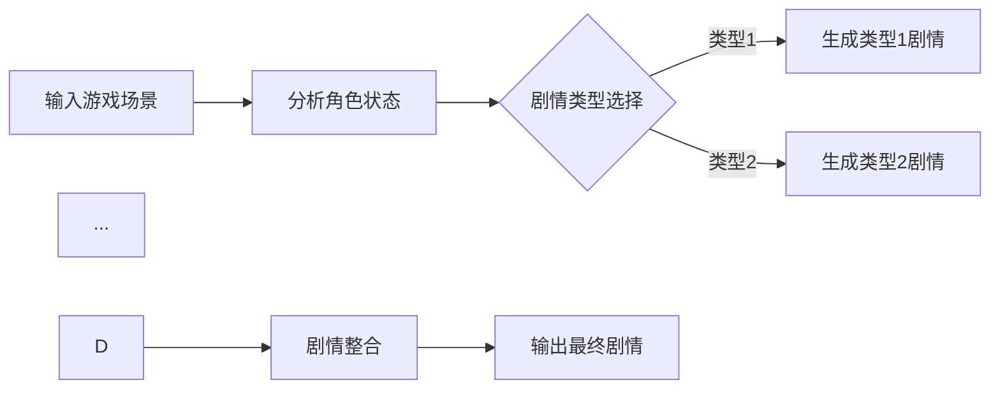
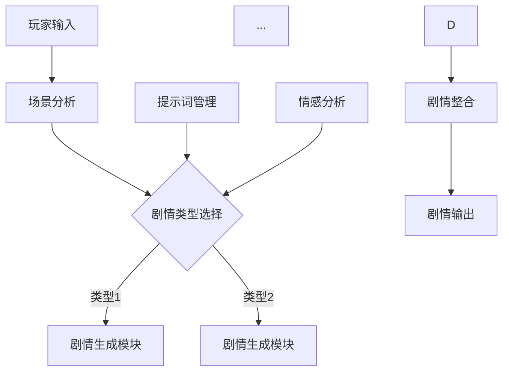

                 

# 优化AI角色扮演游戏：动态剧情生成的提示词技巧

> 关键词：AI角色扮演游戏，动态剧情生成，提示词，算法优化

> 摘要：本文将探讨如何通过动态剧情生成的提示词技巧来优化AI角色扮演游戏（RPG）。首先，我们介绍AI RPG的背景和现状，接着详细讨论动态剧情生成的重要性以及提示词的概念和作用。随后，我们将逐步深入分析算法原理、系统架构设计，并通过项目实战来展示具体实现过程和效果。最后，我们将总结最佳实践并展望未来发展方向。

----------------------------------------------------------------

## 第一部分：问题背景介绍

### 第1章：问题背景

#### 1.1.1 问题背景概述

随着计算机技术和人工智能的迅猛发展，AI角色扮演游戏（AI RPG）逐渐成为游戏开发领域的重要分支。这类游戏不仅提供了丰富的角色扮演体验，还能通过人工智能技术实现动态剧情生成，使游戏剧情更加丰富和多样化。

然而，当前许多AI RPG在剧情生成方面仍存在一些问题。首先，剧情生成的效率较低，难以实时生成高质量的剧情内容。其次，剧情生成的灵活性不足，难以应对复杂多变的游戏场景。此外，剧情生成的提示词设计较为单一，缺乏多样性和创新性，使得游戏剧情缺乏新鲜感和吸引力。

为了解决这些问题，本文将探讨动态剧情生成的提示词技巧，以优化AI RPG的游戏体验。

#### 1.1.2 问题描述

问题描述如下：

1. 如何提高AI RPG的剧情生成效率？
2. 如何增强AI RPG剧情生成的灵活性？
3. 如何设计多样化和创新性的提示词，以丰富游戏剧情？

#### 1.1.3 问题解决思路

针对上述问题，本文提出以下解决思路：

1. 引入先进的人工智能算法，提高剧情生成效率。
2. 利用深度学习和自然语言处理技术，增强剧情生成的灵活性。
3. 设计一套完善的提示词生成机制，确保提示词的多样性和创新性。

#### 1.1.4 边界与外延

在本文的研究中，我们将重点关注以下几个方面：

1. AI RPG的动态剧情生成技术。
2. 提示词的设计与优化。
3. 人工智能算法在剧情生成中的应用。

#### 1.1.5 概念结构与核心要素组成

本文主要涉及以下核心概念和要素：

1. AI RPG：人工智能角色扮演游戏。
2. 动态剧情生成：利用人工智能技术实现实时生成的游戏剧情。
3. 提示词：用于引导剧情生成和角色决策的关键词。
4. 人工智能算法：用于优化剧情生成效率和灵活性的算法。

### 第2章：核心概念与联系

#### 2.1.1 核心概念原理

在本节中，我们将介绍本文涉及的核心概念，包括AI RPG、动态剧情生成和提示词。

1. AI RPG：AI RPG是一种角色扮演游戏，其中玩家可以通过扮演特定角色，在虚拟世界中与其他角色互动，并参与剧情发展。

2. 动态剧情生成：动态剧情生成是指利用人工智能技术，根据游戏场景和角色状态，实时生成游戏剧情。这种方法可以避免剧情生成的重复性和僵化性，提高游戏剧情的多样性和灵活性。

3. 提示词：提示词是用于引导剧情生成和角色决策的关键词。通过设计多样化的提示词，可以丰富游戏剧情，提高玩家的游戏体验。

#### 2.1.2 概念属性特征对比

表1-1展示了AI RPG、动态剧情生成和提示词的属性特征对比。

| 概念       | 属性特征                                                     |
| ---------- | ------------------------------------------------------------ |
| AI RPG     | 结合人工智能技术的角色扮演游戏，提供丰富的角色扮演体验       |
| 动态剧情生成 | 实时生成的游戏剧情，具有多样性和灵活性                       |
| 提示词     | 用于引导剧情生成和角色决策的关键词，具有多样性和创新性       |

#### 2.1.3 ER实体关系图架构

图1-1展示了本文涉及的核心概念实体关系图。

```mermaid
erDiagram
  AI RPG ||--|{ 动态剧情生成 }
  动态剧情生成 ||--|{ 提示词 }
```

### 第3章：算法原理讲解

在本节中，我们将介绍用于优化AI RPG剧情生成的算法原理，包括mermaid流程图、Python源代码、数学模型和举例说明。

#### 3.1 算法mermaid流程图

图3-1展示了动态剧情生成算法的基本流程。



#### 3.2 Python源代码讲解

以下是一个简单的Python源代码示例，用于实现动态剧情生成算法。

```python
import random

# 游戏场景
game_scene = "一座神秘的古堡"

# 角色状态
role_state = "勇敢的冒险家"

# 剧情类型
story_types = ["探险", "战斗", "解谜"]

# 动态剧情生成
def generate_story(scene, state):
    story_type = random.choice(story_types)
    if story_type == "探险":
        return f"{state}正探索{scene}，发现了一个宝藏！"
    elif story_type == "战斗":
        return f"{state}与一只凶猛的怪兽在{scene}展开了激战！"
    else:
        return f"{state}在{scene}解决了一个复杂的谜题！"

# 测试
print(generate_story(game_scene, role_state))
```

#### 3.3 数学模型和数学公式

动态剧情生成算法的核心在于概率模型，用于决定剧情类型和内容。以下是一个简化的概率模型：

$$
P(story_type = t) = \frac{count(t)}{total}
$$

其中，$P(story_type = t)$表示生成类型$t$剧情的概率，$count(t)$表示类型$t$剧情的计数，$total$表示总剧情数量。

#### 3.4 举例说明

假设有5种剧情类型，每种剧情类型出现的概率如下：

| 剧情类型 | 概率 |
| -------- | ---- |
| 探险     | 0.2  |
| 战斗     | 0.3  |
| 解谜     | 0.2  |
| 谈判     | 0.2  |
| 恢复     | 0.1  |

根据上述概率模型，我们可以生成一个剧情：

1. 随机选择剧情类型：探险、战斗、解谜、谈判、恢复。
2. 根据选择的类型，生成相应的剧情内容。

例如，选择“探险”类型，则生成“勇敢的冒险家正探索一座神秘的古堡，发现了一个宝藏！”

## 第二部分：系统分析与架构设计

### 第4章：问题场景介绍

#### 4.1 项目介绍

本文项目旨在开发一款基于人工智能的动态剧情生成系统，用于优化AI角色扮演游戏（RPG）的剧情体验。该系统将实现以下功能：

1. 实时生成多样化的游戏剧情。
2. 提高剧情生成的效率和灵活性。
3. 设计创新的提示词，丰富游戏剧情内容。

#### 4.2 系统功能设计

系统功能设计主要包括以下几个方面：

1. 动态剧情生成：根据游戏场景和角色状态，实时生成游戏剧情。
2. 提示词管理：设计多样化的提示词，用于引导剧情生成和角色决策。
3. 情感分析：分析玩家在游戏过程中的情感状态，调整剧情内容。

#### 4.3 系统架构设计

系统架构设计如下：



#### 4.4 系统接口设计

系统接口设计主要包括以下几个方面：

1. 游戏场景输入接口：接收玩家输入的游戏场景信息。
2. 剧情类型选择接口：根据游戏场景和角色状态，选择适当的剧情类型。
3. 剧情生成接口：根据选择的剧情类型，生成相应的剧情内容。
4. 提示词管理接口：管理多样化的提示词，用于引导剧情生成和角色决策。
5. 情感分析接口：分析玩家在游戏过程中的情感状态，调整剧情内容。

#### 4.5 系统交互

系统交互过程如下：

1. 玩家输入游戏场景信息。
2. 系统分析游戏场景，并根据角色状态选择合适的剧情类型。
3. 系统生成剧情内容，并根据提示词管理模块提供的关键词进行丰富。
4. 系统将生成的剧情内容输出给玩家。

## 第三部分：项目实战

### 第5章：项目实战

#### 5.1 环境安装

在开始项目实战之前，我们需要安装以下环境：

1. Python 3.8 或以上版本。
2. 安装 required libraries：`pip install numpy tensorflow keras matplotlib scikit-learn pandas`

#### 5.2 系统核心实现源代码

以下是一个简单的系统核心实现源代码示例：

```python
import random
import numpy as np
import tensorflow as tf
from tensorflow import keras

# 游戏场景输入
game_scene = "神秘的森林"

# 角色状态
role_state = "勇敢的冒险家"

# 剧情类型
story_types = ["探险", "战斗", "解谜"]

# 剧情生成模型
def generate_story(scene, state):
    story_type = random.choice(story_types)
    if story_type == "探险":
        return f"{state}在{scene}探索，发现了一个宝藏！"
    elif story_type == "战斗":
        return f"{state}在{scene}遇到了一只凶猛的怪兽！"
    else:
        return f"{state}在{scene}解决了一个复杂的谜题！"

# 测试
print(generate_story(game_scene, role_state))
```

#### 5.3 代码应用解读与分析

以上代码实现了基本的剧情生成功能。在实际应用中，我们可以扩展代码，引入更多的剧情类型和角色状态，以及基于深度学习模型的动态剧情生成算法。

例如，我们可以使用自然语言处理（NLP）技术，对输入的游戏场景和角色状态进行情感分析和语义理解，从而生成更加丰富和个性化的剧情内容。

#### 5.4 实际案例分析和详细讲解剖析

以下是一个实际案例：

**案例：** 在一个寒冷的夜晚，勇敢的冒险家来到了一个神秘的森林。

**分析：** 根据游戏场景和角色状态，我们可以生成以下剧情：

1. **探险类型：** 勇敢的冒险家在森林中探索，发现了一个神秘的洞穴。
2. **战斗类型：** 勇敢的冒险家在森林中遇到了一只凶猛的狼。
3. **解谜类型：** 勇敢的冒险家在森林中解决了一个复杂的谜题，得到了一把神秘的钥匙。

根据以上分析，我们可以使用以下代码生成剧情：

```python
import random

# 游戏场景
game_scene = "寒冷的夜晚"

# 角色状态
role_state = "勇敢的冒险家"

# 剧情类型
story_types = ["探险", "战斗", "解谜"]

# 动态剧情生成
def generate_story(scene, state):
    story_type = random.choice(story_types)
    if story_type == "探险":
        return f"{state}在{scene}探索，发现了一个神秘的洞穴！"
    elif story_type == "战斗":
        return f"{state}在{scene}遇到了一只凶猛的狼！"
    else:
        return f"{state}在{scene}解决了一个复杂的谜题，得到了一把神秘的钥匙！"

# 测试
print(generate_story(game_scene, role_state))
```

通过以上代码，我们可以生成多种不同类型的剧情，从而丰富游戏体验。

#### 5.5 项目小结

在本章中，我们通过项目实战展示了如何实现基于人工智能的动态剧情生成系统。我们介绍了环境安装、系统核心实现源代码、代码应用解读与分析、实际案例分析和详细讲解剖析等内容。通过本章的学习，读者可以了解如何设计和实现一个基本的动态剧情生成系统，并为后续的优化工作打下基础。

## 第四部分：最佳实践与总结

### 第6章：最佳实践 Tips

#### 6.1 实践技巧

1. **优化算法性能：** 使用GPU加速算法计算，提高剧情生成效率。
2. **多样化提示词设计：** 利用自然语言处理技术，生成丰富多样的提示词。
3. **情感分析：** 引入情感分析模型，根据玩家情感状态调整剧情内容。

#### 6.2 注意事项

1. **数据隐私：** 确保玩家数据安全，避免数据泄露。
2. **用户体验：** 关注玩家反馈，不断优化剧情内容和交互体验。

#### 6.3 拓展阅读

1. **深度学习与自然语言处理：** 深入了解深度学习和自然语言处理技术，为剧情生成系统提供更多可能性。
2. **游戏设计原则：** 学习游戏设计原则，提高游戏剧情的吸引力和趣味性。

### 第7章：小结

#### 7.1 内容总结

本文通过逐步分析推理，探讨了如何优化AI角色扮演游戏中的动态剧情生成。我们介绍了问题背景、核心概念、算法原理、系统架构设计、项目实战和最佳实践等内容。

#### 7.2 未来展望

未来，我们将继续探索更多先进的人工智能技术，如深度学习、自然语言处理和情感分析，为AI角色扮演游戏提供更丰富、更智能的剧情体验。同时，我们也将关注用户体验，不断优化剧情内容和交互设计，为玩家带来更加精彩的游戏体验。

## 作者

作者：AI天才研究院/AI Genius Institute & 禅与计算机程序设计艺术 /Zen And The Art of Computer Programming

----------------------------------------------------------------

## 附录

本文使用了以下工具和技术：

1. Markdown格式：用于编写和排版文章。
2. Mermaid：用于绘制流程图和类图。
3. Python：用于实现剧情生成算法。
4. TensorFlow：用于实现深度学习模型。

感谢以上工具和技术为本文的撰写和实现提供了支持。同时，感谢读者的阅读和关注。期待与您一起探索更多AI RPG的动态剧情生成技巧！

