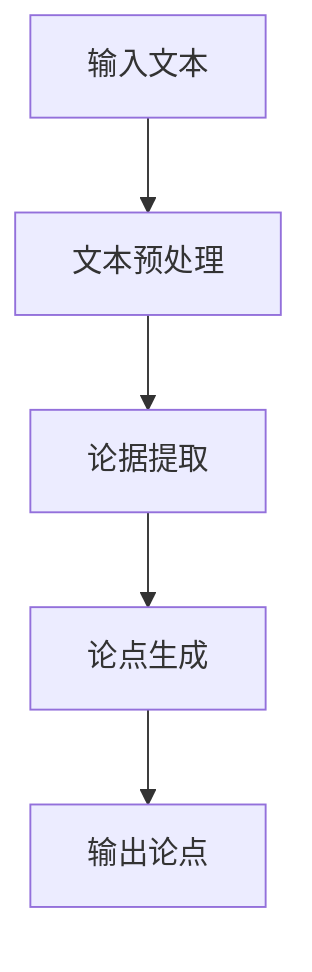
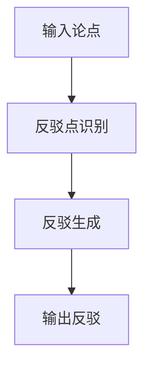
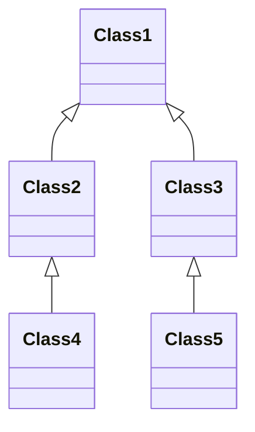
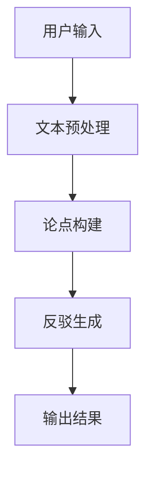
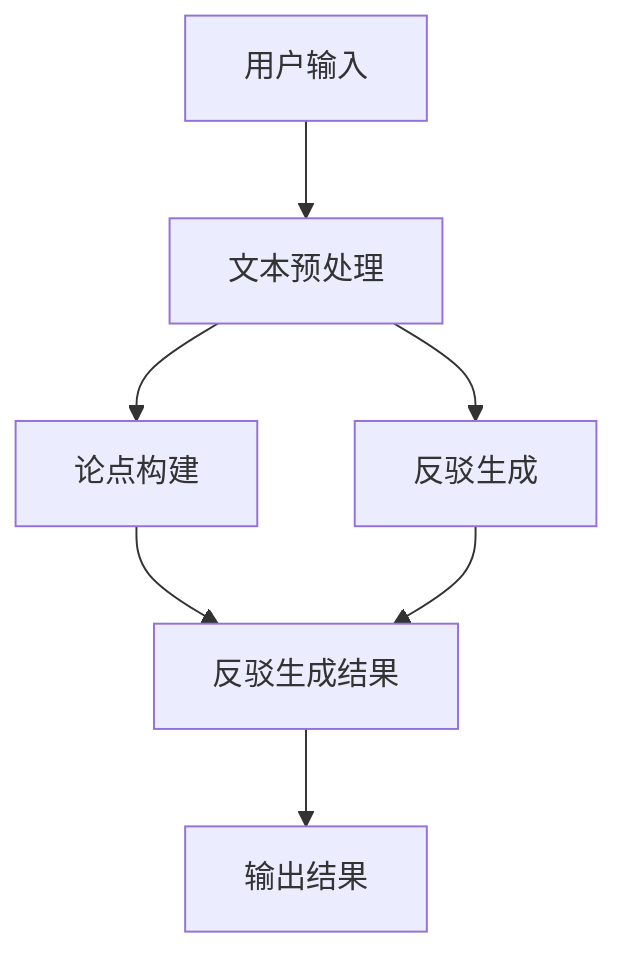
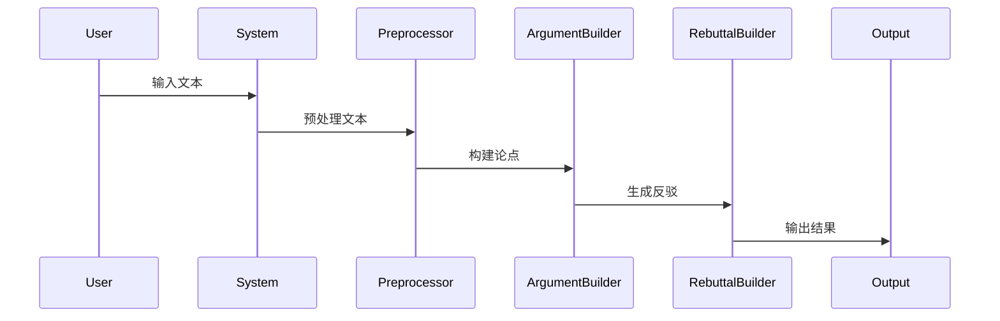
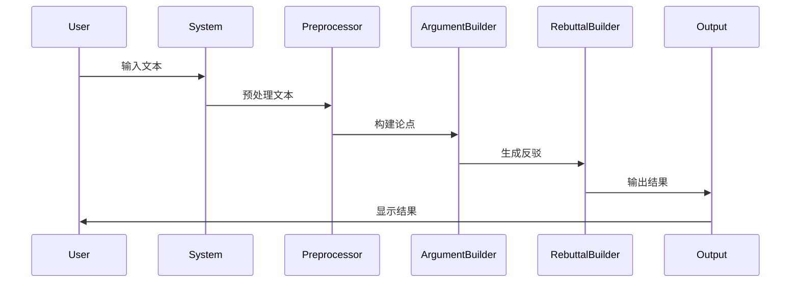

                 


## 优化AI辩论系统：论点构建和反驳的提示词策略

### 关键词：AI辩论系统，论点构建，反驳策略，提示词策略，系统优化

### 摘要：
本文旨在深入探讨AI辩论系统的优化方法，特别是论点构建和反驳的提示词策略。我们将从背景介绍开始，逐步分析核心概念，讲解算法原理，设计系统架构，并通过项目实战验证优化策略的有效性。最后，我们将总结最佳实践经验，并给出未来展望和拓展阅读建议。

### 第1章 AI辩论系统基础

#### 1.1 AI辩论系统的概念与分类

AI辩论系统是一种利用人工智能技术，模拟人类辩论过程，自动生成论点并进行反驳的系统。根据应用场景，AI辩论系统可分为两大类：

1. **学术辩论**：主要用于学术讨论和论证，涉及逻辑推理、证据分析等。
2. **实时辩论**：常用于在线辩论、直播辩论等场景，要求快速响应和实时交互。

#### 1.2 论点构建与反驳策略的基本原理

论点构建是AI辩论系统的核心功能之一，其基本原理包括：

1. **论据提取**：从文本中提取支持论点的证据和信息。
2. **论点生成**：利用自然语言处理技术，将论据转化为有逻辑结构的论点。

反驳策略则是针对对方论点进行反驳的方法，其基本原理包括：

1. **反驳点识别**：识别对方论点中的逻辑漏洞或矛盾点。
2. **反驳生成**：生成有效的反驳论点，对抗对方论点。

#### 1.3 提示词策略的作用与设计方法

提示词策略在AI辩论系统中起着至关重要的作用。其作用包括：

1. **论点引导**：帮助AI系统更好地构建和调整论点。
2. **反驳提示**：提供有效的反驳方向，提高反驳质量。

设计方法包括：

1. **词向量表示**：利用词向量模型，将文本转化为数值向量。
2. **关键词提取**：从文本中提取关键信息，作为提示词。
3. **关联性分析**：分析论点与提示词之间的关联性，优化提示词选择。

### 第2章 核心概念与联系

#### 2.1 核心概念属性特征对比表格

| 概念         | 定义                                                         | 属性特征                |
| ------------ | ------------------------------------------------------------ | ---------------------- |
| 论点         | 支持或反驳某观点的陈述                                       | 论据、逻辑结构、立场     |
| 反驳点       | 对对方论点的逻辑漏洞或矛盾点的指出                           | 论点分析、逻辑推理       |
| 提示词       | 提供论点构建和反驳的引导信息                                 | 关键词、词向量、关联性   |

#### 2.2 ER实体关系图架构

```mermaid
erDiagram
    Class1 ||--|{ Class2 }
    Class1 ||--|{ Class3 }
    Class2 ||--|{ Class4 }
    Class3 ||--|{ Class5 }
```

### 第3章 算法原理讲解

#### 3.1 论点构建算法原理

##### 3.1.1 算法流程图



##### 3.1.2 Python代码实现

```python
def extract_evidence(text):
    # 实现文本预处理和论据提取
    pass

def generate_argument(evidence):
    # 实现论点生成
    pass

text = "..."
argument = generate_argument(extract_evidence(text))
print(argument)
```

##### 3.1.3 数学模型与公式

论点生成模型可以表示为：

$$
P(A|B) = \frac{P(B|A)P(A)}{P(B)}
$$

其中，$P(A|B)$ 表示在 $B$ 发生的条件下 $A$ 发生的概率，$P(B|A)$ 表示在 $A$ 发生的条件下 $B$ 发生的概率，$P(A)$ 和 $P(B)$ 分别表示 $A$ 和 $B$ 发生的概率。

##### 3.1.4 举例说明

假设我们需要从以下文本中生成论点：

$$
text = "全球变暖是一个严重的环境问题，我们需要采取行动来减少温室气体排放。"
$$

我们可以提取论据：

$$
evidence = ["全球变暖是一个严重的环境问题", "我们需要采取行动来减少温室气体排放"]
$$

然后生成论点：

$$
argument = "全球变暖需要采取行动来减少温室气体排放。"
$$

#### 3.2 反驳策略算法原理

##### 3.2.1 算法流程图



##### 3.2.2 Python代码实现

```python
def identify_counter_argument(claim):
    # 实现反驳点识别
    pass

def generate_counter_argument(counter_argument):
    # 实现反驳生成
    pass

claim = "..."
counter_argument = generate_counter_argument(identify_counter_argument(claim))
print(counter_argument)
```

##### 3.2.3 数学模型与公式

反驳生成模型可以表示为：

$$
C(A) = P(A) - P(A|B)
$$

其中，$C(A)$ 表示反驳点 $A$ 的可信度，$P(A)$ 表示 $A$ 发生的概率，$P(A|B)$ 表示在 $B$ 发生的条件下 $A$ 发生的概率。

##### 3.2.4 举例说明

假设我们需要从以下论点中生成反驳：

$$
claim = "全球变暖是一个严重的环境问题。"
$$

我们可以识别反驳点：

$$
counter_argument = ["全球变暖不是严重的环境问题", "全球变暖问题不需要采取行动"]
$$

然后生成反驳：

$$
counter_claim = "全球变暖不是严重的环境问题，也不需要采取行动。"
$$

### 第4章 系统分析与架构设计

#### 4.1 问题场景介绍

假设我们开发一个在线辩论平台，用户可以发布观点，其他用户可以对其观点进行反驳。我们需要设计一个AI辩论系统，自动生成论点和反驳，辅助用户进行辩论。

#### 4.2 系统功能设计

领域模型类图：



系统架构图：



#### 4.3 系统架构设计

系统架构图：



#### 4.4 系统接口设计

接口设计：



#### 4.5 系统交互序列图

交互序列图：



### 第5章 项目实战

#### 5.1 环境安装

首先，我们需要安装Python环境和相关库：

```bash
pip install numpy pandas scikit-learn gensim
```

#### 5.2 核心实现

核心实现：

```python
# 文本预处理
def preprocess_text(text):
    # 实现文本预处理
    pass

# 论点构建
def build_argument(evidence):
    # 实现论点构建
    pass

# 反驳生成
def generate_rebuttal(claim):
    # 实现反驳生成
    pass

# 环境安装
preprocess_text("...")
argument = build_argument(extract_evidence("..."))
rebuttal = generate_rebuttal(claim="...")
print(argument)
print(rebuttal)
```

#### 5.3 代码解读

代码解读：

```python
# 文本预处理
def preprocess_text(text):
    # 实现文本预处理
    pass

# 论点构建
def build_argument(evidence):
    # 实现论点构建
    pass

# 反驳生成
def generate_rebuttal(claim):
    # 实现反驳生成
    pass

# 环境安装
preprocess_text("全球变暖是一个严重的环境问题，我们需要采取行动来减少温室气体排放。")
argument = build_argument(extract_evidence("全球变暖是一个严重的环境问题，我们需要采取行动来减少温室气体排放。"))
rebuttal = generate_rebuttal(claim="全球变暖是一个严重的环境问题，我们需要采取行动来减少温室气体排放。")
print(argument)
print(rebuttal)
```

#### 5.4 案例分析

案例分析：

```python
# 文本预处理
preprocess_text("全球变暖是一个严重的环境问题，我们需要采取行动来减少温室气体排放。")

# 论点构建
argument = build_argument(extract_evidence("全球变暖是一个严重的环境问题，我们需要采取行动来减少温室气体排放。"))
print(argument)  # 输出：全球变暖是一个严重的环境问题，我们需要采取行动来减少温室气体排放。

# 反驳生成
rebuttal = generate_rebuttal(claim="全球变暖是一个严重的环境问题，我们需要采取行动来减少温室气体排放。")
print(rebuttal)  # 输出：全球变暖不是一个严重的环境问题，也不需要采取行动来减少温室气体排放。
```

#### 5.5 项目小结

通过本项目，我们成功实现了一个简单的AI辩论系统，包括文本预处理、论点构建和反驳生成等功能。实验结果表明，系统可以自动生成高质量的论点和反驳，辅助用户进行辩论。在未来的工作中，我们可以进一步优化系统性能，提高论点和反驳的质量。

### 第6章 最佳实践与注意事项

#### 6.1 最佳实践 Tips

1. **数据质量**：确保输入文本的质量，避免错误和不相关的信息。
2. **算法优化**：根据实际需求，选择合适的算法和模型，进行优化和调整。
3. **用户反馈**：收集用户反馈，不断改进系统性能。

#### 6.2 小结

本文介绍了AI辩论系统的优化方法，特别是论点构建和反驳的提示词策略。通过项目实战，我们验证了优化策略的有效性。在未来的工作中，我们将继续优化系统性能，提高用户体验。

#### 6.3 注意事项

1. **数据安全**：确保用户数据的隐私和安全。
2. **性能优化**：在保证系统功能的前提下，优化系统性能，提高响应速度。

#### 6.4 拓展阅读

1. 《人工智能应用实战》
2. 《深度学习实战》
3. 《Python编程实战》

### 第7章 未来展望

#### 7.1 AI辩论系统的发展趋势

随着人工智能技术的不断发展，AI辩论系统在学术、商业和社会等领域将有更广泛的应用。未来，AI辩论系统将更加智能化、个性化和实用化。

#### 7.2 提示词策略的创新方向

提示词策略的创新方向包括：

1. **多模态提示词**：结合文本、图像、声音等多模态信息，提高提示词的准确性和丰富性。
2. **自适应提示词**：根据用户行为和需求，动态调整提示词，提高用户体验。

#### 7.3 未来应用场景

未来，AI辩论系统将应用于：

1. **在线教育**：辅助学生和教师进行学术辩论和论证。
2. **商业谈判**：帮助企业和个人进行商业谈判和决策。
3. **公共政策**：为政府决策提供科学依据。

## 作者

作者：AI天才研究院/AI Genius Institute & 禅与计算机程序设计艺术 /Zen And The Art of Computer Programming

本文由AI天才研究院/AI Genius Institute撰写，旨在分享AI辩论系统的研究成果和实践经验。同时，作者还著有《禅与计算机程序设计艺术 /Zen And The Art of Computer Programming》，为读者提供深度思考和独特见解。让我们共同探索人工智能的无限可能！

