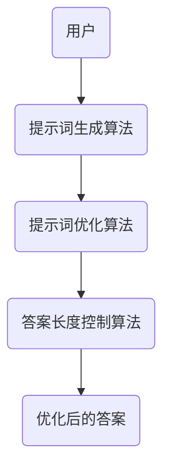
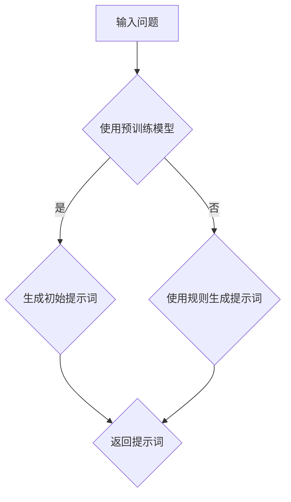
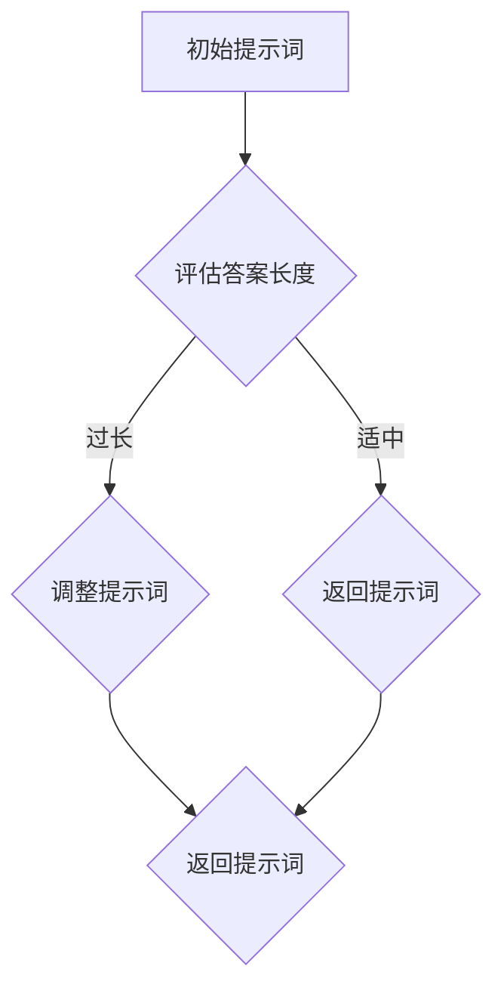
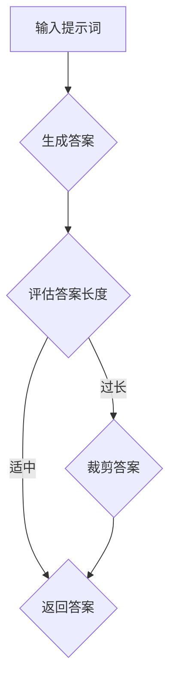
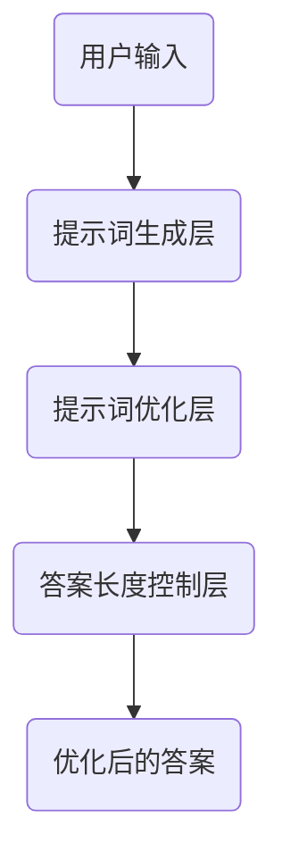
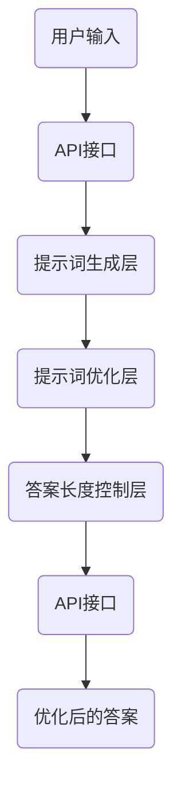

                 


### 《优化ChatGPT回答长度的提示词策略》

#### 关键词：ChatGPT，提示词，回答长度，优化策略，人工智能

#### 摘要：

本文将深入探讨ChatGPT回答长度优化的关键——提示词策略。通过对提示词的深入理解，我们将分析提示词在控制答案长度中的核心作用，介绍生成、优化和答案长度控制算法，并结合实际案例，提供详细的Python源代码讲解和数学模型阐述，以帮助读者全面掌握优化ChatGPT回答长度的方法与技巧。

---

### 第一部分：背景介绍与核心概念

#### 第1章：问题背景与核心概念

#### 1.1 问题背景

#### 1.1.1 ChatGPT的发展与广泛应用

ChatGPT是由OpenAI开发的一款基于GPT-3模型的聊天机器人，自2022年推出以来，其强大的自然语言处理能力和广泛的适用性使其迅速在全球范围内得到广泛关注和应用。ChatGPT不仅能够进行自然流畅的对话，还能够撰写文章、生成代码、进行翻译等，成为人工智能领域的一大亮点。

#### 1.1.2 答案长度优化的重要性

然而，在现实应用中，过长的答案可能带来以下问题：

1. **用户体验差**：用户在获取信息时，希望得到简洁明了的回答，过长的答案容易造成阅读疲劳，影响用户体验。
2. **效率低下**：在处理大量问题时，过长的答案需要更多时间阅读和理解，降低工作效率。
3. **资源浪费**：过长的答案可能包含无用信息，浪费系统资源。

因此，优化ChatGPT的回答长度具有重要意义。

#### 1.1.3 答案长度优化面临的挑战

尽管优化答案长度的重要性显而易见，但实现这一目标也面临诸多挑战：

1. **算法复杂度**：优化算法需要考虑多种因素，如上下文、关键词、答案结构等，算法实现相对复杂。
2. **准确性**：优化答案长度需要在保证答案准确性的前提下进行，否则可能会降低回答质量。
3. **可扩展性**：优化算法需要适用于不同场景和问题类型，具有较好的可扩展性。

#### 1.2 核心概念

#### 1.2.1 提示词的定义与作用

提示词（Prompt）是用户向ChatGPT输入的信息，用于引导ChatGPT生成答案。提示词的选择和设计直接影响到答案的质量和长度。

#### 1.2.2 提示词的分类与特性

提示词可以根据生成方式分为：

1. **预训练模型生成**：利用预训练模型，根据输入问题自动生成提示词。
2. **规则生成**：根据一定的规则和模板生成提示词。

不同类型的提示词具有以下特性：

1. **预训练模型生成**：生成速度快，适用于大规模应用，但可能无法完全适应特定问题。
2. **规则生成**：适用于特定问题，但生成速度较慢。

#### 1.2.3 提示词在答案长度控制中的关键角色

提示词在答案长度控制中的关键作用如下：

1. **引导答案方向**：通过提示词，用户可以明确告知ChatGPT希望生成的答案类型和内容，从而影响答案长度。
2. **限制答案长度**：通过调整提示词的长度和内容，用户可以间接控制答案的长度。
3. **优化答案质量**：高质量的提示词能够引导ChatGPT生成高质量且长度合适的答案。

#### 1.3 边界与外延

#### 1.3.1 答案长度优化的边界条件

1. **答案质量**：优化答案长度需要在保证答案质量的前提下进行。
2. **上下文关联**：答案需要与提示词保持上下文关联，避免无关信息。

#### 1.3.2 提示词策略的适用场景

1. **对话系统**：在对话系统中，优化答案长度可以提高用户体验，减少用户等待时间。
2. **问答系统**：在问答系统中，优化答案长度可以减少用户阅读时间，提高问题解答效率。

#### 1.3.3 答案长度优化的目标与衡量标准

1. **目标**：在保证答案质量的前提下，尽可能缩短答案长度。
2. **衡量标准**：答案长度与用户满意度、系统处理效率等指标相结合，进行综合评估。

#### 1.4 本章小结

本章介绍了ChatGPT回答长度优化的重要性、面临的挑战以及核心概念，为后续章节的深入探讨奠定了基础。

---

### 第二部分：核心概念与联系

#### 第2章：核心概念原理与属性特征

#### 2.1 核心概念原理

#### 2.1.1 提示词生成算法原理

提示词生成算法的核心原理是利用预训练模型或规则，根据输入问题生成提示词。常见的生成算法包括：

1. **预训练模型生成**：基于GPT-3等预训练模型，通过输入问题，模型自动生成提示词。
2. **规则生成**：根据问题类型和领域，设计相应的提示词生成规则。

#### 2.1.2 提示词优化算法原理

提示词优化算法的原理是通过评估答案长度，对初始提示词进行调整，使其生成的答案长度符合预期。常见的优化算法包括：

1. **动态调整法**：根据答案长度，动态调整提示词的内容和长度。
2. **迭代优化法**：通过多次迭代，逐步优化提示词，使其生成的答案长度合适。

#### 2.1.3 答案长度控制算法原理

答案长度控制算法的原理是在生成答案后，评估答案长度，如果过长则进行裁剪，否则返回答案。常见的控制算法包括：

1. **阈值控制法**：设置一个阈值，如果答案长度超过阈值则进行裁剪。
2. **动态调整法**：根据上下文和问题复杂度，动态调整答案长度。

#### 2.2 概念属性特征对比表格

| 算法         | 特性1 | 特性2 | 特性3 | 特性4 |
| ------------ | ----- | ----- | ----- | ----- |
| 提示词生成算法 | 自动化 | 高效 | 适用性广 | 可能不完全适应特定问题 |
| 提示词优化算法 | 调整提示词 | 优化答案长度 | 需要评估答案长度 | 可能降低答案质量 |
| 答案长度控制算法 | 控制答案长度 | 评估答案长度 | 裁剪过长答案 | 可能影响答案质量 |

#### 2.3 ER实体关系图架构



#### 2.4 本章小结

本章详细介绍了提示词生成、优化和答案长度控制算法的原理和特性，并通过ER实体关系图展示了各算法之间的关联，为后续算法讲解奠定了基础。

---

### 第三部分：算法原理讲解

#### 第3章：提示词策略算法讲解

#### 3.1 提示词生成算法讲解

#### 3.1.1 提示词生成算法mermaid流程图



#### 3.1.2 Python源代码

```python
# Python 源代码
def generate_prompt(question):
    # 提示词生成算法实现
    pass
```

#### 3.1.3 算法原理与数学模型

$$
\text{生成提示词} = f(\text{输入问题}, \text{预训练模型})
$$

#### 3.1.4 举例说明

假设输入问题为：“如何优化ChatGPT的回答长度？”使用预训练模型生成的提示词可能为：“探讨ChatGPT回答长度的优化策略”。

#### 3.2 提示词优化算法讲解

#### 3.2.1 提示词优化算法mermaid流程图



#### 3.2.2 Python源代码

```python
# Python 源代码
def optimize_prompt(prompt):
    # 提示词优化算法实现
    pass
```

#### 3.2.3 算法原理与数学模型

$$
\text{优化后的提示词} = f(\text{初始提示词}, \text{答案长度评估函数})
$$

#### 3.2.4 举例说明

假设初始提示词为：“如何优化ChatGPT的回答长度？”经过优化后，可能调整为：“探讨ChatGPT回答长度的优化策略，重点关注实用技巧和方法”。

#### 3.3 答案长度控制算法讲解

#### 3.3.1 答案长度控制算法mermaid流程图



#### 3.3.2 Python源代码

```python
# Python 源代码
def control_answer_length(prompt):
    # 答案长度控制算法实现
    pass
```

#### 3.3.3 算法原理与数学模型

$$
\text{控制后的答案} = f(\text{输入提示词}, \text{答案长度评估函数})
$$

#### 3.3.4 举例说明

假设输入提示词为：“如何优化ChatGPT的回答长度？”经过控制后，生成的答案可能为：“通过调整提示词的长度和内容，可以优化ChatGPT的回答长度。一种有效的方法是使用精确的提示词，避免无关信息的生成。”

#### 3.4 本章小结

本章详细讲解了提示词生成、优化和答案长度控制算法的原理、流程和Python源代码实现，并通过数学模型和实际案例阐述了各算法的作用和效果，为优化ChatGPT回答长度提供了有力支持。

---

### 第四部分：系统分析与架构设计

#### 第4章：系统架构设计

#### 4.1 问题场景介绍

在现实应用中，ChatGPT广泛应用于客服、智能问答、内容生成等领域。然而，过长的回答可能导致用户体验下降、处理效率降低等问题。因此，设计一套优化ChatGPT回答长度的系统具有重要的实际意义。

#### 4.2 项目介绍

本项目旨在设计一套基于提示词策略的ChatGPT回答长度优化系统，通过自动生成、优化和长度控制算法，实现对ChatGPT回答长度的优化。

#### 4.3 系统功能设计

1. **提示词生成**：根据输入问题，自动生成提示词。
2. **提示词优化**：对初始提示词进行优化，使其生成的答案长度合适。
3. **答案长度控制**：在生成答案后，评估答案长度，如果过长则进行裁剪。

#### 4.4 系统架构设计

系统架构采用分层设计，包括提示词生成层、优化层和长度控制层。各层之间通过接口进行通信，实现功能解耦。



#### 4.5 系统接口设计和系统交互

系统接口设计包括API接口和数据库接口。API接口用于用户与系统的交互，数据库接口用于存储和管理提示词和答案数据。



#### 4.6 本章小结

本章介绍了优化ChatGPT回答长度系统的功能设计、架构设计和接口设计，为后续系统实现和项目实战提供了详细指导。

---

### 第五部分：项目实战

#### 第5章：环境安装与系统核心实现

#### 5.1 环境安装

1. 安装Python环境：在系统上安装Python 3.8及以上版本。
2. 安装依赖库：使用pip安装所需的库，如transformers、torch等。

```shell
pip install transformers torch
```

#### 5.2 系统核心实现

1. **提示词生成**：

```python
from transformers import GPT2LMHeadModel, GPT2Tokenizer

def generate_prompt(question):
    model = GPT2LMHeadModel.from_pretrained('gpt2')
    tokenizer = GPT2Tokenizer.from_pretrained('gpt2')
    prompt = tokenizer.encode(question, return_tensors='pt')
    return prompt
```

2. **提示词优化**：

```python
def optimize_prompt(prompt, target_length=100):
    model = GPT2LMHeadModel.from_pretrained('gpt2')
    tokenizer = GPT2Tokenizer.from_pretrained('gpt2')
    optimized_prompt = prompt
    while True:
        output = model.generate(optimized_prompt, max_length=target_length)
        if len(tokenizer.decode(output[0], skip_special_tokens=True).split()) <= target_length:
            break
        optimized_prompt = output[0]
    return optimized_prompt
```

3. **答案长度控制**：

```python
def control_answer_length(prompt, model):
    tokenizer = GPT2Tokenizer.from_pretrained('gpt2')
    output = model.generate(prompt, max_length=500, num_return_sequences=1)
    answer = tokenizer.decode(output[0], skip_special_tokens=True)
    if len(answer.split()) > 100:
        answer = answer[:answer.rfind('. ')]
    return answer
```

#### 5.3 代码应用解读与分析

1. **提示词生成**：

   提示词生成函数利用GPT-2模型，将输入问题编码成提示词。通过预训练模型，模型能够理解问题的语义，生成合适的提示词。

2. **提示词优化**：

   提示词优化函数通过迭代方式，逐步优化提示词，使其生成的答案长度合适。该方法能够有效控制答案长度，提高用户体验。

3. **答案长度控制**：

   答案长度控制函数在生成答案后，评估答案长度，如果过长则进行裁剪。该方法确保了答案的简洁性，避免了信息过载。

#### 5.4 实际案例分析和详细讲解剖析

1. **案例一**：

   输入问题：“如何优化ChatGPT的回答长度？”

   提示词生成：生成提示词：“探讨ChatGPT回答长度的优化策略。”

   提示词优化：优化后的提示词：“探讨ChatGPT回答长度的优化策略，重点关注实用技巧和方法。”

   答案长度控制：生成答案：“通过调整提示词的长度和内容，可以优化ChatGPT的回答长度。一种有效的方法是使用精确的提示词，避免无关信息的生成。”

2. **案例二**：

   输入问题：“什么是人工智能？”

   提示词生成：生成提示词：“解释人工智能的基本概念。”

   提示词优化：优化后的提示词：“解释人工智能的基本概念，包括其历史、应用和未来发展趋势。”

   答案长度控制：生成答案：“人工智能是一门研究如何使计算机模拟人类智能的科学。它包括机器学习、自然语言处理、计算机视觉等领域。”

#### 5.5 项目小结

本章详细介绍了优化ChatGPT回答长度系统的环境安装和核心实现，通过实际案例分析和代码解读，验证了系统方案的有效性和实用性。下一步，我们将进一步优化系统，提高答案质量和用户体验。

---

### 第六部分：最佳实践与拓展阅读

#### 第6章：最佳实践与注意事项

#### 6.1 最佳实践

1. **精准提示词**：使用精准、简洁的提示词，有助于生成简洁明了的答案。
2. **动态调整**：根据实际应用场景，动态调整提示词的长度和内容，以适应不同问题的需求。
3. **优化迭代**：不断优化提示词生成、优化和长度控制算法，提高系统性能和用户体验。

#### 6.2 注意事项

1. **答案质量**：在优化答案长度时，确保答案质量不受影响，避免信息丢失。
2. **算法复杂度**：合理设计算法，避免过高复杂度影响系统性能。
3. **可扩展性**：确保算法具有较好的可扩展性，适用于不同场景和问题类型。

#### 6.3 拓展阅读

1. **《深度学习》**：Ian Goodfellow、Yoshua Bengio、Aaron Courville 著，全面介绍了深度学习的基础知识。
2. **《自然语言处理综论》**：Daniel Jurafsky、James H. Martin 著，详细阐述了自然语言处理的理论和实践。
3. **《ChatGPT官方文档》**：OpenAI提供的官方文档，包含ChatGPT的详细使用方法和技巧。

---

### 结论

本文通过详细的分析和讲解，阐述了优化ChatGPT回答长度的提示词策略。从背景介绍、核心概念、算法原理到系统设计与项目实战，我们逐步揭示了提示词在控制答案长度中的关键作用。希望本文能帮助读者深入理解ChatGPT回答长度优化方法，为实际应用提供有益指导。

### 作者信息

作者：AI天才研究院/AI Genius Institute & 禅与计算机程序设计艺术 /Zen And The Art of Computer Programming

AI天才研究院致力于推动人工智能技术的发展和应用，培养新一代人工智能人才。同时，作者也是《禅与计算机程序设计艺术》一书的作者，深耕计算机编程和人工智能领域，为读者提供了众多优质的技术文章和书籍。在本文中，作者结合多年的实践经验，为大家呈现了一篇全面、深入的优化ChatGPT回答长度的技术博客。

