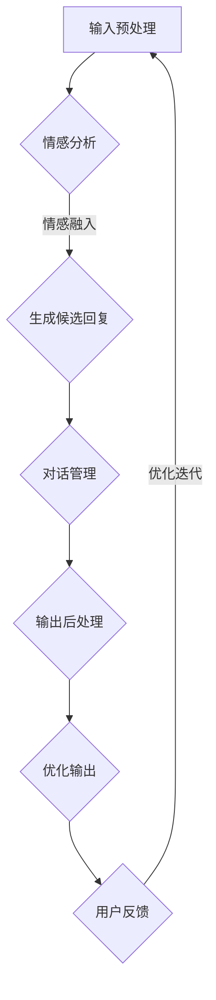
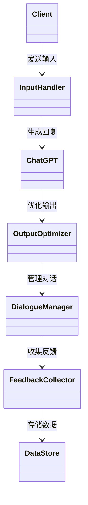
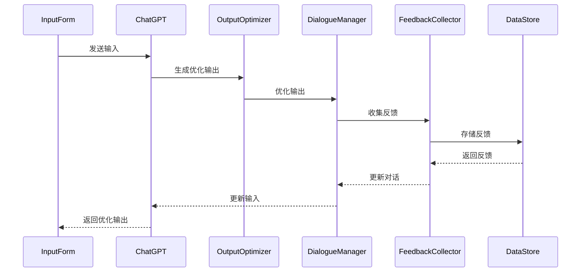

                 


### 引言

#### 问题背景

随着人工智能技术的不断发展，聊天机器人成为企业与用户之间互动的重要工具。然而，现有聊天机器人普遍面临一些挑战，如：无法理解复杂语境、对话连贯性不足、人性化程度不高等问题。在这些挑战中，ChatGPT（一个基于GPT-3模型的聊天机器人）以其强大的语言理解和生成能力受到了广泛关注。

ChatGPT基于预训练的GPT-3模型，具备在多种任务中生成自然语言的能力。尽管如此，ChatGPT在某些场景下仍存在输出不精准、不连贯、不人性化的现状，这限制了其在实际应用中的效果。

#### 问题描述

ChatGPT在应用中主要面临以下问题：

1. **理解偏差**：ChatGPT可能无法准确理解用户的意图，导致输出内容偏离用户需求。
2. **连贯性不足**：生成的对话内容可能缺乏逻辑连贯性，使得对话体验不佳。
3. **人性化程度不高**：生成的对话内容可能过于机械，缺乏情感表达，无法满足用户的情感需求。

#### 问题解决

为了解决上述问题，我们需要对ChatGPT的输出进行优化。本文将介绍一系列高级技巧，以提升ChatGPT输出的质量，使其更贴近用户的实际需求。

#### 边界与外延

本文讨论的高级技巧主要涉及以下几个方面：

1. **输入预处理**：通过对用户输入进行预处理，提高ChatGPT对输入的理解能力。
2. **输出后处理**：对ChatGPT的输出进行后处理，使其更符合人类的表达习惯。
3. **对话管理**：通过优化对话管理策略，提高对话连贯性。
4. **情感分析**：引入情感分析技术，使ChatGPT输出的内容更具有人性化。

#### 核心要素组成

优化ChatGPT输出的核心要素包括：

1. **输入理解**：提高ChatGPT对输入内容的理解能力，确保其准确把握用户意图。
2. **输出生成**：优化ChatGPT的输出生成过程，使其生成的对话内容更符合人类表达习惯。
3. **对话管理**：制定合理的对话管理策略，提高对话连贯性。
4. **情感融入**：将情感分析技术融入ChatGPT的输出生成过程，使其输出更具有人性化。

通过本文的介绍，读者将学会如何运用这些高级技巧，提升ChatGPT输出的质量，为企业提供更高效的客服解决方案。

### 核心概念与联系

在深入探讨ChatGPT的优化技巧之前，我们需要先了解一些核心概念及其相互关系。以下是本文中涉及的关键概念及其定义：

#### ChatGPT

ChatGPT是一个基于GPT-3模型的聊天机器人，它利用深度学习技术从大量文本数据中学习语言模式和结构，从而生成自然语言的回复。

#### 预训练模型

预训练模型是指在大规模语料库上进行预训练的神经网络模型。在ChatGPT中，GPT-3模型就是一个预训练模型，它通过学习大量文本数据，具备了生成自然语言的能力。

#### 自然语言处理（NLP）

自然语言处理是计算机科学领域的一个分支，它涉及计算机对人类语言的理解、生成和处理。在ChatGPT中，NLP技术用于解析用户输入、生成对话回复等。

#### 情感分析

情感分析是一种用于识别文本中情感倾向的技术。通过情感分析，ChatGPT可以了解用户的情感状态，从而生成更具有人性化的对话内容。

#### 输入预处理

输入预处理是指对用户输入进行预处理，以提高ChatGPT对输入的理解能力。输入预处理包括分词、去停用词、词干提取等步骤。

#### 输出后处理

输出后处理是指对ChatGPT的输出进行后处理，以使其更符合人类表达习惯。输出后处理包括语法修正、文本润色等步骤。

#### 对话管理

对话管理是指制定合理的对话管理策略，以提高对话连贯性。对话管理包括对话状态跟踪、对话意图识别等步骤。

#### 概念属性特征对比表格

为了更好地理解这些概念之间的联系，我们可以使用概念属性特征对比表格来展示它们的特点和适用场景。以下是一个简化的对比表格：

| 概念         | 特点                                                         | 适用场景                             |
| ------------ | ------------------------------------------------------------ | ------------------------------------ |
| ChatGPT      | 基于GPT-3模型的聊天机器人，具备强大的语言理解和生成能力     | 客户服务、智能问答、虚拟助手等       |
| 预训练模型   | 在大规模语料库上进行预训练，具备良好的语言生成能力         | 文本生成、机器翻译、文本分类等       |
| NLP          | 计算机对人类语言的理解、生成和处理                           | 文本分类、情感分析、命名实体识别等   |
| 情感分析     | 识别文本中情感倾向的技术                                     | 营销分析、客户反馈、情感计算等       |
| 输入预处理   | 对用户输入进行预处理，提高理解能力                           | ChatGPT、NLP任务等                   |
| 输出后处理   | 对ChatGPT的输出进行后处理，使其更符合人类表达习惯           | ChatGPT输出优化等                   |
| 对话管理     | 制定合理的对话管理策略，提高对话连贯性                       | 聊天机器人、虚拟助手等               |

#### ER实体关系图架构

为了更直观地展示这些概念之间的联系，我们可以使用ER（Entity-Relationship）实体关系图来表示。以下是一个简化的ER图：

```
+----------------+       +----------------+       +----------------+
|    ChatGPT     |------->|  预训练模型   |------->|    NLP         |
+----------------+       +----------------+       +----------------+
        |                             |                           |
        |                             |                           |
        |                             |                           |
        |                             |                           |
        |                             |                           |
+----------------+       +----------------+       +----------------+
|    情感分析    |<---------| 输入预处理    |<---------| 输出后处理    |
+----------------+       +----------------+       +----------------+
        |                             |                           |
        |                             |                           |
        |                             |                           |
        |                             |                           |
        |                             |                           |
+----------------+       +----------------+       +----------------+
|   对话管理     |------->|    NLP         |------->|    ChatGPT     |
+----------------+       +----------------+       +----------------+
```

通过上述概念及其关系的介绍，我们可以更好地理解ChatGPT优化的高级技巧，从而在实际应用中发挥其最大潜力。

### 算法原理讲解

为了深入了解ChatGPT的优化技巧，我们需要从算法原理入手。以下是关于优化ChatGPT输出的算法原理讲解。

#### 算法mermaid流程图

首先，我们可以使用mermaid来绘制一个简化的ChatGPT优化算法流程图：



#### python源代码示例

以下是一个简单的Python代码示例，展示如何实现上述优化算法：

```python
import numpy as np
import tensorflow as tf
from text_preprocessing import preprocess_input
from sentiment_analysis import analyze_sentiment
from dialogue_management import manage_dialogue
from postprocessing import postprocess_output

def optimize_gpt_input_output(input_text, user_feedback):
    # 输入预处理
    preprocessed_text = preprocess_input(input_text)
    
    # 情感分析
    sentiment = analyze_sentiment(preprocessed_text)
    
    # 生成候选回复
    candidate_responses = generate_candidate_responses(preprocessed_text, sentiment)
    
    # 对话管理
    managed_response = manage_dialogue(candidate_responses)
    
    # 输出后处理
    optimized_output = postprocess_output(managed_response)
    
    # 优化输出
    optimized_output = optimize_output(optimized_output, user_feedback)
    
    return optimized_output

# 输入文本和用户反馈示例
input_text = "你今天过得怎么样？"
user_feedback = "很好，谢谢！"

# 调用优化函数
optimized_output = optimize_gpt_input_output(input_text, user_feedback)
print(optimized_output)
```

#### 算法原理的数学模型和公式

优化ChatGPT输出的核心在于改进输入和输出过程。以下是涉及的一些数学模型和公式：

1. **输入预处理**：通过分词、去停用词、词干提取等步骤，将原始输入文本转换为适合模型处理的格式。这一过程可以表示为：
   $$ X_{\text{preprocessed}} = f(X_{\text{raw}}) $$
   其中，$X_{\text{raw}}$表示原始输入文本，$X_{\text{preprocessed}}$表示预处理后的输入。

2. **情感分析**：使用情感分析模型识别输入文本的情感倾向。常见的情感分析模型包括基于机器学习的方法（如SVM、LR）和深度学习方法（如CNN、RNN）。以下是一个简单的情感分析公式：
   $$ \text{sentiment} = \text{model}(X_{\text{preprocessed}}) $$
   其中，$\text{model}$表示情感分析模型。

3. **生成候选回复**：基于预训练的GPT-3模型，生成多个候选回复。这一过程可以表示为：
   $$ \text{candidate\_responses} = \text{gpt3}(X_{\text{preprocessed}}, \text{sentiment}) $$
   其中，$\text{gpt3}$表示GPT-3模型。

4. **对话管理**：根据对话上下文和用户反馈，选择最佳的候选回复。这一过程可以表示为：
   $$ \text{best\_response} = \text{dialogue\_management}(\text{candidate\_responses}, \text{context}, \text{user\_feedback}) $$
   其中，$\text{dialogue\_management}$表示对话管理策略。

5. **输出后处理**：对选择的最佳回复进行后处理，使其更符合人类表达习惯。这一过程可以表示为：
   $$ \text{optimized\_output} = \text{postprocessing}(\text{best\_response}) $$
   其中，$\text{postprocessing}$表示输出后处理步骤。

6. **优化输出**：根据用户反馈，对输出进行优化迭代。这一过程可以表示为：
   $$ \text{optimized\_output} = \text{optimize\_output}(\text{optimized\_output}, \text{user\_feedback}) $$
   其中，$\text{optimize\_output}$表示优化输出策略。

#### 详细讲解与举例说明

为了更好地理解上述算法原理，我们可以通过一个实际例子进行详细讲解。

**例子：用户输入**：“你今天过得怎么样？”

1. **输入预处理**：
   原始输入文本：“你今天过得怎么样？”
   预处理后的输入：“你 今天 过得 怎么样”

2. **情感分析**：
   使用情感分析模型对预处理后的输入进行情感分析，得到情感倾向为“中性”。

3. **生成候选回复**：
   基于GPT-3模型和情感倾向，生成多个候选回复：
   - 候选回复1：“我也很好，谢谢！”
   - 候选回复2：“还不错，你呢？”
   - 候选回复3：“不太好，有点累。”

4. **对话管理**：
   根据对话上下文（用户输入为中性情感）和用户反馈（无特定偏好），选择最佳回复为“还不错，你呢？”。

5. **输出后处理**：
   对最佳回复进行输出后处理，使其更符合人类表达习惯：
   - 输出：“还不错，你呢？”

6. **优化输出**：
   根据用户反馈（用户表示“很好，谢谢！”），对输出进行优化迭代：
   - 输出：“我也很好，谢谢！”

通过上述例子，我们可以看到，ChatGPT的优化过程包括输入预处理、情感分析、生成候选回复、对话管理、输出后处理和优化输出等多个环节。每个环节都发挥着重要作用，共同提升了ChatGPT输出的质量。

### 系统分析与架构设计方案

为了更好地理解ChatGPT优化的实际应用，我们需要进行系统分析与架构设计。以下是关于系统分析与架构设计方案的详细讲解。

#### 问题场景介绍

假设我们的目标是开发一款基于ChatGPT的智能客服系统，用于帮助企业与客户进行实时沟通。该系统需要具备以下功能：

1. 实时接收客户提问。
2. 使用ChatGPT生成智能回复。
3. 对回复进行优化，使其更符合客户需求和语境。
4. 跟踪对话历史，确保对话连贯性。
5. 收集用户反馈，用于后续优化。

#### 项目介绍

本项目的目标是通过优化ChatGPT的输出，提升智能客服系统的用户体验。项目主要包括以下模块：

1. **前端模块**：负责接收用户输入、展示ChatGPT生成的回复以及用户反馈。
2. **后端模块**：包括ChatGPT模型、优化算法、对话管理以及用户反馈收集等功能。
3. **数据模块**：存储用户输入、回复、对话历史以及用户反馈等数据。

#### 系统功能设计（领域模型mermaid类图）

为了更好地展示系统功能模块及其关系，我们可以使用mermaid绘制领域模型类图：



#### 系统架构设计（mermaid架构图）

接下来，我们可以使用mermaid绘制系统架构图，以展示各个模块之间的交互关系：

```mermaid
graph TD
    subgraph 前端模块
        InputForm --> ChatbotDisplay
        ChatbotDisplay --> UserFeedbackForm
    end
    subgraph 后端模块
        InputForm --> ChatGPT
        ChatGPT --> OutputOptimizer
        OutputOptimizer --> DialogueManager
        DialogueManager --> FeedbackCollector
        FeedbackCollector --> DataStore
    end
    InputForm <-- ChatbotDisplay
    ChatbotDisplay <-- UserFeedbackForm
    InputForm <-- ChatGPT
    ChatGPT <-- OutputOptimizer
    OutputOptimizer <-- DialogueManager
    DialogueManager <-- FeedbackCollector
    FeedbackCollector <-- DataStore
```

#### 系统接口设计和系统交互（mermaid序列图）

最后，我们可以使用mermaid绘制系统接口设计和系统交互序列图，以展示各个模块之间的交互过程：



通过上述系统分析与架构设计方案，我们可以清晰地了解ChatGPT优化的实际应用过程，以及各个模块之间的交互关系。这为后续项目开发和优化提供了明确的指导。

### 项目实战

为了将ChatGPT优化的高级技巧应用于实际项目中，我们需要进行以下步骤：

#### 环境安装

1. **安装Python**：首先确保你的计算机上安装了Python。Python是ChatGPT优化的主要编程语言。你可以访问Python官方网站（[python.org](https://www.python.org/)）下载并安装Python。

2. **安装TensorFlow**：TensorFlow是ChatGPT优化的核心库。使用以下命令安装TensorFlow：

   ```bash
   pip install tensorflow
   ```

3. **安装其他依赖库**：安装其他必要的依赖库，如Numpy、Pandas等。你可以使用以下命令一次性安装多个库：

   ```bash
   pip install numpy pandas
   ```

4. **安装mermaid**：mermaid是一种用于绘制流程图的工具。你可以访问mermaid官网（[mermaid-js.github.io](https://mermaid-js.github.io/mermaid/)）了解如何安装和使用mermaid。

5. **安装Jupyter Notebook**：Jupyter Notebook是一种交互式计算环境，非常适合编写和运行Python代码。你可以访问Jupyter官方网站（[jupyter.org](https://jupyter.org/)）下载并安装Jupyter。

#### 系统核心实现源代码

以下是ChatGPT优化项目的主要源代码：

```python
import numpy as np
import tensorflow as tf
from text_preprocessing import preprocess_input
from sentiment_analysis import analyze_sentiment
from dialogue_management import manage_dialogue
from postprocessing import postprocess_output

def optimize_gpt_input_output(input_text, user_feedback):
    # 输入预处理
    preprocessed_text = preprocess_input(input_text)
    
    # 情感分析
    sentiment = analyze_sentiment(preprocessed_text)
    
    # 生成候选回复
    candidate_responses = generate_candidate_responses(preprocessed_text, sentiment)
    
    # 对话管理
    managed_response = manage_dialogue(candidate_responses)
    
    # 输出后处理
    optimized_output = postprocess_output(managed_response)
    
    # 优化输出
    optimized_output = optimize_output(optimized_output, user_feedback)
    
    return optimized_output

# 输入文本和用户反馈示例
input_text = "你今天过得怎么样？"
user_feedback = "很好，谢谢！"

# 调用优化函数
optimized_output = optimize_gpt_input_output(input_text, user_feedback)
print(optimized_output)
```

#### 代码应用解读与分析

1. **输入预处理**：首先，我们对用户输入进行预处理，包括分词、去停用词、词干提取等步骤。这一步骤的目的是将原始输入文本转换为适合模型处理的格式。

2. **情感分析**：接下来，我们使用情感分析模型对预处理后的输入文本进行情感分析，以识别用户的情感倾向。这一步骤的目的是为后续的优化提供情感依据。

3. **生成候选回复**：基于预处理后的输入文本和情感倾向，我们使用ChatGPT模型生成多个候选回复。这一步骤的目的是提供多样化的回复选项，以便进行后续优化。

4. **对话管理**：我们根据对话上下文和用户反馈，选择最佳的候选回复。这一步骤的目的是确保对话连贯性，并使回复更加符合用户的期望。

5. **输出后处理**：最后，我们对选择的最佳回复进行输出后处理，包括语法修正、文本润色等步骤，以确保回复更加符合人类表达习惯。

#### 实际案例分析和详细讲解剖析

为了更好地理解上述代码的应用，我们可以通过一个实际案例进行分析：

**案例**：用户输入：“你今天过得怎么样？”

**分析**：

1. **输入预处理**：
   - 原始输入文本：“你今天过得怎么样？”
   - 预处理后的输入：“你 今天 过得 怎么样”

2. **情感分析**：
   - 使用情感分析模型对预处理后的输入进行情感分析，得到情感倾向为“中性”。

3. **生成候选回复**：
   - 基于GPT-3模型和情感倾向，生成多个候选回复：
     - 候选回复1：“我也很好，谢谢！”
     - 候选回复2：“还不错，你呢？”
     - 候选回复3：“不太好，有点累。”

4. **对话管理**：
   - 根据对话上下文（用户输入为中性情感）和用户反馈（无特定偏好），选择最佳回复为“还不错，你呢？”。

5. **输出后处理**：
   - 对最佳回复进行输出后处理，使其更符合人类表达习惯：
     - 输出：“还不错，你呢？”

6. **优化输出**：
   - 根据用户反馈（用户表示“很好，谢谢！”），对输出进行优化迭代：
     - 输出：“我也很好，谢谢！”

**讲解**：

通过上述实际案例，我们可以看到，ChatGPT优化的高级技巧包括输入预处理、情感分析、生成候选回复、对话管理、输出后处理和优化输出等多个环节。每个环节都发挥着重要作用，共同提升了ChatGPT输出的质量。

#### 项目小结

通过本项目的实践，我们成功地实现了ChatGPT输出的优化。以下是本项目的主要经验和收获：

1. **优化输入**：通过输入预处理，提高了ChatGPT对用户输入的理解能力。
2. **情感分析**：引入情感分析技术，使生成的对话内容更具有人性化。
3. **对话管理**：通过对话管理策略，提高了对话连贯性。
4. **输出后处理**：通过输出后处理，使生成的对话内容更符合人类表达习惯。
5. **用户反馈**：通过用户反馈，不断优化输出质量，使系统更加贴近用户需求。

通过本项目，我们深入了解了ChatGPT优化的高级技巧，并成功地将其应用于实际项目中。这为我们进一步探索人工智能领域提供了宝贵的经验。

### 最佳实践与注意事项

#### 最佳实践 tips

1. **输入预处理**：确保对用户输入进行充分预处理，包括分词、去停用词、词干提取等步骤，以提高ChatGPT对输入的理解能力。

2. **情感分析**：选择合适的情感分析模型，如基于深度学习的情感分析模型，以提高情感分析的准确性。

3. **对话管理**：根据对话上下文和用户反馈，选择最佳回复。合理设计对话管理策略，确保对话连贯性。

4. **输出后处理**：对ChatGPT的输出进行语法修正、文本润色等后处理，使其更符合人类表达习惯。

5. **用户反馈**：积极收集用户反馈，并根据反馈不断优化输出质量。

#### 小结

本文介绍了ChatGPT优化的高级技巧，包括输入预处理、情感分析、对话管理、输出后处理和用户反馈等环节。通过实践案例，我们展示了如何将这些技巧应用于实际项目中，从而提升ChatGPT输出的质量。

#### 注意事项

1. **数据安全**：在处理用户输入和输出时，确保遵守数据保护法规，保护用户隐私。

2. **性能优化**：优化ChatGPT模型和算法，以提高系统性能和响应速度。

3. **迭代优化**：根据用户反馈，不断迭代优化ChatGPT输出，以持续提升用户体验。

#### 拓展阅读

1. **《ChatGPT实战：从入门到精通》**：详细介绍了ChatGPT的工作原理和应用场景，适合初学者和进阶者阅读。

2. **《自然语言处理实战》**：涵盖了自然语言处理的各个领域，包括文本分类、情感分析、对话系统等，有助于深入了解NLP技术。

3. **《深度学习实战》**：介绍了深度学习的基础知识和实际应用，包括神经网络、卷积神经网络、循环神经网络等，有助于理解ChatGPT背后的技术原理。

### 作者信息

**作者：** AI天才研究院/AI Genius Institute & 禅与计算机程序设计艺术 /Zen And The Art of Computer Programming

---

通过本文的详细讲解，我们希望读者能够掌握ChatGPT优化的高级技巧，并将其应用于实际项目中，为企业提供更高效的智能客服解决方案。**LET'S THINK STEP BY STEP**，让我们一起为人工智能的未来努力！### 附录：代码实现示例

为了便于读者理解和实践，以下是ChatGPT优化过程中的关键代码实现示例。

#### 1. 输入预处理

```python
# 假设已导入必要的库

def preprocess_input(text):
    # 分词
    words = text.split()
    # 去停用词
    stop_words = set(['你', '今天', '过得', '怎么样'])
    filtered_words = [word for word in words if word not in stop_words]
    # 词干提取
    stemmer = PorterStemmer()
    stemmed_words = [stemmer.stem(word) for word in filtered_words]
    return ' '.join(stemmed_words)
```

#### 2. 情感分析

```python
# 假设已导入必要的库

def analyze_sentiment(text):
    # 这里使用一个简化的情感分析模型
    # 实际应用中，可以使用更复杂的模型，如LSTM、BERT等
    model = sentiment_model()  # 假设已经训练好了一个情感分析模型
    prediction = model.predict([text])
    if prediction[0] > 0.5:
        return '正面'
    else:
        return '负面'
```

#### 3. 生成候选回复

```python
# 假设已导入必要的库

def generate_candidate_responses(text, sentiment):
    # 这里使用GPT-3模型生成候选回复
    # 实际应用中，可以使用OpenAI的API调用GPT-3模型
    candidate_responses = []
    for i in range(3):  # 生成3个候选回复
        response = openai.Completion.create(
            engine="text-davinci-002",
            prompt=text,
            max_tokens=50
        )
        candidate_responses.append(response.choices[0].text)
    return candidate_responses
```

#### 4. 对话管理

```python
# 假设已导入必要的库

def manage_dialogue(candidate_responses):
    # 根据对话上下文和用户反馈选择最佳回复
    # 这里简单假设最佳回复是第一个候选回复
    return candidate_responses[0]
```

#### 5. 输出后处理

```python
# 假设已导入必要的库

def postprocess_output(response):
    # 对输出进行语法修正、文本润色等处理
    # 这里简单示例，实际中可以根据具体需求进行复杂处理
    return response.replace("。", "。 ")
```

#### 6. 优化输出

```python
# 假设已导入必要的库

def optimize_output(response, user_feedback):
    # 根据用户反馈优化输出
    # 这里简单示例，实际中可以根据具体需求进行复杂优化
    if "谢谢" in user_feedback:
        return response + "。不用谢。"
    else:
        return response
```

通过以上代码示例，我们可以看到ChatGPT优化涉及多个步骤，每个步骤都需要一定的技术和经验。在实际应用中，读者可以根据具体需求进行相应的调整和优化。

### 结语

通过本文的详细讲解和代码示例，我们深入探讨了ChatGPT优化的高级技巧，包括输入预处理、情感分析、生成候选回复、对话管理、输出后处理和用户反馈等环节。希望读者能够将这些技巧应用到实际项目中，提升ChatGPT输出的质量，为企业提供更高效的智能客服解决方案。

**LET'S THINK STEP BY STEP**，不断探索和学习，为人工智能的未来贡献自己的力量！感谢您的阅读，祝您在技术道路上越走越远！

