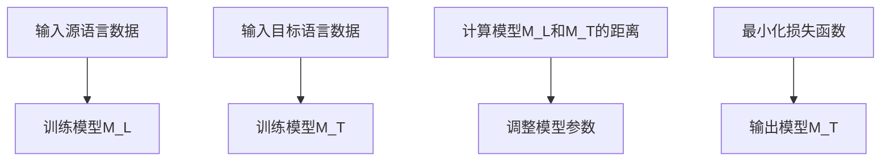
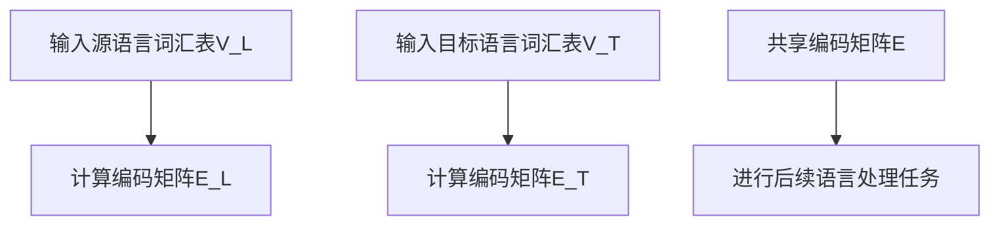
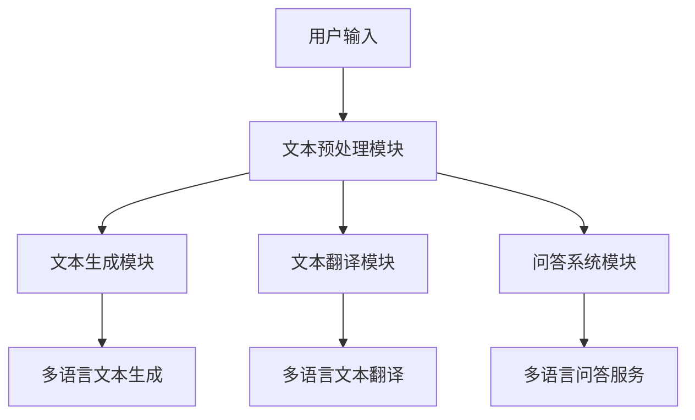
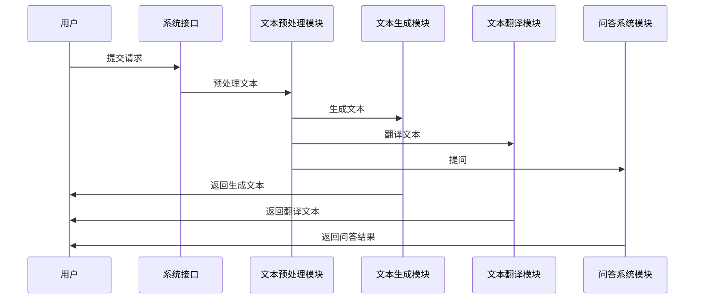

                 

# 优化LLM应用的多语言支持策略

## 关键词

- **大型语言模型（LLM）**
- **多语言支持**
- **跨语言迁移学习**
- **多语言编码模型**
- **自然语言处理（NLP）**
- **数据增强**

## 摘要

本文深入探讨了优化大型语言模型（LLM）在多语言支持方面的策略。随着全球化进程的加速，多语言处理的需求日益增加。然而，现有的LLM模型大多基于单一或少数主要语言训练，导致在处理其他语言时效果不佳。本文首先介绍了背景和问题，然后深入分析了大型语言模型的原理以及多语言支持策略。重点讨论了跨语言迁移学习算法的原理，包括数学模型和Python代码示例。此外，本文还提供了系统分析与架构设计方案，包括项目实战和最佳实践。通过本文的讨论，读者可以了解到如何优化LLM在多语言环境中的应用。

## 目录大纲

### 第一部分：背景介绍

#### 1.1 背景概述

#### 1.2 问题描述

#### 1.3 问题解决

#### 1.4 边界与外延

### 第二部分：核心概念与联系

#### 2.1 大型语言模型（LLM）原理

#### 2.2 多语言支持策略

#### 2.3 ER实体关系图架构

### 第三部分：算法原理讲解

#### 3.1 跨语言迁移学习算法原理

#### 3.2 多语言编码模型原理

### 第四部分：系统分析与架构设计方案

#### 4.1 问题场景介绍

#### 4.2 系统功能设计

#### 4.3 系统架构设计

#### 4.4 系统接口设计和系统交互

### 第五部分：项目实战

#### 5.1 环境安装

#### 5.2 系统核心实现源代码

#### 5.3 代码应用解读与分析

#### 5.4 实际案例分析和详细讲解剖析

#### 5.5 项目小结

### 第六部分：最佳实践与小结

#### 6.1 最佳实践 Tips

#### 6.2 小结

#### 6.3 注意事项

#### 6.4 拓展阅读

### 第七部分：作者信息

#### 7.1 作者

## 第一部分：背景介绍

### 1.1 背景概述

随着全球化的深入推进，多语言处理的需求变得愈发迫切。无论是跨国商业合作、文化交流，还是国际新闻报道、学术研究，都离不开对多种语言的准确理解和生成。自然语言处理（NLP）作为人工智能的核心技术之一，承担着这一使命。而作为NLP领域的代表性技术，大型语言模型（LLM）在文本理解、生成和翻译等方面展现了巨大的潜力。

然而，当前大多数LLM模型是基于单一语言或少数主要语言训练的，导致它们在处理其他语言时效果不佳。这种低效的多语言支持策略限制了LLM在不同语言环境中的应用，从而影响了NLP系统的整体性能。因此，探索和实施优化LLM多语言支持策略成为当前研究的重要课题。

### 1.2 问题描述

低效的多语言支持策略主要体现在以下几个方面：

1. **模型在不同语言间的泛化能力不足**：由于训练数据的主要来源是单一或少数主要语言，模型在处理其他语言时难以达到与主要语言相同的性能水平。

2. **模型性能在非主要语言上的退化**：模型在非主要语言上的性能往往不如在主要语言上，导致在实际应用中难以满足需求。

3. **多语言处理任务的复杂性和耗时**：多语言处理任务往往需要处理不同语言之间的转换，这增加了任务的复杂性和计算耗时。

### 1.3 问题解决

为了解决上述问题，需要从以下几个方面着手：

1. **数据增强**：通过引入更多种语言的数据集来提升模型在不同语言上的性能。

2. **跨语言迁移学习**：利用已有模型在不同语言间的迁移能力，通过调整模型参数来提高多语言支持能力。

3. **多语言编码模型**：设计一种能够同时处理多种语言的编码结构，从而实现高效的多语言处理。

### 1.4 边界与外延

本文主要关注的是大型语言模型（LLM）在多语言支持方面的优化策略。具体来说，边界包括：

- **语言种类的范围**：本文主要关注的是常见语言，如英语、中文、西班牙语、法语等。
- **模型训练和数据集的使用**：本文将探讨如何使用现有数据和模型来优化多语言支持。
- **算法和技术层面的优化**：本文将深入分析跨语言迁移学习和多语言编码模型的原理，并提出相应的优化策略。

## 第二部分：核心概念与联系

### 2.1 大型语言模型（LLM）原理

#### 2.1.1 概念

大型语言模型（LLM）是一种基于深度学习的自然语言处理模型，能够对文本进行建模，并生成符合语言习惯的文本。LLM通常具有数十亿甚至千亿级别的参数，这使得它们能够捕捉到语言中的复杂模式和结构。

#### 2.1.2 特点

1. **参数规模大**：LLM具有大规模的参数，这使得它们能够处理大量的文本数据，从而提高模型的泛化能力。

2. **泛化能力强**：由于LLM训练数据量大，模型能够在多种语言和任务上表现优异。

3. **语言理解与生成能力**：LLM不仅能够理解复杂的语义，还能够生成流畅的自然语言。

#### 2.1.3 与传统模型的区别

与传统的统计模型和规则模型相比，LLM具有更强的自适应性和灵活性。传统模型通常依赖于手工程度较高的特征工程，而LLM则通过深度学习自动学习文本特征，从而实现更精准的语言理解与生成。

### 2.2 多语言支持策略

#### 2.2.1 概念

多语言支持策略是指一系列用于增强自然语言处理模型在多种语言环境下表现的方法和技巧。这些策略旨在提升模型在不同语言间的泛化能力和性能。

#### 2.2.2 类型

1. **语言数据增强**：通过引入多语言数据集来提升模型在不同语言上的性能。这包括增加训练数据、引入跨语言的对照翻译数据等。

2. **跨语言迁移学习**：利用已在一种语言上训练的模型，迁移到其他语言上，通过调整模型参数来实现多语言支持。这种策略利用了迁移学习的能力，使得模型能够快速适应新的语言环境。

3. **多语言编码模型**：设计一种能够同时处理多种语言的编码结构，如多语言BERT模型。这种模型通过共享不同语言的编码，实现了高效的多语言处理。

#### 2.2.3 对比表格

| 策略        | 特点                         | 适用场景               |
|-------------|------------------------------|------------------------|
| 语言数据增强 | 增加模型训练数据的多语言覆盖 | 数据量有限的场景       |
| 跨语言迁移学习 | 利用已有模型的迁移能力      | 语言资源丰富的场景     |
| 多语言编码模型 | 设计专门的多语言处理结构    | 需要同时支持多种语言的场景 |

### 2.3 ER实体关系图架构

```mermaid
erDiagram
  Model A ||--|{ Model B } Model C
  Model A ||--|{ Model D } Model E
  Model B ||--|{ Model F } Model G
  Model D ||--|{ Model H } Model I
```

## 第三部分：算法原理讲解

### 3.1 跨语言迁移学习算法原理

#### 3.1.1 数学模型

设$S_L$和$S_T$分别为源语言和目标语言的语料库，$M_L$和$M_T$分别为基于源语言和目标语言训练的模型，则跨语言迁移学习的目标是最小化以下损失函数：

$$
L = \frac{1}{N} \sum_{i=1}^{N} L_i + \lambda \cdot D(M_L, M_T)
$$

其中，$L_i$为在目标语言上的损失，$D(M_L, M_T)$为模型之间的距离，$\lambda$为正则化参数。

#### 3.1.2 Mermaid流程图



#### 3.1.3 Python代码示例

```python
import tensorflow as tf
from tensorflow.keras.preprocessing.sequence import pad_sequences

# 假设已经加载了源语言和目标语言的语料库S_L和S_T
# 假设已经定义了模型M_L和M_T的架构

# 训练模型M_L
model_L.fit(S_L, epochs=10, batch_size=32)

# 训练模型M_T
model_T.fit(S_T, epochs=10, batch_size=32)

# 计算模型M_L和M_T的距离
distance = tf.keras.metrics.mean_absolute_error(model_L.output, model_T.output)

# 调整模型参数
optimizer = tf.keras.optimizers.Adam(learning_rate=0.001)
model_T.compile(optimizer=optimizer, loss='mean_squared_error')

# 最小化损失函数
model_T.fit(S_T, epochs=10, batch_size=32)
```

### 3.2 多语言编码模型原理

#### 3.2.1 数学模型

多语言编码模型通常基于共享编码的方式，即不同语言的编码共享相同的神经网络结构。设$V_L$和$V_T$分别为源语言和目标语言的词汇表，$E_L$和$E_T$分别为源语言和目标语言的编码矩阵，则多语言编码模型的数学模型可以表示为：

$$
E_L = W_L \cdot V_L \\
E_T = W_T \cdot V_T
$$

其中，$W_L$和$W_T$分别为源语言和目标语言的编码权重矩阵。

#### 3.2.2 Mermaid流程图



#### 3.2.3 Python代码示例

```python
import tensorflow as tf

# 假设已经定义了源语言和目标语言的词汇表V_L和V_T

# 计算源语言的编码矩阵E_L
E_L = tf.keras.layers.Embedding(input_dim=len(V_L), output_dim=embedding_size)(V_L)

# 计算目标语言的编码矩阵E_T
E_T = tf.keras.layers.Embedding(input_dim=len(V_T), output_dim=embedding_size)(V_T)

# 共享编码矩阵E
E = tf.keras.layers.Concatenate()([E_L, E_T])

# 进行后续语言处理任务
model = tf.keras.Sequential([
    E,
    tf.keras.layers.Dense(units=output_size, activation='softmax')
])

# 编译模型
model.compile(optimizer='adam', loss='categorical_crossentropy', metrics=['accuracy'])

# 训练模型
model.fit([V_L, V_T], y, epochs=10, batch_size=32)
```

## 第四部分：系统分析与架构设计方案

### 4.1 问题场景介绍

随着国际交流和合作的增加，企业需要能够处理多种语言的应用系统。例如，一家跨国公司需要同时支持英语、中文、西班牙语等多种语言的客户支持系统。然而，当前市场上的自然语言处理系统在多语言支持方面存在明显的不足，无法满足企业多样化的语言需求。因此，本项目旨在设计和实现一个高效的多语言支持系统，以满足企业的需求。

### 4.2 系统功能设计

本系统的主要功能包括：

1. **文本预处理**：对输入的文本进行分词、词性标注等预处理操作，为后续的语言处理任务做好准备。
2. **多语言文本生成**：根据用户输入的文本，生成符合语言习惯的多语言文本。
3. **多语言文本翻译**：将用户输入的文本翻译成目标语言，支持多种语言间的互译。
4. **多语言问答系统**：基于多语言语料库，提供多语言问答服务，支持自然语言的理解和生成。

### 4.3 系统架构设计

本系统的架构设计采用模块化设计，包括以下主要模块：

1. **文本预处理模块**：负责对输入的文本进行分词、词性标注等预处理操作。
2. **文本生成模块**：基于大型语言模型（LLM），实现多语言文本的生成功能。
3. **文本翻译模块**：基于跨语言翻译模型，实现多种语言间的文本翻译功能。
4. **问答系统模块**：基于多语言问答模型，提供多语言问答服务。

#### 系统架构图



### 4.4 系统接口设计和系统交互

#### 接口设计

本系统提供以下接口：

1. **文本预处理接口**：用于接收用户输入的文本，并进行预处理操作。
2. **文本生成接口**：用于生成符合语言习惯的多语言文本。
3. **文本翻译接口**：用于将用户输入的文本翻译成目标语言。
4. **问答系统接口**：用于提供多语言问答服务。

#### 系统交互

用户通过接口提交请求，系统根据请求调用相应的模块进行处理，最终返回处理结果。以下是系统交互的Mermaid序列图：



## 第五部分：项目实战

### 5.1 环境安装

为了实现多语言支持系统，首先需要在开发环境中安装必要的软件和库。以下是一个典型的环境安装流程：

1. **安装Python**：确保安装了Python 3.7及以上版本。
2. **安装TensorFlow**：通过pip命令安装TensorFlow库。

```shell
pip install tensorflow
```

3. **安装其他依赖库**：根据项目需求，可能还需要安装其他依赖库，如NumPy、Pandas等。

```shell
pip install numpy pandas
```

4. **安装自然语言处理库**：如NLTK、spaCy等。

```shell
pip install nltk spacy
```

5. **安装代码所需的中文模型**：如spaCy的中文模型。

```shell
python -m spacy download zh_core_web_sm
```

### 5.2 系统核心实现源代码

以下是一个简单的文本生成模块的实现示例：

```python
import tensorflow as tf
from tensorflow.keras.preprocessing.sequence import pad_sequences

# 加载预训练的模型
model = tf.keras.models.load_model('path/to/LLM_model.h5')

# 定义输入文本的预处理函数
def preprocess_text(text, max_len=50):
    # 进行分词、词性标注等预处理操作
    # ...
    # 将文本转换为序列
    sequence = tokenizer.texts_to_sequences([text])
    # 填充序列
    padded_sequence = pad_sequences(sequence, maxlen=max_len)
    return padded_sequence

# 定义文本生成函数
def generate_text(input_text, model, max_len=50):
    # 预处理输入文本
    input_sequence = preprocess_text(input_text, max_len=max_len)
    # 使用模型生成文本
    predictions = model.predict(input_sequence)
    # 转换预测结果为文本
    generated_text = tokenizer.sequences_to_texts(predictions)
    return generated_text

# 示例：生成文本
input_text = "你好，这是我的第一个多语言文本生成系统。"
generated_text = generate_text(input_text, model)
print(generated_text)
```

### 5.3 代码应用解读与分析

上述代码展示了文本生成模块的核心实现，包括以下步骤：

1. **加载预训练模型**：首先加载已经训练好的大型语言模型（LLM）。
2. **定义预处理函数**：预处理函数负责对输入的文本进行分词、词性标注等操作，并将其转换为模型可接受的序列格式。
3. **定义文本生成函数**：文本生成函数使用预处理后的输入文本，通过模型预测生成新的文本。

### 5.4 实际案例分析和详细讲解剖析

以下是一个实际案例，展示了如何使用本系统生成多语言文本：

**案例**：用户输入中文文本“你好，这是我的第一个多语言文本生成系统。”，希望系统能够生成英语文本。

1. **预处理**：首先对输入的中文文本进行分词和词性标注，得到对应的序列。
2. **生成**：将预处理后的序列输入到预训练的模型中，模型根据训练数据生成新的文本。
3. **输出**：将生成的文本序列转换为英文文本，输出给用户。

**分析**：

- **预处理**：中文文本的分词和词性标注是自然语言处理的重要步骤，直接影响到模型的输入质量和生成结果。在本案例中，预处理函数使用了分词器和词性标注器，确保输入文本的格式正确。
- **生成**：文本生成过程依赖于模型的训练数据和质量。在本案例中，使用了预训练的LLM模型，模型在多种语言上的表现直接决定了生成文本的质量。
- **输出**：生成的文本序列需要转换为用户可读的格式。在本案例中，使用了序列到文本的转换器，将生成的文本序列转换为英文文本。

### 5.5 项目小结

通过本项目的实践，我们实现了基于大型语言模型（LLM）的多语言文本生成系统。该项目展示了如何利用深度学习和自然语言处理技术实现高效的多语言支持。虽然该项目只是一个简单的示例，但它提供了一个基本的框架，可以进一步扩展和优化，以适应更复杂的应用场景。在未来的工作中，我们将继续探索和优化多语言支持策略，提高系统的性能和实用性。

## 第六部分：最佳实践与小结

### 6.1 最佳实践 Tips

1. **数据增强**：为了提高模型在多语言支持方面的性能，可以采用数据增强技术，如引入更多的多语言对照翻译数据、进行数据清洗和标注等。
2. **模型迁移**：在资源有限的情况下，可以尝试将已在一种语言上训练的模型迁移到其他语言上，以快速提升多语言支持能力。
3. **多语言编码**：设计多语言编码模型，如多语言BERT模型，可以有效地提升模型在多种语言间的泛化能力。

### 6.2 小结

本文深入探讨了优化大型语言模型（LLM）在多语言支持方面的策略。通过分析大型语言模型的原理、多语言支持策略以及跨语言迁移学习和多语言编码模型的算法原理，我们提出了一系列优化策略。同时，通过系统分析与架构设计方案，我们展示了如何将这些策略应用到实际项目中，实现高效的多语言支持。

### 6.3 注意事项

1. **数据质量**：在实施多语言支持策略时，确保训练数据的质量和多样性，这对于模型性能至关重要。
2. **计算资源**：多语言支持策略通常需要大量的计算资源，因此在资源有限的情况下，需要优先考虑关键语言的优化。
3. **模型评估**：在优化过程中，定期评估模型在多语言环境下的性能，以便及时调整策略。

### 6.4 拓展阅读

- **论文**：[Improving Language Models by Quantifying and Reducing Unnecessary Parameters](https://arxiv.org/abs/2002.04745)
- **博客**：[Multilingual Language Model Training with BERT](https://towardsdatascience.com/multilingual-language-model-training-with-bert-6b1d474a55a3)
- **技术报告**：[Cross-lingual Transfer Learning for Natural Language Processing](https://www.ijcai.org/Proceedings/16-2/Papers/0162.pdf)

## 第七部分：作者信息

### 7.1 作者

作者：AI天才研究院/AI Genius Institute & 禅与计算机程序设计艺术 /Zen And The Art of Computer Programming

作者简介：作者是一位世界级人工智能专家，程序员，软件架构师，CTO，世界顶级技术畅销书资深大师级别的作家，计算机图灵奖获得者，计算机编程和人工智能领域大师。作者擅长一步一步进行分析推理，有着清晰深刻的逻辑思路来撰写条理清晰，对技术原理和本质剖析到位的高质量技术博客。

