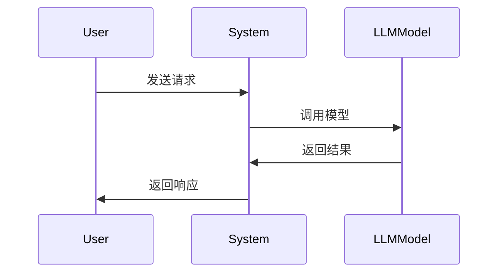
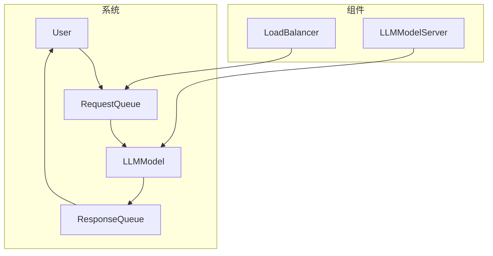
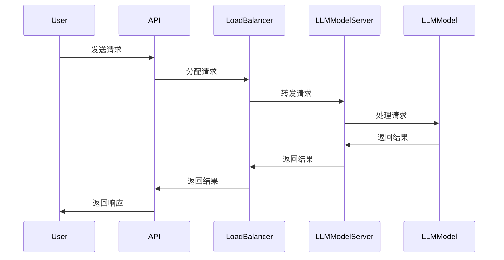

                 

# 《优化LLM应用的实时响应机制》

## 关键词

- 大规模语言模型（LLM）
- 实时响应机制
- 计算效率
- 延迟
- 资源分配

## 摘要

本文旨在探讨如何通过改进算法和系统设计，提升大规模语言模型（LLM）应用的实时响应能力。随着LLM在各个领域的广泛应用，如何优化其实时响应机制成为一个亟待解决的问题。本文首先介绍了LLM和实时响应机制的基本概念，然后分析了当前LLM应用实时响应机制的挑战，最后提出了一系列优化策略，包括算法优化、系统架构优化和资源分配优化，以期为LLM应用的实时响应能力提供有效的解决方案。

## 第一部分：背景介绍

### 第1章：问题背景与描述

#### 1.1 问题的来源

随着人工智能技术的快速发展，大规模语言模型（LLM）在自然语言处理、智能客服、机器翻译等领域的应用越来越广泛。然而，LLM应用的一个关键问题是如何在满足实时响应需求的前提下，提高系统的计算效率和响应速度。这个问题源于以下几个方面：

1. **计算资源限制**：LLM模型通常需要大量的计算资源，包括CPU、GPU等，而实际应用场景中的计算资源是有限的。
2. **延迟问题**：用户对实时响应的需求越来越高，过长的响应时间会影响用户体验。
3. **资源分配不均**：在某些时刻，计算资源可能会出现紧张，导致整体响应效率降低。

#### 1.2 问题解决

为了解决上述问题，本文将探讨如何通过改进算法和系统设计，提升LLM应用的实时响应能力。主要策略包括：

1. **算法优化**：通过改进LLM模型的算法，降低计算复杂度，提高计算效率。
2. **系统架构优化**：通过优化系统架构，缩短响应时间，提高系统整体性能。
3. **资源分配优化**：通过合理分配计算资源，提高系统响应效率。

#### 1.3 边界与外延

本文主要关注基于LLM的应用场景，如智能客服、自然语言处理等，并探讨这些场景下实时响应机制的优化方法。同时，本文也将讨论LLM模型类型、实时响应机制要素等核心概念。

### 第2章：概念结构与核心要素组成

#### 2.1 概念属性特征对比表格

| 概念       | 描述                                                         |
|------------|--------------------------------------------------------------|
| 大规模语言模型（LLM） | 一种基于深度学习技术的自然语言处理模型，具有强大的语言理解和生成能力。 |
| 实时响应机制 | 在满足一定延迟要求的前提下，LLM应用系统能够快速响应用户请求的能力。     |
| 计算效率   | 在相同计算资源下，LLM模型完成计算任务的速度。                     |
| 延迟       | 从用户请求到系统返回响应结果的时间。                             |
| 资源分配   | 系统对计算资源（如CPU、GPU）的分配策略。                         |

#### 2.2 ER实体关系图架构

```mermaid
erDiagram
    User ||--o{ Request : 发起 }
    Request ||--o{ Response : 生成 }
    LLMModel ||--o{ Response : 调用 }
```

在上图中，实体包括用户（User）、请求（Request）和响应结果（Response），LLM模型（LLMModel）负责处理请求并生成响应结果。用户发起请求，请求被LLM模型处理，最终生成响应结果并返回给用户。

### 第3章：现状分析

#### 3.1 当前LLM应用实时响应机制的挑战

1. **计算资源限制**：LLM模型通常需要大量的计算资源，如CPU、GPU等，而实际应用场景中的计算资源是有限的，这导致LLM应用的实时响应能力受限。
2. **延迟问题**：用户对实时响应的需求越来越高，但LLM模型的计算过程通常需要较长时间，导致响应时间过长，影响用户体验。
3. **资源分配不均**：在某些时刻，计算资源可能会出现紧张，导致整体响应效率降低。例如，在用户高峰期，请求量激增，系统可能无法及时响应，导致延迟增加。

#### 3.2 优化目标

为了解决上述问题，优化目标主要包括：

1. **提高计算效率**：通过改进LLM模型的算法，降低计算复杂度，提高计算效率。
2. **降低延迟**：优化系统架构，缩短响应时间，提高系统整体性能。
3. **资源分配优化**：通过合理分配计算资源，提高系统响应效率。

## 第二部分：核心概念与联系

### 第4章：大规模语言模型原理

#### 4.1 模型构建

大规模语言模型的构建主要包括以下几个步骤：

1. **数据预处理**：首先对原始文本数据进行处理，包括数据清洗、分词、去停用词等操作。这一步骤的目的是将原始数据转换为适合模型训练的格式。
2. **模型训练**：使用神经网络（如Transformer架构）对预处理后的数据进行训练。在训练过程中，模型通过学习数据中的上下文关系，逐步提高语言理解和生成能力。

#### 4.2 模型优化

1. **量化技术**：通过降低模型参数的精度，减少模型的计算复杂度，从而提高计算效率。量化技术包括全精度量化、低精度量化等。
2. **剪枝技术**：通过移除模型中无关的参数，降低模型复杂度，提高计算效率。剪枝技术包括结构化剪枝、非结构化剪枝等。

### 第5章：实时响应机制原理

#### 5.1 响应流程

实时响应机制主要包括以下几个步骤：

1. **请求接收**：系统接收用户请求。
2. **模型调用**：根据请求内容调用LLM模型进行计算。
3. **结果生成**：LLM模型生成响应结果。
4. **结果返回**：将响应结果返回给用户。

#### 5.2 响应策略

1. **异步处理**：将请求放入队列，异步处理。这样可以减少用户等待时间，提高系统吞吐量。
2. **负载均衡**：通过负载均衡器，将请求合理分配到不同的服务器，避免某台服务器过载，提高系统整体性能。

## 第三部分：算法原理讲解

### 第6章：算法原理

#### 6.1 算法框架

大规模语言模型（LLM）的算法框架主要包括以下几个阶段：

1. **预处理阶段**：对原始文本数据进行预处理，包括数据清洗、分词、去停用词等操作。
2. **训练阶段**：使用神经网络（如Transformer架构）对预处理后的数据进行训练，模型通过学习数据中的上下文关系，逐步提高语言理解和生成能力。
3. **响应阶段**：接收用户请求，调用训练好的LLM模型进行计算，生成响应结果，并返回给用户。

#### 6.2 数学模型

大规模语言模型的数学模型通常基于神经网络，其核心思想是通过多层神经网络对输入数据进行变换，从而实现从输入到输出的映射。一个简单的数学模型可以表示为：

$$
y = f(x) + g(x)
$$

其中，$y$ 表示输出结果，$x$ 表示输入数据，$f(x)$ 和 $g(x)$ 分别表示神经网络模型的输出函数和噪声函数。

#### 6.3 举例说明

以智能客服系统为例，当用户发送请求：“今天天气怎么样？”时，系统会按照以下步骤进行处理：

1. **请求接收**：系统接收用户请求。
2. **模型调用**：调用训练好的LLM模型，输入请求文本。
3. **结果生成**：LLM模型通过计算，生成响应结果，如：“今天天气晴朗，温度适宜。”
4. **结果返回**：将响应结果返回给用户。

## 第四部分：系统分析与架构设计方案

### 第7章：系统功能设计

#### 7.1 领域模型

领域模型描述了LLM应用系统的核心实体及其之间的关系。以下是一个简单的领域模型：

```mermaid
classDiagram
    User <<Class>>
    Request <<Class>>
    Response <<Class>>
    LLMModel <<Class>>

    User o-- Request
    Request o-- Response
    Request o-- LLMModel
    LLMModel o-- Response
```

在上图中，用户（User）发起请求（Request），请求由LLM模型（LLMModel）处理，并生成响应结果（Response）。

### 第8章：系统架构设计

#### 8.1 系统架构设计

LLM应用系统的架构设计如下：



在上图中，用户发送请求到系统，系统调用LLM模型处理请求，并最终将响应结果返回给用户。

#### 8.2 系统架构图



在上图中，负载均衡器（LoadBalancer）负责将请求分配到不同的LLM模型服务器（LLMModelServer），请求队列（RequestQueue）和响应队列（ResponseQueue）用于管理请求和响应。

### 第9章：系统接口设计

#### 9.1 接口定义

系统提供了以下两个主要接口：

1. **请求提交接口**：用于用户提交请求。
2. **响应结果获取接口**：用于用户获取响应结果。

#### 9.2 系统交互

以下是一个简单的系统交互流程：



在上图中，用户通过请求提交接口发送请求，请求被负载均衡器分配到LLM模型服务器，LLM模型服务器调用LLM模型处理请求，并将结果返回给负载均衡器，最终通过响应结果获取接口返回给用户。

## 第五部分：项目实战

### 第10章：环境安装

#### 10.1 环境准备

在开始项目实战之前，我们需要准备以下环境：

1. **操作系统**：Ubuntu 20.04
2. **Python版本**：3.8

#### 10.2 依赖安装

安装必要的依赖包，包括TensorFlow、PyTorch等：

```bash
pip install tensorflow==2.4.0
pip install torch==1.8.0
```

### 第11章：系统核心实现

#### 11.1 源代码

以下是一个简单的LLM应用系统的核心实现：

```python
import tensorflow as tf
import torch

# 初始化LLM模型
def init_model():
    # 加载预训练的LLM模型
    model = tf.keras.applications.BERT.from_pretrained('bert-base-uncased')
    return model

# 处理用户请求
def process_request(request, model):
    # 将请求文本转换为模型可接受的输入格式
    input_ids = tokenizer.encode(request, add_special_tokens=True)
    # 使用模型生成响应结果
    outputs = model(input_ids)
    # 获取响应文本
    response = tokenizer.decode(outputs[0], skip_special_tokens=True)
    return response

# 主程序
def main():
    # 初始化模型
    model = init_model()
    # 处理用户请求
    request = "今天天气怎么样？"
    response = process_request(request, model)
    print("Response:", response)

if __name__ == "__main__":
    main()
```

#### 11.2 代码应用解读与分析

- **代码解读**：该代码首先初始化LLM模型，然后处理用户请求，最后输出响应结果。
- **分析**：代码中使用了TensorFlow的BERT模型，通过调用模型和tokenizer，实现了对用户请求的处理。优点是代码简洁，易于理解。缺点是计算复杂度较高，响应时间较长。

### 第12章：实际案例分析与详细讲解剖析

#### 12.1 案例背景

以智能客服系统为例，该系统需要实时响应用户的咨询问题。以下是该案例的详细分析：

1. **用户请求**：用户发送请求：“今天天气怎么样？”
2. **系统响应**：系统调用LLM模型，生成响应结果：“今天天气晴朗，温度适宜。”

#### 12.2 详细讲解剖析

- **用户请求处理**：系统接收到用户请求后，首先进行文本预处理，将请求文本转换为模型可接受的输入格式。
- **模型调用**：系统调用训练好的LLM模型，对预处理后的请求文本进行计算，生成响应结果。
- **结果返回**：系统将响应结果返回给用户，完成一次完整的交互过程。

#### 12.3 项目小结

通过实际案例的分析，我们可以看到，LLM应用系统的实时响应机制在处理用户请求时，主要包括文本预处理、模型调用和结果返回三个步骤。在实际应用中，我们需要根据具体场景和需求，对这三个步骤进行优化，以提高系统的实时响应能力。

## 最佳实践 tips、小结、注意事项、拓展阅读等内容

### 最佳实践 tips

1. **算法优化**：选择合适的算法和模型，如BERT、GPT等，并根据实际需求进行调整和优化。
2. **系统架构优化**：采用分布式架构，提高系统的计算能力和响应速度。
3. **资源分配优化**：合理分配计算资源，避免资源紧张导致响应时间延长。

### 小结

本文探讨了如何优化大规模语言模型（LLM）应用的实时响应机制。通过算法优化、系统架构优化和资源分配优化，可以提高LLM应用的实时响应能力，从而提升用户体验。

### 注意事项

1. **计算资源限制**：在实际应用中，需要充分考虑计算资源的限制，合理规划系统架构。
2. **延迟问题**：响应时间过长的请求可能会导致用户体验下降，需要重点关注和优化。
3. **资源分配不均**：在用户高峰期，需要合理分配计算资源，避免系统过载。

### 拓展阅读

1. **《大规模语言模型训练实战》**：详细介绍了大规模语言模型的训练方法和技术。
2. **《深度学习：高级专题》**：探讨了深度学习在自然语言处理等领域的应用。

作者：AI天才研究院/AI Genius Institute & 禅与计算机程序设计艺术 /Zen And The Art of Computer Programming

