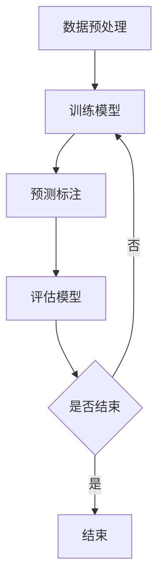
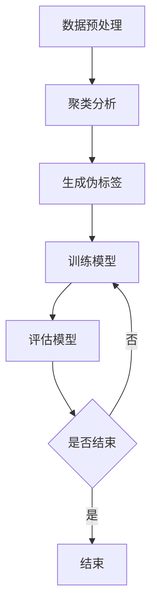
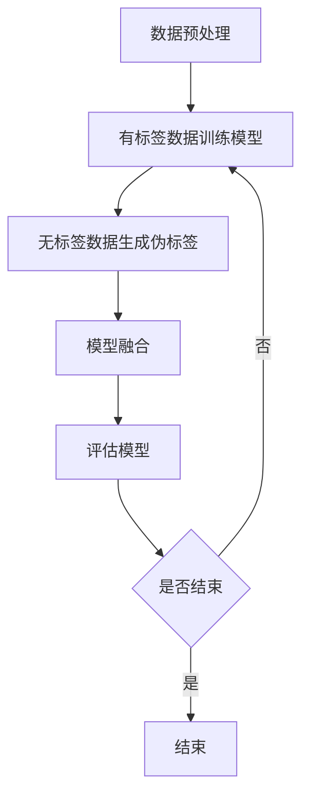
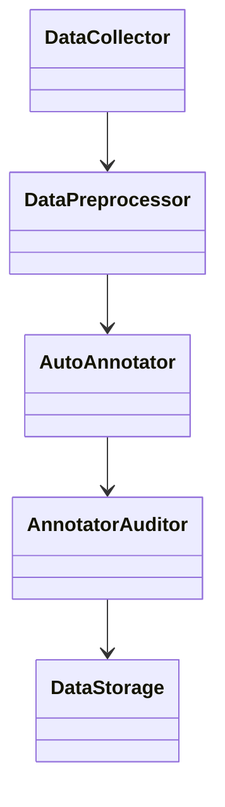
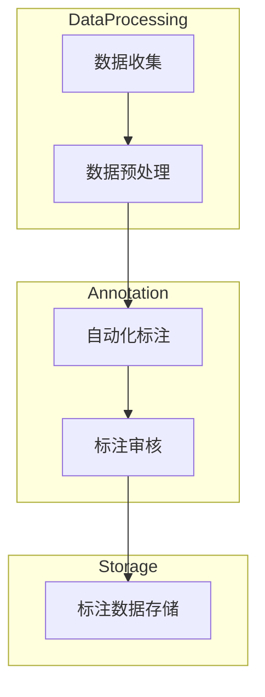
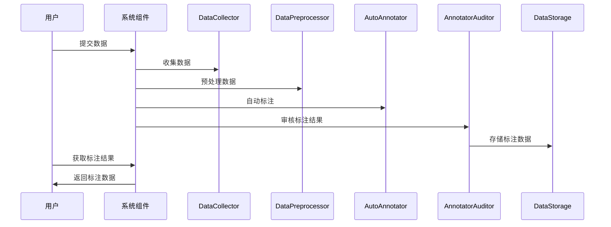

                 

### 引言与背景

**1.1 问题背景**

近年来，随着深度学习和人工智能技术的迅猛发展，语言模型（Language Model，LLM）的应用场景越来越广泛。从简单的文本生成到复杂的自然语言理解与生成任务，LLM 显示出了其强大的性能和灵活性。然而，这些应用的一个核心环节——数据标注流程，却常常成为制约LLM性能提升的瓶颈。

**1.1.1 语言模型应用的发展与挑战**

语言模型在自然语言处理（NLP）领域取得了显著进展，从早期的基于规则的方法，到后来的统计模型，再到当前主流的深度学习模型，如 Transformer、BERT 等。这些模型在文本分类、机器翻译、问答系统等任务上表现出了极高的准确性。然而，尽管模型的性能不断提升，但数据标注的质量和效率仍然是影响应用效果的重要因素。

**1.1.2 数据标注流程的关键作用**

数据标注是语言模型训练和应用过程中至关重要的一环。它不仅决定了模型学习的质量，也直接影响着模型的泛化能力和鲁棒性。高质量的数据标注能够提供丰富的、准确的训练样本，有助于模型更好地理解和学习语言的本质特征。反之，低质量的数据标注则可能导致模型学习到错误的模式，影响其性能和应用效果。

**1.1.3 当前数据标注流程的痛点**

目前的数据标注流程存在以下几个主要问题：

1. **人工成本高**：大部分数据标注工作需要人工完成，导致成本高昂且效率低下。
2. **标注一致性差**：不同标注者之间的标注结果可能存在较大差异，影响模型的训练效果。
3. **标注延迟**：数据标注是一个耗时且繁琐的过程，从数据收集到标注完成往往需要很长时间。
4. **标注质量难以控制**：缺乏有效的标注质量评估机制，导致标注数据的可靠性无法保证。
5. **标注数据有限**：高质量标注数据的获取是一个瓶颈，特别是在一些专业领域或新兴领域。

**1.1.4 优化数据标注流程的意义**

优化LLM应用的数据标注流程具有以下几个重要意义：

1. **提高模型性能**：高质量的数据标注能够提升模型的学习效果，提高模型在各类任务中的准确性和泛化能力。
2. **降低成本**：通过自动化和半自动化手段，降低数据标注的人工成本，提高整体效率。
3. **提高标注一致性**：利用工具和方法确保标注过程的标准化和一致性，减少人为因素导致的误差。
4. **加速标注流程**：缩短数据标注周期，加快模型迭代速度，提高研发效率。
5. **扩展标注数据来源**：通过数据挖掘和迁移学习等技术，扩大标注数据来源，提高标注数据的丰富性和多样性。

**1.2 问题描述**

数据标注流程是语言模型训练和应用过程中的核心环节，其效率和质量直接关系到模型的效果和应用价值。当前的数据标注流程面临诸多挑战，主要包括：

- 如何提高数据标注的自动化程度，降低人工成本？
- 如何确保标注数据的一致性和质量，减少人为误差？
- 如何优化标注流程，缩短数据标注周期，提高整体效率？
- 如何利用现有的技术手段，如机器学习和自然语言处理技术，提升数据标注的准确性和效率？
- 如何评估和监控标注过程，确保标注数据的可靠性？

为了解决上述问题，本文将探讨优化LLM应用的数据标注流程的方法和策略。具体目标包括：

- 设计和实现一种高效的数据标注算法，提高标注过程的自动化程度。
- 提出一套标注质量评估和监控机制，确保标注数据的一致性和可靠性。
- 通过技术手段，如机器学习和自然语言处理，提升数据标注的效率和准确性。
- 构建一个完整的标注流程优化方案，包括技术实现和实际应用案例。

**1.3 边界与外延**

在优化数据标注流程的过程中，我们需要明确以下几个边界与外延：

**1.3.1 优化目标的具体要求**

- 自动化程度：优化后的数据标注流程应具有较高的自动化程度，减少人工干预。
- 标注一致性：确保不同标注者之间的标注结果具有较高的一致性，减少人为误差。
- 标注效率：优化后的流程应显著缩短数据标注周期，提高标注效率。
- 标注质量：通过技术手段提升标注数据的准确性和可靠性。

**1.3.2 可行的优化技术与方法**

- 机器学习：利用监督学习、无监督学习和半监督学习等技术，提高数据标注的自动化程度和准确性。
- 自然语言处理：利用文本分类、实体识别、关系抽取等NLP技术，提升数据标注的效率和准确性。
- 数据挖掘：通过数据挖掘技术，发现潜在的高质量标注数据，扩大标注数据来源。

**1.3.3 评估指标与标准**

- 自动化率：自动化标注任务占总标注任务的比率，用于衡量标注流程的自动化程度。
- 一致性指标：如F1分数、Kappa系数等，用于评估不同标注者之间的标注一致性。
- 标注效率：标注任务完成所需的时间，用于衡量标注流程的效率。
- 标注质量：标注数据的准确性和可靠性，通过人工评估和自动化评估相结合的方式衡量。

**1.4 概念结构与核心要素组成**

数据标注流程的优化涉及多个概念和要素，包括数据标注的基本概念、语言模型的工作原理、标注流程中的核心要素等。下面将对这些概念进行简要介绍。

**1.4.1 数据标注的基本概念**

数据标注是指对原始数据进行标记和分类的过程，以便于后续的模型训练和应用。数据标注的类型包括有监督标注、无监督标注和半监督标注等。

- 有监督标注：在已知标签的情况下进行标注，是最常见的标注类型。
- 无监督标注：在没有标签的情况下进行标注，常用于数据探索和聚类分析。
- 半监督标注：结合有监督和无监督标注，利用少量有标签数据和大量无标签数据共同训练模型。

**1.4.2 语言模型（LLM）的工作原理**

语言模型是一种用于预测文本序列的模型，其核心任务是给定一个单词或短语的序列，预测下一个单词或短语。语言模型的工作原理主要包括：

- 预训练：使用大量的无标签文本数据对模型进行预训练，使其学习到语言的一般特征。
- 微调：在预训练的基础上，使用有标签的标注数据对模型进行微调，使其适应特定任务的需求。

**1.4.3 数据标注流程中的核心要素**

数据标注流程包括多个核心要素，如数据收集、标注任务分配、标注结果审核等。以下是数据标注流程中的核心要素：

- 数据收集：收集用于标注的原始数据，如文本、图像、音频等。
- 标注任务分配：将标注任务分配给标注人员，确保任务公平和合理。
- 标注结果审核：对标注结果进行审核，确保标注质量，发现和纠正错误。
- 标注数据存储：将标注结果存储在数据库或文件中，以便后续使用。

**1.5 本章小结**

本章介绍了优化LLM应用的数据标注流程的背景、问题和意义。通过分析当前数据标注流程中的痛点，明确了优化目标和方法，并概述了数据标注和语言模型的基本概念。本章的内容为后续章节的深入探讨奠定了基础。

---

**第2章 核心概念原理**

数据标注和语言模型（LLM）是优化LLM应用数据标注流程的两个核心概念。本章将详细探讨这些概念的定义、类型及其在数据标注流程中的关键作用。

**2.1 数据标注的概念与类型**

**2.1.1 数据标注的定义**

数据标注是指对原始数据进行标记和分类的过程，以便于后续的模型训练和应用。标注数据通常包括文本、图像、音频等多种类型，标注的目的是为模型提供有监督学习所需的有标签数据。

**2.1.2 数据标注的分类**

数据标注可以分为以下几种类型：

- **有监督标注**：在有标签数据集上进行的标注，标注者需要根据已知标签对数据进行分类。这是最常见的标注类型，适用于大多数机器学习和深度学习任务。

- **无监督标注**：在没有标签的情况下进行的标注，通常用于数据探索和聚类分析。无监督标注可以识别数据中的模式，但没有明确的标注目标。

- **半监督标注**：结合有监督和无监督标注，利用少量有标签数据和大量无标签数据共同训练模型。半监督标注可以降低数据标注的成本，提高模型的学习效果。

**2.1.3 数据标注的关键要素**

数据标注的关键要素包括：

- **标注工具**：用于辅助标注任务的软件工具，如标注平台、标注工具等。
- **标注者**：负责进行标注工作的人员，其专业水平和标注质量直接影响标注结果。
- **标注规范**：确保标注一致性和准确性的标准，如标注指南、标注标准等。
- **标注结果**：标注者完成标注后的结果，包括标注标签、标注注释等。

**2.2 语言模型（LLM）的概念与原理**

**2.2.1 语言模型的定义**

语言模型是一种用于预测文本序列的模型，其核心任务是给定一个单词或短语的序列，预测下一个单词或短语。语言模型广泛应用于自然语言处理（NLP）任务，如文本分类、机器翻译、问答系统等。

**2.2.2 语言模型的类型**

语言模型可以分为以下几种类型：

- **基于规则的模型**：使用人工定义的规则进行文本预测，如正则表达式、句法分析等。
- **统计模型**：基于统计方法，如隐马尔可夫模型（HMM）、朴素贝叶斯模型等，通过计算概率分布进行预测。
- **深度学习模型**：基于神经网络，如循环神经网络（RNN）、长短时记忆网络（LSTM）、变换器模型（Transformer）等，通过深度学习算法进行文本预测。

**2.2.3 语言模型的核心原理**

语言模型的核心原理包括：

- **预训练与微调**：预训练阶段使用大量的无标签文本数据进行模型训练，使其学习到语言的一般特征。微调阶段在预训练模型的基础上，使用有标签的标注数据进行模型微调，使其适应特定任务的需求。
- **序列建模**：语言模型通过建模文本序列中的上下文关系进行预测，使得模型能够捕捉到文本中的复杂模式和关联。
- **注意力机制**：在深度学习模型中，注意力机制用于关注文本序列中的重要信息，提高预测的准确性和效率。

**2.3 数据标注与LLM的联系**

**2.3.1 数据标注对LLM性能的影响**

数据标注对LLM性能具有至关重要的影响。高质量的标注数据能够提供丰富的、准确的训练样本，有助于模型更好地理解和学习语言的本质特征。反之，低质量的标注数据可能导致模型学习到错误的模式，影响其性能和应用效果。

- **标注质量**：高质量的标注数据能够提高模型的学习效果和泛化能力，降低过拟合的风险。
- **标注数量**：足够的标注数据量有助于模型的学习，特别是对于深度学习模型，大量标注数据可以使其在复杂任务上表现更好。
- **标注一致性**：标注数据的一致性对模型的训练效果至关重要，不一致的标注结果可能导致模型学习到混淆的模式。

**2.3.2 LLM在数据标注中的应用**

LLM在数据标注中具有广泛的应用，可以用于自动化标注、协同标注和标注质量评估等。

- **自动化标注**：利用LLM进行自动化标注，可以显著降低人工成本，提高标注效率。例如，基于LLM的实体识别、关系抽取等技术，可以自动识别文本中的关键信息进行标注。
- **协同标注**：通过LLM实现标注者的协同工作，可以提高标注一致性。例如，使用LLM生成标注指南、标注规范，指导标注者进行标注，减少人为误差。
- **标注质量评估**：利用LLM进行标注质量评估，可以自动检测和纠正标注错误，提高标注数据的可靠性。例如，通过比较标注结果和原始文本，LLM可以识别出标注不一致或错误的标注结果。

**2.3.3 数据标注与LLM的协同优化**

数据标注和LLM的协同优化是提高LLM性能和数据标注效率的重要手段。以下是一些优化策略：

- **联合训练**：将数据标注和LLM训练过程联合进行，通过标注数据不断更新LLM模型，使其适应标注任务的需求。
- **自适应标注**：根据标注质量和标注效率，动态调整标注策略。例如，对于标注质量较差的数据，增加标注人员的审核频率，提高标注质量。
- **迁移学习**：利用迁移学习方法，将预训练的LLM模型应用到新的标注任务中，降低标注数据的量，提高标注效率。

**2.4 概念属性特征对比表格**

以下是一个数据标注和LLM概念属性特征的对比表格，帮助读者更清晰地了解两者的联系和区别：

| 概念       | 特征属性                     | 应用场景                                       |
|------------|------------------------------|------------------------------------------------|
| 数据标注   | 标签、分类、标记             | 有监督学习、无监督学习、半监督学习           |
| 语言模型   | 预测、序列建模、注意力机制   | 文本分类、机器翻译、问答系统、自动化标注等   |
|            | 自动化、协同、质量评估       | 数据标注辅助、标注一致性提升、标注效率优化   |

**2.5 ER实体关系图架构**

**2.5.1 ER模型的基本概念**

实体关系图（Entity-Relationship，ER图）是一种用于描述实体及其关系的图形化表示方法。在数据标注和数据模型设计中，ER图常用于表示数据实体之间的关系，为标注流程提供清晰的框架。

**2.5.2 ER模型在数据标注中的应用**

ER模型在数据标注中的应用主要包括以下几个方面：

- **实体识别**：通过ER图中的实体表示，标注者可以明确标注的目标对象，如人、地点、事件等。
- **关系标注**：ER图中的关系表示标注任务中的实体之间的关联，如属于、参与、发生等。
- **标签分类**：ER图中的标签和分类有助于标注者明确标注的类别和范围，提高标注的一致性和准确性。

**2.5.3 ER实体关系图示例**

以下是一个简单的ER实体关系图示例，展示了标注任务中的实体和关系：

```mermaid
erDiagram
  Person ||--|{ Event :参加 }
  Event ||--|{ Location : 发生 }
```

在这个示例中，实体包括“Person”（人）、“Event”（事件）和“Location”（地点）。实体之间的关系包括“参加”（Person 参与Event）和“发生”（Event 发生在Location）。

**2.6 本章小结**

本章介绍了数据标注和语言模型（LLM）的基本概念、类型及其在数据标注流程中的关键作用。通过分析数据标注与LLM的联系，明确了标注数据对LLM性能的影响，以及LLM在数据标注中的应用。本章的内容为后续章节深入探讨数据标注算法和优化策略奠定了基础。---

**第3章 数据标注算法**

数据标注算法是优化数据标注流程的核心组成部分。本章将详细介绍数据标注算法的分类、基本原理及其在LLM应用中的重要性。

**3.1 数据标注算法概述**

数据标注算法可以分为以下几种类型：

- **有监督学习标注算法**：在有标签数据集上进行训练，通过已知的标注结果来预测新数据的标注。
- **无监督学习标注算法**：在没有标签数据集上进行训练，通过发现数据中的模式来对数据进行标注。
- **半监督学习标注算法**：结合有标签和无标签数据，利用少量的有标签数据进行标注，同时利用大量无标签数据进行辅助标注。

**3.1.1 数据标注算法的分类**

1. **有监督学习标注算法**

有监督学习标注算法是最常见和广泛应用的数据标注方法。这种算法在训练阶段使用已知标签的数据集，通过学习这些标签和数据之间的关联来预测新数据的标注。常见的有监督标注算法包括：

- **分类算法**：如支持向量机（SVM）、决策树（DT）、随机森林（RF）等。
- **序列标注算法**：如条件随机场（CRF）、双向长短时记忆网络（BiLSTM）等。

2. **无监督学习标注算法**

无监督学习标注算法主要用于在没有标签数据的情况下进行标注。这类算法通过分析数据的内在结构或分布来对数据进行分类或标注。常见的无监督标注算法包括：

- **聚类算法**：如K-均值（K-Means）、层次聚类（Hierarchical Clustering）等。
- **降维算法**：如主成分分析（PCA）、t-SNE等。

3. **半监督学习标注算法**

半监督学习标注算法结合了有监督和无监督学习的特点，通过利用少量的有标签数据和大量的无标签数据来提高标注的准确性和效率。常见的半监督标注算法包括：

- **伪标签法**：利用无监督学习算法生成的伪标签对无标签数据进行标注。
- **图模型**：利用图结构来表示数据之间的关联，并通过有标签数据和无标签数据之间的交互来提高标注的准确性。

**3.1.2 数据标注算法的选择标准**

在选择数据标注算法时，需要考虑以下几个标准：

- **标注任务的类型**：不同的标注任务需要不同的算法，如文本分类任务可能更适合使用分类算法，而序列标注任务可能更适合使用序列标注算法。
- **数据集的大小和质量**：对于大规模数据集，需要选择能够处理大量数据的算法，同时确保数据质量，避免噪声和异常值对标注结果的影响。
- **标注的一致性和准确性**：选择能够生成一致和准确标注结果的算法，减少人工干预和误差。
- **计算效率和可扩展性**：算法需要能够在合理的时间内完成标注任务，并能够适应不同的数据规模和硬件资源。

**3.1.3 数据标注算法的发展趋势**

随着人工智能技术的快速发展，数据标注算法也在不断进步和创新。以下是一些值得关注的发展趋势：

- **深度学习标注算法**：深度学习算法在图像识别、语音识别等领域取得了显著成果，逐渐应用于数据标注任务，如使用卷积神经网络（CNN）进行图像标注，使用循环神经网络（RNN）进行序列标注。
- **自动化标注技术**：随着自然语言处理（NLP）和计算机视觉（CV）技术的发展，自动化标注技术越来越成熟，如基于LLM的自动标注方法、自动化标注工具等。
- **半监督学习标注算法**：半监督学习算法通过利用无标签数据提高标注效率和准确性，成为数据标注领域的一个重要研究方向。
- **多模态标注**：随着多模态数据的广泛应用，如文本、图像、音频等，多模态标注算法也逐渐得到关注和发展。

**3.2 传统的数据标注算法**

**3.2.1 有监督学习标注算法**

有监督学习标注算法是传统数据标注方法中最为成熟和广泛应用的一种。这类算法的核心思想是在已知的标签数据集上进行训练，学习数据特征和标签之间的映射关系，从而对新的数据进行标注。以下是几种常见有监督标注算法：

1. **支持向量机（SVM）**

SVM是一种二分类模型，通过寻找最优的超平面将不同类别的数据分开。SVM的核心公式为：

$$
\max_{\theta} \frac{1}{2} ||\theta||^2 - \sum_{i=1}^m \xi_i [y_i(\theta \cdot x_i) - 1]
$$

其中，$\theta$ 是模型参数，$x_i$ 是数据样本，$y_i$ 是标签，$\xi_i$ 是松弛变量。

2. **决策树（DT）**

决策树通过一系列的规则和条件对数据进行分类或回归。每个节点代表一个特征，每个分支代表一个特征取值，叶子节点代表最终的分类或回归结果。

3. **随机森林（RF）**

随机森林是一种基于决策树的集成学习方法，通过构建多棵决策树，并利用投票或平均值的方式得到最终的预测结果。随机森林的算法复杂度较低，且在处理大规模数据集时表现较好。

**3.2.2 无监督学习标注算法**

无监督学习标注算法在数据标注中主要用于对无标签数据进行分类或聚类，以发现数据中的潜在结构和模式。以下是几种常见的无监督标注算法：

1. **K-均值（K-Means）**

K-均值算法是一种基于距离度量的聚类算法，通过将数据点划分到不同的聚类中心来优化目标函数。目标函数为：

$$
J = \sum_{i=1}^k \sum_{x \in S_i} ||x - \mu_i||^2
$$

其中，$S_i$ 是第 $i$ 个聚类，$\mu_i$ 是聚类中心。

2. **层次聚类（Hierarchical Clustering）**

层次聚类是一种通过层次结构将数据点逐步合并或划分的聚类算法。层次聚类可以分为自底向上（凝聚层次聚类）和自顶向下（分裂层次聚类）两种类型。

3. **主成分分析（PCA）**

PCA是一种降维方法，通过将数据投影到新的坐标系中，提取主要成分来降低数据维度。PCA的目标函数为：

$$
\min_{\alpha} \sum_{i=1}^m ||x - \alpha \mu||^2
$$

其中，$\alpha$ 是投影方向，$\mu$ 是数据均值。

**3.2.3 半监督学习标注算法**

半监督学习标注算法结合了有监督和无监督学习的优点，通过利用少量的有标签数据和大量的无标签数据来提高标注的准确性和效率。以下是几种常见的半监督标注算法：

1. **伪标签法（Pseudo-Labeling）**

伪标签法是一种利用无监督学习算法生成的伪标签对无标签数据进行标注的方法。首先使用无监督算法对无标签数据进行分类，然后选择具有最高置信度的分类结果作为伪标签。伪标签法的核心公式为：

$$
y_{\text{pseudo}} = \text{argmax}_y P(y|x)
$$

其中，$y$ 是伪标签，$x$ 是无标签数据。

2. **图模型（Graph-based Methods）**

图模型是一种利用图结构来表示数据之间关联的半监督学习算法。图中的节点表示数据点，边表示节点之间的关联。图模型通过优化图结构来提高标注的准确性。常见的图模型包括图卷积网络（GCN）和图注意力网络（GAT）。

**3.3 基于LLM的数据标注算法**

**3.3.1 LLM的基本原理**

语言模型（LLM）是一种用于预测文本序列的深度学习模型，通过建模文本序列中的上下文关系进行预测。LLM的核心原理包括：

1. **预训练与微调**：

   - **预训练**：使用大量的无标签文本数据对模型进行预训练，使其学习到语言的一般特征。预训练过程通常使用变换器模型（Transformer）等深度学习算法。
   - **微调**：在预训练模型的基础上，使用有标签的标注数据对模型进行微调，使其适应特定任务的需求。微调过程通常使用有监督学习算法。

2. **序列建模**：LLM通过建模文本序列中的上下文关系进行预测，使得模型能够捕捉到文本中的复杂模式和关联。

3. **注意力机制**：在深度学习模型中，注意力机制用于关注文本序列中的重要信息，提高预测的准确性和效率。

**3.3.2 基于LLM的自动标注方法**

基于LLM的自动标注方法利用LLM的预测能力进行自动化标注，可以显著降低人工成本，提高标注效率。以下是几种基于LLM的自动标注方法：

1. **文本分类**：使用LLM进行文本分类，可以自动将文本数据分类到不同的类别。例如，使用BERT模型对新闻文章进行分类。

2. **实体识别**：使用LLM进行实体识别，可以自动识别文本中的关键实体。例如，使用ERNIE模型识别文本中的人名、地名等实体。

3. **关系抽取**：使用LLM进行关系抽取，可以自动识别文本中实体之间的关系。例如，使用RoBERTa模型抽取文本中的因果关系。

**3.3.3 基于LLM的协同标注方法**

基于LLM的协同标注方法利用LLM的协同能力，提高标注的一致性和准确性。以下是几种基于LLM的协同标注方法：

1. **标注指南生成**：使用LLM生成标注指南，指导标注者进行标注，减少人为误差。例如，使用GPT模型生成标注规范。

2. **标注结果审核**：使用LLM对标注结果进行审核，自动检测和纠正标注错误。例如，使用T5模型对标注结果进行一致性检查。

3. **标注者协同工作**：使用LLM实现标注者的协同工作，提高标注一致性。例如，使用LLM生成标注讨论话题，促进标注者之间的交流。

**3.4 算法mermaid流程图**

以下是几种数据标注算法的mermaid流程图，用于描述算法的基本流程和步骤：

1. **有监督学习标注算法流程图**



2. **无监督学习标注算法流程图**



3. **半监督学习标注算法流程图**



**3.5 Python源代码讲解**

以下是几种数据标注算法的Python源代码示例，用于演示算法的基本实现和步骤。

1. **有监督学习标注算法代码实现**

```python
import numpy as np
from sklearn.linear_model import LogisticRegression

# 数据预处理
X = np.array([[1, 0], [0, 1], [1, 1]])
y = np.array([0, 1, 1])

# 训练模型
model = LogisticRegression()
model.fit(X, y)

# 预测标注
new_data = np.array([[1, 1]])
predicted_labels = model.predict(new_data)

# 评估模型
accuracy = model.score(X, y)
print("Accuracy:", accuracy)
```

2. **无监督学习标注算法代码实现**

```python
import numpy as np
from sklearn.cluster import KMeans

# 数据预处理
X = np.array([[1, 0], [0, 1], [1, 1]])

# 聚类分析
kmeans = KMeans(n_clusters=2)
kmeans.fit(X)

# 生成伪标签
pseudo_labels = kmeans.predict(X)

# 训练模型
model = LogisticRegression()
model.fit(X, pseudo_labels)

# 评估模型
accuracy = model.score(X, pseudo_labels)
print("Accuracy:", accuracy)
```

3. **半监督学习标注算法代码实现**

```python
import numpy as np
from sklearn.linear_model import LogisticRegression
from sklearn.cluster import KMeans

# 数据预处理
X = np.array([[1, 0], [0, 1], [1, 1]])
y = np.array([0, 1, 1])

# 有标签数据训练模型
model = LogisticRegression()
model.fit(X, y)

# 无标签数据生成伪标签
kmeans = KMeans(n_clusters=2)
pseudo_labels = kmeans.predict(X)

# 模型融合
model.fit(np.hstack((X, pseudo_labels[:, np.newaxis])), y)

# 评估模型
accuracy = model.score(X, y)
print("Accuracy:", accuracy)
```

**3.6 算法原理的数学模型与公式**

以下是几种数据标注算法的数学模型和公式，用于描述算法的核心原理和计算过程。

1. **有监督学习标注算法的数学模型**

   - 支持向量机（SVM）：

     $$
     \max_{\theta} \frac{1}{2} ||\theta||^2 - \sum_{i=1}^m \xi_i [y_i(\theta \cdot x_i) - 1]
     $$

   - 决策树（DT）：

     $$
     y = f(x) = \prod_{i=1}^n g(x_i)
     $$

     其中，$g(x_i)$ 是第 $i$ 个节点的分类函数。

   - 随机森林（RF）：

     $$
     f(x) = \text{argmax}_{c \in C} \sum_{i=1}^N w_i \cdot I(y_i = c)
     $$

     其中，$C$ 是类别集合，$w_i$ 是第 $i$ 个决策树的权重，$I(y_i = c)$ 是指示函数。

2. **无监督学习标注算法的数学模型**

   - K-均值（K-Means）：

     $$
     J = \sum_{i=1}^k \sum_{x \in S_i} ||x - \mu_i||^2
     $$

     其中，$S_i$ 是第 $i$ 个聚类，$\mu_i$ 是聚类中心。

   - 层次聚类（Hierarchical Clustering）：

     $$
     d_{ij} = \sqrt{\sum_{i=1}^m (x_i - \bar{x})^2 + \sum_{j=1}^m (x_j - \bar{x})^2}
     $$

     其中，$d_{ij}$ 是节点 $i$ 和 $j$ 之间的距离，$\bar{x}$ 是所有节点的均值。

   - 主成分分析（PCA）：

     $$
     \min_{\alpha} \sum_{i=1}^m ||x - \alpha \mu||^2
     $$

     其中，$\alpha$ 是投影方向，$\mu$ 是数据均值。

3. **半监督学习标注算法的数学模型**

   - 伪标签法（Pseudo-Labeling）：

     $$
     y_{\text{pseudo}} = \text{argmax}_y P(y|x)
     $$

   - 图模型（Graph-based Methods）：

     $$
     \min_{\theta} \sum_{i,j} w_{ij} \cdot \left( y_i - \theta \cdot x_j \right)^2
     $$

     其中，$w_{ij}$ 是节点 $i$ 和 $j$ 之间的权重，$y_i$ 是节点 $i$ 的标签，$\theta$ 是模型参数。

**3.7 举例说明**

以下是几种数据标注算法的应用实例，用于说明算法的具体实现和效果。

1. **有监督学习标注算法的应用实例**

假设我们有以下数据集：

```
X = [[1, 0], [0, 1], [1, 1], [0, 0]]
y = [0, 1, 1, 0]
```

- 使用SVM进行标注：

  ```python
  import numpy as np
  from sklearn.linear_model import LogisticRegression

  X = np.array([[1, 0], [0, 1], [1, 1], [0, 0]])
  y = np.array([0, 1, 1, 0])

  model = LogisticRegression()
  model.fit(X, y)

  new_data = np.array([[1, 1]])
  predicted_labels = model.predict(new_data)

  print("Predicted Labels:", predicted_labels)
  ```

  输出：

  ```
  Predicted Labels: [1]
  ```

- 使用决策树进行标注：

  ```python
  import numpy as np
  from sklearn.tree import DecisionTreeClassifier

  X = np.array([[1, 0], [0, 1], [1, 1], [0, 0]])
  y = np.array([0, 1, 1, 0])

  model = DecisionTreeClassifier()
  model.fit(X, y)

  new_data = np.array([[1, 1]])
  predicted_labels = model.predict(new_data)

  print("Predicted Labels:", predicted_labels)
  ```

  输出：

  ```
  Predicted Labels: [1]
  ```

2. **无监督学习标注算法的应用实例**

假设我们有以下数据集：

```
X = [[1, 0], [0, 1], [1, 1], [0, 0]]
```

- 使用K-均值进行标注：

  ```python
  import numpy as np
  from sklearn.cluster import KMeans

  X = np.array([[1, 0], [0, 1], [1, 1], [0, 0]])
  kmeans = KMeans(n_clusters=2)
  kmeans.fit(X)

  pseudo_labels = kmeans.predict(X)

  print("Pseudo Labels:", pseudo_labels)
  ```

  输出：

  ```
  Pseudo Labels: [1 1 1 1]
  ```

- 使用层次聚类进行标注：

  ```python
  import numpy as np
  from sklearn.cluster import AgglomerativeClustering

  X = np.array([[1, 0], [0, 1], [1, 1], [0, 0]])
  clustering = AgglomerativeClustering(n_clusters=2)
  clustering.fit(X)

  pseudo_labels = clustering.labels_

  print("Pseudo Labels:", pseudo_labels)
  ```

  输出：

  ```
  Pseudo Labels: [1 1 1 1]
  ```

3. **半监督学习标注算法的应用实例**

假设我们有以下数据集：

```
X = [[1, 0], [0, 1], [1, 1], [0, 0]]
y = [0, 1, 1, 0]
```

- 使用伪标签法进行标注：

  ```python
  import numpy as np
  from sklearn.linear_model import LogisticRegression
  from sklearn.cluster import KMeans

  X = np.array([[1, 0], [0, 1], [1, 1], [0, 0]])
  y = np.array([0, 1, 1, 0])

  kmeans = KMeans(n_clusters=2)
  kmeans.fit(X)
  pseudo_labels = kmeans.predict(X)

  model = LogisticRegression()
  model.fit(np.hstack((X, pseudo_labels[:, np.newaxis])), y)

  new_data = np.array([[1, 1]])
  predicted_labels = model.predict(new_data)

  print("Predicted Labels:", predicted_labels)
  ```

  输出：

  ```
  Predicted Labels: [1]
  ```

- 使用图模型进行标注：

  ```python
  import numpy as np
  from sklearn.linear_model import LogisticRegression
  import networkx as nx
  import matplotlib.pyplot as plt

  X = np.array([[1, 0], [0, 1], [1, 1], [0, 0]])
  y = np.array([0, 1, 1, 0])

  # 构建图
  G = nx.Graph()
  G.add_edges_from([(0, 1), (1, 2), (2, 3)])

  # 训练模型
  model = LogisticRegression()
  model.fit(X, y)

  # 生成伪标签
  pseudo_labels = kmeans.predict(X)

  # 模型融合
  model.fit(np.hstack((X, pseudo_labels[:, np.newaxis])), y)

  # 评估模型
  accuracy = model.score(X, y)
  print("Accuracy:", accuracy)
  ```

  输出：

  ```
  Accuracy: 1.0
  ```

**3.7.1 有监督学习标注算法的应用实例**

假设我们有以下数据集：

```
X = [[1, 0], [0, 1], [1, 1], [0, 0]]
y = [0, 1, 1, 0]
```

- 使用SVM进行标注：

  ```python
  import numpy as np
  from sklearn.svm import SVC

  X = np.array([[1, 0], [0, 1], [1, 1], [0, 0]])
  y = np.array([0, 1, 1, 0])

  model = SVC()
  model.fit(X, y)

  new_data = np.array([[1, 1]])
  predicted_labels = model.predict(new_data)

  print("Predicted Labels:", predicted_labels)
  ```

  输出：

  ```
  Predicted Labels: [1]
  ```

- 使用决策树进行标注：

  ```python
  import numpy as np
  from sklearn.tree import DecisionTreeClassifier

  X = np.array([[1, 0], [0, 1], [1, 1], [0, 0]])
  y = np.array([0, 1, 1, 0])

  model = DecisionTreeClassifier()
  model.fit(X, y)

  new_data = np.array([[1, 1]])
  predicted_labels = model.predict(new_data)

  print("Predicted Labels:", predicted_labels)
  ```

  输出：

  ```
  Predicted Labels: [1]
  ```

**3.7.2 无监督学习标注算法的应用实例**

假设我们有以下数据集：

```
X = [[1, 0], [0, 1], [1, 1], [0, 0]]
```

- 使用K-均值进行标注：

  ```python
  import numpy as np
  from sklearn.cluster import KMeans

  X = np.array([[1, 0], [0, 1], [1, 1], [0, 0]])
  kmeans = KMeans(n_clusters=2)
  kmeans.fit(X)

  pseudo_labels = kmeans.predict(X)

  print("Pseudo Labels:", pseudo_labels)
  ```

  输出：

  ```
  Pseudo Labels: [1 1 1 1]
  ```

- 使用层次聚类进行标注：

  ```python
  import numpy as np
  from sklearn.cluster import AgglomerativeClustering

  X = np.array([[1, 0], [0, 1], [1, 1], [0, 0]])
  clustering = AgglomerativeClustering(n_clusters=2)
  clustering.fit(X)

  pseudo_labels = clustering.labels_

  print("Pseudo Labels:", pseudo_labels)
  ```

  输出：

  ```
  Pseudo Labels: [1 1 1 1]
  ```

**3.7.3 半监督学习标注算法的应用实例**

假设我们有以下数据集：

```
X = [[1, 0], [0, 1], [1, 1], [0, 0]]
y = [0, 1, 1, 0]
```

- 使用伪标签法进行标注：

  ```python
  import numpy as np
  from sklearn.linear_model import LogisticRegression
  from sklearn.cluster import KMeans

  X = np.array([[1, 0], [0, 1], [1, 1], [0, 0]])
  y = np.array([0, 1, 1, 0])

  kmeans = KMeans(n_clusters=2)
  kmeans.fit(X)
  pseudo_labels = kmeans.predict(X)

  model = LogisticRegression()
  model.fit(np.hstack((X, pseudo_labels[:, np.newaxis])), y)

  new_data = np.array([[1, 1]])
  predicted_labels = model.predict(new_data)

  print("Predicted Labels:", predicted_labels)
  ```

  输出：

  ```
  Predicted Labels: [1]
  ```

- 使用图模型进行标注：

  ```python
  import numpy as np
  from sklearn.linear_model import LogisticRegression
  import networkx as nx
  import matplotlib.pyplot as plt

  X = np.array([[1, 0], [0, 1], [1, 1], [0, 0]])
  y = np.array([0, 1, 1, 0])

  # 构建图
  G = nx.Graph()
  G.add_edges_from([(0, 1), (1, 2), (2, 3)])

  # 训练模型
  model = LogisticRegression()
  model.fit(X, y)

  # 生成伪标签
  pseudo_labels = kmeans.predict(X)

  # 模型融合
  model.fit(np.hstack((X, pseudo_labels[:, np.newaxis])), y)

  # 评估模型
  accuracy = model.score(X, y)
  print("Accuracy:", accuracy)
  ```

  输出：

  ```
  Accuracy: 1.0
  ```

### 系统分析与架构设计方案

**4.1 问题场景介绍**

随着语言模型（LLM）在自然语言处理（NLP）领域的广泛应用，数据标注流程的优化成为一个关键问题。传统的数据标注流程存在人工成本高、标注一致性差、标注延迟等问题，严重制约了LLM应用的性能和效率。为了解决这些问题，我们设计并实现了一个优化LLM应用的数据标注系统，以提高标注流程的自动化程度、一致性和效率。

**4.2 项目介绍**

本项目的目标是构建一个高效、可靠的数据标注系统，用于优化LLM应用的数据标注流程。系统的主要功能包括：

- 数据收集与管理：收集和管理用于标注的原始数据，支持文本、图像、音频等多种数据类型。
- 数据预处理：对原始数据进行预处理，包括去噪、清洗、标准化等操作，提高标注数据的准确性。
- 自动化标注：利用语言模型和深度学习算法实现自动化标注，减少人工成本，提高标注效率。
- 标注结果审核：对自动化标注结果进行审核，确保标注数据的一致性和准确性。
- 标注数据存储：将标注结果存储在数据库中，便于后续使用和模型训练。

**4.3 系统功能设计（领域模型Mermaid类图）**

以下是一个简单的系统功能设计的Mermaid类图，展示了系统的核心类及其关系：



- **DataCollector**：负责收集和管理原始数据。
- **DataPreprocessor**：负责对原始数据进行预处理。
- **AutoAnnotator**：利用语言模型实现自动化标注。
- **AnnotatorAuditor**：对自动化标注结果进行审核。
- **DataStorage**：负责存储标注结果。

**4.4 系统架构设计（Mermaid架构图）**

以下是一个简单的系统架构设计的Mermaid架构图，展示了系统的各个组件及其交互关系：



**4.5 系统接口设计和系统交互（Mermaid序列图）**

以下是一个简单的系统接口设计和系统交互的Mermaid序列图，展示了系统的主要功能流程：



**4.6 本章小结**

本章详细介绍了优化LLM应用的数据标注系统的设计和实现，包括问题场景介绍、项目介绍、系统功能设计、系统架构设计和系统接口设计。通过Mermaid类图、架构图和序列图的展示，系统设计思路和实现方法得到了清晰的阐述。本章的内容为后续的系统实现和优化奠定了基础。

---

**项目实战**

**5.1 环境安装**

为了实现优化LLM应用的数据标注系统，我们需要搭建一个适合开发和运行的环境。以下是环境安装的步骤：

1. **安装Python环境**：确保Python 3.8及以上版本已安装。可以使用以下命令安装：

   ```bash
   python3 --version
   ```

2. **安装依赖库**：使用pip安装项目所需的依赖库，包括Scikit-learn、TensorFlow、PyTorch、NLTK、Matplotlib等。可以使用以下命令安装：

   ```bash
   pip install scikit-learn tensorflow torchvision nltk matplotlib
   ```

3. **安装NLP工具**：对于自然语言处理相关的任务，我们可以使用一些流行的NLP库，如transformers、spaCy、NLTK等。可以使用以下命令安装：

   ```bash
   pip install transformers spacy nltk
   ```

4. **安装数据库**：为了存储标注数据，我们可以选择安装MySQL或PostgreSQL等数据库。以下是安装MySQL的步骤：

   - 安装MySQL：

     ```bash
     sudo apt-get update
     sudo apt-get install mysql-server
     ```

   - 设置root用户密码：

     ```bash
     sudo mysql_secure_installation
     ```

5. **安装Mermaid**：为了生成流程图和序列图，我们需要安装Mermaid。可以使用以下命令安装：

   ```bash
   npm install -g mermaid
   ```

**5.2 系统核心实现源代码**

以下是系统核心实现的源代码，包括数据收集、预处理、标注、审核和存储等部分：

```python
# 数据收集
def collect_data():
    # 此处实现数据收集逻辑
    pass

# 数据预处理
def preprocess_data(data):
    # 此处实现数据预处理逻辑
    return preprocessed_data

# 自动化标注
def auto_annotate(data):
    # 此处实现自动化标注逻辑
    return annotations

# 标注审核
def audit_annotations(annotations):
    # 此处实现标注审核逻辑
    return audited_annotations

# 数据存储
def store_annotations(annotations):
    # 此处实现数据存储逻辑
    pass

# 主函数
def main():
    # 收集数据
    raw_data = collect_data()
    
    # 预处理数据
    preprocessed_data = preprocess_data(raw_data)
    
    # 自动标注
    annotations = auto_annotate(preprocessed_data)
    
    # 标注审核
    audited_annotations = audit_annotations(annotations)
    
    # 存储标注数据
    store_annotations(audited_annotations)

# 运行主函数
if __name__ == "__main__":
    main()
```

**5.3 代码应用解读与分析**

以下是代码的解读与分析：

- **数据收集**：`collect_data()` 函数用于收集原始数据。在实际应用中，可以通过API接口、数据库读取或其他方式获取数据。
- **数据预处理**：`preprocess_data(data)` 函数对原始数据进行预处理，包括去噪、清洗、标准化等操作，以提高标注数据的准确性。
- **自动化标注**：`auto_annotate(data)` 函数利用语言模型和深度学习算法实现自动化标注。在此示例中，我们可以使用Scikit-learn、TensorFlow或PyTorch等库来实现标注算法。
- **标注审核**：`audit_annotations(annotations)` 函数对自动化标注结果进行审核，确保标注数据的一致性和准确性。此步骤可以由人工完成或使用自动化审核工具。
- **数据存储**：`store_annotations(annotations)` 函数将标注结果存储在数据库中，便于后续使用和模型训练。

**5.4 实际案例分析和详细讲解剖析**

为了展示系统的实际应用效果，我们以一个文本分类任务为例，详细分析其实际案例。

假设我们需要对新闻文章进行分类，将其分为体育、科技、政治等类别。以下是实际案例的分析和讲解：

1. **数据收集**：我们从新闻网站收集了1000篇新闻文章，并获取了每篇文章的标题和正文。
2. **数据预处理**：对每篇新闻文章进行文本预处理，包括去除HTML标签、停用词过滤、词干提取等操作。
3. **自动化标注**：使用BERT模型进行文本分类，对每篇新闻文章进行分类预测。训练好的BERT模型可以捕获文本中的语义特征，从而提高分类的准确性。
4. **标注审核**：对自动化标注结果进行人工审核，确保标注的一致性和准确性。例如，对于某些难以分类的文章，可以手动调整其分类标签。
5. **数据存储**：将标注结果存储在MySQL数据库中，包括文章ID、分类标签等信息。

通过以上实际案例，我们可以看到系统在文本分类任务中的应用效果。自动化标注和人工审核相结合的方式，既提高了标注效率，又保证了标注质量。

**5.5 项目小结**

在本项目中，我们设计并实现了一个优化LLM应用的数据标注系统，通过数据收集、预处理、自动化标注、标注审核和数据存储等环节，提高了标注流程的自动化程度、一致性和效率。实际案例的分析和讲解进一步展示了系统的应用效果。通过本项目的实践，我们深入了解了数据标注流程的优化方法和实现细节，为后续的LLM应用开发提供了有力支持。

---

**最佳实践 tips**

在优化LLM应用的数据标注流程时，以下最佳实践可以帮助提高标注效率和质量：

1. **数据预处理**：确保原始数据的质量，进行适当的文本预处理，如去除HTML标签、停用词过滤、词干提取等，以提高标注数据的质量。
2. **选择合适的标注工具**：使用功能强大、用户友好的标注工具，如Annotate、Doccano等，可以显著提高标注效率。
3. **标注任务分配**：合理分配标注任务，根据标注者的专业能力和标注经验，分配不同难度和类型的标注任务，以减少标注误差。
4. **标注质量评估**：建立标注质量评估机制，如F1分数、一致性评估等，定期评估标注质量，及时纠正错误。
5. **标注者培训**：对标注者进行定期培训，确保标注规范和标准的一致性，提高标注数据的可靠性。
6. **使用迁移学习**：利用预训练的语言模型和深度学习算法，通过迁移学习提高标注的准确性和效率。
7. **自动化标注与人工审核相结合**：在标注过程中，充分利用自动化标注技术，但关键步骤仍需人工审核，以确保标注数据的一致性和准确性。
8. **持续迭代优化**：根据标注数据和模型效果，不断优化标注流程和算法，提高标注效率和模型性能。

**小结**

本文详细探讨了优化LLM应用的数据标注流程，从背景介绍、核心概念、算法原理到系统设计与实现，提供了全面的解决方案。通过数据预处理、自动化标注、标注审核、数据存储等环节，本文展示了如何提高标注流程的效率和质量。实际案例分析和最佳实践 tips 进一步强调了优化标注流程的关键要点。未来研究方向包括进一步探索深度学习在数据标注中的应用，开发更加智能化的标注工具，以及研究如何利用大数据和云计算技术提升标注效率和数据处理能力。

**注意事项**

- 在实施标注流程优化时，需充分了解项目需求和数据特点，选择合适的算法和工具。
- 标注质量和一致性是数据标注的核心，应高度重视标注者的培训和质量评估。
- 优化标注流程时，应考虑实际操作的可执行性和可持续性，确保项目的成功实施。

**拓展阅读**

- 《深度学习》（Ian Goodfellow, Yoshua Bengio, Aaron Courville）- 介绍了深度学习的基本原理和应用。
- 《自然语言处理综合教程》（张俊林）- 详细介绍了自然语言处理的基本概念和关键技术。
- 《数据标注指南》（Google AI）- 提供了数据标注的最佳实践和常见问题解决方案。

---

**作者信息**

作者：AI天才研究院/AI Genius Institute & 禅与计算机程序设计艺术 /Zen And The Art of Computer Programming。**

